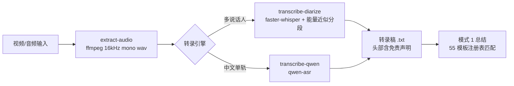

# Cangjie（仓颉）— 内容转化与精炼技能

> 四种内容转化模式：总结成结构化笔记/产品文档、生成文生视频分镜脚本、去除 AI 写作痕迹、创建 Excalidraw 图表。按用户意图路由，意图不明时列出候选模式让用户选择，不猜测。

[](https://github.com/Kirky-X/cangjie/releases)
[](LICENSE)

中文 | [English](README_EN.md)

## ✨ 功能特性

**四模式路由**（触发信号见 [SKILL.md](SKILL.md)）：

| 模式 | 功能 | 模式文件 |
| ---- | ---- | -------- |
| 1 · 内容总结（默认） | 文本/音频/视频/转录稿/论文 → 结构化笔记或 PRD/TRD/BP/竞品分析/文献综述等产品文档 | [modes/summarization.md](modes/summarization.md) |
| 2 · 视频脚本 | 文章/想法 → 逐镜头分镜脚本（LTX-2 文生视频提示词规范） | [modes/video-script.md](modes/video-script.md) |
| 3 · 去 AI 痕迹 | 去除文本 AI 写作痕迹 | [modes/humanization.md](modes/humanization.md) |
| 4 · 画图 | `.excalidraw` JSON 图表（流程/架构/概念），渲染为 PNG | [modes/diagram.md](modes/diagram.md) |

**55 个模板注册表**（`references/registry.yaml`，6 族）：product 26 / analysis 9 / learning 6 / meeting 5 / business 5 / media 4。每个模板定义 required_sections / optional_sections / detection_signals / fallback（生成后 required_sections 无法填充时的回落模板）。自动匹配多命中时按信号命中数列出候选让用户选；无命中回落默认族。

**质量护栏**：所有总结必须落盘 `.md` 文件，禁止仅对话展示；书籍默认 1 个全书综述 + N 个独立章节文件（全书文件须有全书级提炼，不是章节拼接）；缺材料明确标注"材料未提供/无法确认"，禁止硬凑；章节 >12 自动启用分层压缩。

**详略三级**：`brief`（结论为主）/ `standard-detailed`（默认，章节齐全+事实证据充分）/ `deep-dive`（加深层级与证据密度）。

**转写免责**：`transcribe-diarize` 的 `SpeakerN` 标签是**基于能量变化的近似分段**（非声纹识别），输出文件头部自带免责声明；下游纪要须写"近似归属/同一发言段"，不得把说话人归属当作事实。

## 📦 安装

```bash
# 方式一：从本仓库同步到 agent 技能目录（~/.zcode/skills 与 ~/.claude/skills）
bash scripts/sync-skills.sh cangjie

# 方式二：手动复制
cp -r cangjie ~/.zcode/skills/cangjie
# 方式三：远程安装（GitHub 仓库）
npx skills add Kirky-X/cangjie --agent claude-code -y
```

依赖 `Python >= 3.8`。使用音频转写前需安装依赖（首跑一次）：

```bash
pip install -r requirements.txt   # torch / faster-whisper / librosa / numpy / qwen-asr
apt install ffmpeg                # 视频提取音频
```

图表渲染（模式 4）另需 Playwright：`cd references/excalidraw && uv sync && uv run playwright install chromium`。GPU 检查：`python -c "import torch; print('CUDA:', torch.cuda.is_available())"`；无 GPU 时 faster-whisper 自动回落 cpu + int8。

## 🚀 快速开始

```bash
# 一键流水线：视频 → 提取音频 → 转录 → 输出
python3 scripts/cangjie.py pipeline input.mp4 --engine faster-whisper

# 单步执行；音频默认保留，--cleanup 显式清理（反向开关）
python3 scripts/cangjie.py extract-audio input.mp4
python3 scripts/cangjie.py transcribe-diarize input.wav output.txt --num-speakers 3 --language zh
python3 scripts/cangjie.py transcribe-qwen input.wav output.txt

# 渲染 Excalidraw JSON 为 PNG（默认 2x 缩放）
python3 references/excalidraw/render_excalidraw.py diagram.excalidraw
```

自然语言触发示例：`把这篇论文总结成阅读笔记`、`把这段会议录音生成决策纪要`、`把这篇文章改成视频分镜`、`去掉这段文字的 AI 味`、`画一张(excalidraw)架构图`。



## ✅ 测试与验证

本 skill 无自动化测试套件，验证以真实命令实跑为准：

- `python3 scripts/cangjie.py --help`：确认 4 个子命令（extract-audio / transcribe-diarize / transcribe-qwen / pipeline）及 `--cleanup` 反向开关说明正常输出
- `python3 references/excalidraw/render_excalidraw.py --help`：渲染器参数（--output/--scale/--width）正常
- 模板数实测：解析 `references/registry.yaml` 得 55 个模板（product 26 / analysis 9 / learning 6 / meeting 5 / business 5 / media 4）
- 渲染链路依赖 esm.sh 钉版 `@excalidraw/excalidraw@0.17.6`（见 `references/excalidraw/render_template.html`），避免未钉版漂移导致静默渲染失败；需网络可达 esm.sh
- 转写/渲染全流程需 ffmpeg + ASR 模型 + Chromium，本机未装时上述命令按依赖缺失报错即符合预期

## 📁 目录结构

```
cangjie/
├── SKILL.md                      # 入口：模式路由表 + 共享资源索引
├── requirements.txt              # ASR 依赖（torch/faster-whisper/librosa/qwen-asr）
├── modes/                        # 4 个模式工作流（summarization/video-script/humanization/diagram）
├── references/
│   ├── registry.yaml             # 55 模板注册表（含 fallback）
│   ├── taxonomy.yaml             # 模板分类体系
│   ├── families/*.yaml           # 6 模板族定义
│   ├── guides/                   # 模板选择/输出骨架/详略策略/视频提示词规范等
│   └── excalidraw/               # 渲染脚本 + 调色板 + JSON 结构（esm.sh 钉 0.17.6）
├── templates/                    # 31 个文档模板
└── scripts/                      # cangjie.py 统一 CLI + 转录脚本
```

## 🔮 边界

- AI 画图/插画生成用 **wudaozi**，产品 UI 设计用 **maliang**——本 skill 的画图仅指 Excalidraw 图表
- 转写说话人标签为能量近似分段，不承诺声纹级身份识别
- 不做无材料硬凑：required_sections 缺料时标注而非虚构；不把章节拼接当全书综述、不把讨论纪要伪装成决策纪要
- 不凭训练记忆写第三方 API 调用代码，须先用 `chub` 获取最新文档

## 📄 License 与归属

[MIT](LICENSE) © Kirky-X。安装/同步与退役治理由仓库根目录 `scripts/sync-skills.sh` 统一管理。
