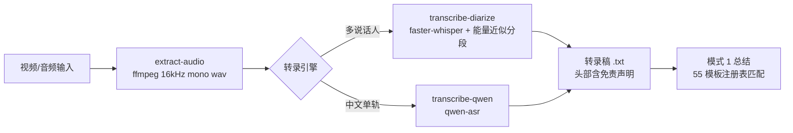

# Cangjie — Content Transformation & Refinement Skill

> Four content-transformation modes: summarizing into structured notes / product docs, generating text-to-video storyboard scripts, removing AI writing traces, and creating Excalidraw diagrams. Routing follows user intent; when intent is unclear, candidate modes are listed for the user to choose — no guessing.

English | [中文](README.md)

[](https://github.com/Kirky-X/cangjie/releases)
[](LICENSE)

## ✨ Features

**Four-mode routing** (trigger signals in [SKILL.md](SKILL.md)):

| Mode | Function | Mode file |
| ---- | ---- | -------- |
| 1 · Content Summarization (default) | Text/audio/video/transcripts/papers → structured notes or product docs such as PRD/TRD/BP/competitive analysis/literature review | [modes/summarization.md](modes/summarization.md) |
| 2 · Video Script | Articles/ideas → shot-by-shot storyboard scripts (LTX-2 text-to-video prompt spec) | [modes/video-script.md](modes/video-script.md) |
| 3 · AI-Trace Removal | Removes AI writing traces from text | [modes/humanization.md](modes/humanization.md) |
| 4 · Diagram | `.excalidraw` JSON diagrams (flow/architecture/concept), rendered to PNG | [modes/diagram.md](modes/diagram.md) |

**55-template registry** (`references/registry.yaml`, 6 families): product 26 / analysis 9 / learning 6 / meeting 5 / business 5 / media 4. Each template defines required_sections / optional_sections / detection_signals / fallback (the fallback template used when required_sections cannot be filled after generation). When auto-matching hits multiple templates, candidates are listed by signal-hit count for the user to pick; with zero hits it falls back to the default family.

**Quality guardrails**: every summary must be written to disk as a `.md` file — conversation-only display is forbidden; books default to 1 whole-book review + N independent chapter files (the whole-book file must contain book-level synthesis, not stitched chapters); missing material is explicitly marked "material not provided / cannot be confirmed" — padding is forbidden; hierarchical compression is enabled automatically when chapters > 12.

**Three detail levels**: `brief` (conclusion-centric) / `standard-detailed` (default, complete sections + solid factual evidence) / `deep-dive` (deeper hierarchy and denser evidence).

**Transcription disclaimer**: the `SpeakerN` labels of `transcribe-diarize` are **energy-fluctuation-based approximate segmentation** (not voiceprint identification), and the output file header carries a built-in disclaimer; downstream minutes must say "approximate attribution / same speech segment" and must never treat speaker attribution as fact.

## 📦 Installation

```bash
# 方式一：从本仓库同步到 agent 技能目录（~/.zcode/skills 与 ~/.claude/skills）
bash scripts/sync-skills.sh cangjie

# 方式二：手动复制
cp -r cangjie ~/.zcode/skills/cangjie
# Option 3: Remote install (GitHub repo)
npx skills add Kirky-X/cangjie --agent claude-code -y
```

Requires `Python >= 3.8`. Install the dependencies before using audio transcription (once, on the first run):

```bash
pip install -r requirements.txt   # torch / faster-whisper / librosa / numpy / qwen-asr
apt install ffmpeg                # 视频提取音频
```

Diagram rendering (mode 4) additionally requires Playwright: `cd references/excalidraw && uv sync && uv run playwright install chromium`. GPU check: `python -c "import torch; print('CUDA:', torch.cuda.is_available())"`; without a GPU, faster-whisper automatically falls back to cpu + int8.

## 🚀 Quick Start

```bash
# 一键流水线：视频 → 提取音频 → 转录 → 输出
python3 scripts/cangjie.py pipeline input.mp4 --engine faster-whisper

# 单步执行；音频默认保留，--cleanup 显式清理（反向开关）
python3 scripts/cangjie.py extract-audio input.mp4
python3 scripts/cangjie.py transcribe-diarize input.wav output.txt --num-speakers 3 --language zh
python3 scripts/cangjie.py transcribe-qwen input.wav output.txt

# 渲染 Excalidraw JSON 为 PNG（默认 2x 缩放）
python3 references/excalidraw/render_excalidraw.py diagram.excalidraw
```

Natural-language trigger examples: `summarize this paper into reading notes`, `generate decision minutes from this meeting recording`, `turn this article into a video storyboard`, `remove the AI flavor from this text`, `draw an (excalidraw) architecture diagram`.



## ✅ Tests & Verification

The deterministic validators and the CLI ship with pytest unit tests (`tests/`); the transcription/rendering chain is verified by actually running real commands:

- `python3 -m pytest tests/ -q`: script-level unit tests (CLI argument handling / transcription arguments / video-script validation / summary audit / Excalidraw validation)
- `python3 scripts/cangjie.py --help`: confirm that the 4 subcommands (extract-audio / transcribe-diarize / transcribe-qwen / pipeline) and the `--cleanup` reverse-switch description print correctly
- `python3 references/excalidraw/render_excalidraw.py --help`: renderer flags (--output/--scale/--width) work correctly
- Template count measured: parsing `references/registry.yaml` yields 55 templates (product 26 / analysis 9 / learning 6 / meeting 5 / business 5 / media 4)
- The rendering chain depends on the esm.sh-pinned `@excalidraw/excalidraw@0.17.6` (see `references/excalidraw/render_template.html`), preventing silent rendering failures caused by unpinned version drift; esm.sh must be reachable over the network
- The full transcription/rendering pipeline requires ffmpeg + ASR models + Chromium; on machines without them, the above commands failing with dependency-missing errors is the expected behavior

## 📁 Directory Structure

```
cangjie/
├── SKILL.md                      # 入口：模式路由表 + 共享资源索引
├── requirements.txt              # ASR 依赖（torch/faster-whisper/librosa/qwen-asr）
├── modes/                        # 4 个模式工作流（summarization/video-script/humanization/diagram）
├── references/
│   ├── registry.yaml             # 55 模板注册表（含 fallback）
│   ├── taxonomy.yaml             # 模板分类体系
│   ├── families/*.yaml           # 6 模板族定义
│   ├── guides/                   # 模板选择/输出骨架/详略策略/视频提示词规范等
│   └── excalidraw/               # 渲染脚本 + 调色板 + JSON 结构（esm.sh 钉 0.17.6）
├── templates/                    # 31 个文档模板
├── tests/                        # pytest 单测（CLI/转录参数/视频脚本/总结审计/Excalidraw 校验）
└── scripts/                      # cangjie.py 统一 CLI + 转录脚本 + 模式校验脚本
```

## 🔮 Boundaries

- AI drawing/illustration generation belongs to **wudaozi**, and product UI design belongs to **maliang** — "diagram" in this skill refers only to Excalidraw diagrams
- Transcription speaker labels are energy-based approximate segmentation; voiceprint-grade speaker identification is not promised
- No fabrication without material: when required_sections lack material, mark it instead of inventing; do not pass stitched chapters off as a whole-book review, and do not dress discussion minutes up as decision minutes
- Never write third-party API call code from training memory; first use `chub` to fetch the latest documentation

## 📄 License & Attribution

[MIT](LICENSE) © Kirky-X. Install/sync and retirement governance are managed centrally by `scripts/sync-skills.sh` at the repository root.
