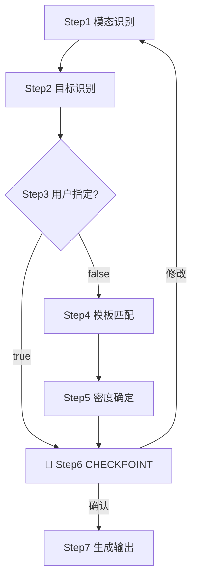

# 内容结构化总结技能 · 仓颉 (cangjie)

将文本、音频、视频、转录稿、论文整理成结构化输出。核心原则：先识别用户目标，再选模板，再抽取高密度信息。用户指定模板时始终优先；未要求"简版/超短版"时，默认生成标准偏详细版本。

## 快速开始

| 目标             | 示例说法                    | 推荐模板                           |
| ---------------- | --------------------------- | ---------------------------------- |
| 课程学习笔记     | "整理成学习笔记"            | `learning/course-notes`            |
| 非虚构书籍       | "总结商业书，每章+全书结论" | `learning/nonfiction-book-summary` |
| 叙事书籍         | "总结小说，逐章+主题"       | `learning/fiction-book-summary`    |
| 播客/节目        | "总结这个播客/访谈"         | `media/podcast-summary`            |
| 会议纪要         | "根据录音生成纪要"          | `meeting/decision-minutes`         |
| 项目汇报         | "生成项目进展报告"          | `business/project-status-report`   |
| 决策备忘录       | "整理成决策备忘录"          | `analysis/decision-memo`           |
| 论文（各子类型） | "总结这篇论文"              | `analysis/paper-*-summary`         |
| PRD              | "写一份 PRD"                | `product/prd`                      |
| 商业计划书       | "需要写 BP"                 | `product/business-plan`            |
| 技术方案         | "整理 TRD 和架构"           | `product/trd`                      |
| 竞品分析         | "做竞品分析报告"            | `product/competitive-analysis`     |
| 文献综述         | "写文献综述，建评判框架"    | `product/literature-review`        |
| 正式会议纪要     | "正式纪要，带 ACTION 编号"  | `product/meeting-minutes-detailed` |

## 工作流

每步遵循 `输入 → 处理 → 输出` 契约，前一步输出作下一步输入。任一步失败必须显式处理，禁止静默跳过。



- **Step 1 · 输入模态识别**：扩展名判定 → `video`/`audio`/`paper`/`text`/`mixed`；未识别 → 询问用户，禁止猜测
- **Step 2 · 输出目标识别**：按 `references/taxonomy.yaml` 的 `goals` 信号词匹配 → `learning`/`recap`/`discussion_record`/`status_reporting`/`synthesis`/`paper_review`/`product_documentation`；多目标命中 → 列候选询问
- **Step 3 · 用户指定检查**：扫描模板 ID/章节名/文件名/格式关键词；`true` → 跳 Step 6；`false` → 进 Step 4
- **Step 4 · 自动模板匹配**：按 `references/registry.yaml` 的 `detection_signals` + `taxonomy.yaml` 的 `selection_hints` 匹配；多命中按 `fallback_order` 决策；无匹配 → `goals[].default_family` 回落
- **Step 5 · 输出密度确定**："快速/一句话/简版/TL;DR" → `brief`；"详细/完整/全面/保留公式" → `deep-dive`；其他 → `standard-detailed`（默认）
- **Step 6 · 🔴 CHECKPOINT 生成前确认**：向用户说明 ① 模板 ID + 核心 section（来自 `registry.yaml` 的 `required_sections`）② 输出密度 + 文件命名 + 保存路径（默认 `{输入文件名}-总结.md`，与输入同目录）③ 与相邻模板的区分理由。🔴 STOP：用户未确认前禁止生成；用户修改 → 回退对应 Step 重跑，不局部打补丁
- **Step 7 · 生成最终输出**：按 `required_sections` 填充，按输出规则和密度策略控制密度；强制写入 `.md` 文件（书籍默认 1 全书文件 + N 章节独立文件）；章节不足 → 标注"材料未提供/无法确认"，禁止硬凑

## 模板选择

优先级：用户显式指定 > 目标意图 > 内容信号词 > fallback。详细决策树、论文子类型细分、书籍场景细分、产品文档子层选择、常见歧义处理见 [`references/guides/template-selection.md`](references/guides/template-selection.md)。

| 模板族     | 代表模板                                                                   | 目标                         |
| ---------- | -------------------------------------------------------------------------- | ---------------------------- |
| `learning` | `course-notes`, `nonfiction/fiction-book-summary`, `tutorial-playbook`     | 学习、复习、知识提炼         |
| `media`    | `podcast-summary`, `video-program-summary`                                 | 节目回顾、亮点传播           |
| `meeting`  | `decision-minutes`, `interview-record`                                     | 纪要、访谈、共创记录         |
| `business` | `project-status-report`, `executive-brief`                                 | 汇报、风险、行动跟踪         |
| `analysis` | `research-brief`, `decision-memo`, `paper-summary`                         | 研究归纳、决策支持、论文阅读 |
| `product`  | `prd`, `trd`, `business-plan`, `competitive-analysis`, `literature-review` | 产品文档、商业计划、技术设计 |

详细定义见 `references/registry.yaml`、`references/taxonomy.yaml`、`references/families/*.yaml`、[`references/guides/template-selection.md`](references/guides/template-selection.md)。

## 输出规则

- 不补造事实，不假设缺失信息；保留时间戳、发言人、数据/论文来源
- 明确区分事实、判断、建议、待办；章节不足 → 删除该章节或标记"不适用"，不硬凑
- 默认 Markdown；默认"结构化详细摘要"，不是"标题+一句话"
- 用户未要求简写时，主要章节写 `3-7` 条高信息量 bullet（素材丰富时 `8-12`）
- 引用原话/数字/公式/数据集/指标/责任人/截止时间时，优先保留原始表述
- **强制文件输出**：所有总结必须写入 `.md`，禁止仅对话展示；默认与输入同目录，命名 `{输入文件名}-总结.md`
- **书籍多文件**：默认 1 全书总览 + N 章节独立文件，除非用户要求单文件合并

骨架见 [`references/guides/output-skeletons.md`](references/guides/output-skeletons.md)；密度控制见 [`references/guides/detail-policy.md`](references/guides/detail-policy.md)。

## 输入处理

- **Text**：直接识别目标结构；多份文本先确认综合 vs 分别输出；书籍判断全书/部分/节选，长书判断"部分/篇/卷"层级
- **Audio**：优先判断单人/多人；会议访谈走带发言人区分的转录，演讲课程播客走单轨
- **Video**：先提音频再转录；画面/PPT/步骤依赖时加视觉章节
- **Paper**：PDF/正文/笔记优先走论文模板；先提炼类型再选子类型

## 工具与依赖

```bash
python3 scripts/extract_audio.py video.mp4 audio.wav              # 视频提音频
python3 scripts/transcribe_diarize_fw.py audio.wav output.txt 3   # 多人会议/访谈转录
python3 scripts/transcribe_with_diarization.py audio.wav output.txt  # 单人课程/演讲转录
```

| 工具             | 安装                                                                | 用途                    |
| ---------------- | ------------------------------------------------------------------- | ----------------------- |
| `ffmpeg`         | `apt install ffmpeg`                                                | 视频提音频              |
| `faster-whisper` | `pip install faster-whisper librosa torch`                          | ASR 转录                |
| `qwen-asr`       | `pip install qwen-asr torch`                                        | ASR 备选                |
| `chub`           | 见 [`references/guides/api-docs.md`](references/guides/api-docs.md) | 拉取第三方 API 最新文档 |

GPU 检查：`python -c "import torch; print('CUDA:', torch.cuda.is_available())"`。调用第三方库/API 时优先用 `chub` 拉最新文档：`chub search "<lib>" --json` 查文档 ID；`chub get <id> --lang py` 拉 Python 文档。

## 常见故障

| 触发条件               | 一线修复                          | 兜底                           |
| ---------------------- | --------------------------------- | ------------------------------ |
| `ffmpeg` 未安装        | `apt install ffmpeg`              | 让用户用系统工具提音频后传 wav |
| ASR 超时/OOM           | 缩短切片重跑                      | 切换 faster-whisper ↔ qwen-asr |
| diarization 失败       | 降级单人转录 + 标注"未区分发言人" | 用户手工标注后重跑             |
| `chub` 不可用          | 跳过拉取，标注"未验证最新 API"    | 用户手动查阅后粘贴             |
| 书籍节选但说"全书总结" | 标注"基于已提供章节"              | 拒绝伪装完整全书，要求补齐     |
| 对话场景不愿落盘       | 询问"是否跳过文件写入"            | 默认仍写文件，允许显式 opt-out |
| 信号冲突多族命中       | 列候选按快速开始优先级排          | 询问用户确认，不猜             |

## 反模式

**禁止**：❌ "标题+一句话"当"标准详细摘要"；❌ "逐章摘要拼接"当"全书总结"（全书文件必须有全书级提炼）；❌ 凭训练记忆写第三方 API 调用代码（必须先 `chub get`）；❌ "讨论纪要"伪装"决策纪要"（缺 ACTION 项时不补造责任人）；❌ 用户已指定模板仍走自动匹配；❌ 节选伪装完整全书；❌ 短章节硬凑内容。

**危险动作**（命中即停止回退）：凭记忆写 API 代码、节选伪装全书、补造责任人、覆盖用户指定模板、硬凑内容、逐章拼接当全书、多目标自行选一个、扩展名猜测模态。

## 兜底回落

- 学习 → `learning/course-notes`；书籍 → `learning/nonfiction-book-summary`
- 媒体 → `media/podcast-summary`；会议 → `meeting/decision-minutes`
- 汇报 → `business/project-status-report`；研究 → `analysis/research-brief`
- 论文 → `analysis/paper-summary`；产品文档 → `product/prd`
- 商业模式 → `product/business-model`；文献综述 → `product/literature-review`

## 示例

完整示例集（课程视频/非虚构/叙事书籍/项目例会/播客/决策归纳/论文/PRD/BP/TRD/正式纪要）见 [`references/guides/examples.md`](references/guides/examples.md)。
