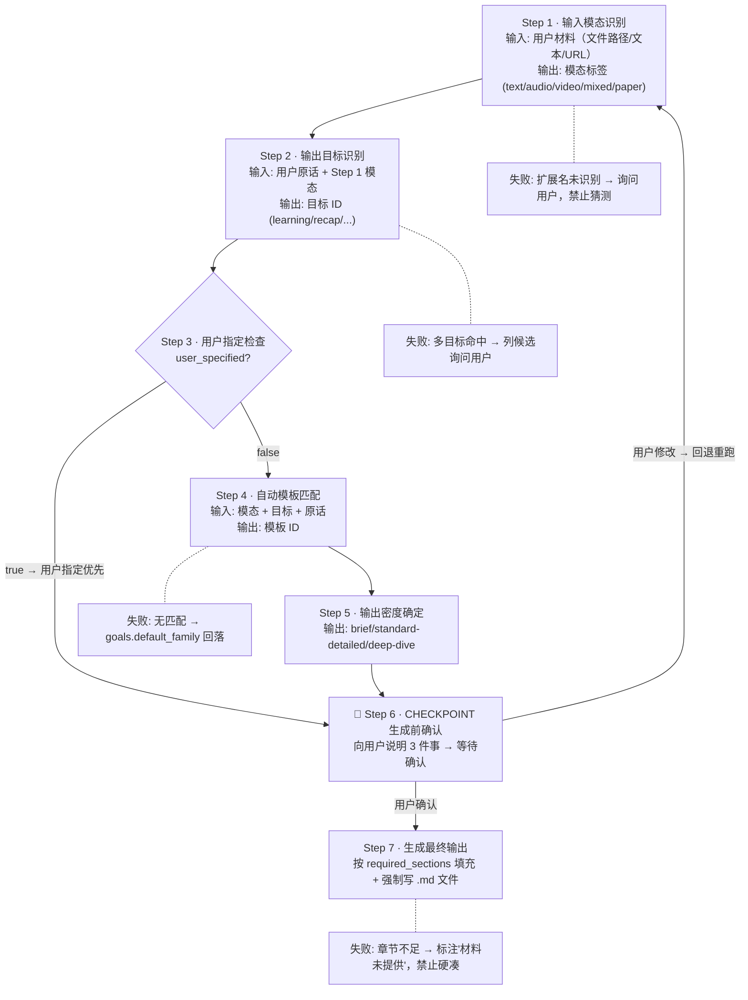
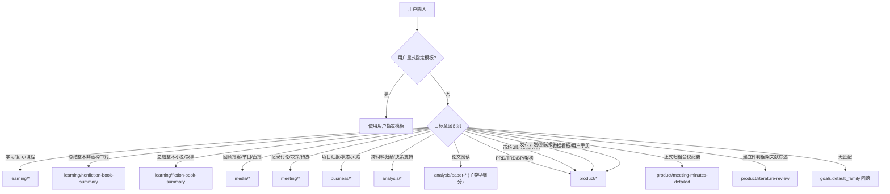
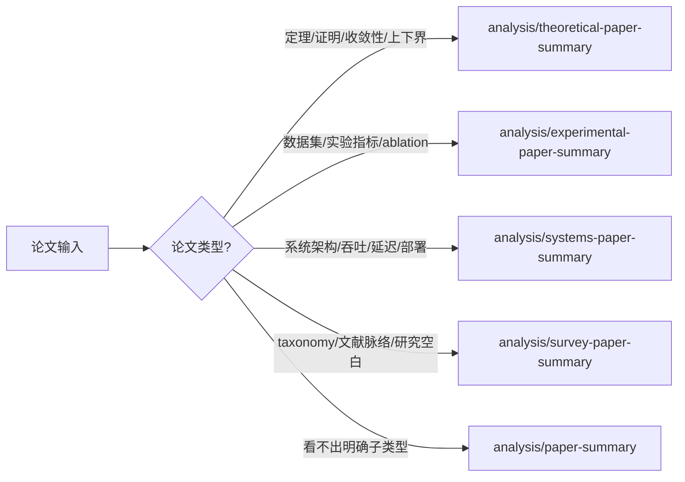

# Content Summarizer Skill

将文本、音频、视频、转录稿、论文整理成结构化输出。核心原则：先识别用户目标，再选模板，再抽取高密度信息。用户指定模板时始终优先；用户未要求“简版/超短版”时，默认生成标准偏详细版本，而不是只给提纲。

## Quick Start

| 目标           | 示例说法                                   | 推荐模板                              |
| -------------- | ------------------------------------------ | ------------------------------------- |
| 课程学习笔记   | “把这段课程内容整理成学习笔记”             | `learning/course-notes`               |
| 非虚构书籍总结 | “总结这本商业书，每章都要总结并给全书结论” | `learning/nonfiction-book-summary`    |
| 叙事书籍总结   | “总结这本小说，要有逐章摘要和全书主题”     | `learning/fiction-book-summary`       |
| 播客或节目回顾 | “总结这个播客/访谈视频”                    | `media/podcast-summary`               |
| 会议纪要       | “根据会议录音生成纪要”                     | `meeting/decision-minutes`            |
| 项目汇报       | “基于这些材料生成项目进展报告”             | `business/project-status-report`      |
| 决策备忘录     | “把这些访谈整理成决策备忘录”               | `analysis/decision-memo`              |
| 通用论文总结   | “总结这篇论文，重点看方法和公式”           | `analysis/paper-summary`              |
| 理论论文       | “总结这篇理论论文，关注定理和证明”         | `analysis/theoretical-paper-summary`  |
| 实验论文       | “总结这篇实验论文，关注实验设计和结果”     | `analysis/experimental-paper-summary` |
| 系统论文       | “总结这篇系统论文，关注架构和评测”         | `analysis/systems-paper-summary`      |
| 综述论文       | "总结这篇综述论文，关注分类框架和空白点"   | `analysis/survey-paper-summary`       |
| 产品需求文档   | "帮我写一份 PRD"                           | `product/prd`                         |
| 技术方案设计   | "整理技术需求文档和架构设计"               | `product/trd`                         |
| 商业计划书     | "我要融资，需要写 BP"                      | `product/business-plan`               |
| 竞品分析报告   | "做一份竞品分析报告"                       | `product/competitive-analysis`        |
| 文献综述报告   | "写一篇文献综述，要建评判框架"             | `product/literature-review`           |
| 详细会议纪要   | "生成正式会议纪要，要带行动项编号"         | `product/meeting-minutes-detailed`    |

## Workflow

每步遵循 `输入 → 处理 → 输出` 契约。前一步输出作为下一步输入。任一步失败必须显式处理，禁止静默跳过。



### Step 1 · 输入模态识别
- 输入：用户材料（文件路径 / 文本 / URL）
- 处理：按扩展名判定 `.mp4/.mkv/.avi/.mov/.webm`→`video`；`.mp3/.wav/.m4a`→`audio`；`.pdf`→`paper`；`.md/.txt`→`text`；多文件→`mixed`
- 输出：模态标签（`text` / `audio` / `video` / `mixed` / `paper`）
- 失败分支：扩展名未识别 → 询问用户材料类型，禁止猜测

### Step 2 · 输出目标识别
- 输入：用户原话 + Step 1 模态标签
- 处理：按 `references/taxonomy.yaml` 的 `goals` 信号词匹配
  - "学习/复习/课程" → `learning`
  - "回顾/亮点/传播" → `recap`
  - "讨论/决策/待办" → `discussion_record`
  - "汇报/进展/风险" → `status_reporting`
  - "归纳/决策支持/主题" → `synthesis`
  - "论文/方法/公式" → `paper_review`
  - "PRD/TRD/BP/架构/竞品分析/文献综述" → `product_documentation`
- 输出：目标 ID（对应 `taxonomy.yaml` 的 `goals[].id`）
- 失败分支：多个目标同时命中 → 列出候选询问用户，禁止自行选

### Step 3 · 用户指定检查
- 输入：用户原话
- 处理：扫描是否含模板 ID（如 `meeting/decision-minutes`）、章节名、文件名、输出格式关键词
- 输出：`user_specified: bool` + 指定内容
- 决策分支：`true` → 跳到 Step 6（用户指定优先级最高，禁止覆盖）；`false` → 进入 Step 4

### Step 4 · 自动模板匹配
- 输入：Step 1 模态 + Step 2 目标 + 用户原话
- 处理：按 `references/registry.yaml` 的 `detection_signals` 匹配 + `references/taxonomy.yaml` 的 `selection_hints` 过滤；多命中时按 `fallback_order` 决策
- 输出：模板 ID（如 `meeting/decision-minutes`）
- 失败分支：无匹配 → 按 `taxonomy.yaml` 的 `goals[].default_family` 回落默认模板

### Step 5 · 输出密度确定
- 输入：用户原话
- 处理：含"快速/一句话/简版/TL;DR" → `brief`；含"详细/完整/全面/保留公式" → `deep-dive`；其他 → `standard-detailed`（默认）
- 输出：密度标签（`brief` / `standard-detailed` / `deep-dive`）

### Step 6 · 🔴 CHECKPOINT 生成前确认
- 输入：Step 1-5 全部输出
- 处理：向用户说明 3 件事：
  1. 模板 ID + 核心 section（来自 `registry.yaml` 的 `required_sections`）
  2. 输出密度 + 文件命名 + 保存路径（默认 `{输入文件名}-总结.md`，与输入同目录）
  3. 与相邻模板的区分理由
- 输出：等待用户确认
- 🔴 STOP：用户未确认前禁止生成最终输出。用户修改 → 回退到对应 Step 重跑，不局部打补丁

### Step 7 · 生成最终输出
- 输入：用户确认后的方案
- 处理：
  - 按 `registry.yaml` 的 `required_sections` 填充每个章节
  - 按 Output Rules 和 Detail Policy 控制密度
  - 强制写入 `.md` 文件（书籍默认 1 全书文件 + N 章节独立文件）
- 输出：`.md` 文件路径 + 对话内展示
- 失败分支：章节内容不足 → 标注"材料未提供/无法确认"，禁止硬凑

## Template Selection

优先级固定如下：

1. 用户显式指定模板或章节
2. 用户目标意图
3. 内容信号词与材料形态
4. fallback 模板



### 论文子类型细分



### 书籍场景细分

- 论点、框架、模型、案例、方法论为主 -> `learning/nonfiction-book-summary`
- 人物、情节、叙事结构、主题、象征为主 -> `learning/fiction-book-summary`
- 用户只说"总结这本书"但未说明类型时，先根据内容信号判断；仍不明确时默认 `learning/nonfiction-book-summary`

一条判断规则：

- 学会或复习某个主题 -> `learning/*`
- 总结整本非虚构书籍 -> `learning/nonfiction-book-summary`
- 总结整本小说或叙事作品 -> `learning/fiction-book-summary`
- 回顾播客、节目、直播、访谈内容 -> `media/*`
- 记录讨论、结论、责任人、待办 -> `meeting/*`
- 做项目汇报、状态汇总、风险跟踪 -> `business/*`
- 做跨材料归纳、研究总结、决策支持 -> `analysis/*`
- 明确是论文阅读 -> 优先走论文模板
- 写产品文档（PRD/TRD/BRD/MRD/架构/数据库/算法）-> `product/*`
- 写商业计划书或商业模式文档 -> `product/business-plan` 或 `product/business-model`
- 做市场调研、竞品分析、项目任务书 -> `product/*`（战略层）
- 写发布计划、测试报告、灰度方案 -> `product/*`（交付层）
- 写数据看板、用户手册、运营手册 -> `product/*`（运营层）
- 需要正式归档的详细会议纪要（含 ACTION 编号、Parking Lot）-> `product/meeting-minutes-detailed`
- 需要建立评判框架的文献综述（含 PRISMA、场景化推荐）-> `product/literature-review`

## Template Families

| 模板族     | 代表模板                                                                               | 目标                         |
| ---------- | -------------------------------------------------------------------------------------- | ---------------------------- |
| `learning` | `course-notes`, `tutorial-playbook`, `nonfiction-book-summary`, `fiction-book-summary` | 学习、复习、知识提炼         |
| `media`    | `podcast-summary`, `video-program-summary`                                             | 节目回顾、亮点传播           |
| `meeting`  | `decision-minutes`, `interview-record`                                                 | 纪要、访谈、共创记录         |
| `business` | `project-status-report`, `executive-brief`                                             | 汇报、风险、行动跟踪         |
| `analysis` | `research-brief`, `decision-memo`, `paper-summary`                                     | 研究归纳、决策支持、论文阅读 |
| `product`  | `prd`, `trd`, `business-plan`, `competitive-analysis`, `literature-review`             | 产品文档、商业计划、技术设计 |

详细定义见：

- `references/registry.yaml`
- `references/taxonomy.yaml`
- `references/families/*.yaml`
- `references/guides/template-selection.md`

## Output Rules

- 不补造事实，不假设缺失信息。
- 保留能保留的时间戳、发言人、数据来源、论文来源。
- 明确区分事实、判断、建议、待办。
- 某章节内容不足时，删除该章节或标记”不适用”，不要硬凑。
- 最终输出默认用 Markdown。
- 默认输出是“结构化详细摘要”，不是“章节标题 + 一句话”。
- 每个必需章节都要尽量落到具体信息：人物、动作、观点、证据、数字、公式、实验、时间、结论、争议、限制。
- 能拆成多条事实时，不要压成单条泛化表述；压缩冗余措辞，但不要压掉不同事实。
- 如果原材料有清晰结构，优先保留其推进顺序：课程按模块、播客按话题流转、会议按讨论到决策、论文按问题到方法到证据。
- 用户未要求简写时，主要章节优先写成 `3-7` 条高信息量 bullet 或等价的小节；素材特别丰富时扩展到 `8-12` 条。
- 引用原话、数字、公式、数据集、指标、责任人、截止时间时，优先保留原始表述或接近原文的精确说法。
- 只有在源材料确实没有更多内容时，才接受短章节；这时要明确写“材料未提供/无法确认”。
- **强制文件输出**：所有总结类输出**必须**写入 `.md` 文件，禁止仅在对话中展示。文件路径默认与输入文件同目录，文件名格式为 `{输入文件名}-总结.md` 或 `{输入文件名}-学习笔记.md`。生成文件后向用户报告文件路径。
- **书籍默认多文件输出**：书籍总结默认产出 `1` 份全书总览文件 + `N` 份章节独立文件。除非用户明确要求“单文件合并版”，不要把逐章摘要全部混进总文件。

输出骨架见：

- `references/guides/output-skeletons.md`

## Detail Policy

默认采用 `standard-detailed` 模式，除非用户明确要求更短。可用下面规则控制输出密度：

- `brief`：只保留结论、少量关键点、最小必要待办。仅在用户明确要求快读版时使用。
- `standard-detailed`：默认模式。覆盖全部必需章节，并为每个章节保留足够事实和证据。
- `deep-dive`：当用户明确要求“详细拆解/完整笔记/尽量全面/保留公式与实验细节”时使用，增加章节内层次和证据密度。

各类信息默认保留策略：

- 学习类：保留知识点之间的因果关系、例子、术语定义、练习建议，而不只是主题列表。
- 书籍类：默认做层级总结，至少同时覆盖“逐章总结”和“全书总结”；全书总结不能只是章节摘要拼接，必须额外提炼全书主线和结构关系。
- 书籍类：章节摘要默认写成独立文件；全书文件只负责全书级提炼、结构关系、关键论点与综合判断。
- 媒体类：保留话题如何展开、嘉宾分歧、亮点论点、关键引用，而不只是“讨论了什么”。
- 会议类：保留谁提出了什么、如何收敛到决策、未解决问题、责任人与截止时间。
- 业务类：保留进展背后的影响、风险成因、指标变化、下一步动作的优先级。
- 论文类：保留研究问题、方法细节、公式/模型、实验设置、结果证据、局限性，不要只写摘要改写。

执行时的压缩边界：

- 可以压缩重复表达，不能压缩不同观点、不同实验结果、不同决策项。
- 可以省略装饰性语句，不能省略结论成立所依赖的关键证据。
- 可以不展开所有细枝末节，不能把“方法、证据、结果、限制”四者压成一句空泛总评。

### Book Compression Policy（书籍层级压缩）

书籍总结默认遵守以下层级压缩规则：

- 输出形态默认是：
  - `书名-全书总结.md`：全书级提炼，不内嵌完整逐章摘要
  - `章节总结/NN_章节名-总结.md`：每章独立文件
- 如果用户没有特别要求，不要把“章节摘要全文”重复写进全书文件；全书文件中最多保留章节导航、分部概览或关键章节索引。
- 先判断结构层级：`全书 -> 部分/篇章 -> 章节 -> 小节`。如果原书存在“第一部分/第二部分/篇章/卷”等中层结构，摘要中优先保留这一层，不要直接把所有章节打平成一个长列表。
- 先写“全书级提炼”，再写“分部/章节级摘要”。禁止把逐章摘要当作全书总结的替代品。
- 章节很多时，不要求每章等长。核心章节、转折章节、方法章节应比铺垫章节更详细；附录、致谢、推荐语等非核心内容降级为“略写”或从正文摘要中排除，但要说明处理方式。
- 当章节数 `> 12` 时，默认启用 `hierarchical-compression`：
  - 每个部分先给 `2-4` 条部分摘要
  - 每章独立文件给 `4-8` 条高信息量 bullet
  - 全书级章节保持独立，不可被压缩掉
- 当章节数 `> 20` 且用户未要求超详细时，逐章摘要优先保留：本章核心问题、关键论点/事件、与全书主线的关系。不要在每章都平均展开全部字段。
- 如果输入是长书但只提供节选，必须把输出改成“基于已提供章节的层级总结”，不能伪装成完整全书阅读结果。
- 对非虚构长书，优先突出：章节在论证链中的功能；对叙事类长书，优先突出：章节在情节推进和人物变化中的功能。

## Input Handling

### Text

- 直接识别目标和结构。
- 多份文本先确认是综合总结还是分别输出。
- 如果是书籍内容，先判断是全书、部分章节还是节选，再决定是否需要显式标注覆盖范围。
- 如果是长书，额外判断是否存在“部分/篇/卷”结构，以及哪些章节属于核心章节、过渡章节、附录性章节。

### Audio

- 优先判断单人/多人。
- 会议、访谈优先走带发言人区分的转录。
- 演讲、课程、播客可走单轨转录。

### Video

- 先提音频再转录。
- 如果内容明显依赖画面、PPT、步骤演示，在输出中加入视觉相关章节。

### Paper

- 若输入是论文 PDF、正文、摘要、读书笔记，优先判断是否进入论文模板。
- 先提炼论文类型，再决定是通用模板还是子类型模板。

## Tools

### 视频提音频

```bash
python3 scripts/extract_audio.py video.mp4 audio.wav
```

### 多人会议 / 访谈转录

```bash
python3 scripts/transcribe_diarize_fw.py audio.wav output.txt 3
```

### 单人课程 / 演讲转录

```bash
python3 scripts/transcribe_with_diarization.py audio.wav output.txt
```

## Checkpoints

🔴 **CHECKPOINT · 生成前必须逐项确认**（缺一项则停止生成并补齐）：

1. 是否需要 `ffmpeg` / ASR / 多文件合并
2. 选中的模板 ID 和核心章节
3. 输出是一份综合文档还是多份独立文档
4. 输出密度是 `brief` / `standard-detailed` / `deep-dive`
5. 文件命名和保存路径
6. 若为书籍：是否保留“部分/篇章”层级，以及长书是否启用 `hierarchical-compression`
7. 若为书籍：章节摘要是否按默认规则输出为独立文件目录

如果自动选择不符合用户预期，立即切换到用户指定模板，不做争辩。

## Common Failures

| 触发条件 | 一线修复 | 仍失败兜底 |
| ------- | -------- | ---------- |
| `ffmpeg` 未安装 | `apt install ffmpeg` | 改让用户用系统工具提音频后直接传 wav |
| ASR 转录超时 / OOM | 缩短音频切片重跑 | 切换备选 ASR（faster-whisper ↔ qwen-asr）|
| 多人会议 diarization 失败 | 降级为单人转录 + 在输出标注"未区分发言人" | 让用户手工标注发言人后重跑 |
| `chub` CLI 不可用 | 跳过文档拉取，依赖训练记忆并显式标注"未验证最新 API" | 提示用户手动查阅官方文档后粘贴 |
| 输入是书籍节选但用户说"全书总结" | 显式标注"基于已提供章节" | 拒绝伪装为完整全书阅读，要求补齐材料 |
| 用户在对话场景下不希望落盘文件 | 询问"是否跳过文件写入" | 默认仍写文件，但允许用户显式 opt-out |
| 模板自动匹配信号冲突（同时命中多个族） | 列出候选并按 Quick Start 优先级排 | 询问用户确认目标，不自行猜 |

## Anti-patterns（禁止做）

- ❌ 把"章节标题 + 一句话"当成"标准详细摘要"输出
- ❌ 把"逐章摘要拼接"当成"全书总结"（全书文件必须有全书级提炼）
- ❌ 凭训练记忆写第三方 API 调用代码（必须先 `chub get`）
- ❌ 把"讨论纪要"伪装成"决策纪要"（缺 ACTION 项时不要补造责任人）
- ❌ 用户已指定模板时仍走自动匹配
- ❌ 节选输入伪装成完整全书阅读结果
- ❌ 短章节硬凑内容（应标“材料未提供/无法确认”）

## Red Flags · 危险动作（禁止执行）

以下动作会导致严重后果（数据丢失 / 用户误导 / 责任混淆），任何步骤中命中即停止并回退：

| 🔴 危险动作 | 后果 | 正确做法 |
|------------|------|---------|
| 凭训练记忆写第三方 API 调用代码 | API 形状过期导致代码报错 | 必须 `chub get` 拉取最新文档后再写 |
| 节选输入伪装成完整全书阅读 | 误导用户决策 | 摘要开头显式标注“基于已提供章节” |
| 缺 ACTION 项时补造责任人 | 责任混淆 | 标注“未明确责任人”，询问用户 |
| 用户已指定模板仍走自动匹配 | 覆盖用户意图 | `user_specified=true` 时直接跳到 Step 6 |
| 短章节硬凑内容 | 输出虚假信息 | 标注“材料未提供/无法确认” |
| 把“逐章摘要拼接”当成“全书总结” | 全书级提炼缺失 | 全书文件必须有全书主线和结构关系 |
| 多目标命中时自行选一个 | 误判用户意图 | 列出候选询问用户 |
| 扩展名未识别时猜测模态 | 后续流程全错 | 询问用户材料类型 |

## Dependencies

| 工具             | 安装命令                                   | 用途       |
| ---------------- | ------------------------------------------ | ---------- |
| `ffmpeg`         | `apt install ffmpeg`                       | 视频提音频 |
| `faster-whisper` | `pip install faster-whisper librosa torch` | ASR 转录   |
| `qwen-asr`       | `pip install qwen-asr torch`               | ASR 备选   |
| `chub`           | 见 [api-docs 指南](references/guides/api-docs.md) | 拉取第三方 API 最新文档 |

GPU 检查：

```bash
python -c "import torch; print('CUDA:', torch.cuda.is_available())"
```

## API Docs 查询

当需要调用第三方库或外部 API（ASR 服务、云存储、支付等）时，优先用 `chub` CLI 拉取最新文档，避免训练记忆过期。完整流程见 `references/guides/api-docs.md`。

```bash
chub search "faster-whisper" --json    # 查找文档 ID
chub get <id> --lang py                # 拉取 Python 文档
```

## Fallback

- 学习类 -> `learning/course-notes`
- 书籍类 -> `learning/nonfiction-book-summary`
- 媒体类 -> `media/podcast-summary`
- 会议类 -> `meeting/decision-minutes`
- 汇报类 -> `business/project-status-report`
- 研究类 -> `analysis/research-brief`
- 论文类 -> `analysis/paper-summary`
- 产品文档类 -> `product/prd`
- 商业模式类 -> `product/business-model`
- 文献综述类 -> `product/literature-review`

## Examples

### 课程视频

用户输入：

```text
总结这个 Python 入门课程视频，整理成学习笔记
```

推荐模板：

- `learning/course-notes`
- 若更偏实操，可追加 `learning/tutorial-playbook`

### 非虚构书籍

用户输入：

```text
总结这本商业书，每章都要概括，并给我一份全书的核心论点总结
```

推荐模板：

- `learning/nonfiction-book-summary`

### 叙事类书籍

用户输入：

```text
总结这本小说，要有逐章摘要、人物关系和全书主题
```

推荐模板：

- `learning/fiction-book-summary`

### 项目例会

用户输入：

```text
根据这次项目例会录音生成纪要，要包含决策和待办
```

推荐模板：

- `meeting/decision-minutes`

### 播客访谈

用户输入：

```text
总结这个关于 AI 趋势的播客访谈
```

推荐模板：

- `media/podcast-summary`

### 多资料决策归纳

用户输入：

```text
把这几份访谈和周报整理成一份决策备忘录
```

推荐模板：

- `analysis/decision-memo`

### 论文阅读

用户输入：

```text
总结这篇论文，告诉我研究主题、主要成果、关键公式和局限性
```

推荐模板：

- `analysis/paper-summary`

细分规则：

- 定理、证明、公式推导为主 -> `analysis/theoretical-paper-summary`
- 数据集、指标、实验对比为主 -> `analysis/experimental-paper-summary`
- 系统架构、吞吐延迟、工程权衡为主 -> `analysis/systems-paper-summary`
- 文献综述、taxonomy、研究脉络为主 -> `analysis/survey-paper-summary`

### 产品需求文档

用户输入：

```text
帮我写一份 PRD，要包含用户旅程、功能详述、验收标准和非功能需求
```

推荐模板：

- `product/prd`

### 商业计划书

用户输入：

```text
我要融资，需要写一份商业计划书，包含市场规模、商业模式、财务预测
```

推荐模板：

- `product/business-plan`

### 技术方案设计

用户输入：

```text
整理技术需求文档和架构设计，要含模块划分和数据库设计
```

推荐模板：

- `product/trd`
- 可追加 `product/architecture` 和 `product/db-design`

### 正式会议纪要

用户输入：

```text
生成正式会议纪要，要带 ACTION 编号、风险登记和 Parking Lot
```

推荐模板：

- `product/meeting-minutes-detailed`
