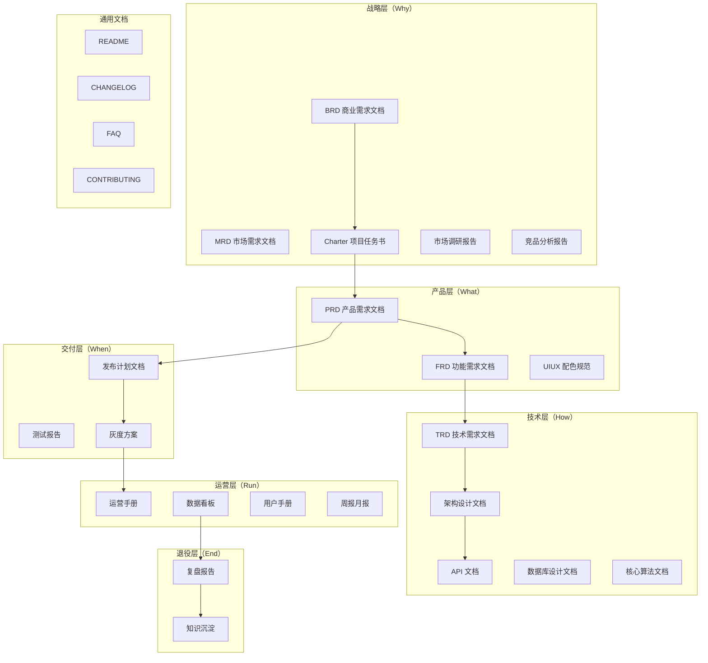

# 模板索引

完整文档模板已从 `references/templates/` 迁移至 `../templates/`。本文件提供按生命周期分层的索引，便于按需定位。

> 模板为完整 Markdown 产物骨架，单文件较长（300-1400 行），故不放在 `references/` 下。模板选择逻辑见 [guides/template-selection.md](guides/template-selection.md)，注册信息见 [registry.yaml](registry.yaml)。

## 产品全生命周期模板地图

## 战略层

| 模板 ID | 文档 | 路径 |
| --- | --- | --- |
| `product/brd` | 商业需求文档（BRD） | [../templates/产品/战略层/【模板】商业需求文档.md](../templates/产品/战略层/【模板】商业需求文档.md) |
| `product/mrd` | 市场需求文档（MRD） | [../templates/产品/战略层/【模板】市场需求文档.md](../templates/产品/战略层/【模板】市场需求文档.md) |
| `product/market-research` | 市场调研报告 | [../templates/产品/战略层/【模板】市场调研报告.md](../templates/产品/战略层/【模板】市场调研报告.md) |
| `product/competitive-analysis` | 竞品分析报告 | [../templates/产品/战略层/【模板】竞品分析报告.md](../templates/产品/战略层/【模板】竞品分析报告.md) |
| `product/charter` | 项目任务书（Charter） | [../templates/产品/战略层/【模板】项目任务书.md](../templates/产品/战略层/【模板】项目任务书.md) |

## 产品层

| 模板 ID | 文档 | 路径 |
| --- | --- | --- |
| `product/prd` | 产品需求文档（PRD） | [../templates/产品/产品层/【模板】产品需求文档.md](../templates/产品/产品层/【模板】产品需求文档.md) |
| `product/frd` | 功能需求文档（FRD） | [../templates/产品/产品层/【模板】功能需求文档.md](../templates/产品/产品层/【模板】功能需求文档.md) |
| `product/uiux-spec` | 产品配色与 UIUX 规范 | [../templates/产品/产品层/【模板】产品配色与UIUX规范文档.md](../templates/产品/产品层/【模板】产品配色与UIUX规范文档.md) |

## 技术层

| 模板 ID | 文档 | 路径 |
| --- | --- | --- |
| `product/trd` | 技术需求文档（TRD） | [../templates/产品/技术层/【模板】技术需求文档(TRD).md](../templates/产品/技术层/【模板】技术需求文档(TRD).md) |
| `product/architecture` | 架构设计文档 | [../templates/产品/技术层/【模板】架构设计文档.md](../templates/产品/技术层/【模板】架构设计文档.md) |
| `product/api-doc` | API 文档 | [../templates/产品/技术层/【模板】API文档.md](../templates/产品/技术层/【模板】API文档.md) |
| `product/db-design` | 数据库设计文档 | [../templates/产品/技术层/【模板】数据库设计文档规范.md](../templates/产品/技术层/【模板】数据库设计文档规范.md) |
| `product/algorithm-doc` | 核心算法文档 | [../templates/产品/技术层/【模板】核心算法文档.md](../templates/产品/技术层/【模板】核心算法文档.md) |

## 交付层

| 模板 ID | 文档 | 路径 |
| --- | --- | --- |
| `product/release-plan` | 发布计划文档 | [../templates/产品/交付层/【模板】发布计划文档.md](../templates/产品/交付层/【模板】发布计划文档.md) |
| `product/test-report` | 测试报告 | [../templates/产品/交付层/【模板】测试报告.md](../templates/产品/交付层/【模板】测试报告.md) |
| `product/canary-plan` | 灰度方案 | [../templates/产品/交付层/【模板】灰度方案.md](../templates/产品/交付层/【模板】灰度方案.md) |

## 运营层

| 模板 ID | 文档 | 路径 |
| --- | --- | --- |
| `product/operation-guide` | 运营手册 | [../templates/产品/运营层/【模板】运营手册.md](../templates/产品/运营层/【模板】运营手册.md) |
| `product/dashboard` | 数据看板 | [../templates/产品/运营层/【模板】数据看板.md](../templates/产品/运营层/【模板】数据看板.md) |
| `product/user-guide` | 用户手册 | [../templates/产品/运营层/【模板】用户手册.md](../templates/产品/运营层/【模板】用户手册.md) |
| `product/weekly-monthly-report` | 周报月报 | [../templates/产品/运营层/【模板】周报月报.md](../templates/产品/运营层/【模板】周报月报.md) |

## 退役层

| 模板 ID | 文档 | 路径 |
| --- | --- | --- |
| `product/retrospective` | 复盘报告 | [../templates/产品/退役层/【模板】复盘报告.md](../templates/产品/退役层/【模板】复盘报告.md) |
| `product/knowledge-base` | 知识沉淀 | [../templates/产品/退役层/【模板】知识沉淀.md](../templates/产品/退役层/【模板】知识沉淀.md) |

## 通用文档

| 文档 | 路径 |
| --- | --- |
| README | [../templates/通用/【模板】README.md](../templates/通用/【模板】README.md) |
| CHANGELOG | [../templates/通用/【模板】CHANGELOG.md](../templates/通用/【模板】CHANGELOG.md) |
| FAQ | [../templates/通用/【模板】FAQ.md](../templates/通用/【模板】FAQ.md) |
| CONTRIBUTING | [../templates/通用/【模板】CONTRIBUTING.md](../templates/通用/【模板】CONTRIBUTING.md) |

## 独立模板（非产品生命周期）

| 模板 ID | 文档 | 路径 |
| --- | --- | --- |
| `product/business-plan` | 商业计划书（BP） | [../templates/【模板】商业计划书.md](../templates/【模板】商业计划书.md) |
| `product/business-model` | 商业模式文档 | [../templates/【模板】商业模式文档.md](../templates/【模板】商业模式文档.md) |
| `product/meeting-minutes-detailed` | 正式会议纪要 | [../templates/【模板】会议纪要.md](../templates/【模板】会议纪要.md) |
| `product/literature-review` | 论文研究报告 | [../templates/【模板】论文研究报告.md](../templates/【模板】论文研究报告.md) |

## 产品文档体系总览

完整的分层说明、裁剪指南、文档间追溯关系见 [../templates/产品/README.md](../templates/产品/README.md)。
