# Template Index

Complete document templates have been migrated from `references/templates/` to `../templates/`. This file provides a lifecycle-layered index for easy lookup.

> Templates are complete Markdown artifact skeletons, relatively long per file (300-1400 lines), so they are not placed under `references/`. Template selection logic is at [guides/template-selection.md](guides/template-selection.md), and registry information is at [registry.yaml](registry.yaml).

## Product Full Lifecycle Template Map

```mermaid
flowchart TD
    subgraph Strategy["Strategy (Why)"]
        A1[BRD Business Requirements Document]
        A2[MRD Market Requirements Document]
        A3[Charter Project Charter]
        A4[Market Research Report]
        A5[Competitive Analysis Report]
    end
    subgraph Product["Product (What)"]
        B1[PRD Product Requirements Document]
        B2[FRD Functional Requirements Document]
        B3[UI/UX Specification]
    end
    subgraph Technical["Technical (How)"]
        C1[TRD Technical Requirements Document]
        C2[Architecture Design Document]
        C3[API Documentation]
        C4[Database Design Document]
        C5[Core Algorithm Document]
    end
    subgraph Delivery["Delivery (When)"]
        D1[Release Plan Document]
        D2[Test Report]
        D3[Canary Deployment Plan]
    end
    subgraph Operations["Operations (Run)"]
        E1[Operations Guide]
        E2[Data Dashboard]
        E3[User Guide]
        E4[Weekly/Monthly Report]
    end
    subgraph Sunset["Sunset (End)"]
        F1[Retrospective Report]
        F2[Knowledge Base]
    end
    subgraph General["General Documentation"]
        G1[README]
        G2[CHANGELOG]
        G3[FAQ]
        G4[CONTRIBUTING]
    end
    A1 --> A3 --> B1 --> B2 --> C1 --> C2 --> C3
    B1 --> D1 --> D3 --> E1
    E2 --> F1 --> F2
```

## Strategy Layer

| Template ID | Document | Path |
| --- | --- | --- |
| `product/brd` | Business Requirements Document (BRD) | [../templates/Product/Strategy/【模板】商业需求文档.md](../templates/Product/Strategy/【模板】商业需求文档.md) |
| `product/mrd` | Market Requirements Document (MRD) | [../templates/Product/Strategy/【模板】市场需求文档.md](../templates/Product/Strategy/【模板】市场需求文档.md) |
| `product/market-research` | Market Research Report | [../templates/Product/Strategy/【模板】市场调研报告.md](../templates/Product/Strategy/【模板】市场调研报告.md) |
| `product/competitive-analysis` | Competitive Analysis Report | [../templates/Product/Strategy/【模板】竞品分析报告.md](../templates/Product/Strategy/【模板】竞品分析报告.md) |
| `product/charter` | Project Charter | [../templates/Product/Strategy/【模板】项目任务书.md](../templates/Product/Strategy/【模板】项目任务书.md) |

## Product Layer

| Template ID | Document | Path |
| --- | --- | --- |
| `product/prd` | Product Requirements Document (PRD) | [../templates/Product/Product/【模板】产品需求文档.md](../templates/Product/Product/【模板】产品需求文档.md) |
| `product/frd` | Functional Requirements Document (FRD) | [../templates/Product/Product/【模板】功能需求文档.md](../templates/Product/Product/【模板】功能需求文档.md) |
| `product/uiux-spec` | Product Color and UI/UX Specification | [../templates/Product/Product/【模板】产品配色与UIUX规范文档.md](../templates/Product/Product/【模板】产品配色与UIUX规范文档.md) |

## Technical Layer

| Template ID | Document | Path |
| --- | --- | --- |
| `product/trd` | Technical Requirements Document (TRD) | [../templates/Product/Technical/【模板】技术需求文档(TRD).md](../templates/Product/Technical/【模板】技术需求文档(TRD).md) |
| `product/architecture` | Architecture Design Document | [../templates/Product/Technical/【模板】架构设计文档.md](../templates/Product/Technical/【模板】架构设计文档.md) |
| `product/api-doc` | API Documentation | [../templates/Product/Technical/【模板】API文档.md](../templates/Product/Technical/【模板】API文档.md) |
| `product/db-design` | Database Design Document | [../templates/Product/Technical/【模板】数据库设计文档规范.md](../templates/Product/Technical/【模板】数据库设计文档规范.md) |
| `product/algorithm-doc` | Core Algorithm Document | [../templates/Product/Technical/【模板】核心算法文档.md](../templates/Product/Technical/【模板】核心算法文档.md) |

## Delivery Layer

| Template ID | Document | Path |
| --- | --- | --- |
| `product/release-plan` | Release Plan Document | [../templates/Product/Delivery/【模板】发布计划文档.md](../templates/Product/Delivery/【模板】发布计划文档.md) |
| `product/test-report` | Test Report | [../templates/Product/Delivery/【模板】测试报告.md](../templates/Product/Delivery/【模板】测试报告.md) |
| `product/canary-plan` | Canary Deployment Plan | [../templates/Product/Delivery/【模板】灰度方案.md](../templates/Product/Delivery/【模板】灰度方案.md) |

## Operations Layer

| Template ID | Document | Path |
| --- | --- | --- |
| `product/operation-guide` | Operations Guide | [../templates/Product/Operations/【模板】运营手册.md](../templates/Product/Operations/【模板】运营手册.md) |
| `product/dashboard` | Data Dashboard | [../templates/Product/Operations/【模板】数据看板.md](../templates/Product/Operations/【模板】数据看板.md) |
| `product/user-guide` | User Guide | [../templates/Product/Operations/【模板】用户手册.md](../templates/Product/Operations/【模板】用户手册.md) |
| `product/weekly-monthly-report` | Weekly/Monthly Report | [../templates/Product/Operations/【模板】周报月报.md](../templates/Product/Operations/【模板】周报月报.md) |

## Sunset Layer

| Template ID | Document | Path |
| --- | --- | --- |
| `product/retrospective` | Retrospective Report | [../templates/Product/Sunset/【模板】复盘报告.md](../templates/Product/Sunset/【模板】复盘报告.md) |
| `product/knowledge-base` | Knowledge Base | [../templates/Product/Sunset/【模板】知识沉淀.md](../templates/Product/Sunset/【模板】知识沉淀.md) |

## General Documentation

| Document | Path |
| --- | --- |
| README | [../templates/General/【模板】README.md](../templates/General/【模板】README.md) |
| CHANGELOG | [../templates/General/【模板】CHANGELOG.md](../templates/General/【模板】CHANGELOG.md) |
| FAQ | [../templates/General/【模板】FAQ.md](../templates/General/【模板】FAQ.md) |
| CONTRIBUTING | [../templates/General/【模板】CONTRIBUTING.md](../templates/General/【模板】CONTRIBUTING.md) |

## Standalone Templates (Non-Product Lifecycle)

| Template ID | Document | Path |
| --- | --- | --- |
| `product/business-plan` | Business Plan (BP) | [../templates/【模板】商业计划书.md](../templates/【模板】商业计划书.md) |
| `product/business-model` | Business Model Document | [../templates/【模板】商业模式文档.md](../templates/【模板】商业模式文档.md) |
| `product/meeting-minutes-detailed` | Formal Meeting Minutes | [../templates/【模板】会议纪要.md](../templates/【模板】会议纪要.md) |
| `product/literature-review` | Literature Review Report | [../templates/【模板】论文研究报告.md](../templates/【模板】论文研究报告.md) |

## Product Documentation System Overview

For the complete layered description, trimming guide, and cross-document traceability, see [../templates/Product/README.md](../templates/Product/README.md).
