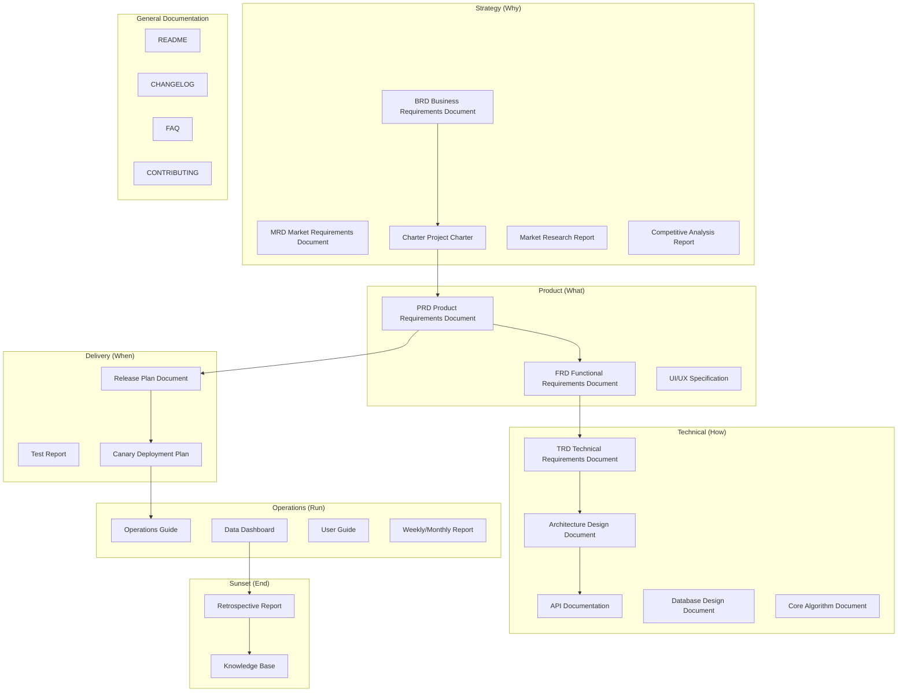

# Template Index

Complete document templates have been migrated from `references/templates/` to `../templates/`. This file provides a lifecycle-layered index for easy lookup.

> Templates are complete Markdown artifact skeletons, relatively long per file (300-1400 lines), so they are not placed under `references/`. Template selection logic is at [guides/template-selection.md](guides/template-selection.md), and registry information is at [registry.yaml](registry.yaml).

## Product Full Lifecycle Template Map

## Strategy Layer

| Template ID | Document | Path |
| --- | --- | --- |
| `product/brd` | Business Requirements Document (BRD) | [../templates/Product/Strategy/Template-BRD.md](../templates/Product/Strategy/Template-BRD.md) |
| `product/mrd` | Market Requirements Document (MRD) | [../templates/Product/Strategy/Template-MRD.md](../templates/Product/Strategy/Template-MRD.md) |
| `product/market-research` | Market Research Report | [../templates/Product/Strategy/Template-Market-Research.md](../templates/Product/Strategy/Template-Market-Research.md) |
| `product/competitive-analysis` | Competitive Analysis Report | [../templates/Product/Strategy/Template-Competitive-Analysis.md](../templates/Product/Strategy/Template-Competitive-Analysis.md) |
| `product/charter` | Project Charter | [../templates/Product/Strategy/Template-Project-Charter.md](../templates/Product/Strategy/Template-Project-Charter.md) |

## Product Layer

| Template ID | Document | Path |
| --- | --- | --- |
| `product/prd` | Product Requirements Document (PRD) | [../templates/Product/Product/Template-PRD.md](../templates/Product/Product/Template-PRD.md) |
| `product/frd` | Functional Requirements Document (FRD) | [../templates/Product/Product/Template-FRD.md](../templates/Product/Product/Template-FRD.md) |
| `product/uiux-spec` | Product Color and UI/UX Specification | [../templates/Product/Product/Template-UIUX-Spec.md](../templates/Product/Product/Template-UIUX-Spec.md) |

## Technical Layer

| Template ID | Document | Path |
| --- | --- | --- |
| `product/trd` | Technical Requirements Document (TRD) | [../templates/Product/Technology/Template-TRD.md](../templates/Product/Technology/Template-TRD.md) |
| `product/architecture` | Architecture Design Document | [../templates/Product/Technology/Template-Architecture.md](../templates/Product/Technology/Template-Architecture.md) |
| `product/api-doc` | API Documentation | [../templates/Product/Technology/Template-API-Doc.md](../templates/Product/Technology/Template-API-Doc.md) |
| `product/db-design` | Database Design Document | [../templates/Product/Technology/Template-DB-Design.md](../templates/Product/Technology/Template-DB-Design.md) |
| `product/algorithm-doc` | Core Algorithm Document | [../templates/Product/Technology/Template-Algorithm.md](../templates/Product/Technology/Template-Algorithm.md) |

## Delivery Layer

| Template ID | Document | Path |
| --- | --- | --- |
| `product/release-plan` | Release Plan Document | [../templates/Product/Delivery/Template-Release-Plan.md](../templates/Product/Delivery/Template-Release-Plan.md) |
| `product/test-report` | Test Report | [../templates/Product/Delivery/Template-Test-Report.md](../templates/Product/Delivery/Template-Test-Report.md) |
| `product/canary-plan` | Canary Deployment Plan | [../templates/Product/Delivery/Template-Canary-Plan.md](../templates/Product/Delivery/Template-Canary-Plan.md) |

## Operations Layer

| Template ID | Document | Path |
| --- | --- | --- |
| `product/operation-guide` | Operations Guide | [../templates/Product/Operations/Template-Operations-Manual.md](../templates/Product/Operations/Template-Operations-Manual.md) |
| `product/dashboard` | Data Dashboard | [../templates/Product/Operations/Template-Dashboard.md](../templates/Product/Operations/Template-Dashboard.md) |
| `product/user-guide` | User Guide | [../templates/Product/Operations/Template-User-Guide.md](../templates/Product/Operations/Template-User-Guide.md) |
| `product/weekly-monthly-report` | Weekly/Monthly Report | [../templates/Product/Operations/Template-Weekly-Monthly-Report.md](../templates/Product/Operations/Template-Weekly-Monthly-Report.md) |

## Sunset Layer

| Template ID | Document | Path |
| --- | --- | --- |
| `product/retrospective` | Retrospective Report | [../templates/Product/Retirement/Template-Retrospective.md](../templates/Product/Retirement/Template-Retrospective.md) |
| `product/knowledge-base` | Knowledge Base | [../templates/Product/Retirement/Template-Knowledge-Base.md](../templates/Product/Retirement/Template-Knowledge-Base.md) |

## General Documentation

| Document | Path |
| --- | --- |
| README | [../templates/Common/Template-README.md](../templates/Common/Template-README.md) |
| CHANGELOG | [../templates/Common/Template-CHANGELOG.md](../templates/Common/Template-CHANGELOG.md) |
| FAQ | [../templates/Common/Template-FAQ.md](../templates/Common/Template-FAQ.md) |
| CONTRIBUTING | [../templates/Common/Template-CONTRIBUTING.md](../templates/Common/Template-CONTRIBUTING.md) |

## Standalone Templates (Non-Product Lifecycle)

| Template ID | Document | Path |
| --- | --- | --- |
| `product/business-plan` | Business Plan (BP) | [../templates/Template-Business-Plan.md](../templates/Template-Business-Plan.md) |
| `product/business-model` | Business Model Document | [../templates/Template-Business-Model.md](../templates/Template-Business-Model.md) |
| `product/meeting-minutes-detailed` | Formal Meeting Minutes | [../templates/Template-Meeting-Minutes.md](../templates/Template-Meeting-Minutes.md) |
| `product/literature-review` | Literature Review Report | [../templates/Template-Literature-Review.md](../templates/Template-Literature-Review.md) |

## Product Documentation System Overview

For the complete layered description, trimming guide, and cross-document traceability, see [../templates/Product/README.md](../templates/Product/README.md).
