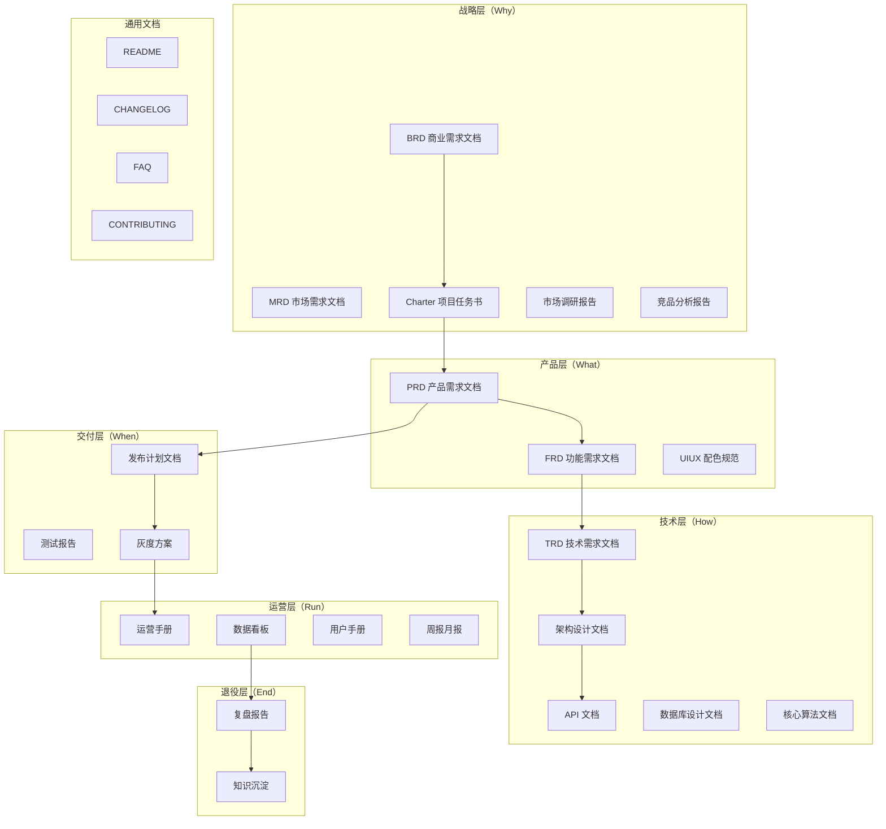

# 模板索引

完整文档模板已从 `references/templates/` 迁移至 `../templates/`。本文件提供按生命周期分层的索引，便于按需定位。

> 模板为完整 Markdown 产物骨架，单文件较长（300-1400 行），故不放在 `references/` 下。模板选择逻辑见 [guides/template-selection.md](guides/template-selection.md)，注册信息见 [registry.yaml](registry.yaml)。

## 产品全生命周期模板地图

## 战略层

| 模板 ID | 文档 | 路径 |
| --- | --- | --- |
| `product/brd` | 商业需求文档（BRD） | [../templates/Product/Strategy/Template-BRD.md](../templates/Product/Strategy/Template-BRD.md) |
| `product/mrd` | 市场需求文档（MRD） | [../templates/Product/Strategy/Template-MRD.md](../templates/Product/Strategy/Template-MRD.md) |
| `product/market-research` | 市场调研报告 | [../templates/Product/Strategy/Template-Market-Research.md](../templates/Product/Strategy/Template-Market-Research.md) |
| `product/competitive-analysis` | 竞品分析报告 | [../templates/Product/Strategy/Template-Competitive-Analysis.md](../templates/Product/Strategy/Template-Competitive-Analysis.md) |
| `product/charter` | 项目任务书（Charter） | [../templates/Product/Strategy/Template-Project-Charter.md](../templates/Product/Strategy/Template-Project-Charter.md) |

## 产品层

| 模板 ID | 文档 | 路径 |
| --- | --- | --- |
| `product/prd` | 产品需求文档（PRD） | [../templates/Product/Product/Template-PRD.md](../templates/Product/Product/Template-PRD.md) |
| `product/frd` | 功能需求文档（FRD） | [../templates/Product/Product/Template-FRD.md](../templates/Product/Product/Template-FRD.md) |
| `product/uiux-spec` | 产品配色与 UIUX 规范 | [../templates/Product/Product/Template-UIUX-Spec.md](../templates/Product/Product/Template-UIUX-Spec.md) |

## 技术层

| 模板 ID | 文档 | 路径 |
| --- | --- | --- |
| `product/trd` | 技术需求文档（TRD） | [../templates/Product/Technology/Template-TRD.md](../templates/Product/Technology/Template-TRD.md) |
| `product/architecture` | 架构设计文档 | [../templates/Product/Technology/Template-Architecture.md](../templates/Product/Technology/Template-Architecture.md) |
| `product/api-doc` | API 文档 | [../templates/Product/Technology/Template-API-Doc.md](../templates/Product/Technology/Template-API-Doc.md) |
| `product/db-design` | 数据库设计文档 | [../templates/Product/Technology/Template-DB-Design.md](../templates/Product/Technology/Template-DB-Design.md) |
| `product/algorithm-doc` | 核心算法文档 | [../templates/Product/Technology/Template-Algorithm.md](../templates/Product/Technology/Template-Algorithm.md) |

## 交付层

| 模板 ID | 文档 | 路径 |
| --- | --- | --- |
| `product/release-plan` | 发布计划文档 | [../templates/Product/Delivery/Template-Release-Plan.md](../templates/Product/Delivery/Template-Release-Plan.md) |
| `product/test-report` | 测试报告 | [../templates/Product/Delivery/Template-Test-Report.md](../templates/Product/Delivery/Template-Test-Report.md) |
| `product/canary-plan` | 灰度方案 | [../templates/Product/Delivery/Template-Canary-Plan.md](../templates/Product/Delivery/Template-Canary-Plan.md) |

## 运营层

| 模板 ID | 文档 | 路径 |
| --- | --- | --- |
| `product/operation-guide` | 运营手册 | [../templates/Product/Operations/Template-Operations-Manual.md](../templates/Product/Operations/Template-Operations-Manual.md) |
| `product/dashboard` | 数据看板 | [../templates/Product/Operations/Template-Dashboard.md](../templates/Product/Operations/Template-Dashboard.md) |
| `product/user-guide` | 用户手册 | [../templates/Product/Operations/Template-User-Guide.md](../templates/Product/Operations/Template-User-Guide.md) |
| `product/weekly-monthly-report` | 周报月报 | [../templates/Product/Operations/Template-Weekly-Monthly-Report.md](../templates/Product/Operations/Template-Weekly-Monthly-Report.md) |

## 退役层

| 模板 ID | 文档 | 路径 |
| --- | --- | --- |
| `product/retrospective` | 复盘报告 | [../templates/Product/Retirement/Template-Retrospective.md](../templates/Product/Retirement/Template-Retrospective.md) |
| `product/knowledge-base` | 知识沉淀 | [../templates/Product/Retirement/Template-Knowledge-Base.md](../templates/Product/Retirement/Template-Knowledge-Base.md) |

## 通用文档

| 文档 | 路径 |
| --- | --- |
| README | [../templates/Common/Template-README.md](../templates/Common/Template-README.md) |
| CHANGELOG | [../templates/Common/Template-CHANGELOG.md](../templates/Common/Template-CHANGELOG.md) |
| FAQ | [../templates/Common/Template-FAQ.md](../templates/Common/Template-FAQ.md) |
| CONTRIBUTING | [../templates/Common/Template-CONTRIBUTING.md](../templates/Common/Template-CONTRIBUTING.md) |

## 独立模板（非产品生命周期）

| 模板 ID | 文档 | 路径 |
| --- | --- | --- |
| `product/business-plan` | 商业计划书（BP） | [../templates/Template-Business-Plan.md](../templates/Template-Business-Plan.md) |
| `product/business-model` | 商业模式文档 | [../templates/Template-Business-Model.md](../templates/Template-Business-Model.md) |
| `product/meeting-minutes-detailed` | 正式会议纪要 | [../templates/Template-Meeting-Minutes.md](../templates/Template-Meeting-Minutes.md) |
| `product/literature-review` | 论文研究报告 | [../templates/Template-Literature-Review.md](../templates/Template-Literature-Review.md) |

## 产品文档体系总览

完整的分层说明、裁剪指南、文档间追溯关系见 [../templates/Product/README.md](../templates/Product/README.md)。
