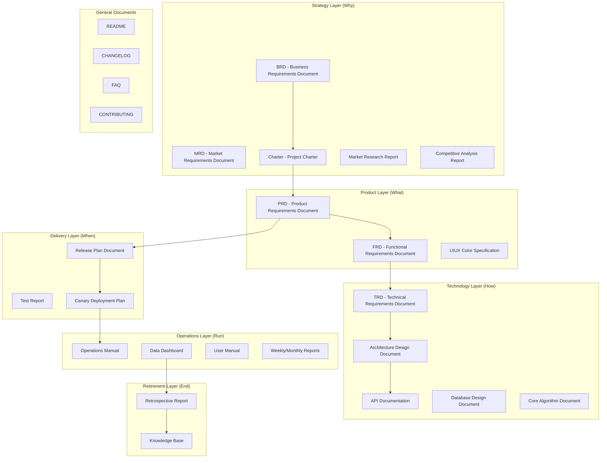

# Template Index

Complete document templates have been migrated from `references/templates/` to `../templates/`. This file provides a lifecycle-layered index for easy lookup.

> Templates are complete Markdown artifact skeletons, each file is lengthy (300-1400 lines), so they are not placed under `references/`. For template selection logic, see [guides/template-selection.md](guides/template-selection.md); for registration info, see [registry.yaml](registry.yaml).

## Product Full Lifecycle Template Map

## Strategy Layer

| Template ID | Document | Path |
| --- | --- | --- |
| `product/brd` | Business Requirements Document (BRD) | [../templates/Product/Strategy/[Template] Business Requirements Document.md](../templates/产品/战略层/【模板】商业需求文档.md) |
| `product/mrd` | Market Requirements Document (MRD) | [../templates/Product/Strategy/[Template] Market Requirements Document.md](../templates/产品/战略层/【模板】市场需求文档.md) |
| `product/market-research` | Market Research Report | [../templates/Product/Strategy/[Template] Market Research Report.md](../templates/产品/战略层/【模板】市场调研报告.md) |
| `product/competitive-analysis` | Competitive Analysis Report | [../templates/Product/Strategy/[Template] Competitive Analysis Report.md](../templates/产品/战略层/【模板】竞品分析报告.md) |
| `product/charter` | Project Charter | [../templates/Product/Strategy/[Template] Project Charter.md](../templates/产品/战略层/【模板】项目任务书.md) |

## Product Layer

| Template ID | Document | Path |
| --- | --- | --- |
| `product/prd` | Product Requirements Document (PRD) | [../templates/Product/Product/[Template] Product Requirements Document.md](../templates/产品/产品层/【模板】产品需求文档.md) |
| `product/frd` | Functional Requirements Document (FRD) | [../templates/Product/Product/[Template] Functional Requirements Document.md](../templates/产品/产品层/【模板】功能需求文档.md) |
| `product/uiux-spec` | Product Color & UIUX Specification | [../templates/Product/Product/[Template] Product Color & UIUX Specification.md](../templates/产品/产品层/【模板】产品配色与UIUX规范文档.md) |

## Technology Layer

| Template ID | Document | Path |
| --- | --- | --- |
| `product/trd` | Technical Requirements Document (TRD) | [../templates/Product/Tech/[Template] Technical Requirements Document (TRD).md](../templates/产品/技术层/【模板】技术需求文档(TRD).md) |
| `product/architecture` | Architecture Design Document | [../templates/Product/Tech/[Template] Architecture Design Document.md](../templates/产品/技术层/【模板】架构设计文档.md) |
| `product/api-doc` | API Documentation | [../templates/Product/Tech/[Template] API Documentation.md](../templates/产品/技术层/【模板】API文档.md) |
| `product/db-design` | Database Design Document | [../templates/Product/Tech/[Template] Database Design Document Specification.md](../templates/产品/技术层/【模板】数据库设计文档规范.md) |
| `product/algorithm-doc` | Core Algorithm Document | [../templates/Product/Tech/[Template] Core Algorithm Document.md](../templates/产品/技术层/【模板】核心算法文档.md) |

## Delivery Layer

| Template ID | Document | Path |
| --- | --- | --- |
| `product/release-plan` | Release Plan Document | [../templates/Product/Delivery/[Template] Release Plan Document.md](../templates/产品/交付层/【模板】发布计划文档.md) |
| `product/test-report` | Test Report | [../templates/Product/Delivery/[Template] Test Report.md](../templates/产品/交付层/【模板】测试报告.md) |
| `product/canary-plan` | Canary Deployment Plan | [../templates/Product/Delivery/[Template] Canary Deployment Plan.md](../templates/产品/交付层/【模板】灰度方案.md) |

## Operations Layer

| Template ID | Document | Path |
| --- | --- | --- |
| `product/operation-guide` | Operations Manual | [../templates/Product/Ops/[Template] Operations Manual.md](../templates/产品/运营层/【模板】运营手册.md) |
| `product/dashboard` | Data Dashboard | [../templates/Product/Ops/[Template] Data Dashboard.md](../templates/产品/运营层/【模板】数据看板.md) |
| `product/user-guide` | User Manual | [../templates/Product/Ops/[Template] User Manual.md](../templates/产品/运营层/【模板】用户手册.md) |
| `product/weekly-monthly-report` | Weekly/Monthly Reports | [../templates/Product/Ops/[Template] Weekly Monthly Reports.md](../templates/产品/运营层/【模板】周报月报.md) |

## Retirement Layer

| Template ID | Document | Path |
| --- | --- | --- |
| `product/retrospective` | Retrospective Report | [../templates/Product/Retire/[Template] Retrospective Report.md](../templates/产品/退役层/【模板】复盘报告.md) |
| `product/knowledge-base` | Knowledge Base | [../templates/Product/Retire/[Template] Knowledge Base.md](../templates/产品/退役层/【模板】知识沉淀.md) |

## General Documents

| Document | Path |
| --- | --- |
| README | [../templates/General/[Template] README.md](../templates/通用/【模板】README.md) |
| CHANGELOG | [../templates/General/[Template] CHANGELOG.md](../templates/通用/【模板】CHANGELOG.md) |
| FAQ | [../templates/General/[Template] FAQ.md](../templates/通用/【模板】FAQ.md) |
| CONTRIBUTING | [../templates/General/[Template] CONTRIBUTING.md](../templates/通用/【模板】CONTRIBUTING.md) |

## Standalone Templates (Outside Product Lifecycle)

| Template ID | Document | Path |
| --- | --- | --- |
| `product/business-plan` | Business Plan (BP) | [../templates/[Template] Business Plan.md](../templates/【模板】商业计划书.md) |
| `product/business-model` | Business Model Document | [../templates/[Template] Business Model Document.md](../templates/【模板】商业模式文档.md) |
| `product/meeting-minutes-detailed` | Formal Meeting Minutes | [../templates/[Template] Meeting Minutes.md](../templates/【模板】会议纪要.md) |
| `product/literature-review` | Literature Review Report | [../templates/[Template] Literature Review Report.md](../templates/【模板】论文研究报告.md) |

## Product Documentation System Overview

For complete layered descriptions, trimming guidelines, and inter-document traceability, see [../templates/Product/README.md](../templates/产品/README.md).
