# [产品/系统名称（英文名）] - 商业模式文档（Business Model Document）

> **文档状态：** 🟡 评审中 / 🟢 已通过 / 🔴 驳回
>
> **保密级别：** 机密 / 内部公开 / 公开
>
> **版本：** vX.X
>
> **日期：** YYYY-MM-DD
>
> **撰写人：** [姓名/角色]
>
> **评审人：** [姓名/角色]
>
> **阅读对象：** [角色列表]
>
> **核心目标**：清晰阐述「如何创造、传递、获取价值」的完整闭环

---

## 0. 文档导读

### 0.1 文档目的与适用范围

[说明本文档的目的、适用场景和不适用场景]

### 0.2 相关文档

| 文档类型 | 文件名 | 相关章节 |
|---------|--------|---------|
| [类型] | [文件名] [行号范围] | [章节描述] |

> **引用格式说明**：关联文档使用 `文件名 行号范围` 格式（如 `【模板】技术需求文档(TRD).md 3-17`），行号随文档更新可能变化，请以实际内容为准。

### 0.3 变更记录

| 版本 | 日期 | 修订人 | 变更内容 | 审核人 |
| :--- | :--- | :--- | :--- | :--- |
| v0.1 | YYYY-MM-DD | [姓名] | 初稿 | [审核人] |

---

## 2. 商业模式总览

### 2.1 一句话商业模式

> **我们**通过 **[核心能力/资源]**，为 **[目标客户]** 提供 **[价值主张]**，解决 **[核心痛点]**，并从中获取 **[收入来源]**。

### 2.2 商业模式画布（Business Model Canvas）

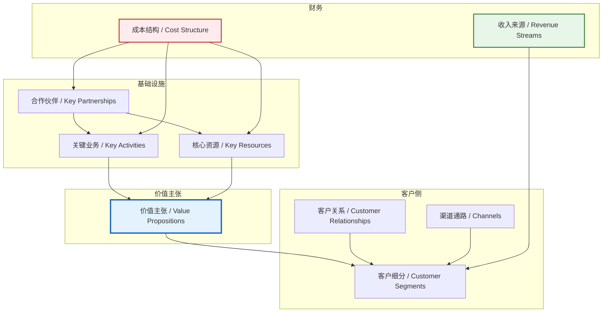

### 2.3 商业模式飞轮

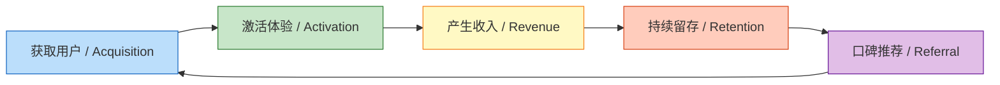

---

## 3. 价值主张设计

### 3.1 价值主张画布

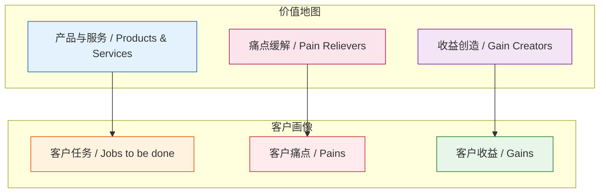

### 3.2 价值主张分层

| 层级 | 价值类型 | 具体描述 | 客户感知 |
|------|---------|---------|---------|
| **功能价值** | 解决问题 | 提供 [具体功能]，替代 [传统方式] | 效率提升 X 倍 |
| **经济价值** | 降低成本 | 相比竞品节省 [XX]% 成本 | ROI 可量化 |
| **情感价值** | 体验升级 | 使用过程 [愉悦/安心/专业] | NPS > 40 |
| **社会价值** | 身份认同 | 帮助客户建立 [专业/领先] 形象 | 品牌溢价 |

---

## 4. 客户细分与关系

### 4.1 客户细分金字塔

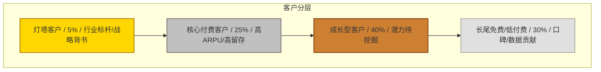

### 4.2 客户画像（Persona）

| 维度 | 客户 A（决策者） | 客户 B（使用者） | 客户 C（影响者） |
|------|----------------|----------------|----------------|
| **角色** | CEO/VP | 部门经理/执行层 | IT/采购/顾问 |
| **年龄** | 35-50 岁 | 25-35 岁 | 30-45 岁 |
| **核心诉求** | 降本增效、业务增长 | 操作便捷、不出错 | 安全稳定、合规 |
| **决策权重** | 高（预算审批） | 中（使用反馈） | 中（技术评估） |
| **触达渠道** | 行业峰会、私董会 | 产品社区、培训 | 技术论坛、POC |

### 4.3 客户关系策略

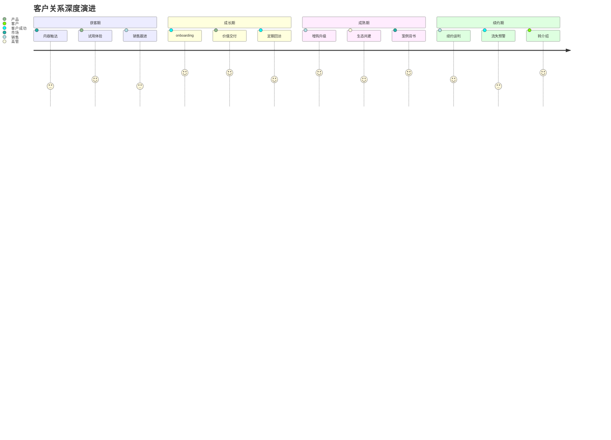

---

## 5. 渠道通路设计

### 5.1 全渠道漏斗

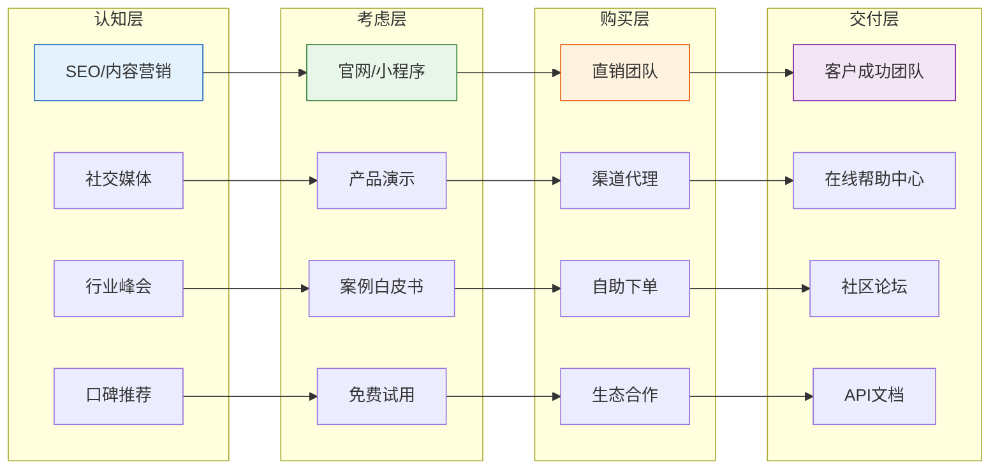

### 5.2 渠道效率矩阵

| 渠道 | CAC | 转化率 | 客户质量 | 规模化潜力 | 优先级 |
|------|-----|--------|---------|-----------|--------|
| 直销团队 | 高 | 高 | 极高 | 中 | P1 |
| 渠道代理 | 中 | 中 | 高 | 高 | P2 |
| 内容营销 | 低 | 低 | 中 | 极高 | P1 |
| 产品驱动增长 | 极低 | 中 | 中 | 极高 | P0 |
| 生态合作 | 中 | 高 | 高 | 中 | P2 |

---

## 6. 收入来源与定价

### 6.1 收入结构

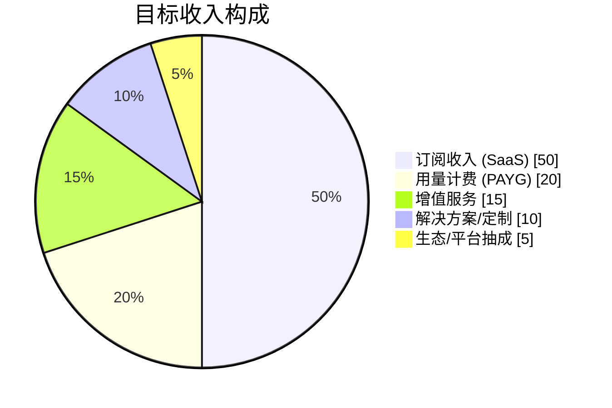

### 6.2 定价策略

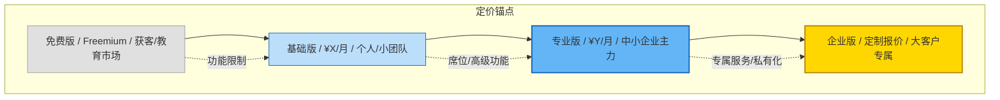

### 6.3 定价维度设计

| 版本 | 定价 | 核心功能 | 目标客户 | 转化策略 |
|------|------|---------|---------|---------|
| **免费版** | ¥0 | 基础功能+用量限制 | 个人/学生 | 体验入口 |
| **基础版** | ¥99/人/月 | 核心功能+标准支持 | 小团队 | 功能解锁 |
| **专业版** | ¥299/人/月 | 高级功能+优先支持 | 成长型企业 | ROI 论证 |
| **企业版** | 定制 | 全功能+私有化+专属CSM | 大型集团 | 高层对话 |

---

## 7. 核心资源与能力

### 7.1 资源能力金字塔

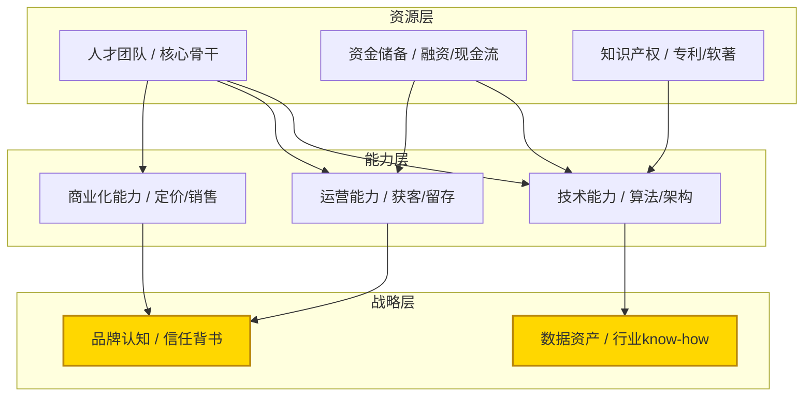

### 7.2 核心能力评估

| 能力维度 | 自评等级 | 行业对标 | 建设状态 | 投入计划 |
|---------|---------|---------|---------|---------|
| 技术研发 | ⭐⭐⭐⭐⭐ | 领先 | 已建立 | 持续投入 |
| 产品体验 | ⭐⭐⭐⭐ | 优秀 | 迭代中 | 加大投入 |
| 获客效率 | ⭐⭐⭐ | 中等 | 建设中 | 重点突破 |
| 客户成功 | ⭐⭐⭐⭐ | 优秀 | 已建立 | 体系化 |
| 供应链/交付 | ⭐⭐ | 落后 | 起步 | 引入人才 |

---

## 8. 关键业务活动

### 8.1 价值链分析

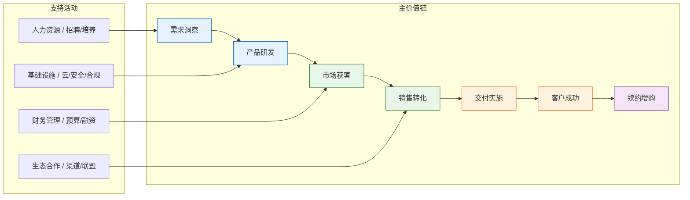

### 8.2 关键业务流程

| 业务环节 | 核心指标 | 当前水平 | 目标水平 | 关键动作 |
|---------|---------|---------|---------|---------|
| 需求洞察 | 需求准确率 | 60% | 85% | 建立客户顾问委员会 |
| 产品研发 | 上线周期 | 6周 | 2周 | 敏捷转型+DevOps |
| 市场获客 | MQL 成本 | ¥500 | ¥200 | 内容营销+PLG |
| 销售转化 | 赢单率 | 15% | 30% | 销售方法论+工具 |
| 客户成功 | 健康度评分 | 70分 | 90分 | CSM 体系化 |
| 续约增购 | NRR | 100% | 120% | 价值运营 |

---

## 9. 合作伙伴网络

### 9.1 生态合作图谱

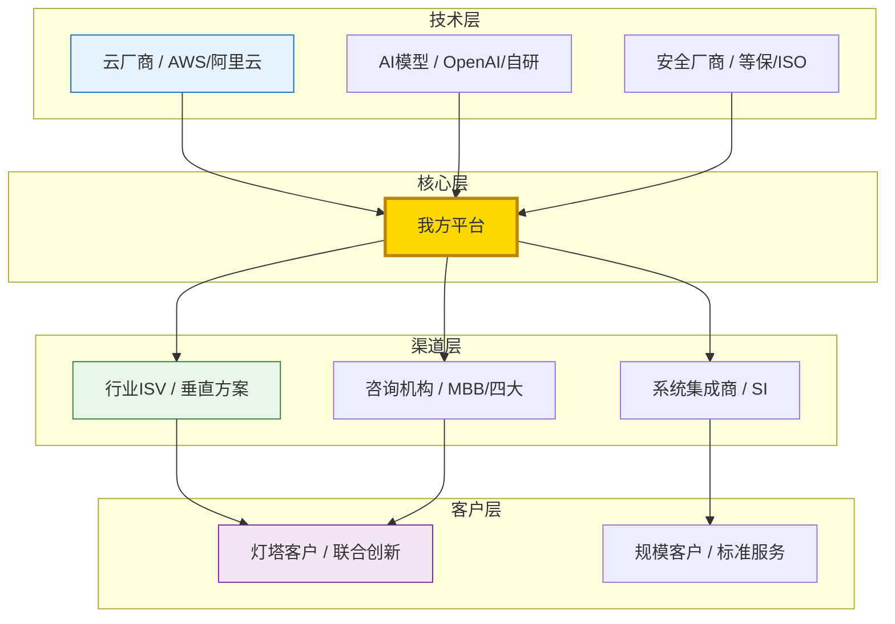

### 9.2 合作模式设计

| 合作类型 | 伙伴角色 | 我方价值 | 伙伴价值 | 合作深度 |
|---------|---------|---------|---------|---------|
| **战略联盟** | 云厂商/平台 | 解决方案丰富度 | 客户粘性提升 | 联合产品+联合销售 |
| **渠道分销** | 区域代理/ISV | 市场覆盖扩大 | 利润空间+产品补充 | 培训认证+返点 |
| **技术集成** | API/数据伙伴 | 产品能力增强 | 流量/数据反哺 | 技术对接+联合品牌 |
| **内容共创** | 媒体/咨询 | 行业影响力 | 独家内容源 | 白皮书+峰会 |

---

## 10. 成本结构与单位经济

### 10.1 成本结构分析

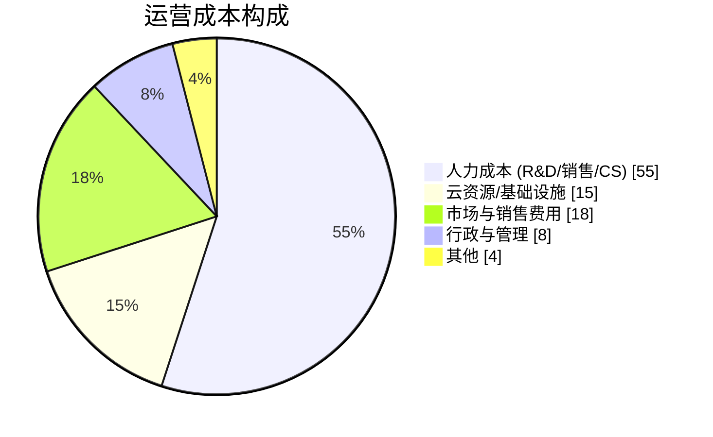

### 10.2 单位经济模型（Unit Economics）

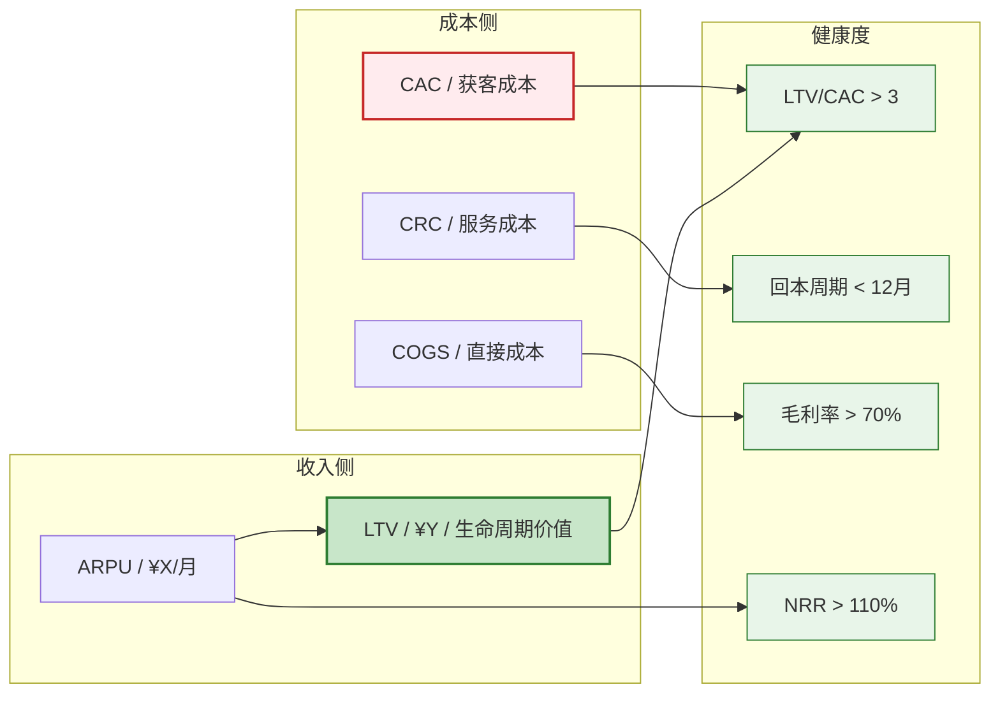

### 10.3 关键财务指标

| 指标 | 定义 | 当前值 | 健康标准 | 优化方向 |
|------|------|--------|---------|---------|
| **CAC** | 单客获取成本 | ¥[XX] | < LTV/3 | 优化渠道结构 |
| **LTV** | 客户终身价值 | ¥[XX] | > 3×CAC | 提升留存/增购 |
| **LTV/CAC** | 投资回报比 | [X]:1 | > 3:1 | 双向优化 |
| **回本周期** | CAC回收时间 | [X]月 | < 12月 | 提升首单价值 |
| **毛利率** | (收入-直接成本)/收入 | [X]% | SaaS>70% | 基础设施优化 |
| **NRR** | 净收入留存率 | [X]% | > 110% | 增购+扩容 |
| **Rule of 40** | 增长率%+利润率% | [X]% | > 40% | 平衡增长与盈利 |

---

## 11. 商业模式演进路线图

### 11.1 三阶段演进

> **说明**：甘特图为飞书不兼容类型，改为表格描述。

| 阶段 | 任务 | 开始日期 | 结束日期 | 工期 | 状态 |
|------|------|----------|----------|------|------|
| 阶段一：单点工具 | MVP验证 | 2024-01 | 2024-06 | 6个月 | 已完成 |
| 阶段一：单点工具 | PMF确认 | 2024-07 | 2024-12 | 6个月 | 已完成 |
| 阶段一：单点工具 | 单点收费 | 2024-10 | 2025-03 | 6个月 | 已完成 |
| 阶段二：平台化 | 功能扩展 | 2025-01 | 2025-06 | 6个月 | 进行中 |
| 阶段二：平台化 | 多租户架构 | 2025-04 | 2025-09 | 6个月 | 进行中 |
| 阶段二：平台化 | 生态开放 | 2025-07 | 2025-12 | 6个月 | 待开始 |
| 阶段三：生态网络 | 数据飞轮 | 2026-01 | 2026-06 | 6个月 | 待开始 |
| 阶段三：生态网络 | 平台抽成 | 2026-04 | 2026-09 | 6个月 | 待开始 |
| 阶段三：生态网络 | 行业标准 | 2026-07 | 2026-12 | 6个月 | 待开始 |

### 11.2 各阶段商业模式特征

| 阶段 | 时间 | 核心模式 | 收入特征 | 关键资源 | 护城河 |
|------|------|---------|---------|---------|--------|
| **单点工具** | 当前 | 产品售卖 | 线性增长，依赖销售 | 产品能力 | 功能领先 |
| **平台化** | 12-18月 | 订阅+增值 | 复利增长，网络初现 | 客户数据 | 转换成本 |
| **生态网络** | 24-36月 | 平台抽成+数据 | 指数增长，生态协同 | 行业标准 | 网络效应 |

---

## 12. 风险与可持续性分析

### 12.1 商业模式脆弱性评估

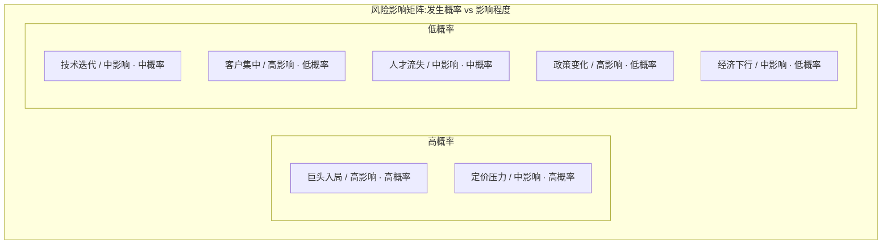

### 12.2 可持续性保障机制

| 风险类型 | 脆弱点 | 缓释策略 | 监控指标 |
|---------|--------|---------|---------|
| **竞争风险** | 巨头复制 | 深耕垂直+数据壁垒 | 市场份额变化 |
| **技术风险** | 技术路线错误 | 双轨研发+快速迭代 | 技术债务比率 |
| **客户风险** | 大客户流失 | 客户分散+多行业 | 客户集中度 |
| **财务风险** | 现金流断裂 | 控制烧钱+多元收入 | Runway 月数 |
| **合规风险** | 数据监管 | 合规前置+本地化 | 合规审计结果 |

### 12.3 ESG 与长期价值

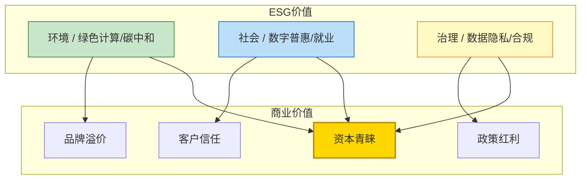

---

## 附录

### A. 术语表

| 术语 | 英文 | 定义 |
|------|------|------|
| CAC | Customer Acquisition Cost | 单客获取成本 |
| LTV | Lifetime Value | 客户终身价值 |
| NRR | Net Revenue Retention | 净收入留存率 |
| PMF | Product-Market Fit | 产品市场匹配 |
| PLG | Product-Led Growth | 产品驱动增长 |
| ARR | Annual Recurring Revenue | 年度经常性收入 |
| MRR | Monthly Recurring Revenue | 月度经常性收入 |
| ARPU | Average Revenue Per User | 每用户平均收入 |

### B. 参考框架

- Osterwalder, A. & Pigneur, Y. *Business Model Generation*
- Maurya, A. *Running Lean*
- Ellis, S. & Brown, M. *Hacking Growth*
- 麦肯锡 7S 模型 / 波特价值链 / 贝恩盈利系统

---

> **文档维护**：建议每季度复盘更新，重大战略调整时即时修订。
>
> **分发范围**：核心管理团队、董事会、战略投资人（签署保密协议后）。
