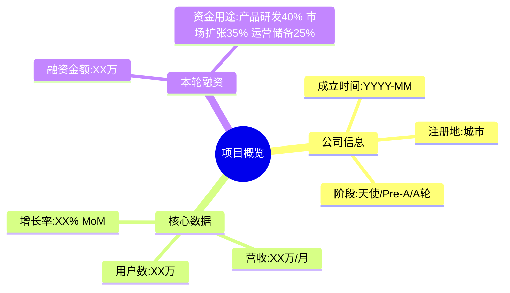
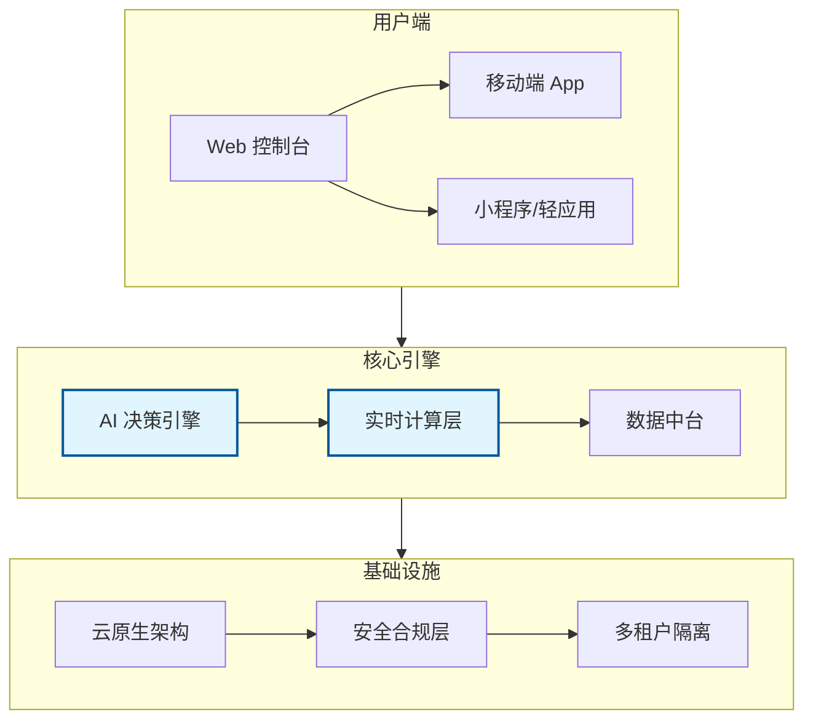
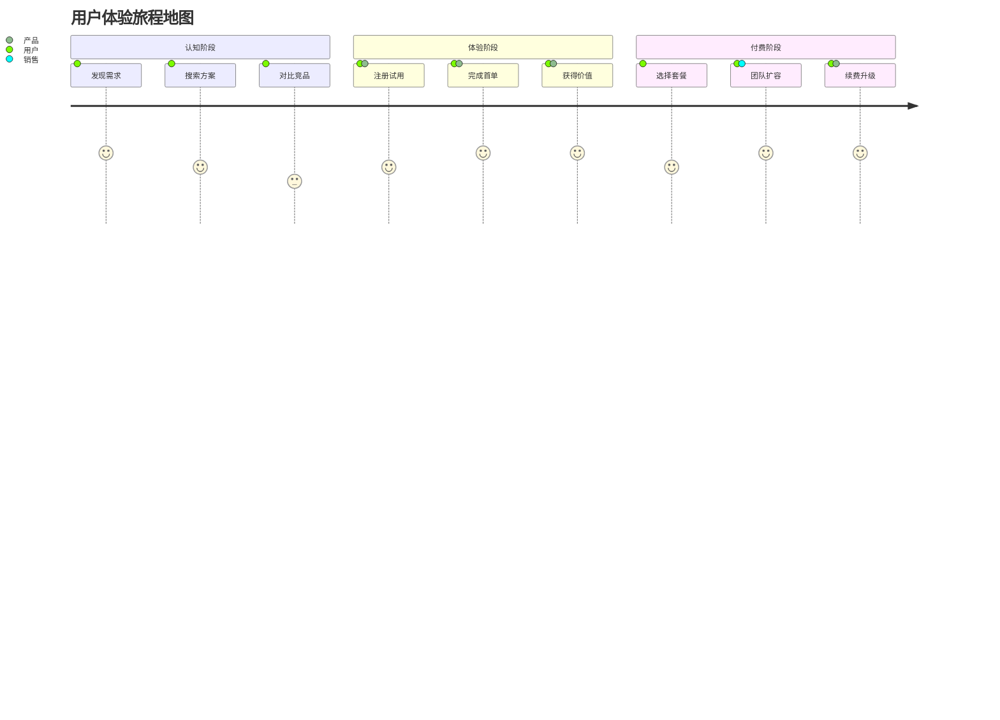
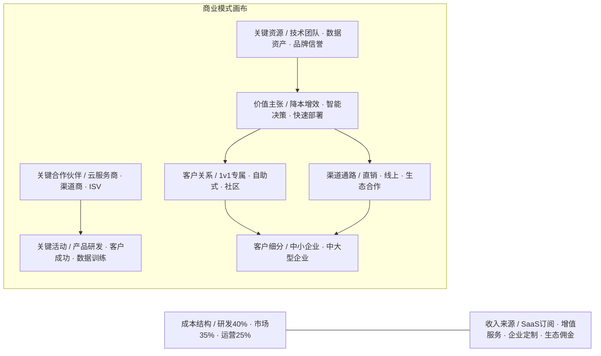
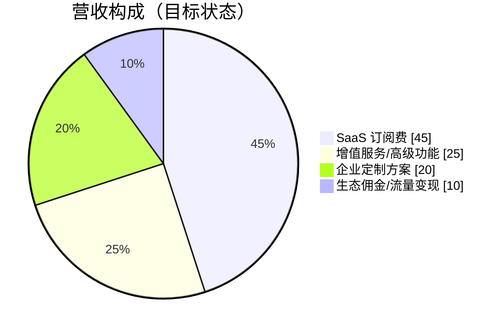
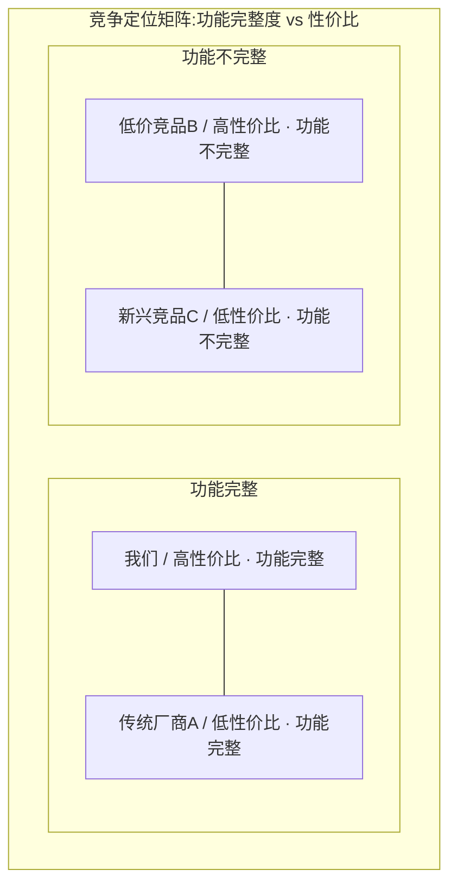
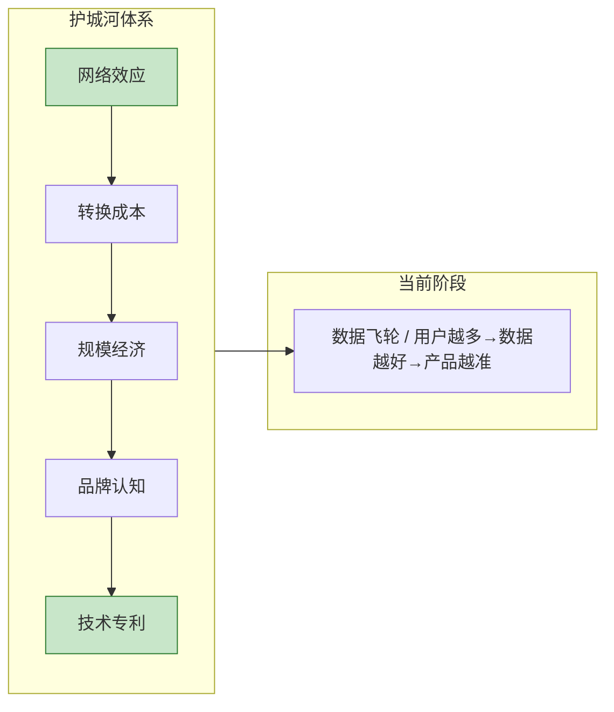
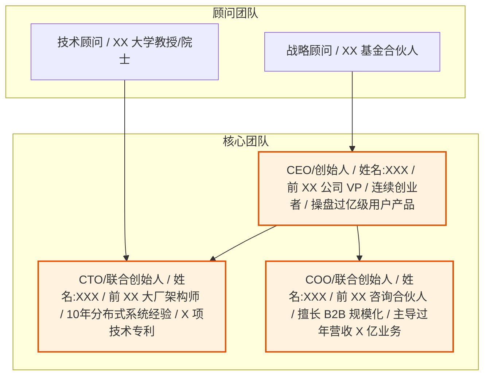
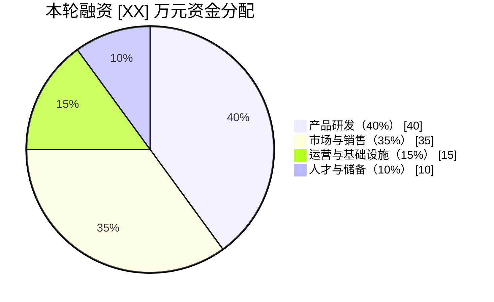
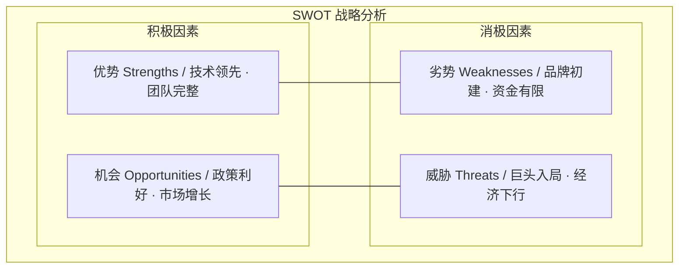

# [产品/系统名称（英文名）] - 商业计划书（BP）

> **文档状态：** 🟡 评审中 / 🟢 已通过 / 🔴 驳回
>
> **保密级别：** 机密 / 内部公开 / 公开
>
> **版本：** vX.X
>
> **日期：** YYYY-MM-DD
>
> **撰写人：** [姓名/角色]
>
> **评审人：** [姓名/角色]
>
> **阅读对象：** [角色列表]

---

## 0. 文档导读

### 0.1 文档目的与适用范围

[说明本文档的目的、适用场景和不适用场景]

### 0.2 相关文档

| 文档类型 | 文件名 | 相关章节 |
|---------|--------|---------|
| [类型] | [文件名] [行号范围] | [章节描述] |

> **引用格式说明**：关联文档使用 `文件名 行号范围` 格式（如 `【模板】技术需求文档(TRD).md 3-17`），行号随文档更新可能变化，请以实际内容为准。

### 0.3 变更记录

| 版本 | 日期 | 修订人 | 变更内容 | 审核人 |
| :--- | :--- | :--- | :--- | :--- |
| v0.1 | YYYY-MM-DD | [姓名] | 初稿 | [审核人] |

---

## 2. 执行摘要（Executive Summary）

> ⚠️ **核心原则**：这是整份 BP 中最重要的部分，投资人用 3-5 分钟决定是否继续阅读。控制在 **1-2 页**，每段不超过 3 行。

### 2.1 投资亮点
- **赛道**：处于 [XX] 行业，市场规模 [XX] 亿元，年复合增长率 [XX]%
- **产品**：[产品名称]，已验证 PMF，核心指标 [XX]
- **团队**：创始人来自 [大厂/名校]，曾操盘 [XX] 量级业务
- **融资**：本轮寻求 [XX] 万元/[XX] 万美元，出让 [XX]% 股权

### 2.2 项目概览

---

## 3. 痛点与市场机会

### 3.1 核心痛点分析

> 💡 **撰写要点**：用"用户原话"描述痛点，而非自嗨式描述。证明这是**真需求、高频、付费意愿强**的痛点。

| 痛点维度 | 现状描述 | 用户代价 | 市场空白 |
|---------|---------|---------|---------|
| **效率低下** | 传统方式需 [X] 小时完成 | 人力成本 [XX] 元/单 | 无自动化工具 |
| **信息孤岛** | 数据分散在 [N] 个系统 | 决策延迟 [X] 天 | 缺乏统一平台 |
| **成本高昂** | 现有方案价格 [XX] 万/年 | 中小企业无法承受 | 无普惠型产品 |

### 3.2 市场规模与趋势

| 类别 | 柱状值 | 折线值 |
|:---|:---:|:---:|
| 2024 | 120 | 120 |
| 2025 | 180 | 180 |
| 2026 | 260 | 260 |
| 2027 | 350 | 350 |
| 2028 | 480 | 480 |

> **说明**：xychart-beta为飞书不兼容Mermaid类型，改为表格描述（模板示例数据）。

**市场数据支撑**：
- **TAM（总可触达市场）**：[XX] 亿元
- **SAM（可服务市场）**：[XX] 亿元
- **SOM（可获得市场）**：[XX] 亿元（未来 3 年目标）

---

## 4. 产品与服务解决方案

### 4.1 产品架构

### 4.2 产品价值矩阵

| 功能模块 | 解决痛点 | 核心优势 | 技术壁垒 |
|---------|---------|---------|---------|
| 智能分析 | 人工处理慢 | 效率提升 10x | 自研 NLP 算法 |
| 自动编排 | 流程繁琐 | 零代码配置 | 专利工作流引擎 |
| 实时预警 | 事后补救 | 提前 24h 预警 | 时序预测模型 |

### 4.3 用户旅程与 Aha Moment

---

## 5. 商业模式与盈利路径

### 5.1 商业模式画布

### 5.2 收入模型

### 5.3 单位经济模型（Unit Economics）

| 指标 | 数值 | 行业对标 | 说明 |
|-----|------|---------|------|
| **CAC（获客成本）** | ¥[XX] | ¥[XX] | 含销售+市场费用 |
| **LTV（用户终身价值）** | ¥[XX] | ¥[XX] | 按 36 个月计算 |
| **LTV/CAC** | [X]:1 | >3:1 健康 | 投资回报比 |
| **月流失率** | [X]% | <5% 健康 | 含付费降级 |
| **回本周期** | [X] 月 | <12 月理想 | CAC 回收周期 |

---

## 6. 市场竞争与护城河

### 6.1 竞争格局图谱

### 6.2 竞品对比分析

| 对比维度 | 我们 | 竞品 A（传统） | 竞品 B（新兴） | 竞品 C（国际） |
|---------|------|---------------|---------------|---------------|
| **定价模式** | 按需订阅 | 高额年费 | 免费+增值 | 按量计费 |
| **部署方式** | 5分钟接入 | 需 2 周实施 | 仅 SaaS | 混合云 |
| **核心算法** | 自研/专利 | 开源方案 | 第三方 API | 自研 |
| **客户成功** | 1v1 专属 | 工单制 | 社区支持 | 邮件支持 |
| **数据安全** | 等保三级 | 等保二级 | 无认证 | SOC2 |

### 6.3 护城河构建

---

## 7. 运营计划与里程碑

### 7.1 发展阶段路线图

> **说明**：甘特图为飞书不兼容类型，改为表格描述。

| 阶段 | 任务 | 开始日期 | 结束日期 | 工期 | 状态 |
|------|------|----------|----------|------|------|
| 产品研发 | MVP 验证 | 2024-01 | 2024-06 | 6个月 | 已完成 |
| 产品研发 | 核心功能 V1.0 | 2024-07 | 2024-12 | 6个月 | 已完成 |
| 产品研发 | 平台化 V2.0 | 2025-01 | 2025-06 | 6个月 | 进行中 |
| 产品研发 | 生态构建 V3.0 | 2025-07 | 2025-12 | 6个月 | 待开始 |
| 市场拓展 | 种子用户 100家 | 2024-01 | 2024-06 | 6个月 | 已完成 |
| 市场拓展 | 行业标杆 10家 | 2024-07 | 2024-12 | 6个月 | 已完成 |
| 市场拓展 | 规模化 1000家 | 2025-01 | 2025-06 | 6个月 | 进行中 |
| 市场拓展 | 出海/新行业 | 2025-07 | 2025-12 | 6个月 | 待开始 |
| 团队建设 | 核心团队 10人 | 2024-01 | 2024-06 | 6个月 | 已完成 |
| 团队建设 | 扩张至 30人 | 2024-07 | 2024-12 | 6个月 | 已完成 |
| 团队建设 | 扩张至 80人 | 2025-01 | 2025-06 | 6个月 | 进行中 |
| 团队建设 | 扩张至 150人 | 2025-07 | 2025-12 | 6个月 | 待开始 |

### 7.2 关键里程碑与 KPI

| 阶段 | 时间 | 核心目标 | 关键指标 |
|-----|------|---------|---------|
| **验证期** | 已完成 | PMF 验证 | NPS > 40，留存 > 60% |
| **增长期** | 当前 | 规模化获客 | ARR 突破 [XX] 万 |
| **扩张期** | 未来 12 月 | 市场渗透 | 付费客户 [XX] 家 |
| **盈利期** | 未来 24 月 | 正向现金流 | 单月盈亏平衡 |

---

## 8. 核心管理团队

> 💡 **投资人视角**：早期项目看团队，成长期看数据。团队介绍要**具体、可验证**，避免"10年行业经验"这类空话。

### 8.1 创始团队

### 8.2 团队背景与分工

| 职位 | 姓名 | 核心履历 | 负责板块 | 全职/兼职 |
|-----|------|---------|---------|----------|
| CEO | [姓名] | [大厂] [X] 年，[具体成果] | 战略/融资/产品 | 全职 |
| CTO | [姓名] | [名校] [专业]，[专利/论文] | 技术/研发 | 全职 |
| CMO | [姓名] | [知名案例]，[渠道资源] | 市场/品牌 | 全职 |
| 销售 VP | [姓名] | [行业客户资源]，[历史业绩] | 商业化/客户成功 | 全职 |

---

## 9. 财务预测与融资需求

### 9.1 历史与预测财务数据

**营收预测**：

| 类别 | 柱状值 | 折线值 |
|:---|:---:|:---:|
| 2023 | 50 | 50 |
| 2024 | 300 | 300 |
| 2025E | 1,200 | 1,200 |
| 2026E | 3,500 | 3,500 |
| 2027E | 8,000 | 8,000 |

**净利润预测**：

| 类别 | 柱状值 | 折线值 |
|:---|:---:|:---:|
| 2023 | -200 | -200 |
| 2024 | -500 | -500 |
| 2025E | -300 | -300 |
| 2026E | 500 | 500 |
| 2027E | 2,000 | 2,000 |

> **说明**：xychart-beta为飞书不兼容Mermaid类型，改为表格描述（模板示例数据）。

### 9.2 财务预测表（未来 3-5 年）

| 指标（万元） | 2024 实际 | 2025 预测 | 2026 预测 | 2027 预测 |
|------------|----------|----------|----------|----------|
| **营业收入** | [XX] | [XX] | [XX] | [XX] |
| **毛利润** | [XX] | [XX] | [XX] | [XX] |
| **毛利率** | [XX]% | [XX]% | [XX]% | [XX]% |
| **运营费用** | [XX] | [XX] | [XX] | [XX] |
| **净利润** | [XX] | [XX] | [XX] | [XX] |
| **净利率** | [XX]% | [XX]% | [XX]% | [XX]% |

### 9.3 融资需求与资金用途

**融资详情**：
- **轮次**：[天使/Pre-A/A/B] 轮
- **融资金额**：[XX] 万元人民币 / [XX] 万美元
- **出让股权**：[XX]%
- **投前估值**：[XX] 万元（基于 [XX] 倍 ARR 或 [XX] 倍 PS）
- **资金用途**：
  - 产品研发：[XX] 万（占比 40%）— 核心算法优化、V2.0 平台开发
  - 市场扩张：[XX] 万（占比 35%）— 销售团队搭建、品牌投放、渠道建设
  - 运营储备：[XX] 万（占比 15%）— 云资源、合规认证、办公场地
  - 人才招募：[XX] 万（占比 10%）— 关键岗位招聘、期权池补充

---

## 10. 风险分析与应对策略

### 10.1 SWOT 分析

### 10.2 核心风险与缓解方案

| 风险类型 | 具体描述 | 发生概率 | 影响程度 | 应对策略 |
|---------|---------|---------|---------|---------|
| **市场风险** | 巨头快速跟进，价格战 | 中 | 高 | 深耕垂直场景，建立数据壁垒 |
| **技术风险** | 核心算法效果不达预期 | 低 | 高 | 双技术路线并行，预留 Plan B |
| **运营风险** | 关键人才流失 | 中 | 中 | 完善期权激励，建立知识文档化 |
| **财务风险** | 融资环境恶化 | 中 | 高 | 控制烧钱速度，保持 18 个月 runway |
| **合规风险** | 数据监管政策变化 | 低 | 中 | 提前申请等保/ISO，法务前置 |

---

## 📎 附录（Appendix）

> 以下内容可单独整理为附录文档，供深度尽调时查阅。

1. **详细财务模型**（Excel）：3-5 年完整三张表预测及假设条件
2. **产品演示视频/Demo**：核心功能操作流程
3. **客户证言/案例研究**：[标杆客户] 使用前后对比数据
4. **知识产权清单**：专利、软著、商标列表
5. **团队详细简历**：核心成员完整履历
6. **行业研究报告**：引用第三方权威数据来源

---

## ✅ 撰写 checklist（投递前自检）

| 检查项 | 状态 | 说明 |
|-------|------|------|
| 一句话价值主张是否清晰？ | ☐ | 让非行业人士也能听懂 |
| 痛点是否用用户原话描述？ | ☐ | 避免自嗨式表达 |
| 市场数据是否有权威来源？ | ☐ | 引用艾瑞/IDC/政府报告 |
| 商业模式是否说清怎么赚钱？ | ☐ | 收入来源、定价、成本结构 |
| 竞品分析是否客观？ | ☐ | 不贬低对手，突出差异化 |
| 财务预测是否合理？ | ☐ | 避免"一年内 10 亿利润" |
| 融资金额和用途是否明确？ | ☐ | 33% 的 BP 死在这里 |
| 联系方式是否留全？ | ☐ | 创始人手机号+微信+邮箱 |

---

> 📧 **联系方式**
> - 创始人：[姓名]
> - 手机：[号码]
> - 微信：[微信号]
> - 邮箱：[email@company.com]
> - 公司官网：[www.company.com]

---

### 💡 使用建议

1. **版本管理**：准备三个版本
   - **1 页执行摘要**（PDF，用于初次邮件触达）
   - **12-15 页演示版**（PPT/Markdown，用于路演）
   - **30-50 页完整版**（Word/Markdown，用于深度尽调）

2. **图表优先**：每页必有 1 个图表或数据点，文字不超过 100 字。

3. **数据真实**：所有预测基于可验证的假设，准备好 Excel 底稿应对追问。

4. **定制修改**：针对不同投资机构调整侧重点——财务 VC 看增长数据，战略投资人看协同价值。
