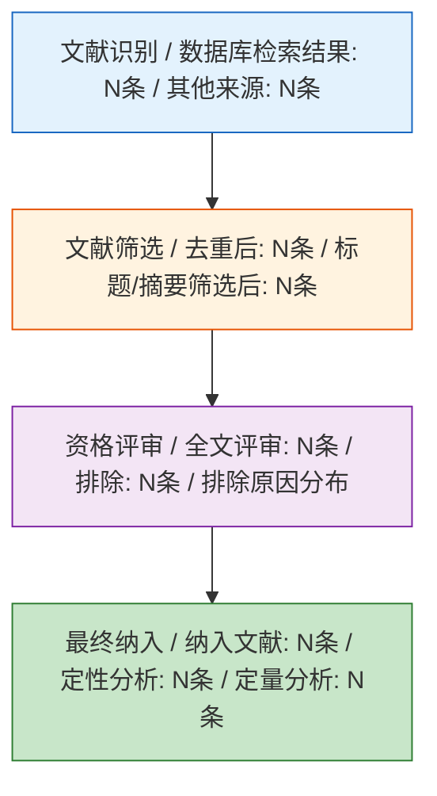
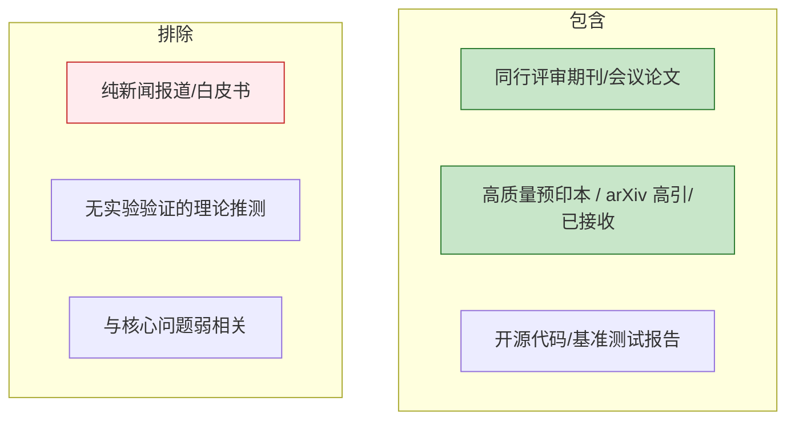
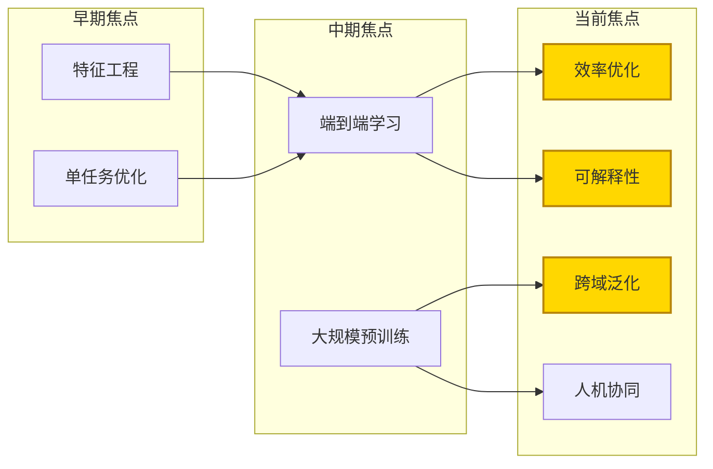
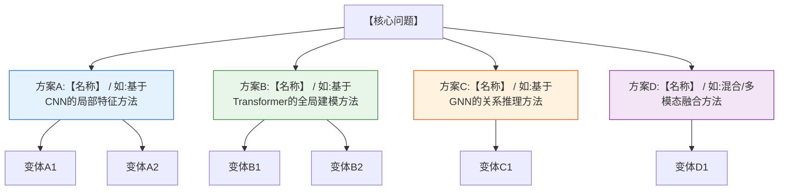
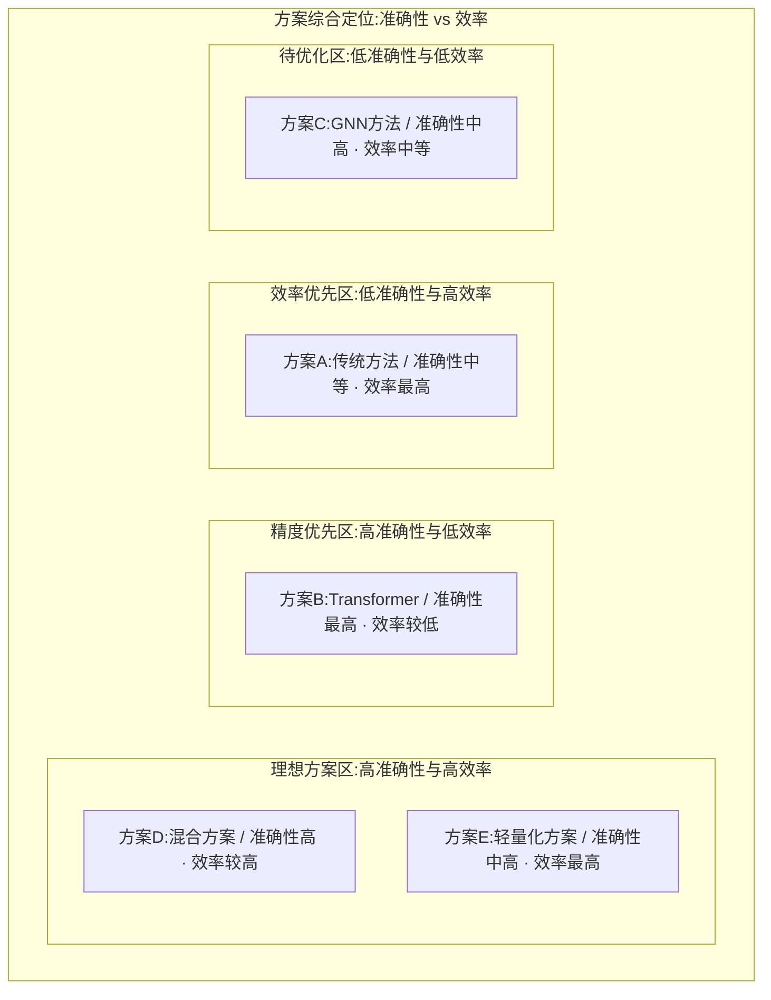
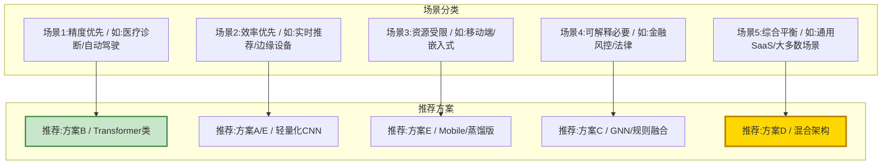
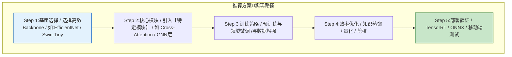
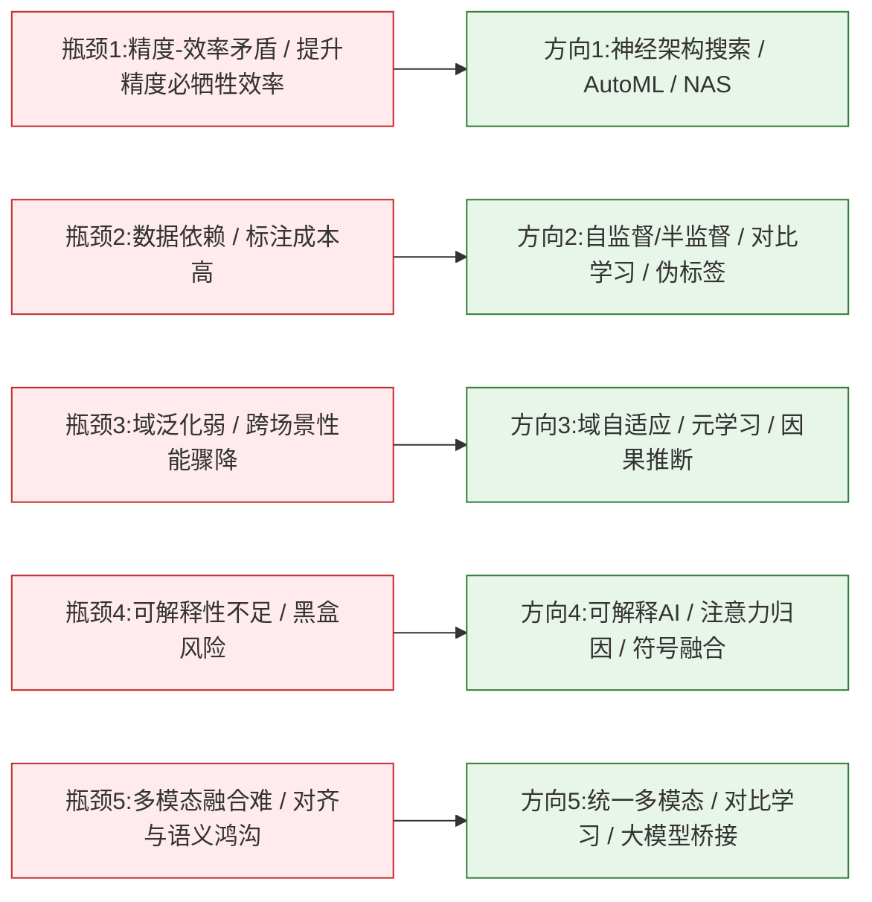
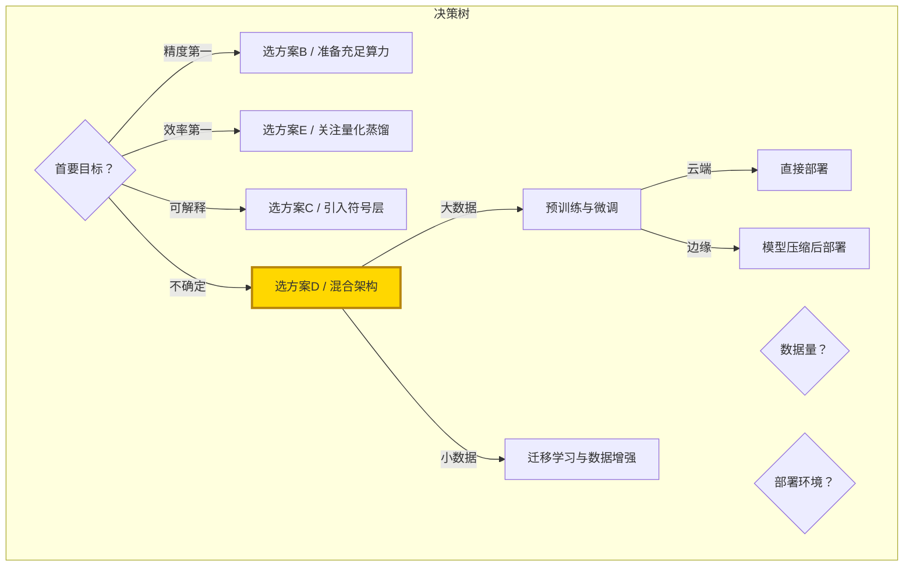

# [产品/系统名称（英文名）] - 论文研究报告（Literature Review）

> **文档状态：** 🟡 评审中 / 🟢 已通过 / 🔴 驳回
>
> **保密级别：** 机密 / 内部公开 / 公开
>
> **版本：** vX.X
>
> **日期：** YYYY-MM-DD
>
> **撰写人：** [姓名/角色]
>
> **评审人：** [姓名/角色]
>
> **阅读对象：** [角色列表]
>
> **文章类型**：Survey / 综述报告
>
> **核心目标**：系统梳理【主题】的研究演进，分类对比主流技术方案，建立评判框架并推荐当前最优路径
>
> **检索范围**：20XX–2026，Web of Science / Scopus / arXiv / IEEE / CNKI
>
> **纳入文献**：经筛选后共纳入 **XXX** 篇核心文献

---

## 0. 文档导读

### 0.1 文档目的与适用范围

[说明本文档的目的、适用场景和不适用场景]

### 0.2 相关文档

| 文档类型 | 文件名 | 相关章节 |
|---------|--------|---------|
| [类型] | [文件名] [行号范围] | [章节描述] |

> **引用格式说明**：关联文档使用 `文件名 行号范围` 格式（如 `【模板】技术需求文档(TRD).md 3-17`），行号随文档更新可能变化，请以实际内容为准。

### 0.3 变更记录

| 版本 | 日期 | 修订人 | 变更内容 | 审核人 |
| :--- | :--- | :--- | :--- | :--- |
| v0.1 | YYYY-MM-DD | [姓名] | 初稿 | [审核人] |
| v0.2 | 2026-XX-XX | [姓名] | 示例：新增XXX分析 | [审核人] |

---

## 摘要

**背景**：【一句话交代领域背景与核心问题】。
**方法**：遵循系统综述方法，从 **N** 个数据库检索，按技术路线将文献分为 **K** 大类，从 **准确性、效率、泛化性、可解释性、部署成本** 五个维度建立对比框架。
**发现**：
1. 该领域经历了从 **【早期范式】→【中期范式】→【当前范式】** 的三阶段演进；
2. 当前主流方案可分为 **【方案A】、【方案B】、【方案C】** 三大类，各自在 **【某维度】** 上占优；
3. 综合评判下，**【某方案/混合方案】** 在 **【某场景】** 下表现最优，但在 **【某场景】** 仍存在瓶颈。
**结论**：未来研究应优先突破 **【方向1】** 与 **【方向2】**，并建议实际应用采用 **【推荐方案】** 作为基线。

---

## 1. 研究方法论声明

### 1.1 论文定位

本文定位为以下类型之一（必填，二选一）：

- [ ] **系统综述（Systematic Review）**：遵循 PRISMA 2020 指南，具有可复现的检索策略、明确的纳入/排除标准、偏倚风险评估
- [ ] **叙述性综述（Narrative Review）/ 研究进展（Research Progress）**：基于作者专业判断选择性综述文献，提供领域全景但不保证穷尽性

**定位理由**：【说明选择该定位的原因，如：文献检索过程可追溯/不可追溯、是否遵循 PRISMA 等】

### 1.2 方法论适用声明

| 声明项 | 内容 |
|--------|------|
| 检索策略可复现性 | 是/否。若否，说明原因 |
| 偏倚风险评估 | 已完成/未完成 |
| 证据等级标注 | 已完成/未完成 |
| 同行评审文献占比 | XX% |

### 1.3 PRISMA 流程图（仅系统综述必填）

> 若本文定位为叙述性综述/研究进展，本章节可标注"不适用"并跳过。



**检索详情**：

| 数据库 | 检索式 | 检索日期 | 初始结果 | 去重后 |
|--------|--------|---------|---------|--------|
| [数据库1] | [检索式] | YYYY-MM-DD | N | N |
| [数据库2] | [检索式] | YYYY-MM-DD | N | N |

---

## 3. 引言

### 3.1 研究背景与核心问题

【研究领域】近年来受到广泛关注，其核心挑战在于：**【用 1-2 句话定义核心科学/工程问题】**。例如：

> 如何在 **【约束条件】** 下，实现 **【目标】**，同时满足 **【指标1】** 与 **【指标2】** 的平衡？

该问题在 **【应用场景A】、【应用场景B】、【应用场景C】** 中具有重要价值。

### 3.2 为什么需要这份综述

现有综述存在以下不足：
- **【不足1】**：多数文献仅梳理技术列表，缺乏**方案之间的直接对比**；
- **【不足2】**：缺少统一的**多维度评判框架**，导致"最优"定义模糊；
- **【不足3】**：未结合**最新进展（2024–2026）** 更新结论。

本综述的**差异化贡献**：
1. 建立 **五维度评判框架**（准确性 / 效率 / 泛化性 / 可解释性 / 成本）；
2. 对每类方案给出 **定量/半定量对比**；
3. 明确推荐 **当前最优技术路径** 及适用边界。

### 3.3 综述范围与边界



---

## 4. 研究演进脉络

### 4.1 三阶段发展时间线

> **说明**：甘特图为飞书不兼容类型，改为表格描述。

| 阶段 | 任务 | 开始年份 | 结束年份 | 工期 | 状态 |
|------|------|----------|----------|------|------|
| 萌芽期：问题定义 | 基础理论建立 | 2015 | 2018 | 4年 | 已完成 |
| 萌芽期：问题定义 | 首个基准数据集 | 2017 | 2019 | 3年 | 已完成 |
| 萌芽期：问题定义 | 早期启发式方法 | 2018 | 2021 | 4年 | 已完成 |
| 发展期：方法爆发 | 深度学习引入 | 2020 | 2023 | 4年 | 已完成 |
| 发展期：方法爆发 | 多分支架构竞争 | 2022 | 2025 | 4年 | 已完成 |
| 发展期：方法爆发 | 大规模预训练 | 2024 | 2026 | 3年 | 已完成 |
| 成熟期：优化与落地 | 效率优化方向 | 2025 | 2026 | 2年 | 进行中 |
| 成熟期：优化与落地 | 多模态/跨域融合 | 2025 | 2026 | 2年 | 进行中 |
| 成熟期：优化与落地 | 可解释与可信研究 | 2025 | 2026 | 2年 | 进行中 |
| 成熟期：优化与落地 | 工业级部署方案 | 2025 | 2026 | 2年 | 里程碑 |

### 4.2 各阶段代表性工作

| 阶段 | 时间 | 核心特征 | 里程碑文献 | 关键局限 |
|------|------|---------|-----------|---------|
| **萌芽期** | 20XX–20XX | 规则驱动 / 统计方法 | [作者A, 年份] 首次定义问题 | 泛化性差，依赖人工特征 |
| **发展期** | 20XX–20XX | 深度学习主导，精度跃升 | [作者B, 年份] 提出基础架构 | 计算成本高，黑盒问题 |
| **成熟期** | 20XX–2026 | 效率-精度-可解释三角权衡 | [作者C, 年份] 实现SOTA | 场景适配仍需调优 |

### 4.3 研究主题演化



---

## 5. 主流研究方案分类与原理

> **分类逻辑**：根据 **【核心技术差异，如：架构类型 / 学习范式 / 优化目标】**，将现有研究分为 **N** 大类。

### 5.1 方案总览



### 5.2 方案A：【方案名称】

**核心思想**：
> 【用 2-3 句话概括该方案的核心假设与解决思路】

**典型架构**：


**代表性文献与核心贡献**：

| 文献 | 年份 | 核心创新 | 解决的关键问题 |
|------|------|---------|---------------|
| [作者A1] | 20XX | 【创新点】 | 【问题】 |
| [作者A2] | 20XX | 【创新点】 | 【问题】 |
| [作者A3] | 20XX | 【创新点】 | 【问题】 |

**优势与劣势**：
- ✅ **优势**：【如：局部特征捕获能力强，计算高效】
- ❌ **劣势**：【如：长距离依赖建模弱，需大量标注数据】

---

### 5.3 方案B：【方案名称】

**核心思想**：
> 【概括】

**典型架构**：


**代表性文献**：

| 文献 | 年份 | 核心创新 | 解决的关键问题 |
|------|------|---------|---------------|
| [作者B1] | 20XX | 【创新点】 | 【问题】 |
| [作者B2] | 20XX | 【创新点】 | 【问题】 |

**优势与劣势**：
- ✅ **优势**：【如：全局依赖建模，迁移能力强】
- ❌ **劣势**：【如：二次复杂度，小样本易过拟合】

---

### 5.4 方案C：【方案名称】

**核心思想**：
> 【概括】

**代表性文献**：

| 文献 | 年份 | 核心创新 | 解决的关键问题 |
|------|------|---------|---------------|
| [作者C1] | 20XX | 【创新点】 | 【问题】 |
| [作者C2] | 20XX | 【创新点】 | 【问题】 |

**优势与劣势**：
- ✅ **优势**：【如：关系推理能力强，可解释性好】
- ❌ **劣势**：【如：图构建开销大，噪声敏感】

---

### 5.5 方案D：混合/融合方案

**核心思想**：
> 结合上述方案的互补优势，通过 **【融合策略，如：多塔架构 / 级联 / 知识蒸馏】** 实现综合提升。

**代表性文献**：

| 文献 | 年份 | 融合策略 | 效果提升 |
|------|------|---------|---------|
| [作者D1] | 20XX | 【策略】 | 【指标提升】 |
| [作者D2] | 20XX | 【策略】 | 【指标提升】 |

---

## 6. 方案多维度对比分析

### 6.1 对比框架设计

本综述从以下 **五个维度** 建立评判标准：

| 维度 | 定义 | 衡量方式 | 权重（建议） |
|------|------|---------|-------------|
| **准确性** | 在标准测试集上的性能 | Accuracy / F1 / mAP / BLEU 等 | 30% |
| **效率** | 推理速度与资源占用 | FPS / 参数量 / FLOPs / 内存 | 25% |
| **泛化性** | 跨域/跨任务/小样本表现 | 跨数据集性能下降率 | 20% |
| **可解释性** | 决策过程是否透明 | 可视化/归因分析/人类可理解度 | 15% |
| **部署成本** | 工程化难度与维护成本 | 训练成本 / 硬件要求 / 团队门槛 | 10% |

> **证据等级标注规范**：本综述中每条推荐均标注 Oxford CEBM 2011 证据等级（1a–5）和 GRADE 置信度（高/中/低/极低）。星号评级（⭐）仅作为直观展示，不代表严格的方法论评估。详细证据评估见§6.5偏倚风险评估。

> **评分协议声明**：上述权重为建议权重，基于【权重来源：专家共识/文献依据/AHP分析】。各维度评分的操作化定义如下：
> - **准确性 5分**：在标准基准上达到或超过 SOTA；**1分**：显著低于基线方法
> - **效率 5分**：满足实时推理需求（<100ms）；**1分**：无法满足在线服务需求
> - **泛化性 5分**：跨域性能下降<10%；**1分**：跨域性能下降>50%
> - **可解释性 5分**：决策路径完全可追溯；**1分**：完全黑盒
> - **部署成本 5分**：开箱即用，无需训练；**1分**：需大规模定制训练
>
> **敏感性分析**：各权重 ±10% 变化时，推荐结论【稳定/不稳定】。

### 6.2 各方案评分对比（雷达图概念）



### 6.3 详细对比矩阵

| 对比维度 | 方案A | 方案B | 方案C | 方案D（混合） | 方案E（轻量化） |
|---------|-------|-------|-------|--------------|----------------|
| **准确性** | ⭐⭐⭐ | ⭐⭐⭐⭐⭐ | ⭐⭐⭐⭐ | ⭐⭐⭐⭐⭐ | ⭐⭐⭐⭐ |
| **推理效率** | ⭐⭐⭐⭐⭐ | ⭐⭐⭐ | ⭐⭐⭐⭐ | ⭐⭐⭐⭐ | ⭐⭐⭐⭐⭐ |
| **训练效率** | ⭐⭐⭐⭐⭐ | ⭐⭐ | ⭐⭐⭐ | ⭐⭐⭐ | ⭐⭐⭐⭐ |
| **泛化能力** | ⭐⭐⭐ | ⭐⭐⭐⭐⭐ | ⭐⭐⭐⭐ | ⭐⭐⭐⭐⭐ | ⭐⭐⭐⭐ |
| **可解释性** | ⭐⭐⭐⭐ | ⭐⭐ | ⭐⭐⭐⭐⭐ | ⭐⭐⭐ | ⭐⭐⭐ |
| **部署成本** | 低 | 高 | 中 | 高 | 低 |
| **数据依赖** | 中 | 高 | 中 | 高 | 中 |
| **典型场景** | 实时/边缘 | 精度优先 | 关系推理 | 综合场景 | 移动端 |

### 6.4 基准测试数据对比

> **数据来源**：在 **【标准数据集，如：XXX-Bench / GLUE / COCO】** 上的公开结果。

| 方案 | 代表模型 | 数据集 | 核心指标 | 数值 | 参数量 | 推理延迟 |
|------|---------|--------|---------|------|--------|---------|
| 方案A | [模型A] | [数据集] | [指标] | [X.XX] | [XM] | [Xms] |
| 方案B | [模型B] | [数据集] | [指标] | [X.XX] | [XM] | [Xms] |
| 方案C | [模型C] | [数据集] | [指标] | [X.XX] | [XM] | [Xms] |
| 方案D | [模型D] | [数据集] | [指标] | [X.XX] | [XM] | [Xms] |
| 方案E | [模型E] | [数据集] | [指标] | [X.XX] | [XM] | [Xms] |

### 6.5 偏倚风险评估

#### 证据等级标注（Oxford CEBM 2011）

| 证据等级 | 定义 | 本文中对应文献数量 | 占比 |
|---------|------|------------------|------|
| 1a | 系统综述（RCT） | N | XX% |
| 1b | 单个RCT | N | XX% |
| 2a | 系统综述（队列研究） | N | XX% |
| 2b | 单个队列研究 | N | XX% |
| 3a | 系统综述（病例对照） | N | XX% |
| 3b | 单个病例对照 | N | XX% |
| 4 | 病例系列/低质量队列 | N | XX% |
| 5 | 专家意见 | N | XX% |

#### GRADE 置信度评估

| 推荐条目 | 证据等级 | 置信度 | 降级原因 | 升级原因 |
|---------|---------|--------|---------|---------|
| [推荐1] | [等级] | 高/中/低/极低 | [原因] | [原因] |
| [推荐2] | [等级] | 高/中/低/极低 | [原因] | [原因] |

#### 文献类型分布

| 文献类型 | 数量 | 占比 |
|---------|------|------|
| 同行评审期刊/会议论文 | N | XX% |
| 预印本（arXiv等） | N | XX% |
| 行业报告/白皮书 | N | XX% |
| 其他 | N | XX% |

---

## 7. 最优方案评判与推荐

### 7.1 评判逻辑

"最优"并非绝对，而是 **场景依赖** 的。本综述按以下场景分类推荐：



### 7.2 场景化最优推荐

#### 场景一：精度优先（科研/高价值决策）

| 项目 | 内容 |
|------|------|
| **推荐方案** | 方案B（Transformer/大模型路线） |
| **代表工作** | [作者B2, 年份] |
| **核心理由** | 在【数据集】上达到 SOTA，误差率降低 **X%** |
| **适用条件** | 算力充足、数据量大、延迟不敏感 |
| **风险提示** | 过拟合风险、黑盒决策需人工复核 |

#### 场景二：效率优先（实时系统）

| 项目 | 内容 |
|------|------|
| **推荐方案** | 方案E（轻量化/蒸馏/量化路线） |
| **代表工作** | [作者E1, 年份] |
| **核心理由** | 精度损失 **<X%**，速度提升 **X 倍**，满足 **XXms** 延迟要求 |
| **适用条件** | 高并发、低延迟、边缘部署 |
| **风险提示** | 极端场景精度可能骤降 |

#### 场景三：可解释必要（高风险决策）

| 项目 | 内容 |
|------|------|
| **推荐方案** | 方案C（GNN/符号推理/注意力可视化） |
| **代表工作** | [作者C2, 年份] |
| **核心理由** | 决策路径可追溯，符合 **【法规/标准】** 可解释性要求 |
| **适用条件** | 金融、医疗、司法等强监管领域 |
| **风险提示** | 建模复杂度较高，需领域专家参与 |

#### 场景四：综合平衡（大多数工业应用）⭐ **当前最优**

| 项目 | 内容 |
|------|------|
| **推荐方案** | **方案D（混合架构）** |
| **代表工作** | [作者D2, 年份] |
| **核心理由** | 在准确性（**X.XX**）、效率（**Xms**）、泛化性（跨域下降 **<X%**）之间取得最佳帕累托前沿 |
| **架构建议** | 【具体架构描述，如：轻量编码器 + 注意力精炼 + 知识蒸馏】 |
| **适用条件** | 通用场景、团队技术栈中等、追求投入产出比 |
| **风险提示** | 架构复杂度高，需调优经验 |

### 7.3 最优方案的技术实现路径



---

## 8. 当前研究瓶颈与突破方向

### 8.1 五大瓶颈



### 8.2 未来 3 年优先研究议程

| 优先级 | 方向 | 科学问题 | 建议方法 | 预期突破时间 |
|-------|------|---------|---------|-------------|
| **P0** | 【方向1】 | 【问题】 | 【方法】 | 2026–2027 |
| **P0** | 【方向2】 | 【问题】 | 【方法】 | 2026–2027 |
| **P1** | 【方向3】 | 【问题】 | 【方法】 | 2027–2028 |
| **P1** | 【方向4】 | 【问题】 | 【方法】 | 2027–2028 |
| **P2** | 【方向5】 | 【问题】 | 【方法】 | 2028+ |

---

## 9. 结论

### 9.1 核心结论

1. **研究演进**：【主题】已完成从 **【早期】** 到 **【当前】** 的范式转换，当前处于 **【阶段特征】**。
2. **方案格局**：**方案B** 在精度上领先，**方案E** 在效率上占优，**方案D** 在综合场景下达到帕累托最优。
3. **最优推荐**：
   - **科研/高精度场景** → 方案B；
   - **实时/边缘场景** → 方案E；
   - **强监管场景** → 方案C；
   - **通用工业落地** → **方案D（推荐）**。
4. **未来突破**：**【方向1】** 与 **【方向2】** 是未来 2 年最有可能产生质变的研究方向。

### 9.2 对实践者的建议



### 9.3 本综述局限

- 仅纳入 **【语言/数据库】** 文献，可能遗漏 **【特定地区/会议】** 的最新工作；
- 基准测试数据来自公开论文，实际部署效果受硬件/软件栈影响；
- "最优"评判基于当前（2026）技术水平，需随技术迭代更新。

---

## 参考文献

> **格式规范**：APA 7th 格式
>
> **禁止事项**：
> - 禁止使用"XXX Authors""XXX et al."等占位符替代真实作者姓名
> - 禁止省略期刊名、卷号、页码、DOI 等必要字段
> - 如无法获取完整信息，须标注"来源不可追溯"
>
> **文献类型标注**：每条参考文献须在末尾标注类型：
> - [Peer-Reviewed] 同行评审期刊/会议论文
> - [Preprint] 预印本
> - [Industry] 行业报告
> - [Other] 其他

1. Author, A. A., & Author, B. B. (Year). *Title of article*. *Title of Periodical*, *Volume*(Issue), Page–Page. https://doi.org/xxxxx
2. Author, A. A. (Year). *Title of work: Subtitle*. Publisher. https://doi.org/xxxxx
3. Author, A. A. (Year). *Title of paper*. Conference Name. https://doi.org/xxxxx
4. Author, A. A. (Year). *Title of preprint*. arXiv. https://arxiv.org/abs/xxxx.xxxxx

---

## 附录

### 附录A：纳入文献完整清单

| 编号 | 作者 | 年份 | 标题 | 方案分类 | 核心方法 | 实验数据集 | 关键指标 |
|------|------|------|------|---------|---------|-----------|---------|
| 001 | Author | 2023 | Title | 方案A | CNN | Dataset | Acc=0.92 |
| 002 | Author | 2024 | Title | 方案B | Transformer | Dataset | Acc=0.96 |
| ... | ... | ... | ... | ... | ... | ... | ... |

### 附录B：检索式与筛选记录

```
【粘贴各数据库检索式】
```

### 附录C：术语表

| 术语 | 英文 | 定义 |
|------|------|------|
| SOTA | State-of-the-Art | 当前最优性能 |
| NAS | Neural Architecture Search | 神经架构搜索 |
| ... | ... | ... |
