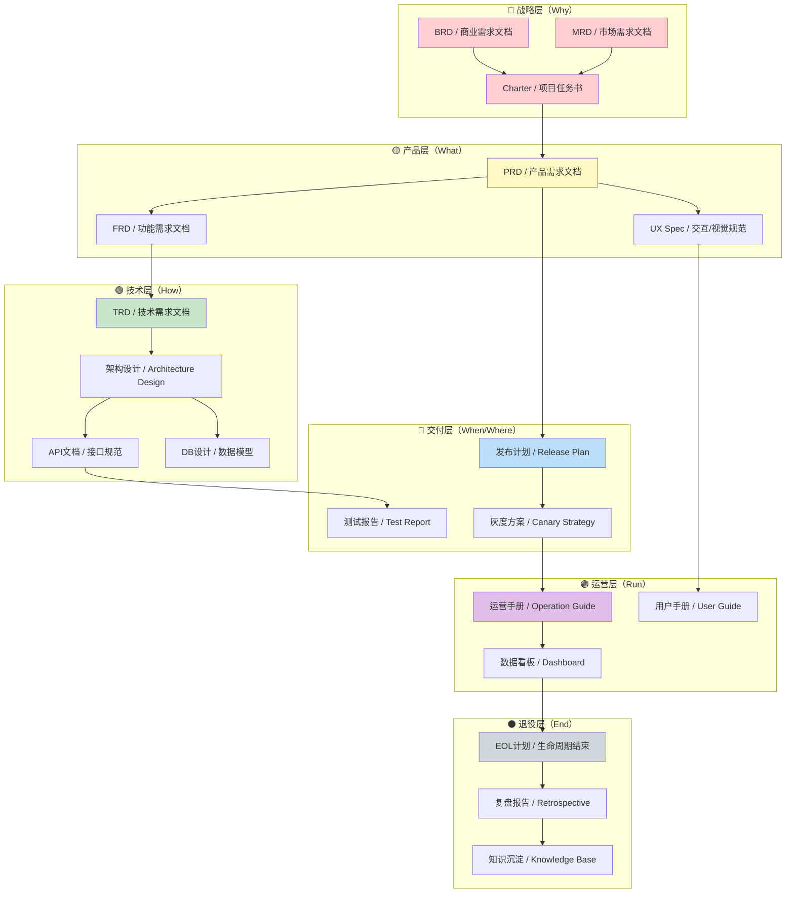
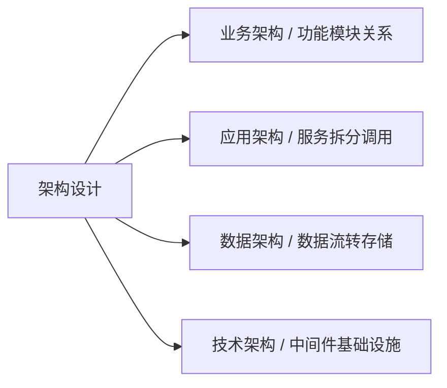
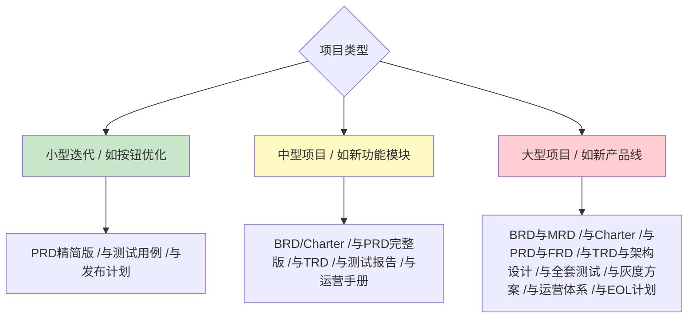

## 产品全生命周期文档地图



---

## 一、战略层：回答"为什么要做"

### 1. BRD（Business Requirements Document）商业需求文档

> **定位：** 产品生命周期的起点，回答"为什么值得投入资源"

| 要素           | 说明                  | 关键问题                       |
| :------------- | :-------------------- | :----------------------------- |
| **商业目标**   | 要解决什么业务问题    | 不做这个，业务损失多少？       |
| **投入产出**   | ROI测算，成本收益分析 | 投入X，预期回报Y？             |
| **成功指标**   | 可量化的业务结果      | 怎么证明这个项目成功了？       |
| **风险与约束** | 政策、资源、时间限制  | 最大风险是什么？Plan B是什么？ |
| **干系人**     | 决策者与利益相关方    | 谁说了算？谁受益？谁反对？     |

**典型场景：** 向管理层申请预算、争取资源、立项评审。

---

### 2. MRD（Market Requirements Document）市场需求文档

> **定位：** 连接市场与产品的桥梁，回答"市场机会在哪里"

| 要素           | 说明                         |
| :------------- | :--------------------------- |
| **目标市场**   | TAM/SAM/SOM 市场规模测算     |
| **用户画像**   | 核心用户、边缘用户、拒绝用户 |
| **竞品分析**   | 竞品功能矩阵、差异化机会点   |
| **用户痛点**   | 场景化的痛点描述（带数据）   |
| **需求优先级** | 市场视角的MoSCoW排序         |

**典型场景：** 产品方向探索、新赛道进入决策、年度规划。

---

### 3. Charter（项目任务书）

> **IPD体系核心文档**，在华为/阿里广泛使用，是正式立项的"准生证"

| 要素         | 说明                       |
| :----------- | :------------------------- |
| **项目背景** | 基于BRD/MRD的浓缩结论      |
| **项目目标** | 商业目标+用户目标+能力目标 |
| **范围边界** | In Scope / Out Scope       |
| **里程碑**   | 关键决策评审点（DCP）      |
| **核心团队** | PDT（产品开发团队）成员    |
| **资源预算** | 人力、资金、时间预算       |

**典型场景：** 正式立项会议（Kick-off），获得IPMT（投资评审委员会）批准。

---

## 二、产品层：回答"做什么"

### 4. PRD（Product Requirements Document）产品需求文档

> **定位：** 全生命周期中**最核心的执行文档**，前面已提供完整模板。

**关键特性：**

- 用户视角的功能描述
- 包含业务流程、页面流转、输入输出、验收标准
- 研发、设计、测试、运营的**单一事实源（SSoT）**

---

### 5. FRD（Functional Requirements Document）功能需求文档

> **定位：** 系统视角的功能行为描述，常与PRD合并或作为PRD的技术补充

| 与PRD的区别 | PRD                 | FRD                                                      |
| :---------- | :------------------ | :------------------------------------------------------- |
| **视角**    | 用户视角            | 系统视角                                                 |
| **读者**    | 全员（含非技术）    | 研发、测试                                               |
| **内容**    | 用户故事、交互流程  | 系统逻辑、状态转换、数据流                               |
| **示例**    | "用户可以导出Excel" | "点击导出按钮后，系统异步生成文件，通过消息队列通知用户" |

**典型场景：** 复杂系统需要单独拆解技术实现逻辑时使用。

---

### 6. UX Spec（交互/视觉规范文档）

| 子文档       | 内容                         |    负责角色    |
| :----------- | :--------------------------- | :------------: |
| **交互原型** | 页面流程、点击热区、交互动效 |   交互设计师   |
| **视觉规范** | 色彩、字体、间距、组件库     |   视觉设计师   |
| **文案规范** | 按钮文案、错误提示、空状态   | 产品/UX Writer |

---

## 三、技术层：回答"怎么做"

### 7. TRD（Technical Requirements Document）技术需求文档

> **定位：** 技术实现的"翻译器"，将PRD转化为技术语言

| 核心章节       | 说明                                 |
| :------------- | :----------------------------------- |
| **技术架构**   | 系统拓扑、服务拆分、部署架构         |
| **数据模型**   | ER图、数据字典、存储方案             |
| **接口定义**   | API契约（OpenAPI/Swagger）、字段说明 |
| **非功能设计** | 性能、安全、扩展性、容灾方案         |
| **技术选型**   | 框架、中间件、第三方服务及选型理由   |
| **风险评估**   | 技术债务、性能瓶颈、依赖风险         |

**典型场景：** 技术评审（Tech Review）、架构师决策依据。

---

### 8. 架构设计文档（Architecture Design Document）



---

### 9. API文档 / 数据库设计文档

- **API文档：** 使用Swagger/YApi/Postman自动同步，确保前后端契约一致
- **DB设计：** 表结构、索引设计、分库分表策略、数据归档方案

---

## 四、交付层：回答"何时上线"

### 10. 发布计划（Release Plan）

| 要素         | 说明                               |
| :----------- | :--------------------------------- |
| **版本规划** | 版本号规则、发版节奏（如双周发版） |
| **环境计划** | 开发→测试→预发→生产 环境部署顺序   |
| **回滚方案** | 回滚触发条件、操作步骤、数据修复   |
| **监控告警** | 核心指标监控、告警阈值、值班安排   |

---

### 11. 测试相关文档

| 文档         | 内容                                |    负责    |
| :----------- | :---------------------------------- | :--------: |
| **测试计划** | 测试范围、策略、资源、排期          | 测试负责人 |
| **测试用例** | 基于PRD验收标准编写的可执行用例     | 测试工程师 |
| **测试报告** | 覆盖率、Bug统计、遗留风险、发布建议 | 测试负责人 |

---

### 12. 灰度/发布方案（Canary Release Plan）

- 灰度比例与时间节奏（如 5%→30%→100%）
- 观察指标与回滚阈值
- 应急预案（一键回滚、限流降级）

---

## 五、运营层：回答"如何运转"

### 13. 运营手册（Operation Guide / SOP）

| 模块         | 内容                               |
| :----------- | :--------------------------------- |
| **功能说明** | 面向运营人员的功能操作指南         |
| **常见问题** | FAQ、故障排查手册                  |
| **数据解读** | 核心指标定义、异常判断标准         |
| **活动配置** | 营销工具的配置步骤、审核 checklist |

---

### 14. 数据看板与埋点文档

- **埋点规范：** 事件定义、属性字典、上报时机
- **数据看板：** 核心指标实时/离线看板配置
- **数据口径：** 指标计算逻辑、归因规则

---

### 15. 用户帮助文档（User Guide / Help Center）

- 面向终端用户的自助帮助内容
- 新功能引导文案、视频教程

---

## 六、退役层：回答"如何善终"

### 16. EOL计划（End of Life）

> **大厂实践：** 产品下线比上线更需要文档，涉及数据迁移、用户告知、法律合规。

| 要素         | 说明                         |
| :----------- | :--------------------------- |
| **下线原因** | 业务调整、技术债务、用户流失 |
| **用户迁移** | 数据导出方案、替代产品引导   |
| **数据归档** | 历史数据保留策略、销毁计划   |
| **法律合规** | 用户协议变更、退款/补偿方案  |
| **沟通计划** | 提前多久通知？通过什么渠道？ |

---

### 17. 复盘报告（Retrospective / Post-Mortem）

| 维度         | 内容                                                     |
| :----------- | :------------------------------------------------------- |
| **目标回顾** | 当初设定的目标 vs 实际结果                               |
| **过程分析** | 关键节点决策回顾、时间线                                 |
| **问题归因** | 做得好的（Keep）、做的不好的（Problem）、改进动作（Try） |
| **经验沉淀** | 可复用的方法论、踩坑记录                                 |
| **资产归档** | 文档、代码、数据归档位置                                 |

---

## 文档裁剪指南：不同场景用哪些？

不是所有项目都需要全部文档，根据项目复杂度裁剪：



| 项目规模              | 必写文档                    | 可选文档 | 合并建议                 |
| :-------------------- | :-------------------------- | :------- | :----------------------- |
| **小型迭代**（<<1周） | PRD（1页纸）、测试用例      | —        | BRD可口述，TRD可省略     |
| **中型项目**（1-4周） | Charter、PRD、TRD、测试报告 | MRD、FRD | BRD可并入Charter         |
| **大型项目**（>1月）  | 全套文档                    | —        | 每个文档独立，确保可追溯 |

---

## 文档之间的追溯关系（Traceability）

```mermaid
flowchart LR
    A[BRD商业目标 / "提升留存"] --> B[MRD市场机会 / "新用户次日流失高"]
    B --> C[Charter项目目标 / "Q3留存与10%"]
    C --> D[PRD功能需求 / "新手引导流程优化"]
    D --> E[FRD系统逻辑 / "引导步骤状态机"]
    E --> F[TRD技术方案 / "分步接口与埋点"]
    F --> G[测试用例 / "验证引导完成率"]
    G --> H[数据看板 / "留存指标监控"]
    H --> I[复盘报告 / "留存提升结果"]

    style A fill:#ffcdd2
    style D fill:#fff9c4
    style F fill:#c8e6c9
    style H fill:#e1bee7
```

**追溯价值：** 当上线后数据不达预期时，可以从复盘报告一路回溯到BRD，检查是商业假设错误（BRD）、市场判断失误（MRD）、功能设计问题（PRD）、还是技术实现偏差（TRD）。

---

## 总结：文档体系的核心原则

| 原则                   | 说明                                        |
| :--------------------- | :------------------------------------------ |
| **1. 分层解耦**        | 战略层不干预技术细节，技术层不偏离商业目标  |
| **2. 单一事实源**      | 同一信息只在一个文档中定义，其他文档引用    |
| **3. living document** | 文档随项目演进实时更新，而非一次性交付物    |
| **4. 读者意识**        | 每份文档明确写给谁看，控制信息密度          |
| **5. 可追溯性**        | 需求→设计→开发→测试→运营→退役，全链路可回溯 |
