# [产品/系统名称（英文名）] - 产品需求文档（PRD）

> **文档状态：** 🟡 评审中 / 🟢 已通过 / 🔴 驳回
>
> **保密级别：** 机密 / 内部公开 / 公开
>
> **版本：** v0.5
>
> **日期：** YYYY-MM-DD
>
> **撰写人：** [姓名/角色]
>
> **评审人：** [姓名/角色]
>
> **阅读对象：** [角色列表]

---

## 0. 文档导读

### 0.1 文档目的与适用范围

[说明本文档的目的、适用场景和不适用场景]

### 0.2 相关文档

| 文档类型 | 文件名 | 相关章节 |
|---------|--------|---------|
| [类型] | [文件名] [行号范围] | [章节描述] |

> **引用格式说明**：关联文档使用 `文件名 行号范围` 格式（如 `【模板】技术需求文档(TRD).md 3-17`），行号随文档更新可能变化，请以实际内容为准。

### 0.3 变更记录

| 版本 | 日期 | 修订人 | 变更内容 | 审核人 |
| :--- | :--- | :--- | :--- | :--- |
| v0.1 | YYYY-MM-DD | 张三 | 初稿：完成背景调研与核心流程定义 | 李四 |
| v0.2 | YYYY-MM-DD | 张三 | 补充异常流程与埋点方案 | 李四 |
| v0.3 | YYYY-MM-DD | 张三 | 评审通过，进入开发阶段 | 王五 |
| v0.4 | YYYY-MM-DD | 张三 | 新增分享功能（需求变更 #REQ-2024-008） | 王五 |
| v0.5 | 2026-06-09 | 谢董 | 修复gantt图为表格以兼容飞书渲染 | — |

---

## 1. 文档概述（Document Overview）

### 1.1 项目背景（Background）
> **阿里实践：** 必须回答"为什么做"，包含市场机会、数据支撑、战略对齐。

**一句话描述：** `[用不超过30字描述这个需求解决什么问题]`

**背景详情：**
- **市场/业务背景：** `[描述当前业务痛点或市场机会]`
- **数据支撑：** `[引用相关数据，如转化率下降X%、用户反馈量Y条等]`
- **战略对齐：** `[对齐OKR或年度战略，如"支撑Q3 GMV增长目标"]`

### 1.2 项目目标（Objectives）
> **腾讯实践：** 目标必须可衡量（SMART原则），区分商业目标与用户体验目标。

| 目标类型 | 目标描述 | 衡量指标 | 目标值 | 优先级 |
|:---|:---|:---|:---:|:---:|
| 商业目标 | 提升付费转化率 | 付费转化率 | +15% | P0 |
| 用户目标 | 降低操作门槛 | 任务完成时长 | -30% | P0 |
| 效率目标 | 减少客服进线量 | 相关工单量 | -20% | P1 |

## 2. 产品定义（Product Definition）

### 2.1 产品概述（Product Summary）

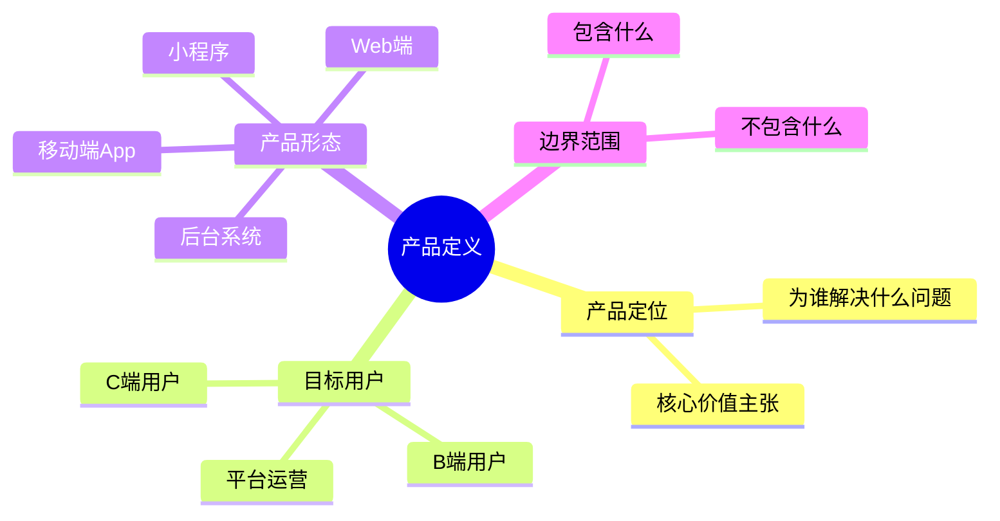

**产品定位：** `[一句话定位：XX是面向XX用户的XX工具/平台，通过XX方式解决XX问题，实现XX价值]`

**本次迭代范围：**
- ✅ **包含（In Scope）：** `[列举本次必须实现的功能模块]`
- ❌ **不包含（Out of Scope）：** `[明确排除的功能，防止范围蔓延]`
- ⏳ **后续版本（Future）：** `[规划但不实现的特性]`

### 2.2 用户画像（User Personas）

> **腾讯实践：** 必须具象化用户，避免"用户"泛化。

**核心用户：**
- **用户名称：** `[如：职场新人小明]`
- **年龄/职业：** `[25岁/互联网运营]`
- **核心诉求：** `[快速完成周报，减少重复劳动]`
- **痛点场景：** `[每周五花2小时整理数据，容易出错且格式不统一]`
- **技术熟练度：** `[中等，熟悉Office但不了解SQL]`

### 2.3 用户旅程地图（User Journey Map）

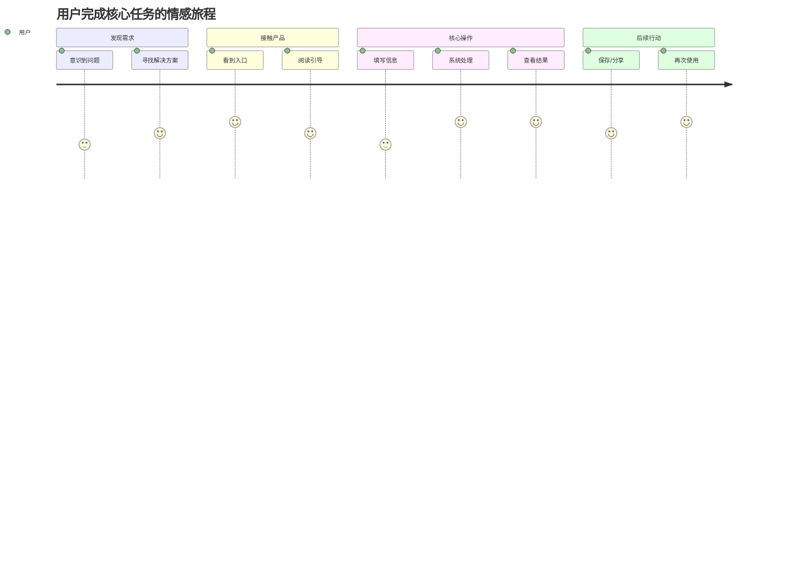

---

## 3. 需求全景（Requirement Landscape）

### 3.1 功能清单（Feature List）
> **字节实践：** 使用MoSCoW法则明确优先级，研发资源永远优先投入Must-have。

| 模块 | 功能点 | 功能描述 | 优先级 | 负责人 | 依赖项 | 状态 |
|:---|:---|:---|:---:|:---:|:---|:---:|
| 用户模块 | 手机号登录 | 支持手机号+验证码登录 | P0 | 后端A | 短信服务商 | 🟡 |
| 用户模块 | 微信授权登录 | 支持微信一键授权 | P1 | 后端A | 微信开放平台 | ⚪ |
| 核心功能 | 智能推荐 | 基于用户行为的个性化推荐 | P0 | 算法B | 用户行为数据 | 🟡 |
| 核心功能 | 批量导出 | 支持Excel/PDF批量导出 | P1 | 前端C | 导出服务 | ⚪ |
| 增值功能 | 数据看板 | 可视化数据展示 | P2 | 前端C | 图表组件库 | ⚪ |

**优先级定义：**
- **P0（Must-have）：** 不满足则产品无法发布，阻塞性需求
- **P1（Should-have）：** 重要但非阻塞，可降级或分期实现
- **P2（Could-have）：** 锦上添花，资源充裕时实现
- **P3（Won't-have）：** 明确本次不做，记录防止误解

### 3.2 产品架构图（Product Architecture）

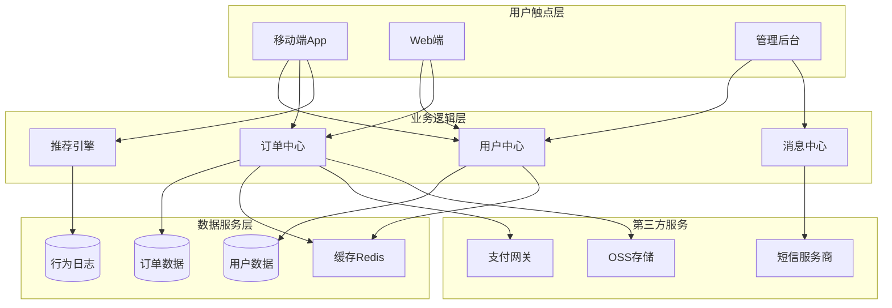

---

## 4. 功能详述（Functional Requirements）
> **核心章节：** 这是PRD最重要的部分，必须做到"研发不看原型也能开发，测试不看交互也能写用例"。

---

### 4.1 功能模块一：[模块名称，如"用户登录模块"]

#### 4.1.1 功能定义（Feature Definition）

| 属性 | 说明 |
|:---|:---|
| **功能名称** | `[功能名称]` |
| **功能ID** | `[唯一标识，如 FUNC-001]` |
| **所属模块** | `[模块名称]` |
| **优先级** | `P0/P1/P2` |
| **需求来源** | `[用户反馈/数据洞察/业务方/竞品分析]` |
| **关联需求** | `[关联的其他功能ID]` |

**功能描述：** `[用2-3句话描述这个功能做什么，解决什么问题]`

#### 4.1.2 业务流程图（Business Flow）

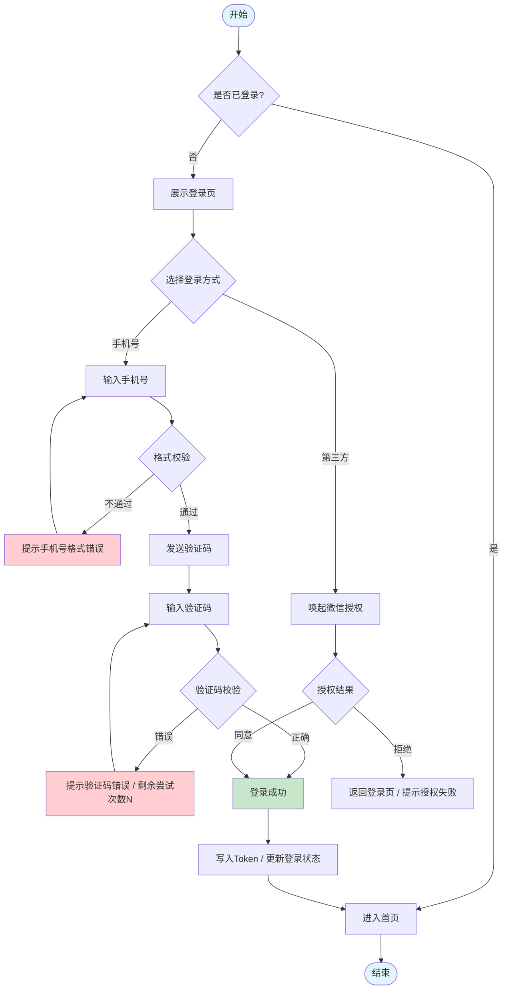

#### 4.1.3 页面流转图（Page Flow）

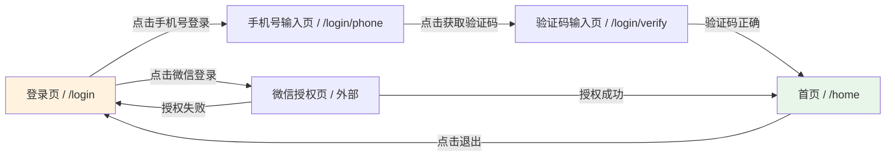

#### 4.1.4 输入输出定义（Input & Output）

> **阿里/字节实践：** 每个功能必须明确定义IO，这是前后端联调的基础。

**接口/交互输入：**

| 输入项 | 类型 | 必填 | 来源 | 校验规则 | 示例值 |
|:---|:---:|:---:|:---|:---|:---|
| phone | string | 是 | 用户输入 | 大陆手机号正则：`^1[3-9]\d{9}$` | 13800138000 |
| verifyCode | string | 是 | 用户输入 | 4-6位纯数字 | 123456 |
| source | string | 否 | 系统携带 | 枚举：app/web/mp | app |

**接口/交互输出：**

| 输出项 | 类型 | 说明 | 示例值 |
|:---|:---:|:---|:---|
| accessToken | string | JWT访问令牌，有效期2小时 | eyJhbGciOiJIUzI1NiIs... |
| refreshToken | string | 刷新令牌，有效期7天 | eyJhbGciOiJIUzI1NiIs... |
| userId | string | 用户唯一标识 | U202405250001 |
| expireAt | number | Token过期时间戳（毫秒） | 1716633600000 |

#### 4.1.5 业务规则（Business Rules）

> **规则编号格式：** `BR-[模块]-[序号]`

| 规则ID | 规则描述 | 触发条件 | 执行动作 | 优先级 |
|:---|:---|:---|:---|:---:|
| BR-LOGIN-001 | 验证码发送频率限制 | 同一手机号60秒内重复请求 | 拒绝请求，返回"请60秒后重试" | P0 |
| BR-LOGIN-002 | 验证码错误锁定 | 同一手机号连续错误5次 | 锁定2小时，需人工解锁或联系客服 | P0 |
| BR-LOGIN-003 | Token刷新机制 | accessToken过期且refreshToken有效 | 自动刷新accessToken，静默续期 | P0 |
| BR-LOGIN-004 | 多设备登录限制 | 同一账号在设备B登录时设备A在线 | 设备A收到下线通知，保留最近3个设备 | P1 |

#### 4.1.6 状态机（State Machine）

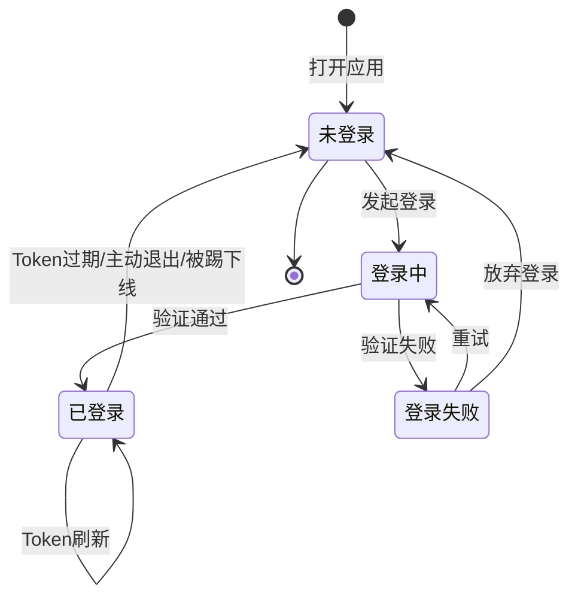

#### 4.1.7 异常处理（Exception Handling）

> **大厂铁律：** 异常流程必须覆盖，不能只写Happy Path。

| 异常场景 | 异常类型 | 前端表现 | 后端处理 | 补偿机制 |
|:---|:---|:---|:---|:---|
| 网络中断 | 网络异常 | 展示网络错误页，提供"重试"按钮 | 请求超时，记录日志 | 自动重试3次，仍失败则提示用户 |
| 验证码服务故障 | 依赖故障 | 提示"服务繁忙，请稍后再试" | 熔断降级，切换备用通道 | 触发告警，1分钟内自动恢复 |
| 手机号已注册 | 业务异常 | 提示"该手机号已存在，是否直接登录？" | 返回特定错误码：PHONE_EXISTS | 提供一键跳转登录入口 |
| 高频请求 | 限流异常 | 按钮置灰+倒计时 | 限流拦截，返回429 | 前端防抖+后端令牌桶 |

#### 4.1.8 时序图（Sequence Diagram）

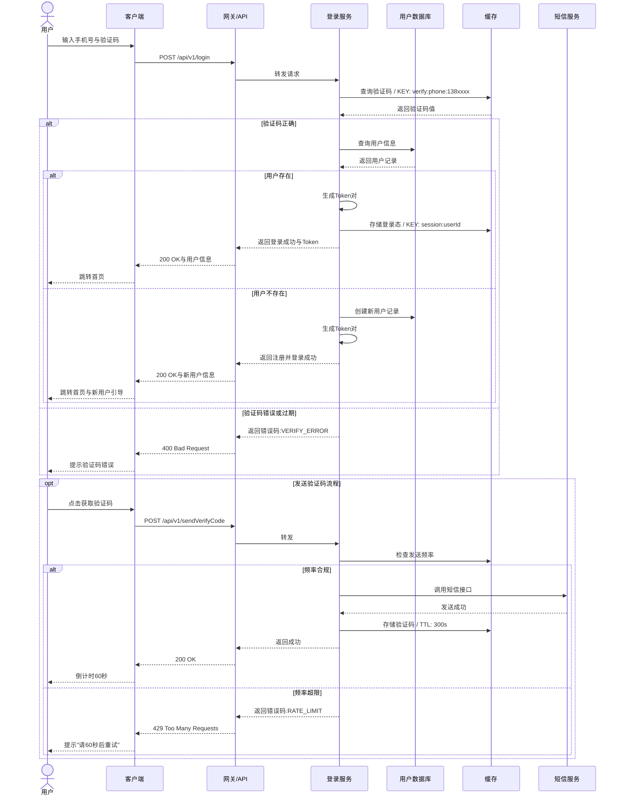

#### 4.1.9 验收标准（Acceptance Criteria）

> **最佳实践：** 验收标准必须可测试、可验证，采用Given-When-Then格式。

| 验收项ID | 验收标准（Given-When-Then） | 验收方式 | 通过标准 |
|:---|:---|:---|:---:|
| AC-001 | **Given** 用户未登录 **When** 打开应用 **Then** 展示登录页，手机号输入框自动聚焦 | 手工测试 | 100%通过 |
| AC-002 | **Given** 用户输入正确手机号 **When** 点击获取验证码 **Then** 按钮置灰60秒，用户收到6位数字验证码 | 手工+自动化 | 100%通过 |
| AC-003 | **Given** 用户连续5次输入错误验证码 **When** 第5次提交 **Then** 提示账号锁定2小时，记录安全日志 | 自动化测试 | 100%通过 |
| AC-004 | **Given** 用户已登录且Token有效 **When** 访问需要鉴权的接口 **Then** 正常返回数据，无需重新登录 | 自动化测试 | 100%通过 |
| AC-005 | **Given** 用户Token过期但refreshToken有效 **When** 发起请求 **Then** 服务端静默刷新Token，客户端无感知 | 自动化测试 | 100%通过 |

---

### 4.2 功能模块二：[模块名称，如"订单支付模块"]

#### 4.2.1 功能定义

#### 4.2.2 业务流程图

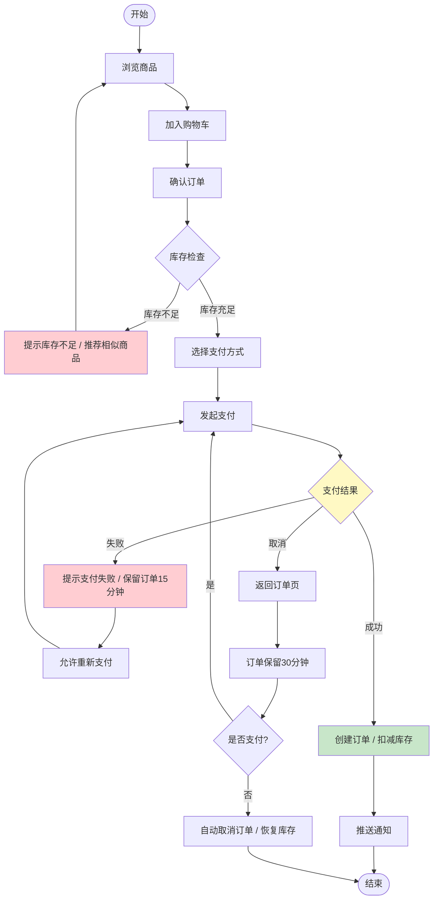

#### 4.2.3 输入输出定义

**支付接口输入：**

| 输入项 | 类型 | 必填 | 校验规则 | 说明 |
|:---|:---:|:---:|:---|:---|
| orderId | string | 是 | 格式：ORD+年月日+6位流水 | 订单唯一标识 |
| payChannel | enum | 是 | 枚举：WECHAT/ALIPAY/UNION | 支付渠道 |
| amount | decimal | 是 | >0，精确到分 | 支付金额（元） |
| currency | string | 否 | 默认CNY | 币种 |

**支付接口输出：**

| 输出项 | 类型 | 说明 |
|:---|:---:|:---|
| payOrderId | string | 支付平台流水号 |
| payUrl | string | 跳转支付页URL（H5） |
| prepayId | string | 微信预支付ID（小程序/App） |
| expireTime | number | 支付超时时间戳 |

#### 4.2.4 状态机

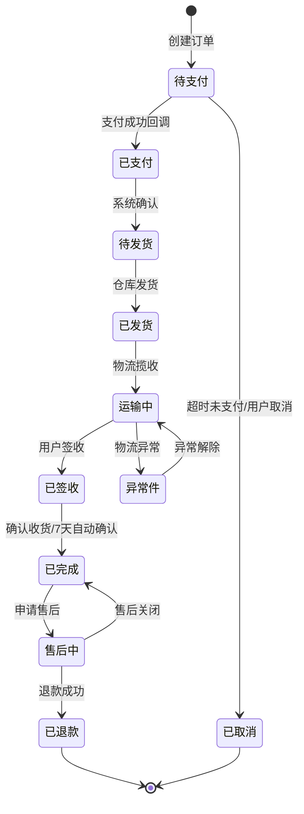

#### 4.2.5 异常处理

| 异常场景 | 前端表现 | 后端处理 | 数据一致性保障 |
|:---|:---|:---|:---|
| 支付回调延迟 | 显示"支付处理中"，轮询查询 | 异步消息队列处理，最大重试5次 | 幂等性校验，防止重复扣款 |
| 重复支付 | 拦截二次支付请求 | 退款原路返回，记录异常流水 | 唯一索引+状态机校验 |
| 库存超卖 | 下单时实时校验 | 乐观锁/分布式锁扣减 | 库存回滚机制 |

---

## 5. 非功能需求（Non-Functional Requirements）

### 5.1 性能需求（Performance）

| 指标 | 目标值 | 测试场景 | 优先级 |
|:---|:---:|:---|:---:|
| 页面首屏加载 | ≤ 1.5s | 4G网络，冷启动 | P0 |
| 接口响应时间（P99） | ≤ 500ms | 日常并发峰值 | P0 |
| 并发用户数 | ≥ 10,000 QPS | 大促场景 | P0 |
| 数据库查询 | ≤ 100ms | 单表百万数据量 | P1 |

### 5.2 安全需求（Security）

| 需求项 | 具体要求 | 实现方式 |
|:---|:---|:---|
| 数据传输加密 | 全站HTTPS，TLS 1.3 | 网关层统一配置 |
| 敏感数据脱敏 | 手机号、身份证号展示脱敏 | 前端展示层+后端返回脱敏 |
| 防重放攻击 | 请求时间戳+随机数签名 | 中间件校验 |
| SQL注入防护 | 零SQL注入漏洞 | 参数化查询+ORM |
| XSS防护 | 零存储型XSS漏洞 | 输入过滤+输出编码+CSP策略 |

### 5.3 可用性需求（Availability）

| 需求项 | 目标值 | 说明 |
|:---|:---:|:---|
| 系统可用性 | 99.95% | 年度宕机时间 < 4.38小时 |
| 故障恢复时间（RTO） | ≤ 30分钟 | 核心链路故障 |
| 数据恢复点（RPO） | ≤ 5分钟 | 数据丢失窗口 |
| 降级策略 | 核心功能可用 | 非核心功能可降级关闭 |

### 5.4 兼容性需求（Compatibility）

| 平台 | 支持范围 | 优先级 |
|:---|:---|:---:|
| iOS | iOS 14+ | P0 |
| Android | Android 8.0+ | P0 |
| Web | Chrome 90+, Safari 14+, Edge 90+ | P0 |
| 小程序 | 微信8.0+, 支付宝10.2+ | P1 |

---

## 6. 数据埋点方案（Data Tracking）

> **字节/阿里实践：** 埋点不是可选项，是功能的一部分。必须在PRD中定义清楚，否则研发不会预留埋点位置。

### 6.1 埋点总览

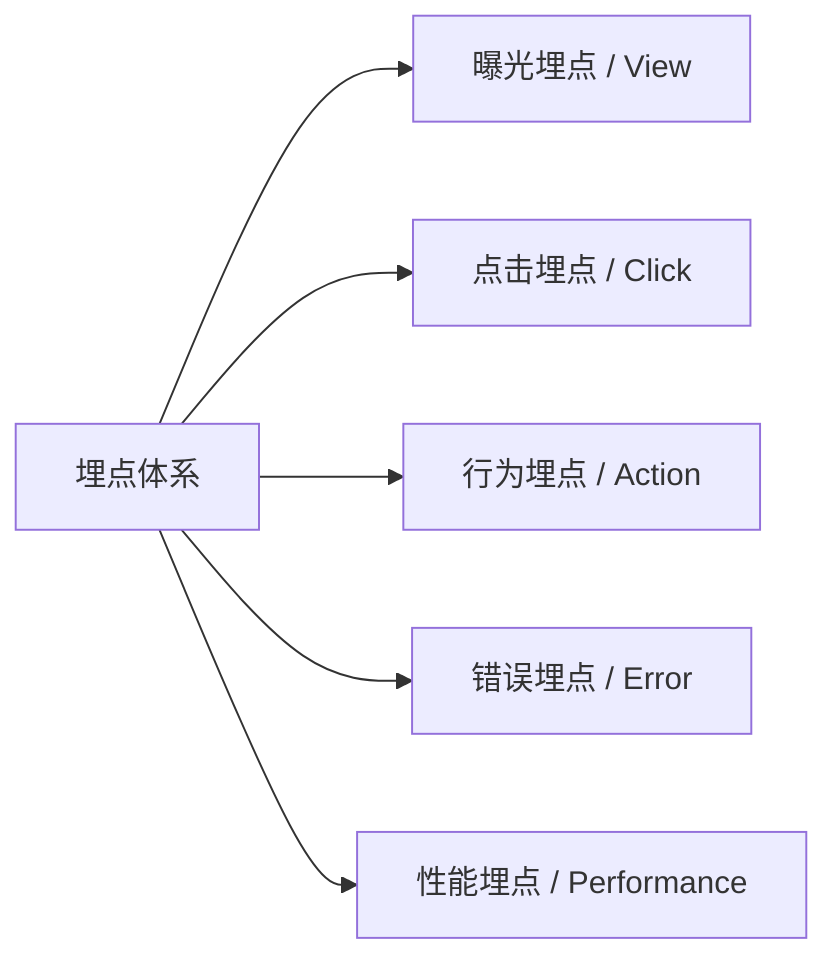

### 6.2 埋点清单

| 埋点ID | 埋点名称 | 触发时机 | 事件类型 | 关键属性 | 用途 |
|:---|:---|:---|:---:|:---|:---|
| TRACK-001 | 登录页曝光 | 进入登录页 | 曝光 | page_source, entry_time | 漏斗分析入口流量 |
| TRACK-002 | 获取验证码点击 | 点击"获取验证码"按钮 | 点击 | phone, result, error_code | 分析转化漏斗 |
| TRACK-003 | 登录成功 | 登录验证通过 | 行为 | login_type, duration, is_new | 计算登录成功率 |
| TRACK-004 | 登录失败 | 登录验证未通过 | 行为 | login_type, fail_reason, fail_step | 定位流失原因 |
| TRACK-005 | 支付发起 | 点击确认支付 | 点击 | order_id, amount, pay_channel | 支付转化分析 |
| TRACK-006 | 支付成功 | 收到支付成功回调 | 行为 | order_id, pay_time, pay_channel | GMV归因 |
| TRACK-007 | 支付失败 | 支付失败或取消 | 行为 | order_id, fail_reason, fail_step | 优化支付体验 |

### 6.3 埋点属性规范

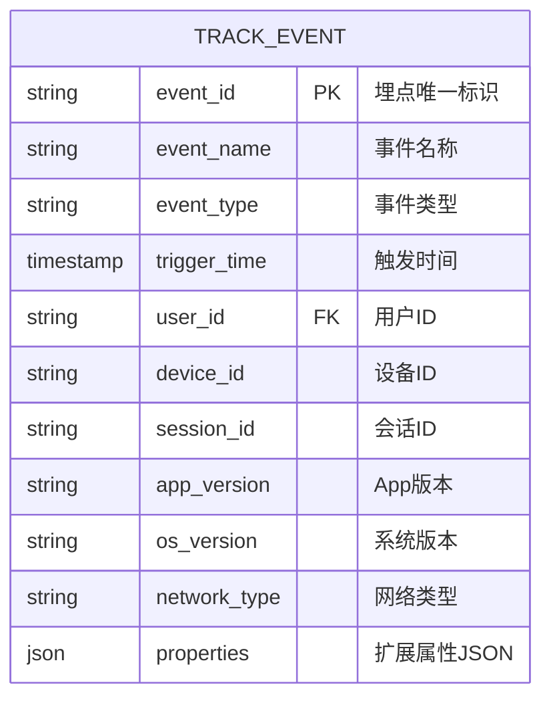

---

## 7. 发布计划（Release Plan）

### 7.1 里程碑（Milestones）

> **说明**：甘特图为飞书不兼容类型，改为表格描述。

| 阶段 | 任务 | 开始日期 | 工期 | 状态 |
|:---|:---|:---|:---:|:---:|
| 需求阶段 | PRD撰写与评审 | YYYY-MM-DD | 5d | ✅ done |
| 需求阶段 | 需求评审会 | PRD完成后 | 2d | ✅ done |
| 设计阶段 | 交互设计 | 评审完成后 | 5d | 🔵 active |
| 设计阶段 | 视觉设计 | 交互设计完成后 | 5d | ⚪ |
| 开发阶段 | 后端接口开发 | 视觉设计完成后 | 7d | ⚪ |
| 开发阶段 | 前端页面开发 | 视觉设计完成后 | 8d | ⚪ |
| 开发阶段 | 联调测试 | 后端开发完成后 | 3d | ⚪ |
| 测试阶段 | 功能测试 | 联调测试完成后 | 5d | ⚪ |
| 测试阶段 | 回归测试 | 功能测试完成后 | 2d | ⚪ |
| 发布阶段 | 灰度发布(5%) | 回归测试完成后 | 2d | ⚪ |
| 发布阶段 | 全量发布 | 灰度发布完成后 | 1d | ⚪ |

### 7.2 灰度策略（Canary Release）

| 阶段 | 发布时间 | 用户范围 | 观察指标 | 回滚条件 |
|:---|:---:|:---|:---|:---|
| 内测 | D-Day | 内部员工+核心种子用户（100人） | 崩溃率<<0.1%，核心流程通过率100% | 阻塞性Bug |
| 灰度1 | D+2 | 5%随机用户 | 错误率<<0.5%，性能指标达标 | 错误率>1%或客诉激增 |
| 灰度2 | D+5 | 30%随机用户 | 转化率波动<<±5%，留存稳定 | 核心指标下跌>10% |
| 全量 | D+7 | 100%用户 | 监控大盘正常 | 无 |

### 7.3 回滚方案（Rollback Plan）

| 触发条件 | 回滚动作 | 负责人 | 预计耗时 | 影响范围 |
|:---|:---|:---|:---:|:---|
| 核心链路故障 | 切流量至上一版本 | SRE | 5分钟 | 全量用户 |
| 数据异常 | 暂停写入，切换只读模式 | DBA | 10分钟 | 新数据写入 |
| 严重安全漏洞 | 紧急停服修复 | 安全团队 | 30分钟 | 全量功能 |

---

## 8. 风险与依赖（Risks & Dependencies）

### 8.1 风险登记册（Risk Register）

| 风险ID | 风险描述 | 可能性 | 影响度 | 风险等级 | 应对策略 | 责任人 |
|:---|:---|:---:|:---:|:---:|:---|:---:|
| R-001 | 第三方登录接口变更 | 中 | 高 | 🔴 高 | 提前对接文档，预留2天buffer | 后端A |
| R-002 | 支付渠道费率上调 | 低 | 中 | 🟡 中 | 商务提前锁价，备选渠道 | 商务B |
| R-003 | 核心研发人员变动 | 低 | 高 | 🟡 中 | 代码Review制度，文档沉淀 | 项目经理 |
| R-004 | 大促流量超预期 | 中 | 高 | 🔴 高 | 压测至2倍预期流量，弹性扩容 | SRE |

### 8.2 外部依赖（Dependencies）

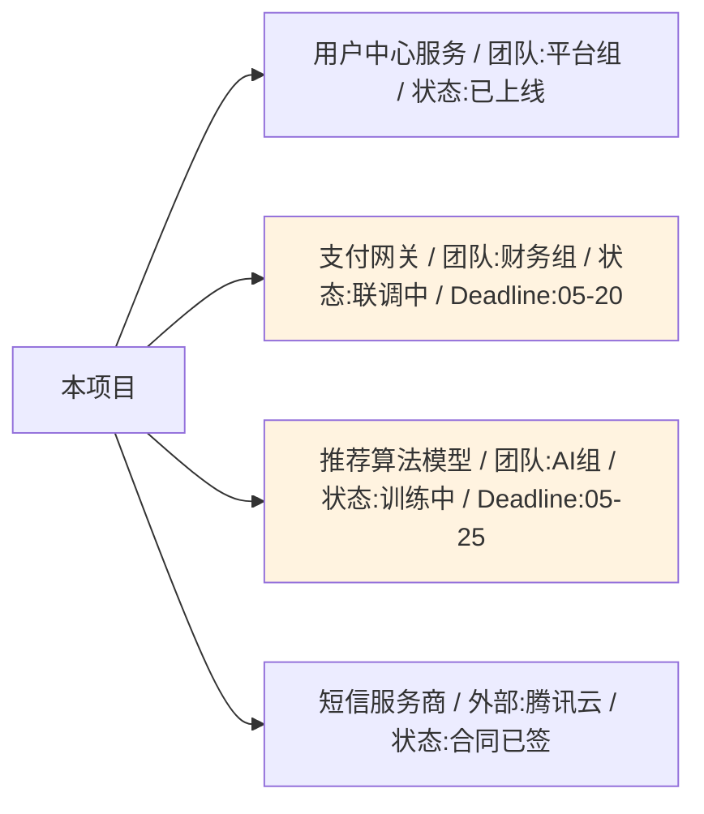

---

## 9. 附录（Appendix）

### 9.1 竞品分析摘要

| 竞品 | 核心优势 | 借鉴点 | 差异化策略 |
|:---|:---|:---|:---|
| 竞品A | 登录流程极简，1步完成 | 减少用户输入步骤 | 我们增加生物识别，更安全 |
| 竞品B | 社交登录占比80% | 强化第三方登录引导 | 我们保留手机号作为兜底 |

### 9.2 参考文档

- [产品原型链接（Figma/Axure）]
- [接口文档（Swagger/YApi）]
- [设计稿（MasterGo/Figma）]
- [数据看板（Metabase/QuickBI）]
- [技术方案文档（Tech Spec）]

### 9.3 需求评审记录

| 评审日期 | 参与人 | 主要结论 | 待办事项 |
|:---|:---|:---|:---|
| YYYY-MM-DD | PM、研发、测试、设计 | 通过，补充异常场景3个 | 补充网络异常处理逻辑 |

---

## 📌 PRD撰写Checklist（自查清单）

> **大厂PM必备：** 提交评审前逐项自查，确保PRD质量。

- [ ] **完整性：** 是否覆盖所有功能模块？是否有遗漏的边界场景？
- [ ] **可执行性：** 研发能否不看原型直接开发？测试能否直接写用例？
- [ ] **一致性：** 术语是否统一？前后逻辑是否自洽？
- [ ] **可验证性：** 每个功能是否有明确的验收标准？是否可量化？
- [ ] **异常覆盖：** 是否只写了Happy Path？异常和降级场景是否完整？
- [ ] **依赖清晰：** 外部依赖是否明确？风险是否有应对方案？
- [ ] **数据闭环：** 埋点是否完整？能否支撑后续数据分析？
- [ ] **版本控制：** 修订记录是否更新？变更内容是否标注？

---

**文档结束**

> **使用建议：**
> 1. 将此模板保存为团队Wiki的标准模板
> 2. 每个需求必须基于此模板裁剪，不可删减核心章节（4-7章）
> 3. 复杂功能必须包含时序图和状态机，简单功能可简化
> 4. 评审时对照Checklist逐项确认，确保交付质量
