# [产品/系统名称（英文名）] - 市场需求文档（MRD）

> **文档状态：** 🟡 评审中 / 🟢 已通过 / 🔴 驳回
>
> **保密级别：** 机密 / 内部公开 / 公开
>
> **版本：** v0.4.2
>
> **日期：** YYYY-MM-DD
>
> **撰写人：** [姓名/角色]
>
> **评审人：** [姓名/角色]
>
> **阅读对象：** [角色列表]

---

## 0. 文档导读

### 0.1 文档定位与关系

MRD回答**"赚谁的钱、在什么市场赚"**，通过评审后输出为Charter，驱动PRD与项目执行。

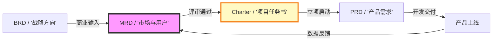

### 0.2 一页纸摘要（Executive Summary）

| 维度         | 核心结论                                                       |
| :----------- | :------------------------------------------------------------- |
| **市场机会** | ¥Z亿可获取市场，年增速>50%，[某政策/技术]带来3-6个月窗口期     |
| **目标用户** | [用户群A]，[X万人]，核心痛点"[一句话痛点]"，付费意愿经初步验证 |
| **竞争格局** | 竞品A/B聚焦KA/个人市场，**[中小企业轻量协同]**为明确空白地带   |
| **产品策略** | [产品名称]，定位"[一句话定位]"，MVP聚焦[3个核心功能]           |
| **商业假设** | CAC≤¥150，LTV≥¥450，LTV/CAC≥3，18个月盈亏平衡                  |
| **建议决策** | 🟢 **立即启动** — 召开立项评审会，组建PDT，6月30日前完成MVP    |

### 0.3 变更记录

| 版本 | 日期       | 修订人 | 修订内容                   | 审核人 |
| :--- | :--------- | :----- | :------------------------- | :----- |
| v0.1 | YYYY-MM-DD | [姓名] | 初稿完成                   | [姓名] |
| v0.2 | YYYY-MM-DD | [姓名] | 补充竞品数据与市场规模测算 | [姓名] |
| v0.3 | YYYY-MM-DD | [姓名] | 评审通过，归档基线         | [姓名] |
| v0.4 | 2026-06-09 | 谢董 | 修复：quadrantChart 模板改为表格格式（飞书不兼容） | — |
| v0.4.1 | 2026-06-09 | 谢董 | 修复xychart-beta图为表格以兼容飞书渲染 | — |
| v0.4.2 | 2026-06-09 | 谢董 | 修复gantt图为表格以兼容飞书渲染 | — |
### 0.4 术语表

| 术语   | 英文全称                      | 释义                  |
| :----- | :---------------------------- | :-------------------- |
| TAM    | Total Addressable Market      | 潜在市场总规模        |
| SAM    | Serviceable Available Market  | 可服务市场            |
| SOM    | Serviceable Obtainable Market | 可获得市场（3年目标） |
| LTV    | Lifetime Value                | 用户生命周期价值      |
| CAC    | Customer Acquisition Cost     | 用户获取成本          |
| PMF    | Product-Market Fit            | 产品与市场匹配度      |
| JTBD   | Jobs-to-be-Done               | 用户待办任务理论      |
| [术语] | [全称]                        | [释义]                |

---

## 1. 市场分析（Market Analysis）

### 1.1 市场定义

- **市场边界：** [明确界定目标市场范围，如：中国境内300人以下中小企业的数字化采购协同市场]
- **市场阶段：** 导入期 / 成长期 / 成熟期 / 衰退期
- **增长驱动力：** [技术驱动/政策驱动/需求驱动/供给驱动]

### 1.2 宏观环境扫描（PEST）

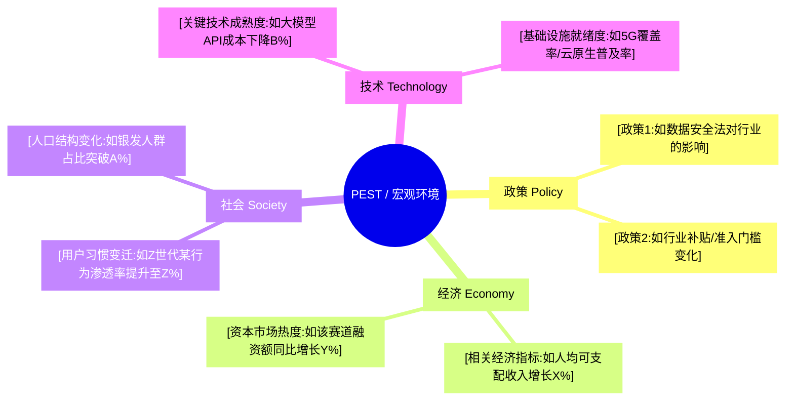

**核心结论：** [一句话总结宏观环境对产品最有利的1-2个因素]

### 1.3 市场规模测算

> **引用说明**：详细的市场规模数据、历史趋势、预测模型和敏感性分析，请参阅 **【模板】市场调研报告.md §4. 市场规模与趋势**。本文档仅引用关键结论。

| 指标    | 数值 | 测算逻辑                              | 数据来源                      |
| :--- | :---: | :--- | :--- |
| **TAM** | ¥X亿 | 引用市场调研报告§4.1                   | [艾瑞/IDC/Gartner/国家统计局] |
| **SAM** | ¥Y亿 | 引用市场调研报告§4.3                   | [内部模型测算]                |
| **SOM** | ¥Z亿 | 引用市场调研报告§4.5                   | [内部战略目标拆解]            |

> **完整数据**：市场规模历史数据、三情景预测、敏感性分析详见 **【模板】市场调研报告.md §4.4-4.6**。

### 1.4 市场趋势与周期定位

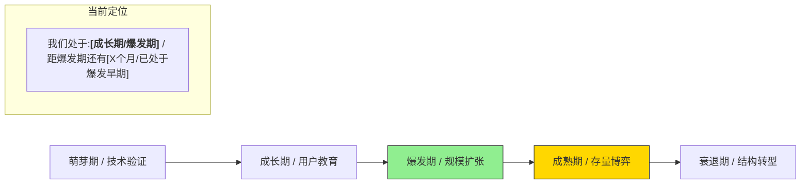

**关键趋势信号：**

- [趋势1：如AI Agent从概念验证进入生产力工具阶段，头部客户付费意愿显著增强]
- [趋势2：如行业从单点工具向一体化平台演进，集成能力成为核心采购指标]
- [趋势3：如监管趋严，合规能力成为准入门槛而非加分项]

### 1.5 市场问题与机会矩阵

| 问题/机会ID | 类型 | 描述                                                   | 数据佐证                                      | 与我司关联度 |
| :--- | :---: | :--- | :--- | :---: |
| M-001       | 痛点 | [如：中小企业数字化采购"无专人、无系统、无历史数据"]   | [调研显示73%采购员日均耗时3h+在Excel对账]     |  ⭐⭐⭐⭐⭐  |
| M-002       | 趋势 | [如：大模型API成本下降80%，实时语音翻译场景商业化可行] | [某云厂商Q2 API调用价目表/行业技术成熟度曲线] |   ⭐⭐⭐⭐   |
| M-003       | 空白 | [如：现有竞品均聚焦KA客户，300人以下企业市场无人覆盖]  | [该细分市场年增速210%，但供给端产品数为0]     |  ⭐⭐⭐⭐⭐  |

---

## 2. 用户分析（User Analysis）

### 2.1 目标用户分层

> **说明**：此象限图模板已转为表格描述。

<!--
原 quadrantChart 结构参考：
- title: 用户价值分层矩阵（消费能力 × 需求强度）
- x-axis: 低消费能力 --> 高消费能力
- y-axis: 低需求强度 --> 高需求强度
- quadrant-1: 核心用户（高价值）
- quadrant-2: 潜力用户（需培育）
- quadrant-3: 低优先级
- quadrant-4: 收割用户（快变现）
- 数据点: "用户群A / [如：中小企业采购员]": [0.3, 0.9]; "用户群B / [如：大型企业IT管理员]": [0.8, 0.7]; "用户群C / [如：自由职业者]": [0.4, 0.4]; "用户群D / [如：个人兴趣爱好者]": [0.2, 0.3]
-->

| 象限 | 区域特征 | 策略建议 |
| :--- | :--- | :--- |
| 象限1（高消费·高需求） | 核心用户（高价值） | 重点维护，深度运营 |
| 象限2（低消费·高需求） | 潜力用户（需培育） | 降低门槛，引导升级消费 |
| 象限3（低消费·低需求） | 低优先级 | 观察为主，暂不投入资源 |
| 象限4（高消费·低需求） | 收割用户（快变现） | 快速转化，短期变现 |

| 名称 | X值 | Y值 | 象限 |
| :--- | :---: | :---: | :--- |
| 用户群A / [如：中小企业采购员] | 0.3 | 0.9 | 象限2（潜力用户） |
| 用户群B / [如：大型企业IT管理员] | 0.8 | 0.7 | 象限1（核心用户） |
| 用户群C / [如：自由职业者] | 0.4 | 0.4 | 象限3（低优先级） |
| 用户群D / [如：个人兴趣爱好者] | 0.2 | 0.3 | 象限3（低优先级） |

### 2.2 核心用户画像（Persona）

> **主要 persona：[用户群A名称，如"效率型中小企业采购员"]**

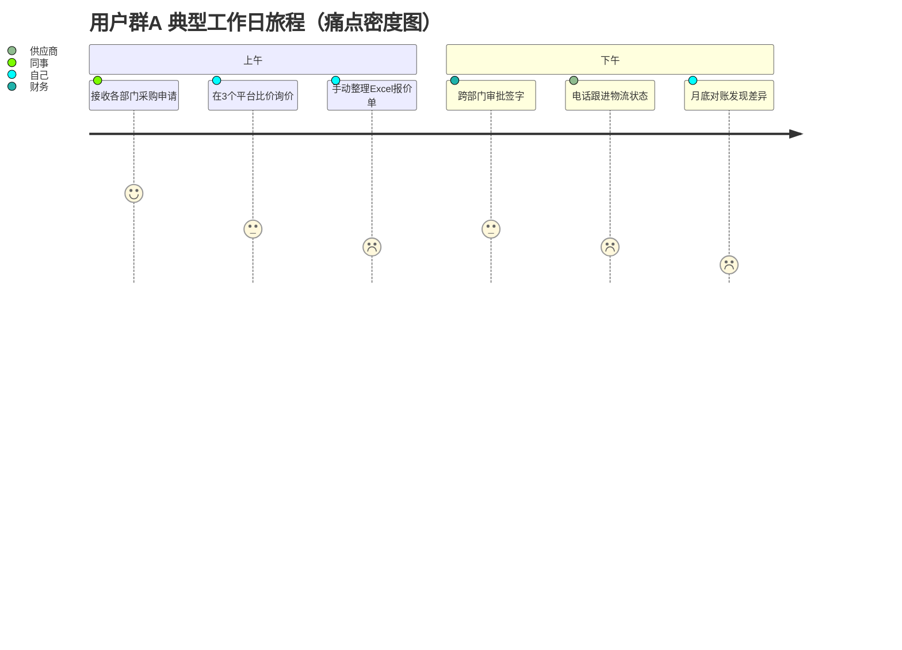

| 维度                 | 核心用户（Primary）                                       | 次要用户（Secondary）                                          |
| :------------------- | :-------------------------------------------------------- | :------------------------------------------------------------- |
| **人口特征**         | 25-35岁，一二线城市，本科以上学历，月收入8K-15K           | 35-45岁，二线城市，管理者，年收入20-40万                       |
| **职业特征**         | [如：兼任行政与采购，非专职采购岗，向行政总监汇报]        | [如：IT部门负责人，向CTO汇报，关注系统稳定性]                  |
| **核心诉求**         | [如：用最少时间完成合规采购，不被财务/审计挑出问题]       | [如：系统可扩展、数据安全可控、供应商资质合规]                 |
| **JTBD（待办任务）** | [如：当月底关账时，想要快速完成对账，以便按时提交报表]    | [如：当年度审计时，想要一键导出全量操作日志，以便通过合规检查] |
| **当前替代方案**     | [如：钉钉审批+微信沟通+Excel台账，信息散落在5个工具里]    | [如：自研OA系统+邮件沟通，维护成本高]                          |
| **付费意愿**         | [如：个人不付费，企业预算在5000-20000元/年，需走审批流程] | [如：企业预算在5-20万元/年，关注ROI]                           |
| **触达渠道**         | [如：垂直行业社群、钉钉应用市场、同行口碑推荐]            | [如：行业峰会、直销团队、合作伙伴推荐]                         |

### 2.3 用户场景与动机（JTBD框架）

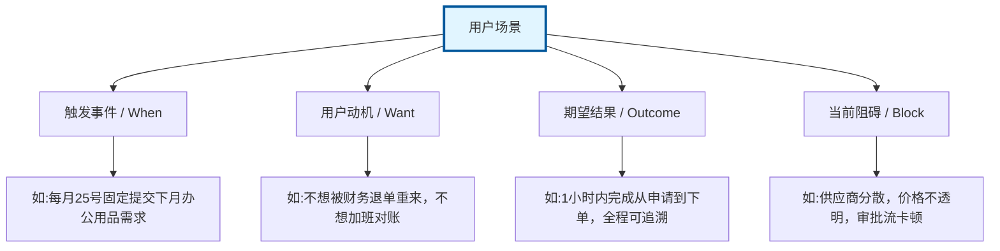

### 2.4 用户故事地图（Story Mapping）

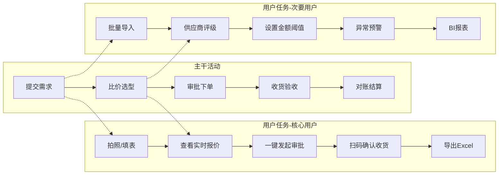

---

## 3. 竞品分析（Competitive Analysis）

### 3.1 竞争格局概览

> **引用说明**：详细的竞品分析、能力对比、用户反馈和战略洞察，请参阅 **【模板】竞品分析报告.md**。本文档仅引用关键结论。

| 竞品类型 | 代表竞品 | 市场定位 | 核心优势 | 主要劣势 | 对我方威胁 | 详细分析 |
| :--- | :--- | :--- | :--- | :--- | :--- | :--- |
| **直接竞品** | [名称] | [定位] | [优势] | [劣势] | [高/中/低] | 引用竞品分析报告§4-5 |
| **间接竞品** | [名称] | [定位] | [优势] | [劣势] | [高/中/低] | 引用竞品分析报告§4-5 |
| **替代品** | [名称] | [定位] | [优势] | [劣势] | [高/中/低] | 引用竞品分析报告§4-5 |

> **完整分析**：竞品组织画像、$APPEALS分析、功能矩阵、用户反馈、战略画布详见 **【模板】竞品分析报告.md §4-9**。

### 3.2 核心竞品对比

> **引用说明**：详细的竞品对比、功能矩阵、能力雷达图和战略画布，请参阅 **【模板】竞品分析报告.md §6-8**。本文档仅引用关键结论。

**竞品定位对比概要**：

| 竞品 | 定位 | 核心优势 | 主要劣势 | 对我方启示 | 详细分析 |
| :--- | :--- | :--- | :--- | :--- | :--- |
| **竞品A** | [定位] | [优势] | [劣势] | [启示] | 引用竞品分析报告§5.1 |
| **竞品B** | [定位] | [优势] | [劣势] | [启示] | 引用竞品分析报告§5.1 |
| **竞品C** | [定位] | [优势] | [劣势] | [启示] | 引用竞品分析报告§5.1 |
| **我方** | [定位] | [优势] | [劣势] | — | — |

**差异化机会**：

| 差异化方向 | 我方优势 | 竞品空白 | 用户价值 | 实现难度 | 详细分析 |
| :--- | :--- | :--- | :--- | :--- | :--- |
| [方向1] | [优势] | [空白] | [价值] | [高/中/低] | 引用竞品分析报告§9.1 |
| [方向2] | [优势] | [空白] | [价值] | [高/中/低] | 引用竞品分析报告§9.1 |

> **完整分析**：$APPEALS分析、功能矩阵、用户反馈、战略画布详见 **【模板】竞品分析报告.md §6-9**。

### 3.4 竞品能力雷达图

<svg xmlns="http://www.w3.org/2000/svg" viewBox="0 0 600 580" width="100%" style="max-width:600px">
  <rect width="600" height="580" fill="#fafafa" rx="8"/>
  <text x="300" y="30" text-anchor="middle" font-size="18" font-weight="bold" fill="#333">核心能力对比雷达图</text>
  <polygon points="300.0,256 338.1,278 338.1,322 300.0,344 261.9,322 261.9,278" fill="none" stroke="#ddd" stroke-width="1"/>
  <text x="374" y="278" font-size="11" fill="#999">20</text>
  <polygon points="300.0,212 376.2,256 376.2,344 300.0,388 223.8,344 223.8,256" fill="none" stroke="#ddd" stroke-width="1"/>
  <text x="412" y="256" font-size="11" fill="#999">40</text>
  <polygon points="300.0,168 414.3,234 414.3,366 300.0,432 185.7,366 185.7,234" fill="none" stroke="#ddd" stroke-width="1"/>
  <text x="450" y="234" font-size="11" fill="#999">60</text>
  <polygon points="300.0,124 452.4,212 452.4,388 300.0,476 147.6,388 147.6,212" fill="none" stroke="#ddd" stroke-width="1"/>
  <text x="488" y="212" font-size="11" fill="#999">80</text>
  <polygon points="300.0,80 490.5,190 490.5,410 300.0,520 109.5,410 109.5,190" fill="none" stroke="#ddd" stroke-width="1"/>
  <text x="527" y="190" font-size="11" fill="#999">100</text>
  <line x1="300" y1="300" x2="300.0" y2="80" stroke="#ddd" stroke-width="1"/>
  <text x="300.0" y="50" text-anchor="middle" font-size="13" fill="#333">功能完整度</text>
  <line x1="300" y1="300" x2="490.5" y2="190" stroke="#ddd" stroke-width="1"/>
  <text x="516.5" y="175" text-anchor="start" font-size="13" fill="#333">易用性</text>
  <line x1="300" y1="300" x2="490.5" y2="410" stroke="#ddd" stroke-width="1"/>
  <text x="516.5" y="425" text-anchor="start" font-size="13" fill="#333">价格优势</text>
  <line x1="300" y1="300" x2="300.0" y2="520" stroke="#ddd" stroke-width="1"/>
  <text x="300.0" y="550" text-anchor="middle" font-size="13" fill="#333">扩展性</text>
  <line x1="300" y1="300" x2="109.5" y2="410" stroke="#ddd" stroke-width="1"/>
  <text x="83.5" y="425" text-anchor="end" font-size="13" fill="#333">服务响应</text>
  <line x1="300" y1="300" x2="109.5" y2="190" stroke="#ddd" stroke-width="1"/>
  <text x="83.5" y="175" text-anchor="end" font-size="13" fill="#333">生态开放度</text>
  <!-- 竞品A: [90, 40, 20, 85, 70, 30] -->
  <polygon points="300.0,102 376.2,256 338.1,322 300.0,487 166.6,377 242.8,267" fill="#e74c3c" fill-opacity="0.1" stroke="#e74c3c" stroke-width="2.5"/>
  <circle cx="300.0" cy="102" r="4.5" fill="#e74c3c" stroke="#fff" stroke-width="1.5"/>
  <text x="310.0" y="94" text-anchor="middle" font-size="10" fill="#e74c3c" font-weight="bold">90</text>
  <circle cx="376.2" cy="256" r="4.5" fill="#e74c3c" stroke="#fff" stroke-width="1.5"/>
  <text x="386.2" y="248" text-anchor="start" font-size="10" fill="#e74c3c" font-weight="bold">40</text>
  <circle cx="338.1" cy="322" r="4.5" fill="#e74c3c" stroke="#fff" stroke-width="1.5"/>
  <text x="348.1" y="334" text-anchor="start" font-size="10" fill="#e74c3c" font-weight="bold">20</text>
  <circle cx="300.0" cy="487" r="4.5" fill="#e74c3c" stroke="#fff" stroke-width="1.5"/>
  <text x="310.0" y="499" text-anchor="middle" font-size="10" fill="#e74c3c" font-weight="bold">85</text>
  <circle cx="166.6" cy="377" r="4.5" fill="#e74c3c" stroke="#fff" stroke-width="1.5"/>
  <text x="156.6" y="389" text-anchor="end" font-size="10" fill="#e74c3c" font-weight="bold">70</text>
  <circle cx="242.8" cy="267" r="4.5" fill="#e74c3c" stroke="#fff" stroke-width="1.5"/>
  <text x="232.8" y="259" text-anchor="end" font-size="10" fill="#e74c3c" font-weight="bold">30</text>
  <!-- 竞品B: [50, 80, 95, 30, 40, 60] -->
  <polygon points="300.0,190 452.4,212 481.0,404 300.0,366 223.8,344 185.7,234" fill="#3498db" fill-opacity="0.1" stroke="#3498db" stroke-width="2.5"/>
  <circle cx="300.0" cy="190" r="4.5" fill="#3498db" stroke="#fff" stroke-width="1.5"/>
  <text x="310.0" y="182" text-anchor="middle" font-size="10" fill="#3498db" font-weight="bold">50</text>
  <circle cx="452.4" cy="212" r="4.5" fill="#3498db" stroke="#fff" stroke-width="1.5"/>
  <text x="462.4" y="204" text-anchor="start" font-size="10" fill="#3498db" font-weight="bold">80</text>
  <circle cx="481.0" cy="404" r="4.5" fill="#3498db" stroke="#fff" stroke-width="1.5"/>
  <text x="491.0" y="416" text-anchor="start" font-size="10" fill="#3498db" font-weight="bold">95</text>
  <circle cx="300.0" cy="366" r="4.5" fill="#3498db" stroke="#fff" stroke-width="1.5"/>
  <text x="310.0" y="378" text-anchor="middle" font-size="10" fill="#3498db" font-weight="bold">30</text>
  <circle cx="223.8" cy="344" r="4.5" fill="#3498db" stroke="#fff" stroke-width="1.5"/>
  <text x="213.8" y="356" text-anchor="end" font-size="10" fill="#3498db" font-weight="bold">40</text>
  <circle cx="185.7" cy="234" r="4.5" fill="#3498db" stroke="#fff" stroke-width="1.5"/>
  <text x="175.7" y="226" text-anchor="end" font-size="10" fill="#3498db" font-weight="bold">60</text>
  <!-- 我方方案: [65, 90, 85, 60, 85, 95] -->
  <polygon points="300.0,157 471.5,201 461.9,394 300.0,432 138.1,394 119.0,195" fill="#2ecc71" fill-opacity="0.1" stroke="#2ecc71" stroke-width="2.5"/>
  <circle cx="300.0" cy="157" r="4.5" fill="#2ecc71" stroke="#fff" stroke-width="1.5"/>
  <text x="310.0" y="149" text-anchor="middle" font-size="10" fill="#2ecc71" font-weight="bold">65</text>
  <circle cx="471.5" cy="201" r="4.5" fill="#2ecc71" stroke="#fff" stroke-width="1.5"/>
  <text x="481.5" y="193" text-anchor="start" font-size="10" fill="#2ecc71" font-weight="bold">90</text>
  <circle cx="461.9" cy="394" r="4.5" fill="#2ecc71" stroke="#fff" stroke-width="1.5"/>
  <text x="471.9" y="406" text-anchor="start" font-size="10" fill="#2ecc71" font-weight="bold">85</text>
  <circle cx="300.0" cy="432" r="4.5" fill="#2ecc71" stroke="#fff" stroke-width="1.5"/>
  <text x="310.0" y="444" text-anchor="middle" font-size="10" fill="#2ecc71" font-weight="bold">60</text>
  <circle cx="138.1" cy="394" r="4.5" fill="#2ecc71" stroke="#fff" stroke-width="1.5"/>
  <text x="128.1" y="406" text-anchor="end" font-size="10" fill="#2ecc71" font-weight="bold">85</text>
  <circle cx="119.0" cy="195" r="4.5" fill="#2ecc71" stroke="#fff" stroke-width="1.5"/>
  <text x="109.0" y="187" text-anchor="end" font-size="10" fill="#2ecc71" font-weight="bold">95</text>
  <rect x="30" y="510" width="14" height="14" rx="2" fill="#e74c3c"/>
  <text x="48" y="521" font-size="13" fill="#333">竞品A</text>
  <rect x="220" y="510" width="14" height="14" rx="2" fill="#3498db"/>
  <text x="238" y="521" font-size="13" fill="#333">竞品B</text>
  <rect x="410" y="510" width="14" height="14" rx="2" fill="#2ecc71"/>
  <text x="428" y="521" font-size="13" fill="#333">我方方案</text>
</svg>

### 3.5 竞品策略推演

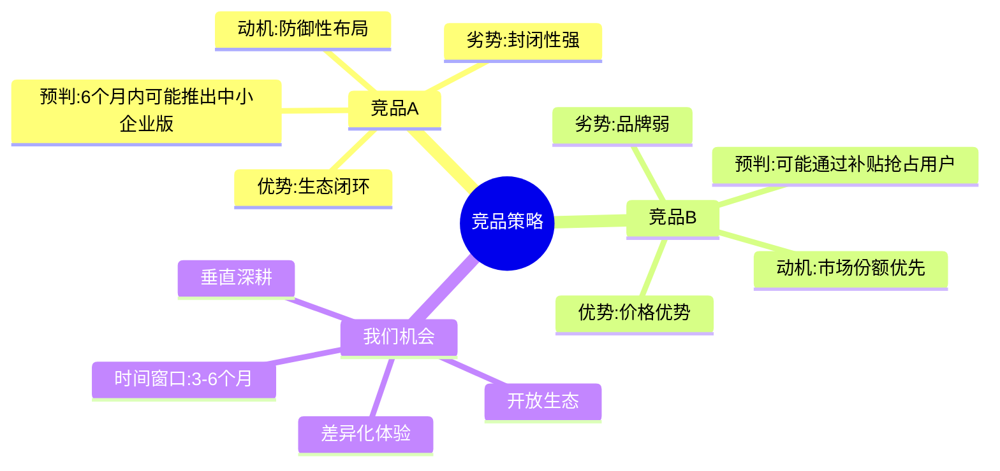

---

## 4. 产品策略与需求定义（Product Strategy & Requirements）

### 4.1 产品定位

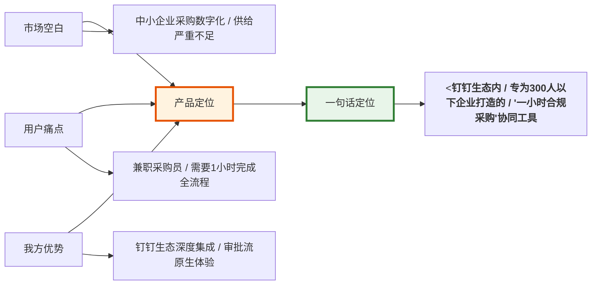

### 4.2 产品架构蓝图

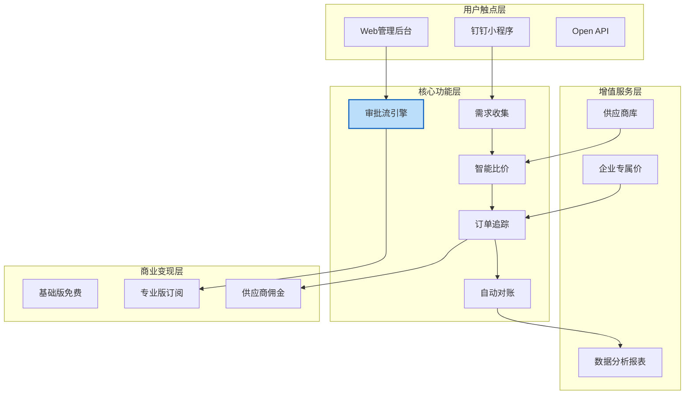

### 4.3 需求优先级矩阵

> **说明**：此象限图模板已转为表格描述。

<!--
原 quadrantChart 结构参考：
- title: 需求优先级矩阵（用户价值 × 实现成本）
- x-axis: 低成本 --> 高成本
- y-axis: 低用户价值 --> 高用户价值
- quadrant-1: 重点投入（高价值低门槛）
- quadrant-2: 差异化壁垒（高价值高门槛）
- quadrant-3: 暂不投入（低价值高门槛）
- quadrant-4: 快速上线（低价值低门槛）
- 数据点: "REQ-001：一键发起采购申请": [0.2, 0.9]; "REQ-002：钉钉原生审批流": [0.3, 0.85]; "REQ-003：AI智能比价": [0.7, 0.8]; "REQ-004：供应商信用评级": [0.6, 0.5]; "REQ-005：多语言支持": [0.8, 0.3]; "REQ-006：深色模式": [0.1, 0.2]
-->

| 象限 | 区域特征 | 策略建议 |
| :--- | :--- | :--- |
| 象限1（低成本·高价值） | 重点投入（高价值低门槛） | 立即启动，快速上线 |
| 象限2（高成本·高价值） | 差异化壁垒（高价值高门槛） | 列入版本规划，分阶段投入 |
| 象限3（高成本·低价值） | 暂不投入（低价值高门槛） | 延后或取消，暂不排期 |
| 象限4（低成本·低价值） | 快速上线（低价值低门槛） | 资源充裕时顺手完成 |

| 名称 | X值 | Y值 | 象限 |
| :--- | :---: | :---: | :--- |
| REQ-001：一键发起采购申请 | 0.2 | 0.9 | 象限1（重点投入） |
| REQ-002：钉钉原生审批流 | 0.3 | 0.85 | 象限1（重点投入） |
| REQ-003：AI智能比价 | 0.7 | 0.8 | 象限2（差异化壁垒） |
| REQ-004：供应商信用评级 | 0.6 | 0.5 | 象限2（差异化壁垒） |
| REQ-005：多语言支持 | 0.8 | 0.3 | 象限3（暂不投入） |
| REQ-006：深色模式 | 0.1 | 0.2 | 象限4（快速上线） |

### 4.4 需求清单（MoSCoW + KANO）

| 需求ID  | 需求描述                      | 用户故事                                                | KANO分类 |   优先级   | 版本规划 |
| :------ | :---------------------------- | :------------------------------------------------------ | :------: | :--------: | :------- |
| REQ-001 | [核心需求1：一键发起采购申请] | 作为部门员工，我想拍照/填表提交需求，以便采购员统一处理 |   必备   |  **Must**  | MVP      |
| REQ-002 | [核心需求2：钉钉原生审批流]   | 作为行政主管，我想设置金额阈值自动审批，以便提高效率    |   必备   |  **Must**  | MVP      |
| REQ-003 | [重要需求3：AI智能比价]       | 作为采购员，我想看到实时最低报价，以便控制预算          |   期望   | **Should** | V1.1     |
| REQ-004 | [增值需求4：供应商信用评级]   | 作为采购经理，我想查看供应商历史履约评分，以便降低风险  |   魅力   | **Could**  | V1.2     |
| REQ-005 | [未来需求5：多语言支持]       | 作为跨国企业员工，我想使用英文界面，以便海外同事使用    |   期望   | **Won't**  | V2.0     |

### 4.5 需求验证计划

| 验证方式 | 目标               | 样本量  |  时间   | 负责人 | 通过标准            |
| :------- | :----------------- | :-----: | :-----: | :----: | :------------------ |
| 用户访谈 | 验证痛点真实性     |  15人   | 第1-2周 |  用研  | ≥80%受访者确认痛点  |
| 问卷调研 | 量化需求优先级     |  500份  | 第2-3周 |  市场  | Top3需求选择率≥60%  |
| MVP测试  | 验证解决方案可行性 | 3家企业 | 第4-6周 |  产品  | 核心任务完成率≥70%  |
| 竞品对标 | 验证差异化空间     |    —    | 第1-3周 |  产品  | 至少3个差异化功能点 |

### 4.6 非功能性需求（NFR）

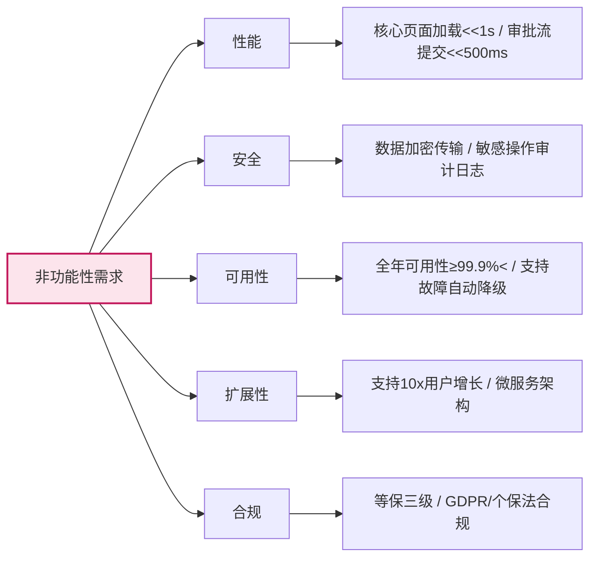

---

## 5. 市场进入策略（Go-to-Market）

### 5.1 定位策略

**价值主张（Value Proposition）：**

> 针对 **[目标用户]**，他们 **[关键痛点/需求]**， **[产品名称]** 是一款 **[产品品类]**，它能够 **[核心利益点]**。不像 **[主要竞品]**，我们 **[差异化优势]**。

**差异化卖点：**

1. [卖点1：如：钉钉生态内唯一支持"1小时采购闭环"的轻量化工具]
2. [卖点2：如：零实施成本，即开即用，无需IT部门介入]
3. [卖点3：如：采购数据自动同步财务系统，月底对账时间从3天缩短至1小时]

### 5.2 定价策略

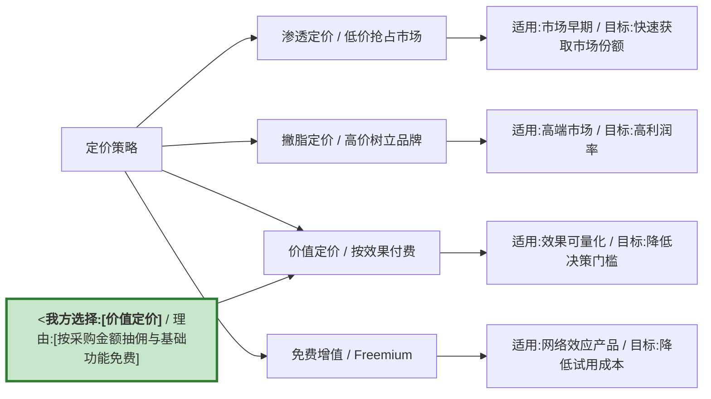

### 5.3 渠道策略

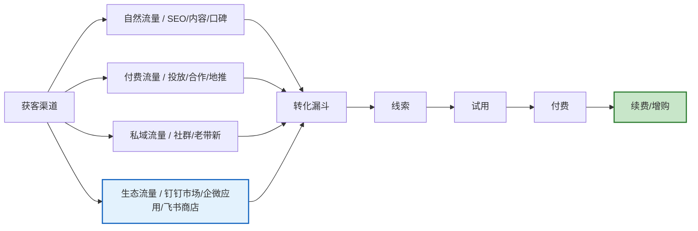

### 5.4 增长飞轮

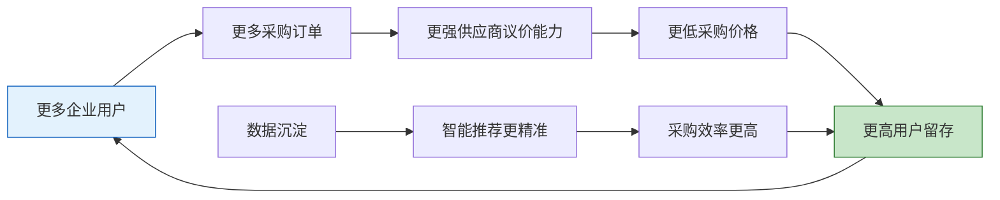

---

## 6. 执行计划（Execution Plan）

### 6.1 项目范围边界

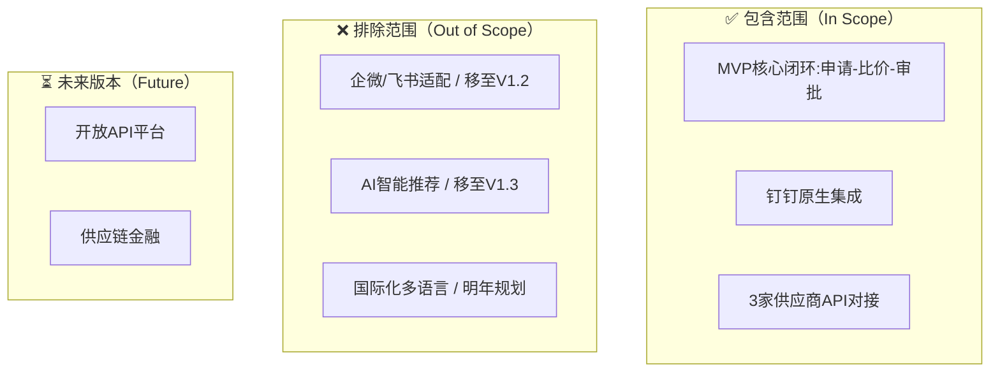

### 6.2 产品路线图与里程碑

> **说明**：甘特图为飞书不兼容类型，改为表格描述。

| 阶段 | 任务/里程碑 | 开始日期 | 工期 | 状态 |
|:---|:---|:---|:---:|:---:|
| 验证期 M1-M3 | MVP核心闭环验证 | YYYY-MM | 3M | ⚪ |
| 验证期 M1-M3 | CDCP概念决策评审 | YYYY-MM-DD | 0d | ⚪ milestone |
| 成长期 M4-M9 | 审批流引擎2.0 | MVP完成后 | 3M | ⚪ |
| 成长期 M4-M9 | 供应商生态接入 | 审批流完成后 | 3M | ⚪ |
| 成长期 M4-M9 | PDCP计划决策评审 | YYYY-MM-DD | 0d | ⚪ milestone |
| 成长期 M4-M9 | ADCP开发完成评审 | YYYY-MM-DD | 0d | ⚪ milestone |
| 规模化 M10-M15 | 多平台适配（企微/飞书） | 供应商接入后 | 3M | ⚪ |
| 规模化 M10-M15 | 数据分析与BI报表 | 平台适配后 | 3M | ⚪ |
| 规模化 M10-M15 | LDCP验证决策评审 | YYYY-MM-DD | 0d | ⚪ milestone |
| 商业化 M16-M18 | 企业专属价与佣金体系 | BI报表完成后 | 3M | ⚪ |
| 商业化 M16-M18 | RDCP发布决策评审 | YYYY-MM-DD | 0d | ⚪ milestone |

| DCP点    | 评审内容                     | 通过标准                    |  时间  |
| :------- | :--------------------------- | :-------------------------- | :----: |
| **CDCP** | 商业可行性、市场需求         | MRD通过评审，商业假设可验证 | T+2周  |
| **PDCP** | 产品方案、技术方案、资源计划 | PRD/TRD通过评审，预算获批   | T+4周  |
| **ADCP** | 开发完成度、质量基线         | 代码Review通过，Bug清零     | T+8周  |
| **LDCP** | 测试通过率、用户验收         | UAT通过，性能达标           | T+10周 |
| **RDCP** | 发布readiness、运营准备      | 灰度通过，监控就绪          | T+11周 |

### 6.3 项目团队（PDT）

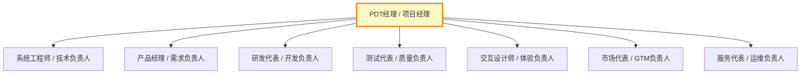

### 6.4 团队职责矩阵（RACI）

| 关键活动 | PDT经理 | 产品经理 | 研发 | 测试 | 设计 | 市场 |
| :--- | :---: | :---: | :---: | :---: | :---: | :---: |
| 需求定义 |    A    |    R     |  C   |  C   |  C   |  I   |
| 技术方案 |    A    |    C     |  R   |  C   |  I   |  I   |
| 开发实现 |    I    |    C     |  R   |  C   |  I   |  I   |
| 测试验收 |    A    |    C     |  C   |  R   |  I   |  I   |
| 发布上线 |    A    |    C     |  R   |  C   |  I   |  R   |
| 运营推广 |    I    |    C     |  I   |  I   |  C   |  R   |

> **R=执行, A=负责, C=咨询, I=知情**

---

## 7. 资源与预算（Resource & Budget）

### 7.1 资源需求

| 资源类型     | 需求明细                   |    数量     | 预算（万元） | 到位时间 |
| :----------- | :------------------------- | :---------: | :----------: | :------: |
| **人力成本** | 产品经理                   |     2人     |      60      |   即时   |
|              | 后端研发                   |     4人     |     120      |   即时   |
|              | 前端研发                   |     2人     |      60      |   即时   |
|              | 测试工程师                 |     2人     |      50      |  T+2周   |
|              | 设计师                     | 1人（半职） |      20      |   即时   |
| **技术成本** | 云服务器/数据库            |      —      |      30      |  T+4周   |
|              | 第三方服务（短信/支付/AI） |      —      |      20      |  T+2周   |
| **运营成本** | 种子用户获取/内容运营      |      —      |      30      |  T+6周   |
| **其他**     | 办公/差旅/培训             |      —      |      10      |   按需   |
| **合计**     |                            |             |   **400**    |          |

### 7.2 投入产出模型（3年）

> **说明**：xychart-beta为飞书不兼容Mermaid类型，改为表格描述（模板示例数据）。

**3年投入产出趋势（万元）**

| 年度 | 投入（万元） | 收入（万元） |
| :--- | :---: | :---: |
| Year 1 | 500 | 200 |
| Year 2 | 800 | 1,500 |
| Year 3 | 1,000 | 3,000 |

|  年度  | 投入（万） | 收入（万） | 利润（万） | ROI  |
| :---: | :---: | :---: | :---: | :---: |
| Year 1 |    500     |    200     |    -300    | -60% |
| Year 2 |    800     |    1500    |    700     | 88%  |
| Year 3 |    1000    |    3000    |    2000    | 200% |

---

## 8. 成功指标（Success Metrics）

### 8.1 北极星指标与增长模型

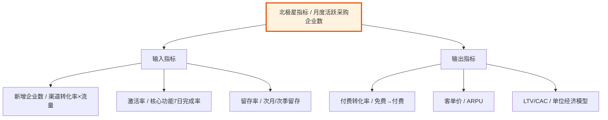

### 8.2 指标体系

| 指标类型       | 指标名称            | 目标值 |  测量周期  | 责任方 |
| :------------- | :------------------ | :----: | :--------: | :----: |
| **北极星指标** | 月度活跃采购企业数  |  X家   |    月度    |  产品  |
| 市场指标       | 市场份额            |   X%   |    季度    |  市场  |
| 用户指标       | NPS评分             |  ≥ 40  |    月度    |  用研  |
| 产品指标       | 核心功能采纳率      | ≥ 60%  | 版本发布后 |  产品  |
| 商业指标       | 客户获取成本（CAC） | ≤ ¥150 |    月度    |  增长  |
| 商业指标       | 用户终身价值（LTV） | ≥ ¥450 |    季度    |  运营  |
| 商业指标       | LTV/CAC             |  ≥ 3   |    季度    |  财务  |

---

## 9. 风险与对策（Risk & Mitigation）

### 9.1 关键商业假设

| 假设ID | 假设内容                           | 验证方式                  | 若假设不成立的影响     |
| :----- | :--------------------------------- | :------------------------ | :--------------------- |
| A-001  | 中小企业采购员愿意为"节省时间"付费 | MVP期免费试用转付费率≥15% | 需转向广告/佣金模式    |
| A-002  | 钉钉生态内获客CAC < ¥150           | 追踪渠道投放ROI           | 需拓展企微/飞书渠道    |
| A-003  | 供应商愿意以API形式接入并提供底价  | 签约3家头部供应商试点     | 需自建供应链，成本倍增 |

### 9.2 风险矩阵与退出机制

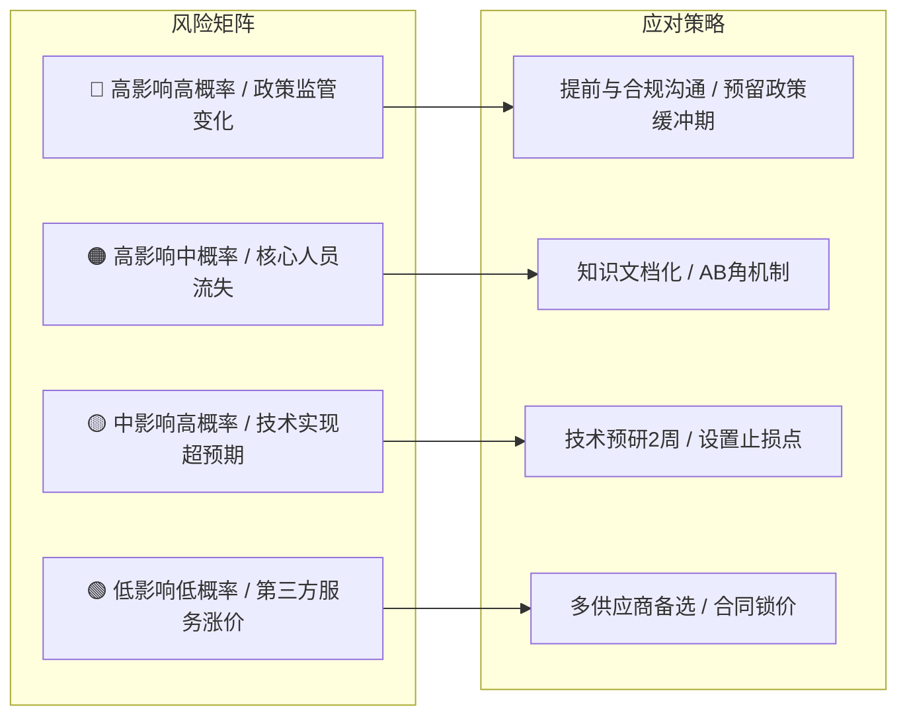

| 风险ID | 风险描述                                     | 可能性 | 影响度 | 应对策略                         | 责任人     | 退出条件                 |
| :----- | :------------------------------------------- | :----: | :----: | :------------------------------- | :--------- | :----------------------- |
| R-001  | [如：数据安全法对采购数据跨境传输提出新要求] |   中   |   高   | 提前引入合规顾问评审架构         | 法务/安全  | 延期>1月则暂停           |
| R-002  | [如：竞品突然免费策略冲击市场]               |   中   |   高   | 强化差异化场景，不做正面价格战   | 产品负责人 | 市场份额<<5%则Pivot      |
| R-003  | [如：钉钉开放平台接口政策调整]               |   低   |   高   | 封装适配层，降低平台耦合度       | 技术负责人 | 接口不可用>2周则切换平台 |
| R-004  | [如：MVP验证期用户活跃度不及预期]            |   中   |   中   | 预设4周数据观察期，不达标即Pivot | 产品负责人 | DAU<<100则缩减范围       |

---

## 10. 决策建议与下一步（Recommendation & Next Steps）

### 10.1 核心结论

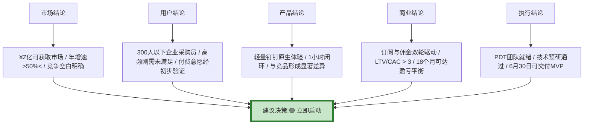

### 10.2 决策建议

> **建议决策：** 🟢 立即启动 / 🟡 补充调研后启动 / 🔴 暂缓  
> **关键理由：**
>
> 1. [理由1：如市场窗口期有限，预计竞品6个月内将跟进中小企业赛道]
> 2. [理由2：如技术可行性已通过POC验证，核心审批流对接钉钉API无阻塞]
> 3. [理由3：如财务模型健康，按保守估计第14个月可实现单月盈亏平衡]
>
> **下一步动作：**
>
> - [ ] 召开立项评审会，确定PDT核心团队（产品×1、研发×3、设计×1、运营×1）
> - [ ] 启动MVP sprint，6月30日前完成申请-比价-审批核心闭环Demo
> - [ ] 同步启动供应商BD，锁定首批3家战略合作方

---

## 11. 附录（Appendix）

- **附录A：** 用户深访原始记录（脱敏）
- **附录B：** 竞品产品截图与功能清单
- **附录C：** 市场规模测算Excel底稿
- **附录D：** 技术可行性预研报告摘要
- **附录E：** 名词解释与数据口径说明

> **文档撰写原则提示：**
>
> 1. **数据>观点**：每个结论须有数据或用户原话支撑，拒绝"我觉得"。
> 2. **逻辑闭环**：痛点→场景→需求→功能→资源→里程碑，链条不可断裂。
> 3. **惜字如金**：MRD不是论文，管理层平均阅读时间<<8分钟，图表优于文字。
> 4. **自我说服**：如果文档不能说服你自己，就不要提交评审。
