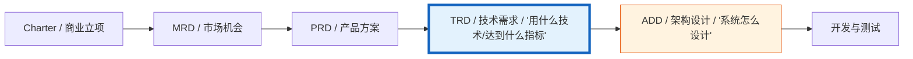
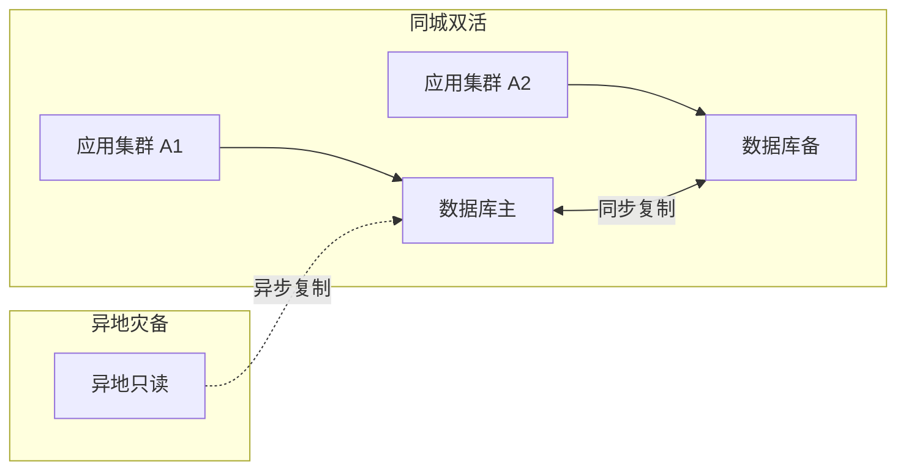
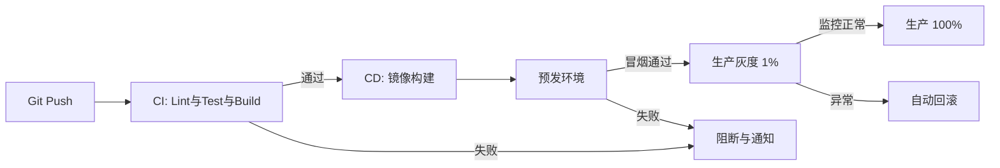

# [产品/系统名称（英文名）] - 技术需求文档（TRD）

> **文档状态：** 🟡 评审中 / 🟢 已通过 / 🔴 驳回
>
> **保密级别：** 机密 / 内部公开 / 公开
>
> **版本：** v1.0.2
>
> **日期：** YYYY-MM-DD
>
> **撰写人：** [架构师 / 技术负责人]
>
> **评审人：** [姓名/角色]
>
> **阅读对象：** Kirky.X、CTO、产研测负责人、子系统架构师
>
> **关联文档：** [文件名 行号范围]

---

## 0. 文档导读

### 0.1 文档目的与适用范围

**TRD 回答**："用什么技术栈、达到什么性能指标、有什么非功能约束"——跨子系统、跨团队的技术评审层。
**ADD 回答**："系统长成什么样、模块怎么切、数据怎么流"——单个子系统的实现指导。

**适用场景：**

- ✅ 新建跨多个子系统的技术平台（如司南 POI 中心、推荐平台、对话平台）
- ✅ 重大技术选型决策（如引入向量数据库、LLM 服务、图数据库）
- ✅ 性能/可靠性基线定义（影响后续所有子系统的实现约束）
- ❌ 单个子系统的内部架构（用 ADD 即可）
- ❌ 业务需求分析（用 PRD/FRD）

**阅读对象：**

| 阅读角色     | 职责范围                   |
| :----------- | :------------------------- |
| Kirky.X      | 技术架构评审与标准合规审查 |
| CTO          | 技术战略对齐与资源决策     |
| 产研测负责人 | 实施可行性与排期评估       |
| 子系统架构师 | 技术方案评审与接口定义     |

### 0.2 相关文档

| 文档类型 | 文件名              | 相关章节   |
| -------- | ------------------- | ---------- |
| [类型]   | [文件名] [行号范围] | [章节描述] |

> **引用格式说明**：关联文档使用 `文件名 行号范围` 格式（如 `【模板】技术需求文档(TRD).md 3-17`），行号随文档更新可能变化，请以实际内容为准。

### 0.3 变更记录

| 版本   | 日期       | 修订人 | 变更内容                                                                     | 审核人   |
| :----- | :--------- | :----- | :--------------------------------------------------------------------------- | :------- |
| v0.1   | YYYY-MM-DD | [姓名] | 初稿                                                                         | [架构师] |
| v0.2   | YYYY-MM-DD | [姓名] | 评审通过                                                                     | [审核人] |
| v1.0   | YYYY-MM-DD | [姓名] | Kirky.X评审通过                                                              | [CTO]    |
| v1.0.1 | 2026-06-20 | 谢董   | 消息队列推荐选型 Kafka→Pulsar（统一事件总线规范），Kafka/RocketMQ 标注已弃用 | —        |
| v1.0.2 | 2026-06-26 | 谢董   | $ 符号飞书转义修复（consistency-remediation-p0 WS11）：金额/SQL参数引用 $ → \$ | —        |

---

## 1. 技术挑战分析（Technical Challenges）

> **架构师导读：** 5 分钟说明我们要解决的核心技术难题。

### 1.1 挑战清单

| 挑战 ID | 挑战分类 | 挑战描述                             | 量化指标                      | 优先级 |
| :------ | :------- | :----------------------------------- | :---------------------------- | :----: |
| TC-001  | 性能     | [如：推荐召回 P99 ≤ 200ms]           | [如：百万级 POI 全量召回]     |   P0   |
| TC-002  | 一致性   | [如：行程规划的多设备同步]           | [如：最终一致 ≤ 5s]           |   P0   |
| TC-003  | 可扩展   | [如：支持 100 万 DAU 增长至 1000 万] | [如：水平扩容 ≤ 1 周]         |   P1   |
| TC-004  | 可用性   | [如：行中助手 7×24 在线]             | [如：可用性 ≥ 99.95%]         |   P0   |
| TC-005  | 安全     | [如：用户位置信息脱敏]               | [如：所有 GPS 坐标精度 ≤ 1km] |   P0   |
| TC-006  | 成本     | [如：LLM 调用成本控制]               | [如：单次对话 ≤ \$0.05]        |   P1   |

### 1.2 关键技术难题深析

#### TC-001 性能：[挑战名]

**问题本质**：[一段话描述核心矛盾]

**当前方案局限**：[如：传统 ES 检索在 POI 量超过 50 万后 P99 退化到 800ms]

**本方案创新点**：[如：双层召回（向量召回 + 倒排索引召回）配合 RRF 融合，P99 稳定在 150ms 内]

**技术风险**：[如：向量召回冷启动效果不稳定]

---

## 2. 技术选型矩阵（Technology Stack Selection）

### 2.1 选型决策矩阵

| 技术维度       | 当前选型                      | 备选方案                              | 选型理由                             | 决策 ADR  |
| :------------- | :---------------------------- | :------------------------------------ | :----------------------------------- | :-------: |
| **编程语言**   | [如：Rust 1.78+]              | [C++ / Go]                            | [如：性能 + 内存安全 + 异步生态]     | [ADR-001] |
| **核心框架**   | [如：Axum 0.7]                | [Actix-web / Tokio 原生]              | [如：异步生态最丰富]                 | [ADR-001] |
| **关系型存储** | [如：PostgreSQL 16]           | [MySQL 8 / OceanBase]                 | [如：JSONB / PostGIS / 性能]         | [ADR-002] |
| **向量数据库** | [如：Milvus 2.4]              | [Qdrant / pgvector]                   | [如：亿级向量 QPS 1000+ 验证]        | [ADR-003] |
| **图数据库**   | [如：Neo4j 5.x]               | [Memgraph / TigerGraph]               | [如：生态成熟 + Cypher 友好]         | [ADR-004] |
| **消息队列**   | [如：Pulsar 3.x]              | [Kafka（已弃用）/ RocketMQ（已弃用）] | [如：统一事件总线 + 多租户 + 持久化] | [ADR-005] |
| **缓存**       | [如：Redis 7.2]               | [KeyDB / DragonflyDB]                 | [如：成熟度 + 工具链]                |     —     |
| **部署平台**   | [如：Kubernetes 1.29]         | [Docker Swarm / 裸机]                 | [如：弹性 + 生态]                    | [ADR-006] |
| **可观测性**   | [如：OpenTelemetry + Grafana] | [Datadog / New Relic]                 | [如：开源 + 厂商中立]                |     —     |

### 2.2 选型约束

- **依赖管控**：[如：禁止引入 GPL 协议依赖；新依赖需评审]
- **版本策略**：[如：长支持周期 LTS 版本；每季度升级评估]
- **国产化要求**：[如：信创环境兼容、国产数据库适配路径]

### 2.3 关键技术决策 ADR 索引

| ADR 编号  | 决策主题                       |   状态    | 评审日期   |
| :-------- | :----------------------------- | :-------: | :--------- |
| [ADR-001] | [如：选 Rust 作为核心开发语言] |  🟢 通过  | YYYY-MM-DD |
| [ADR-002] | [如：选 PostgreSQL 而非 MySQL] |  🟢 通过  | YYYY-MM-DD |
| [ADR-003] | [如：选 Milvus 作为向量数据库] | 🟡 评审中 | —          |

---

## 3. 性能与可扩展性指标（Performance & Scalability）

### 3.1 性能基线

| 指标               | 当前值 | 目标值             | 测量方法 | 验收场景 |
| :----------------- | :----- | :----------------- | :------- | :------- |
| **QPS 峰值**       | [—]    | [如：≥ 10,000 QPS] | 压测     | 业务高峰 |
| **P99 延迟（读）** | [—]    | [如：≤ 200ms]      | 压测     | 推荐召回 |
| **P99 延迟（写）** | [—]    | [如：≤ 500ms]      | 压测     | 行程保存 |
| **平均响应时间**   | [—]    | [如：≤ 100ms]      | APM      | 日常     |
| **并发用户数**     | [—]    | [如：≥ 50,000]     | 压测     | 节假日   |
| **吞吐量（写）**   | [—]    | [如：≥ 5,000 TPS]  | 压测     | 行程创建 |

### 3.2 容量规划

| 资源           | 1 万 DAU          | 10 万 DAU          | 100 万 DAU          | 1000 万 DAU         |
| :------------- | :---------------- | :----------------- | :------------------ | :------------------ |
| **API 实例数** | [如：4]           | [如：8]            | [如：24]            | [如：80]            |
| **数据库主库** | [如：1 节点 4C8G] | [如：1 节点 8C16G] | [如：2 节点 16C32G] | [如：8 节点 32C64G] |
| **存储容量**   | [如：100 GB]      | [如：500 GB]       | [如：5 TB]          | [如：50 TB]         |
| **CDN 流量**   | [如：50 GB/日]    | [如：500 GB/日]    | [如：5 TB/日]       | [如：50 TB/日]      |

### 3.3 扩展性策略

- **水平扩展能力**：[如：无状态服务 ≥ 200 实例；数据库分片 64 库 × 64 表]
- **垂直扩展能力**：[如：单实例最大 32C64G]
- **弹性伸缩**：[如：基于 CPU/QPS 触发 HPA；扩容耗时 ≤ 3 分钟]
- **数据分片策略**：[如：按 user_id 哈希分 16 库；按时间分月表]

---

## 4. 可靠性与容灾（Reliability & DR）

### 4.1 可靠性指标

| 指标                    | 目标                             | 测量方法 |
| :---------------------- | :------------------------------- | :------- |
| **服务可用性（SLO）**   | [如：≥ 99.95%（年停机 ≤ 4.38h）] | 线上监控 |
| **错误率**              | [如：≤ 0.01%]                    | 监控告警 |
| **RTO（恢复时间目标）** | [如：≤ 30 分钟]                  | 故障演练 |
| **RPO（数据丢失目标）** | [如：≤ 5 分钟]                   | 故障演练 |

### 4.2 容灾架构

### 4.3 降级与熔断策略

| 场景            | 降级策略        | 触发条件      | 恢复策略 |
| :-------------- | :-------------- | :------------ | :------- |
| 推荐召回超时    | 返回热门兜底    | P99 > 500ms   | 自动恢复 |
| LLM 服务不可用  | 切到小模型/规则 | 错误率 > 5%   | 探测恢复 |
| 第三方 API 超时 | 重试 + 降级缓存 | 连续 3 次失败 | 退避重试 |
| 数据库主库故障  | 切备库          | 心跳超时      | 人工确认 |

---

## 5. 可观测性（Observability）

### 5.1 日志规范

- **日志格式**：[如：JSON 结构化日志；trace_id / span_id / user_id 必填]
- **日志级别**：[如：生产 INFO；测试 DEBUG]
- **日志保留**：[如：30 天热存储 + 1 年冷存储]
- **PII 脱敏**：[如：手机号、身份证、GPS 坐标必须脱敏]

### 5.2 指标规范

- **业务指标**：[如：DAU、推荐 CTR、行程完成率、订阅转化率]
- **技术指标**：[如：QPS、P99、错误率、JVM/系统负载]
- **RED 指标**：[Rate / Errors / Duration] 必须覆盖所有服务
- **USE 指标**：[Utilization / Saturation / Errors] 必须覆盖所有资源

### 5.3 链路追踪

- **Trace 协议**：[如：OpenTelemetry / Jaeger]
- **采样率**：[如：100%（错误）+ 1%（正常）]
- **关键 span**：[如：HTTP → Auth → BizLogic → DB / Cache / RPC]

### 5.4 告警策略

| 告警级别    | 触发条件                    | 通知方式           | 响应时限 |
| :---------- | :-------------------------- | :----------------- | :------- |
| **P0 紧急** | [如：服务不可用 / 数据丢失] | 电话 + 短信 + 钉钉 | 5 分钟   |
| **P1 高**   | [如：SLO 接近告警阈值]      | 钉钉 + 短信        | 30 分钟  |
| **P2 中**   | [如：错误率上升]            | 钉钉               | 4 小时   |
| **P3 低**   | [如：容量预警]              | 邮件               | 1 天     |

---

## 6. 安全与合规（Security & Compliance）

### 6.1 认证与授权

- **认证方式**：[如：JWT + 设备指纹；OAuth 2.1]
- **授权模型**：[如：RBAC（角色）/ ABAC（属性）]
- **密钥管理**：[如：KMS 集中管理；环境隔离]

### 6.2 数据安全

| 数据分级    | 示例             | 加密要求            | 存储要求 |
| :---------- | :--------------- | :------------------ | :------- |
| **L4 绝密** | 支付密码、身份证 | AES-256 加密 + 脱敏 | 独立存储 |
| **L3 机密** | 行程详情、GPS    | 字段级加密          | 加密存储 |
| **L2 内部** | 行为日志         | 脱敏                | 标准存储 |
| **L1 公开** | POI 信息         | 无                  | 标准存储 |

### 6.3 网络安全

- **传输加密**：[如：TLS 1.3 全链路]
- **内部通信**：[如：mTLS 服务网格]
- **DDoS 防护**：[如：高防 IP + 限流]
- **WAF**：[如：SQL 注入 / XSS / CSRF 防护]

### 6.4 合规要求

- [ ] **数据安全法**：境内数据境内存储
- [ ] **个人信息保护法（PIPL）**：用户授权 + 最小化原则
- [ ] **GDPR**（如适用）：数据可携权 / 被遗忘权
- [ ] **等保三级**：日志审计 ≥ 6 个月

### 6.5 审计日志

- **审计范围**：[如：所有写操作、敏感读操作、权限变更]
- **审计字段**：[如：操作人 / 时间 / IP / 动作 / 资源]
- **审计保留**：[如：≥ 1 年]

---

## 7. 可维护性（Maintainability）

### 7.1 代码组织

- **仓库结构**：[如：monorepo / polyrepo]
- **服务划分**：[如：按业务域划分；服务数量 ≤ 30]
- **代码规范**：[如：Rust clippy / Go golangci-lint / TypeScript ESLint]
- **依赖管理**：[如：cargo add / npm install；锁定版本]

### 7.2 CI/CD

- **代码合并**：[如：PR 需 ≥ 2 人评审；CI 必过]
- **自动化测试**：[如：单元 ≥ 80% 覆盖；集成测试全关键路径]
- **发布策略**：[如：金丝雀灰度 + 自动回滚]
- **回滚时间**：[如：≤ 5 分钟]

### 7.3 技术债务管理

- **债务登记**：[如：每 Sprint Review 评估并入档]
- **债务清偿**：[如：每月清偿 ≥ 2 项 P1 债务]
- **重构原则**：[如：禁止破坏性重构与功能迭代并行]

---

## 8. 技术风险评估（Technical Risk Assessment）

| 风险 ID | 风险描述                     | 概率  | 影响  | 风险等级 | 缓解措施                  | 责任人    |
| :------ | :--------------------------- | :---: | :---: | :------: | :------------------------ | :-------- |
| TR-001  | [如：向量数据库冷启动不稳定] | 🟡 中 | 🔴 高 | 🟠 中高  | [如：兜底召回规则]        | [架构师]  |
| TR-002  | [如：LLM API 成本失控]       | 🟡 中 | 🟡 中 |  🟡 中   | [如：缓存 + 限流 + 监控]  | [后端 TL] |
| TR-003  | [如：第三方 POI 数据失效]    | 🔴 高 | 🟡 中 |  🟡 中   | [如：多源切换 + 健康检查] | [数据 TL] |
| TR-004  | [如：单机房故障]             | 🟢 低 | 🔴 高 |  🟡 中   | [如：同城双活]            | [SRE]     |

---

## 9. 附录（Appendix）

### 9.1 术语表

| 术语 | 英文                      | 释义                   |
| :--- | :------------------------ | :--------------------- |
| SLO  | Service Level Objective   | 服务等级目标           |
| RTO  | Recovery Time Objective   | 恢复时间目标           |
| RPO  | Recovery Point Objective  | 数据丢失目标           |
| P99  | Percentile 99             | 99% 请求在该时间内完成 |
| HPA  | Horizontal Pod Autoscaler | K8s 水平 Pod 自动伸缩  |

### 9.2 参考文献

> 引用规范遵循 APA 7th 标准。正文中引用使用右上角角标 `[N]` 格式，参考文献列表使用有序列表。
>
> 格式示例：
>
> 1. Author, A. A. (Year). _Title of article_. _Title of Periodical_, _Volume_(Issue), Page–Page. https://doi.org/xxxxx
> 2. Author, A. A. (Year). _Title of work: Subtitle_. Publisher.
> 3. Author, A. A. (Year). _Title of paper_. Conference Name. https://doi.org/xxxxx

---

## 📌 TRD 撰写 Checklist

- [ ] §0 文档导读：目的与适用范围 / 相关文档 / 变更记录
- [ ] §1 技术挑战：≥ 3 个 P0 挑战，含量化指标
- [ ] §2 技术选型矩阵：≥ 5 个技术维度，每个有选型理由
- [ ] §3 性能基线：含 QPS / P99 / 容量规划 / 扩展策略
- [ ] §4 可靠性：含可用性 SLO / RTO / RPO / 降级策略
- [ ] §5 可观测性：日志 / 指标 / 链路追踪 / 告警四要素齐备
- [ ] §6 安全合规：认证 / 加密 / 合规清单
- [ ] §7 可维护性：CI/CD / 测试 / 债务管理
- [ ] §8 风险评估：≥ 3 个风险，含概率影响与缓解
- [ ] §9 附录：术语 / 引用
- [ ] 关联文档链接完整
