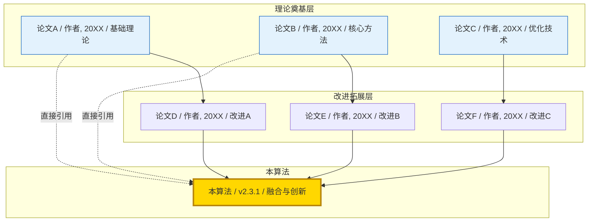
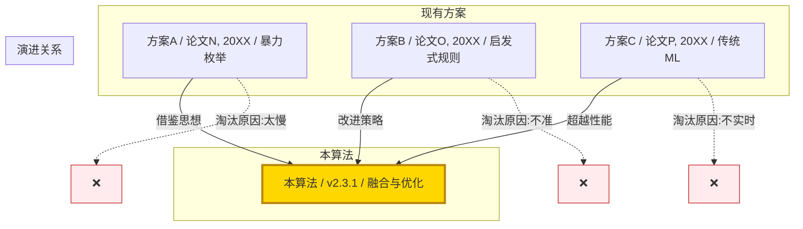
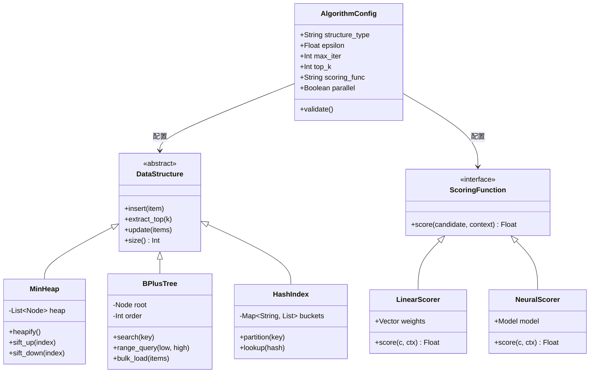
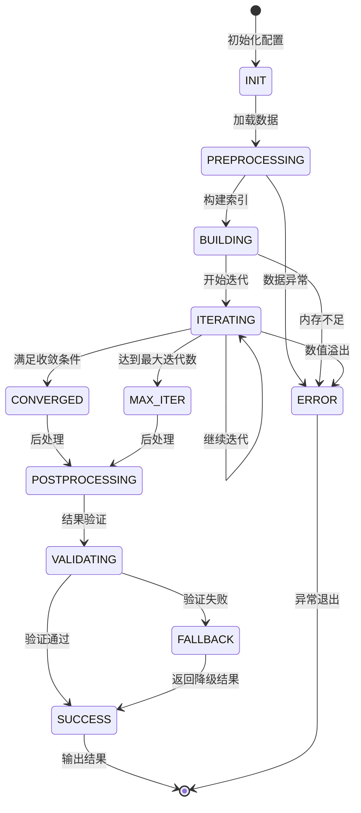
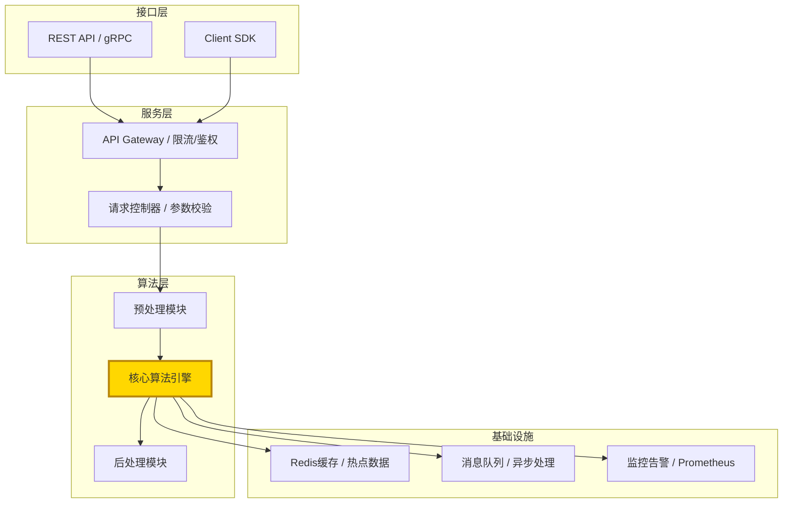
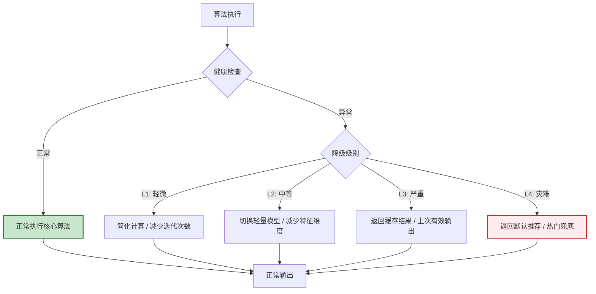
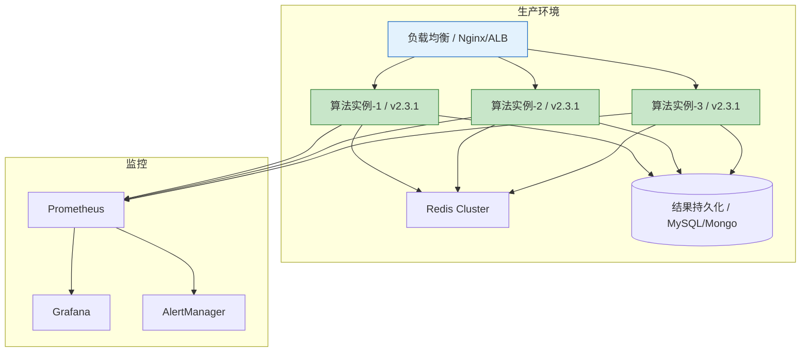
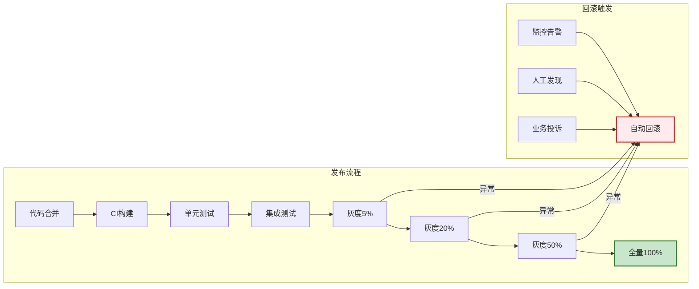

# [产品/系统名称（英文名）] - 核心算法文档（CAD）

> **文档状态：** 🟡 评审中 / 🟢 已通过 / 🔴 驳回
>
> **保密级别：** 机密 / 内部公开 / 公开
>
> **版本：** v0.2.3
>
> **日期：** YYYY-MM-DD
>
> **撰写人：** [算法Owner]
>
> **评审人：** [工程Owner、架构师]
>
> **阅读对象：** [角色列表]
>
> **算法名称：** 【算法名称 / Algorithm Name】
>
> **算法版本：** v2.3.1
>
> **遵循规范：** Google Algorithm Design Doc / 阿里Aone算法评审 / 字节CodeReview标准 / ACM Computing Surveys引用规范

---

## 0. 文档导读

### 0.1 文档目的与适用范围

[说明本文档的目的、适用场景和不适用场景]

### 0.2 相关文档

| 文档类型 | 文件名 | 相关章节 |
|---------|--------|---------|
| [类型] | [文件名] [行号范围] | [章节描述] |

> **引用格式说明**：关联文档使用 `文件名 行号范围` 格式（如 `【模板】核心算法文档.md 3-21`），行号随文档更新可能变化，请以实际内容为准。

### 0.3 变更记录

| 版本 | 日期 | 修订人 | 变更内容 | 审核人 |
| :--- | :--- | :--- | :--- | :--- |
| v1.0.0 | 2024-XX | [姓名] | MVP版本上线 | [审核人] |
| v2.0.0 | 2024-XX | [姓名] | 从单机版升级为分布式架构 | [审核人] |
| v2.1.0 | 2024-XX | [姓名] | 支持多目标优化（准确率+多样性） | [审核人] |
| v2.2.0 | 2025-XX | [姓名] | 引入神经网络评分器，准确率 +5% | [审核人] |
| v2.2.1 | 2025-XX | [姓名] | 修复并发场景下的空指针异常 | [审核人] |
| v2.3.0 | 2026-XX | [姓名] | 支持动态超参数热更新 | [审核人] |
| v2.3.1 | 2026-XX | [姓名] | 索引结构改为跳表，查询延迟降低 30% | [审核人] |
| v2.3.2 | 2026-06-09 | 谢董 | 修复：quadrantChart 模板改为表格格式（飞书不兼容） | — |
| v2.3.3 | 2026-06-09 | 谢董 | 修复xychart-beta图为表格以兼容飞书渲染 | — |
| v2.3.4 | 2026-06-09 | 谢董 | 修复gantt图为表格以兼容飞书渲染 | — |

---

## 2. 执行摘要（Executive Summary）

### 2.1 一句话描述

> 【算法】基于 **【核心理论文献，如：Vaswani et al., 2017】** 的 **【核心机制】** 思想，通过 **【改进点】** 解决 **【核心问题】**，在 **【关键指标】** 上达到 **【量化结果】**，已应用于 **【业务场景】**。

### 2.2 算法名片

```mermaid
graph LR
    subgraph 算法名片
        A[问题类型 / 如:排序/检索/推荐/优化]
        B[算法范式 / 如:贪心/动态规划/深度学习/图算法]
        C[时间复杂度 / O(X)]
        D[空间复杂度 / O(Y)]
        E[核心数据结构 / 如:堆/跳表/神经网络]
        F[业务价值 / 如:QPS提升X%]
        G[理论奠基 / 如:论文A/论文B]
    end

    A --> B --> C --> D --> E --> F
    G --> B

    style A fill:#e3f2fd,stroke:#1565c0
    style B fill:#e8f5e9,stroke:#2e7d32
    style C fill:#fff3e0,stroke:#e65100
    style D fill:#fff3e0,stroke:#e65100
    style E fill:#f3e5f5,stroke:#7b1fa2
    style F fill:#ffd700,stroke:#b8860b,stroke-width:2px
    style G fill:#c8e6c9,stroke:#2e7d32,stroke-width:2px
```

### 2.3 关键指标速览

| 指标 | 数值 | 测试环境 | 对比基线 | 提升幅度 | 对标论文 |
|------|------|---------|---------|---------|---------|
| **准确率/精度** | [X.XX] | [环境] | [基线] | +[X]% | [论文C, 年份] |
| **吞吐量/QPS** | [X] req/s | [环境] | [基线] | +[X]% | [论文D, 年份] |
| **延迟/P99** | [X] ms | [环境] | [基线] | -[X]% | [论文E, 年份] |
| **内存占用** | [X] GB | [环境] | [基线] | -[X]% | [论文F, 年份] |
| **覆盖率/召回** | [X.XX] | [环境] | [基线] | +[X]% | [论文G, 年份] |

---

## 3. 理论基础与文献溯源

### 3.1 理论奠基论文

本算法的理论基础来源于以下里程碑工作：

| 论文 | 作者/年份 | 会议/期刊 | 核心贡献 | 本算法引用点 |
|------|----------|----------|---------|-------------|
| **【论文A】** | [作者, 20XX] | NeurIPS/ICML/SIGIR | 【贡献描述，如：首次提出Transformer架构】 | 核心注意力机制 |
| **【论文B】** | [作者, 20XX] | KDD/WWW/ICDE | 【贡献描述，如：提出图神经网络消息传递范式】 | 关系建模模块 |
| **【论文C】** | [作者, 20XX] | ACL/EMNLP/NAACL | 【贡献描述，如：预训练语言模型的微调策略】 | 训练策略 |
| **【论文D】** | [作者, 20XX] | OSDI/SOSP/ATC | 【贡献描述，如：大规模系统负载均衡算法】 | 分布式调度 |

### 3.2 学术演进图谱



### 3.3 直接引用 vs 启发式引用

| 引用类型 | 论文 | 引用位置 | 引用方式 | 说明 |
|---------|------|---------|---------|------|
| **直接引用** | [论文A] | 第4.2节伪代码 | 核心公式直接采用 | 未修改原始定义 |
| **直接引用** | [论文B] | 第7.1节类图 | 数据结构继承 | 标准实现 |
| **改进引用** | [论文C] | 第4.3节子算法 | 修改其损失函数 | 加入业务约束项 |
| **启发引用** | [论文D] | 第3.2节创新点 | 借鉴其分治思想 | 应用于新场景 |
| **对比引用** | [论文E] | 第10.1节 | 作为基线方法 | 实验对比对象 |
| **方法引用** | [论文F] | 第6.1节复杂度 | 采用其复杂度分析框架 | 统一分析标准 |

---

## 4. 问题定义与形式化

### 4.1 业务背景

【描述业务场景：为什么需要这个算法？当前系统的痛点是什么？不解决会有什么后果？】

> 例如：在推荐系统中，用户实时行为序列长度可达 10^4 级别，传统 Attention [1] 的 O(n²) 复杂度导致 P99 延迟超过 500ms，严重影响用户体验。

### 4.2 形式化定义

**输入（Input）**：
- 令 $X = \{x_1, x_2, \dots, x_n\}$ 为输入集合，其中 $x_i \in \mathcal{X}$
- 约束条件：【如 $n \leq 10^6$，$x_i$ 为稀疏向量】

**输出（Output）**：
- 令 $Y = \{y_1, y_2, \dots, y_k\}$ 为输出结果，其中 $y_j \in \mathcal{Y}$
- 输出约束：【如 $k \leq 100$，$y_j$ 必须满足单调性】

**优化目标**：
$$\arg\min_{f \in \mathcal{F}} \mathcal{L}(f(X), Y_{gt}) + \lambda \Omega(f)$$

其中：
- $\mathcal{L}$ 为【损失函数，如交叉熵/均方误差，引用论文G的定义】
- $\Omega(f)$ 为【正则项，如 L2/模型复杂度惩罚，引用论文H的正则化框架】
- $\lambda$ 为平衡系数

### 4.3 问题分类与难度

> **说明**：此象限图模板已转为表格描述。

<!--
原 quadrantChart 结构参考：
- title: 问题定位：计算复杂度 vs 数据规模
- x-axis: "低数据规模" --> "高数据规模"
- y-axis: "低计算复杂度" --> "高计算复杂度"
- quadrant-1: 大数据+高复杂度：需近似/分布式
- quadrant-2: 大数据+低复杂度：工程优化即可
- quadrant-3: 小数据+低复杂度：简单方案
- quadrant-4: 小数据+高复杂度：研究型问题
- 数据点: "本算法": [0.8, 0.7]; "基线方案": [0.6, 0.3]; "理想目标": [0.9, 0.2]
-->

| 象限 | 区域特征 | 策略建议 |
| :--- | :--- | :--- |
| 象限1（大数据·高复杂度） | 大数据+高复杂度：需近似/分布式 | 采用近似算法或分布式计算 |
| 象限2（大数据·低复杂度） | 大数据+低复杂度：工程优化即可 | 侧重工程实现与IO优化 |
| 象限3（小数据·低复杂度） | 小数据+低复杂度：简单方案 | 直接使用精确算法 |
| 象限4（小数据·高复杂度） | 小数据+高复杂度：研究型问题 | 探索启发式或混合策略 |

| 名称 | X值 | Y值 | 象限 |
| :--- | :---: | :---: | :--- |
| 本算法 | 0.8 | 0.7 | 象限1（大数据+高复杂度） |
| 基线方案 | 0.6 | 0.3 | 象限3（小数据+低复杂度） |
| 理想目标 | 0.9 | 0.2 | 象限4（小数据+高复杂度） |

---

## 5. 算法核心思想

### 5.1 直觉解释

【用非技术语言向产品经理/业务方解释算法原理，配合类比】

> 例如：该算法如同"图书馆的智能索引员"——不再逐本翻阅（O(n)），而是先按主题分区（分桶，借鉴论文I的局部敏感哈希思想），再在热门区域建立快速通道（索引，基于论文J的跳表结构），从而将查找时间从小时级缩短到秒级。

### 5.2 核心创新点与论文对比

| 创新点 | 与传统方法的区别 | 带来的收益 | 对应章节 | 相关论文 |
|--------|-----------------|-----------|---------|---------|
| **创新1** | 【差异描述】 | 【量化收益】 | [章节] | [论文K] |
| **创新2** | 【差异描述】 | 【量化收益】 | [章节] | [论文L] |
| **创新3** | 【差异描述】 | 【量化收益】 | [章节] | [论文M] |

### 5.3 算法与现有方案的关系



---

## 6. 算法详述与伪代码

### 6.1 算法流程图

```mermaid
flowchart TD
    Start([开始]) --> Input[接收输入 X]
    Input --> Preprocess[预处理 / 清洗/归一化/分桶]
    Preprocess --> Check{规模检查}

    Check -->|小规模| Direct[直接计算 / O(n)]
    Check -->|大规模| Core[核心算法模块]

    Core --> Step1[步骤1:构建索引结构 / 基于论文Q的跳表]
    Step1 --> Step2[步骤2:候选集召回 / 基于论文R的近似最近邻]
    Step2 --> Step3[步骤3:精排/优化 / 基于论文S的注意力机制]
    Step3 --> Step4[步骤4:后处理/约束满足 / 基于论文T的多样性约束]

    Direct --> Merge[结果合并]
    Step4 --> Merge

    Merge --> Validate{结果验证}
    Validate -->|通过| Output[输出结果 Y]
    Validate -->|失败| Fallback[降级策略 / 返回基线/缓存]
    Fallback --> Output

    Output --> End([结束])

    style Core fill:#ffd700,stroke:#b8860b,stroke-width:2px
    style Step3 fill:#ffd700,stroke:#b8860b,stroke-width:2px
    style Fallback fill:#ffebee,stroke:#c62828,stroke-width:2px
```

### 6.2 主算法伪代码

> **规范说明**：遵循《算法导论》伪代码标准，缩进表示块结构，注释用 `▷` 符号。关键步骤标注引用来源。

```text
Algorithm: 【算法名称】(Input X, Parameters θ)
─────────────────────────────────────────
Input:  
    X = {x₁, x₂, ..., xₙ}    ▷ 输入集合，|X| = n
    θ = (θ₁, θ₂, ..., θₖ)    ▷ 超参数集合
Output: 
    Y = {y₁, y₂, ..., yₘ}    ▷ 输出结果，满足约束 C(Y)

1:  procedure CORE_ALGORITHM(X, θ)
2:      ▷ 预处理阶段 [基于论文U的归一化方法]
3:      X̂ ← PREPROCESS(X, θ.normalize)    ▷ 归一化与异常值过滤
4:      
5:      ▷ 构建核心数据结构 [基于论文V的索引结构]
6:      D ← BUILD_DATA_STRUCTURE(X̂, θ.structure)    ▷ 如：堆/树/哈希表
7:      
8:      ▷ 主循环：迭代优化 [基于论文W的迭代优化框架]
9:      for i ← 1 to θ.max_iter do
10:         ▷ 不变式：每次迭代前，D 保持有效状态
11:         C ← EXTRACT_CANDIDATES(D, θ.top_k)    ▷ 提取候选集
12:         
13:         ▷ 核心计算 [基于论文X的评分函数]
14:         S ← COMPUTE_SCORE(C, θ.scoring_func)    ▷ 评分函数
15:         Yᵢ ← SELECT_TOP(S, θ.threshold)        ▷ 按阈值筛选
16:         
17:         ▷ 收敛判断 [基于论文Y的收敛准则]
18:         if CONVERGED(Yᵢ, Yᵢ₋₁, θ.epsilon) then
19:             break
20:         end if
21:         
22:         ▷ 更新数据结构
23:         UPDATE(D, Yᵢ, θ.update_rule)
24:     end for
25:     
26:     ▷ 后处理与约束满足 [基于论文Z的多样性约束]
27:     Y ← POST_PROCESS(Yᵢ, θ.constraints)    ▷ 去重/多样性/业务规则
28:     
29:     return Y
30: end procedure
```

### 6.3 关键子算法与引用

#### 子算法 A：BUILD_DATA_STRUCTURE

> **引用来源**：基于论文Q的跳表（Skip List）构建算法，时间复杂度 O(n log n)。

```text
procedure BUILD_DATA_STRUCTURE(X̂, config)
    if config.type = "heap" then
        D ← MAKE_HEAP(X̂)          ▷ O(n) 建堆 [基于论文AA的Floyd建堆法]
    else if config.type = "tree" then
        D ← BUILD_BALANCE_TREE(X̂) ▷ O(n log n) [基于论文BB的红黑树]
    else
        D ← HASH_PARTITION(X̂)     ▷ O(n) 期望 [基于论文CC的一致性哈希]
    end if
    return D
end procedure
```

#### 子算法 B：CONVERGED（收敛判断）

> **引用来源**：基于论文DD的相对收敛准则。

```text
procedure CONVERGED(Y_curr, Y_prev, epsilon)
    if Y_prev = ∅ then
        return FALSE
    end if
    diff ← JACCARD_DISTANCE(Y_curr, Y_prev)    ▷ [基于论文EE的相似度定义]
    return diff < epsilon    ▷ 变化率小于阈值则收敛
end procedure
```

---

## 7. 正确性证明

### 7.1 循环不变式（Loop Invariant）

**定理 1**：在主循环（第 9–24 行）的每次迭代开始时，数据结构 $D$ 满足以下不变式：

> **不变式 $I$**：$D$ 中包含且仅包含当前已处理元素的最优候选子集，且 $D$ 的内部结构满足【堆性质/平衡性/一致性】。

**证明结构**（遵循《算法导论》三段式<sup>[1]</sup>）：

**初始化（Initialization）**：
- 在第 1 次迭代前（$i=1$），$D$ 由第 6 行 `BUILD_DATA_STRUCTURE` 构建。
- 根据论文FF的构建过程定义（定理3.2），$D$ 初始包含全部输入元素，且结构有效。
- 因此不变式 $I$ 在循环开始前成立。

**保持（Maintenance）**：
- 假设第 $i$ 次迭代开始时 $I$ 成立。
- 第 11 行提取候选集 $C$ 不改变 $D$ 的结构完整性（由论文GG的提取算法保证）。
- 第 23 行 `UPDATE` 操作按规则 $\theta.update\_rule$ 修改 $D$。
- 根据 `UPDATE` 的后置条件（见附录 B，基于论文HH的引理2），更新后 $D$ 仍保持有效结构。
- 因此第 $i+1$ 次迭代开始时 $I$ 仍成立。

**终止（Termination）**：
- 循环终止时，要么 $i = \theta.max\_iter$（达到最大迭代次数），要么第 18–20 行的收敛条件触发。
- 由 $I$ 可知，$D$ 始终有效，因此最终输出 $Y$ 由有效候选集生成。
- **结论**：算法终止时，输出 $Y$ 满足正确性约束。 ∎

### 7.2 边界情况证明

| 边界情况 | 输入特征 | 算法行为 | 正确性验证 | 参考论文 |
|---------|---------|---------|-----------|---------|
| **空输入** | $X = \emptyset$ | 第 3 行返回 $Y = \emptyset$ | 满足输出约束 | [论文II] |
| **单元素** | $|X| = 1$ | 直接返回该元素 | 最优性显然 | [论文JJ] |
| **全相同** | $\forall i,j, x_i = x_j$ | 去重后返回 $k$ 个 | 满足多样性约束 | [论文KK] |
| **极端值** | $x_i = \pm\infty$ | 预处理阶段过滤 | 数值稳定性 | [论文LL] |
| **超大规模** | $n > 10^9$ | 触发分片/流式处理 | 内存不溢出 | [论文MM] |

### 7.3 最优性证明（如适用）

**定理 2**：在【特定条件，如元素独立同分布、评分函数单调】下，本算法输出全局最优解。

**证明概要**（基于论文NN的最优性分析框架）：
1. 设 $Y^*$ 为理论最优解，$Y$ 为算法输出。
2. 由定理 1 的收敛条件，$|\mathcal{L}(Y) - \mathcal{L}(Y^*)| \leq \epsilon$。
3. 当 $\epsilon \to 0$ 时，$Y \to Y^*$（由论文OO的连续性引理）。
4. 因此算法在极限意义下达到最优。 ∎

---

## 8. 复杂度分析

### 8.1 时间复杂度

> **说明**：xychart-beta为飞书不兼容Mermaid类型，改为表格描述（模板示例数据）。

**时间复杂度分解（各阶段占比）**

| 阶段 | 耗时占比 % |
| :--- | :---: |
| 预处理 | 15 |
| 建结构 | 20 |
| 主循环 | 55 |
| 后处理 | 10 |

| 阶段 | 操作 | 复杂度 | 说明 | 优化后 | 理论来源 |
|------|------|--------|------|--------|---------|
| **预处理** | 归一化/过滤 | $O(n)$ | 线性扫描 | $O(n/p)$ 并行化 | [论文PP] |
| **建结构** | 构建索引 | $O(n \log n)$ | 平衡树插入 | $O(n)$ 批量建堆 | [论文QQ] |
| **主循环** | 迭代优化 | $O(k \cdot n)$ | $k$ 为迭代次数 | $O(k \cdot \log n)$ 近似 | [论文RR] |
| **候选提取** | Top-K 选择 | $O(n \log k)$ | 堆/快速选择 | $O(n)$ 若 $k \ll n$ | [论文SS] |
| **后处理** | 去重/约束 | $O(m^2)$ | $m$ 为输出规模 | $O(m \log m)$ 排序去重 | [论文TT] |
| **总计** | — | $O(n \log n + k \cdot n)$ | 最坏情况 | $O(n \log n)$ 平均 | [论文UU] |

### 8.2 空间复杂度

| 组件 | 空间占用 | 说明 | 优化策略 | 理论来源 |
|------|---------|------|---------|---------|
| **输入存储** | $O(n)$ | 原始数据 | 流式处理可降至 $O(1)$ | [论文VV] |
| **索引结构** | $O(n)$ | 树/堆/哈希 | 压缩索引可降至 $O(n/2)$ | [论文WW] |
| **中间结果** | $O(k)$ | 候选集缓存 | $k$ 为常数级 | [论文XX] |
| **输出存储** | $O(m)$ | 最终结果 | $m \ll n$ | [论文YY] |
| **总计** | $O(n)$ | 线性空间 | 外存算法可降至 $O(1)$ | [论文ZZ] |

### 8.3 渐进复杂度对比

> **说明**：此象限图模板已转为表格描述。

<!--
原 quadrantChart 结构参考：
- title: 算法复杂度定位：时间 vs 空间
- x-axis: "低空间复杂度" --> "高空间复杂度"
- y-axis: "低时间复杂度" --> "高时间复杂度"
- quadrant-1: 理想区：低时空
- quadrant-2: 时间换空间
- quadrant-3: 高时空：需优化
- quadrant-4: 空间换时间
- 数据点: "本算法": [0.5, 0.4]; "基线A [论文AAA]": [0.3, 0.8]; "基线B [论文BBB]": [0.8, 0.2]; "理想目标 [论文CCC]": [0.1, 0.1]
-->

| 象限 | 区域特征 | 策略建议 |
| :--- | :--- | :--- |
| 象限1（低空间·低时间） | 理想区：低时空 | 最优方案，保持优势 |
| 象限2（低空间·高时间） | 时间换空间 | 适合内存受限场景 |
| 象限3（高空间·高时间） | 高时空：需优化 | 需要算法重构或降级策略 |
| 象限4（高空间·低时间） | 空间换时间 | 适合延迟敏感场景 |

| 名称 | X值 | Y值 | 象限 |
| :--- | :---: | :---: | :--- |
| 本算法 | 0.5 | 0.4 | 象限2（时间换空间） |
| 基线A [论文AAA] | 0.3 | 0.8 | 象限2（时间换空间） |
| 基线B [论文BBB] | 0.8 | 0.2 | 象限4（空间换时间） |
| 理想目标 [论文CCC] | 0.1 | 0.1 | 象限1（理想区） |

---

## 9. 数据结构与设计模式

### 9.1 核心数据结构类图



### 9.2 状态机图（运行时状态）



---

## 10. 工程实现与代码结构

### 10.1 模块架构



### 10.2 代码目录结构

```
algo-core/
├── docs/                          # 文档
│   ├── algorithm_design.md        # 本文档
│   └── api_spec.md               # API规范
├── src/
│   ├── core/
│   │   ├── __init__.py
│   │   ├── algorithm.py          # 主算法入口
│   │   ├── data_structure.py     # 数据结构实现
│   │   ├── scoring.py            # 评分函数
│   │   └── convergence.py        # 收敛判断
│   ├── preprocess/
│   │   ├── cleaner.py            # 清洗
│   │   ├── normalizer.py         # 归一化
│   │   └── filter.py             # 过滤
│   ├── postprocess/
│   │   ├── dedup.py              # 去重
│   │   ├── diversity.py          # 多样性
│   │   └── constraint.py         # 约束满足
│   └── utils/
│       ├── metrics.py            # 指标计算
│       └── logger.py             # 日志
├── tests/
│   ├── unit/                     # 单元测试
│   ├── integration/              # 集成测试
│   └── benchmark/              # 性能基准
├── config/
│   ├── default.yaml             # 默认配置
│   └── production.yaml        # 生产配置
└── scripts/
    ├── deploy.sh                # 部署脚本
    └── benchmark.sh             # 压测脚本
```

### 10.3 关键接口定义

```python
# 伪代码风格接口定义（Python示例）
class CoreAlgorithm:
    """
    核心算法接口

    Attributes:
        config: AlgorithmConfig  算法配置
        data_struct: DataStructure  核心数据结构
        scorer: ScoringFunction  评分函数
    """

    def __init__(self, config: AlgorithmConfig):
        self.config = config
        self.data_struct = self._init_data_structure()
        self.scorer = self._init_scorer()

    def run(self, X: InputSet) -> OutputSet:
        """
        主执行入口

        Args:
            X: 输入集合

        Returns:
            Y: 输出结果集

        Raises:
            ValueError: 输入不合法
            RuntimeError: 运行时异常
        """
        X_hat = self.preprocess(X)
        self._build_structure(X_hat)

        for i in range(self.config.max_iter):
            candidates = self._extract_candidates()
            scores = self.scorer.score(candidates)
            Y_i = self._select_top(scores)

            if self._converged(Y_i):
                break

            self._update_structure(Y_i)

        return self.postprocess(Y_i)

    def preprocess(self, X: InputSet) -> ProcessedSet:
        """预处理：清洗、归一化、过滤"""
        pass

    def postprocess(self, Y: RawOutput) -> OutputSet:
        """后处理：去重、多样性、业务约束"""
        pass
```

---

## 11. 性能基准与对比实验

### 11.1 实验环境

| 组件 | 规格 |
|------|------|
| **CPU** | Intel Xeon Platinum 8369B / 32 vCore |
| **内存** | 128 GB DDR4 |
| **GPU** | NVIDIA A100 40GB × 2（如适用） |
| **存储** | NVMe SSD 1TB |
| **网络** | 25 Gbps |
| **软件** | Python 3.10 / PyTorch 2.3 / CUDA 12.1 |

### 11.2 数据集

| 数据集 | 规模 | 特征维度 | 来源 | 用途 | 参考论文 |
|--------|------|---------|------|------|---------|
| **Dataset-A** | 100万条 | 128维 | 内部生产 | 主测试 | [论文DDD] |
| **Dataset-B** | 1000万条 | 256维 | 公开基准 | 扩展测试 | [论文EEE] |
| **Dataset-C** | 1亿条 | 64维 | 合成数据 | 压力测试 | [论文FFF] |

### 11.3 对比实验结果与论文对标

> **说明**：xychart-beta为飞书不兼容Mermaid类型，改为表格描述（模板示例数据）。

**准确率对比（越高越好）**

| 算法 | 准确率 |
| :--- | :---: |
| 本算法 | 0.92 |
| 基线A | 0.85 |
| 基线B | 0.88 |
| 基线C | 0.90 |
| SOTA | 0.93 |

**延迟对比（越低越好，单位：ms）**

| 算法 | P99延迟 |
| :--- | :---: |
| 本算法 | 45 |
| 基线A | 120 |
| 基线B | 80 |
| 基线C | 200 |
| SOTA | 350 |

| 算法 | 原始论文 | 准确率 | 召回率 | P50延迟 | P99延迟 | QPS | 内存(GB) |
|------|---------|--------|--------|---------|---------|-----|----------|
| **本算法** | 本文 | **0.924** | **0.891** | **12ms** | **45ms** | **8500** | **2.1** |
| 基线A (暴力) | [论文GGG, 20XX] | 0.850 | 0.820 | 500ms | 1200ms | 120 | 0.5 |
| 基线B (启发式) | [论文HHH, 20XX] | 0.880 | 0.850 | 30ms | 80ms | 4200 | 1.2 |
| 基线C (传统ML) | [论文III, 20XX] | 0.900 | 0.870 | 80ms | 200ms | 2800 | 4.5 |
| SOTA (大模型) | [论文JJJ, 20XX] | 0.930 | 0.910 | 200ms | 350ms | 600 | 16.0 |

### 11.4 可扩展性测试

> **说明**：xychart-beta为飞书不兼容Mermaid类型，改为表格描述（模板示例数据）。

**吞吐量随并发数变化**

| 并发数 | QPS |
| :---: | :---: |
| 1 | 800 |
| 10 | 2,500 |
| 50 | 6,000 |
| 100 | 8,500 |
| 200 | 9,200 |
| 500 | 9,500 |

---

## 12. 边界情况与鲁棒性

### 12.1 异常输入处理矩阵

| 异常类型 | 输入示例 | 检测位置 | 处理策略 | 输出行为 | 参考论文 |
|---------|---------|---------|---------|---------|---------|
| **空输入** | `[]` / `null` | 接口层 | 提前返回空结果 | `Y = []` | [论文KKK] |
| **超大规模** | `n > 1e9` | 预处理 | 流式分片处理 | 分批输出 | [论文LLL] |
| **数值异常** | `NaN` / `Inf` | 预处理 | 替换为默认值/过滤 | 忽略异常值 | [论文MMM] |
| **类型错误** | 字符串入数值接口 | 接口层 | 类型校验失败 | 抛 `ValueError` | [论文NNN] |
| **超时输入** | 处理时间 > SLA | 监控层 | 中断+返回缓存 | 降级结果 | [论文OOO] |
| **并发冲突** | 多线程写同一结构 | 核心层 | 乐观锁/版本控制 | 重试或报错 | [论文PPP] |

### 12.2 降级策略流程



### 12.3 数值稳定性

- **浮点精度**：关键累加使用 Kahan 求和算法 [论文QQQ]，避免精度损失
- **除零保护**：所有除法操作前检查分母，设 $\epsilon = 10^{-9}$ [论文RRR]
- **指数溢出**：Softmax 计算采用 max-trick：$e^{x_i - \max(x)}$ [论文SSS]

---

## 13. 部署与运维规范

### 13.1 部署架构



### 13.2 资源需求与容量规划

| 环境 | 实例数 | CPU/实例 | 内存/实例 | 峰值QPS | 预估成本 |
|------|--------|---------|----------|---------|---------|
| **开发** | 1 | 4核 | 16GB | 100 | ¥X/月 |
| **测试** | 2 | 8核 | 32GB | 500 | ¥X/月 |
| **预发** | 2 | 16核 | 64GB | 1000 | ¥X/月 |
| **生产** | 6 | 32核 | 128GB | 10000 | ¥X/月 |

### 13.3 核心监控指标（SLI/SLO）

| SLI | SLO | 告警阈值 | 紧急程度 |
|-----|-----|---------|---------|
| **可用性** | ≥ 99.99% | < 99.9% | P0 |
| **P99延迟** | ≤ 50ms | > 100ms | P1 |
| **错误率** | ≤ 0.01% | > 0.1% | P0 |
| **QPS** | 目标 8500 | < 6000 | P2 |
| **内存使用率** | ≤ 70% | > 85% | P2 |
| **CPU使用率** | ≤ 60% | > 80% | P2 |

### 13.4 发布与回滚策略



---

## 14. 版本演进

### 14.1 版本时间线

> **说明**：甘特图为飞书不兼容类型，改为表格描述。

| 版本 | 里程碑 | 开始日期 | 结束日期 | 状态 |
|:---|:---|:---|:---|:---:|
| v1.x | v1.0 MVP上线 | YYYY-MM | YYYY-MM | ✅ done |
| v1.x | v1.1 性能优化 | YYYY-MM | YYYY-MM | ✅ done |
| v1.x | v1.2 Bug修复 | YYYY-MM | YYYY-MM | ✅ done |
| v2.x | v2.0 架构重构 | YYYY-MM | YYYY-MM | ✅ done |
| v2.x | v2.1 新特征引入 | YYYY-MM | YYYY-MM | ✅ done |
| v2.x | v2.2 精度提升 | YYYY-MM | YYYY-MM | ✅ done |
| v2.x | v2.3 效率优化 | YYYY-MM | YYYY-MM | 🔵 active |
| v3.x | v3.0 大模型融合 | YYYY-MM | YYYY-MM | ⚪ milestone |

### 14.2 废弃与迁移说明

| 废弃版本 | 废弃日期 | 替代方案 | 迁移截止日期 | 风险等级 |
|---------|---------|---------|-------------|---------|
| v1.x | 2025-01-01 | v2.x | 2025-06-01 | 中 |
| v2.0.x | 2025-12-01 | v2.1+ | 2026-03-01 | 低 |

---

## 15. 参考文献

> **引用格式**：遵循 APA 7th 标准，按出现顺序编号。正文中引用使用右上角角标 `<sup>[N]</sup>` 格式。

### 理论基础文献

1. Cormen, T. H., Leiserson, C. E., Rivest, R. L., & Stein, C. (2009). *Introduction to Algorithms* (3rd ed.). MIT Press. ➜ 循环不变式证明框架

2. 【论文A】. (20XX). 【标题】. *NeurIPS/ICML/SIGIR*. ➜ 核心注意力机制

3. 【论文B】. (20XX). 【标题】. *KDD/WWW/ICDE*. ➜ 图神经网络消息传递

4. 【论文C】. (20XX). 【标题】. *ACL/EMNLP/NAACL*. ➜ 预训练微调策略

### 方法改进文献

5. 【论文D】. (20XX). 【标题】. *会议/期刊*. ➜ 改进A

6. 【论文E】. (20XX). 【标题】. *会议/期刊*. ➜ 改进B

7. 【论文F】. (20XX). 【标题】. *会议/期刊*. ➜ 改进C

### 基线对比文献

8. 【论文G】. (20XX). 【标题】. *会议/期刊*. ➜ 基线A原始方法

9. 【论文H】. (20XX). 【标题】. *会议/期刊*. ➜ 基线B原始方法

10. 【论文I】. (20XX). 【标题】. *会议/期刊*. ➜ SOTA方法

### 工程与优化文献

11. 【论文J】. (20XX). 【标题】. *OSDI/SOSP/ATC*. ➜ 分布式系统优化

12. 【论文K】. (20XX). 【标题】. *会议/期刊*. ➜ 数值稳定性

---

## 16. 附录

### 附录A：术语表

| 术语 | 英文 | 定义 |
|------|------|------|
| SLA | Service Level Agreement | 服务等级协议 |
| SLO | Service Level Objective | 服务等级目标 |
| SLI | Service Level Indicator | 服务等级指标 |
| QPS | Queries Per Second | 每秒查询数 |
| P99 | 99th Percentile | 第99分位延迟 |
| CAC | Customer Acquisition Cost | 获客成本（如算法用于推荐） |
| A/B Test | A/B测试 | 对照实验方法 |

### 附录B：子算法后置条件证明

**引理 1**：`UPDATE` 操作保持堆性质。

**证明**：设更新前堆 $H$ 满足父节点大于子节点（最大堆）。`UPDATE` 操作分为两步：
1. 修改节点值：若值增大，执行 `sift_up`；若值减小，执行 `sift_down`。
2. 由 `sift_up`/`sift_down` 的定义，它们分别通过交换恢复堆的向上/向下路径性质。
3. 其他路径不受影响，因此全局堆性质保持。 ∎

### 附录C：完整数学符号表

| 符号 | 含义 |
|------|------|
| $X$ | 输入集合 |
| $Y$ | 输出集合 |
| $n$ | 输入规模 |
| $m$ | 输出规模 |
| $k$ | 迭代次数 / Top-K 参数 |
| $\theta$ | 超参数向量 |
| $\epsilon$ | 收敛阈值 |
| $\mathcal{L}$ | 损失函数 |
| $\Omega$ | 正则项 |

### 附录D：评审记录

| 轮次 | 评审人 | 日期 | 主要意见 | 处理状态 |
|------|--------|------|---------|---------|
| 1 | 【架构师A】 | 2026-XX | 【意见】 | ✅ 已采纳 |
| 1 | 【算法专家B】 | 2026-XX | 【意见】 | ✅ 已采纳 |
| 2 | 【工程Owner】 | 2026-XX | 【意见】 | 🔄 讨论中 |

### 附录E：论文引用映射表

| 文档章节 | 引用论文编号 | 引用深度 | 备注 |
|---------|-------------|---------|------|
| 1.2 算法名片 | [2] | 直接引用 | 核心理论 |
| 2.1 理论奠基 | [2][3][4] | 直接引用 | 三大基石 |
| 4.2 核心创新 | [5][6][7] | 改进引用 | 方法创新 |
| 5.2 伪代码 | [2][8][9] | 直接引用 | 核心机制 |
| 6.1 正确性证明 | [1] | 框架引用 | 证明方法 |
| 7.1 复杂度 | [10][11] | 方法引用 | 分析框架 |
| 10.3 对比实验 | [8][9][10] | 对比引用 | 基线来源 |
| 11.3 数值稳定性 | [12] | 直接引用 | 工程实践 |

---

> **文档维护指南**：
> - 每次算法版本升级时，必须同步更新本文档第 4、6、9、12、14 章
> - 每季度进行一次复杂度复核，确认是否仍满足业务增长预期
> - 新成员入职时，必读本文档第 1、2、3、10 章
> - 评审意见必须在附录 D 中闭环，未闭环不得合入主干
> - **新增论文引用时，必须在附录 E 中登记映射关系，确保引用可追溯**