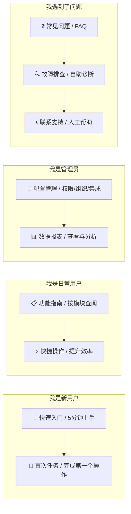
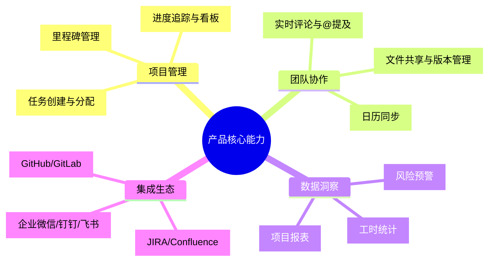
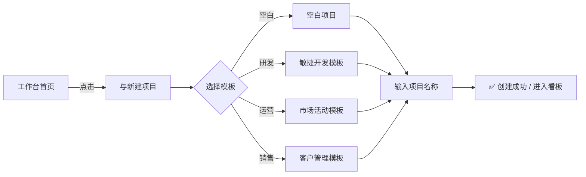
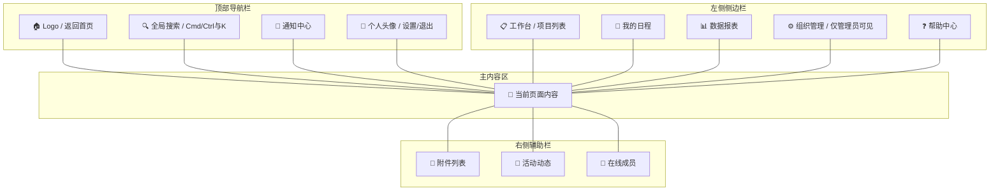
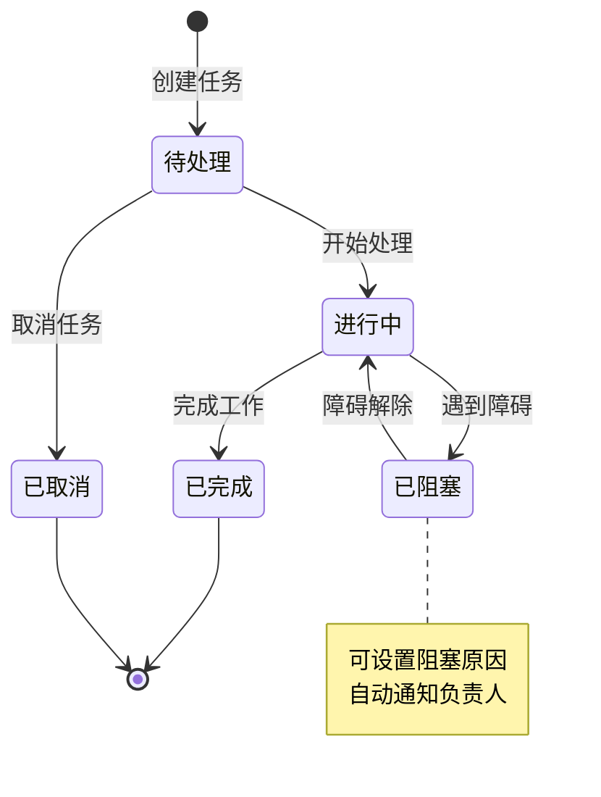
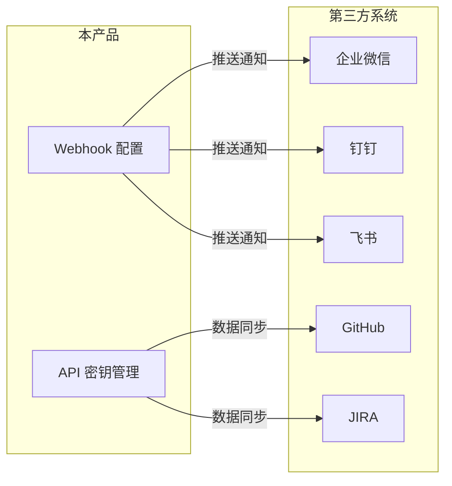
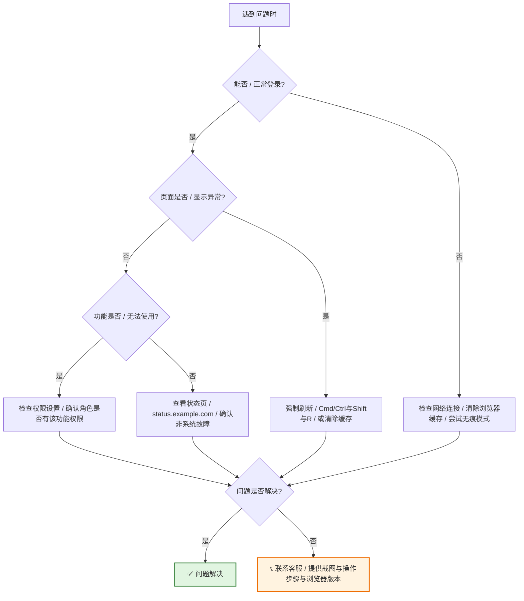

# [产品/系统名称（英文名）] - 用户手册（User Manual）

> **文档状态：** 🟢 已发布 / 🟡 更新中 / 🔴 已归档
>
> **保密级别：** 机密 / 内部公开 / 公开
>
> **版本：** v0.1.1
>
> **日期：** YYYY-MM-DD
>
> **撰写人：** [姓名/角色]
>
> **评审人：** [姓名/角色]
>
> **阅读对象：** [角色列表]
>
> **适用产品版本：** ≥ v[X.Y.Z]
>
> **文档维护团队：** [产品运营 / 用户成功 / 技术写作]
>
> **反馈渠道：** [help@example.com / 在线客服 / 社区论坛]

---

## 0. 文档导读

### 0.1 文档目的与适用范围

[说明本文档的目的、适用场景和不适用场景]

### 0.2 相关文档

| 文档类型 | 文件名 | 相关章节 |
|---------|--------|---------|
| [类型] | [文件名] [行号范围] | [章节描述] |

> **引用格式说明**：关联文档使用 `文件名 行号范围` 格式（如 `【模板】技术需求文档(TRD).md 3-17`），行号随文档更新可能变化，请以实际内容为准。

### 0.3 变更记录

| 版本 | 日期 | 修订人 | 变更内容 | 审核人 |
| :--- | :--- | :--- | :--- | :--- |
| v0.1 | YYYY-MM-DD | [姓名] | 初稿 | [审核人] |
| v0.1.1 | 2026-06-09 | 谢董 | 修复xychart-beta图为表格以兼容飞书渲染 | — |

---

## 1. 快速导航（Quick Navigation）

> 不知道从哪里开始？根据你的角色选择最适合的入口。

| 入口 | 适合谁 | 预计阅读时间 |
| :--- | :--- | :---: |
| [📖 快速入门](#1-快速入门quick-start) | 第一次使用本产品 | 5 min |
| [📋 功能指南](#3-功能指南feature-guides) | 需要了解某个具体功能 | 2-10 min |
| [🔧 管理员配置](#4-管理员指南admin-guide) | 组织管理员、IT 负责人 | 15 min |
| [❓ 常见问题](#5-常见问题faq) | 遇到具体问题需要快速解决 | 1 min |
| [🔍 故障排查](#6-故障排查troubleshooting) | 功能异常、报错信息 | 3 min |

---

## 2. 快速入门（Quick Start）

> **目标：** 在 5 分钟内完成首次核心操作，建立产品基本认知。

### 2.1 产品简介

[产品名称] 是一款 [一句话定位，如：面向中小企业的智能项目管理工具]，帮助你 [核心价值，如：高效协作、追踪进度、提升团队产出]。

**核心能力一览：**

### 2.2 首次使用四步法

#### Step 1：注册与登录

1. 访问 [https://app.example.com](https://app.example.com)
2. 点击右上角 **【注册】** 按钮
3. 选择注册方式：
   - 📧 **邮箱注册**：输入邮箱 → 获取验证码 → 设置密码
   - 🔗 **第三方登录**：支持微信 / 钉钉 / 企业微信扫码一键登录
4. 完成注册后自动进入**工作台首页**

> 💡 **提示：** 建议使用企业邮箱注册，便于后续团队邀请和权限管理。

#### Step 2：创建第一个项目

1. 在工作台首页，点击 **【+ 新建项目】**
2. 选择项目模板：
   - 📋 **空白项目**：从零开始自定义
   - 🚀 **敏捷开发**：适合研发团队
   - 📅 **市场活动**：适合运营团队
   - 📊 **客户管理**：适合销售团队
3. 输入**项目名称**（如："Q3 产品迭代"）
4. 点击 **【创建】**

**预期结果：** 页面自动跳转至项目看板，显示默认的"待处理 / 进行中 / 已完成"三列。

#### Step 3：添加第一个任务

1. 在看板的 **【待处理】** 列，点击 **【+ 添加任务】**
2. 输入任务标题（如："完成需求文档"）
3. （可选）设置：
   - 👤 **负责人**：@自己或团队成员
   - 📅 **截止日期**：选择日期
   - 🏷️ **优先级**：高 / 中 / 低
   - 📝 **描述**：补充任务细节
4. 点击 **【确认】** 或按 `Enter` 键保存

**预期结果：** 任务卡片出现在"待处理"列顶部，带有所设置的标签和负责人头像。

#### Step 4：邀请团队成员

1. 点击页面右上角 **【邀请成员】**
2. 选择邀请方式：
   - 🔗 **复制链接**：发送给同事，点击即可加入
   - 📧 **邮箱邀请**：输入对方邮箱，系统自动发送邀请
   - 📱 **扫码邀请**：展示二维码，对方扫码加入
3. 设置成员**角色权限**：
   - 👑 **管理员**：可管理项目设置和成员权限
   - ✏️ **编辑者**：可创建和编辑任务
   - 👁️ **查看者**：仅可查看，不可编辑
4. 点击 **【发送邀请】**

**预期结果：** 被邀请人收到通知，加入后可在项目中协作。

---

## 3. 界面导览（UI Tour）

> 熟悉产品界面布局，快速定位功能入口。

### 3.1 全局导航结构

### 3.2 图标与符号说明

| 图标 | 含义 | 使用场景 |
| :---: | :--- | :--- |
| ➕ | 新增/创建 | 创建项目、任务、文档 |
| ✏️ | 编辑 | 修改已有内容 |
| 🗑️ | 删除 | 删除项目/任务（可恢复） |
| 🔗 | 分享/复制链接 | 邀请成员、分享任务 |
| ⭐ | 收藏/星标 | 标记重要项目 |
| 🔒 | 私有/锁定 | 仅自己可见或权限受限 |
| ⚙️ | 设置 | 进入配置页面 |
| ❓ | 帮助 | 查看操作提示 |

---

## 4. 功能指南（Feature Guides）

> 按模块详细介绍各功能的使用方法，支持按需查阅。

### 4.1 项目管理

#### 4.1.1 创建与管理项目

**创建项目：**

1. 进入 **【工作台】** → 点击 **【+ 新建项目】**
2. 选择模板或从空白开始
3. 配置项目信息：
   - 项目名称（必填）
   - 项目描述（可选）
   - 项目封面（可选，支持上传图片）
   - 可见范围：🔒 私有 / 👥 团队可见 / 🌐 公开
4. 点击 **【创建】**

**项目设置：**

| 设置项 | 说明 | 操作路径 |
| :--- | :--- | :--- |
| 项目名称 | 修改项目显示名称 | 项目页 → ⚙️ 设置 → 基本信息 |
| 成员管理 | 添加/移除成员，调整权限 | 项目页 → ⚙️ 设置 → 成员 |
| 看板列 | 自定义任务状态列 | 项目页 → ⚙️ 设置 → 看板配置 |
| 自动化规则 | 设置触发器自动执行任务 | 项目页 → ⚙️ 设置 → 自动化 |
| 归档/删除 | 归档后不可编辑，删除后进入回收站 | 项目页 → ⚙️ 设置 → 高级 |

#### 4.1.2 任务管理

**创建任务：**

1. 在看板任意列点击 **【+ 添加任务】** 或按 `N` 键
2. 填写任务信息：
   - **标题**（必填）：一句话描述任务
   - **描述**（可选）：支持 Markdown 格式、@提及、附件
   - **负责人**：可指定多人
   - **截止日期**：支持设置提醒时间
   - **优先级**：🔴 高 / 🟡 中 / 🟢 低
   - **标签**：自定义标签分类
3. 点击 **【保存】**

**批量操作：**

- 按住 `Shift` 或 `Cmd/Ctrl` 多选任务卡片
- 右键菜单支持：批量移动、批量分配负责人、批量设置截止日期、批量删除

#### 4.1.3 看板视图操作

| 操作 | 方式 | 快捷键 |
| :--- | :--- | :--- |
| 移动任务 | 拖拽卡片至目标列 | 鼠标拖拽 |
| 快速编辑 | 双击卡片标题 | `Enter` |
| 展开详情 | 点击卡片 | `Space` |
| 删除任务 | 右键 → 删除 | `Delete` |
| 筛选任务 | 顶部筛选栏 | `/` |
| 搜索任务 | 全局搜索 | `Cmd/Ctrl + K` |

### 4.2 团队协作

#### 4.2.1 @提及与通知

在任务描述、评论中输入 `@` 可提及成员或关联内容：

| 语法 | 效果 | 示例 |
| :--- | :--- | :--- |
| `@张三` | 通知张三 | `@张三 请 review 这个需求` |
| `@所有人` | 通知项目所有成员 | `@所有人 本周五下午复盘` |
| `#任务标题` | 关联其他任务 | `依赖 #需求评审 完成` |
| `!文档名称` | 关联文档 | `参考 !产品PRD` |

#### 4.2.2 文件管理

1. 在任务详情页点击 **【附件】** 标签
2. 上传方式：
   - 📁 **本地上传**：支持拖拽，单文件最大 100MB
   - ☁️ **云盘导入**：支持从企业云盘选择
   - 🔗 **链接添加**：添加外部文档链接
3. 文件操作：
   - 预览：点击图片/文档直接预览
   - 下载：点击下载按钮
   - 版本：上传同名文件自动创建版本历史
   - 删除：仅上传者和管理员可删除

### 4.3 数据报表

#### 4.3.1 查看项目报表

1. 进入项目 → 点击顶部 **【报表】** 标签
2. 选择报表类型：
   - 📊 **燃尽图**：查看迭代进度与剩余工作量
   - 📈 **累积流图**：分析各状态任务数量变化
   - 🥧 **工作量分布**：查看成员任务分配情况
   - ⏱️ **工时统计**：记录与分析实际投入时间
3. 设置时间范围与筛选条件
4. 点击 **【导出】** 可下载 Excel/PDF

> **说明**：xychart-beta为飞书不兼容Mermaid类型，改为表格描述（模板示例数据）。

**燃尽图示例**

| 时间 | 剩余工作量 (h) |
| :--- | :---: |
| Day 1 | 100 |
| Day 3 | 85 |
| Day 5 | 70 |
| Day 7 | 55 |
| Day 10 | 30 |
| Day 14 | 0 |

---

## 5. 管理员指南（Admin Guide）

> 面向组织管理员、IT 负责人的配置与管理说明。

### 5.1 组织设置

**访问路径：** 左侧边栏 → ⚙️ **组织管理**

| 功能 | 说明 | 操作步骤 |
| :--- | :--- | :--- |
| **成员管理** | 邀请/移除成员，设置部门 | 组织管理 → 成员 → 邀请/编辑 |
| **权限模板** | 创建角色权限模板 | 组织管理 → 权限 → 新建模板 |
| **安全设置** | 登录策略、IP 白名单 | 组织管理 → 安全 → 配置 |
| **计费管理** | 查看用量、升级套餐 | 组织管理 → 计费 → 订阅 |

### 5.2 集成配置

**配置企业微信集成：**

1. 组织管理 → 集成 → 企业微信 → **【去配置】**
2. 在企业微信管理后台获取 **CorpID** 和 **AgentID**
3. 填入对应字段，点击 **【验证并保存】**
4. 配置消息推送规则（可选）
5. 成员在企业微信内即可接收通知

---

## 6. 常见问题（FAQ）

> 按场景分类的自助问答，快速解决高频问题。

### 6.1 账号与登录

| 问题 | 解答 |
| :--- | :--- |
| **忘记密码怎么办？** | 登录页点击 **【忘记密码】** → 输入注册邮箱 → 查收重置邮件 → 设置新密码 |
| **如何更换绑定邮箱？** | 个人设置 → 账号安全 → 邮箱 → **【更换】** → 验证新邮箱 |
| **支持多设备同时登录吗？** | 支持，最多 5 台设备。超出后最早登录的设备会自动退出 |
| **如何开启两步验证？** | 个人设置 → 账号安全 → 两步验证 → 绑定 Authenticator App |

### 6.2 功能使用

| 问题 | 解答 |
| :--- | :--- |
| **任务误删如何恢复？** | 项目页 → 回收站 → 找到任务 → **【恢复】**（保留 30 天） |
| **如何批量导出任务？** | 看板页 → 筛选条件 → **【导出】** → 选择格式（Excel/CSV） |
| **能否设置任务重复周期？** | 可以。任务详情 → 截止日期 → **【设置重复】** → 选择周期 |
| **如何关闭邮件通知？** | 个人设置 → 通知偏好 → 取消勾选 **【邮件通知】** |

### 6.3 付费与账单

| 问题 | 解答 |
| :--- | :--- |
| **免费版有什么限制？** | 最多 3 个项目、10 个成员、1GB 存储空间 |
| **如何升级到专业版？** | 组织管理 → 计费 → **【升级套餐】** → 选择方案 → 支付 |
| **支持发票开具吗？** | 支持。计费 → 订单 → **【申请发票】** → 填写开票信息 |
| **如何取消自动续费？** | 计费 → 订阅 → **【管理订阅】** → 关闭自动续费 |

---

## 7. 故障排查（Troubleshooting）

> 遇到报错或功能异常时的自助诊断流程。

### 7.1 自助诊断流程图

### 7.2 常见报错速查

| 报错信息 | 可能原因 | 解决方案 |
| :--- | :--- | :--- |
| **"无权限访问"** | 角色权限不足 / 项目私有 | 联系项目管理员申请权限 |
| **"请求超时"** | 网络不稳定 / 服务端繁忙 | 刷新页面重试，或稍后访问 |
| **"文件上传失败"** | 文件过大 / 格式不支持 | 压缩文件或转换格式后重试 |
| **"保存失败"** | 并发编辑冲突 | 刷新页面，合并修改后重新保存 |
| **"验证码错误"** | 输入超时 / 大小写敏感 | 重新获取验证码，注意大小写 |

### 7.3 联系支持

如果自助排查无法解决问题，请通过以下方式联系我们：

| 渠道 | 响应时间 | 适用场景 |
| :--- | :---: | :--- |
| 💬 **在线客服** | 工作日 9:00-18:00，即时响应 | 一般咨询、功能疑问 |
| 📧 **邮件支持** | 24h 内响应 | 复杂问题、需要附件说明 |
| 📞 **电话热线** | 工作日 9:00-18:00 | 紧急故障、P0 级问题 |
| 🏠 **帮助社区** | 社区用户互助 | 使用技巧、经验分享 |

**提交工单时请提供：**
1. 问题描述（发生了什么）
2. 复现步骤（如何触发）
3. 截图或录屏
4. 浏览器及版本号
5. 账号信息（脱敏处理）

---

## 8. 快捷键大全（Keyboard Shortcuts）

> 掌握快捷键，效率提升 50%。

### 8.1 全局快捷键

| 快捷键 | 功能 |
| :--- | :--- |
| `Cmd/Ctrl + K` | 全局搜索 |
| `Cmd/Ctrl + /` | 打开快捷键帮助 |
| `Cmd/Ctrl + N` | 新建任务 |
| `Esc` | 关闭弹窗/取消操作 |

### 8.2 看板操作

| 快捷键 | 功能 |
| :--- | :--- |
| `↑ ↓ ← →` | 在任务卡片间移动焦点 |
| `Enter` | 打开选中任务详情 |
| `Space` | 快速预览任务 |
| `M` | 移动任务 |
| `D` | 设置截止日期 |
| `L` | 添加标签 |
| `Delete` | 删除任务（需确认） |

### 8.3 文本编辑

| 快捷键 | 功能 |
| :--- | :--- |
| `Cmd/Ctrl + B` | 粗体 |
| `Cmd/Ctrl + I` | 斜体 |
| `Cmd/Ctrl + K` | 插入链接 |
| `@` | 提及成员 |
| `#` | 关联任务 |
| `!` | 关联文档 |

---

## 9. 附录（Appendix）

### 9.1 术语表（Glossary）

| 术语 | 定义 |
| :--- | :--- |
| **工作区（Workspace）** | 一个独立的工作环境，包含多个项目和成员 |
| **看板（Kanban）** | 可视化的任务管理面板，按列展示任务状态 |
| **迭代（Sprint）** | 固定周期（通常 1-2 周）内完成的一组任务 |
| **燃尽图（Burndown Chart）** | 展示迭代中剩余工作量随时间变化的图表 |
| **Webhook** | 一种 HTTP 回调机制，用于系统间实时通知 |

### 9.2 更新日志（Changelog）

| 版本 | 日期 | 更新内容 |
| :--- | :--- | :--- |
| v1.2.0 | 2026-05-20 | 新增自动化规则、优化看板性能 |
| v1.1.0 | 2026-04-15 | 新增企业微信集成、报表导出功能 |
| v1.0.0 | 2026-03-01 | 产品正式上线 |

### 9.3 法律声明

- **隐私政策：** [https://example.com/privacy](https://example.com/privacy)
- **服务条款：** [https://example.com/terms](https://example.com/terms)
- **数据安全：** 我们已通过 ISO 27001 认证，您的数据采用 AES-256 加密存储。

### 9.4 文档反馈

> 发现文档有误或需要补充？欢迎反馈！

- 📧 邮件：[docs-feedback@example.com](mailto:docs-feedback@example.com)
- 💬 社区：[https://community.example.com/docs](https://community.example.com/docs)
- 📝 在线编辑：点击页面右下角 **【编辑此页】** 提交 PR

---

## 10. 文档索引（Index）

> 按字母顺序排列的功能索引，支持快速定位。

| 关键词 | 所在章节 |
| :--- | :--- |
| 项目创建 | [3.1.1](#311-创建与管理项目) |
| 任务管理 | [3.1.2](#312-任务管理) |
| 看板操作 | [3.1.3](#313-看板视图操作) |
| 成员邀请 | [1.2 Step 4](#step-4邀请团队成员) |
| 文件上传 | [3.2.2](#322-文件管理) |
| 报表导出 | [3.3.1](#331-查看项目报表) |
| 权限设置 | [4.1](#41-组织设置) |
| 集成配置 | [4.2](#42-集成配置) |
| 快捷键 | [7](#7-快捷键大全keyboard-shortcuts) |
| 故障排查 | [6](#6-故障排查troubleshooting) |
