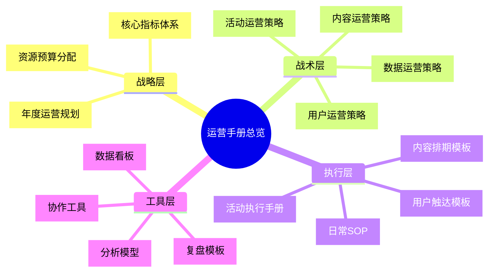
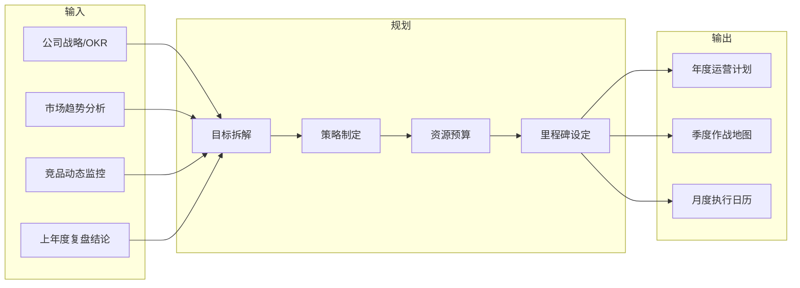
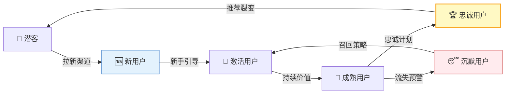
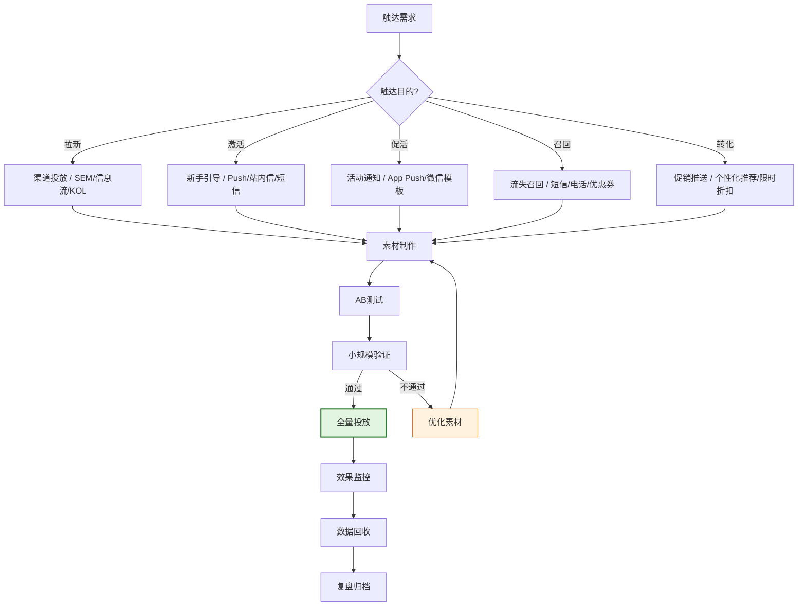
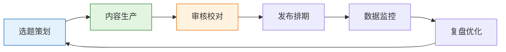
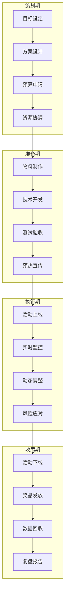
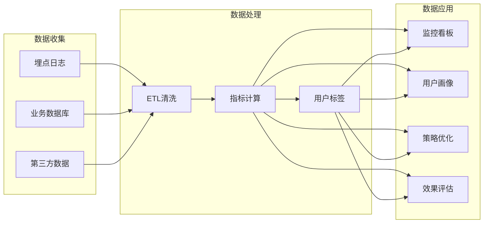
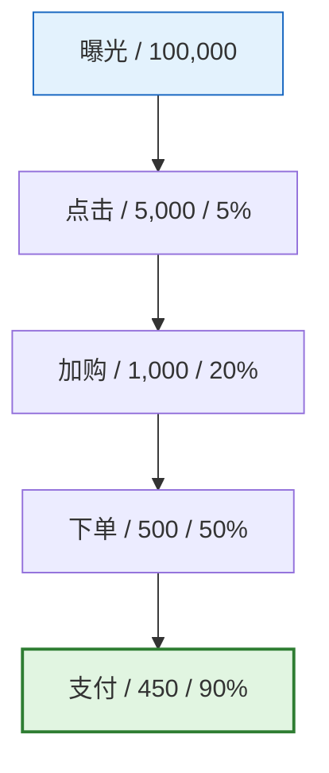
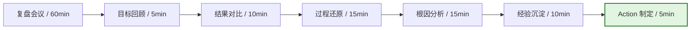

# [产品/系统名称（英文名）] - 运营手册（Operations Manual）

> **文档状态：** 🟢 已生效 / 🟡 评审中 / 🔴 已归档
>
> **保密级别：** 机密 / 内部公开 / 公开
>
> **版本：** v0.1.2
>
> **日期：** YYYY-MM-DD
>
> **撰写人：** [姓名/角色]
>
> **评审人：** [运营总监 / VP]
>
> **阅读对象：** 运营团队 / 产品运营 / 用户运营 / 内容运营 / 活动运营
>
> **维护团队：** [运营中台 / 用户增长部 / 运营策略组]
>
> **更新频率：** 每季度评审，重大策略调整即时更新

---

## 0. 文档导读

### 0.1 文档目的与适用范围

[说明本文档的目的、适用场景和不适用场景]

### 0.2 相关文档

| 文档类型 | 文件名 | 相关章节 |
|---------|--------|---------|
| [类型] | [文件名] [行号范围] | [章节描述] |

> **引用格式说明**：关联文档使用 `文件名 行号范围` 格式（如 `【模板】技术需求文档(TRD).md 3-17`），行号随文档更新可能变化，请以实际内容为准。

### 0.3 变更记录

| 版本 | 日期 | 修订人 | 变更内容 | 审核人 |
| :--- | :--- | :--- | :--- | :--- |
| v0.1 | YYYY-MM-DD | [姓名] | 初稿 | [审核人] |
| v0.1.1 | 2026-06-09 | 谢董 | 修复：quadrantChart 模板改为表格格式（飞书不兼容） | — |
| v0.1.2 | 2026-06-09 | 谢董 | 修复xychart-beta图为表格以兼容飞书渲染 | — |

---

## 1. 执行摘要

> **新同学/管理层 5 分钟导读：** 本手册是什么、解决什么问题、怎么用。

| 要素         | 内容                                                 |
| :----------- | :--------------------------------------------------- |
| **手册定位** | [一句话，如：电商业务线全链路运营标准化操作指南]     |
| **覆盖范围** | 用户运营 / 内容运营 / 活动运营 / 数据运营 / 渠道运营 |
| **核心目标** | [如：统一运营标准、提升人效 30%、降低试错成本]       |
| **关键指标** | DAU / 留存率 / 转化率 / LTV / ROI                    |
| **使用方式** | 按角色选择入口 → 按场景查阅 SOP → 按模板执行         |

---

## 2. 运营战略与规划（Strategy & Planning）

### 2.1 年度运营规划框架

### 2.2 核心指标体系（KPI / OKR）

> 指标必须分层、可量化、可追溯。

| 层级       | 指标类型 | 指标名称 | 定义             | 计算方式             | 目标值             | 监控频率 |
| :--------- | :------- | :------- | :--------------- | :------------------- | :----------------- | :------: |
| **北极星** | 结果指标 | GMV      | 商品交易总额     | Σ(订单实付金额)      | 年增 50%           |    日    |
| **一级**   | 过程指标 | DAU      | 日活跃用户       | 当日登录用户数       | 100万              |    日    |
| **一级**   | 过程指标 | 留存率   | 用户持续使用比例 | N日留存用户/新增用户 | 次日 40% / 7日 25% |    日    |
| **二级**   | 转化指标 | 转化率   | 访客到下单比例   | 下单UV/访问UV        | 3.5%               |    日    |
| **二级**   | 效率指标 | 客单价   | 单笔订单金额     | GMV/订单数           | ¥150               |    日    |
| **二级**   | 效率指标 | ROI      | 投入产出比       | 收入/成本            | ≥ 3                |  活动后  |
| **三级**   | 辅助指标 | 加购率   | 加入购物车比例   | 加购UV/访问UV        | 8%                 |    日    |
| **三级**   | 辅助指标 | 跳失率   | 无交互离开比例   | 跳出UV/访问UV        | < 50%              |    日    |

> **说明**：xychart-beta为飞书不兼容Mermaid类型，改为表格描述（模板示例数据）。

**核心指标监控示例（月度趋势）**

| 周次 | 数值 |
| :--- | :---: |
| W1 | 100 |
| W2 | 105 |
| W3 | 110 |
| W4 | 115 |

---

## 3. 用户运营（User Operations）

### 3.1 用户生命周期运营

### 3.2 用户分层模型（RFM + 生命周期）

| 用户层级           | 定义标准                      | 运营策略                       | 触达频率     | 核心动作              |
| :----------------- | :---------------------------- | :----------------------------- | :----------- | :-------------------- |
| **S级 超级用户**   | 消费 top 1% / 活跃 > 20天/月  | 1v1专属服务、新品内测、VIP社群 | 每周 1-2 次  | 深度访谈、定制权益    |
| **A级 高价值用户** | 消费 top 10% / 活跃 > 15天/月 | 会员权益、专属优惠、生日关怀   | 每周 1 次    | 会员日、积分兑换      |
| **B级 成长用户**   | 有消费 / 活跃 5-15天/月       | 成长任务、品类拓展、复购激励   | 每 3 天 1 次 | 任务体系、优惠券      |
| **C级 新用户**     | 注册 30 天内                  | 新手礼包、引导教程、首单优惠   | 连续 7 天    | 新手任务、 onboarding |
| **D级 沉默用户**   | 30 天未活跃                   | 召回短信、大额优惠券、问卷调研 | 每月 1 次    | 召回活动、流失调研    |
| **R级 流失用户**   | 90 天未活跃                   | 大额激励、电话回访、问卷调研   | 每季度 1 次  | 召回实验、原因分析    |

### 3.3 用户触达 SOP

**触达渠道矩阵：**

| 渠道     | 适用场景          | 触达率 | 打开率 | 成本 | 时效性 |
| :--- | :--- | :---: | :---: | :---: | :---: |
| App Push | 活跃用户促活      |  95%   |  15%   |  低  |  即时  |
| 短信     | 沉默用户召回      |  99%   |   3%   |  中  |  5min  |
| 微信模板 | 已关注用户        |  90%   |   8%   |  低  |  即时  |
| 企业微信 | 高价值用户        |  85%   |  25%   |  低  |  即时  |
| 邮件     | B端用户/长内容    |  80%   |   5%   |  低  |  延迟  |
| 电话     | 超级用户/紧急召回 |  60%   |  80%   |  高  |  即时  |

---

## 4. 内容运营（Content Operations）

### 4.1 内容生产流程

### 4.2 内容排期模板

| 日期  | 渠道   | 内容类型 | 主题             | 负责人 | 状态      | 目标数据  |
| :---- | :----- | :------- | :--------------- | :----- | :-------- | :-------- |
| 05-25 | 公众号 | 干货长文 | 《618 购物攻略》 | 张三   | ✅ 已发布 | 阅读 1w+  |
| 05-26 | 小红书 | 图文笔记 | 《夏日穿搭推荐》 | 李四   | 🟡 审核中 | 点赞 500+ |
| 05-27 | 抖音   | 短视频   | 《产品使用教程》 | 王五   | ⏳ 待拍摄 | 播放 10w+ |
| 05-28 | 站内   | Banner   | 618 主会场       | 赵六   | ✅ 已上线 | CTR 5%    |

### 4.3 内容质量评估标准

| 维度         | 权重 | 评估标准                       | 评分 |
| :--- | :---: | :--- | :---: |
| **选题价值** | 20%  | 是否切中用户痛点/热点/需求     | 1-5  |
| **内容深度** | 25%  | 信息密度、专业度、原创性       | 1-5  |
| **可读性**   | 20%  | 结构清晰、语言流畅、图文搭配   | 1-5  |
| **转化能力** | 20%  | 引导动作明确、CTA 设计合理     | 1-5  |
| **合规安全** | 15%  | 无敏感信息、版权合规、事实准确 | 1-5  |

**内容评分等级：**

- ⭐⭐⭐⭐⭐ (4.5-5.0)：标杆内容，全渠道推广
- ⭐⭐⭐⭐ (4.0-4.4)：优质内容，重点推荐
- ⭐⭐⭐ (3.5-3.9)：合格内容，正常发布
- ⭐⭐ (3.0-3.4)：需优化，修改后发布
- ⭐ (<3.0)：不合格，重新制作

---

## 5. 活动运营（Campaign Operations）

### 5.1 活动策划全流程

### 5.2 活动执行 Checklist

| 阶段     | 检查项                         | 负责人   | 截止时间 | 状态 |
| :------- | :----------------------------- | :------- | :------- | :--- |
| **策划** | 活动目标与 KPI 已确认          | 运营经理 | T-14d    | ☐    |
| **策划** | 活动方案通过评审               | 运营经理 | T-10d    | ☐    |
| **策划** | 预算已审批                     | 财务 BP  | T-10d    | ☐    |
| **准备** | 活动页面 UI 设计完成           | 设计师   | T-7d     | ☐    |
| **准备** | 活动页面前端开发完成           | 前端     | T-5d     | ☐    |
| **准备** | 后端接口与奖品逻辑开发完成     | 后端     | T-5d     | ☐    |
| **准备** | 测试用例通过（功能/性能/兼容） | QA       | T-3d     | ☐    |
| **准备** | 预热素材已制作并审核通过       | 内容运营 | T-3d     | ☐    |
| **准备** | 客服话术与 FAQ 已培训          | 客服     | T-1d     | ☐    |
| **执行** | 活动准时上线                   | SRE      | T+0      | ☐    |
| **执行** | 监控大盘已配置                 | 数据     | T+0      | ☐    |
| **执行** | 每日数据日报已发送             | 数据     | T+1~T+N  | ☐    |
| **收尾** | 奖品已全部发放完毕             | 运营     | T+3d     | ☐    |
| **收尾** | 活动复盘报告已提交             | 运营经理 | T+7d     | ☐    |

### 5.3 活动风险预案

| 风险类型     | 触发条件         | 应对措施                       | 责任人 |
| :----------- | :--------------- | :----------------------------- | :----- |
| **流量过载** | QPS 超过容量 80% | 启动限流 / 扩容 / 排队机制     | SRE    |
| **奖品超发** | 奖品库存 < 10%   | 紧急补货 / 替换奖品 / 提前下线 | 运营   |
| **作弊刷单** | 异常账号集中参与 | 风控拦截 / 人工审核 / 取消资格 | 风控   |
| **页面 Bug** | 核心流程阻断     | 热修复 / 回滚 / 降级为 H5      | 技术   |
| **舆情危机** | 社交媒体负面集中 | 公关介入 / 官方声明 / 补偿方案 | 公关   |

---

## 6. 数据运营（Data Operations）

### 6.1 数据分析框架

### 6.2 日常数据监控 SOP

| 时段           | 动作                 | 关注指标                           | 异常处理                    |
| :------------- | :------------------- | :--------------------------------- | :-------------------------- |
| **每日 9:00**  | 查看昨日核心数据日报 | DAU / GMV / 转化率 / 留存          | 异常波动 > ±20% 立即排查    |
| **每日 11:00** | 检查实时数据大盘     | 实时 GMV / 订单量 / 流量           | 趋势异常立即告警            |
| **每周一**     | 输出周度运营周报     | 周环比 / 周同比 / 目标完成率       | 落后目标 > 10% 制定追赶计划 |
| **每月 1 日**  | 输出月度运营月报     | 月度目标达成 / 成本分析 / 用户增长 | 月度复盘会议                |
| **每季度**     | 输出季度运营复盘     | 季度 OKR / ROI / 策略有效性        | 季度规划会议                |

### 6.3 核心分析模型

| 模型             | 适用场景       | 关键指标                         |
| :--------------- | :------------- | :------------------------------- |
| **漏斗分析**     | 转化路径优化   | 曝光 → 点击 → 加购 → 下单 → 支付 |
| ** cohort 分析** | 用户留存评估   | 同期群留存率、LTV                |
| **RFM 模型**     | 用户分层运营   | 最近消费时间、消费频次、消费金额 |
| **AARRR**        | 全链路增长分析 | 获客、激活、留存、收入、推荐     |
| **归因分析**     | 渠道效果评估   | 首次触点、末次触点、线性归因     |

---

## 7. 渠道运营（Channel Operations）

### 7.1 渠道矩阵管理

> **说明**：此象限图模板已转为表格描述。

<!--
原 quadrantChart 结构参考：
- title: 渠道价值矩阵（获客成本 vs 用户质量）
- x-axis: "低获客成本" --> "高获客成本"
- y-axis: "低用户质量" --> "高用户质量"
- quadrant-1: 明星渠道（高质/低成本）
- quadrant-2: 潜力渠道（高质/高成本）
- quadrant-3: 低效渠道（低质/低成本）
- quadrant-4: 淘汰渠道（低质/高成本）
- 数据点: "自然搜索": [0.2, 0.8]; "老带新裂变": [0.15, 0.9]; "信息流广告": [0.7, 0.6]; "KOL合作": [0.6, 0.7]; "地推": [0.8, 0.4]; "短信营销": [0.1, 0.3]
-->

| 象限 | 区域特征 | 策略建议 |
| :--- | :--- | :--- |
| 象限1（低成本·高质量） | 明星渠道（高质/低成本） | 加大投入，扩大规模 |
| 象限2（高成本·高质量） | 潜力渠道（高质/高成本） | 优化效率，降低获客成本 |
| 象限3（低成本·低质量） | 低效渠道（低质/低成本） | 评估是否值得继续投入 |
| 象限4（高成本·低质量） | 淘汰渠道（低质/高成本） | 逐步缩减，转向高效渠道 |

| 名称 | X值 | Y值 | 象限 |
| :--- | :---: | :---: | :--- |
| 自然搜索 | 0.2 | 0.8 | 象限1（明星渠道） |
| 老带新裂变 | 0.15 | 0.9 | 象限1（明星渠道） |
| 信息流广告 | 0.7 | 0.6 | 象限2（潜力渠道） |
| KOL合作 | 0.6 | 0.7 | 象限2（潜力渠道） |
| 地推 | 0.8 | 0.4 | 象限4（淘汰渠道） |
| 短信营销 | 0.1 | 0.3 | 象限3（低效渠道） |

### 7.2 渠道运营 SOP

| 渠道          | 日常动作                       | 监控指标                   | 优化方向                 |
| :------------ | :----------------------------- | :------------------------- | :----------------------- |
| **App Store** | 关键词优化、评论维护、版本更新 | 下载量、评分、关键词排名   | 提升转化率、降低获客成本 |
| **信息流**    | 素材迭代、定向优化、出价调整   | CTR、CVR、CPA、ROI         | 精准定向、创意优化       |
| **私域社群**  | 内容推送、互动活动、用户答疑   | 活跃度、转化率、复购率     | 精细化分层、个性化触达   |
| **KOL 合作**  | 达人筛选、内容审核、效果追踪   | CPE、CPM、带货 GMV         | 达人匹配度、内容质量     |
| **线下地推**  | 点位选择、物料准备、人员培训   | 单点成本、转化率、覆盖人数 | 点位优化、话术迭代       |

---

## 8. 复盘与迭代（Review & Iteration）

### 8.1 复盘会议模板

### 8.2 复盘报告模板

| 模块            | 内容                             |
| :-------------- | :------------------------------- |
| **背景**        | 项目/活动背景、目标、时间范围    |
| **目标达成**    | 核心指标实际值 vs 目标值，完成率 |
| **关键成果**    | 3-5 条核心成果，带数据           |
| **问题与根因**  | 未达预期的问题，5Why 根因分析    |
| **经验与教训**  | 可复用的经验、需避免的坑         |
| **改进 Action** | 具体改进项、Owner、Deadline      |

### 8.3 Action 跟踪表

| Action ID | 改进项                       | 负责人 | 截止时间   | 状态      | 验证标准           |
| :-------- | :--------------------------- | :----- | :--------- | :-------- | :----------------- |
| ACT-001   | 优化新手引导流程，提升激活率 | 张三   | 2026-06-15 | 🟡 进行中 | 激活率从 25% → 35% |
| ACT-002   | 增加 Push 频次，提升 DAU     | 李四   | 2026-06-10 | ⏳ 待启动 | DAU +10%           |
| ACT-003   | 优化落地页，提升转化率       | 王五   | 2026-06-20 | ✅ 已完成 | 转化率从 2% → 3%   |

---

## 9. 工具与资源（Tools & Resources）

### 9.1 运营工具清单

| 类别           | 工具名称                       | 用途                   | 负责人   |
| :------------- | :----------------------------- | :--------------------- | :------- |
| **数据分析**   | 神策 / GrowingIO / 自建 BI     | 用户行为分析、漏斗分析 | 数据团队 |
| **AB 测试**    | 火山引擎 / 腾讯 AB / 自建      | 实验设计、效果评估     | 增长团队 |
| **自动化营销** | 阿里云智能导购 / 自建 MA       | 用户分层、自动触达     | 用户运营 |
| **内容管理**   | 飞书文档 / Notion / Confluence | 内容生产、协作、沉淀   | 内容运营 |
| **项目管理**   | JIRA / 飞书项目 / 禅道         | 需求管理、进度跟踪     | 运营经理 |
| **设计协作**   | Figma / 蓝湖 / MasterGo        | UI 设计、切图、标注    | 设计师   |

### 9.2 常用模板库

| 模板名称         | 适用场景     | 链接   |
| :--------------- | :----------- | :----- |
| 活动策划方案模板 | 大型活动筹备 | [链接] |
| 数据日报模板     | 日常数据监控 | [链接] |
| 用户调研问卷模板 | 用户研究     | [链接] |
| 竞品分析模板     | 市场分析     | [链接] |
| 复盘报告模板     | 项目复盘     | [链接] |

---

## 10. 附录（Appendix）

### 10.1 术语表（Glossary）

| 术语       | 定义                                             |
| :--------- | :----------------------------------------------- |
| **DAU**    | Daily Active Users，日活跃用户                   |
| **MAU**    | Monthly Active Users，月活跃用户                 |
| **LTV**    | Life Time Value，用户生命周期价值                |
| **CAC**    | Customer Acquisition Cost，用户获取成本          |
| **GMV**    | Gross Merchandise Volume，商品交易总额           |
| **ROI**    | Return on Investment，投入产出比                 |
| **Cohort** | 同期群，同一时间窗口内具有共同特征的用户群       |
| **RFM**    | Recency / Frequency / Monetary，用户价值分析模型 |

### 10.2 关联文档

| 文档                | 编号           | 链接   |
| :------------------ | :------------- | :----- |
| 产品需求文档（PRD） | PRD-2026-XXX   | [链接] |
| 用户手册            | UM-2026-XXX    | [链接] |
| 数据字典            | DD-2026-XXX    | [链接] |
| 品牌规范手册        | BRAND-2026-XXX | [链接] |

## 11. 手册审批签核（Manual Sign-off）

| 角色           | 姓名 | 签字 | 日期 | 意见                   |
| :--- | :--- | :---: | :---: | :--- |
| **运营总监**   |      |      |      | [批准 / 驳回 / 需补充] |
| **产品负责人** |      |      |      | [产品侧确认]           |
| **数据负责人** |      |      |      | [指标定义确认]         |
| **技术负责人** |      |      |      | [工具/系统支持确认]    |
| **财务 BP**    |      |      |      | [预算/成本确认]        |
