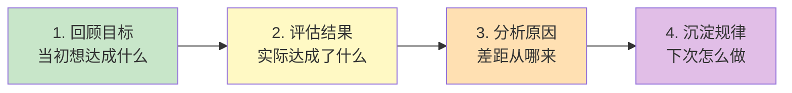
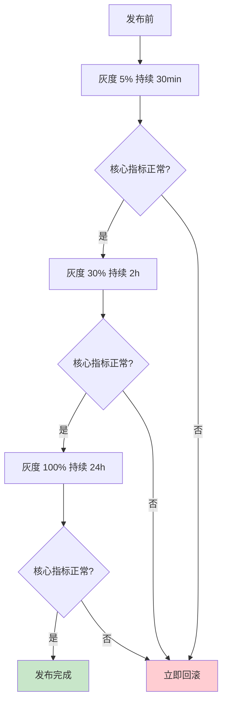

# [项目/事件名称] - 复盘报告（Retrospective）

> **文档状态：** 🟡 评审中 / 🟢 已归档 / 🔴 重做
>
> **保密级别：** 机密 / 内部公开
>
> **版本：** v1.0.0
>
> **日期：** YYYY-MM-DD
>
> **复盘时间：** YYYY-MM-DD HH:MM ~ HH:MM
>
> **复盘地点：** {会议室 / 线上会议链接}
>
> **复盘主持：** [姓名/角色]
>
> **记录人：** [姓名/角色]
>
> **参与人：** [姓名1（角色1）、姓名2（角色2）、...]
>
> **复盘类型：** 🟢 项目交付复盘 / 🟡 事件复盘 / 🔴 故障复盘 / ⚪ 定期复盘
>
> **关联文档：** [Charter / PRD / 事故报告 / 时间线]

---

## 0. 文档导读

### 0.1 文档目的与适用范围

**复盘回答**："当初想达成什么、实际达成了什么、差距从哪来、下次怎么不重蹈覆辙"——把一次性经验沉淀为可复用资产。

**方法论基础**：复盘四步法（参考 kueiku 工作方法论）



**适用场景：**

- ✅ 项目交付后的学习沉淀（项目复盘）
- ✅ 线上故障 / 事故的根因分析（事件复盘）
- ✅ 阶段性总结（季度 / 半年 / 年度复盘）
- ✅ 关键决策回看（重大决策复盘）
- ❌ 甩锅大会（追责请走绩效流程）
- ❌ 流水账汇报（请用周报月报）

### 0.2 复盘原则

| 原则             | 说明                                                    |
| :--------------- | :------------------------------------------------------ |
| **对事不对人**   | 讨论行为与决策，不评价个人                               |
| **数据驱动**     | 用数据说话，避免"我感觉""差不多"                         |
| **开放透明**     | 鼓励暴露问题，不藏不掖                                   |
| **面向未来**     | 重点在"下次怎么做"，而非"当初谁错了"                    |
| **闭环验证**     | 改进动作必须可执行、可追踪、可验证                       |

### 0.3 相关文档

| 文档类型 | 文件名              | 相关章节   |
| :------- | :------------------ | :--------- |
| [类型]   | [文件名] [行号范围] | [章节描述] |

> **引用格式说明**：关联文档使用 `文件名 行号范围` 格式，行号随文档更新可能变化，请以实际内容为准。

### 0.4 变更记录

| 版本   | 日期       | 修订人 | 变更内容                       | 审核人   |
| :----- | :--------- | :----- | :----------------------------- | :------- |
| v0.1   | YYYY-MM-DD | [姓名] | 初稿：四步法骨架               | [姓名]   |
| v0.2   | YYYY-MM-DD | [姓名] | 补充改进动作 + 责任人           | [姓名]   |
| v1.0   | YYYY-MM-DD | [姓名] | 评审通过，归档                  | [Owner]  |

---

## 1. 复盘概述（Overview）

> **5 秒说清：** 这是什么复盘、范围多大、关键结论是什么。

| 要素             | 内容                                                            |
| :--------------- | :-------------------------------------------------------------- |
| **复盘对象**     | [如：用户中心 v2.0 项目 / 2026-06 订单超时故障 / Q2 季度]       |
| **复盘范围**     | [如：从 2026-04-01 立项到 2026-06-30 上线 / 故障影响时段]       |
| **关键结论**     | [一句话总结，如：目标达成 80%，主要差距在性能与文档]            |
| **核心改进**     | [一句话总结，如：3 项 P0 改进，2 项 P1 SOP 沉淀]                |
| **风险等级**     | 🟢 低 / 🟡 中 / 🔴 高                                            |

---

## 2. 目标回顾（Review Goals）

> **方法论**：回到当初的设定，不要用今天的认知篡改历史目标。引用原始文档，标注来源。

### 2.1 当初设定的目标

| 目标类型     | 目标描述                                  | 量化指标                          | 来源文档           |
| :----------- | :---------------------------------------- | :-------------------------------- | :----------------- |
| **商业目标** | [如：提升付费转化率]                     | [如：转化率从 5% → 8%]            | BRD §3.2           |
| **用户目标** | [如：缩短任务完成耗时]                   | [如：单任务耗时从 30min → 10min]  | PRD §1.2           |
| **技术目标** | [如：提升系统可用性]                     | [如：SLO ≥ 99.95%]                | TRD §4.1           |
| **能力目标** | [如：团队掌握 Rust 异步开发]             | [如：≥ 3 人独立交付模块]          | Charter §5         |

### 2.2 目标优先级与约束

- **核心目标**（不可妥协）：[如：上线时间、安全合规]
- **次要目标**（可调整）：[如：性能优化幅度、用户满意度]
- **关键约束**：[如：人力 ≤ 5 人 / 预算 ≤ ¥50万 / 周期 ≤ 8 周]

### 2.3 当初的假设

> **重要**：复盘假设而非目标本身。假设错了，目标再准也没用。

| 假设 ID | 假设内容                              | 验证方式                  | 假设来源            |
| :------ | :------------------------------------ | :------------------------ | :------------------ |
| A-001   | [如：用户日均使用 ≥ 3 次]            | [如：种子用户调研]        | MRD §4.2            |
| A-002   | [如：第三方 API 稳定性 ≥ 99.9%]      | [如：SLA 协议]            | TRD §2.1            |
| A-003   | [如：团队 Rust 经验足以应对]         | [如：技术评估]            | Charter §6          |

---

## 3. 结果评估（Evaluate Results）

> **方法论**：用数据说话，逐项对照目标，标注差距。不粉饰、不夸大。

### 3.1 目标达成情况

| 目标         | 目标值            | 实际值            | 达成率  | 差距分析               | 评估     |
| :----------- | :---------------- | :---------------- | :-----: | :--------------------- | :------- |
| 付费转化率   | 8%                | 6.5%              | 81%     | [一句话说明]           | 🟡 部分  |
| 任务耗时     | 10min             | 12min             | 83%     | [一句话说明]           | 🟡 部分  |
| SLO          | 99.95%            | 99.92%            | 99.97%  | [一句话说明]           | 🟡 部分  |
| 团队能力     | 3 人独立交付      | 2 人独立 + 1 协助 | 67%     | [一句话说明]           | 🔴 未达  |

### 3.2 量化指标对比

```mermaid
xychart-beta
    title "目标 vs 实际 关键指标对比"
    x-axis ["转化率", "耗时(min)", "SLO(%)", "团队(人)"]
    y-axis "数值" 0 --> 100
    bar [8, 10, 99.95, 3]
    bar [6.5, 12, 99.92, 2]
```



> **说明**：如渲染环境不支持 xychart-beta，请用下表替代。

| 指标        | 目标    | 实际    | 偏差         |
| :---------- | :------ | :------ | :----------- |
| 转化率(%)   | 8.0     | 6.5     | -1.5         |
| 耗时(min)   | 10.0    | 12.0    | +2.0         |
| SLO(%)      | 99.95   | 99.92   | -0.03        |
| 团队(人)    | 3.0     | 2.0     | -1.0         |

### 3.3 时间线回顾

| 时间点        | 计划里程碑         | 实际完成           | 偏差        | 原因                  |
| :------------ | :----------------- | :----------------- | :---------- | :-------------------- |
| 2026-04-15    | 需求评审完成       | 2026-04-18         | +3 天       | [如：需求变更 2 次]   |
| 2026-05-15    | 开发完成           | 2026-05-22         | +7 天       | [如：第三方联调阻塞]  |
| 2026-06-15    | 测试完成           | 2026-06-18         | +3 天       | [如：回归 Bug 12 个]  |
| 2026-06-30    | 上线               | 2026-06-30         | 准时        | —                     |

### 3.4 超预期 / 低于预期

| 类别         | 事项                              | 说明                          |
| :----------- | :-------------------------------- | :---------------------------- |
| **超预期** ✅ | [如：CDN 加速使首屏时间再降 30%]  | [量化数据]                    |
| **超预期** ✅ | [如：自动化测试覆盖率 85% > 80%]  | [量化数据]                    |
| **低于预期** ⚠️ | [如：用户满意度 NPS 仅 45]      | [量化数据]                    |
| **低于预期** ⚠️ | [如：3 个 P1 Bug 上线后发现]    | [量化数据]                    |

---

## 4. 原因分析（Analyze Causes）

> **方法论**：区分"做得好的"和"做得不好的"，对后者用 5-Whys 追根因。**对事不对人**。

### 4.1 做得好的（Keep）

> **保留与延续**：哪些做法有效，应该固化下来。

| # | 做法描述                                  | 效果                          | 建议固化方式            |
| :-: | :---------------------------------------- | :---------------------------- | :---------------------- |
| 1 | [如：每日 15 分钟站会同步阻塞]            | [如：阻塞平均解决时间 ≤ 4h]   | [如：写入团队 SOP]      |
| 2 | [如：PR 必须含单元测试]                   | [如：回归 Bug 率 -40%]        | [如：CI 强制门禁]       |
| 3 | [如：关键决策有 ADR 记录]                 | [如：决策追溯 0 阻塞]         | [如：模板化 ADR 流程]   |

### 4.2 做得不好的（Problem）

> **改进与解决**：哪些做法无效或有害，需要改变。

| # | 问题描述                                  | 影响                          | 严重度    |
| :-: | :---------------------------------------- | :---------------------------- | :-------- |
| 1 | [如：需求评审未邀请测试，导致后期返工]    | [如：测试阶段延长 5 天]       | 🔴 高     |
| 2 | [如：第三方 API 联调未提前预约]           | [如：开发阶段阻塞 3 天]       | 🟡 中     |
| 3 | [如：灰度比例跳跃 5% → 50%]              | [如：异常流量放大 10x]        | 🟡 中     |

### 4.3 根因分析（5-Whys）

> **对每个 🔴 高严重度问题，必须用 5-Whys 追到根因。**

#### Problem #1：需求评审未邀请测试

```text
Why 1：为什么测试阶段延长 5 天？
  → 因为有 12 个回归 Bug 在测试末期才被发现。
Why 2：为什么末期才发现？
  → 因为测试用例在开发完成后才编写，未能提前介入。
Why 3：为什么测试用例晚写？
  → 因为测试同学未参加需求评审，对需求理解滞后。
Why 4：为什么未参加需求评审？
  → 因为评审流程未将测试列为必选参与方。
Why 5：为什么流程未规定？（根因）
  → 因为没有项目流程 SOP，依赖 PM 个人习惯邀请。
```

**根因**：缺乏项目流程 SOP，关键角色参与依赖个人习惯。

**改进方向**：制定项目流程 SOP，明确各阶段必选参与方。

#### Problem #2：第三方 API 联调未提前预约

```text
Why 1：为什么开发阶段阻塞 3 天？
  → 因为第三方 API 测试环境不可用。
Why 2：为什么不可用？
  → 因为未提前申请测试账号与配额。
Why 3：为什么未提前申请？
  → 因为项目排期未包含"外部依赖对接"前置任务。
Why 4：为什么未包含？
  → 因为排期模板缺少"外部依赖"检查项。
Why 5：为什么排期模板缺这项？（根因）
  → 因为排期模板从未经过复盘优化。
```

**根因**：排期模板缺少外部依赖检查项，未经过复盘优化。

**改进方向**：更新排期模板，新增"外部依赖"必填检查项。

### 4.4 假设验证

> **回到 §2.3 的假设，逐项验证是否成立。**

| 假设 ID | 假设内容                       | 实际情况                       | 是否成立  | 影响                  |
| :------ | :----------------------------- | :----------------------------- | :-------: | :-------------------- |
| A-001   | 用户日均使用 ≥ 3 次            | 实际 1.8 次                    | ❌ 不成立 | 转化率未达目标的根因  |
| A-002   | 第三方 API 稳定性 ≥ 99.9%      | 实际 99.5%                     | ❌ 不成立 | SLO 未达目标          |
| A-003   | 团队 Rust 经验足以应对         | 实际 2 人独立 + 1 人需协助     | ⚠️ 部分  | 开发周期延长          |

---

## 5. 规律沉淀（Distill Patterns）

> **方法论**：把一次性经验提炼为可复用的方法论 / SOP / 检查清单。**没沉淀的复盘 = 没复盘**。

### 5.1 可复用经验

| # | 经验描述                                  | 适用场景                      | 资产化形式              |
| :-: | :---------------------------------------- | :---------------------------- | :---------------------- |
| 1 | [如：关键决策必须有 ADR 记录]             | 所有 ≥ 1 周项目               | [如：ADR 模板]          |
| 2 | [如：灰度比例按 5% → 30% → 100% 三段]    | 所有面向 C 端的发布           | [如：发布 SOP]          |
| 3 | [如：第三方依赖必须前置 1 周对接]         | 含外部依赖项目                | [如：排期检查清单]      |

### 5.2 踩坑记录

| # | 坑描述                                    | 触发条件                      | 避坑方法                |
| :-: | :---------------------------------------- | :---------------------------- | :---------------------- |
| 1 | [如：灰度跳跃过大导致异常放大]           | 灰度比例 > 30% 跳跃           | [如：单次跳跃 ≤ 25%]    |
| 2 | [如：测试末期发现大量回归 Bug]            | 测试用例晚于开发完成          | [如：TDD / 测试左移]    |
| 3 | [如：第三方 API 配额不足导致限流]         | 未提前申请配额                | [如：排期含配额申请]    |

### 5.3 SOP 提炼

> **从本次复盘提炼的标准操作流程**，写入团队知识库。

#### SOP-001：项目发布灰度流程



**关键约束：**

- 单次灰度比例跳跃 ≤ 25%
- 每阶段持续时长 ≥ 上阶段的 2 倍
- 回滚触发条件：错误率 > 1% 或 P99 > 阈值

### 5.4 检查清单

> **下次项目启动前必查的清单**，避免重蹈覆辙。

- [ ] 排期模板包含"外部依赖对接"前置任务
- [ ] 需求评审邀请测试参与
- [ ] 关键决策有 ADR 记录
- [ ] 灰度方案按 SOP-001 执行
- [ ] 假设清单经过验证（不可拍脑袋）
- [ ] 团队能力评估与目标匹配

---

## 6. 改进动作（Action Items）

> **改进动作必须 SMART**：具体、可衡量、可达成、相关、有截止时间。**无责任人的动作 = 不存在的动作**。

### 6.1 改进动作清单

| ID    | 优先级 | 改进动作                                  | 责任人    | 截止时间   | 验收标准                  | 状态    |
| :---- | :----: | :---------------------------------------- | :-------- | :--------- | :------------------------ | :------ |
| A-001 | P0     | 制定项目流程 SOP，明确各阶段必选参与方    | [PM]      | YYYY-MM-DD | SOP 文档评审通过          | ⚪ 待办 |
| A-002 | P0     | 更新排期模板，新增"外部依赖"检查项        | [PM]      | YYYY-MM-DD | 模板更新并应用到下个项目  | ⚪ 待办 |
| A-003 | P1     | 制定 ADR 模板与流程                       | [架构师]  | YYYY-MM-DD | 模板归档 + 团队培训完成   | ⚪ 待办 |
| A-004 | P1     | 灰度 SOP-001 团队培训                     | [SRE]     | YYYY-MM-DD | 培训完成 + 考核通过率 100%| ⚪ 待办 |
| A-005 | P2     | 建立第三方 API 健康度看板                 | [SRE]     | YYYY-MM-DD | 看板上线 + 告警接入       | ⚪ 待办 |

### 6.2 改进动作追踪

- **追踪机制**：每周站会同步进度，每月 Review 一次
- **责任人职责**：按期完成 + 主动暴露阻塞 + 验收前提供证据
- **升级机制**：超期未完成 → 升级到 Owner → 必要时调整资源

### 6.3 长期能力建设

| 能力项         | 现状                  | 目标                  | 路径                            | 责任人    |
| :------------- | :-------------------- | :-------------------- | :------------------------------ | :-------- |
| Rust 异步开发  | 2 人独立 + 1 协助     | 4 人独立              | 内训 + 实战项目                  | [TL]      |
| 灰度发布规范   | 经验式                | SOP 化                | 完成 SOP-001 + 培训              | [SRE]     |
| 假设驱动决策   | 拍脑袋                | 数据验证              | 建立 A/B 测试能力 + 决策模板     | [PM]      |

---

## 7. 附录（Appendix）

### 7.1 完整时间线

| 时间             | 事件                              | 决策人    | 影响                  |
| :--------------- | :-------------------------------- | :-------- | :-------------------- |
| 2026-04-01 10:00 | 项目启动会                        | [Owner]   | 立项                  |
| 2026-04-15 14:00 | 需求评审                          | [PM]      | 需求基线              |
| 2026-05-22 18:00 | 开发完成（延期 7 天）             | [TL]      | 测试周期压缩          |
| 2026-06-30 22:00 | 上线                              | [Owner]   | 准时上线              |

### 7.2 数据资产归档

| 资产类型     | 位置                              | 保留期限    | 责任人    |
| :----------- | :-------------------------------- | :---------- | :-------- |
| 项目文档     | {Wiki 链接}                       | 永久        | [PM]      |
| 代码仓库     | {Git 仓库}                        | 永久        | [TL]      |
| 监控数据     | {Grafana 链接}                    | 1 年        | [SRE]     |
| 事故报告     | {事后报告链接}                    | 3 年        | [SRE]     |
| 用户调研     | {调研报告链接}                    | 2 年        | [PM]      |

### 7.3 参与人反馈

> **复盘后匿名收集**：本次复盘是否达成目的？哪些可以改进？

| 维度             | 评分（1-5） | 建议                          |
| :--------------- | :----------: | :---------------------------- |
| 目标达成         |              |                               |
| 参与度           |              |                               |
| 结论可执行性     |              |                               |
| 时间安排         |              |                               |
| 主持能力         |              |                               |

### 7.4 术语表

| 术语    | 英文                | 释义                          |
| :------ | :------------------ | :---------------------------- |
| ADR     | Architecture Decision Record | 架构决策记录          |
| SOP     | Standard Operating Procedure | 标准操作流程          |
| SLO     | Service Level Objective      | 服务等级目标          |
| 5-Whys  | 5 Whys               | 五问根因分析法                 |
| KPT     | Keep / Problem / Try | 保留 / 问题 / 尝试             |

### 7.5 参考文献

1. 邱昭良. (2020). _复盘 +：把经验转化为能力_. 机械工业出版社.
2. Eric Ries. (2011). _The Lean Startup_. Crown Business.
3. Derby, E., & Larsen, D. (2006). _Agile Retrospectives_. Pragmatic Bookshelf.

---

## 📌 复盘报告撰写 Checklist

- [ ] §0 文档导读：目的 / 原则 / 相关文档 / 变更记录
- [ ] §1 复盘概述：复盘对象 / 范围 / 关键结论 / 风险等级
- [ ] §2 目标回顾：≥ 3 类目标 + 量化指标 + 来源文档 + 假设清单
- [ ] §3 结果评估：目标达成率 + 时间线 + 超预期 / 低于预期
- [ ] §4 原因分析：Keep / Problem / 5-Whys 根因 / 假设验证
- [ ] §5 规律沉淀：可复用经验 + 踩坑记录 + SOP + 检查清单
- [ ] §6 改进动作：SMART 清单 + 责任人 + 截止时间 + 追踪机制
- [ ] §7 附录：时间线 + 资产归档 + 参与人反馈 + 术语
- [ ] 对事不对人，不追责个人
- [ ] 数据驱动，避免"我感觉"
- [ ] 每个 Problem 有根因分析
- [ ] 每个改进动作有责任人 + 截止时间 + 验收标准
- [ ] 关联文档链接完整
