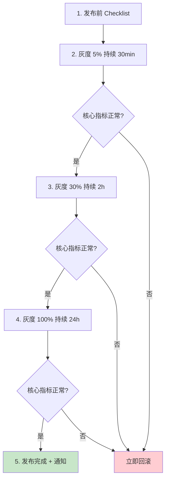
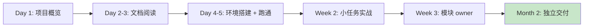

# [项目/系统名称] - 知识沉淀（Knowledge Base）

> **文档状态：** 🟢 持续维护 / 🟡 评审中 / 🔴 已归档
>
> **保密级别：** 机密 / 内部公开
>
> **版本：** v1.0.0
>
> **日期：** YYYY-MM-DD
>
> **撰写人：** [项目 Owner / 知识管理员]
>
> **评审人：** [TL / 架构师]
>
> **阅读对象：** 团队成员、新人、跨团队协作方、继任者
>
> **维护频率：** 每月评审，新经验即时沉淀
>
> **关联文档：** [复盘报告](./【模板】复盘报告.md) / [运营手册](../运营层/【模板】运营手册.md) / [TRD](../技术层/【模板】技术需求文档(TRD).md)

---

## 0. 文档导读

### 0.1 文档目的与适用范围

**知识沉淀回答**："项目跑完了，哪些经验必须留下、哪些坑不能再踩、哪些做法要变成 SOP"——把个人 / 团队的隐性知识转化为组织资产。

**与复盘报告的区别：**

| 维度     | 复盘报告               | 知识沉淀                          |
| :------- | :--------------------- | :-------------------------------- |
| **时间** | 单次项目 / 事件后      | 项目全周期 + 持续维护             |
| **视角** | 目标 vs 结果 vs 原因   | 经验 / 坑 / 最佳实践 / SOP        |
| **目的** | 学到下次怎么不做错     | 让任何人能复用、不重复踩坑        |
| **生命周期** | 一次性归档          | Living document，持续更新         |

**适用场景：**

- ✅ 项目交付后的核心经验固化
- ✅ 新人入职培训材料
- ✅ 跨团队知识传递
- ✅ SOP / 检查清单 / 反模式沉淀
- ❌ 流水账式项目记录（请用周报月报）
- ❌ 个人绩效总结（请走绩效流程）

### 0.2 沉淀原则

| 原则             | 说明                                                    |
| :--------------- | :------------------------------------------------------ |
| **可复用**       | 沉淀的内容必须可被他人复用，否则不入库                  |
| **可检索**       | 带关键词、标签、分类，便于检索                          |
| **可验证**       | 经验必须经过实战验证，不沉淀"我觉得"                    |
| **可迭代**       | Living document，过时即更新或归档                       |
| **少而精**       | 宁少不滥，避免知识库变垃圾场                            |

### 0.3 相关文档

| 文档类型 | 文件名              | 相关章节   |
| :------- | :------------------ | :--------- |
| [类型]   | [文件名] [行号范围] | [章节描述] |

> **引用格式说明**：关联文档使用 `文件名 行号范围` 格式，行号随文档更新可能变化，请以实际内容为准。

### 0.4 变更记录

| 版本   | 日期       | 修订人 | 变更内容                                | 审核人   |
| :----- | :--------- | :----- | :-------------------------------------- | :------- |
| v0.1   | YYYY-MM-DD | [姓名] | 初稿：核心经验 + 踩坑记录                | [姓名]   |
| v0.2   | YYYY-MM-DD | [姓名] | 补充 SOP 提炼 + 反模式                  | [姓名]   |
| v1.0   | YYYY-MM-DD | [姓名] | 评审通过，归档                          | [Owner]  |

---

## 1. 沉淀概述（Overview）

> **5 秒说清：** 这是什么项目的知识沉淀、覆盖哪些领域、关键资产在哪。

| 要素             | 内容                                                            |
| :--------------- | :-------------------------------------------------------------- |
| **沉淀对象**     | [如：用户中心 v2.0 项目]                                        |
| **覆盖领域**     | [如：架构设计 / 性能优化 / 数据迁移 / 第三方对接 / 故障排查]   |
| **核心经验数**   | [如：8 条核心经验 + 12 个踩坑记录 + 5 个 SOP]                   |
| **关键资产**     | [如：架构决策记录 / 性能基线 / 排错手册 / 新人 Onboarding]      |
| **维护人**       | [姓名 / 角色]                                                   |

---

## 2. 核心经验（Core Insights）

> **方法论**：每条经验必须含「场景 + 做法 + 量化效果」。空泛的"要注重质量"不算经验。

### 2.1 架构设计经验

| # | 经验描述                                  | 适用场景                      | 量化效果                | 验证版本  |
| :-: | :---------------------------------------- | :---------------------------- | :---------------------- | :-------- |
| 1 | [如：核心业务逻辑与 IO 解耦，独立可测试]  | [如：所有后端服务]            | [如：测试覆盖率 +25%]   | v1.0+     |
| 2 | [如：读多写少场景用 CQRS 分离读写模型]    | [如：用户中心、商品中心]      | [如：QPS +3x]           | v1.2+     |
| 3 | [如：跨服务调用必须设超时 + 重试 + 熔断]  | [如：所有 RPC 调用]           | [如：故障传播 -90%]     | v1.0+     |

#### INS-001 详细：{经验标题}

- **场景**：[如：用户中心读多写少，单库扛不住高峰 5k QPS]
- **做法**：[如：主写从读分离，写库 MySQL，读库 Redis + ES]
- **效果**：[如：QPS 从 1k 提升到 5k，P99 从 800ms 降到 120ms]
- **代价**：[如：数据延迟 ≤ 5s，需要业务容忍最终一致]
- **代码位置**：`{file}:{line}`
- **参考文档**：[架构设计文档 §3.2]

### 2.2 性能优化经验

| # | 经验描述                                  | 适用场景                      | 量化效果                |
| :-: | :---------------------------------------- | :---------------------------- | :---------------------- |
| 1 | [如：批量操作代替循环单次]                | [如：DB / API 调用]           | [如：耗时 -80%]         |
| 2 | [如：热点数据预加载 + 异步刷新]            | [如：首页 / Dashboard]        | [如：首屏 -50%]         |
| 3 | [如：大对象用流式处理]                    | [如：文件上传 / 导出]         | [如：内存 -70%]         |

### 2.3 数据迁移经验

| # | 经验描述                                  | 适用场景                      | 量化效果                |
| :-: | :---------------------------------------- | :---------------------------- | :---------------------- |
| 1 | [如：分批迁移 + 双写校验]                | [如：DB 表结构变更]           | [如：0 数据丢失]        |
| 2 | [如：迁移前全量备份 + 回滚演练]           | [如：所有迁移]                | [如：回滚 ≤ 5min]       |

### 2.4 团队协作经验

| # | 经验描述                                  | 适用场景                      | 量化效果                |
| :-: | :---------------------------------------- | :---------------------------- | :---------------------- |
| 1 | [如：每日 15 分钟站会同步阻塞]            | [如：所有项目]                | [如：阻塞解决 ≤ 4h]     |
| 2 | [如：关键决策必有 ADR]                    | [如：架构 / 选型决策]         | [如：决策追溯 0 阻塞]   |

---

## 3. 踩坑记录（Pitfalls）

> **方法论**：每个坑含「现象 / 根因 / 解决方案 / 避坑方法」。**坑不沉淀，下个人继续踩**。

### 3.1 已踩坑清单

| # | 坑标题                          | 严重度    | 影响范围          | 状态        |
| :-: | :------------------------------ | :-------- | :---------------- | :---------- |
| 1 | [如：灰度比例跳跃导致异常放大]  | 🔴 高     | [如：C 端全量]    | ✅ 已修复   |
| 2 | [如：第三方 API 限流未预申请]   | 🟡 中     | [如：开发阶段]    | ✅ 已修复   |
| 3 | [如：时区未统一导致订单错乱]    | 🔴 高     | [如：跨时区用户]  | ✅ 已修复   |
| 4 | [如：JSON 数字精度丢失]         | 🟡 中     | [如：金额计算]    | ✅ 已修复   |

### 3.2 坑详述

#### PIT-001：{坑标题}

- **现象**：[如：灰度从 5% 跳到 50% 后，错误率瞬间飙到 30%]
- **触发条件**：[如：灰度比例单次跳跃 > 25%]
- **根因**：

```text
Why 1：为什么错误率飙升？
  → 因为下游服务被打挂。
Why 2：为什么被打挂？
  → 因为流量增长 10 倍，下游容量不足。
Why 3：为什么容量不足？
  → 因为灰度跳跃未做容量评估。
Why 4：为什么未评估？
  → 因为灰度 SOP 缺失。
Why 5：为什么 SOP 缺失？（根因）
  → 因为没有发布流程沉淀。
```

- **解决方案**：[如：灰度按 5% → 30% → 100% 三段，单次跳跃 ≤ 25%]
- **避坑方法**：[如：发布前对照 SOP-001 检查清单]
- **关联文档**：[复盘报告 §4.3]
- **代码位置**：`{file}:{line}`

#### PIT-002：{坑标题}

- **现象**：[如：金额计算出现 0.000001 偏差]
- **触发条件**：[如：JSON 反序列化大数字]
- **根因**：[如：JS Number 双精度浮点，> 2^53 失精度]
- **解决方案**：[如：金额用字符串传输，最小货币单位整数表示]
- **避坑方法**：[如：所有金额字段强制 string 类型]
- **代码位置**：`{file}:{line}`

---

## 4. 最佳实践（Best Practices）

> **方法论**：从经验中提炼的「应该这样做」清单，按场景分类。

### 4.1 通用最佳实践

| # | 实践                          | 反模式                        | 适用场景          |
| :-: | :---------------------------- | :---------------------------- | :---------------- |
| 1 | 配置走环境变量               | 硬编码到代码                  | 所有项目          |
| 2 | 密钥用 KMS / Vault 管理      | 写入 git / 配置文件           | 所有项目          |
| 3 | 错误显式抛出 / 上报          | 吞掉错误返回默认值            | 所有代码          |
| 4 | 日志结构化 JSON              | 拼接字符串日志                | 所有服务          |
| 5 | DB 查询走索引                | 全表扫描                      | 所有 DB 操作      |
| 6 | API 响应统一信封              | 每个端点不同结构              | 所有 API          |

### 4.2 后端最佳实践

| # | 实践                          | 反模式                        | 量化收益          |
| :-: | :---------------------------- | :---------------------------- | :---------------- |
| 1 | 写操作必幂等                  | 依赖客户端不重复点击          | 重复订单 -100%   |
| 2 | 读操作走缓存 + 兜底           | 缓存击穿直接打 DB             | DB 负载 -70%     |
| 3 | 长事务拆分为本地消息表        | 跨服务分布式事务              | TPS +3x          |
| 4 | 异步任务用消息队列            | 同步调用阻塞                  | P99 -50%         |

### 4.3 前端最佳实践

| # | 实践                          | 反模式                        | 量化收益          |
| :-: | :---------------------------- | :---------------------------- | :---------------- |
| 1 | 大列表虚拟滚动                | 全量 DOM 渲染                 | 首屏 -60%        |
| 2 | 图片懒加载 + 响应式           | 全量加载原图                  | 流量 -80%        |
| 3 | 关键资源 preload              | 等待 HTML 解析                | LCP -30%         |

### 4.4 数据库最佳实践

| # | 实践                          | 反模式                        | 量化收益          |
| :-: | :---------------------------- | :---------------------------- | :---------------- |
| 1 | 慢查询定期 review             | 上线后不再关注                | P99 稳定          |
| 2 | 索引按查询模式建              | 全字段都加索引                | 写入 +20%         |
| 3 | 大表分区 / 归档               | 单表无限增长                  | 查询稳定          |

---

## 5. SOP 提炼（Standard Operating Procedures）

> **方法论**：把"经验"固化为"流程"，让任何人按步骤执行都能得到正确结果。

### 5.1 SOP 索引

| SOP 编号  | 名称                          | 适用场景                  | 责任人    | 版本    |
| :-------- | :---------------------------- | :------------------------ | :-------- | :------ |
| SOP-001   | 项目发布灰度流程              | 所有面向 C 端的发布       | [SRE]     | v1.0    |
| SOP-002   | 数据库迁移流程                | DB 表结构变更             | [DBA]     | v1.0    |
| SOP-003   | 第三方 API 接入流程           | 引入新外部依赖            | [TL]      | v1.0    |
| SOP-004   | 故障应急响应流程              | P0 / P1 故障              | [SRE]     | v1.0    |
| SOP-005   | 新人 Onboarding 流程          | 新成员入职                | [HR / TL] | v1.0    |

### 5.2 SOP-001：项目发布灰度流程

**目的**：规范发布灰度流程，避免灰度跳跃导致的事故。

**前置条件**：

- [ ] 测试环境验证通过
- [ ] 灰度方案经 SRE 评审
- [ ] 回滚脚本演练通过

**步骤**：



**关键约束**：

- 单次灰度比例跳跃 ≤ 25%
- 每阶段持续时长 ≥ 上阶段的 2 倍
- 回滚触发条件：错误率 > 1% 或 P99 > 阈值

**回滚步骤**：

1. 触发一键回滚脚本：`bash scripts/rollback.sh {version}`
2. 通知值班群：`{模板}`
3. 故障复盘：24 小时内提交复盘报告

**责任人**：SRE 值班人员

### 5.3 SOP-002：数据库迁移流程

**目的**：规范数据库变更流程，确保零数据丢失、可回滚。

**前置条件**：

- [ ] DBA 评审 SQL 脚本
- [ ] 全量备份完成
- [ ] 回滚脚本演练通过

**步骤**：

| 步骤 | 操作                          | 责任人    | 验收标准                  |
| :-: | :---------------------------- | :-------- | :------------------------ |
| 1 | 编写迁移脚本（含 up / down）  | [开发]    | 脚本评审通过              |
| 2 | 测试环境演练                  | [开发]    | 演练通过 + 数据校验        |
| 3 | 全量备份生产 DB               | [DBA]     | 备份文件校验通过           |
| 4 | 低峰期执行迁移                | [DBA]     | 迁移耗时 ≤ 评估值          |
| 5 | 数据一致性校验                | [开发]    | 校验脚本通过               |
| 6 | 应用灰度发布                  | [SRE]     | 按 SOP-001 执行             |
| 7 | 观察 24 小时                  | [SRE]     | 无异常告警                  |

**回滚条件**：

- 数据校验失败
- 应用启动失败
- 性能指标异常

---

## 6. 反模式（Anti-Patterns）

> **方法论**：记录"不应该这样做"的清单，附反面案例与正确做法。**反模式比最佳实践更有教育意义**。

### 6.1 架构反模式

| # | 反模式                          | 后果                          | 正确做法                  |
| :-: | :------------------------------ | :---------------------------- | :------------------------ |
| 1 | 单体应用包打天下                | 部署耦合、扩展困难            | 按业务域拆分微服务        |
| 2 | 分布式事务 2PC                  | 性能瓶颈、可用性差            | Saga + 本地消息表         |
| 3 | 共享数据库跨服务                | 强耦合、变更风险高            | 每服务独立数据库          |
| 4 | 同步链路过长                    | 延迟累积、雪崩                | 异步化 + 消息队列         |

### 6.2 代码反模式

| # | 反模式                          | 后果                          | 正确做法                  |
| :-: | :------------------------------ | :---------------------------- | :------------------------ |
| 1 | 上帝类 / 上帝函数               | 难维护、难测试                | 单一职责拆分              |
| 2 | 魔法值散落                      | 难理解、易出错                | 常量集中管理              |
| 3 | 吞错误返回默认值                | 问题被藏、排查困难            | 显式抛出 + 上报           |
| 4 | 全局可变状态                    | 并发问题、难测试              | 依赖注入 + 不可变         |

### 6.3 反面案例

#### CASE-001：{反模式标题}

- **场景**：[如：早期用户中心用单库扛所有读写]
- **做法**：[如：所有读写都打主库，无读写分离]
- **后果**：[如：高峰期 DB CPU 100%，P99 飙到 5s]
- **正确做法**：[如：主写从读分离 + Redis 缓存]
- **代码位置**：`{file}:{line}`（已重构）
- **关联复盘**：[复盘报告 §4.3]

---

## 7. 知识资产清单（Knowledge Assets）

> **方法论**：盘点本项目沉淀的所有知识资产，便于检索与传递。

### 7.1 文档资产

| 类型             | 名称                          | 位置                          | 维护人    | 状态        |
| :--------------- | :---------------------------- | :---------------------------- | :-------- | :---------- |
| 架构文档         | [架构设计文档]                | [路径]                        | [架构师]  | 🟢 持续维护 |
| 技术文档         | [TRD]                         | [路径]                        | [TL]      | 🟢 持续维护 |
| API 文档         | [API 文档]                    | [路径]                        | [后端 TL] | 🟢 持续维护 |
| 复盘报告         | [v2.0 复盘]                   | [路径]                        | [PM]      | ✅ 已归档   |
| 运维手册         | [运维 SOP]                    | [路径]                        | [SRE]     | 🟢 持续维护 |

### 7.2 代码资产

| 类型             | 名称                          | 位置                          | 说明              |
| :--------------- | :---------------------------- | :---------------------------- | :---------------- |
| 核心库           | {library-name}                | `path/to/lib`                 | {说明}            |
| 工具脚本         | {scripts}                     | `scripts/`                    | {说明}            |
| 公共组件         | {component}                   | `packages/{component}`        | {说明}            |

### 7.3 数据资产

| 类型             | 名称                          | 位置                          | 保留期限    |
| :--------------- | :---------------------------- | :---------------------------- | :---------- |
| 监控看板         | [Grafana 看板]                | {URL}                         | 永久        |
| 告警规则         | [告警配置]                    | `alerts/`                     | 永久        |
| 性能基线         | [基线数据]                    | `benchmarks/`                 | 1 年        |

### 7.4 培训资产

| 类型             | 名称                          | 受众                          | 维护人    |
| :--------------- | :---------------------------- | :---------------------------- | :-------- |
| 新人 Onboarding  | [入职手册]                    | 新成员                        | [HR]      |
| 内训视频         | [架构介绍]                    | 全员                          | [架构师]  |
| 技术分享         | [专题分享]                    | 全员                          | [TL]      |

---

## 8. 知识传递与维护（Knowledge Transfer）

### 8.1 新人 Onboarding 路径



| 阶段            | 必读文档                              | 必做任务                  | 验收              |
| :-------------- | :------------------------------------ | :------------------------ | :---------------- |
| Day 1           | README / 项目 Charter                 | 配置开发环境              | 跑通 hello world  |
| Day 2-3         | 架构文档 / TRD / API 文档             | 阅读 + 提问 ≥ 3 个         | 答疑通过          |
| Day 4-5         | 运维手册 / 监控看板                   | 完成第一个 PR              | PR 合并           |
| Week 2          | 知识沉淀 / 复盘报告                   | 修复 1 个 Bug              | Bug 关闭          |
| Week 3          | SOP / 反模式                          | 独立负责 1 个小模块        | 模块交付          |

### 8.2 知识更新流程

| 触发事件         | 更新动作                          | 责任人    | 时效        |
| :--------------- | :-------------------------------- | :-------- | :---------- |
| 重大事故         | 沉淀坑 + 反模式 + SOP             | [TL]      | 1 周内      |
| 新技术引入       | 沉淀经验 + 最佳实践               | [架构师]  | 1 月内      |
| 项目复盘         | 沉淀经验 + SOP                    | [PM]      | 复盘后 1 周 |
| 季度评审         | 检查过时内容 + 归档               | [Owner]   | 每季度      |
| 人员变动         | Onboarding 资产交接               | [TL]      | 离职前 1 周 |

### 8.3 知识检索

**关键词索引：**

| 关键词           | 相关章节                                            |
| :--------------- | :-------------------------------------------------- |
| 性能优化         | §2.2 / §4.1 / §6.1                                  |
| 数据迁移         | §2.3 / SOP-002                                      |
| 灰度发布         | SOP-001 / PIT-001                                   |
| 金额精度         | PIT-002 / §4.6                                      |
| 第三方对接       | §2.1 / SOP-003                                      |

---

## 9. 附录（Appendix）

### 9.1 术语表

| 术语    | 英文                          | 释义                          |
| :------ | :---------------------------- | :---------------------------- |
| ADR     | Architecture Decision Record  | 架构决策记录                  |
| SOP     | Standard Operating Procedure  | 标准操作流程                  |
| CQRS    | Command Query Responsibility Segregation | 命令查询职责分离 |
| KMS     | Key Management Service        | 密钥管理服务                  |
| Living Document | —                      | 持续维护的活文档              |

### 9.2 参考文献

1. 邱昭良. (2020). _复盘 +：把经验转化为能力_. 机械工业出版社.
2. Bosch, J. (2023). _Building and Managing Knowledge in Software Organizations_. O'Reilly.
3. Microsoft. (2023). _Azure Architecture Center — Best Practices_. https://learn.microsoft.com/azure/architecture/best-practices

---

## 📌 知识沉淀撰写 Checklist

- [ ] §0 文档导读：目的 / 原则 / 相关文档 / 变更记录
- [ ] §1 沉淀概述：对象 / 领域 / 资产清单
- [ ] §2 核心经验：≥ 4 类（架构 / 性能 / 数据 / 协作），每条含量化效果
- [ ] §3 踩坑记录：每个坑含现象 / 根因 / 解决方案 / 避坑方法
- [ ] §4 最佳实践：通用 + 后端 + 前端 + DB，含反模式对照
- [ ] §5 SOP：≥ 3 个标准流程，含步骤 + 责任人 + 验收
- [ ] §6 反模式：≥ 3 类，附反面案例与正确做法
- [ ] §7 知识资产：文档 / 代码 / 数据 / 培训完整清单
- [ ] §8 知识传递：新人路径 + 更新流程 + 检索索引
- [ ] §9 附录：术语 / 参考文献
- [ ] 经验有量化效果验证，不沉淀"我觉得"
- [ ] 坑有代码位置 / 关联文档，可追溯
- [ ] 关联文档链接完整
