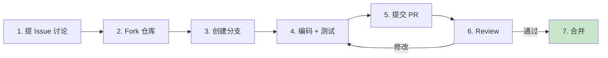

# 贡献指南（CONTRIBUTING）

> **文档类型：** 贡献指南
>
> **版本：** v1.0.0
>
> **日期：** YYYY-MM-DD
>
> **维护人：** [项目 Owner / Maintainer 团队]
>
> **适用仓库：** {org}/{repo}
>
> **关联文档：** [README.md](./README.md) / [CHANGELOG.md](./CHANGELOG.md) / [CODE_OF_CONDUCT.md](./CODE_OF_CONDUCT.md)

欢迎贡献！本文档说明如何向 {项目名} 贡献代码、文档与问题反馈。参与即视为同意遵守 [行为准则](./CODE_OF_CONDUCT.md)。

## 目录

- [行为准则](#行为准则)
- [如何贡献](#如何贡献)
- [开发环境搭建](#开发环境搭建)
- [代码规范](#代码规范)
- [提交规范](#提交规范)
- [Pull Request 流程](#pull-request-流程)
- [测试要求](#测试要求)
- [文档贡献](#文档贡献)
- [Issue 规范](#issue-规范)
- [评审标准](#评审标准)
- [致谢](#致谢)

---

## 行为准则

本项目遵循 [Contributor Covenant 2.1](https://www.contributor-covenant.org/version/2/1/code_of_conduct/) 行为准则。

- **对事不对人**：批评代码，不批评人
- **开放包容**：欢迎不同背景、不同水平的贡献者
- **数据驱动**：用数据与事实说话，避免主观臆断
- **尊重时间**：Maintainer 是志愿者，请耐心等待 Review

如遇不当行为，请邮件联系 {conduct-email}。

---

## 如何贡献

### 贡献方式

| 类型         | 说明                                    | 入口                          |
| :----------- | :-------------------------------------- | :---------------------------- |
| **Bug 修复** | 修复已有问题                            | [提交 Issue](../../issues)    |
| **新功能**   | 提议并实现新特性                        | 先提 Issue 讨论               |
| **文档改进** | 修正错别字、补充说明、翻译              | 直接提 PR                     |
| **性能优化** | 提升性能、降低资源占用                  | 附基准测试数据                |
| **测试补充** | 提升测试覆盖率                          | 直接提 PR                     |
| **问题反馈** | 报告 Bug 或建议改进                     | [提交 Issue](../../issues)    |

### 贡献流程总览



### 首次贡献者

- 标签 [`good first issue`](../../issues?q=label%3A%22good+first+issue%22) 适合新手入门
- 标签 [`help wanted`](../../issues?q=label%3A%22help+wanted%22) 欢迎社区协助
- 不确定如何下手？在 Issue 下留言或参与 [Discussions](../../discussions)

---

## 开发环境搭建

### 前置依赖

| 依赖          | 最低版本 | 说明                         |
| :------------ | :------- | :--------------------------- |
| {Node.js}     | 18+      | 运行环境                     |
| {git}         | 2.30+    | 版本控制                     |
| {其他}        | {版本}   | {说明}                       |

### 步骤

```bash
# 1. Fork 仓库（GitHub 页面操作）

# 2. Clone 你 Fork 的仓库
git clone https://github.com/{your-username}/{repo}.git
cd {repo}

# 3. 添加上游仓库
git remote add upstream https://github.com/{org}/{repo}.git

# 4. 安装依赖
{install-command}

# 5. 启动开发环境
{dev-command}

# 6. 运行测试（确保环境正常）
{test-command}
```

### IDE 推荐配置

- **VS Code**：安装推荐扩展（`.vscode/extensions.json`）
- **JetBrains**：导入 `.editorconfig` 与代码风格配置
- **统一格式化**：使用 `.editorconfig` + 项目自带 formatter

---

## 代码规范

### 通用原则

- **可读性优先**：代码是写给人看的，机器只是顺便能跑
- **单一职责**：一个函数 / 类只做一件事
- **显式优于隐式**：不要用魔法值、不要藏副作用
- **简洁但不简陋**：能 5 行解决不要写 50 行，但也不要为了行数牺牲清晰度

### 命名规范

| 类型         | 规范                | 示例                          |
| :----------- | :------------------ | :---------------------------- |
| 变量 / 函数  | `snake_case` / `camelCase`（按语言惯例） | `user_id` / `userId` |
| 常量         | `UPPER_SNAKE_CASE`  | `MAX_RETRY_COUNT`             |
| 类 / 类型    | `PascalCase`        | `UserService`                 |
| 文件名       | 按语言惯例          | `user_service.py` / `UserService.ts` |
| 私有成员     | 前缀 `_` 或语言惯例 | `_internal_cache`             |

### 语言专属规范

| 语言     | Linter                | Formatter           | 规范文档                                   |
| :------- | :-------------------- | :------------------ | :----------------------------------------- |
| Rust     | `cargo clippy`        | `cargo fmt`         | [Rust API Guidelines]                      |
| Python   | `ruff`                | `black`             | [PEP 8] / [PEP 257]                        |
| Node/TS  | `eslint`              | `prettier`          | [Google TS Style Guide]                    |
| Java     | `checkstyle`          | `google-java-format`| [Google Java Style]                        |
| Go       | `golangci-lint`       | `gofmt` / `goimports`| [Effective Go]                             |

### 错误处理

- **失败必须显性化**：错误必须抛出或返回，严禁吞掉
- **错误信息可操作**：包含上下文、原因、建议下一步
- **区分错误类型**：业务错误 / 系统错误 / 外部依赖错误
- **日志分级**：ERROR / WARN / INFO / DEBUG，生产环境默认 INFO

```python
# ✅ 好
def get_user(user_id: str) -> User:
    if not user_id:
        raise ValueError("user_id 不能为空")
    user = db.find(user_id)
    if user is None:
        raise UserNotFoundError(f"用户 {user_id} 不存在")
    return user

# ❌ 坏（吞错误）
def get_user(user_id):
    try:
        return db.find(user_id)
    except:
        return None
```

### 注释规范

- **Why > What**：解释为什么这么写，而不是写了什么
- **不写废话注释**：`# 设置 i 为 0` `i = 0`
- **公共 API 必须有文档注释**：含参数、返回值、异常、示例
- **TODO 必须带 Issue 编号**：`# TODO(#123): 优化查询性能`

---

## 提交规范

### Commit Message 格式

遵循 [Conventional Commits 1.0.0](https://www.conventionalcommits.org/zh-hans/v1.0.0/)：

```
<type>(<scope>): <subject>

<body>

<footer>
```

### Type 列表

| Type        | 说明                                                  |
| :---------- | :---------------------------------------------------- |
| `feat`      | 新功能                                                |
| `fix`       | Bug 修复                                              |
| `docs`      | 文档变更                                              |
| `style`     | 代码格式（不影响功能）                                |
| `refactor`  | 重构（既不是新增功能，也不是修复 Bug）                |
| `perf`      | 性能优化                                              |
| `test`      | 测试相关                                              |
| `build`     | 构建系统 / 外部依赖变更                               |
| `ci`        | CI 配置变更                                           |
| `chore`     | 杂项（不修改 src 也不修改 test）                      |
| `revert`    | 回滚之前的 commit                                     |

### 示例

```
feat(user): 支持手机号登录

新增手机号 + 验证码登录方式，与现有邮箱登录并存。
验证码 5 分钟有效，单手机号每日限 5 次。

Closes #123
```

```
fix(auth): 修复 Token 过期后未自动刷新的问题

根因：refresh_token 检查时机在请求拦截器之外，
导致并发请求时多次刷新。改为单例锁 + 串行刷新。

Fixes #456
```

### 规则

- **subject**：祈使句，首字母小写，不超过 50 字符，结尾不加句号
- **body**：解释 What + Why，每行 ≤ 72 字符
- **footer**：关联 Issue（`Closes #123` / `Fixes #456` / `Refs #789`）
- **BREAKING CHANGE**：在 footer 标注 `BREAKING CHANGE: <说明>`
- 一个 commit 只做一件事，混合变更必须拆分

---

## Pull Request 流程

### 1. 创建分支

```bash
# 从 main 拉最新代码
git checkout main
git pull upstream main

# 创建特性分支（命名规范见下表）
git checkout -b feat/user-login
```

**分支命名规范：**

| 类型     | 前缀       | 示例                        |
| :------- | :--------- | :-------------------------- |
| 新功能   | `feat/`    | `feat/user-login`           |
| Bug 修复 | `fix/`     | `fix/token-refresh`         |
| 文档     | `docs/`    | `docs/api-reference`        |
| 重构     | `refactor/`| `refactor/auth-module`      |
| 性能     | `perf/`    | `perf/query-cache`          |
| 测试     | `test/`    | `test/user-service`         |

### 2. 编码与提交

```bash
# 提交（遵循 §提交规范）
git add .
git commit -m "feat(user): 支持手机号登录"
```

### 3. 推送与创建 PR

```bash
# 推送到你的 Fork
git push origin feat/user-login

# 在 GitHub 页面创建 PR，目标分支 main
```

### 4. PR 标题与描述

**PR 标题**：与首个 commit message 一致

**PR 描述模板：**

```markdown
## 变更说明

<!-- 一段话说明本 PR 做了什么、为什么 -->

## 变更类型

- [ ] 新功能（feat）
- [ ] Bug 修复（fix）
- [ ] 文档（docs）
- [ ] 重构（refactor）
- [ ] 性能（perf）
- [ ] 其他：

## 关联 Issue

Closes #123

## 测试

- [ ] 已添加单元测试
- [ ] 已添加集成测试（如适用）
- [ ] 手动验证通过（附截图 / 日志）

## Checklist

- [ ] 代码遵循项目规范
- [ ] 自审查过代码
- [ ] 注释了难以理解的部分
- [ ] 文档已更新（如适用）
- [ ] 无硬编码密钥 / Token
- [ ] 向后兼容（或已标注 BREAKING CHANGE）
```

### 5. Review

- **Reviewer 要求**：≥ 1 名 Maintainer 批准
- **CI 必过**：lint / test / build 全绿
- **响应时效**：Contributor 收到 Review 意见后 7 天内响应，否则可能被关闭
- **修改后**：force push 到同一分支，不要新开 PR

### 6. 合并

- **Squash Merge**（默认）：多个 commit 合并为一个
- **Merge Commit**：保留完整历史（仅大型特性分支）
- **Rebase**：线性历史（Maintainer 决定）

合并后删除源分支。

---

## 测试要求

### 覆盖率门禁

| 模块类型     | 行覆盖率    | 分支覆盖率  |
| :----------- | :---------- | :---------- |
| 核心业务逻辑 | ≥ 85%       | ≥ 75%       |
| 工具类       | ≥ 70%       | ≥ 60%       |
| 整体项目     | ≥ 80%       | ≥ 70%       |

### 测试类型

| 类型         | 说明                            | 工具                          |
| :----------- | :------------------------------ | :---------------------------- |
| **单元测试** | 单个函数 / 类的逻辑             | {pytest / vitest / cargo test}|
| **集成测试** | 多模块协作                      | {testcontainers / supertest}  |
| **契约测试** | API 与文档一致                  | {Pact / Dredd}                |
| **E2E 测试** | 端到端用户流程                  | {Playwright / Cypress}        |
| **性能测试** | QPS / 延迟 / 内存               | {k6 / wrk / criterion}        |

### 测试规范

- **Arrange-Act-Assert**：测试三段式，结构清晰
- **一个测试只验证一个行为**：避免断言爆炸
- **测试名表达意图**：`test_手机号为空时抛出 ValueError`
- **不依赖执行顺序**：每个测试独立可运行
- **Mock 外部依赖**：DB / 网络 / 文件系统
- **不测试框架本身**：不要测 `assertEqual(1, 1)`

```python
# ✅ 好
def test_手机号为空时抛出错误():
    # Arrange
    service = UserService()
    # Act + Assert
    with pytest.raises(ValueError, match="手机号不能为空"):
        service.send_code("")

# ❌ 坏
def test_send_code():
    service = UserService()
    try:
        service.send_code("")
    except:
        pass
```

---

## 文档贡献

### 哪些文档欢迎贡献

- 修正错别字、语法错误：直接提 PR
- 补充示例、FAQ：直接提 PR
- 翻译文档：先提 Issue 讨论语言策略
- 新增文档章节：先提 Issue 讨论大纲

### 文档规范

- **Markdown**：遵循 [GitHub Flavored Markdown](https://github.github.com/gfm/)
- **中英文混排**：中英文之间加空格（如 `使用 Node.js 18+`）
- **代码块**：标注语言（```bash / ```python / ```typescript）
- **链接**：使用相对路径（同仓库）/ 绝对路径（外站）
- **图片**：放在 `docs/images/`，命名 `kebab-case.png`

---

## Issue 规范

### Bug 报告模板

```markdown
**环境**
- OS: [e.g. Ubuntu 22.04]
- {项目} 版本: [e.g. v1.2.3]
- {语言} 版本: [e.g. Node.js 18.17.0]

**复现步骤**
1. ...
2. ...
3. ...

**预期行为**
...

**实际行为**
...

**错误日志**
```
<完整堆栈，敏感信息脱敏>
```

**附加信息**
<截图 / 配置 / 其他>
```

### 功能请求模板

```markdown
**问题**
<当前遇到了什么问题>

**期望方案**
<希望新增什么功能>

**替代方案**
<是否考虑过其他方案>

**附加信息**
<截图 / 参考 / 其他>
```

### Issue 处理时效

| 类型         | 首次响应      | 关闭时效      |
| :----------- | :------------ | :------------ |
| Bug 报告     | ≤ 3 天        | 视复杂度      |
| 功能请求     | ≤ 7 天        | 讨论后决定    |
| 安全漏洞     | ≤ 24 小时     | 修复后        |

---

## 评审标准

### PR 通过条件

- [ ] CI 全绿（lint / test / build / coverage）
- [ ] ≥ 1 名 Maintainer 批准
- [ ] 公共 API 变更有文档更新
- [ ] BREAKING CHANGE 有迁移指南
- [ ] 无硬编码密钥 / Token
- [ ] 测试覆盖率不下降
- [ ] 提交规范符合 Conventional Commits

### Review 重点

| 维度         | 关注点                                            |
| :----------- | :------------------------------------------------ |
| **正确性**   | 逻辑是否正确？边界 case 是否处理？                |
| **可读性**   | 命名是否清晰？结构是否合理？                       |
| **健壮性**   | 错误处理是否完整？异常路径是否覆盖？               |
| **性能**     | 是否引入性能瓶颈？大数据量下表现？                |
| **安全**     | 是否有注入 / XSS / 越权风险？                      |
| **测试**     | 测试是否有效？是否覆盖关键路径？                  |
| **文档**     | 公共 API 是否有文档？变更是否记录？                |

---

## 致谢

感谢所有贡献者！每一位都让项目变得更好。

[](https://github.com/{org}/{repo}/graphs/contributors)

贡献者名单见 [CONTRIBUTORS.md](./CONTRIBUTORS.md)。

---

## 📌 CONTRIBUTING 撰写 Checklist

- [ ] 行为准则明确
- [ ] 贡献方式与流程图清晰
- [ ] 开发环境搭建步骤完整
- [ ] 代码规范（通用 + 语言专属）
- [ ] 提交规范（Conventional Commits）
- [ ] PR 流程（分支命名 / 描述模板 / Review 要求）
- [ ] 测试要求（覆盖率门禁 + 类型 + 规范）
- [ ] 文档贡献规范
- [ ] Issue 模板（Bug / 功能请求）
- [ ] 评审标准（通过条件 + Review 重点）
- [ ] 致谢与贡献者链接
