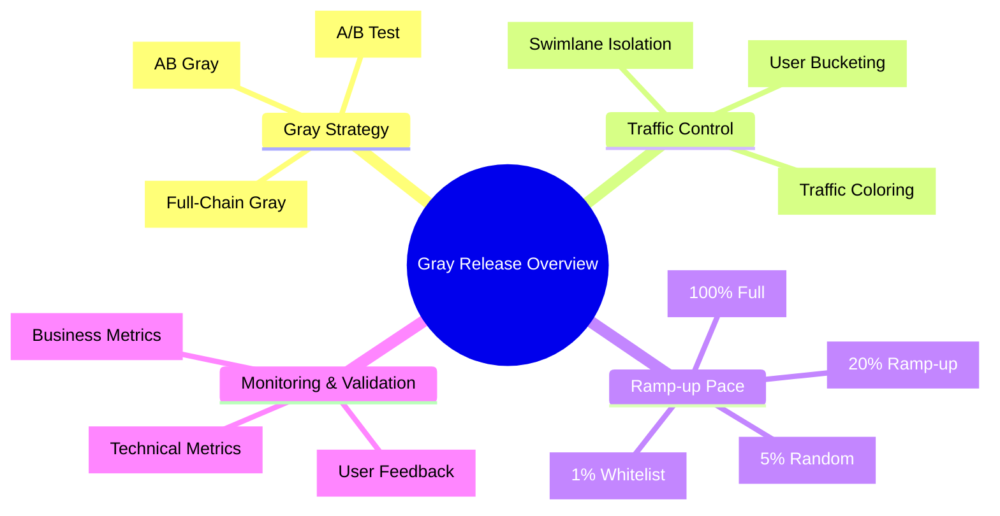
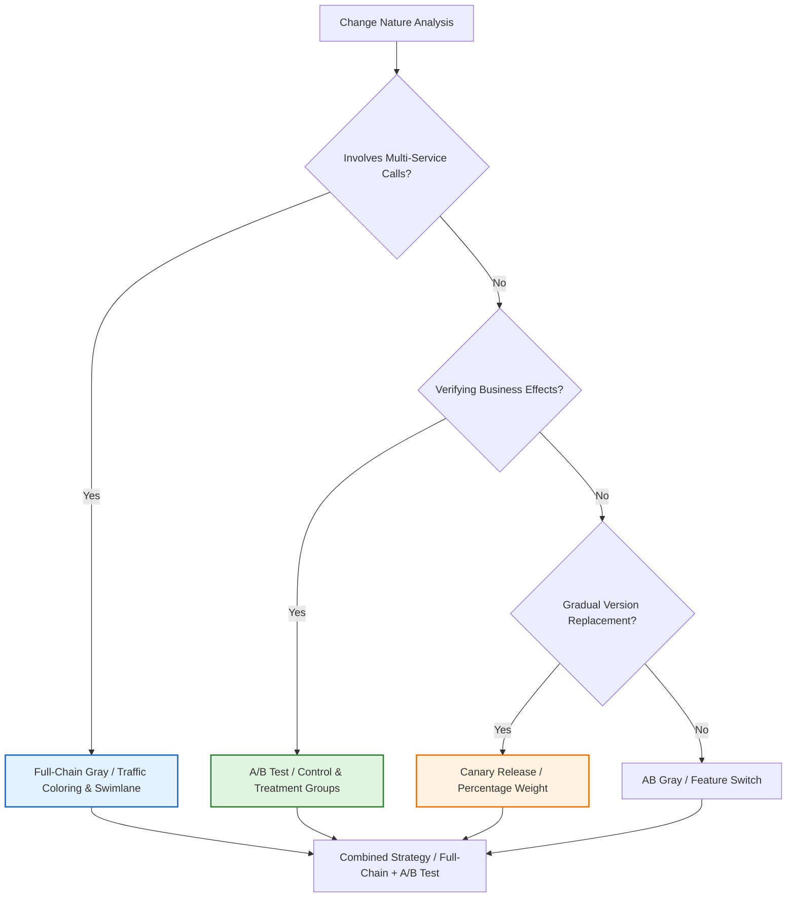
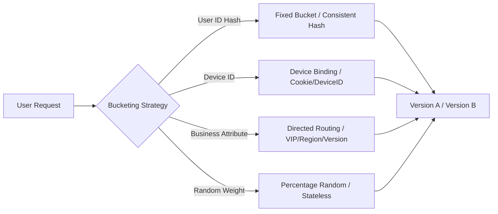
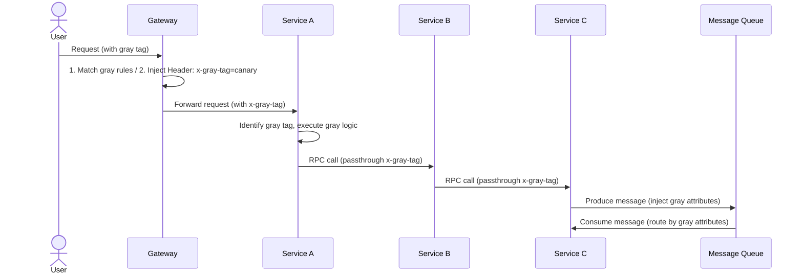
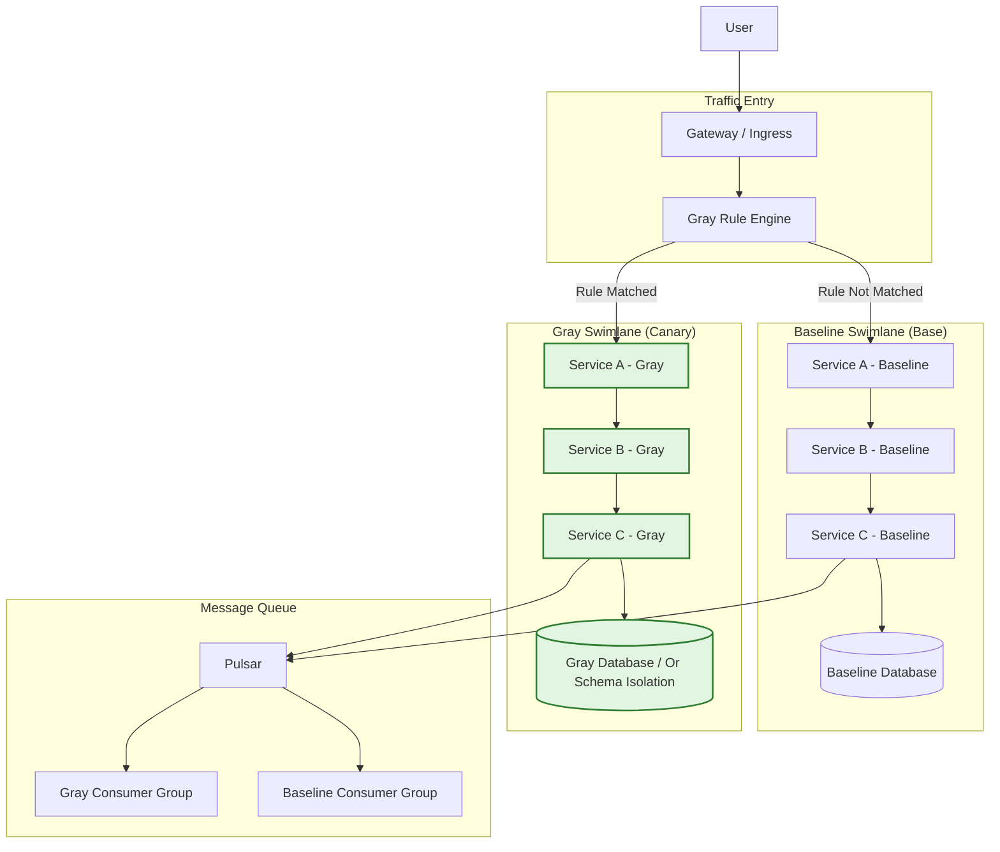
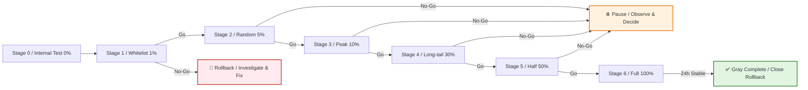
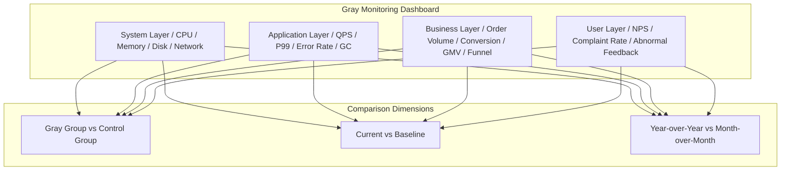
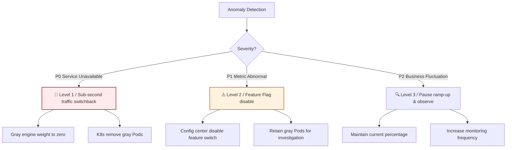
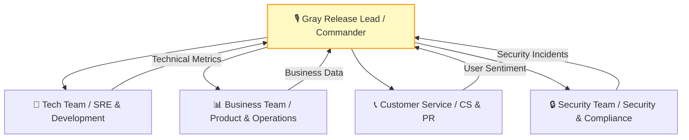

# [Product/System Name (English)] - Gray Release Plan

> **Document Status:** 🟡 Under Review / 🟢 Approved / 🔴 Cancelled
>
> **Confidentiality Level:** Confidential / Internal / Public
>
> **Version:** vX.X
>
> **Date:** YYYY-MM-DD
>
> **Author:** [Name] (Gray Release Lead)
>
> **Reviewer:** [Name/Role]
>
> **Audience:** [Role List]
>
> **Gray Release ID:** GRAY-2026-XXX
>
> **Related Release Plan:** [Release Plan ID]
>
> **Related Change Request:** [CR ID]
>
> **Tech Lead:** [Name]
>
> **Product Owner:** [Name]

---

## 0. Document Guide

### 0.1 Document Purpose & Scope

[Describe the purpose, applicable scenarios, and non-applicable scenarios of this document]

### 0.2 Related Documents

| Document Type | Filename | Related Sections |
| -------- | ------------------- | ---------- |
| [Type] | [Filename] [Line Range] | [Section Description] |

> **Reference Format**: Related documents use the `filename line range` format (e.g., `【Template】Technical Requirements Document (TRD).md 3-17`). Line numbers may change as documents are updated; refer to the actual content.

### 0.3 Change Log

| Version | Date | Author | Changes | Reviewer |
| :----- | :--------- | :----- | :------------------------------------------------------- | :----------- |
| v0.1 | YYYY-MM-DD | [Name] | Initial draft | |
| v0.2 | YYYY-MM-DD | [Name] | Added end-to-end swimlane design | |
| v0.3 | YYYY-MM-DD | [Name] | Review passed | [Gray Release Lead] |
| v0.3.1 | 2026-06-09 | Xie Dong | Fix gantt chart to table for Feishu rendering compatibility | — |
| v0.3.2 | 2026-06-20 | Xie Dong | Message middleware example Kafka/RocketMQ→Pulsar (unified event bus standard) | — |

---

## 1. Executive Summary

> **Decision-Maker 30-Second Guide:** What to gray release, for whom, how, and how to stop if something goes wrong.

| Element | Content |
| :----------- | :------------------------------------------------------- |
| **Gray Release Objective** | [One sentence, e.g.: Verify stability and conversion rate of new payment routing under real traffic] |
| **Gray Release Type** | [AB Gray / Full-Chain Gray / Canary / A/B Test / Sandbox Gray] |
| **Gray Release Scope** | [e.g.: 1% random users + internal whitelist, covering core transaction path] |
| **Gray Release Cycle** | [e.g.: 72h, 5 stages of gradual ramp-up] |
| **Core Risks** | [e.g.: Payment success rate fluctuation, stock deduction inconsistency] |
| **Circuit Breaker Method** | [e.g.: Sub-second traffic switchback, Feature Flag disable, database rollback] |



---

## 2. Gray Strategy Selection

> Select the most suitable gray release mode based on the nature of changes. Different modes can be combined.

### 2.1 Gray Release Mode Comparison

| Mode | Applicable Scenario | Traffic Control Granularity | Code Intrusiveness | Infrastructure Dependency | Rollback Speed |
| :------------- | :----------------------------------- | :--------------------- | :---------: | :---------------- | :------: |
| **AB Gray** | Feature switch controlled, user/parameter-based routing | UserID, Header, Cookie | Medium | Config Center | Sub-second |
| **Full-Chain Gray** | Microservice architecture, need upstream/downstream consistency | Traffic coloring + swimlane isolation | Low (Agent) | Service mesh/registry | Sub-second |
| **Canary Release** | Gradual new version replacement, observe system metrics | Percentage weight | Low | Load balancer/gateway | Minutes |
| **A/B Test** | Verify business effects (conversion, retention, etc.) | Random bucketing + control group | Low | Experiment platform | Hours |
| **Sandbox Gray** | High-risk changes, fully isolated verification | Independent environment, manual traffic routing | None | Independent sandbox environment | Minutes |

### 2.2 This Release Gray Mode Decision



**This Release Uses:** [e.g., Full-Chain Gray + A/B Test combined mode]

---

## 3. Traffic Bucketing & Routing

### 3.1 User Bucketing Algorithm

> Ensure the same user always enters the same version to avoid experience jumps.



**Bucketing Code Example (Pseudocode):**

```python
import hashlib

def assign_bucket(user_id: str, experiment_name: str = "gray_2026") -> str:
    """Assign experiment group based on user ID hash, ensuring same user always enters same group"""
    key = f"{user_id}_{experiment_name}"
    hash_val = int(hashlib.md5(key.encode()).hexdigest(), 16)
    bucket = hash_val % 100

    if bucket < 45:
        return "control"      # Control group: 45%, current version
    elif bucket < 90:
        return "treatment"    # Treatment group: 45%, new version
    else:
        return "holdout"      # Holdout group: 10%, long-term monitoring

# During ramp-up, gradually increase treatment group from 0% to 45%
```

### 3.2 Multi-Dimensional Routing Rules

| Dimension | Rule Example | Applicable Scenario |
| :----------- | :------------------------------ | :----------- |
| **User Attribute** | `user_id in [10086, 10010]` | Whitelist validation |
| **Device Type** | `User-Agent contains "Android"` | Client differentiation |
| **Region** | `region = "East China"` | Regional gradual rollout |
| **Version** | `app_version >= "5.3.0"` | Client compatibility |
| **Random Ratio** | `random() < 0.05` | Indiscriminate ramp-up |
| **Business Tag** | `merchant_level = "KA"` | Merchant tiering |

### 3.3 Traffic Coloring & Passthrough

> Core of full-chain gray: tag requests at the ingress gateway; tags are passed through the entire call chain.



**Coloring Header Specification:**

| Header Key | Example Value | Description |
| :--------------- | :---------------------- | :------- |
| `x-gray-tag` | `canary` / `base` | Gray identifier |
| `x-gray-bucket` | `treatment` / `control` | Experiment bucket |
| `x-request-id` | `uuid` | Tracing |
| `x-gray-version` | `v2.1.0` | Version identifier |

---

## 4. Full-Chain Swimlane Design

> Swimlanes are logically isolated environments where gray traffic is closed-loop within the swimlane and does not contaminate the baseline environment.

### 4.1 Swimlane Architecture

> **Reference**: For the overall system deployment architecture, multi-active/disaster recovery strategies, and infrastructure details, see **【Template】Architecture Design Document (ADD).md §5. Deployment Architecture**. This document only describes swimlane isolation design related to gray release.

**Gray Swimlane Architecture Overview:**



> **Complete Architecture**: For system deployment topology, multi-AZ deployment, and disaster recovery strategies, see **【Template】Architecture Design Document (ADD).md §5.1-5.2**.

### 4.2 Swimlane Fallback Strategy

> When a downstream service in the gray swimlane is missing, automatically degrade to baseline to avoid traffic interruption.

| Scenario | Fallback Behavior | Configuration |
| :--------------- | :------------------------------ | :-------------------------- |
| Gray Service C not deployed | Gray traffic → Baseline Service C | `fallback_to_base: true` |
| Baseline Service B down | Baseline traffic → Gray Service B (if compatible) | `fallback_to_canary: false` |
| No gray consumer group for messages | Gray messages → Baseline consumer group (must be idempotent) | `mq_fallback: base_group` |

---

## 5. Ramp-up Schedule

> Ramp-up must go through "self-testing" and "production peak hours" validation; pace must not be skipped.

### 5.1 Standard Ramp-up Schedule

> **Note**: Gantt chart is incompatible with Feishu; replaced with table description.

| Phase | Task | Start Time | End Time | Duration | Status |
| ------ | ------------ | ---------------- | ---------------- | ---- | ---- |
| Warm-up | Whitelist validation | 2026-05-25 02:00 | 2026-05-25 04:00 | 2h | — |
| Low traffic | 1% random ramp-up | 2026-05-25 04:00 | 2026-05-25 10:00 | 6h | — |
| Low traffic | 5% random ramp-up | 2026-05-25 10:00 | 2026-05-25 18:00 | 8h | — |
| Medium traffic | 10% ramp-up | 2026-05-25 18:00 | 2026-05-26 06:00 | 12h | — |
| Medium traffic | 30% ramp-up | 2026-05-26 06:00 | 2026-05-27 00:00 | 18h | — |
| Full | 50% ramp-up | 2026-05-27 00:00 | 2026-05-27 12:00 | 12h | — |
| Full | 100% full | 2026-05-27 12:00 | 2026-05-28 00:00 | 12h | — |
| Observation | 24h stability observation | 2026-05-28 00:00 | 2026-05-29 00:00 | 24h | — |

### 5.2 Stage Definitions & Go/No-Go Criteria

| Stage | Traffic % | User Scope | Observation Duration | Core Validation Metrics | Go Criteria | No-Go Action |
| :----- | :------: | :-------------------------- | :------: | :-------------------------- | :----------------- | :------------- |
| **S0** | 0% | Internal test environment | — | Functional completeness | Test cases 100% passed | Fix and retest |
| **S1** | 1% | Whitelist (internal employees + seed customers) | 2h | Error rate, P99, core API success rate | P0=0, error rate <<0.1% | Immediate rollback, investigate |
| **S2** | 5% | Random users, Cookie Sticky | 4h | + Business funnel conversion | Conversion fluctuation <<5% | Pause ramp-up, observe |
| **S3** | 10% | Random users, cover peak hours | 8h | + Order volume, GMV, AOV | Business metrics normal | Pause ramp-up, observe |
| **S4** | 30% | Expanded coverage, long-tail scenarios | 12h | + Customer complaints, NPS | Complaints << baseline | Pause ramp-up, observe |
| **S5** | 50% | Half volume, full scenario coverage | 12h | + Financial reconciliation consistency | Reconciliation diff = 0 | Pause ramp-up, observe |
| **S6** | 100% | Full volume, retain rollback capability | 24h | Full volume metric monitoring | No P0 in 24h | Close rollback window |



---

## 6. Monitoring & Validation

### 6.1 Four-Layer Monitoring Dashboard



### 6.2 Core Monitoring Metrics

| Layer | Metric | Baseline | Alert Threshold | Circuit Breaker Threshold | Collection Frequency |
| :------- | :------------- | :----- | :---------- | :--------- | :------: |
| **System** | CPU Usage | 45% | > 70% | > 85% | 1min |
| **System** | Memory Usage | 60% | > 80% | > 90% | 1min |
| **Application** | QPS | 5000 | Fluctuation > ±20% | — | 1min |
| **Application** | P99 Latency | 120ms | > 200ms | > 500ms | 1min |
| **Application** | Error Rate | 0.05% | > 0.5% | > 1% | 1min |
| **Business** | Order Creation Success Rate | 99.9% | < 99.5% | < 99% | 5min |
| **Business** | Payment Success Rate | 99.5% | < 99% | < 98% | 5min |
| **Business** | Core Funnel Conversion | 12% | Drop > 10% | Drop > 20% | 15min |
| **User** | Customer Service Complaints | 5/h | > 20/h | > 50/h | Real-time |

### 6.3 A/B Test Experiment Metrics (if applicable)

| Metric Type | Metric Name | Definition | Target |
| :------------------ | :----------- | :---------------- | :----------- |
| **Core Metrics** | Conversion Rate | Order UV / Visit UV | Increase ≥ 2% |
| **Guardrail Metrics** | Refund Rate | Refunded Orders / Total Orders | Increase << 1pp |
| **Auxiliary Metrics** | Revenue per User | Total GMV / Order UV | Increase ≥ 5% |
| **Auxiliary Metrics** | Page Dwell Time | Average dwell time | Change << ±10% |

---

## 7. Rollback & Kill Switch

### 7.1 Multi-Level Mitigation Strategy



### 7.2 Rollback Trigger Conditions

| Trigger Source | Condition | Response Time | Decision Method |
| :----------- | :-------------------------------------------- | :------: | :------------ |
| **Auto Circuit Breaker** | Error rate > 1% sustained 2min / P99 > 500ms sustained 3min | < 1min | System auto |
| **Monitoring Alert** | P0 alert | < 3min | OnCall decision |
| **Business Feedback** | Conversion drop > 20% / Complaints > 50/h | < 5min | Product + Tech joint |
| **Security Incident** | Data leak / Unauthorized access / Financial risk | < 1min | Immediate execution |

### 7.3 Feature Flag Emergency Disable

```python
# Feature switch pseudocode
def is_feature_enabled(feature_key: str, user: User) -> bool:
    flag = flag_service.get(feature_key)  # Real-time fetch from config center

    if not flag.enabled:
        return False  # Global disable

    if flag.emergency_off:
        return False  # Emergency disable (sub-second effective)

    if user.id in flag.gray_list:
        return True  # Whitelist

    bucket = hash(f"{user.id}_{feature_key}") % 100
    return bucket < flag.gray_percentage  # Percentage-based pass
```

---

## 8. Gray Release Environment Management

### 8.1 Swimlane Environment Configuration

| Environment | Purpose | Relation to Production | Data Strategy |
| :----------- | :----------- | :--------------------------- | :------------------------- |
| **Baseline Swimlane** | Stable production | Carries 100% traffic (reduced during gray) | Real production data |
| **Gray Swimlane** | New version validation | Isolated operation, only gray traffic enters | Real production data (schema-compatible) |
| **Sandbox Environment** | Pre-release validation | Fully isolated, manual traffic routing | Masked test data |

### 8.2 Database Gray Release Strategy

| Strategy | Applicable Scenario | Implementation | Rollback Difficulty |
| :-------------- | :--------------- | :----------------------- | :------: |
| **Schema Compatible** | New field (nullable) | Baseline/Gray share same database | 🟢 Low |
| **Shadow Table** | Core table structure change | Gray reads/writes shadow table, dual-write sync | 🟡 Medium |
| **Database Isolation** | Large-scale refactor | Gray independent database, merge afterward | 🔴 High |

---

## 9. Communication & OnCall

### 9.1 Gray Release Communication Architecture



### 9.2 OnCall Schedule

| Role | Name | Responsibilities | Contact | Standby Period |
| :------------- | :----- | :--------------------- | :-------- | :------- |
| **Gray Release Lead** | [Name] | Commander, ramp-up/rollback decision | Phone/DingTalk | Full duration |
| **Tech Lead** | [Name] | Technical issue investigation | Phone/DingTalk | Full duration |
| **SRE Ops** | [Name] | Traffic control, monitoring, scaling | Phone/DingTalk | Full duration |
| **Product Owner** | [Name] | Business metrics monitoring, user feedback | Phone/DingTalk | S1-S6 |
| **CS Lead** | [Name] | Sentiment monitoring, user appeasement | Phone/DingTalk | S2-S6 |

---

## 10. Gray Release Post-Mortem Template

| Item | Content |
| :---------------- | :---------------------------------- |
| **Gray Result** | ✅ Successful full rollout / ❌ Rolled back / ⚠️ Released with issues |
| **Actual Cycle** | Planned 72h, actual [X]h |
| **Stage Durations** | S1: [X]h, S2: [X]h, S3: [X]h... |
| **Anomaly Events** | [Describe issue, root cause, handling] |
| **Metric Comparison** | Gray group vs control group core metric differences |
| **Decision Review** | Was ramp-up pace reasonable? Was rollback timely? |
| **Improvement Items** | [At least 3 Action items] |

---

## 11. Appendix

### 11.1 Glossary

| Term | Definition |
| :----------------- | :----------------------------------- |
| **AB Gray** | Route new/old versions by user dimension via feature switch |
| **Full-Chain Gray** | Traffic coloring with full-chain passthrough in microservice call chain |
| **Swimlane** | Logically isolated gray environment, traffic is closed-loop within swimlane |
| **Traffic Coloring** | Tag at request entry, marking request as gray traffic |
| **Sticky Session** | Same user's requests always routed to the same version |
| **Feature Flag** | Feature switch, supports runtime dynamic enable/disable |
| **Holdout** | Holdout group, not participating in experiment, used for long-term trend comparison |

### 11.2 Related Documents

| Document | ID | Link |
| :------- | :------------ | :----- |
| Release Plan | RP-2026-XXX | [Link] |
| Architecture Design | ADD-2026-XXX | [Link] |
| Monitoring Dashboard | DASH-2026-XXX | [Link] |
| Contingency Plan | EMG-2026-XXX | [Link] |

## 12. Gray Release Review Sign-off

| Role | Name | Signature | Date | Comments |
| :------------- | :--- | :--: | :--: | :------------------ |
| **Gray Release Lead** | | | | [Approved / Rejected] |
| **Tech Lead** | | | | [Technical plan confirmed] |
| **SRE Lead** | | | | [Traffic/monitoring plan confirmed] |
| **Product Lead** | | | | [Business impact confirmed] |
| **Security Lead** | | | | [Security compliance confirmed] |
