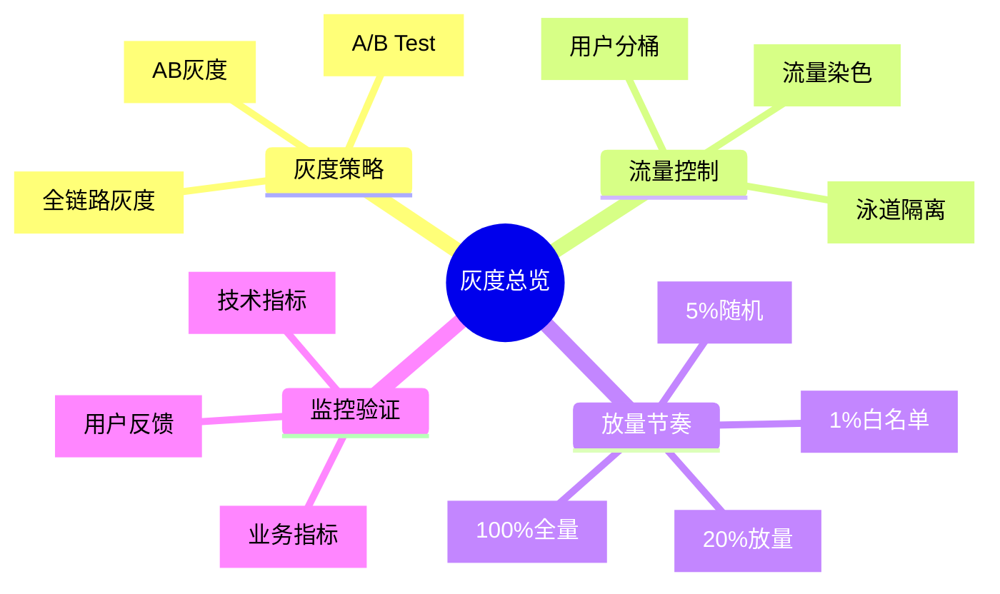
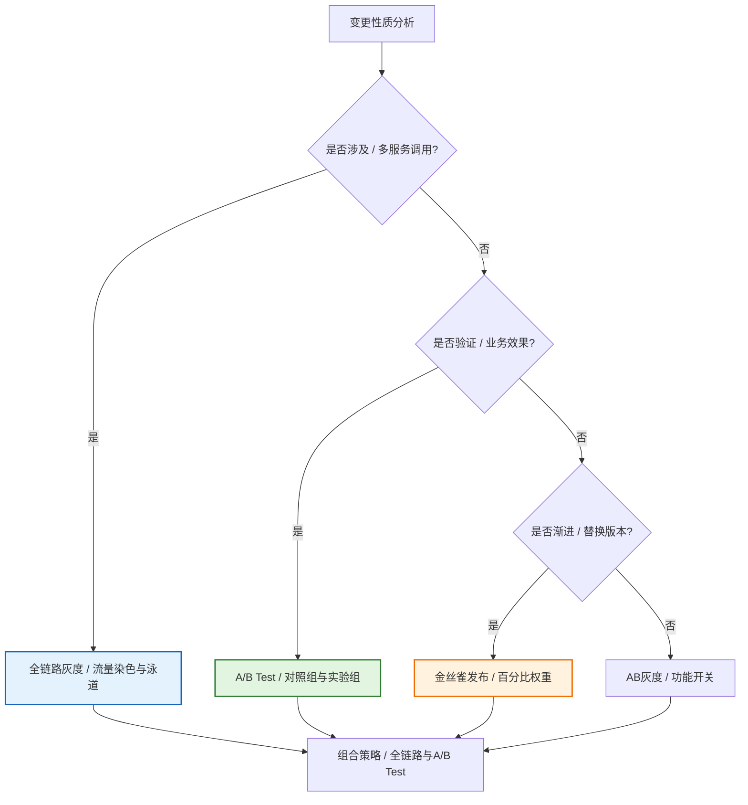
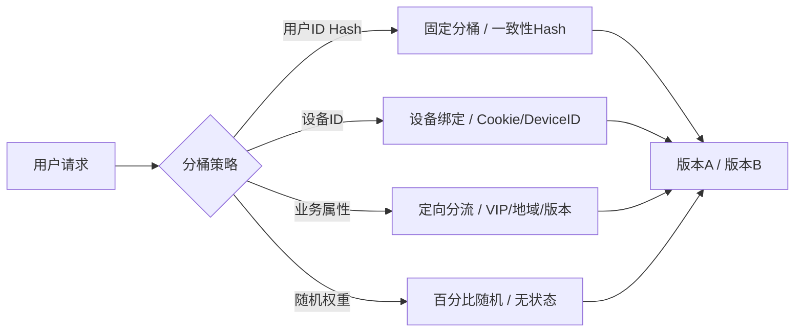
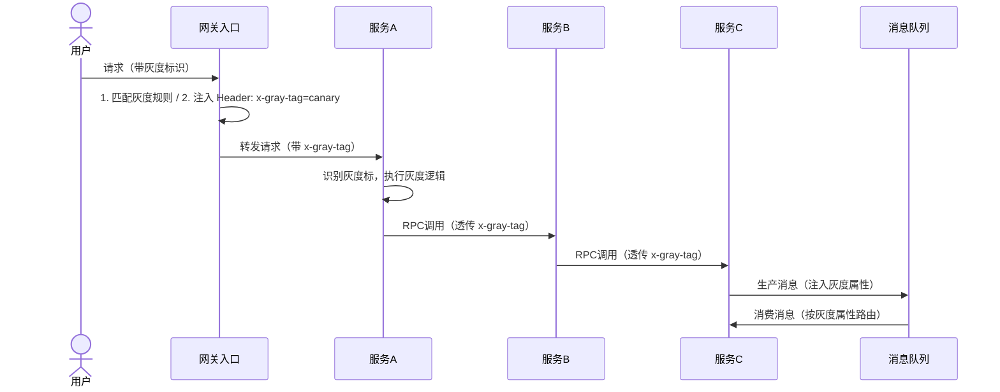
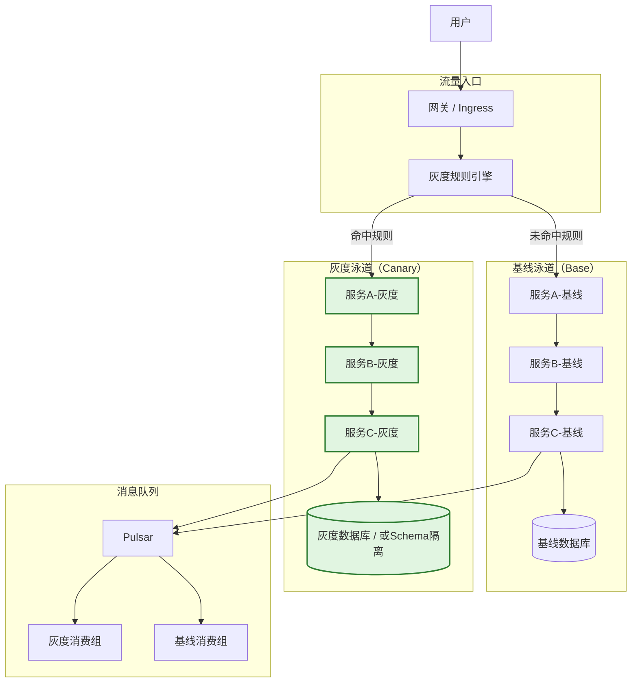
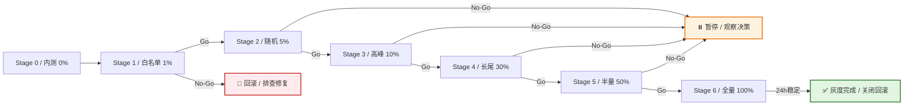
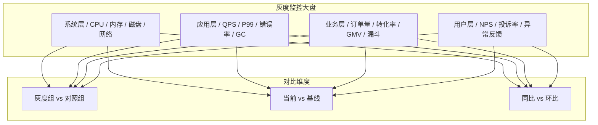
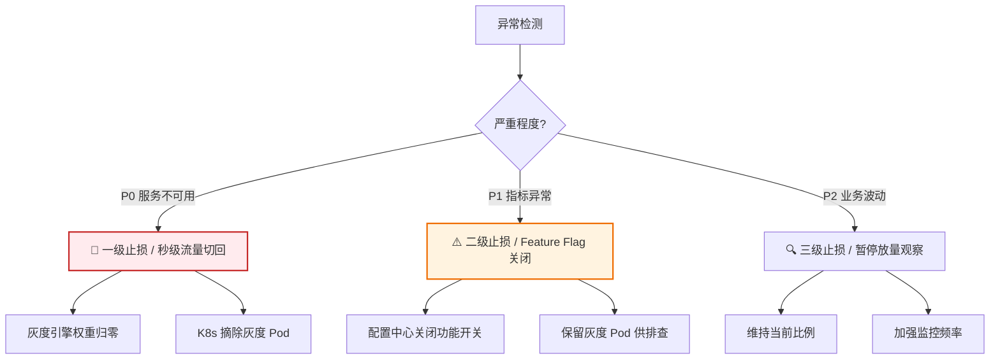
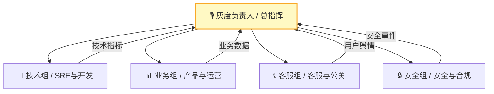

# [产品/系统名称（英文名）] - 灰度方案文档（Gray Release Plan）

> **文档状态：** 🟡 评审中 / 🟢 已批准 / 🔴 已取消
>
> **保密级别：** 机密 / 内部公开 / 公开
>
> **版本：** vX.X
>
> **日期：** YYYY-MM-DD
>
> **撰写人：** [姓名]（灰度负责人）
>
> **评审人：** [姓名/角色]
>
> **阅读对象：** [角色列表]
>
> **灰度单号：** GRAY-2026-XXX
>
> **关联发布计划：** [Release Plan编号]
>
> **关联变更单：** [CR编号]
>
> **技术负责人：** [姓名]
>
> **产品负责人：** [姓名]

---

## 0. 文档导读

### 0.1 文档目的与适用范围

[说明本文档的目的、适用场景和不适用场景]

### 0.2 相关文档

| 文档类型 | 文件名              | 相关章节   |
| -------- | ------------------- | ---------- |
| [类型]   | [文件名] [行号范围] | [章节描述] |

> **引用格式说明**：关联文档使用 `文件名 行号范围` 格式（如 `【模板】技术需求文档(TRD).md 3-17`），行号随文档更新可能变化，请以实际内容为准。

### 0.3 变更记录

| 版本   | 日期       | 修订人 | 变更内容                                                 | 审核人       |
| :----- | :--------- | :----- | :------------------------------------------------------- | :----------- |
| v0.1   | YYYY-MM-DD | [姓名] | 初稿                                                     |              |
| v0.2   | YYYY-MM-DD | [姓名] | 补充全链路泳道设计                                       |              |
| v0.3   | YYYY-MM-DD | [姓名] | 评审通过                                                 | [灰度负责人] |
| v0.3.1 | 2026-06-09 | 谢董   | 修复gantt图为表格以兼容飞书渲染                          | —            |
| v0.3.2 | 2026-06-20 | 谢董   | 消息中间件示例 Kafka/RocketMQ→Pulsar（统一事件总线规范） | —            |

---

## 1. 执行摘要（Executive Summary）

> **决策层 30 秒导读：** 本次灰度发什么、给谁发、怎么发、出问题怎么停。

| 要素         | 内容                                                     |
| :----------- | :------------------------------------------------------- |
| **灰度目标** | [一句话，如：验证新支付路由在真实流量下的稳定性与转化率] |
| **灰度类型** | [AB灰度 / 全链路灰度 / 金丝雀 / A/B Test / 沙箱灰度]     |
| **灰度范围** | [如：1% 随机用户 + 内部白名单，覆盖交易核心链路]         |
| **灰度周期** | [如：72h，分 5 个 Stage 渐进放量]                        |
| **核心风险** | [如：支付成功率波动、库存扣减不一致]                     |
| **止损方式** | [如：秒级流量切回、Feature Flag 关闭、数据库回滚]        |



---

## 2. 灰度策略选型（Gray Strategy Selection）

> 根据变更性质选择最合适的灰度模式。不同模式可组合使用。

### 2.1 灰度模式对比

| 模式           | 适用场景                             | 流量控制粒度           | 代码侵入性  | 基础设施依赖      | 回滚速度 |
| :------------- | :----------------------------------- | :--------------------- | :---------: | :---------------- | :------: |
| **AB灰度**     | 功能开关控制，按用户/参数分流        | 用户ID、Header、Cookie |     中      | 配置中心          |   秒级   |
| **全链路灰度** | 微服务架构，需保证请求链路上下游一致 | 流量染色 + 泳道隔离    | 低（Agent） | 服务网格/注册中心 |   秒级   |
| **金丝雀发布** | 新版本渐进替换，观察系统指标         | 百分比权重             |     低      | 负载均衡/网关     |  分钟级  |
| **A/B Test**   | 验证业务效果（转化率、留存等）       | 随机分桶 + 对照组      |     低      | 实验平台          |  小时级  |
| **沙箱灰度**   | 高风险变更，完全隔离验证             | 独立环境，手动引流     |     无      | 独立沙箱环境      |  分钟级  |

### 2.2 本次灰度模式决策



**本次采用：** [如：全链路灰度 + A/B Test 组合模式]

---

## 3. 流量分桶与路由策略（Traffic Routing）

### 3.1 用户分桶算法

> 确保同一用户始终进入同一版本，避免体验跳跃。



**分桶代码示例（伪代码）：**

```python
import hashlib

def assign_bucket(user_id: str, experiment_name: str = "gray_2026") -> str:
    """基于用户ID哈希值分配实验组，确保同一用户始终进入同一组"""
    key = f"{user_id}_{experiment_name}"
    hash_val = int(hashlib.md5(key.encode()).hexdigest(), 16)
    bucket = hash_val % 100

    if bucket < 45:
        return "control"      # 对照组：45%，现有版本
    elif bucket < 90:
        return "treatment"    # 实验组：45%，新版本
    else:
        return "holdout"      # 保留组：10%，长期监控

# 灰度放量时，将 treatment 组逐步从 0% 提升至 45%
```

### 3.2 多维分流规则

| 维度         | 规则示例                        | 适用场景     |
| :----------- | :------------------------------ | :----------- |
| **用户属性** | `user_id in [10086, 10010]`     | 白名单验证   |
| **设备类型** | `User-Agent contains "Android"` | 客户端差异化 |
| **地域**     | `region = "华东"`               | 区域渐进     |
| **版本号**   | `app_version >= "5.3.0"`        | 客户端兼容   |
| **随机比例** | `random() < 0.05`               | 无差别放量   |
| **业务标签** | `merchant_level = "KA"`         | 商家分级     |

### 3.3 流量染色与透传

> 全链路灰度的核心：在入口网关对请求打标，标签随调用链全链路透传。



**染色 Header 规范：**

| Header Key       | 示例值                  | 说明     |
| :--------------- | :---------------------- | :------- |
| `x-gray-tag`     | `canary` / `base`       | 灰度标识 |
| `x-gray-bucket`  | `treatment` / `control` | 实验分桶 |
| `x-request-id`   | `uuid`                  | 链路追踪 |
| `x-gray-version` | `v2.1.0`                | 版本标识 |

---

## 4. 全链路泳道设计（Swimlane Architecture）

> 泳道是逻辑隔离环境，灰度流量在泳道内闭环，不污染基线环境。

### 4.1 泳道架构图

> **引用说明**：系统的整体部署架构、多活/容灾策略、基础设施详情，请参阅 **【模板】架构设计文档(ADD).md §5. 部署架构**。本文档仅描述灰度相关的泳道隔离设计。

**灰度泳道架构概要**：



> **完整架构**：系统部署拓扑、多可用区部署、容灾策略详见 **【模板】架构设计文档(ADD).md §5.1-5.2**。

### 4.2 泳道 Fallback 策略

> 当灰度泳道下游服务缺失时，自动降级至基线，避免流量中断中断。

| 场景             | Fallback 行为                   | 配置                        |
| :--------------- | :------------------------------ | :-------------------------- |
| 灰度服务C未部署  | 灰度流量 → 基线服务C            | `fallback_to_base: true`    |
| 基线服务B宕机    | 基线流量 → 灰度服务B（如兼容）  | `fallback_to_canary: false` |
| 消息无灰度消费组 | 灰度消息 → 基线消费组（需幂等） | `mq_fallback: base_group`   |

---

## 5. 放量节奏设计（Rollout Schedule）

> 放量必须经历"自测"和"线上高峰期"验证，节奏不可跳级。

### 5.1 标准放量节奏

> **说明**：甘特图为飞书不兼容类型，改为表格描述。

| 阶段   | 任务         | 开始时间         | 结束时间         | 工期 | 状态 |
| ------ | ------------ | ---------------- | ---------------- | ---- | ---- |
| 预热期 | 白名单验证   | 2026-05-25 02:00 | 2026-05-25 04:00 | 2h   | —    |
| 小流量 | 1% 随机放量  | 2026-05-25 04:00 | 2026-05-25 10:00 | 6h   | —    |
| 小流量 | 5% 随机放量  | 2026-05-25 10:00 | 2026-05-25 18:00 | 8h   | —    |
| 中流量 | 10% 放量     | 2026-05-25 18:00 | 2026-05-26 06:00 | 12h  | —    |
| 中流量 | 30% 放量     | 2026-05-26 06:00 | 2026-05-27 00:00 | 18h  | —    |
| 全量   | 50% 放量     | 2026-05-27 00:00 | 2026-05-27 12:00 | 12h  | —    |
| 全量   | 100% 全量    | 2026-05-27 12:00 | 2026-05-28 00:00 | 12h  | —    |
| 观察期 | 24h 稳定观察 | 2026-05-28 00:00 | 2026-05-29 00:00 | 24h  | —    |

### 5.2 阶段定义与 Go/No-Go 标准

| Stage  | 流量比例 | 用户范围                    | 观察时长 | 核心验证指标                | Go 标准            | No-Go 处理     |
| :----- | :------: | :-------------------------- | :------: | :-------------------------- | :----------------- | :------------- |
| **S0** |    0%    | 内部测试环境                |    —     | 功能完整性                  | 测试用例 100% 通过 | 修复后重测     |
| **S1** |    1%    | 白名单（内部员工+种子客户） |    2h    | 错误率、P99、核心接口成功率 | P0=0，错误率<<0.1% | 立即回滚，排查 |
| **S2** |    5%    | 随机用户，Cookie Sticky     |    4h    | + 业务漏斗转化率            | 转化率波动<<5%     | 暂停放量，观察 |
| **S3** |   10%    | 随机用户，覆盖高峰期        |    8h    | + 订单量、GMV、客单价       | 业务指标无异常     | 暂停放量，观察 |
| **S4** |   30%    | 扩大覆盖，长尾场景          |   12h    | + 客服投诉量、NPS           | 投诉量<<基线       | 暂停放量，观察 |
| **S5** |   50%    | 半量，全场景覆盖            |   12h    | + 财务对账一致性            | 对账差异=0         | 暂停放量，观察 |
| **S6** |   100%   | 全量，保留回滚能力          |   24h    | 全量指标监控                | 24h 无 P0          | 关闭回滚窗口   |



---

## 6. 监控与验证体系（Monitoring & Validation）

### 6.1 四层监控看板



### 6.2 核心监控指标

| 层级     | 指标           | 基线值 | 告警阈值    | 熔断阈值   | 采集频率 |
| :------- | :------------- | :----- | :---------- | :--------- | :------: |
| **系统** | CPU 使用率     | 45%    | > 70%       | > 85%      |   1min   |
| **系统** | 内存使用率     | 60%    | > 80%       | > 90%      |   1min   |
| **应用** | QPS            | 5000   | 波动 > ±20% | —          |   1min   |
| **应用** | P99 延迟       | 120ms  | > 200ms     | > 500ms    |   1min   |
| **应用** | 错误率         | 0.05%  | > 0.5%      | > 1%       |   1min   |
| **业务** | 订单创建成功率 | 99.9%  | < 99.5%     | < 99%      |   5min   |
| **业务** | 支付成功率     | 99.5%  | < 99%       | < 98%      |   5min   |
| **业务** | 核心漏斗转化率 | 12%    | 跌幅 > 10%  | 跌幅 > 20% |  15min   |
| **用户** | 客服投诉量     | 5件/h  | > 20件/h    | > 50件/h   |   实时   |

### 6.3 A/B Test 实验指标（如适用）

| 指标类型            | 指标名称     | 定义              | 目标         |
| :------------------ | :----------- | :---------------- | :----------- |
| **核心指标**        | 转化率       | 下单 UV / 访问 UV | 提升 ≥ 2%    |
| ** guardrail 指标** | 退款率       | 退款订单 / 总订单 | 增幅 << 1pp  |
| **辅助指标**        | 人均 GMV     | 总 GMV / 下单 UV  | 提升 ≥ 5%    |
| **辅助指标**        | 页面停留时长 | 平均停留时间      | 变化 << ±10% |

---

## 7. 回滚与止损机制（Rollback & Kill Switch）

### 7.1 多级止损策略



### 7.2 回滚触发条件

| 触发源       | 条件                                          | 响应时间 | 决策方式      |
| :----------- | :-------------------------------------------- | :------: | :------------ |
| **自动熔断** | 错误率 > 1% 持续 2min / P99 > 500ms 持续 3min |  < 1min  | 系统自动      |
| **监控告警** | P0 级告警                                     |  < 3min  | OnCall 决策   |
| **业务反馈** | 转化率跌幅 > 20% / 投诉量 > 50件/h            |  < 5min  | 产品+技术联合 |
| **安全事件** | 数据泄露 / 越权 / 资金风险                    |  < 1min  | 立即执行      |

### 7.3 Feature Flag 紧急关闭

```python
# 功能开关伪代码
def is_feature_enabled(feature_key: str, user: User) -> bool:
    flag = flag_service.get(feature_key)  # 实时从配置中心获取

    if not flag.enabled:
        return False  # 全局关闭

    if flag.emergency_off:
        return False  # 紧急关闭（秒级生效）

    if user.id in flag.gray_list:
        return True  # 白名单

    bucket = hash(f"{user.id}_{feature_key}") % 100
    return bucket < flag.gray_percentage  # 按比例放行
```

---

## 8. 灰度环境管理（Environment Management）

### 8.1 泳道环境配置

| 环境         | 用途         | 与生产关系                   | 数据策略                   |
| :----------- | :----------- | :--------------------------- | :------------------------- |
| **基线泳道** | 稳定生产环境 | 承载 100% 流量（灰度时减少） | 生产真实数据               |
| **灰度泳道** | 新版本验证   | 隔离运行，仅灰度流量进入     | 生产真实数据（Schema兼容） |
| **沙箱环境** | 预发布验证   | 完全隔离，手动引流           | 脱敏测试数据               |

### 8.2 数据库灰度策略

| 策略            | 适用场景         | 实现方式                 | 回滚难度 |
| :-------------- | :--------------- | :----------------------- | :------: |
| **Schema 兼容** | 新增字段（可空） | 基线/灰度共用同一库      |  🟢 低   |
| **影子表**      | 核心表结构变更   | 灰度读写影子表，双写同步 |  🟡 中   |
| **分库隔离**    | 大规模重构       | 灰度独立数据库，事后合并 |  🔴 高   |

---

## 9. 沟通与值班机制（Communication & OnCall）

### 9.1 灰度通讯架构



### 9.2 值班安排

| 角色           | 姓名   | 职责                   | 联系方式  | 待命时段 |
| :------------- | :----- | :--------------------- | :-------- | :------- |
| **灰度负责人** | [姓名] | 总指挥，放量/回滚决策  | 手机/钉钉 | 全程     |
| **技术负责人** | [姓名] | 技术问题定位           | 手机/钉钉 | 全程     |
| **SRE 运维**   | [姓名] | 流量调控、监控、扩容   | 手机/钉钉 | 全程     |
| **产品负责人** | [姓名] | 业务指标监控、用户反馈 | 手机/钉钉 | S1-S6    |
| **客服负责人** | [姓名] | 舆情监控、用户安抚     | 手机/钉钉 | S2-S6    |

---

## 10. 灰度复盘模板（Post-Gray Review）

| 项目              | 内容                                |
| :---------------- | :---------------------------------- |
| **灰度结果**      | ✅ 成功全量 / ❌ 回滚 / ⚠️ 带病全量 |
| **实际周期**      | 计划 72h，实际 [X]h                 |
| **各 Stage 耗时** | S1: [X]h, S2: [X]h, S3: [X]h...     |
| **异常事件**      | [描述问题、根因、处置]              |
| **指标对比**      | 灰度组 vs 对照组核心指标差异        |
| **决策回顾**      | 放量节奏是否合理？回滚是否及时？    |
| **改进项**        | [至少 3 条 Action]                  |

---

## 11. 附录（Appendix）

### 11.1 术语表

| 术语               | 定义                                 |
| :----------------- | :----------------------------------- |
| **AB灰度**         | 通过功能开关按用户维度分流新旧版本   |
| **全链路灰度**     | 流量染色后在微服务调用链全链路透传   |
| **泳道**           | 逻辑隔离的灰度环境，流量在泳道内闭环 |
| **流量染色**       | 在请求入口打标，标识该请求为灰度流量 |
| **Sticky Session** | 同一用户多次请求始终路由到同一版本   |
| **Feature Flag**   | 功能开关，支持运行时动态开启/关闭    |
| **Holdout**        | 保留组，不参与实验，用于长期趋势对比 |

### 11.2 关联文档

| 文档     | 编号          | 链接   |
| :------- | :------------ | :----- |
| 发布计划 | RP-2026-XXX   | [链接] |
| 架构设计 | ADD-2026-XXX  | [链接] |
| 监控大盘 | DASH-2026-XXX | [链接] |
| 应急预案 | EMG-2026-XXX  | [链接] |

## 12. 灰度评审签核（Gray Review Sign-off）

| 角色           | 姓名 | 签字 | 日期 | 意见                |
| :------------- | :--- | :--: | :--: | :------------------ |
| **灰度负责人** |      |      |      | [批准/驳回]         |
| **技术负责人** |      |      |      | [技术方案确认]      |
| **SRE 负责人** |      |      |      | [流量/监控方案确认] |
| **产品负责人** |      |      |      | [业务影响确认]      |
| **安全负责人** |      |      |      | [安全合规确认]      |
