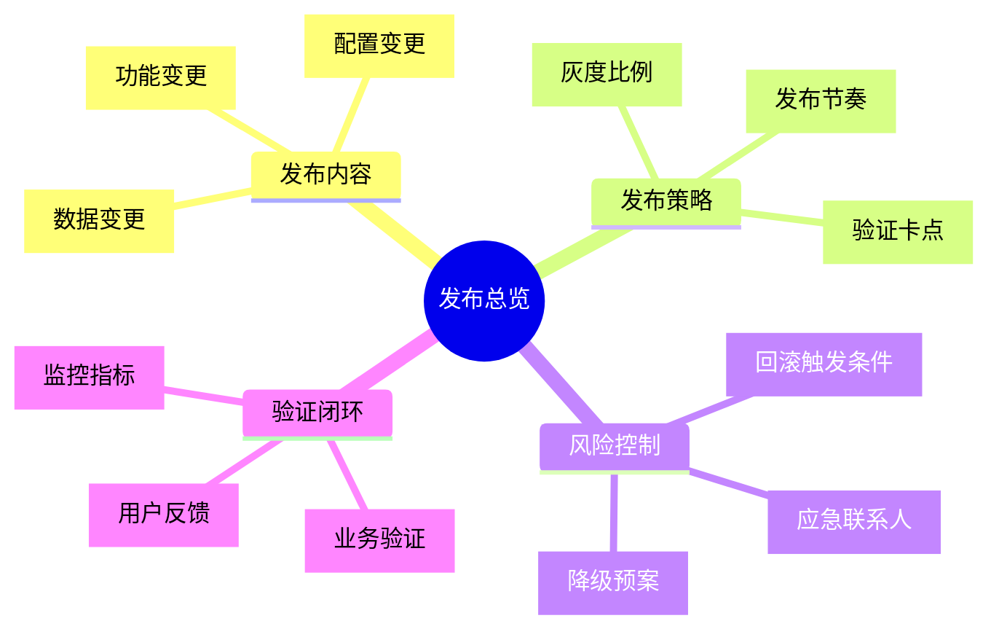
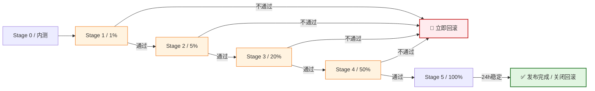
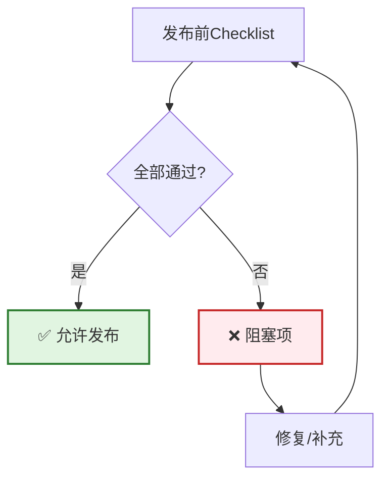
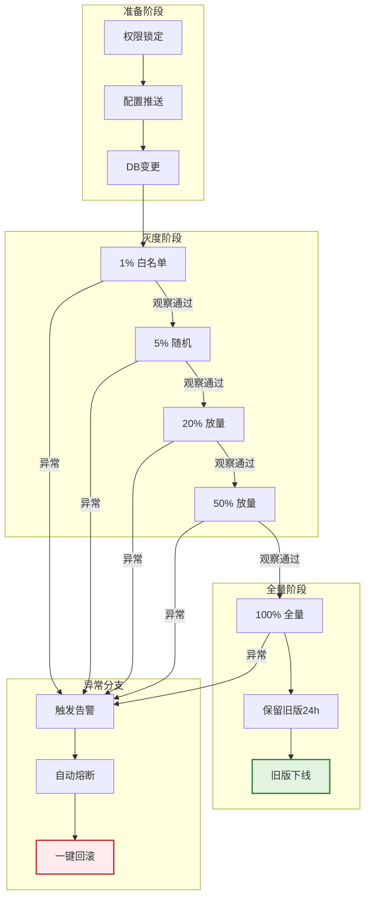
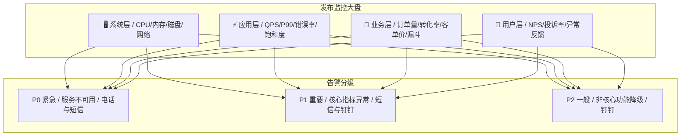
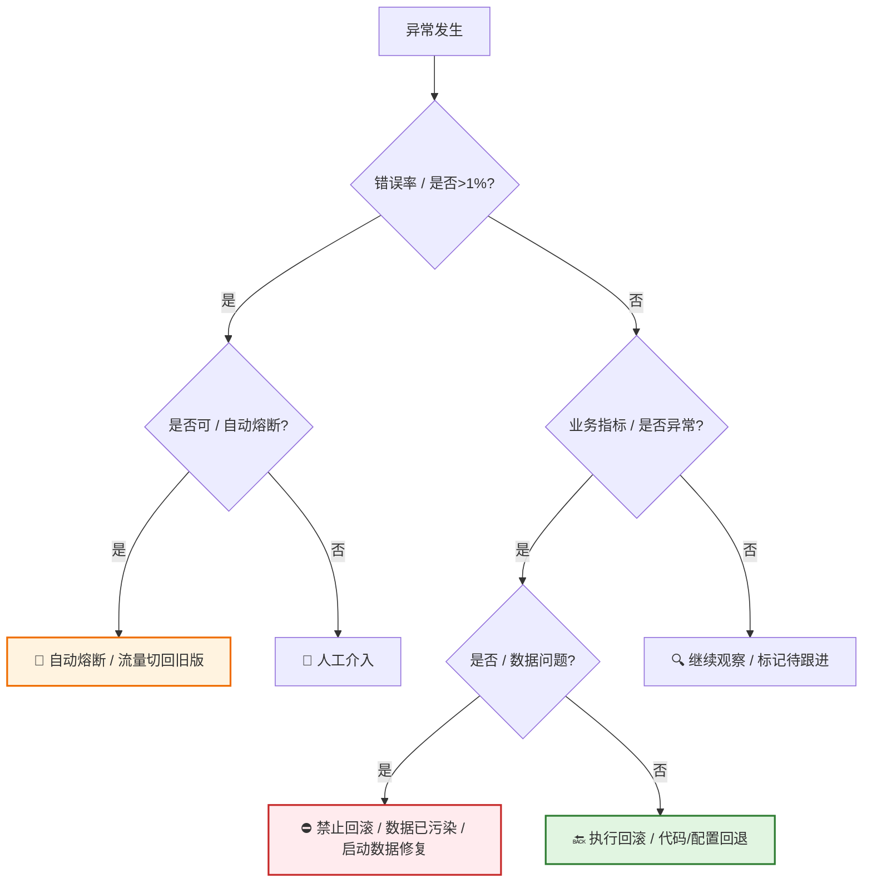
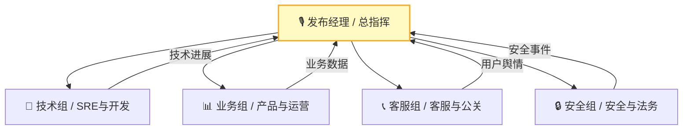

# [产品/系统名称（英文名）] - 发布计划文档（Release Plan）

> **文档状态：** 🟡 评审中 / 🟢 已批准 / 🔴 已取消
>
> **保密级别：** 机密 / 内部公开 / 公开
>
> **版本：** vX.X
>
> **日期：** YYYY-MM-DD
>
> **撰写人：** [姓名]（发布经理 / OnCall Owner）
>
> **评审人：** [姓名/角色]
>
> **阅读对象：** [角色列表]
>
> **发布类型：** 🟢 常规迭代 / 🟡 重大变更 / 🔴 紧急修复 / 🔵 实验性灰度
>
> **发布窗口：** YYYY-MM-DD HH:mm ~ HH:mm（北京时间）
>
> **关联文档：** [Charter编号] / [BRD编号] / [PRD编号] / [TRD编号]
>
> **技术负责人：** [姓名]
>
> **产品负责人：** [姓名]

---

## 0. 文档导读

### 0.1 文档目的与适用范围

[说明本文档的目的、适用场景和不适用场景]

### 0.2 相关文档

| 文档类型 | 文件名 | 相关章节 |
|---------|--------|---------|
| [类型] | [文件名] [行号范围] | [章节描述] |

> **引用格式说明**：关联文档使用 `文件名 行号范围` 格式（如 `【模板】技术需求文档(TRD).md 3-17`），行号随文档更新可能变化，请以实际内容为准。

### 0.3 变更记录

| 版本 | 日期 | 修订人 | 变更内容 | 审核人 |
| :--- | :--- | :--- | :--- | :--- |
| v0.1 | YYYY-MM-DD | [姓名] | 初稿 |  |
| v0.2 | YYYY-MM-DD | [姓名] | 补充灰度策略与回滚SOP |  |
| v0.3 | YYYY-MM-DD | [姓名] | 发布评审通过 | [发布经理] |
| v0.4 | 2026-06-09 | 谢董 | 修复：quadrantChart 模板改为表格格式（飞书不兼容） | — |
| v0.5 | 2026-06-09 | 谢董 | 修复gantt图为表格以兼容飞书渲染 | — |

---

## 1. 执行摘要（Executive Summary）

> **值班同学/管理层导读：** 一页纸说清"发什么、怎么发、何时发、出问题怎么办"。

| 要素         | 内容                                                      |
| :----------- | :-------------------------------------------------------- |
| **发布内容** | [一句话，如：订单系统V2.1，支持秒杀库存预占+支付路由优化] |
| **影响范围** | [如：全量用户 / 仅华东区 / 仅安卓客户端]                  |
| **发布策略** | [如：金丝雀 1% → 5% → 20% → 50% → 100%，历时 72h]         |
| **核心风险** | [如：数据库不兼容变更，回滚窗口仅 30 分钟]                |
| **回滚 RTO** | [如：检测<<1min，决策<<2min，执行<<3min，总计<<5min]      |
| **值班通讯** | [钉钉群 / 飞书群 / 电话会议号]                            |



---

## 2. 发布基本信息（Release Metadata）

### 2.1 版本与代码基线

| 项目           | 内容                                                  |
| :------------- | :---------------------------------------------------- |
| **版本号**     | `v2.1.0` / `release-20260525`                         |
| **代码分支**   | `release/v2.1.0`（从 `main` 切出，Commit: `a1b2c3d`） |
| **构建产物**   | Docker Image: `registry/order-svc:v2.1.0`             |
| **配置基线**   | Config Commit: `e5f6g7h`，关联 Nacos/K8s ConfigMap    |
| **数据库基线** | Flyway/Liquibase Version: `V2.1.0__add_seckill_stock` |
| **前端资源**   | CDN Path: `https://cdn.example.com/static/v2.1.0/`    |

### 2.2 发布窗口

| 阶段                    | 时间              | 时长 | 说明                                |
| :--- | :--- | :---: | :--- |
| **封板（Code Freeze）** | 发布前 1 天 18:00 |  -   | 停止需求准入，仅接受阻塞性 Bug 修复 |
| **发布窗口开启**        | 发布日 02:00      |  4h  | 低峰期开始，避开业务高峰            |
| **灰度启动**            | 02:30             |  -   | 首批 1% 流量切入                    |
| **观察期**              | 02:30 ~ 06:00     | 3.5h | 核心指标监控，业务巡检              |
| **全量发布**            | 06:00（如通过）   |  1h  | 100% 流量，逐步摘除旧版本           |
| **发布窗口关闭**        | 10:00             |  -   | 发布经理确认后正式关闭              |

> **说明**：甘特图为飞书不兼容类型，改为表格描述。

| 阶段 | 任务 | 开始时间 | 工期 | 状态 |
|:---|:---|:---|:---:|:---:|
| 发布前 | 封板与准备 | HH:MM | 2h | ⚪ |
| 发布执行 | 首批灰度(1%) | HH:MM | 30m | ⚪ |
| 发布执行 | 监控验证 | 首批灰度完成后 | 2h | ⚪ |
| 发布执行 | 扩大灰度(5%-50%) | 监控验证完成后 | 2h | ⚪ |
| 发布执行 | 全量发布 | 扩大灰度完成后 | 1h | ⚪ |
| 发布后 | 观察与复盘 | 全量发布完成后 | 2h | ⚪ |

---

## 3. 发布范围与变更清单（Scope & Change Log）

> 精确描述本次发布包含的所有变更，是风险评估的基础。

### 3.1 变更分类矩阵

> **说明**：此象限图模板已转为表格描述。

<!--
原 quadrantChart 结构参考：
- title: 变更风险矩阵（影响面 vs 技术复杂度）
- x-axis: "低复杂度" --> "高复杂度"
- y-axis: "低影响面" --> "高影响面"
- quadrant-1: 重点盯防（高/高）
- quadrant-2: 规范执行（低/高）
- quadrant-3: 快速通过（低/低）
- quadrant-4: 技术攻坚（高/低）
- 数据点: "数据库DDL变更": [0.9, 0.95]; "秒杀核心逻辑重构": [0.8, 0.9]; "UI文案调整": [0.1, 0.2]; "新增报表接口": [0.4, 0.3]; "支付路由优化": [0.7, 0.6]
-->

| 象限 | 区域特征 | 策略建议 |
| :--- | :--- | :--- |
| 象限1（高复杂度·高影响面） | 重点盯防（高/高） | 严格评审，灰度发布，全量验证 |
| 象限2（低复杂度·高影响面） | 规范执行（低/高） | 标准流程，回归验证 |
| 象限3（低复杂度·低影响面） | 快速通过（低/低） | 简化评审，快速上线 |
| 象限4（高复杂度·低影响面） | 技术攻坚（高/低） | 技术评审，独立测试环境验证 |

| 名称 | X值 | Y值 | 象限 |
| :--- | :---: | :---: | :--- |
| 数据库DDL变更 | 0.9 | 0.95 | 象限1（重点盯防） |
| 秒杀核心逻辑重构 | 0.8 | 0.9 | 象限1（重点盯防） |
| UI文案调整 | 0.1 | 0.2 | 象限3（快速通过） |
| 新增报表接口 | 0.4 | 0.3 | 象限3（快速通过） |
| 支付路由优化 | 0.7 | 0.6 | 象限1（重点盯防） |

### 3.2 变更清单（Change List）

| 变更ID      | 类型 | 描述                                  | 关联需求 | 影响范围 | 回滚难度 | 负责人 |
| :--- | :---: | :--- | :--- | :--- | :---: | :--- |
| **CHG-001** | 功能 | 新增秒杀库存预占接口                  | REQ-088  | 交易核心 |  🔴 高   | [姓名] |
| **CHG-002** | 功能 | 支付渠道新增银联云闪付                | REQ-092  | 支付模块 |  🟡 中   | [姓名] |
| **CHG-003** | 配置 | 限流阈值从 5000 QPS 调整至 8000       | CONF-015 | 网关层   |  🟢 低   | [姓名] |
| **CHG-004** | 数据 | 订单表新增 `seckill_tag` 字段（可空） | DDL-021  | 订单库   |  🟡 中   | [姓名] |
| **CHG-005** | 修复 | 修复订单超时未自动取消 Bug            | BUG-112  | 调度服务 |  🟢 低   | [姓名] |

### 3.3 依赖项检查

| 依赖系统 | 依赖版本 |   状态    | 验证方式     |
| :------- | :------- | :-------: | :----------- |
| 用户中心 | ≥ v3.2.0 | ✅ 已就绪 | 接口契约测试 |
| 商品中心 | ≥ v2.8.1 | ✅ 已就绪 | 集成测试     |
| 支付网关 | ≥ v1.5.0 | ✅ 已就绪 | 联调通过     |
| 消息中心 | ≥ v2.0.0 | ✅ 已就绪 | 消息格式兼容 |

---

## 4. 发布策略与架构（Release Strategy）

### 4.1 发布方式选择

| 策略            | 适用场景                   | 本次是否采用 | 说明                     |
| :-------------- | :------------------------- | :----------: | :----------------------- |
| **蓝绿部署**    | 全量切换，零停机，资源翻倍 |      ❌      | 资源成本高，本次不采用   |
| **滚动发布**    | 逐台替换，节省资源         |      ❌      | 回滚慢，不适合数据库变更 |
| **金丝雀/灰度** | 小流量验证，渐进放量       |      ✅      | 本次核心策略             |
| **A/B Test**    | 对照实验，数据驱动         |      🟡      | 仅对新支付页面前端采用   |

### 4.2 灰度发布架构

> **引用说明**：详细的灰度架构设计、流量分桶算法、全链路泳道设计，请参阅 **【模板】灰度方案.md §3-4**。本文档仅概述本次发布的灰度策略。

**本次灰度策略概要**：

| 策略维度 | 本次选择 | 详细设计 | 引用文档 |
| :--- | :--- | :--- | :--- |
| **灰度模式** | [如：金丝雀+AB灰度] | 流量分桶算法 | 引用灰度方案§3.1 |
| **流量控制** | [如：按设备ID Hash] | 一致性Hash | 引用灰度方案§3.2 |
| **放量节奏** | [如：1%→5%→20%→50%→100%] | 各阶段Go/No-Go标准 | 引用灰度方案§5.2 |
| **回滚策略** | [如：秒级流量切回] | 多级止损机制 | 引用灰度方案§7.1 |

> **完整设计**：灰度架构图、泳道设计、监控体系、环境管理详见 **【模板】灰度方案.md §2-8**。

### 4.3 灰度放量计划

> **引用说明**：详细的放量节奏、阶段定义和Go/No-Go标准，请参阅 **【模板】灰度方案.md §5**。本文档仅列出本次发布的时间计划。

| 阶段 | 流量比例 | 计划开始时间 | 观察时长 | Go/No-Go 标准 | 负责人 |
| :--- | :---: | :--- | :---: | :--- | :--- |
| **Stage 1** | 1% | [时间] | 2h | P0事故=0，错误率<0.1% | [姓名] |
| **Stage 2** | 5% | [时间] | 4h | P99延迟增幅<10% | [姓名] |
| **Stage 3** | 20% | [时间] | 8h | 核心漏斗转化率无异常 | [姓名] |
| **Stage 4** | 50% | [时间] | 12h | 客服舆情无集中投诉 | [姓名] |
| **Stage 5** | 100% | [时间] | 24h | 24h无异常则关闭回滚 | [姓名] |

> **放量策略**：详细的Go/No-Go标准、用户选取策略、观察指标详见 **【模板】灰度方案.md §5.2**。

### 4.3 灰度放量策略

> 灰度必须做到"同一用户始终访问同一版本"，避免会话状态错乱。

| 阶段        | 流量比例 | 用户选取策略                      | 观察时长 | Go/No-Go 标准                   |
| :---------- | :------: | :-------------------------------- | :------: | :------------------------------ |
| **Stage 0** |    0%    | 内部测试环境 + 预发环境           |    -     | 测试用例 100% 通过              |
| **Stage 1** |    1%    | 白名单用户（内部员工+种子客户）   |    2h    | P0 事故=0，错误率<<0.1%         |
| **Stage 2** |    5%    | 按设备ID Hash 取模，Cookie sticky |    4h    | P99 延迟增幅<<10%，业务指标正常 |
| **Stage 3** |   20%    | 随机放量，保留 Stage 1/2 用户粘性 |    8h    | 核心漏斗转化率无异常波动        |
| **Stage 4** |   50%    | 扩大至半量，监控长尾问题          |   12h    | 客服舆情无集中投诉              |
| **Stage 5** |   100%   | 全量，保留 24h 回滚能力           |   24h    | 24h 无异常则关闭回滚窗口        |



---

## 5. 发布前检查清单（Pre-Release Checklist）

> 发布前必须全部勾选通过，任何一项未通过禁止进入发布窗口。

### 5.1 代码与构建

| 检查项         | 标准                            | 状态 | 验证人 |
| :--- | :--- | :---: | :--- |
| 代码 Review    | 核心逻辑至少 2 人 Approved      |  ☐   |        |
| 单元测试覆盖率 | ≥ 80%，核心模块 ≥ 90%           |  ☐   |        |
| 静态代码扫描   | SonarQube 无阻塞级漏洞          |  ☐   |        |
| 构建产物       | Docker Image 已推送到仓库并签名 |  ☐   |        |
| 配置基线       | 生产配置已合并到 `release` 分支 |  ☐   |        |

### 5.2 测试验证

| 检查项     | 标准                       | 状态 | 验证人 |
| :--- | :--- | :---: | :--- |
| 功能测试   | 所有 P0/P1 用例通过        |  ☐   |        |
| 回归测试   | 核心链路自动化回归通过     |  ☐   |        |
| 集成测试   | 与上下游系统联调通过       |  ☐   |        |
| 性能测试   | 压测达标（QPS/P99/错误率） |  ☐   |        |
| 兼容性测试 | 新老版本数据互认           |  ☐   |        |

### 5.3 数据与配置

| 检查项     | 标准                             | 状态 | 验证人 |
| :--- | :--- | :---: | :--- |
| 数据库变更 | DDL/DML 已在预发环境执行并验证   |  ☐   |        |
| 数据兼容性 | 老版本代码能读取新版本写入的数据 |  ☐   |        |
| 回滚脚本   | 已准备反向 DDL/DML 脚本并演练    |  ☐   |        |
| 配置变更   | 已提交配置中心，灰度开关就绪     |  ☐   |        |
| 开关/降级  | 功能开关已配置，可一键关闭新功能 |  ☐   |        |

### 5.4 监控与应急

| 检查项   | 标准                            | 状态 | 验证人 |
| :--- | :--- | :---: | :--- |
| 监控大盘 | 发布专属 Dashboard 已创建       |  ☐   |        |
| 告警规则 | 错误率/P99/业务指标告警已配置   |  ☐   |        |
| 日志追踪 | 全链路 Trace ID 注入确认        |  ☐   |        |
| 回滚方案 | 已文档化，回滚脚本已验证        |  ☐   |        |
| 值班安排 | OnCall 人员已确认，通讯渠道畅通 |  ☐   |        |



---

## 6. 发布执行步骤（Release Execution）

> 精确到分钟的执行手册，发布经理按此操作。

### 6.1 发布执行时间线

| 时间         | 步骤 | 操作内容                               | 负责人    | 验证方式             |
| :--- | :---: | :--- | :--- | :--- |
| **T-30min**  |  1   | 发布经理召集发布会议，确认各角色就位   | 发布经理  | 钉钉群签到           |
| **T-15min**  |  2   | 关闭非紧急发布通道，锁定生产环境权限   | SRE       | 权限系统确认         |
| **T-0min**   |  3   | 执行数据库 DDL（如新增字段，可空）     | DBA       | 字段存在性检查       |
| **T+5min**   |  4   | 部署灰度版本至首批 1% 节点             | SRE       | K8s Pod 就绪探针通过 |
| **T+10min**  |  5   | 开启灰度流量，白名单用户验证           | 发布经理  | 白名单用户端到端测试 |
| **T+30min**  |  6   | **Stage 1 观察期**：监控核心指标       | OnCall    | Dashboard 无告警     |
| **T+2h30m**  |  7   | 扩大至 5% 随机流量                     | SRE       | 灰度引擎配置生效     |
| **T+6h30m**  |  8   | **Stage 2 观察期**：业务指标巡检       | 产品/运营 | 漏斗数据正常         |
| **T+14h30m** |  9   | 扩大至 20% 流量                        | SRE       | -                    |
| **T+22h30m** |  10  | **Stage 3 观察期**：长尾问题排查       | 技术      | 错误日志无新增异常   |
| **T+30h**    |  11  | 扩大至 50% 流量                        | SRE       | -                    |
| **T+42h**    |  12  | **Stage 4 观察期**：全场景覆盖         | QA        | 回归测试抽样         |
| **T+54h**    |  13  | 全量 100%，旧版本保留 24h              | SRE       | 流量 100% 切入新版本 |
| **T+78h**    |  14  | **发布完成**，旧版本下线，关闭回滚窗口 | 发布经理  | 资源回收确认         |

### 6.2 发布执行流程图



---

## 7. 监控与验证方案（Monitoring & Validation）

### 7.1 监控看板设计



### 7.2 核心监控指标与阈值

| 层级     | 指标           | 基线值 | 告警阈值    | 熔断阈值   | 采集频率 |
| :------- | :------------- | :----- | :---------- | :--------- | :------: |
| **系统** | CPU 使用率     | 45%    | > 70%       | > 85%      |   1min   |
| **系统** | 内存使用率     | 60%    | > 80%       | > 90%      |   1min   |
| **应用** | QPS            | 5000   | 波动 > ±20% | -          |   1min   |
| **应用** | P99 延迟       | 120ms  | > 200ms     | > 500ms    |   1min   |
| **应用** | 错误率         | 0.05%  | > 0.5%      | > 1%       |   1min   |
| **应用** | GC 停顿        | 50ms   | > 200ms     | > 500ms    |   5min   |
| **业务** | 订单创建成功率 | 99.9%  | < 99.5%     | < 99%      |   5min   |
| **业务** | 支付成功率     | 99.5%  | < 99%       | < 98%      |   5min   |
| **业务** | 核心漏斗转化率 | 12%    | 跌幅 > 10%  | 跌幅 > 20% |  15min   |
| **用户** | 客服投诉量     | 5件/h  | > 20件/h    | > 50件/h   |   实时   |

### 7.3 业务验证清单

| 验证项         | 验证方法                     | 负责人 | 频率        |
| :------------- | :--------------------------- | :----- | :---------- |
| 核心链路端到端 | 模拟用户下单→支付→查询全流程 | QA     | 每阶段一次  |
| 新老版本兼容性 | 老版本客户端访问新版本服务端 | QA     | Stage 1/3/5 |
| 数据一致性     | 抽样比对订单数据与金额计算   | 数据   | Stage 2/4   |
| 财务对账       | 支付流水与订单状态一致性     | 财务   | Stage 5 后  |
| 客户端体验     | 真机测试 iOS/Android/Web     | 产品   | Stage 1/3   |

---

## 8. 回滚与应急方案（Rollback & Emergency Response）

> 发布前必须明确"什么情况下回滚、谁来决策、怎么执行"。

### 8.1 回滚触发条件（Auto/Manual）

| 触发源       | 条件                                           | 响应时间 | 决策方式          |
| :----------- | :--------------------------------------------- | :------: | :---------------- |
| **自动熔断** | 错误率 > 1% 持续 2min / P99 > 500ms 持续 3min  |  < 1min  | 系统自动流量切换  |
| **监控告警** | P0 级告警产生（服务不可用/核心功能受损）       |  < 3min  | OnCall 工程师决策 |
| **业务反馈** | 核心漏斗转化率跌幅 > 20% / 客服投诉量 > 50件/h |  < 5min  | 产品+技术联合决策 |
| **安全事件** | 发现数据泄露/越权访问/资金风险                 |  < 1min  | 发布经理立即决策  |

### 8.2 回滚决策树



### 8.3 分层回滚策略

| 层级         | 回滚操作                             | 执行时长 | 适用场景       | 验证方式      |
| :----------- | :----------------------------------- | :------: | :------------- | :------------ |
| **流量层**   | 灰度引擎切回 0%，或 Nginx 权重归零   |  < 30s   | 新版本逻辑 Bug | 流量恢复      |
| **配置层**   | 配置中心回滚上一版本，推送生效       |  < 1min  | 配置错误       | 配置值校验    |
| **代码层**   | K8s 滚动更新至上一版本镜像           |  < 3min  | 代码缺陷       | Pod 镜像版本  |
| **数据层**   | 执行反向 DDL/DML（仅加法字段可忽略） |  < 5min  | 数据兼容问题   | 字段/数据校验 |
| **全量回滚** | 同时执行代码+配置+数据回滚           |  < 5min  | 重大事故       | 端到端验证    |

### 8.4 回滚执行手册

```markdown
## 紧急回滚 SOP（标准作业程序）

### 场景：Stage 2 发现支付成功率暴跌

1. **00:00** OnCall 收到 P0 告警"支付成功率 < 98%"
2. **00:01** OnCall 在发布群 @发布经理 + @技术负责人，确认异常
3. **00:02** 发布经理决策：执行回滚
4. **00:03** SRE 执行：
   - 灰度引擎：将 V2.1 流量权重调至 0%
   - K8s：启动 V1.9 镜像滚动扩容，逐步替换 V2.1 Pod
   - 配置中心：回滚支付渠道配置至上一版本
5. **00:05** 验证：监控 Dashboard 确认流量 100% 走 V1.9
6. **00:08** 业务验证：QA 执行一笔支付，确认成功率恢复
7. **00:10** 发布经理宣布：回滚完成，进入事故复盘流程
8. **后续** 保留 V2.1 Pod 日志与 HeapDump，供问题定位
```

---

## 9. 风险评估与定级（Risk Assessment）

> 基于回滚风险评估框架，对本次发布进行风险定级。

### 9.1 风险维度评估

| 维度       | 风险项                         | 等级  | 说明                       |
| :--------- | :----------------------------- | :---: | :------------------------- |
| **数据库** | DDL 新增字段（可空，有默认值） | 🟡 中 | 老版本兼容，回滚可忽略字段 |
| **数据库** | 无 DML 数据迁移脚本            | 🟢 低 | 无数据污染风险             |
| **接口**   | 新增接口，老接口不变           | 🟢 低 | 完全兼容                   |
| **接口**   | 修改核心支付回调逻辑           | 🔴 高 | 不兼容变更，必须前后端对齐 |
| **配置**   | 限流阈值调整                   | 🟡 中 | 过高可能导致雪崩           |
| **客户端** | 前端资源版本号切换             | 🟢 低 | CDN 可快速回滚             |
| **依赖**   | 依赖支付网关新版本             | 🟡 中 | 需确认联调通过             |

### 9.2 综合风险定级

> **说明**：此象限图模板已转为表格描述。

<!--
原 quadrantChart 结构参考：
- title: 发布风险热力图（回滚难度 vs 业务影响）
- x-axis: "低回滚难度" --> "高回滚难度"
- y-axis: "低业务影响" --> "高业务影响"
- quadrant-1: 高风险（高影响/难回滚）
- quadrant-2: 重点观察（高影响/易回滚）
- quadrant-3: 低风险（低影响/易回滚）
- quadrant-4: 技术债务（低影响/难回滚）
- 数据点: "本次发布综合": [0.6, 0.7]; "理想低风险": [0.2, 0.2]; "数据库DDL": [0.5, 0.6]; "支付逻辑变更": [0.8, 0.9]
-->

| 象限 | 区域特征 | 策略建议 |
| :--- | :--- | :--- |
| 象限1（高回滚难度·高影响） | 高风险（高影响/难回滚） | 灰度发布+回滚SOP+现场值班 |
| 象限2（低回滚难度·高影响） | 重点观察（高影响/易回滚） | 监控告警，随时回滚 |
| 象限3（低回滚难度·低影响） | 低风险（低影响/易回滚） | 常规流程，标准操作 |
| 象限4（高回滚难度·低影响） | 技术债务（低影响/难回滚） | 评估回滚方案，纳入迭代 |

| 名称 | X值 | Y值 | 象限 |
| :--- | :---: | :---: | :--- |
| 本次发布综合 | 0.6 | 0.7 | 象限1（高风险） |
| 理想低风险 | 0.2 | 0.2 | 象限3（低风险） |
| 数据库DDL | 0.5 | 0.6 | 象限1（高风险） |
| 支付逻辑变更 | 0.8 | 0.9 | 象限1（高风险） |

**综合定级：** 🟡 **中风险**  
**发布策略要求：** 必须采用灰度发布，禁止直接全量；回滚窗口保留 ≥ 24h；发布期间核心人员现场值班。

---

## 10. 沟通与值班机制（Communication & OnCall）

### 10.1 发布通讯架构



### 10.2 值班安排

| 角色           | 姓名   | 职责                 | 联系方式  | 待命时段     |
| :------------- | :----- | :------------------- | :-------- | :----------- |
| **发布经理**   | [姓名] | 总指挥，回滚决策权   | 手机/钉钉 | 发布窗口全程 |
| **技术负责人** | [姓名] | 技术问题定位与修复   | 手机/钉钉 | 发布窗口全程 |
| **SRE 运维**   | [姓名] | 发布执行、监控、扩容 | 手机/钉钉 | 发布窗口全程 |
| **DBA**        | [姓名] | 数据库变更与回滚     | 手机/钉钉 | T-1h ~ T+2h  |
| **产品负责人** | [姓名] | 业务验证、用户反馈   | 手机/钉钉 | T+2h ~ T+78h |
| **客服负责人** | [姓名] | 舆情监控、用户安抚   | 手机/钉钉 | T+2h ~ T+78h |

### 10.3 信息同步机制

| 时机       | 内容                         | 渠道          | 受众              |
| :--------- | :--------------------------- | :------------ | :---------------- |
| 发布前 1h  | 发布预告，提醒各组就位       | 钉钉群        | 全项目组          |
| 每阶段通过 | "Stage X 通过，进入下一阶段" | 钉钉群        | 全项目组          |
| 异常触发   | 告警详情 + 处置进展          | 钉钉群 + 电话 | 核心值班组        |
| 回滚决策   | 回滚原因 + 预计恢复时间      | 钉钉群 + 邮件 | 管理层 + 全项目组 |
| 发布完成   | 发布成功，关闭窗口           | 钉钉群 + 邮件 | 全项目组          |

---

## 11. 发布后复盘（Post-Mortem）

> 无论发布成功与否，均需在 48h 内完成复盘。

### 11.1 复盘模板

| 项目            | 内容                                           |
| :-------------- | :--------------------------------------------- |
| **发布结果**    | ✅ 成功 / ❌ 回滚 / ⚠️ 带病上线                |
| **实际耗时**    | 从 Stage 1 到 Stage 5 实际用时 [X]h            |
| **异常事件**    | [如无填"无"；如有描述问题现象、根因、修复方式] |
| **监控表现**    | [核心指标实际曲线与基线对比]                   |
| **决策回顾**    | [灰度节奏是否合理？回滚决策是否及时？]         |
| **改进项**      | [至少 3 条可落地的改进 Action]                 |
| **Action 跟踪** | [Owner + Deadline]                             |

### 11.2 复盘会议议程


---

## 12. 附录（Appendix）

### 12.1 术语表

| 术语               | 定义                                    |
| :----------------- | :-------------------------------------- |
| **RTO**            | Recovery Time Objective，恢复时间目标   |
| **RPO**            | Recovery Point Objective，恢复点目标    |
| **金丝雀发布**     | Canary Release，小流量验证后逐步放量    |
| **蓝绿部署**       | Blue-Green Deployment，两套环境瞬时切换 |
| **滚动发布**       | Rolling Update，逐台替换实例            |
| **Sticky Session** | 同一用户始终路由到同一版本              |
| **Code Freeze**    | 封板，停止新需求准入                    |

### 12.2 关联文档

| 文档                | 编号          | 链接   |
| :------------------ | :------------ | :----- |
| 产品需求文档（PRD） | PRD-2026-XXX  | [链接] |
| 架构设计文档（ADD） | ADD-2026-XXX  | [链接] |
| 测试报告            | TEST-2026-XXX | [链接] |
| 数据字典            | DD-2026-XXX   | [链接] |
| 变更管理单          | CR-2026-XXX   | [链接] |
## 13. 发布评审签核（Release Review Sign-off）

> 发布前必须由以下角色联合评审并签字（或电子签批）。

| 角色               | 姓名 | 签字 | 日期 | 评审意见                  |
| :--- | :--- | :---: | :---: | :--- |
| **发布经理**       |      |      |      | [批准/驳回/需补充]        |
| **技术负责人**     |      |      |      | [代码/架构风险已确认]     |
| **测试负责人**     |      |      |      | [测试覆盖率/用例已确认]   |
| **SRE/运维负责人** |      |      |      | [监控/容量/回滚已确认]    |
| **产品负责人**     |      |      |      | [业务影响/用户沟通已确认] |
| **安全负责人**     |      |      |      | [安全扫描/合规已确认]     |
| **DBA**            |      |      |      | [数据库变更/回滚已确认]   |
