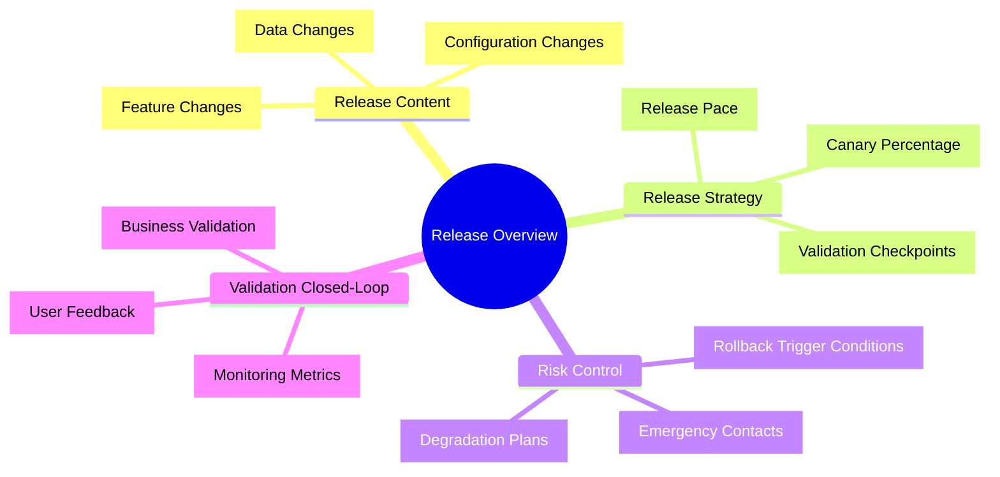
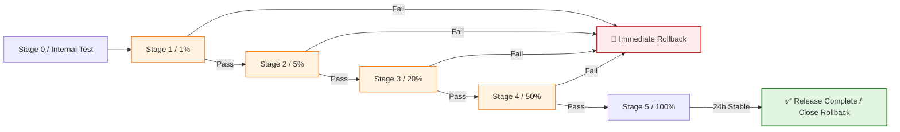
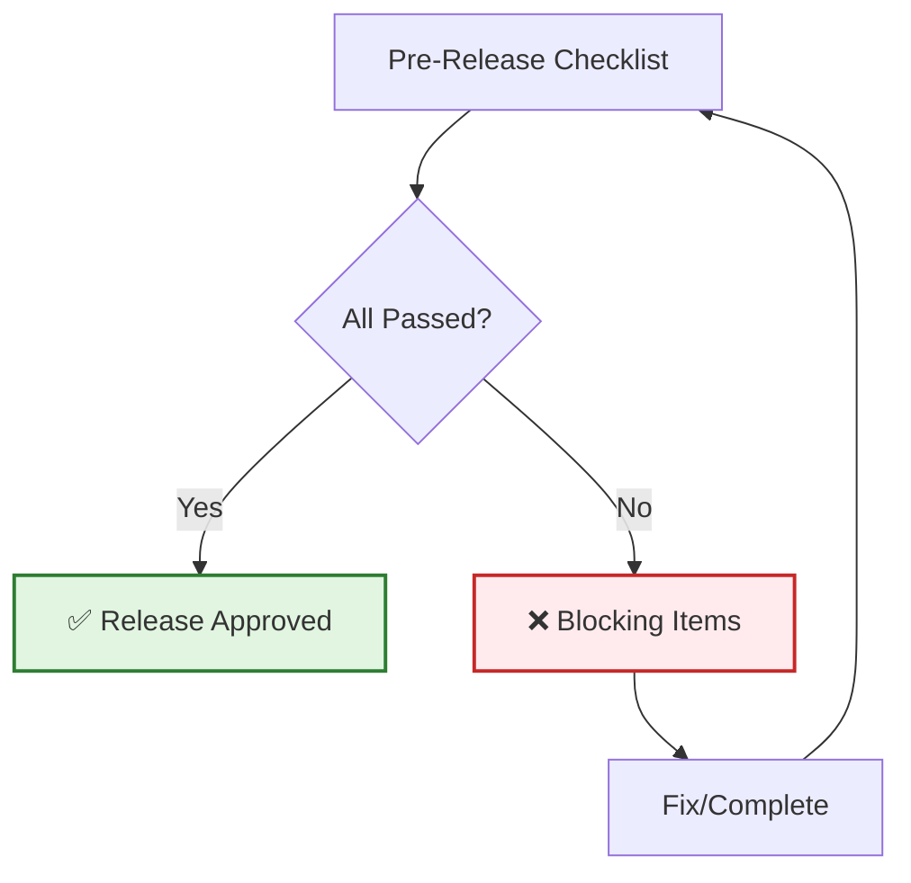
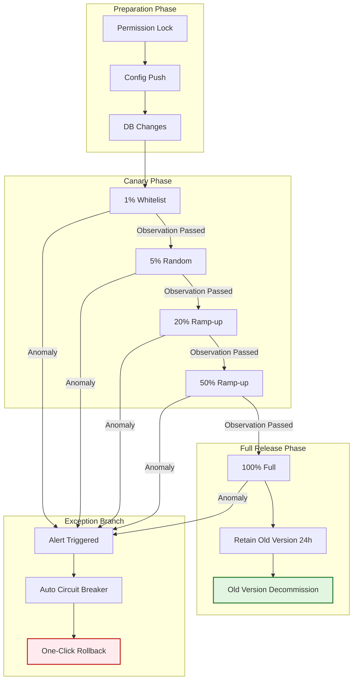
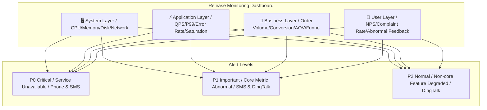
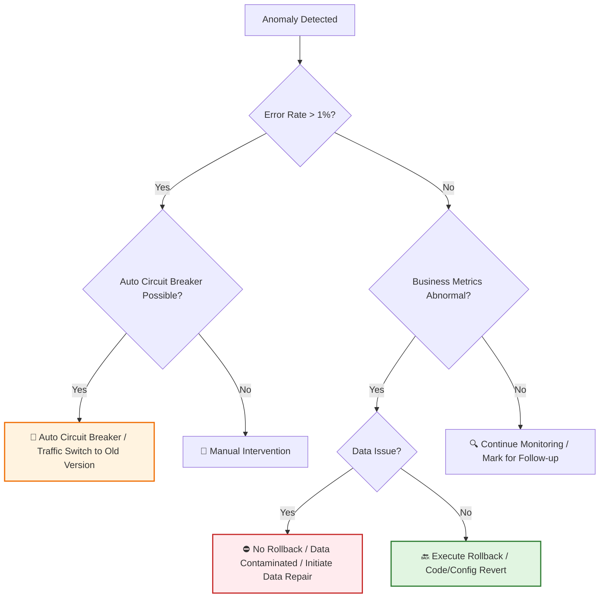
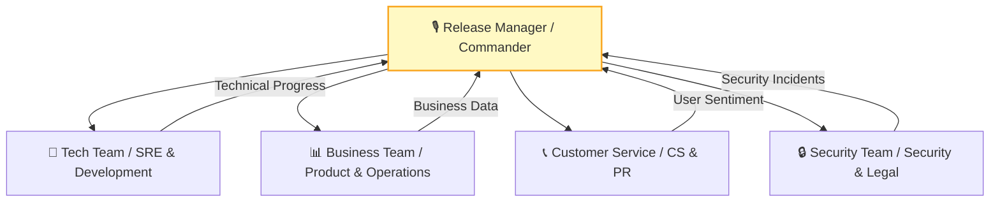
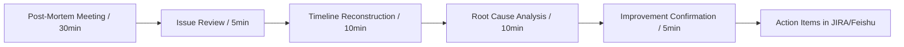

# [Product/System Name (English)] - Release Plan Document

> **Document Status:** 🟡 Under Review / 🟢 Approved / 🔴 Cancelled
>
> **Confidentiality Level:** Confidential / Internal / Public
>
> **Version:** vX.X
>
> **Date:** YYYY-MM-DD
>
> **Author:** [Name] (Release Manager / OnCall Owner)
>
> **Reviewer:** [Name/Role]
>
> **Audience:** [Role List]
>
> **Release Type:** 🟢 Regular Iteration / 🟡 Major Change / 🔴 Emergency Fix / 🔵 Experimental Canary
>
> **Release Window:** YYYY-MM-DD HH:mm ~ HH:mm (Beijing Time)
>
> **Related Documents:** [Charter ID] / [BRD ID] / [PRD ID] / [TRD ID]
>
> **Tech Lead:** [Name]
>
> **Product Owner:** [Name]

---

## 0. Document Guide

### 0.1 Document Purpose & Scope

[Describe the purpose, applicable scenarios, and non-applicable scenarios of this document]

### 0.2 Related Documents

| Document Type | Filename | Related Sections |
|---------|--------|---------|
| [Type] | [Filename] [Line Range] | [Section Description] |

> **Reference Format**: Related documents use the `filename line range` format (e.g., `【Template】Technical Requirements Document (TRD).md 3-17`). Line numbers may change as documents are updated; refer to the actual content.

### 0.3 Change Log

| Version | Date | Author | Changes | Reviewer |
| :--- | :--- | :--- | :--- | :--- |
| v0.1 | YYYY-MM-DD | [Name] | Initial draft |  |
| v0.2 | YYYY-MM-DD | [Name] | Added canary strategy and rollback SOP |  |
| v0.3 | YYYY-MM-DD | [Name] | Release review passed | [Release Manager] |
| v0.4 | 2026-06-09 | Xie Dong | Fix: quadrantChart template changed to table format (Feishu incompatible) | — |
| v0.5 | 2026-06-09 | Xie Dong | Fix gantt chart to table for Feishu rendering compatibility | — |

---

## 1. Executive Summary

> **OnCall / Management Guide:** One page explaining "what to release, how to release, when to release, and what to do if something goes wrong."

| Element | Content |
| :----------- | :-------------------------------------------------------- |
| **Release Content** | [One sentence, e.g.: Order System V2.1, supporting flash sale stock pre-allocation + payment routing optimization] |
| **Impact Scope** | [e.g.: All users / East China only / Android clients only] |
| **Release Strategy** | [e.g.: Canary 1% → 5% → 20% → 50% → 100%, over 72h] |
| **Core Risks** | [e.g.: Database incompatible changes, rollback window only 30 minutes] |
| **Rollback RTO** | [e.g.: Detection <<1min, Decision <<2min, Execution <<3min, Total <<5min] |
| **OnCall Communication** | [DingTalk group / Feishu group / Conference call number] |



---

## 2. Release Metadata

### 2.1 Version & Code Baseline

| Item | Content |
| :------------- | :---------------------------------------------------- |
| **Version** | `v2.1.0` / `release-20260525` |
| **Code Branch** | `release/v2.1.0` (cut from `main`, Commit: `a1b2c3d`) |
| **Build Artifact** | Docker Image: `registry/order-svc:v2.1.0` |
| **Config Baseline** | Config Commit: `e5f6g7h`, linked Nacos/K8s ConfigMap |
| **Database Baseline** | Flyway/Liquibase Version: `V2.1.0__add_seckill_stock` |
| **Frontend Assets** | CDN Path: `https://cdn.example.com/static/v2.1.0/` |

### 2.2 Release Window

| Phase | Time | Duration | Notes |
| :--- | :--- | :---: | :--- |
| **Code Freeze** | Release-1 day 18:00 | - | Stop feature admission, only accept blocking bug fixes |
| **Release Window Opens** | Release day 02:00 | 4h | Start during off-peak hours, avoid business peak |
| **Canary Start** | 02:30 | - | First batch 1% traffic cut-in |
| **Observation Period** | 02:30 ~ 06:00 | 3.5h | Core metrics monitoring, business inspection |
| **Full Release** | 06:00 (if passed) | 1h | 100% traffic, gradually remove old version |
| **Release Window Closes** | 10:00 | - | Officially closed after Release Manager confirmation |

> **Note**: Gantt chart is incompatible with Feishu; replaced with table description.

| Phase | Task | Start Time | Duration | Status |
|:---|:---|:---|:---:|:---:|
| Pre-release | Code freeze & preparation | HH:MM | 2h | ⚪ |
| Release execution | First batch canary (1%) | HH:MM | 30m | ⚪ |
| Release execution | Monitoring verification | After first canary | 2h | ⚪ |
| Release execution | Expand canary (5%-50%) | After monitoring verification | 2h | ⚪ |
| Release execution | Full release | After canary expansion | 1h | ⚪ |
| Post-release | Observation & review | After full release | 2h | ⚪ |

---

## 3. Scope & Change Log

> Accurately describe all changes included in this release, forming the basis of risk assessment.

### 3.1 Change Classification Matrix

> **Note**: This quadrant chart template has been converted to a table description.

<!--
Original quadrantChart structure reference:
- title: Change Risk Matrix (Impact vs Technical Complexity)
- x-axis: "Low Complexity" --> "High Complexity"
- y-axis: "Low Impact" --> "High Impact"
- quadrant-1: Key Watch (High/High)
- quadrant-2: Standard Execution (Low/High)
- quadrant-3: Quick Pass (Low/Low)
- quadrant-4: Technical Challenge (High/Low)
- Data points: "Database DDL Change": [0.9, 0.95]; "Flash Sale Core Logic Refactor": [0.8, 0.9]; "UI Copy Adjustment": [0.1, 0.2]; "New Report API": [0.4, 0.3]; "Payment Routing Optimization": [0.7, 0.6]
-->

| Quadrant | Region Characteristics | Recommended Strategy |
| :--- | :--- | :--- |
| Quadrant 1 (High Complexity · High Impact) | Key Watch (High/High) | Strict review, canary release, full validation |
| Quadrant 2 (Low Complexity · High Impact) | Standard Execution (Low/High) | Standard process, regression validation |
| Quadrant 3 (Low Complexity · Low Impact) | Quick Pass (Low/Low) | Simplified review, quick deployment |
| Quadrant 4 (High Complexity · Low Impact) | Technical Challenge (High/Low) | Technical review, independent test environment validation |

| Name | X Value | Y Value | Quadrant |
| :--- | :---: | :---: | :--- |
| Database DDL Change | 0.9 | 0.95 | Quadrant 1 (Key Watch) |
| Flash Sale Core Logic Refactor | 0.8 | 0.9 | Quadrant 1 (Key Watch) |
| UI Copy Adjustment | 0.1 | 0.2 | Quadrant 3 (Quick Pass) |
| New Report API | 0.4 | 0.3 | Quadrant 3 (Quick Pass) |
| Payment Routing Optimization | 0.7 | 0.6 | Quadrant 1 (Key Watch) |

### 3.2 Change List

| Change ID | Type | Description | Related Requirement | Impact Scope | Rollback Difficulty | Owner |
| :--- | :---: | :--- | :--- | :--- | :---: | :--- |
| **CHG-001** | Feature | New flash sale stock pre-allocation API | REQ-088 | Transaction core | 🔴 High | [Name] |
| **CHG-002** | Feature | Payment channel adds UnionPay QuickPass | REQ-092 | Payment module | 🟡 Medium | [Name] |
| **CHG-003** | Config | Rate limit threshold adjusted from 5000 to 8000 QPS | CONF-015 | Gateway layer | 🟢 Low | [Name] |
| **CHG-004** | Data | Order table adds `seckill_tag` field (nullable) | DDL-021 | Order DB | 🟡 Medium | [Name] |
| **CHG-005** | Fix | Fix order timeout auto-cancel bug | BUG-112 | Scheduler service | 🟢 Low | [Name] |

### 3.3 Dependency Check

| Dependency System | Required Version | Status | Validation Method |
| :------- | :------- | :-------: | :----------- |
| User Center | ≥ v3.2.0 | ✅ Ready | API contract testing |
| Product Center | ≥ v2.8.1 | ✅ Ready | Integration testing |
| Payment Gateway | ≥ v1.5.0 | ✅ Ready | Joint debugging passed |
| Message Center | ≥ v2.0.0 | ✅ Ready | Message format compatibility |

---

## 4. Release Strategy

### 4.1 Release Method Selection

| Strategy | Applicable Scenario | This Release | Notes |
| :-------------- | :------------------------- | :----------: | :----------------------- |
| **Blue-Green Deployment** | Full switchover, zero downtime, double resources | ❌ | High resource cost, not used this time |
| **Rolling Update** | Instance-by-instance replacement, resource-efficient | ❌ | Slow rollback, unsuitable for database changes |
| **Canary/Gray Release** | Small traffic validation, gradual ramp-up | ✅ | Core strategy for this release |
| **A/B Test** | Controlled experiment, data-driven | 🟡 | Only for new payment page frontend |

### 4.2 Canary Release Architecture

> **Reference**: For detailed canary architecture design, traffic bucketing algorithm, and end-to-end swimlane design, see **【Template】Gray Release Plan.md §3-4**. This document only outlines the canary strategy for this release.

**Canary Strategy Summary for This Release**:

| Strategy Dimension | This Selection | Detailed Design | Reference Document |
| :--- | :--- | :--- | :--- |
| **Canary Mode** | [e.g., Canary + AB Gray] | Traffic bucketing algorithm | Ref Gray Release Plan §3.1 |
| **Traffic Control** | [e.g., Device ID Hash] | Consistent Hash | Ref Gray Release Plan §3.2 |
| **Ramp-up Pace** | [e.g., 1%→5%→20%→50%→100%] | Stage Go/No-Go criteria | Ref Gray Release Plan §5.2 |
| **Rollback Strategy** | [e.g., Sub-second traffic switchback] | Multi-level mitigation | Ref Gray Release Plan §7.1 |

> **Complete Design**: For canary architecture diagram, swimlane design, monitoring system, and environment management, see **【Template】Gray Release Plan.md §2-8**.

### 4.3 Canary Ramp-up Plan

> **Reference**: For detailed ramp-up pace, stage definitions, and Go/No-Go criteria, see **【Template】Gray Release Plan.md §5**. This document only lists the timeline for this release.

| Stage | Traffic % | Planned Start | Observation Duration | Go/No-Go Criteria | Owner |
| :--- | :---: | :--- | :---: | :--- | :--- |
| **Stage 1** | 1% | [Time] | 2h | P0 incidents = 0, error rate <0.1% | [Name] |
| **Stage 2** | 5% | [Time] | 4h | P99 latency increase <10% | [Name] |
| **Stage 3** | 20% | [Time] | 8h | Core funnel conversion normal | [Name] |
| **Stage 4** | 50% | [Time] | 12h | No concentrated customer complaints | [Name] |
| **Stage 5** | 100% | [Time] | 24h | No anomalies in 24h then close rollback | [Name] |

> **Ramp-up Strategy**: For detailed Go/No-Go criteria, user selection strategy, and observation metrics, see **【Template】Gray Release Plan.md §5.2**.

### 4.4 Canary Ramp-up Strategy

> Canary must ensure "the same user always accesses the same version" to avoid session state confusion.

| Stage | Traffic % | User Selection Strategy | Observation Duration | Go/No-Go Criteria |
| :---------- | :------: | :-------------------------------- | :------: | :------------------------------ |
| **Stage 0** | 0% | Internal test + pre-production | - | Test cases 100% passed |
| **Stage 1** | 1% | Whitelist users (internal employees + seed customers) | 2h | P0 incidents = 0, error rate <<0.1% |
| **Stage 2** | 5% | Device ID Hash modulo, Cookie sticky | 4h | P99 latency increase <<10%, business metrics normal |
| **Stage 3** | 20% | Random ramp-up, retain Stage 1/2 user stickiness | 8h | Core funnel conversion rate no abnormal fluctuations |
| **Stage 4** | 50% | Expand to half volume, monitor long-tail issues | 12h | No concentrated customer complaints |
| **Stage 5** | 100% | Full volume, retain 24h rollback capability | 24h | No anomalies in 24h then close rollback window |



---

## 5. Pre-Release Checklist

> All items must pass before entering the release window. No item may be skipped.

### 5.1 Code & Build

| Check Item | Standard | Status | Verifier |
| :--- | :--- | :---: | :--- |
| Code Review | Core logic approved by at least 2 people | ☐ | |
| Unit Test Coverage | ≥ 80%, core modules ≥ 90% | ☐ | |
| Static Code Scan | SonarQube no blocking vulnerabilities | ☐ | |
| Build Artifacts | Docker Image pushed to registry and signed | ☐ | |
| Config Baseline | Production config merged to `release` branch | ☐ | |

### 5.2 Test Validation

| Check Item | Standard | Status | Verifier |
| :--- | :--- | :---: | :--- |
| Functional Testing | All P0/P1 test cases passed | ☐ | |
| Regression Testing | Core path automated regression passed | ☐ | |
| Integration Testing | Joint testing with upstream/downstream systems passed | ☐ | |
| Performance Testing | Load test standards met (QPS/P99/Error Rate) | ☐ | |
| Compatibility Testing | New and old version data mutually recognized | ☐ | |

### 5.3 Data & Configuration

| Check Item | Standard | Status | Verifier |
| :--- | :--- | :---: | :--- |
| Database Changes | DDL/DML executed and validated in pre-production | ☐ | |
| Data Compatibility | Old version code can read data written by new version | ☐ | |
| Rollback Scripts | Reverse DDL/DML scripts prepared and rehearsed | ☐ | |
| Configuration Changes | Submitted to config center, canary switch ready | ☐ | |
| Feature Flags/Degradation | Feature switches configured, new features can be disabled with one click | ☐ | |

### 5.4 Monitoring & Emergency Response

| Check Item | Standard | Status | Verifier |
| :--- | :--- | :---: | :--- |
| Monitoring Dashboard | Release-specific Dashboard created | ☐ | |
| Alert Rules | Error rate/P99/business metrics alerts configured | ☐ | |
| Log Tracing | Full-chain Trace ID injection confirmed | ☐ | |
| Rollback Plan | Documented, rollback scripts validated | ☐ | |
| OnCall Schedule | OnCall personnel confirmed, communication channels open | ☐ | |



---

## 6. Release Execution

> Minute-level execution playbook, to be followed by the Release Manager.

### 6.1 Release Execution Timeline

| Time | Step | Operation | Owner | Validation Method |
| :--- | :---: | :--- | :--- | :--- |
| **T-30min** | 1 | Release Manager convenes release meeting, confirms all roles are ready | Release Manager | DingTalk group check-in |
| **T-15min** | 2 | Close non-urgent release channels, lock production permissions | SRE | Permission system confirmation |
| **T-0min** | 3 | Execute database DDL (e.g., new nullable field) | DBA | Field existence check |
| **T+5min** | 4 | Deploy canary version to first batch 1% nodes | SRE | K8s Pod readiness probe passed |
| **T+10min** | 5 | Enable canary traffic, whitelist user validation | Release Manager | Whitelist user end-to-end testing |
| **T+30min** | 6 | **Stage 1 Observation**: Monitor core metrics | OnCall | Dashboard no alerts |
| **T+2h30m** | 7 | Expand to 5% random traffic | SRE | Canary engine config effective |
| **T+6h30m** | 8 | **Stage 2 Observation**: Business metrics inspection | Product/Operations | Funnel data normal |
| **T+14h30m** | 9 | Expand to 20% traffic | SRE | - |
| **T+22h30m** | 10 | **Stage 3 Observation**: Long-tail issue investigation | Tech | Error logs no new anomalies |
| **T+30h** | 11 | Expand to 50% traffic | SRE | - |
| **T+42h** | 12 | **Stage 4 Observation**: Full scenario coverage | QA | Regression test sampling |
| **T+54h** | 13 | Full 100%, old version retained 24h | SRE | 100% traffic cut to new version |
| **T+78h** | 14 | **Release Complete**, old version decommissioned, rollback window closed | Release Manager | Resource reclaim confirmed |

### 6.2 Release Execution Flowchart



---

## 7. Monitoring & Validation

### 7.1 Monitoring Dashboard Design



### 7.2 Core Monitoring Metrics & Thresholds

| Layer | Metric | Baseline | Alert Threshold | Circuit Breaker Threshold | Collection Frequency |
| :------- | :------------- | :----- | :---------- | :--------- | :------: |
| **System** | CPU Usage | 45% | > 70% | > 85% | 1min |
| **System** | Memory Usage | 60% | > 80% | > 90% | 1min |
| **Application** | QPS | 5000 | Fluctuation > ±20% | - | 1min |
| **Application** | P99 Latency | 120ms | > 200ms | > 500ms | 1min |
| **Application** | Error Rate | 0.05% | > 0.5% | > 1% | 1min |
| **Application** | GC Pause | 50ms | > 200ms | > 500ms | 5min |
| **Business** | Order Creation Success Rate | 99.9% | < 99.5% | < 99% | 5min |
| **Business** | Payment Success Rate | 99.5% | < 99% | < 98% | 5min |
| **Business** | Core Funnel Conversion | 12% | Drop > 10% | Drop > 20% | 15min |
| **User** | Customer Service Complaints | 5/h | > 20/h | > 50/h | Real-time |

### 7.3 Business Validation Checklist

| Validation Item | Validation Method | Owner | Frequency |
| :------------- | :--------------------------- | :----- | :---------- |
| Core Path End-to-End | Simulate user order→payment→query full flow | QA | Once per stage |
| Version Compatibility | Old version client accessing new version service | QA | Stage 1/3/5 |
| Data Consistency | Sample comparison of order data and amount calculations | Data | Stage 2/4 |
| Financial Reconciliation | Payment flow and order status consistency | Finance | After Stage 5 |
| Client Experience | Real device testing iOS/Android/Web | Product | Stage 1/3 |

---

## 8. Rollback & Emergency Response

> Before release, "when to rollback, who decides, and how to execute" must be clearly defined.

### 8.1 Rollback Trigger Conditions (Auto/Manual)

| Trigger Source | Condition | Response Time | Decision Method |
| :----------- | :--------------------------------------------- | :------: | :---------------- |
| **Auto Circuit Breaker** | Error rate > 1% sustained 2min / P99 > 500ms sustained 3min | < 1min | System auto traffic switch |
| **Monitoring Alert** | P0 alert generated (service unavailable/core function impaired) | < 3min | OnCall engineer decision |
| **Business Feedback** | Core funnel conversion drop > 20% / Complaints > 50/h | < 5min | Product + Tech joint decision |
| **Security Incident** | Data leak / Unauthorized access / Financial risk | < 1min | Release Manager immediate decision |

### 8.2 Rollback Decision Tree



### 8.3 Layered Rollback Strategy

| Layer | Rollback Operation | Execution Time | Applicable Scenario | Validation Method |
| :----------- | :----------------------------------- | :------: | :------------- | :------------ |
| **Traffic Layer** | Canary engine switch to 0%, or Nginx weight reset | < 30s | New version logic bug | Traffic restored |
| **Config Layer** | Config center rollback to previous version, push effective | < 1min | Configuration error | Config value verification |
| **Code Layer** | K8s rolling update to previous version image | < 3min | Code defect | Pod image version |
| **Data Layer** | Execute reverse DDL/DML (additive fields can be ignored) | < 5min | Data compatibility issue | Field/data verification |
| **Full Rollback** | Simultaneous code + config + data rollback | < 5min | Major incident | End-to-end validation |

### 8.4 Rollback Execution Playbook

```markdown
## Emergency Rollback SOP (Standard Operating Procedure)

### Scenario: Stage 2 payment success rate drop detected

1. **00:00** OnCall receives P0 alert "Payment success rate < 98%"
2. **00:01** OnCall posts in release group @Release Manager + @Tech Lead, confirming anomaly
3. **00:02** Release Manager decision: Execute rollback
4. **00:03** SRE executes:
   - Canary engine: Set V2.1 traffic weight to 0%
   - K8s: Start V1.9 image rolling expansion, gradually replace V2.1 Pods
   - Config center: Rollback payment channel configuration to previous version
5. **00:05** Validation: Monitoring Dashboard confirms 100% traffic on V1.9
6. **00:08** Business validation: QA executes one payment, confirms success rate restored
7. **00:10** Release Manager announces: Rollback complete, enter incident post-mortem process
8. **Follow-up** Retain V2.1 Pod logs and HeapDump for issue investigation
```

---

## 9. Risk Assessment

> Based on the rollback risk assessment framework, perform risk rating for this release.

### 9.1 Risk Dimension Assessment

| Dimension | Risk Item | Level | Notes |
| :--------- | :----------------------------- | :---: | :------------------------- |
| **Database** | DDL adds field (nullable, with default) | 🟡 Medium | Old version compatible, rollback can ignore field |
| **Database** | No DML data migration scripts | 🟢 Low | No data contamination risk |
| **API** | New API added, old API unchanged | 🟢 Low | Fully compatible |
| **API** | Modified core payment callback logic | 🔴 High | Incompatible change, must align frontend/backend |
| **Config** | Rate limit threshold adjustment | 🟡 Medium | Too high may cause avalanche |
| **Client** | Frontend asset version switch | 🟢 Low | CDN can quickly rollback |
| **Dependency** | Depends on new payment gateway version | 🟡 Medium | Need to confirm joint debugging passed |

### 9.2 Overall Risk Rating

> **Note**: This quadrant chart template has been converted to a table description.

<!--
Original quadrantChart structure reference:
- title: Release Risk Heatmap (Rollback Difficulty vs Business Impact)
- x-axis: "Low Rollback Difficulty" --> "High Rollback Difficulty"
- y-axis: "Low Business Impact" --> "High Business Impact"
- quadrant-1: High Risk (High Impact/Hard to Rollback)
- quadrant-2: Key Watch (High Impact/Easy to Rollback)
- quadrant-3: Low Risk (Low Impact/Easy to Rollback)
- quadrant-4: Technical Debt (Low Impact/Hard to Rollback)
- Data points: "This Release Overall": [0.6, 0.7]; "Ideal Low Risk": [0.2, 0.2]; "Database DDL": [0.5, 0.6]; "Payment Logic Change": [0.8, 0.9]
-->

| Quadrant | Region Characteristics | Recommended Strategy |
| :--- | :--- | :--- |
| Quadrant 1 (High Rollback Difficulty · High Impact) | High Risk (High Impact/Hard to Rollback) | Canary release + Rollback SOP + On-site OnCall |
| Quadrant 2 (Low Rollback Difficulty · High Impact) | Key Watch (High Impact/Easy to Rollback) | Monitor alerts, rollback anytime |
| Quadrant 3 (Low Rollback Difficulty · Low Impact) | Low Risk (Low Impact/Easy to Rollback) | Standard process, standard operations |
| Quadrant 4 (High Rollback Difficulty · Low Impact) | Technical Debt (Low Impact/Hard to Rollback) | Evaluate rollback plan, include in iteration |

| Name | X Value | Y Value | Quadrant |
| :--- | :---: | :---: | :--- |
| This Release Overall | 0.6 | 0.7 | Quadrant 1 (High Risk) |
| Ideal Low Risk | 0.2 | 0.2 | Quadrant 3 (Low Risk) |
| Database DDL | 0.5 | 0.6 | Quadrant 1 (High Risk) |
| Payment Logic Change | 0.8 | 0.9 | Quadrant 1 (High Risk) |

**Overall Rating:** 🟡 **Medium Risk**
**Release Strategy Requirements:** Must use canary release, direct full release prohibited; rollback window retained ≥ 24h; core personnel on-site OnCall during release.

---

## 10. Communication & OnCall

### 10.1 Release Communication Architecture



### 10.2 OnCall Schedule

| Role | Name | Responsibilities | Contact | Standby Period |
| :------------- | :----- | :------------------- | :-------- | :----------- |
| **Release Manager** | [Name] | Commander, rollback decision authority | Phone/DingTalk | Full release window |
| **Tech Lead** | [Name] | Technical issue investigation & fix | Phone/DingTalk | Full release window |
| **SRE Ops** | [Name] | Release execution, monitoring, scaling | Phone/DingTalk | Full release window |
| **DBA** | [Name] | Database changes & rollback | Phone/DingTalk | T-1h ~ T+2h |
| **Product Owner** | [Name] | Business validation, user feedback | Phone/DingTalk | T+2h ~ T+78h |
| **CS Lead** | [Name] | Sentiment monitoring, user appeasement | Phone/DingTalk | T+2h ~ T+78h |

### 10.3 Information Sync Mechanism

| Timing | Content | Channel | Audience |
| :--------- | :--------------------------- | :------------ | :---------------- |
| 1h before release | Release preview, remind all teams to be ready | DingTalk group | Full project team |
| Each stage pass | "Stage X passed, proceeding to next stage" | DingTalk group | Full project team |
| Anomaly triggered | Alert details + handling progress | DingTalk group + phone | Core OnCall team |
| Rollback decision | Rollback reason + estimated recovery time | DingTalk group + email | Management + full project team |
| Release complete | Release success, close window | DingTalk group + email | Full project team |

---

## 11. Post-Mortem

> Whether the release succeeds or fails, a post-mortem must be completed within 48h.

### 11.1 Post-Mortem Template

| Item | Content |
| :-------------- | :--------------------------------------------- |
| **Release Result** | ✅ Success / ❌ Rolled back / ⚠️ Released with issues |
| **Actual Duration** | Stage 1 to Stage 5 actual time [X]h |
| **Anomaly Events** | [If none, write "none"; if any, describe issue, root cause, fix method] |
| **Monitoring Performance** | [Core metrics actual curve vs baseline comparison] |
| **Decision Review** | [Was canary pace reasonable? Was rollback decision timely?] |
| **Improvement Items** | [At least 3 actionable improvement items] |
| **Action Tracking** | [Owner + Deadline] |

### 11.2 Post-Mortem Meeting Agenda



---

## 12. Appendix

### 12.1 Glossary

| Term | Definition |
| :----------------- | :-------------------------------------- |
| **RTO** | Recovery Time Objective |
| **RPO** | Recovery Point Objective |
| **Canary Release** | Small traffic validation followed by gradual ramp-up |
| **Blue-Green Deployment** | Two environments with instant switchover |
| **Rolling Update** | Instance-by-instance replacement |
| **Sticky Session** | Same user always routed to the same version |
| **Code Freeze** | Feature freeze, stop new requirement admission |

### 12.2 Related Documents

| Document | ID | Link |
| :------------------ | :------------ | :----- |
| Product Requirements Document (PRD) | PRD-2026-XXX | [Link] |
| Architecture Design Document (ADD) | ADD-2026-XXX | [Link] |
| Test Report | TEST-2026-XXX | [Link] |
| Data Dictionary | DD-2026-XXX | [Link] |
| Change Management | CR-2026-XXX | [Link] |

## 13. Release Review Sign-off

> Before release, the following roles must jointly review and sign off (or electronically approve).

| Role | Name | Signature | Date | Review Comments |
| :--- | :--- | :---: | :---: | :--- |
| **Release Manager** | | | | [Approved / Rejected / Needs Supplement] |
| **Tech Lead** | | | | [Code/architecture risks confirmed] |
| **Test Lead** | | | | [Test coverage/test cases confirmed] |
| **SRE/Ops Lead** | | | | [Monitoring/capacity/rollback confirmed] |
| **Product Owner** | | | | [Business impact/user communication confirmed] |
| **Security Lead** | | | | [Security scan/compliance confirmed] |
| **DBA** | | | | [Database change/rollback confirmed] |
