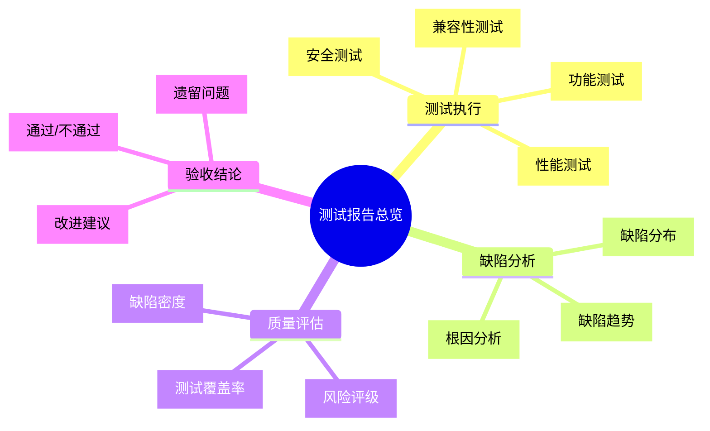
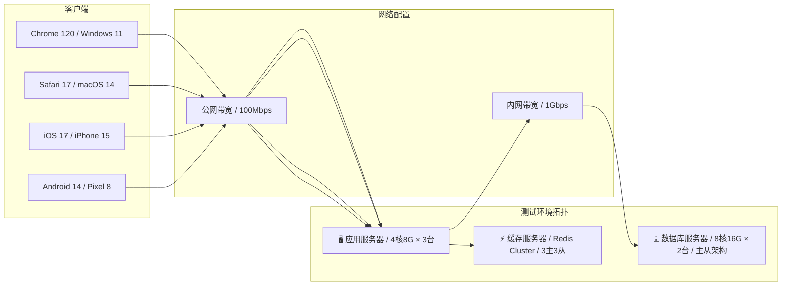
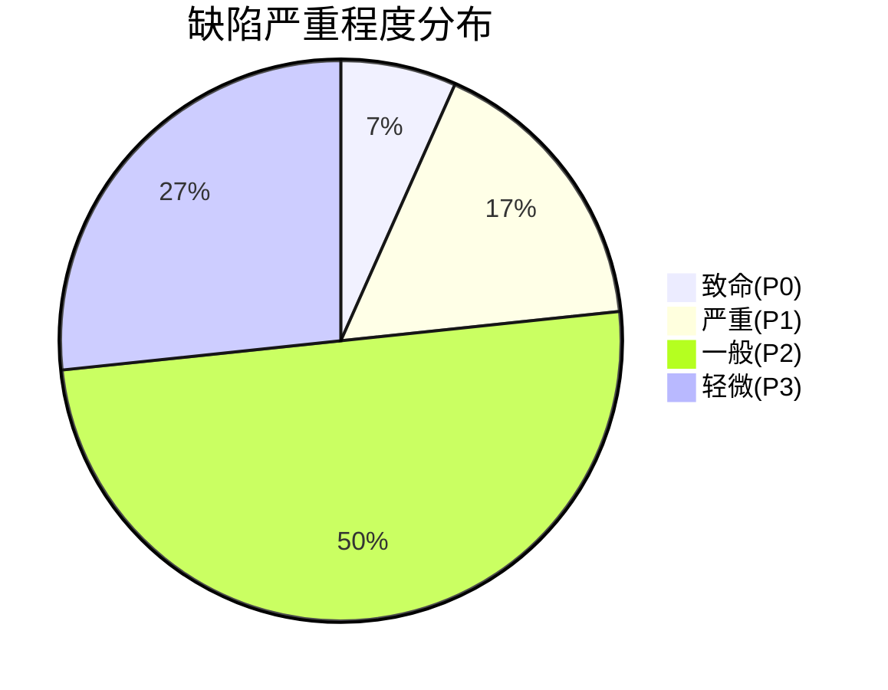
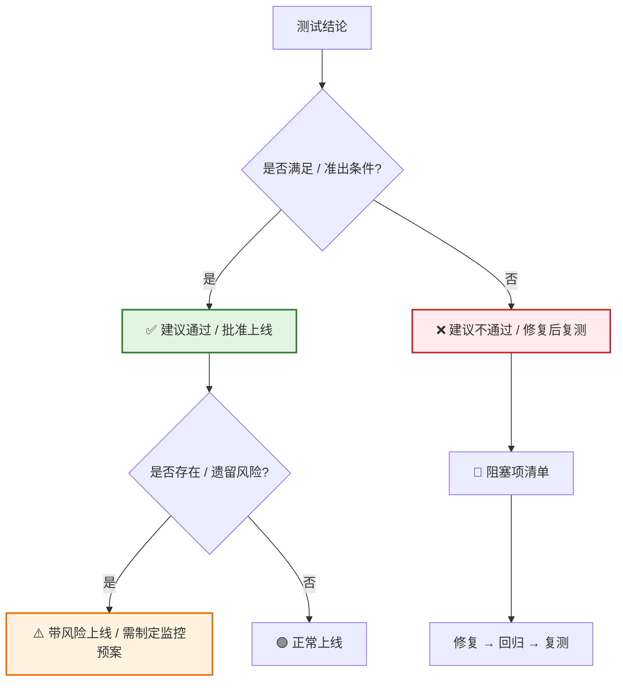

# [产品/系统名称（英文名）] - 测试报告（Test Report）

> **文档状态：** 🟡 评审中 / 🟢 已通过 / 🔴 不通过 / ⚪ 已归档
>
> **保密级别：** 机密 / 内部公开 / 公开
>
> **版本：** vX.X
>
> **日期：** YYYY-MM-DD
>
> **撰写人：** [姓名]
>
> **评审人：** [姓名/角色]
>
> **阅读对象：** [角色列表]
>
> **报告编号：** TEST-2026-XXX
>
> **关联需求：** [PRD编号] / [BRD编号]
>
> **关联发布计划：** [Release Plan编号]
>
> **测试类型：** 🟢 功能验收测试 / 🟡 回归测试 / 🔴 性能压测 / 🔵 安全渗透测试
>
> **测试周期：** YYYY-MM-DD ~ YYYY-MM-DD（共 [N] 个工作日）
>
> **测试团队：** [成员列表]

---

## 0. 文档导读

### 0.1 文档目的与适用范围

[说明本文档的目的、适用场景和不适用场景]

### 0.2 相关文档

| 文档类型 | 文件名              | 相关章节   |
| -------- | ------------------- | ---------- |
| [类型]   | [文件名] [行号范围] | [章节描述] |

> **引用格式说明**：关联文档使用 `文件名 行号范围` 格式（如 `【模板】技术需求文档(TRD).md 3-17`），行号随文档更新可能变化，请以实际内容为准。

### 0.3 变更记录

| 版本   | 日期       | 修订人 | 变更内容                                           | 审核人       |
| :----- | :--------- | :----- | :------------------------------------------------- | :----------- |
| v0.1   | YYYY-MM-DD | [姓名] | 初稿                                               |              |
| v0.2   | YYYY-MM-DD | [姓名] | 补充性能/安全测试结果                              |              |
| v0.3   | YYYY-MM-DD | [姓名] | 补充缺陷根因分析                                   |              |
| v0.4   | YYYY-MM-DD | [姓名] | 正式发布                                           | [测试负责人] |
| v0.5   | 2026-06-09 | 谢董   | 修复：quadrantChart 模板改为表格格式（飞书不兼容） | —            |
| v0.6   | 2026-06-09 | 谢董   | 修复gantt图为表格以兼容飞书渲染                    | —            |
| v0.7   | 2026-06-09 | 谢董   | 修复§3.2测试执行时间线gantt图为表格以兼容飞书渲染  | —            |
| v0.5.1 | 2026-06-09 | 谢董   | 修复xychart-beta图为表格以兼容飞书渲染             | —            |
| v0.7.1 | 2026-06-20 | 谢董   | 消息中间件示例 Kafka→Pulsar（统一事件总线规范）    | —            |

---

## 1. 执行摘要（Executive Summary）

> **管理层/发布经理 30 秒导读：** 测了什么、结果如何、能不能发。

| 要素         | 内容                                                         |
| :----------- | :----------------------------------------------------------- |
| **测试目标** | [一句话，如：验证订单系统V2.1核心功能及性能是否达到上线标准] |
| **测试范围** | [如：功能模块X个、接口Y个、性能场景Z个]                      |
| **用例执行** | 总计 [N] 条，通过 [M] 条，失败 [P] 条，通过率 [Q]%           |
| **缺陷统计** | 致命 [A] / 严重 [B] / 一般 [C] / 轻微 [D]，修复率 [R]%       |
| **核心结论** | [如：核心功能通过，P0缺陷已修复，建议批准上线]               |
| **遗留风险** | [如：1个P2缺陷待修复，不影响核心流程，建议上线后跟进]        |

---

## 2. 测试概述（Test Overview）

### 2.1 测试背景

> **引用说明**：功能验收标准、非功能需求指标、性能要求请参阅 **【模板】功能需求文档(FRD).md §8** 和 **【模板】技术需求文档(TRD).md §3-4**。本文档仅引用关键测试依据。

| 项目         | 内容                                                      | 引用文档 |
| :----------- | :-------------------------------------------------------- | :--- |
| **测试目的** | [如：验证新版本功能完整性、修复有效性、性能达标情况]      | — |
| **测试依据** | PRD/FRD/TRD中的功能需求、验收标准、性能指标 | 引用FRD§8、TRD§3-4 |
| **测试策略** | [如：黑盒功能测试为主，自动化回归为辅，性能压测验证容量]  | — |
| **准入条件** | [如：开发自测通过、冒烟测试通过、测试环境就绪]            | — |
| **准出条件** | P0/P1缺陷修复率100%、用例通过率≥95%、性能指标达标 | 引用FRD§8.1 |

> **验收标准**：详细的验收标准（Given-When-Then格式）、性能验收指标详见 **【模板】功能需求文档(FRD).md §8.1-8.2**。

### 2.2 测试环境

| 环境项       | 配置                                                |
| :----------- | :-------------------------------------------------- |
| **操作系统** | CentOS 7.9 / Windows Server 2022                    |
| **数据库**   | PostgreSQL 16.0（主从）/ Redis 7.0                  |
| **中间件**   | Nginx 1.24 / Pulsar 3.x / Elasticsearch 8.11        |
| **应用容器** | Docker 24.0 / K8s 1.28                              |
| **浏览器**   | Chrome 120 / Firefox 121 / Safari 17 / Edge 120     |
| **移动端**   | iOS 17（iPhone 15）/ Android 14（Pixel 8 / 小米14） |

### 2.3 测试工具

| 测试类型 | 工具                                 | 版本 | 用途                     |
| :------- | :----------------------------------- | :--- | :----------------------- |
| 用例管理 | TestRail / 禅道 / JIRA               | vX.X | 用例设计、执行、缺陷跟踪 |
| 接口测试 | Postman / Apifox / JMeter            | vX.X | API功能/性能测试         |
| UI自动化 | Selenium / Playwright / Cypress      | vX.X | Web端回归测试            |
| 性能压测 | JMeter / Locust / Gatling            | vX.X | 负载/压力/稳定性测试     |
| 安全扫描 | Burp Suite / OWASP ZAP               | vX.X | 渗透测试/漏洞扫描        |
| 代码覆盖 | JaCoCo / Istanbul / Coverage.py      | vX.X | 单元测试覆盖率统计       |
| 持续集成 | Jenkins / GitLab CI / GitHub Actions | vX.X | 自动化流水线             |

---

## 3. 测试执行情况（Test Execution）

### 3.1 测试用例执行统计

> **说明**：xychart-beta为飞书不兼容Mermaid类型，改为表格描述（模板示例数据）。

**测试用例执行分布**

| 测试类型   | 用例数 |
| :--------- | :----: |
| 功能测试   |  150   |
| 接口测试   |   80   |
| 性能测试   |   20   |
| 兼容性     |   40   |
| 安全测试   |   15   |
| 自动化回归 |  120   |

| 测试类型       | 用例总数 | 已执行  |  通过   |  失败  | 阻塞  | 跳过  |  通过率   |
| :------------- | :------: | :-----: | :-----: | :----: | :---: | :---: | :-------: |
| **功能测试**   |   150    |   150   |   142   |   6    |   2   |   0   |   94.7%   |
| **接口测试**   |    80    |   80    |   78    |   2    |   0   |   0   |   97.5%   |
| **性能测试**   |    20    |   20    |   18    |   2    |   0   |   0   |   90.0%   |
| **兼容性测试** |    40    |   40    |   40    |   0    |   0   |   0   |   100%    |
| **安全测试**   |    15    |   15    |   14    |   1    |   0   |   0   |   93.3%   |
| **自动化回归** |   120    |   120   |   118   |   2    |   0   |   0   |   98.3%   |
| **合计**       | **425**  | **425** | **410** | **13** | **2** | **0** | **96.5%** |

### 3.2 测试执行时间线

> **说明**：甘特图为飞书不兼容类型，改为表格描述。

| 阶段     | 任务               | 开始日期   | 结束日期   | 工期 | 状态 |
| :------- | :----------------- | :--------- | :--------- | :--: | :--: |
| 准备阶段 | 环境搭建与冒烟测试 | YYYY-MM-DD | YYYY-MM-DD |  2d  |  ⚪  |
| 执行阶段 | 功能测试执行       | YYYY-MM-DD | YYYY-MM-DD |  5d  |  ⚪  |
| 执行阶段 | 接口测试执行       | YYYY-MM-DD | YYYY-MM-DD |  4d  |  ⚪  |
| 执行阶段 | 性能压测执行       | YYYY-MM-DD | YYYY-MM-DD |  2d  |  ⚪  |
| 执行阶段 | 兼容性测试         | YYYY-MM-DD | YYYY-MM-DD |  2d  |  ⚪  |
| 执行阶段 | 安全渗透测试       | YYYY-MM-DD | YYYY-MM-DD |  2d  |  ⚪  |
| 执行阶段 | 自动化回归执行     | YYYY-MM-DD | YYYY-MM-DD |  1d  |  ⚪  |
| 收尾阶段 | 缺陷验证与回归     | YYYY-MM-DD | YYYY-MM-DD |  2d  |  ⚪  |
| 收尾阶段 | 报告编写与评审     | YYYY-MM-DD | YYYY-MM-DD |  1d  |  ⚪  |

---

## 4. 缺陷统计与分析（Defect Analysis）

### 4.1 缺陷严重程度分布

| 严重程度    | 定义                           |  数量  | 已修复 | 待修复 |  修复率   |
| :---------- | :----------------------------- | :----: | :----: | :----: | :-------: |
| **P0 致命** | 系统崩溃/数据丢失/核心流程阻断 |   2    |   2    |   0    |   100%    |
| **P1 严重** | 主要功能异常/性能严重下降      |   5    |   5    |   0    |   100%    |
| **P2 一般** | 次要功能缺陷/体验问题          |   15   |   12   |   3    |    80%    |
| **P3 轻微** | UI瑕疵/文案错误/建议优化       |   8    |   6    |   2    |    75%    |
| **合计**    |                                | **30** | **25** | **5**  | **83.3%** |

### 4.2 缺陷模块分布

> **说明**：xychart-beta为飞书不兼容Mermaid类型，改为表格描述（模板示例数据）。

**缺陷模块分布（Top 5）**

| 模块     | 缺陷数 |
| :------- | :----: |
| 订单模块 |   10   |
| 支付模块 |   8    |
| 用户中心 |   5    |
| 商品模块 |   4    |
| 消息通知 |   3    |

| 模块         | 缺陷数 | 占比  | 主要问题类型         |
| :----------- | :----: | :---: | :------------------- |
| **订单模块** |   10   | 33.3% | 状态机异常、并发问题 |
| **支付模块** |   8    | 26.7% | 回调处理、金额精度   |
| **用户中心** |   5    | 16.7% | 权限校验、数据同步   |
| **商品模块** |   4    | 13.3% | 库存扣减、价格计算   |
| **消息通知** |   3    | 10.0% | 推送延迟、模板渲染   |

### 4.3 缺陷趋势分析

<svg xmlns="http://www.w3.org/2000/svg" viewBox="0 0 600 420" style="max-width:600px;height:auto">
<rect width="600" height="420" fill="#fafafa" rx="8"/>
<text x="300" y="28" text-anchor="middle" font-size="16" font-weight="bold" fill="#333">缺陷发现与修复趋势（按日）</text>
<line x1="60" y1="370.0" x2="580" y2="370.0" stroke="#eee" stroke-width="1"/>
<text x="55" y="374.0" text-anchor="end" font-size="11" fill="#999">0</text>
<line x1="60" y1="304.0" x2="580" y2="304.0" stroke="#eee" stroke-width="1"/>
<text x="55" y="308.0" text-anchor="end" font-size="11" fill="#999">4</text>
<line x1="60" y1="238.0" x2="580" y2="238.0" stroke="#eee" stroke-width="1"/>
<text x="55" y="242.0" text-anchor="end" font-size="11" fill="#999">8</text>
<line x1="60" y1="172.0" x2="580" y2="172.0" stroke="#eee" stroke-width="1"/>
<text x="55" y="176.0" text-anchor="end" font-size="11" fill="#999">13</text>
<line x1="60" y1="106.0" x2="580" y2="106.0" stroke="#eee" stroke-width="1"/>
<text x="55" y="110.0" text-anchor="end" font-size="11" fill="#999">17</text>
<line x1="60" y1="40.0" x2="580" y2="40.0" stroke="#eee" stroke-width="1"/>
<text x="55" y="44.0" text-anchor="end" font-size="11" fill="#999">22</text>
<text x="16" y="205" text-anchor="middle" font-size="12" fill="#666" transform="rotate(-90, 16, 205)">缺陷数</text>
<line x1="60" y1="370" x2="580" y2="370" stroke="#ccc" stroke-width="1"/>
<polyline points="97.1,190.0 171.4,250.0 245.7,295.0 320.0,325.0 394.3,340.0 468.6,355.0 542.9,370.0" fill="none" stroke="#ee6666" stroke-width="2.5" stroke-linejoin="round" stroke-linecap="round"/>
<circle cx="97.1" cy="190.0" r="4" fill="#ee6666" stroke="#fff" stroke-width="1.5"/>
<text x="97.1" y="180.0" text-anchor="middle" font-size="10" fill="#ee6666" font-weight="bold">12</text>
<circle cx="171.4" cy="250.0" r="4" fill="#ee6666" stroke="#fff" stroke-width="1.5"/>
<text x="171.4" y="240.0" text-anchor="middle" font-size="10" fill="#ee6666" font-weight="bold">8</text>
<circle cx="245.7" cy="295.0" r="4" fill="#ee6666" stroke="#fff" stroke-width="1.5"/>
<text x="245.7" y="285.0" text-anchor="middle" font-size="10" fill="#ee6666" font-weight="bold">5</text>
<circle cx="320.0" cy="325.0" r="4" fill="#ee6666" stroke="#fff" stroke-width="1.5"/>
<text x="320.0" y="315.0" text-anchor="middle" font-size="10" fill="#ee6666" font-weight="bold">3</text>
<circle cx="394.3" cy="340.0" r="4" fill="#ee6666" stroke="#fff" stroke-width="1.5"/>
<text x="394.3" y="330.0" text-anchor="middle" font-size="10" fill="#ee6666" font-weight="bold">2</text>
<circle cx="468.6" cy="355.0" r="4" fill="#ee6666" stroke="#fff" stroke-width="1.5"/>
<text x="468.6" y="345.0" text-anchor="middle" font-size="10" fill="#ee6666" font-weight="bold">1</text>
<circle cx="542.9" cy="370.0" r="4" fill="#ee6666" stroke="#fff" stroke-width="1.5"/>
<text x="542.9" y="360.0" text-anchor="middle" font-size="10" fill="#ee6666" font-weight="bold">0</text>
<polyline points="97.1,340.0 171.4,295.0 245.7,250.0 320.0,190.0 394.3,145.0 468.6,100.0 542.9,70.0" fill="none" stroke="#3ba272" stroke-width="2.5" stroke-linejoin="round" stroke-linecap="round"/>
<circle cx="97.1" cy="340.0" r="4" fill="#3ba272" stroke="#fff" stroke-width="1.5"/>
<text x="97.1" y="330.0" text-anchor="middle" font-size="10" fill="#3ba272" font-weight="bold">2</text>
<circle cx="171.4" cy="295.0" r="4" fill="#3ba272" stroke="#fff" stroke-width="1.5"/>
<text x="171.4" y="285.0" text-anchor="middle" font-size="10" fill="#3ba272" font-weight="bold">5</text>
<circle cx="245.7" cy="250.0" r="4" fill="#3ba272" stroke="#fff" stroke-width="1.5"/>
<text x="245.7" y="240.0" text-anchor="middle" font-size="10" fill="#3ba272" font-weight="bold">8</text>
<circle cx="320.0" cy="190.0" r="4" fill="#3ba272" stroke="#fff" stroke-width="1.5"/>
<text x="320.0" y="180.0" text-anchor="middle" font-size="10" fill="#3ba272" font-weight="bold">12</text>
<circle cx="394.3" cy="145.0" r="4" fill="#3ba272" stroke="#fff" stroke-width="1.5"/>
<text x="394.3" y="135.0" text-anchor="middle" font-size="10" fill="#3ba272" font-weight="bold">15</text>
<circle cx="468.6" cy="100.0" r="4" fill="#3ba272" stroke="#fff" stroke-width="1.5"/>
<text x="468.6" y="90.0" text-anchor="middle" font-size="10" fill="#3ba272" font-weight="bold">18</text>
<circle cx="542.9" cy="70.0" r="4" fill="#3ba272" stroke="#fff" stroke-width="1.5"/>
<text x="542.9" y="60.0" text-anchor="middle" font-size="10" fill="#3ba272" font-weight="bold">20</text>
<text x="97.1" y="390" text-anchor="middle" font-size="12" fill="#333">Day1</text>
<text x="171.4" y="390" text-anchor="middle" font-size="12" fill="#333">Day2</text>
<text x="245.7" y="390" text-anchor="middle" font-size="12" fill="#333">Day3</text>
<text x="320.0" y="390" text-anchor="middle" font-size="12" fill="#333">Day4</text>
<text x="394.3" y="390" text-anchor="middle" font-size="12" fill="#333">Day5</text>
<text x="468.6" y="390" text-anchor="middle" font-size="12" fill="#333">Day6</text>
<text x="542.9" y="390" text-anchor="middle" font-size="12" fill="#333">Day7</text>
<line x1="210.0" y1="414" x2="222.0" y2="414" stroke="#ee6666" stroke-width="2.5"/>
<circle cx="216.0" cy="414" r="3" fill="#ee6666" stroke="#fff" stroke-width="1"/>
<text x="226.0" y="418" font-size="12" fill="#333">新增缺陷</text>
<line x1="300.0" y1="414" x2="312.0" y2="414" stroke="#3ba272" stroke-width="2.5"/>
<circle cx="306.0" cy="414" r="3" fill="#3ba272" stroke="#fff" stroke-width="1"/>
<text x="316.0" y="418" font-size="12" fill="#333">累计修复</text>
</svg>

**趋势分析结论：**

- 测试第1-3天为缺陷发现高峰期，符合预期
- 第4天后新增缺陷显著下降，趋于收敛
- 累计修复曲线持续上升，修复速度跟得上发现速度
- 第7天新增缺陷为0，达到缺陷收敛标准

### 4.4 缺陷根因分析

| 根因分类       | 数量 | 占比  | 典型案例        | 预防措施             |
| :------------- | :--: | :---: | :-------------- | :------------------- |
| **需求遗漏**   |  5   | 16.7% | 边界条件未定义  | 需求评审引入测试人员 |
| **设计缺陷**   |  3   | 10.0% | 并发控制缺失    | 设计评审增加技术方案 |
| **编码错误**   |  15  | 50.0% | 空指针/数组越界 | 加强Code Review      |
| **配置错误**   |  4   | 13.3% | 环境配置不一致  | 配置中心化管理       |
| **兼容性问题** |  3   | 10.0% | 浏览器差异      | 兼容性测试前置       |

---

## 5. 专项测试结果（Specialized Testing）

### 5.1 性能测试结果

**测试目标：** 验证系统在目标并发下的响应时间和吞吐量

| 测试场景       |  并发用户数   | 平均响应时间 | P95响应时间 | 吞吐量(TPS) | 错误率 |  结果   |
| :------------- | :-----------: | :----------: | :---------: | :---------: | :----: | :-----: |
| **基准测试**   |      100      |    120ms     |    200ms    |     850     |   0%   | ✅ 通过 |
| **负载测试**   |      500      |    180ms     |    350ms    |    2,400    | 0.01%  | ✅ 通过 |
| **压力测试**   |     1,000     |    320ms     |    580ms    |    3,800    | 0.05%  | ✅ 通过 |
| **容量测试**   |     2,000     |    650ms     |   1,200ms   |    4,500    |  0.8%  | ⚠️ 警告 |
| **稳定性测试** | 500（持续8h） |    200ms     |    380ms    |    2,350    | 0.02%  | ✅ 通过 |

> **说明**：xychart-beta为飞书不兼容Mermaid类型，改为表格描述（模板示例数据）。

**性能压测结果（响应时间 vs 并发数）**

| 并发数 | 响应时间(ms) |
| :----: | :----------: |
|  100   |     120      |
|  500   |     180      |
| 1,000  |     320      |
| 2,000  |     650      |

**性能结论：** 系统在 1,000 并发下表现良好，2,000 并发时 P95 响应时间超过 1s，建议优化后再进行容量扩展。

### 5.2 安全测试结果

| 检测项               | 检测方法              | 结果              | 风险等级 |
| :------------------- | :-------------------- | :---------------- | :------: |
| **SQL注入**          | 自动化扫描 + 手工验证 | 未发现            |  🟢 低   |
| **XSS跨站脚本**      | 自动化扫描 + 手工验证 | 发现1处存储型XSS  |  🟡 中   |
| **CSRF跨站请求伪造** | 手工验证              | 未发现            |  🟢 低   |
| **敏感信息泄露**     | 代码审计 + 抓包分析   | 发现日志打印密码  |  🔴 高   |
| **越权访问**         | 手工验证              | 未发现            |  🟢 低   |
| **接口鉴权**         | 自动化扫描            | 发现1处未鉴权接口 |  🟡 中   |

**安全结论：** 2个中等风险、1个高风险问题需修复后方可上线。高风险问题（日志打印密码）已推动修复并验证。

### 5.3 兼容性测试结果

| 平台    | 浏览器/版本 | 测试结果 | 备注         |
| :------ | :---------- | :------: | :----------- |
| Windows | Chrome 120  | ✅ 通过  |              |
| Windows | Firefox 121 | ✅ 通过  |              |
| Windows | Edge 120    | ✅ 通过  |              |
| macOS   | Safari 17   | ✅ 通过  |              |
| macOS   | Chrome 120  | ✅ 通过  |              |
| iOS     | Safari 17   | ✅ 通过  |              |
| iOS     | Chrome 120  | ✅ 通过  |              |
| Android | Chrome 120  | ✅ 通过  |              |
| Android | WebView     | ⚠️ 通过  | 部分动画卡顿 |

### 5.4 自动化测试覆盖率

| 模块     | 语句覆盖率 | 分支覆盖率 | 函数覆盖率 |  目标达成   |
| :------- | :--------: | :--------: | :--------: | :---------: |
| 订单模块 |    87%     |    82%     |    91%     |   ✅ 达成   |
| 支付模块 |    92%     |    88%     |    95%     |   ✅ 达成   |
| 用户中心 |    78%     |    71%     |    85%     |  ⚠️ 未达成  |
| 商品模块 |    85%     |    80%     |    89%     |   ✅ 达成   |
| **整体** | **85.5%**  | **80.3%**  | **90.0%**  | **✅ 达成** |

---

## 6. 风险评估与建议（Risk Assessment）

### 6.1 遗留缺陷风险

| 缺陷ID  | 描述                      | 严重程度 | 影响范围 | 规避措施            | 建议       |
| :------ | :------------------------ | :------: | :------- | :------------------ | :--------- |
| BUG-028 | 订单导出Excel大文件超时   |    P2    | 运营后台 | 限制单次导出≤5000条 | 上线后优化 |
| BUG-029 | 消息推送偶发延迟（>5min） |    P2    | 部分用户 | 增加重试机制        | 上线后优化 |
| BUG-030 | iOS WebView动画卡顿       |    P3    | iOS用户  | 降级为静态效果      | 下版本修复 |

### 6.2 上线风险评估

> **说明**：此象限图模板已转为表格描述。

<!--
原 quadrantChart 结构参考：
- title: 上线风险矩阵（影响程度 vs 发生概率）
- x-axis: "低概率" --> "高概率"

- y-axis: "低影响" --> "高影响"
- quadrant-1: 高风险（高影响/高概率）
- quadrant-2: 重点观察（高影响/低概率）
- quadrant-3: 低风险（低影响/低概率）
- quadrant-4: 一般关注（低影响/高概率）
- 数据点: "遗留P2缺陷": [0.3, 0.5]; "性能容量瓶颈": [0.5, 0.7]; "安全漏洞": [0.2, 0.8]; "兼容性问题": [0.4, 0.3]
  -->

| 象限                   | 区域特征                  | 策略建议                     |
| :--------------------- | :------------------------ | :--------------------------- |
| 象限1（高概率·高影响） | 高风险（高影响/高概率）   | 上线前必须闭环，否则阻断发布 |
| 象限2（低概率·高影响） | 重点观察（高影响/低概率） | 上线后重点监控，准备应急预案 |
| 象限3（低概率·低影响） | 低风险（低影响/低概率）   | 常规关注，可带风险上线       |
| 象限4（高概率·低影响） | 一般关注（低影响/高概率） | 排入后续版本修复             |

| 名称         | X值 | Y值 | 象限              |
| :----------- | :-: | :-: | :---------------- |
| 遗留P2缺陷   | 0.3 | 0.5 | 象限2（重点观察） |
| 性能容量瓶颈 | 0.5 | 0.7 | 象限1（高风险）   |
| 安全漏洞     | 0.2 | 0.8 | 象限2（重点观察） |
| 兼容性问题   | 0.4 | 0.3 | 象限3（低风险）   |

| 风险项         | 等级  | 说明                                    |
| :------------- | :---: | :-------------------------------------- |
| **功能风险**   | 🟢 低 | P0/P1缺陷全部修复，核心流程验证通过     |
| **性能风险**   | 🟡 中 | 1,000并发内稳定，峰值需限流保护         |
| **安全风险**   | 🟡 中 | 高风险漏洞已修复，中风险需上线后跟进    |
| **兼容性风险** | 🟢 低 | 主流平台全部通过，仅iOS WebView轻微卡顿 |

---

## 7. 测试结论与验收建议（Conclusion & Recommendation）

### 7.1 综合质量评估

| 维度           |    评分    | 说明                        |
| :------------- | :--------: | :-------------------------- |
| **功能完整性** | ⭐⭐⭐⭐⭐ | 核心功能全部验证通过        |
| **性能稳定性** |  ⭐⭐⭐⭐  | 目标容量内稳定，峰值需优化  |
| **安全合规性** |  ⭐⭐⭐⭐  | 高风险已修复，中风险待跟进  |
| **兼容性**     | ⭐⭐⭐⭐⭐ | 主流平台全覆盖              |
| **代码质量**   |  ⭐⭐⭐⭐  | 覆盖率85.5%，部分模块待提升 |

### 7.2 验收结论

**最终结论：** 🟢 **建议通过，批准上线**

**理由：**

1. P0/P1 致命/严重缺陷全部修复并验证通过
2. 核心功能测试用例通过率 96.5%，达到准出标准（≥95%）
3. 性能测试在目标容量（1,000并发）内全部达标
4. 高风险安全漏洞已修复，剩余中风险问题不影响核心流程
5. 遗留 3 个 P2/P3 缺陷已制定规避措施，建议上线后迭代修复

### 7.3 后续建议

| 优先级 | 建议项                               | 负责人   | 计划时间    |
| :----: | :----------------------------------- | :------- | :---------- |
|   P1   | 优化订单导出大文件性能，支持异步导出 | 后端开发 | 上线后1周内 |
|   P1   | 完善用户中心单元测试覆盖率至80%      | 测试团队 | 下版本迭代  |
|   P2   | 建立性能基线监控，自动触发容量告警   | SRE团队  | 上线后2周内 |
|   P2   | 引入安全扫描到CI流水线，左移安全测试 | 安全团队 | 下版本迭代  |

---

## 8. 附录（Appendix）

### 8.1 术语表（Glossary）

| 术语                | 定义                                     |
| :------------------ | :--------------------------------------- |
| **P0/P1/P2/P3**     | 缺陷严重程度分级：致命/严重/一般/轻微    |
| **TPS**             | Transactions Per Second，每秒事务数      |
| **P95**             | 95%分位响应时间，即95%请求低于该值       |
| **Code Coverage**   | 代码覆盖率，衡量测试用例覆盖代码的程度   |
| **Smoke Test**      | 冒烟测试，验证核心功能是否可用的快速测试 |
| **Regression Test** | 回归测试，验证修改是否引入新缺陷         |

### 8.2 关联文档

| 文档                | 编号               | 链接   |
| :------------------ | :----------------- | :----- |
| 产品需求文档（PRD） | PRD-2026-XXX       | [链接] |
| 测试计划            | TEST-PLAN-2026-XXX | [链接] |
| 测试用例            | TEST-CASE-2026-XXX | [链接] |
| 缺陷跟踪表          | BUG-TRACK-2026-XXX | [链接] |
| 性能测试报告        | PERF-2026-XXX      | [链接] |
| 安全测试报告        | SEC-2026-XXX       | [链接] |

## 9. 测试评审签核（Test Review Sign-off）

> 测试报告需经以下角色评审并签字后方可作为上线依据。

| 角色           | 姓名 | 签字 | 日期 | 评审意见                 |
| :------------- | :--- | :--: | :--: | :----------------------- |
| **测试负责人** |      |      |      | [测试结论确认]           |
| **开发负责人** |      |      |      | [缺陷修复确认]           |
| **产品负责人** |      |      |      | [功能验收确认]           |
| **技术负责人** |      |      |      | [技术风险确认]           |
| **发布经理**   |      |      |      | [上线决策确认]           |
| **安全负责人** |      |      |      | [安全合规确认]（如涉及） |
