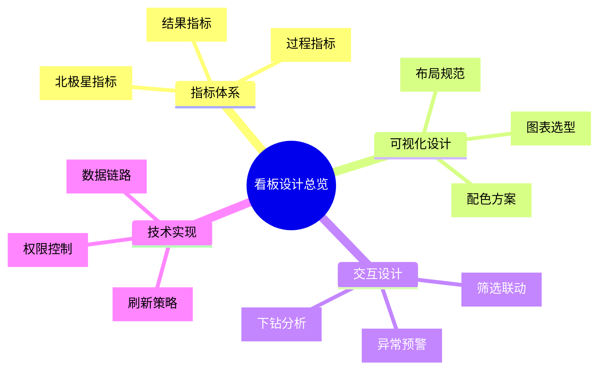
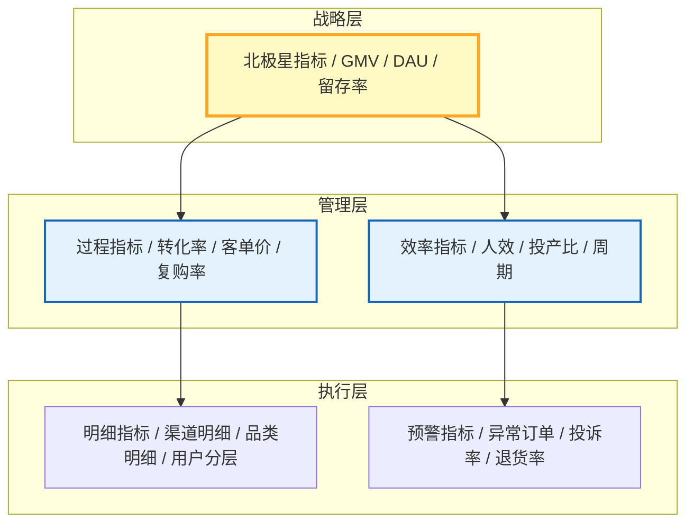
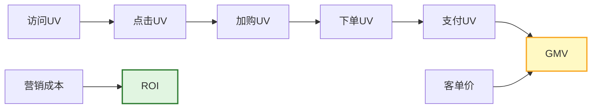
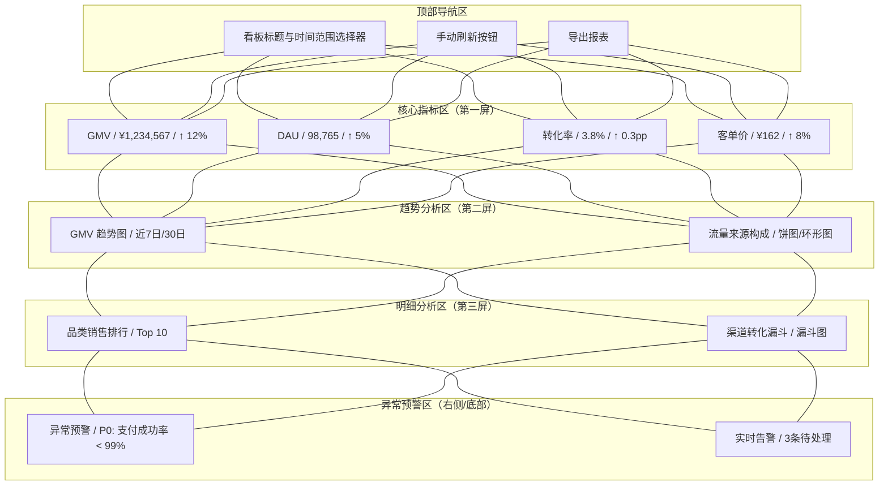
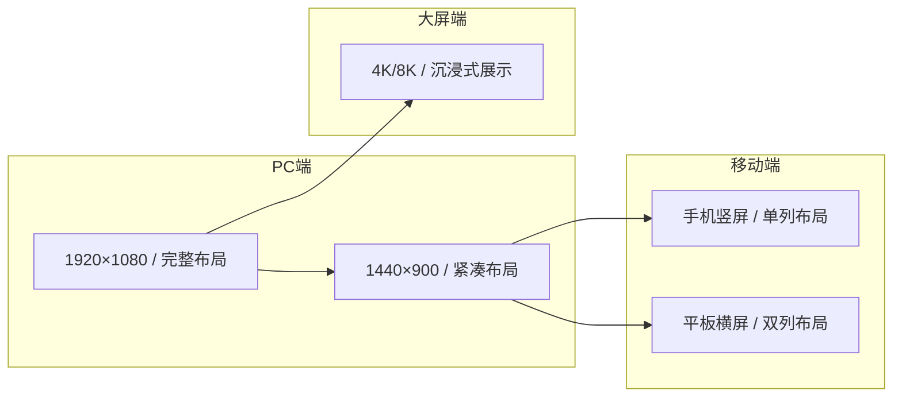
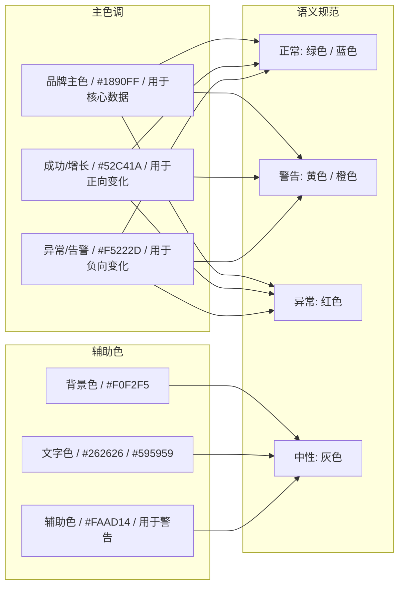
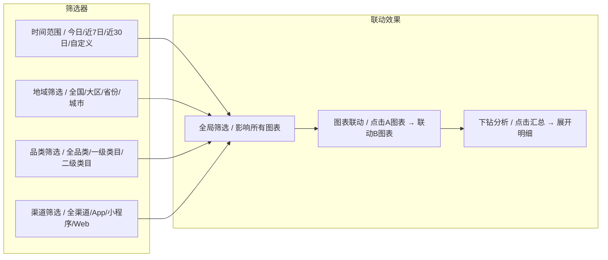
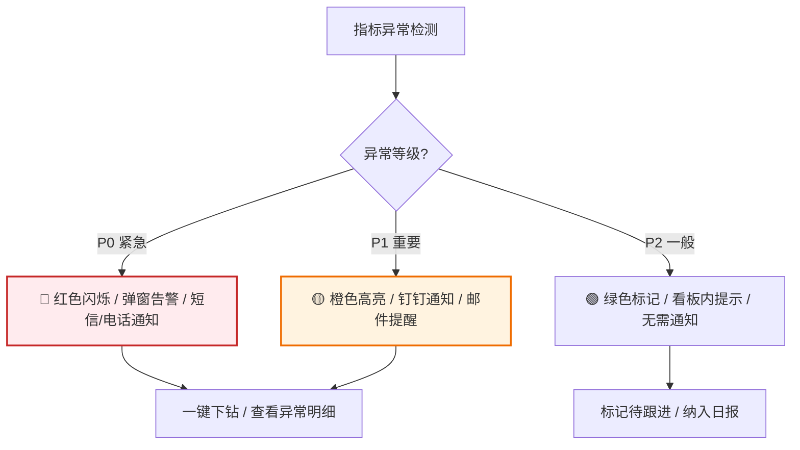
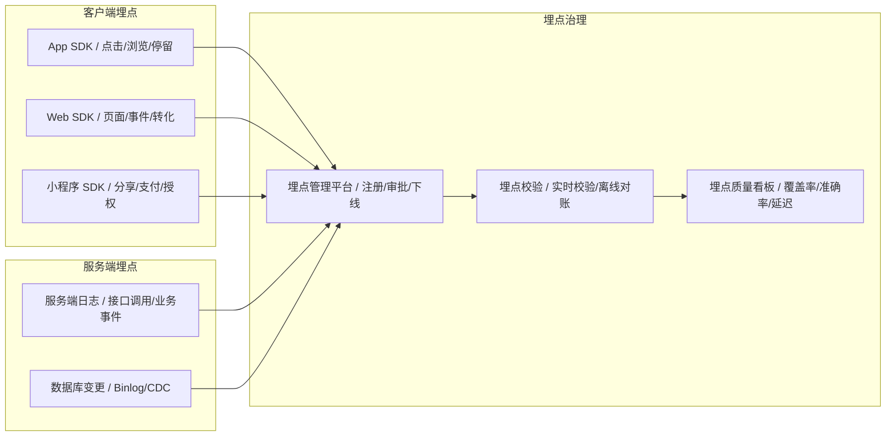
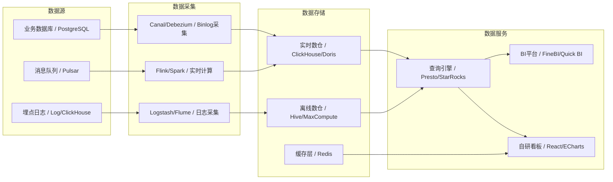

# [产品/系统名称（英文名）] - 数据看板设计文档（Dashboard Design Document）

> **文档状态：** 🟡 评审中 / 🟢 已发布 / 🔴 已归档
>
> **保密级别：** 机密 / 内部公开 / 公开
>
> **版本：** vX.X
>
> **日期：** YYYY-MM-DD
>
> **撰写人：** [姓名/角色]
>
> **评审人：** [姓名/角色]
>
> **阅读对象：** [CEO / 运营总监 / 一线运营 / 技术运维]
>
> **看板编号：** DASH-2026-XXX
>
> **看板名称：** [如：电商交易核心监控看板]
>
> **维护团队：** [数据产品 / BI团队 / 业务数据组]
>
> **刷新频率：** [实时 / 5min / 1h / 日]

---

## 0. 文档导读

### 0.1 文档目的与适用范围

[说明本文档的目的、适用场景和不适用场景]

### 0.2 相关文档

| 文档类型 | 文件名              | 相关章节   |
| -------- | ------------------- | ---------- |
| [类型]   | [文件名] [行号范围] | [章节描述] |

> **引用格式说明**：关联文档使用 `文件名 行号范围` 格式（如 `【模板】技术需求文档(TRD).md 3-17`），行号随文档更新可能变化，请以实际内容为准。

### 0.3 变更记录

| 版本   | 日期       | 修订人 | 变更内容                                                 | 审核人           |
| :----- | :--------- | :----- | :------------------------------------------------------- | :--------------- |
| v0.1   | YYYY-MM-DD | [姓名] | 初稿：指标体系 + 布局设计                                |                  |
| v0.2   | YYYY-MM-DD | [姓名] | 补充交互设计 + 数据链路                                  |                  |
| v0.3   | YYYY-MM-DD | [姓名] | 正式发布                                                 | [数据产品负责人] |
| v0.3.1 | 2026-06-20 | 谢董   | 消息中间件示例 Kafka/RocketMQ→Pulsar（统一事件总线规范） | —                |

---

## 1. 执行摘要（Executive Summary）

> **受众导读：** 本看板解决什么问题、给谁看、核心指标是什么。

| 要素           | 内容                                                 |
| :------------- | :--------------------------------------------------- |
| **看板定位**   | [一句话，如：实时监控电商交易核心链路，支撑运营决策] |
| **目标受众**   | [如：运营总监 + 一线运营，兼顾技术运维]              |
| **核心场景**   | [如：大促期间实时监控 / 日常经营分析 / 异常快速定位] |
| **关键指标数** | [N] 个核心指标 + [M] 个辅助指标                      |
| **数据来源**   | [如：订单库 Binlog → Pulsar → Flink → ClickHouse]    |
| **刷新策略**   | [如：核心指标 1min，趋势图 5min，明细 1h]            |



---

## 2. 指标体系设计（Metrics Design）

### 2.1 指标分层架构

> 参考阿里数仓分层及大厂指标体系实践，指标分为三层：



### 2.2 核心指标定义

> **引用说明**：详细的指标体系、指标定义、计算方式和目标值，请参阅 **【模板】运营手册.md §2.2**。本文档仅引用看板需要展示的核心指标。

| 指标层级 | 指标名称 | 指标定义 | 计算方式 | 目标值 | 刷新频率 | 引用文档 |
| :--- | :--- | :--- | :--- | :--- | :---: | :--- |
| **北极星** | GMV | 商品交易总额 | Σ(订单实付金额) | 日增10% | 1min | 引用运营手册§2.2 |
| **北极星** | DAU | 日活跃用户 | 当日去重登录用户数 | 100万 | 5min | 引用运营手册§2.2 |
| **一级** | 转化率 | 访客到下单比例 | 下单UV/访问UV | 3.5% | 5min | 引用运营手册§2.2 |
| **一级** | 客单价 | 单笔订单金额 | GMV/订单数 | ¥150 | 5min | 引用运营手册§2.2 |
| **一级** | 7日留存率 | 7日后仍活跃比例 | 7日活跃/当日新增 | 25% | 日 | 引用运营手册§2.2 |
| **二级** | 支付成功率 | 支付完成比例 | 支付成功/发起支付 | 99.5% | 1min | 引用运营手册§2.2 |
| **二级** | 退款率 | 退款订单比例 | 退款订单/总订单 | <2% | 1h | 引用运营手册§2.2 |
| **三级** | 渠道ROI | 渠道投入产出比 | 渠道GMV/渠道成本 | ≥3 | 日 | 引用运营手册§2.2 |

> **完整指标体系**：指标分层架构、指标关联关系、数据来源详见 **【模板】运营手册.md §2.2**。

### 2.3 指标关联关系



---

## 3. 看板布局设计（Layout Design）

### 3.1 页面结构

> 遵循 F 型阅读路径，关键信息置于左上。



### 3.2 布局规范

| 区域            | 位置           | 内容                        | 视觉权重   |
| :-------------- | :------------- | :-------------------------- | :--------- |
| **核心指标区**  | 顶部第一行     | 4-6 个 KPI 指标卡           | ⭐⭐⭐⭐⭐ |
| **趋势图区**    | 第二行左侧     | 折线图/面积图，展示时间趋势 | ⭐⭐⭐⭐   |
| **构成图区**    | 第二行右侧     | 饼图/环形图，展示结构分布   | ⭐⭐⭐⭐   |
| **排行/明细区** | 第三行         | 表格/条形图，Top N 排行     | ⭐⭐⭐     |
| **预警/告警区** | 右侧边栏或底部 | 异常列表、告警卡片          | ⭐⭐⭐⭐⭐ |
| **筛选器区**    | 顶部或左侧边栏 | 时间、地域、品类等维度筛选  | ⭐⭐⭐     |

### 3.3 响应式布局适配



---

## 4. 可视化设计规范（Visualization Standards）

### 4.1 图表选型矩阵

> 根据数据关系选择正确的图表类型。

| 数据关系 | 适用场景              | 推荐图表                 | 禁用图表     |
| :------- | :-------------------- | :----------------------- | :----------- |
| **比较** | 同比/环比、多维度对比 | 柱状图、条形图、雷达图   | 饼图、面积图 |
| **趋势** | 时间序列变化、预测    | 折线图、面积图           | 饼图、散点图 |
| **构成** | 部分占整体比例        | 饼图、环形图、堆叠柱状图 | 折线图       |
| **分布** | 数据分布、集中度      | 直方图、箱线图、散点图   | 饼图         |
| **联系** | 相关性分析、聚类      | 散点图、气泡图、热力图   | 柱状图       |
| **流程** | 转化漏斗、用户路径    | 漏斗图、桑基图           | 饼图、折线图 |

### 4.2 配色方案

> 主色不超过 3 种，强调色用于异常预警。



**配色使用规范：**

| 场景     | 颜色 | 色值      | 使用示例               |
| :------- | :--- | :-------- | :--------------------- |
| 品牌主色 | 蓝色 | `#1890FF` | 核心指标、主趋势线条   |
| 正向增长 | 绿色 | `#52C41A` | 同比↑、环比↑、目标达成 |
| 负向下降 | 红色 | `#F5222D` | 同比↓、环比↓、异常告警 |
| 警告提示 | 橙色 | `#FAAD14` | 接近阈值、需关注       |
| 背景色   | 浅灰 | `#F0F2F5` | 看板整体背景           |
| 卡片背景 | 白色 | `#FFFFFF` | 指标卡片、图表容器     |
| 主文字   | 深灰 | `#262626` | 标题、核心数据         |
| 辅助文字 | 中灰 | `#595959` | 标签、说明文字         |

### 4.3 字体与排版

| 元素       | 字体           | 字号 | 字重    | 颜色                  |
| :--------- | :------------- | :--- | :------ | :-------------------- |
| 看板标题   | 系统默认无衬线 | 24px | Bold    | `#262626`             |
| 指标数值   | DIN / Roboto   | 32px | Bold    | `#262626`             |
| 指标标签   | 系统默认       | 14px | Regular | `#595959`             |
| 趋势变化   | 系统默认       | 16px | Medium  | `#52C41A` / `#F5222D` |
| 图表标题   | 系统默认       | 16px | Medium  | `#262626`             |
| 坐标轴标签 | 系统默认       | 12px | Regular | `#8C8C8C`             |

---

## 5. 交互设计（Interaction Design）

### 5.1 全局交互



### 5.2 下钻与联动规则

| 触发方式 | 源图表     | 目标图表   | 联动效果                   |
| :------- | :--------- | :--------- | :------------------------- |
| 点击     | 地域地图   | 趋势折线图 | 展示选中地域的 GMV 趋势    |
| 点击     | 品类饼图   | 品类明细表 | 展示选中品类的 SKU 排行    |
| 悬停     | 趋势折线图 | 指标卡     | 显示该时间点的具体数值     |
| 筛选     | 时间选择器 | 全量图表   | 所有图表按选中时间范围刷新 |
| 下钻     | 大区柱状图 | 省份柱状图 | 从大区下钻到省份维度       |

### 5.3 异常预警交互



---

没有，当前这份数据看板设计文档中**没有包含数据埋点相关内容**。

数据埋点通常属于**数据采集层**的前置工作，需要在看板设计之前完成。如果你需要补充，可以在以下位置添加：

---

## 建议补充：数据埋点章节

可以在第 5 章「数据链路设计」之前插入一个新章节：

````markdown
## 5. 数据埋点设计（Data Tracking Design）

### 5.1 埋点体系架构


````

### 6.2 核心埋点清单

| 埋点ID        | 埋点名称     | 触发时机       | 上报方式 | 关联指标        | 优先级 |
| :------------ | :----------- | :------------- | :------- | :-------------- | :----: |
| **TRACK-001** | 首页浏览     | 进入首页       | 客户端   | DAU、UV         |   P0   |
| **TRACK-002** | 商品点击     | 点击商品卡片   | 客户端   | 点击率、CTR     |   P0   |
| **TRACK-003** | 加入购物车   | 点击加购按钮   | 客户端   | 加购率          |   P0   |
| **TRACK-004** | 订单提交     | 点击提交订单   | 服务端   | 下单转化率      |   P0   |
| **TRACK-005** | 支付成功     | 收到支付回调   | 服务端   | 支付成功率、GMV |   P0   |
| **TRACK-006** | 页面停留时长 | 离开页面时计算 | 客户端   | 平均停留时长    |   P1   |
| **TRACK-007** | 搜索查询     | 发起搜索请求   | 服务端   | 搜索转化率      |   P1   |

### 6.3 埋点规范

| 规范项       | 要求                           | 示例                                    |
| :----------- | :----------------------------- | :-------------------------------------- |
| **事件命名** | 业务域*动作*对象               | `trade_click_sku`、`trade_submit_order` |
| **参数规范** | 统一字段名，禁止魔法数字       | `sku_id`、`category_id`、`source_page`  |
| **用户标识** | 设备ID + 登录ID 双ID体系       | `device_id`、`user_id`                  |
| **时间戳**   | 客户端时间 + 服务端时间双上报  | `client_time`、`server_time`            |
| **版本管理** | 埋点变更需走审批，禁止随意下线 | 埋点管理平台审批流                      |

### 6.4 埋点质量监控

| 监控项     | 指标                 | 告警阈值    |
| :--------- | :------------------- | :---------- |
| 埋点覆盖率 | 核心链路埋点覆盖比例 | < 95% 告警  |
| 埋点丢失率 | 上报成功 / 触发次数  | > 1% 告警   |
| 埋点延迟   | 从触发到入库平均时间 | > 5min 告警 |
| 埋点准确率 | 抽样校验正确比例     | < 99% 告警  |

---

## 7. 数据链路设计（Data Pipeline）

### 7.1 数据架构



### 7.2 刷新策略

| 数据类型      | 刷新频率     | 技术实现       | 说明                  |
| :------------ | :----------- | :------------- | :-------------------- |
| **核心 KPI**  | 1min         | WebSocket 推送 | GMV、订单量等核心指标 |
| **趋势图表**  | 5min         | 定时轮询       | 折线图、面积图        |
| **排行/明细** | 15min        | 定时轮询       | Top N 表格、漏斗图    |
| **离线报表**  | 日 / 周 / 月 | 离线调度       | 留存率、LTV 等        |
| **异常告警**  | 实时         | Flink CEP      | 支付成功率、错误率    |

---

## 8. 权限与安全（Security & Permissions）

### 8.1 角色权限矩阵

| 角色           | 查看范围   | 操作权限             | 数据脱敏     |
| :------------- | :--------- | :------------------- | :----------- |
| **CEO / 高管** | 全量数据   | 查看、导出           | 不涉及       |
| **运营总监**   | 全量数据   | 查看、导出、配置告警 | 不涉及       |
| **一线运营**   | 本部门数据 | 查看、筛选           | 用户ID脱敏   |
| **技术运维**   | 系统指标   | 查看、配置监控       | 不涉及       |
| **外部合作方** | 授权数据   | 仅查看               | 敏感字段脱敏 |

### 8.2 数据安全规范

| 安全等级 | 处理方式               | 适用场景           |
| :------- | :--------------------- | :----------------- |
| 🔴 机密  | 需审批访问，全链路加密 | 财务数据、用户隐私 |
| 🟡 敏感  | 角色授权，字段级脱敏   | 用户行为、交易明细 |
| 🟢 公开  | 无需授权，可公开访问   | 公开报表、行业数据 |

---

## 9. 性能与体验（Performance & UX）

### 9.1 性能指标

| 指标         | 目标值  | 优化手段               |
| :----------- | :------ | :--------------------- |
| 首屏加载时间 | < 2s    | CDN、懒加载、骨架屏    |
| 数据查询时间 | < 1s    | 索引优化、预聚合、缓存 |
| 图表渲染时间 | < 500ms | 虚拟滚动、数据采样     |
| 并发用户数   | > 500   | 负载均衡、连接池       |

### 9.2 体验优化

| 优化项       | 实现方式                             |
| :----------- | :----------------------------------- |
| **骨架屏**   | 数据加载前展示灰色占位，减少白屏焦虑 |
| **渐进加载** | 核心指标优先加载，图表按需加载       |
| **错误兜底** | 数据异常时展示友好提示，而非空白     |
| **空状态**   | 无数据时展示引导图 + 操作建议        |
| **深色模式** | 支持暗黑主题，适配夜间值班场景       |

---

## 10. 附录（Appendix）

### 10.1 术语表

| 术语          | 定义                                       |
| :------------ | :----------------------------------------- |
| **KPI**       | Key Performance Indicator，关键绩效指标    |
| **下钻**      | Drill-down，从汇总数据逐层展开到明细数据   |
| **联动**      | 图表间的交互响应，一个图表操作影响其他图表 |
| **Flink CEP** | Complex Event Processing，复杂事件处理     |
| **pp**        | percentage point，百分点                   |

### 10.2 关联文档

| 文档         | 编号            | 链接   |
| :----------- | :-------------- | :----- |
| 数据字典     | DD-2026-XXX     | [链接] |
| 指标体系文档 | METRIC-2026-XXX | [链接] |
| 接口文档     | API-2026-XXX    | [链接] |
| 运维手册     | OPS-2026-XXX    | [链接] |

## 11. 设计评审签核（Design Review Sign-off）

| 角色               | 姓名 | 签字 | 日期 | 意见           |
| :----------------- | :--- | :--: | :--: | :------------- |
| **数据产品负责人** |      |      |      | [批准 / 驳回]  |
| **业务负责人**     |      |      |      | [指标定义确认] |
| **技术负责人**     |      |      |      | [数据链路确认] |
| **设计负责人**     |      |      |      | [视觉规范确认] |
| **安全负责人**     |      |      |      | [权限策略确认] |
