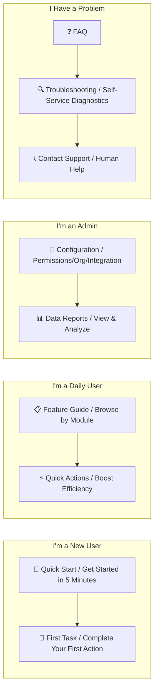
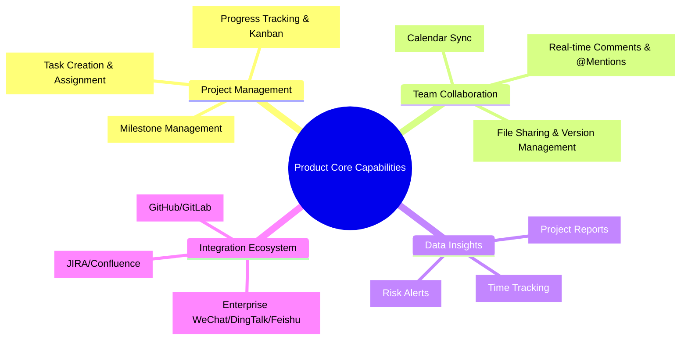
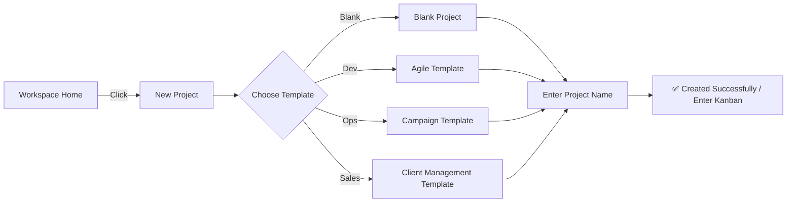
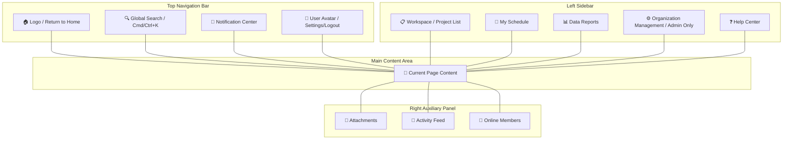
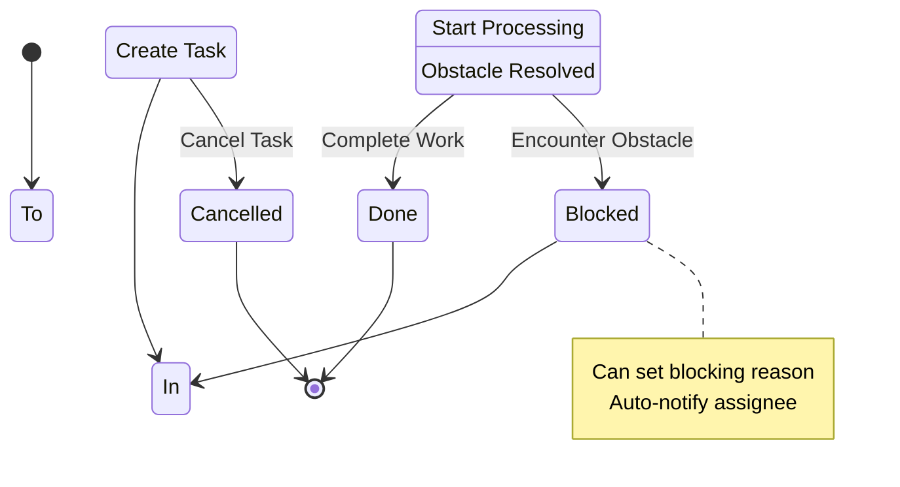
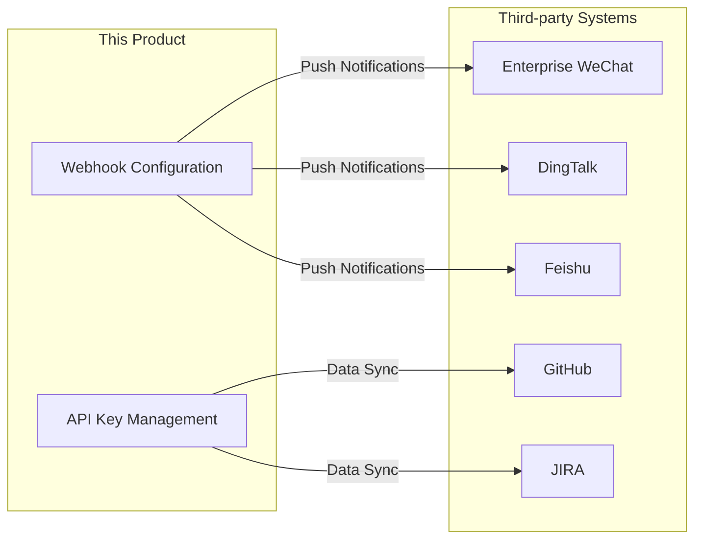
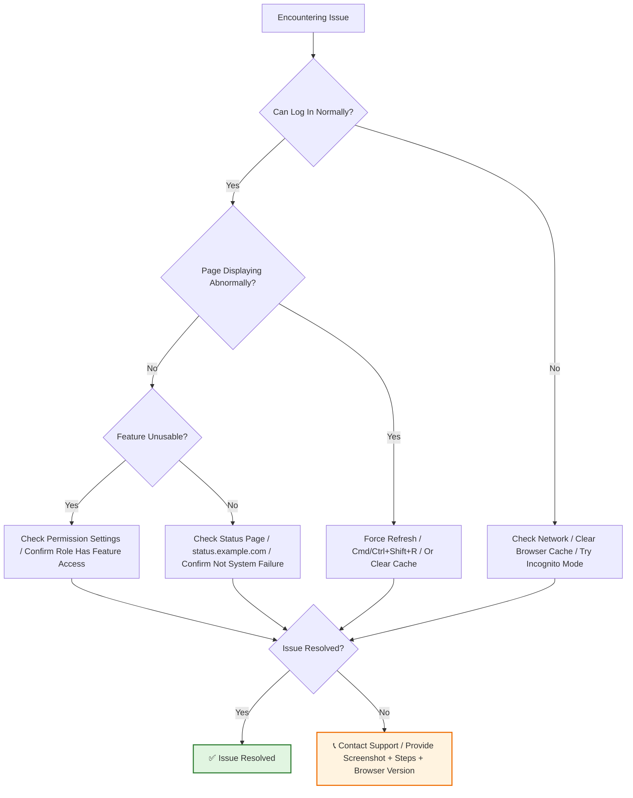

# [Product/System Name (English)] - User Manual

> **Document Status:** 🟢 Released / 🟡 Updating / 🔴 Archived
>
> **Confidentiality Level:** Confidential / Internal / Public
>
> **Version:** vX.X
>
> **Date:** YYYY-MM-DD
>
> **Author:** [Name/Role]
>
> **Reviewer:** [Name/Role]
>
> **Audience:** [Role List]
>
> **Applicable Product Version:** ≥ v[X.Y.Z]
>
> **Document Maintenance Team:** [Product Operations / User Success / Technical Writing]
>
> **Feedback Channel:** [help@example.com / Online Support / Community Forum]

---

## 0. Document Guide

### 0.1 Document Purpose & Scope

[Describe the purpose, applicable scenarios, and non-applicable scenarios of this document]

### 0.2 Related Documents

| Document Type | Filename | Related Sections |
|---------|--------|---------|
| [Type] | [Filename] [Line Range] | [Section Description] |

> **Reference Format**: Related documents use the `filename line range` format (e.g., `【Template】Technical Requirements Document (TRD).md 3-17`). Line numbers may change as documents are updated; refer to the actual content.

### 0.3 Change Log

| Version | Date | Author | Changes | Reviewer |
| :--- | :--- | :--- | :--- | :--- |
| v0.1 | YYYY-MM-DD | [Name] | Initial draft | [Reviewer] |
| v0.1.1 | 2026-06-09 | Xie Dong | Fix xychart-beta chart to table for Feishu rendering compatibility | — |

---

## 1. Quick Navigation

> Not sure where to start? Choose the best entry point based on your role.

| Entry | For Whom | Estimated Read Time |
| :--- | :--- | :---: |
| [📖 Quick Start](#2-quick-start) | First time using this product | 5 min |
| [📋 Feature Guide](#4-feature-guides) | Need to learn a specific feature | 2-10 min |
| [🔧 Admin Guide](#5-admin-guide) | Organization admin, IT lead | 15 min |
| [❓ FAQ](#6-faq) | Need quick solution to a specific problem | 1 min |
| [🔍 Troubleshooting](#7-troubleshooting) | Feature anomaly, error message | 3 min |

---

## 2. Quick Start

> **Goal:** Complete your first core operation within 5 minutes and build basic product knowledge.

### 2.1 Product Overview

[Product Name] is a [one-line positioning, e.g., intelligent project management tool for SMBs] that helps you [core value, e.g., collaborate efficiently, track progress, boost team output].

**Core Capabilities Overview:**

### 2.2 First-Time Four-Step Setup

#### Step 1: Register & Log In

1. Visit [https://app.example.com](https://app.example.com)
2. Click the **[Register]** button in the upper right
3. Choose registration method:
   - 📧 **Email registration**: Enter email → Get verification code → Set password
   - 🔗 **Third-party login**: Support WeChat / DingTalk / Enterprise WeChat QR code login
4. After registration, automatically enter the **Workspace Home**

> 💡 **Tip:** It's recommended to use a work email for registration to facilitate team invitations and permission management.

#### Step 2: Create Your First Project

1. On the workspace home, click **[+ New Project]**
2. Choose a project template:
   - 📋 **Blank Project**: Customize from scratch
   - 🚀 **Agile Development**: For dev teams
   - 📅 **Marketing Campaign**: For operations teams
   - 📊 **Client Management**: For sales teams
3. Enter **Project Name** (e.g., "Q3 Product Iteration")
4. Click **[Create]**

**Expected Result:** Page automatically navigates to the project kanban, showing default "To Do / In Progress / Done" columns.

#### Step 3: Add Your First Task

1. In the **[To Do]** column of the kanban, click **[+ Add Task]**
2. Enter task title (e.g., "Complete requirements document")
3. (Optional) Set:
   - 👤 **Assignee**: @yourself or team members
   - 📅 **Due Date**: Select date
   - 🏷️ **Priority**: High / Medium / Low
   - 📝 **Description**: Add task details
4. Click **[Confirm]** or press `Enter` to save

**Expected Result:** Task card appears at the top of the "To Do" column with the assigned tags and assignee avatar.

#### Step 4: Invite Team Members

1. Click **[Invite Members]** in the upper right of the page
2. Choose invitation method:
   - 🔗 **Copy Link**: Send to colleagues, click to join
   - 📧 **Email Invitation**: Enter their email, system sends invitation automatically
   - 📱 **QR Code Invitation**: Display QR code, they scan to join
3. Set member **role permissions**:
   - 👑 **Admin**: Can manage project settings and member permissions
   - ✏️ **Editor**: Can create and edit tasks
   - 👁️ **Viewer**: Can only view, cannot edit
4. Click **[Send Invitation]**

**Expected Result:** Invitee receives notification; after joining, they can collaborate in the project.

---

## 3. UI Tour

> Familiarize yourself with the product interface layout and quickly locate feature entry points.

### 3.1 Global Navigation Structure

### 3.2 Icons & Symbols

| Icon | Meaning | Usage Scenario |
| :---: | :--- | :--- |
| ➕ | Add/Create | Create project, task, document |
| ✏️ | Edit | Modify existing content |
| 🗑️ | Delete | Delete project/task (recoverable) |
| 🔗 | Share/Copy Link | Invite members, share tasks |
| ⭐ | Favorite/Star | Mark important projects |
| 🔒 | Private/Locked | Visible only to self or restricted permissions |
| ⚙️ | Settings | Enter configuration page |
| ❓ | Help | View operation tips |

---

## 4. Feature Guides

> Detailed introduction to each feature by module, supporting on-demand browsing.

### 4.1 Project Management

#### 4.1.1 Create & Manage Projects

**Create Project:**

1. Go to **[Workspace]** → Click **[+ New Project]**
2. Choose a template or start from blank
3. Configure project info:
   - Project name (required)
   - Project description (optional)
   - Project cover (optional, supports image upload)
   - Visibility: 🔒 Private / 👥 Team Visible / 🌐 Public
4. Click **[Create]**

**Project Settings:**

| Setting | Description | Path |
| :--- | :--- | :--- |
| Project Name | Modify display name | Project Page → ⚙️ Settings → Basic Info |
| Member Management | Add/remove members, adjust permissions | Project Page → ⚙️ Settings → Members |
| Kanban Columns | Customize task status columns | Project Page → ⚙️ Settings → Kanban Config |
| Automation Rules | Set triggers to auto-execute tasks | Project Page → ⚙️ Settings → Automation |
| Archive/Delete | Archived items can't be edited; deleted items go to trash | Project Page → ⚙️ Settings → Advanced |

#### 4.1.2 Task Management

**Create Task:**

1. Click **[+ Add Task]** in any kanban column or press `N`
2. Fill in task info:
   - **Title** (required): One-sentence task description
   - **Description** (optional): Supports Markdown, @mentions, attachments
   - **Assignee**: Multiple people can be assigned
   - **Due Date**: Supports setting reminder time
   - **Priority**: 🔴 High / 🟡 Medium / 🟢 Low
   - **Labels**: Custom label categories
3. Click **[Save]**

**Batch Operations:**

- Hold `Shift` or `Cmd/Ctrl` to multi-select task cards
- Right-click menu: Batch move, batch assign, batch set due date, batch delete

#### 4.1.3 Kanban View Operations

| Operation | Method | Shortcut |
| :--- | :--- | :--- |
| Move Task | Drag card to target column | Mouse drag |
| Quick Edit | Double-click card title | `Enter` |
| Expand Details | Click card | `Space` |
| Delete Task | Right-click → Delete | `Delete` |
| Filter Tasks | Top filter bar | `/` |
| Search Tasks | Global search | `Cmd/Ctrl + K` |

### 4.2 Team Collaboration

#### 4.2.1 @Mentions & Notifications

Type `@` in task descriptions or comments to mention members or linked content:

| Syntax | Effect | Example |
| :--- | :--- | :--- |
| `@Zhang San` | Notify Zhang San | `@Zhang San please review this requirement` |
| `@everyone` | Notify all project members | `@everyone Retrospective this Friday afternoon` |
| `#Task Title` | Link to other tasks | `Depends on #Requirement Review completion` |
| `!Document Name` | Link documents | `Reference !Product PRD` |

### 4.3 Data Reports

#### 4.3.1 View Project Reports

1. Enter project → Click **[Reports]** tab at the top
2. Choose report type:
   - 📊 **Burndown Chart**: View sprint progress and remaining workload
   - 📈 **Cumulative Flow**: Analyze task count changes by status
   - 🥧 **Workload Distribution**: View member task allocation
   - ⏱️ **Time Tracking**: Record and analyze actual time spent
3. Set time range and filter conditions
4. Click **[Export]** to download Excel/PDF

> **Note**: xychart-beta is a Feishu-incompatible Mermaid type; replaced with table description (template sample data).

**Burndown Chart Example**

| Time | Remaining Workload (h) |
| :--- | :---: |
| Day 1 | 100 |
| Day 3 | 85 |
| Day 5 | 70 |
| Day 7 | 55 |
| Day 10 | 30 |
| Day 14 | 0 |

---

## 5. Admin Guide

> Configuration and management instructions for organization admins and IT leads.

### 5.1 Organization Settings

**Access Path:** Left sidebar → ⚙️ **Organization Management**

| Feature | Description | Steps |
| :--- | :--- | :--- |
| **Member Management** | Invite/remove members, set departments | Organization Management → Members → Invite/Edit |
| **Permission Templates** | Create role permission templates | Organization Management → Permissions → New Template |
| **Security Settings** | Login policies, IP whitelist | Organization Management → Security → Configure |
| **Billing Management** | View usage, upgrade plan | Organization Management → Billing → Subscription |

### 5.2 Integration Configuration

**Configure Enterprise WeChat Integration:**

1. Organization Management → Integration → Enterprise WeChat → **[Configure]**
2. Get **CorpID** and **AgentID** from Enterprise WeChat admin console
3. Fill in corresponding fields, click **[Verify & Save]**
4. Configure message push rules (optional)
5. Members can receive notifications within Enterprise WeChat

---

## 6. FAQ

> Self-service Q&A organized by scenario, for quick resolution of high-frequency issues.

### 6.1 Account & Login

| Question | Answer |
| :--- | :--- |
| **Forgot password?** | Login page click **[Forgot Password]** → Enter registered email → Check reset email → Set new password |
| **How to change bound email?** | Personal Settings → Account Security → Email → **[Change]** → Verify new email |
| **Support multiple devices logged in simultaneously?** | Yes, up to 5 devices. The earliest login will be automatically logged out when exceeded |
| **How to enable two-step verification?** | Personal Settings → Account Security → Two-Step Verification → Bind Authenticator App |

### 6.2 Feature Usage

| Question | Answer |
| :--- | :--- |
| **Accidentally deleted a task, how to recover?** | Project Page → Trash → Find task → **[Restore]** (retained for 30 days) |
| **How to batch export tasks?** | Kanban Page → Filter → **[Export]** → Choose format (Excel/CSV) |
| **Can I set recurring task cycles?** | Yes. Task Details → Due Date → **[Set Recurrence]** → Choose cycle |
| **How to disable email notifications?** | Personal Settings → Notification Preferences → Uncheck **[Email Notifications]** |

### 6.3 Billing & Invoices

| Question | Answer |
| :--- | :--- |
| **What are the free tier limitations?** | Up to 3 projects, 10 members, 1GB storage |
| **How to upgrade to Pro?** | Organization Management → Billing → **[Upgrade Plan]** → Choose plan → Pay |
| **Support invoice issuance?** | Yes. Billing → Orders → **[Request Invoice]** → Fill in billing info |
| **How to cancel auto-renewal?** | Billing → Subscription → **[Manage Subscription]** → Disable auto-renewal |

---

## 7. Troubleshooting

> Self-service diagnostic flow for errors or feature anomalies.

### 7.1 Self-Service Diagnostic Flowchart

### 7.2 Common Error Quick Reference

| Error Message | Possible Cause | Solution |
| :--- | :--- | :--- |
| **"No Permission"** | Insufficient role permissions / Project is private | Contact project admin to request access |
| **"Request Timeout"** | Unstable network / Server busy | Refresh page and retry, or try later |
| **"File Upload Failed"** | File too large / Unsupported format | Compress file or convert format, then retry |
| **"Save Failed"** | Concurrent edit conflict | Refresh page, merge changes, then save |
| **"Verification Code Error"** | Timeout / Case-sensitive | Resend verification code, watch for case |

### 7.3 Contact Support

If self-service troubleshooting cannot resolve the issue, contact us through the following channels:

| Channel | Response Time | Applicable Scenario |
| :--- | :---: | :--- |
| 💬 **Online Support** | Weekdays 9:00-18:00, instant | General inquiries, feature questions |
| 📧 **Email Support** | Within 24h | Complex issues, need attachment explanation |
| 📞 **Phone Hotline** | Weekdays 9:00-18:00 | Urgent issues, P0 level problems |
| 🏠 **Help Community** | Community peer support | Usage tips, experience sharing |

**When submitting a ticket, please provide:**
1. Problem description (what happened)
2. Reproduction steps (how to trigger)
3. Screenshot or screen recording
4. Browser and version
5. Account info (masked)

---

## 8. Keyboard Shortcuts

> Master shortcuts to boost efficiency by 50%.

### 8.1 Global Shortcuts

| Shortcut | Function |
| :--- | :--- |
| `Cmd/Ctrl + K` | Global search |
| `Cmd/Ctrl + /` | Open shortcuts help |
| `Cmd/Ctrl + N` | New task |
| `Esc` | Close popup/Cancel action |

### 8.2 Kanban Operations

| Shortcut | Function |
| :--- | :--- |
| `↑ ↓ ← →` | Move focus between task cards |
| `Enter` | Open selected task details |
| `Space` | Quick preview task |
| `M` | Move task |
| `D` | Set due date |
| `L` | Add label |
| `Delete` | Delete task (requires confirmation) |

### 8.3 Text Editing

| Shortcut | Function |
| :--- | :--- |
| `Cmd/Ctrl + B` | Bold |
| `Cmd/Ctrl + I` | Italic |
| `Cmd/Ctrl + K` | Insert link |
| `@` | Mention member |
| `#` | Link task |
| `!` | Link document |

---

## 9. Appendix

### 9.1 Glossary

| Term | Definition |
| :--- | :--- |
| **Workspace** | An independent work environment containing multiple projects and members |
| **Kanban** | Visual task management board, showing task status by column |
| **Sprint** | A set of tasks completed within a fixed cycle (usually 1-2 weeks) |
| **Burndown Chart** | A chart showing remaining workload over time within a sprint |
| **Webhook** | An HTTP callback mechanism for real-time notifications between systems |

### 9.2 Changelog

| Version | Date | Changes |
| :--- | :--- | :--- |
| v1.2.0 | 2026-05-20 | Added automation rules, optimized kanban performance |
| v1.1.0 | 2026-04-15 | Added Enterprise WeChat integration, report export |
| v1.0.0 | 2026-03-01 | Product officially launched |

### 9.3 Legal Notice

- **Privacy Policy:** [https://example.com/privacy](https://example.com/privacy)
- **Terms of Service:** [https://example.com/terms](https://example.com/terms)
- **Data Security:** We are ISO 27001 certified. Your data is encrypted with AES-256.

### 9.4 Document Feedback

> Found errors or need additions? Feedback is welcome!

- 📧 Email: [docs-feedback@example.com](mailto:docs-feedback@example.com)
- 💬 Community: [https://community.example.com/docs](https://community.example.com/docs)
- 📝 Online Edit: Click **[Edit This Page]** in the lower right corner to submit a PR

---

## 10. Document Index

> Alphabetical feature index for quick navigation.

| Keyword | Section |
| :--- | :--- |
| Project Creation | [4.1.1](#411-create--manage-projects) |
| Task Management | [4.1.2](#412-task-management) |
| Kanban Operations | [4.1.3](#413-kanban-view-operations) |
| Member Invitation | [2.2 Step 4](#step-4invite-team-members) |
| File Upload | [4.2.2](#422-file-management) |
| Report Export | [4.3.1](#431-view-project-reports) |
| Permission Settings | [5.1](#51-organization-settings) |
| Integration Configuration | [5.2](#52-integration-configuration) |
| Keyboard Shortcuts | [8](#8-keyboard-shortcuts) |
| Troubleshooting | [7](#7-troubleshooting) |
