# [Product/System Name (English Name)] - Functional Requirements Document (FRD)

> **Document Status:** 🟡 Under Review / 🟢 Approved / 🔴 Rejected
>
> **Confidentiality Level:** Confidential / Internal / Public
>
> **Version:** vX.X
>
> **Date:** YYYY-MM-DD
>
> **Author:** [Name/Role]
>
> **Reviewer:** [Name/Role]
>
> **Audience:** [Role List]
>
> **Document Hierarchy:** MRD → PRD → **FRD** (this document)
>
> **Related MRD:** [MRD ID] · [MRD Version]
>
> **Related PRD:** [PRD ID] · [PRD Version]

---

## 0. Document Guide

### 0.1 Document Hierarchy

The FRD takes over from the PRD's product proposal and answers **"How is this feature implemented?"**, serving as the **single source of truth** for development, testing, and operations teams.

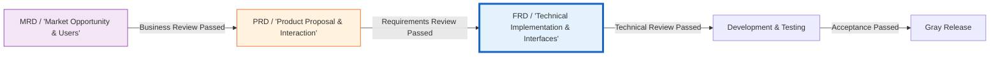

### 0.2 Related Documents

| Document Type | Filename              | Related Section   |
| ------------- | --------------------- | ----------------- |
| [Type]        | [Filename] [Line Range] | [Section Description] |

> **Reference Format Note**: Related documents use the `Filename Line Range` format (e.g., `【Template】Technical Requirements Document(TRD).md 3-17`). Line numbers may change as documents are updated; please refer to the actual content.

### 0.3 Change Log

| Version | Date       | Author  | Change Description                                            | Reviewer     |
| :------ | :--------- | :------ | :------------------------------------------------------------ | :----------- |
| v0.1    | YYYY-MM-DD | [Name]  | Initial draft completed                                       | [Architect]  |
| v0.2    | YYYY-MM-DD | [Name]  | Added exception flows and circuit breaker strategies          | [Architect]  |
| v1.0    | YYYY-MM-DD | [Name]  | Technical review passed, archived as baseline                 | [Tech Director] |
| v1.0.1  | 2026-06-09 | Xie Dong | Fixed xychart-beta diagram to table for Feishu compatibility  | —            |
| v1.0.2  | 2026-06-20 | Xie Dong | Updated middleware example RocketMQ→Pulsar (unified event bus spec) | —            |

---

## 1. Functional Overview

### 1.1 Function Definition

| Property       | Description                                                                                    |
| :------------- | :--------------------------------------------------------------------------------------------- |
| **Function Name** | [Module name, e.g., Smart Order Fulfillment Engine]                                           |
| **Function ID**   | FUNC-XXX                                                                                       |
| **Related PRD**   | [PRD ID-Section, e.g., PRD-2026-001 §3.2]                                                     |
| **Function Goal** | [One sentence: the core capability the system needs to implement, e.g., precise inventory deduction and order status consistency under high-concurrency scenarios] |
| **Business Value** | [Quantified value, e.g., support 100K TPS order placement during peak promotions, inventory oversell rate <<0.001%] |

### 1.2 Functional Landscape (Use Case)

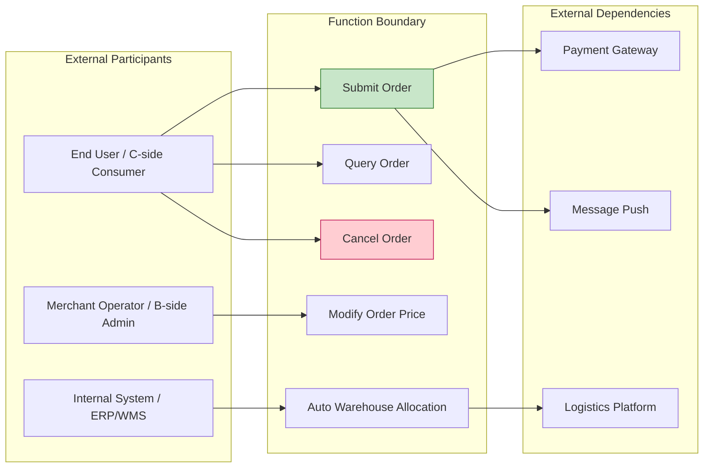

### 1.3 System Architecture

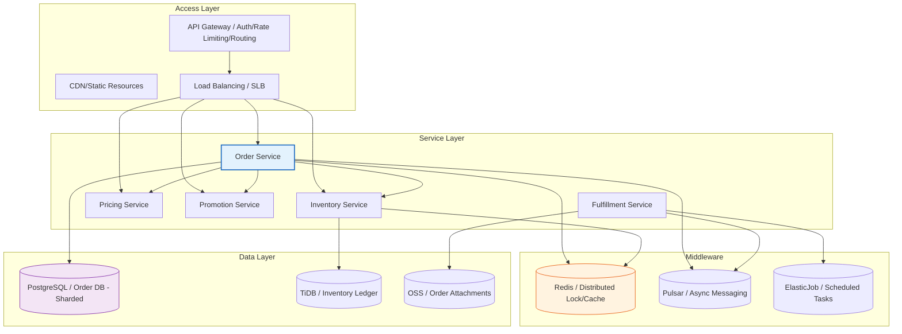

---

## 2. Domain Model

### 2.1 Entity Relationship Diagram (ER)

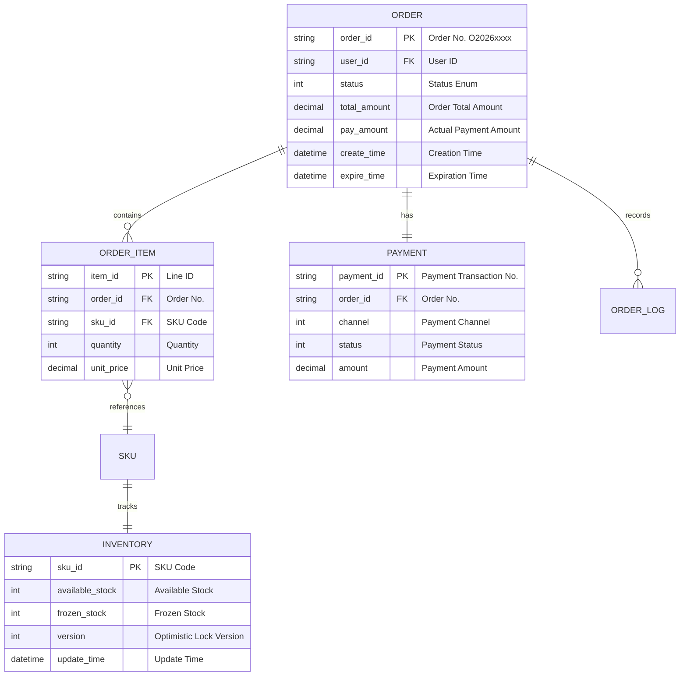

### 2.2 Domain Events

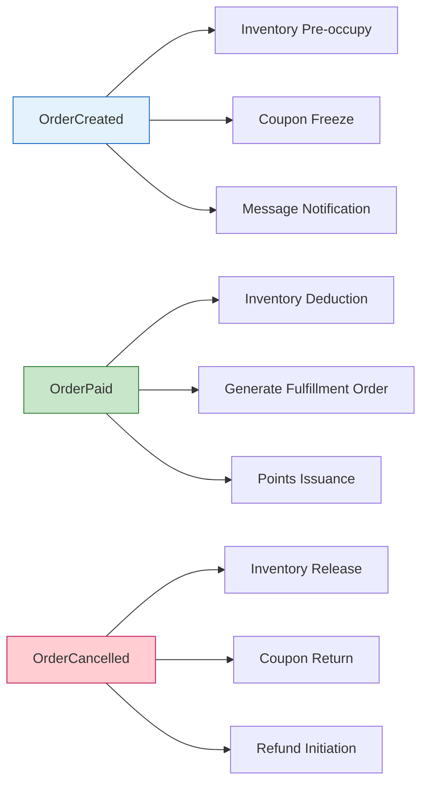

---

## 3. Business Process

### 3.1 Core Flow (Happy Path)

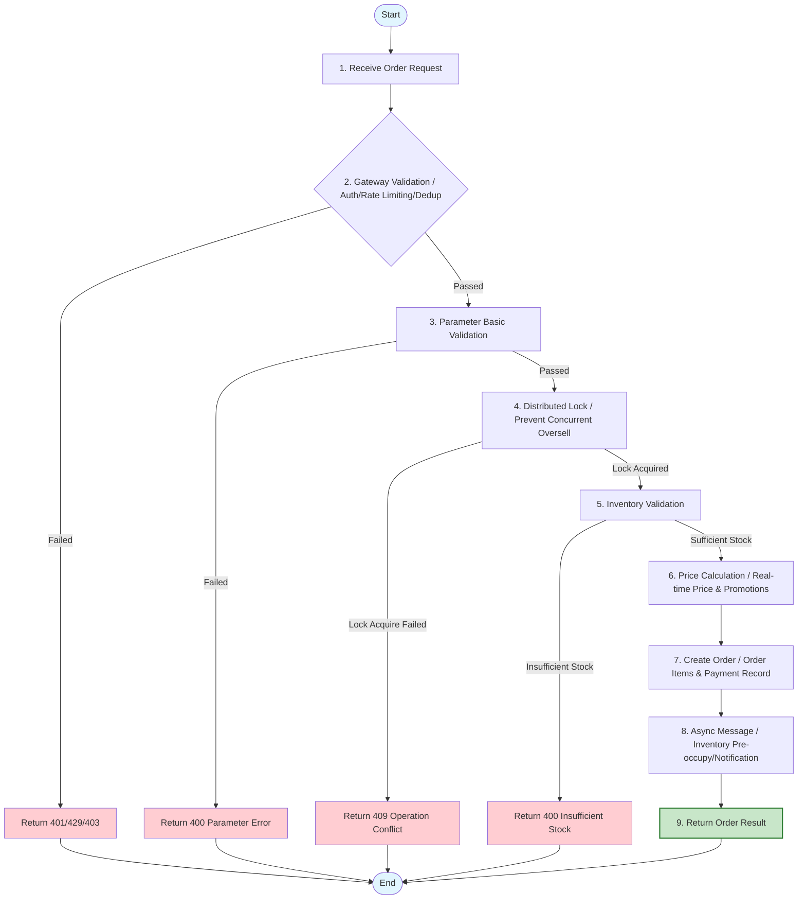

### 3.2 Exception & Degradation Flows

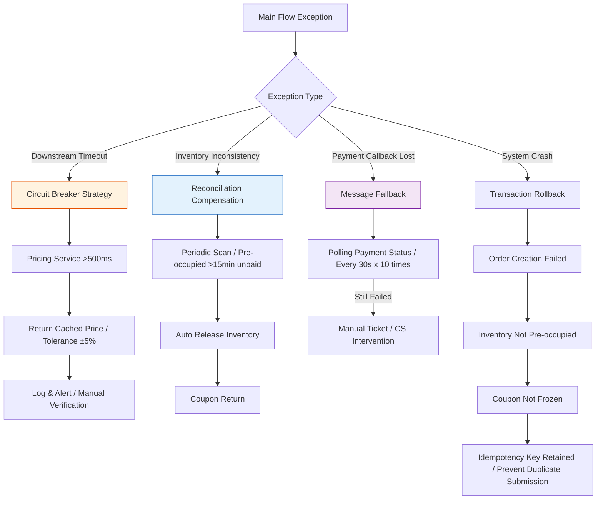

### 3.3 Exception Scenario Matrix

| Error ID      | Scenario     | Trigger Condition             | System Behavior               | Error Code | User Prompt                    | Monitoring Alert |
| :------------ | :----------- | :---------------------------- | :---------------------------- | :--------: | :----------------------------- | :--------------: |
| TPL-ERR-001  | Missing Param | Required field empty          | Reject request, log           |   400001   | "Please complete required info" |        No        |
| TPL-ERR-002  | Duplicate Submit | Idempotency key already exists | Return previous result     |   200001   | "Operation successful"         |        No        |
| TPL-ERR-003  | Concurrent Conflict | Optimistic lock version mismatch | Prompt data has changed  |   409001   | "Data has been updated, please refresh and retry" | Yes |
| TPL-ERR-004  | Insufficient Stock | Available stock << purchase quantity | Reject order          |   400002   | "Insufficient stock, only X left" |      Yes       |
| TPL-ERR-005  | Dependency Timeout | Downstream service >500ms no response | Circuit break, return degraded data | 503001 | "Service busy, please try again later" | Yes |
| TPL-ERR-006  | Price Changed | Real-time price vs cached price diff >5% | Prompt price updated |   400003   | "Product price has been updated, please confirm" | No |

---

## 4. State Machine

### 4.1 Order State Transitions

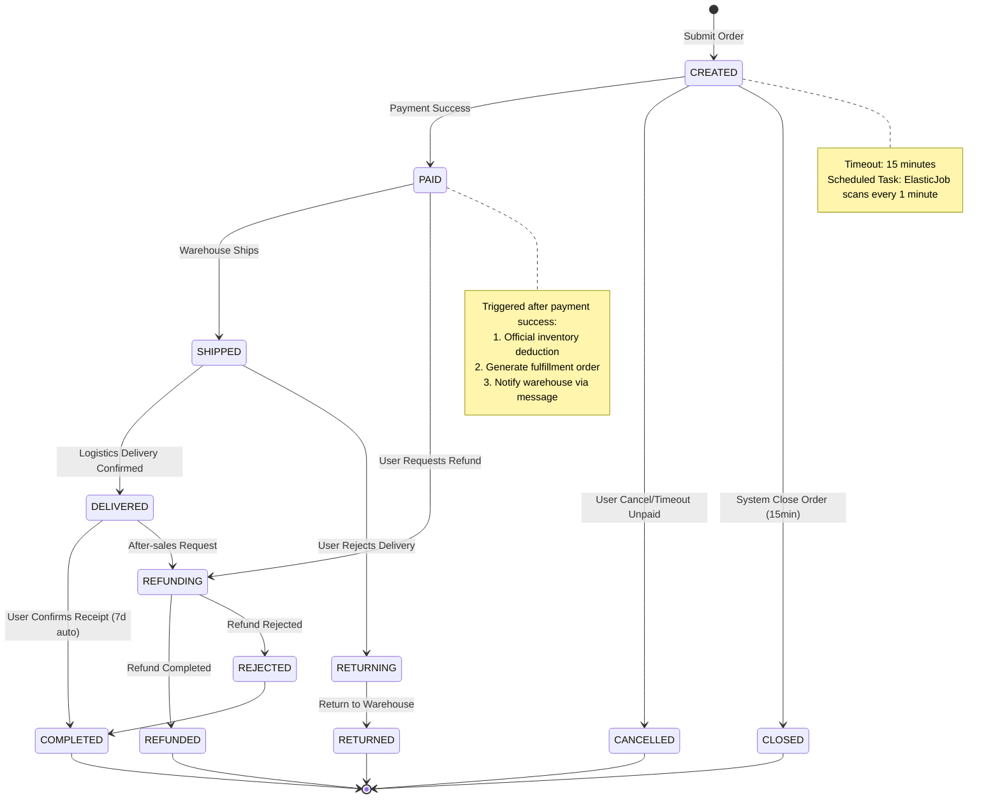

### 4.2 State Transition Rules

| Current State | Target State | Trigger Event     | Pre-condition     | Post Action             | Permission |
| :------------ | :----------- | :---------------- | :---------------- | :---------------------- | :--------- |
| CREATED       | PAID         | Payment callback success | Amount match  | Deduct inventory, notify warehouse | System |
| CREATED       | CANCELLED    | User clicks cancel | Unpaid          | Release inventory, return coupon | Buyer |
| CREATED       | CLOSED       | Timeout close order | Created time >15min | Release inventory, return coupon | System |
| PAID          | SHIPPED      | Warehouse scan shipment | Inventory deducted | Update logistics tracking no. | Merchant |
| DELIVERED     | COMPLETED    | Auto confirm receipt | Delivery time >7d | Settle merchant, issue points | System |

---

## 5. Interface Definition

### 5.1 API Inventory

| API ID  | API Name     | Method | Path                              |     Caller      | Concurrency Target | Priority |
| :------ | :----------- | :----: | :-------------------------------- | :-------------: | :----------------- | :------: |
| API-001 | Create Order | POST   | `/api/v1/orders`                  | App/Web/Mini Program | 5000 TPS      |    P0    |
| API-002 | Query Order Detail | GET | `/api/v1/orders/{orderId}`     | App/Web/Mini Program | 10000 TPS     |    P0    |
| API-003 | Cancel Order | PUT    | `/api/v1/orders/{orderId}/cancel` |     App/Web     | 1000 TPS       |    P0    |
| API-004 | Order List   | GET    | `/api/v1/orders`                  |     App/Web     | 5000 TPS       |    P1    |
| API-005 | Payment Callback | POST | `/callback/payment`              |  Payment Gateway | 3000 TPS       |    P0    |

### 5.2 Detailed API: API-001 Create Order

#### 5.2.1 API Overview

| Item           | Description                                                              |
| :------------- | :----------------------------------------------------------------------- |
| **API Name**   | Create Order                                                             |
| **Request Path** | `POST /api/v1/orders`                                                  |
| **API Description** | User submits order; system validates inventory, price, and promotions, then creates order and returns the pending-payment order |
| **Idempotency** | Yes (ensured via `idempotency-key`)                                     |
| **Timeout**    | 3000ms                                                                   |
| **Degradation Strategy** | If pricing service times out, use cached price (tolerance ±5%)   |

#### 5.2.2 Request Headers

| Parameter         |  Type  | Required | Example                       | Description                                      |
| :---------------- | :----: | :------: | :---------------------------- | :----------------------------------------------- |
| Authorization     | string |   Yes    | `Bearer eyJhbG...`            | Access token                                     |
| X-Request-ID      | string |   Yes    | `req_20260525103000_abc123`   | Trace ID, globally unique                        |
| X-Idempotency-Key | string |   Yes    | `idem_user123_1625103000`     | Idempotency key; duplicate requests within 30 min return same result |
| Content-Type      | string |   Yes    | `application/json`            | Fixed value                                      |
| X-Client-Version  | string |   No     | `ios/3.2.1`                   | Client version, for compatibility handling        |

#### 5.2.3 Request Body

```json
{
  "skuList": [
    {
      "skuId": "SKU20260525001",
      "quantity": 2,
      "source": "cart"
    }
  ],
  "addressId": "ADDR123456",
  "couponId": "CPN789012",
  "remark": "Please ship as soon as possible, urgent",
  "source": "app_ios",
  "extInfo": {
    "deviceId": "device_abc123",
    "ip": "123.45.67.89"
  }
}
```

| Parameter   |  Type  | Required | Validation Rule                            | Description                          |
| :---------- | :----: | :------: | :----------------------------------------- | :----------------------------------- |
| skuList     | array  |   Yes    | Non-empty, length 1-50                     | Product list                         |
| └─ skuId    | string |   Yes    | Format: `SKU` + date + 3-digit sequence    | Product SKU                          |
| └─ quantity |  int   |   Yes    | 1~999                                      | Purchase quantity                    |
| └─ source   | string |   No     | Enum: `cart`/`direct`/`activity`           | Source: cart/direct purchase/activity |
| addressId   | string |   Yes    | Existing and valid address ID              | Shipping address                     |
| couponId    | string |   No     | Valid coupon ID                            | Coupon                               |
| remark      | string |   No     | Length ≤200, filter sensitive words        | Order remark                         |
| source      | string |   No     | Enum: `app_ios`/`app_android`/`web`/`mp`  | Client source                        |
| extInfo     | object |   No     | —                                          | Extended info, for risk control      |

#### 5.2.4 Response Body

**Success Response (200 OK):**

```json
{
  "code": 200,
  "message": "success",
  "traceId": "req_20260525103000_abc123",
  "data": {
    "orderId": "ORD202605250001",
    "status": "CREATED",
    "totalAmount": 299.0,
    "discountAmount": 30.0,
    "payAmount": 269.0,
    "itemCount": 2,
    "createTime": "2026-05-25T10:30:00+08:00",
    "expireTime": "2026-05-25T10:45:00+08:00",
    "paymentUrl": "https://pay.example.com/prepare?token=xxx"
  }
}
```

| Parameter      |  Type   | Description                                                                   |
| :------------- | :-----: | :---------------------------------------------------------------------------- |
| orderId        | string  | Unique order identifier, globally unique                                      |
| status         | string  | Order status: `CREATED`/`PAID`/`SHIPPED`/`DELIVERED`/`COMPLETED`/`CANCELLED` |
| totalAmount    | decimal | Order total amount (CNY)                                                      |
| discountAmount | decimal | Discount amount (CNY)                                                         |
| payAmount      | decimal | Actual payment amount (CNY)                                                   |
| itemCount      |   int   | Number of items                                                               |
| createTime     | string  | Creation time (ISO8601)                                                       |
| expireTime     | string  | Payment deadline (15 minutes)                                                 |
| paymentUrl     | string  | Payment redirect URL (only returned in CREATED status)                        |

**Error Response (400 Bad Request):**

```json
{
  "code": 400002,
  "message": "Insufficient stock",
  "traceId": "req_20260525103000_abc123",
  "data": {
    "skuId": "SKU20260525001",
    "availableStock": 1,
    "requestQuantity": 2
  }
}
```

#### 5.2.5 Error Code Reference

| Error Code | HTTP Status | Description        | Client Handling Suggestion                              |
| :--------: | :---------: | :----------------- | :------------------------------------------------------ |
|   400001   |     400     | Parameter validation failed | Check required fields and format                  |
|   400002   |     400     | Insufficient stock | Prompt insufficient stock, guide to reduce quantity or choose other products |
|   400003   |     400     | Coupon unavailable | Prompt coupon expired/not applicable/already used  |
|   400004   |     400     | Invalid shipping address | Guide user to re-select address                  |
|   401001   |     401     | Login session expired | Redirect to login page                            |
|   429001   |     429     | Too many requests | Show countdown, limit submission frequency              |
|   409001   |     409     | Concurrent operation conflict | Prompt "Data has been updated, please refresh and retry" |
|   500001   |     500     | Internal server error | Show friendly error page, report logs              |
|   503001   |     503     | Downstream service busy | Prompt "Service busy, please try again later", suggest retry after 3 seconds |

---

## 6. Data Flow & Interaction Sequence

### 6.1 Core Order Placement Sequence

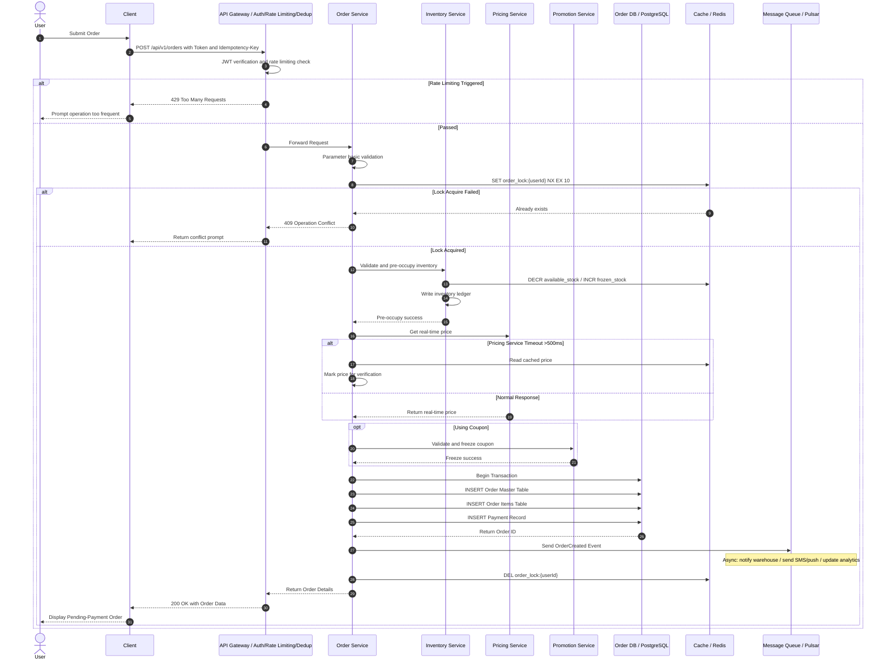

### 6.2 Payment Callback Sequence

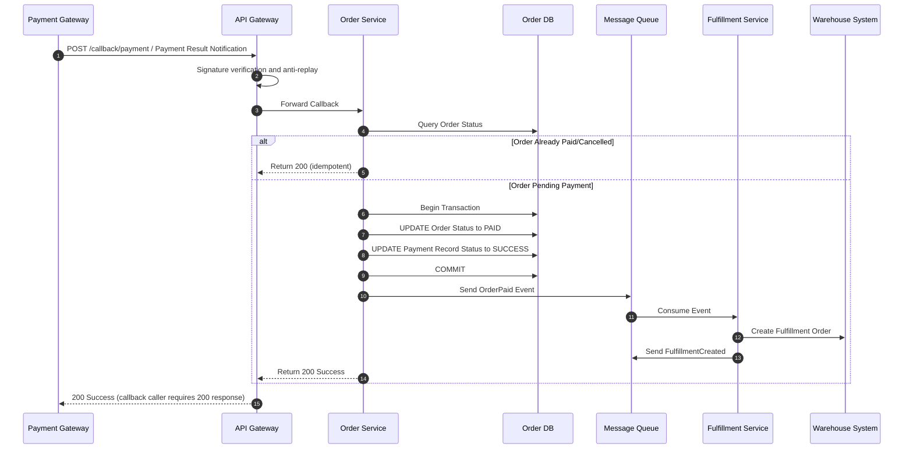

---

## 7. Non-Functional Requirements (NFR / SLA)

### 7.1 Performance Metrics

> **Note**: xychart-beta is an incompatible Mermaid type for Feishu; replaced with table description (template sample data).

**API Performance Targets (P99 Response Time ms)**

| API         | P99 Response Time (ms) |
| :---------- | :---------------------: |
| API-001 Create |          300           |
| API-002 Query  |          100           |
| API-003 Cancel |          200           |
| API-004 List   |          150           |

| Metric Item              | Target Value | Measurement Method        | Owner  |
| :----------------------- | :----------- | :------------------------ | :----- |
| Core API P99 Latency     | ≤ 300ms      | APM Monitoring (SkyWalking) | Backend |
| Query API P99 Latency    | ≤ 100ms      | APM Monitoring            | Backend |
| Concurrency Capacity     | ≥ 5000 TPS   | Full-chain Load Testing   | Architecture |
| Database QPS             | ≥ 10000      | Slow Query Monitoring     | DBA    |
| Cache Hit Rate           | ≥ 95%        | Redis Monitoring          | Backend |

### 7.2 Availability & Reliability

| Metric Item       | Target Value                | Implementation Method                    |
| :---------------- | :-------------------------- | :---------------------------------------- |
| System Availability | ≥ 99.95%                   | Multi-active deployment + automatic failover |
| Data Consistency  | Strong consistency (order/inventory/payment) | Distributed transactions (Seata AT mode) |
| Data Persistence  | RPO=0, RTO<<30s            | Master-slave sync + automatic switchover  |
| Degradation Capability | Critical path degradable | Circuit breaker (Sentinel) + fallback cache |

### 7.3 Security & Compliance

| Item             | Requirement                              | Verification Method    |
| :--------------- | :--------------------------------------- | :--------------------- |
| Transport Encryption | TLS 1.3                              | SSL Labs scan          |
| Sensitive Data   | Phone/ID AES-256 encrypted storage       | Security audit         |
| Anti-Replay Attack | Timestamp + nonce + signature, 5 min validity | Penetration testing |
| Access Control   | RBAC + data permission isolation          | Automated permission scan |
| Audit Log        | All financial operations logged, retained 180 days | Log audit   |

---

## 8. Acceptance Criteria

### 8.1 Functional Acceptance (Given-When-Then)

| AC-ID  | Acceptance Criteria (Gherkin Format)                                                                                                                                    |   Test Type    | Pass Criteria |
| :----- | :---------------------------------------------------------------------------------------------------------------------------------------------------------------------- | :------------: | :-----------: |
| AC-001 | **Given** user is logged in and cart has 2 items<br>**When** user submits order with valid address<br>**Then** system creates order with status CREATED<br>**And** returns payment link valid within 15 minutes |  Integration Test | 100% Pass |
| AC-002 | **Given** product stock is only 1<br>**When** user attempts to purchase 2<br>**Then** system rejects order<br>**And** returns error code 400002<br>**And** inventory not pre-occupied |  Exception Test | 100% Pass |
| AC-003 | **Given** user has submitted order but not paid<br>**When** 15 minutes later the system close-order task executes<br>**Then** order status becomes CLOSED<br>**And** inventory auto-released<br>**And** coupon auto-returned | Scheduled Task Test | 100% Pass |
| AC-004 | **Given** 1000 concurrent users purchasing the same SKU simultaneously<br>**When** stock is 500<br>**Then** successful order count = 500<br>**And** no overselling<br>**And** no duplicate charges |  Concurrency Test | 100% Pass |
| AC-005 | **Given** pricing service response >500ms<br>**When** user submits order<br>**Then** system uses cached price<br>**And** order created successfully<br>**And** price difference alert triggered |  Degradation Test | 100% Pass |

### 8.2 Performance Acceptance

| Test ID  | Scenario                   | Target                               | Test Tool          |
| :------- | :------------------------- | :----------------------------------- | :----------------- |
| Load-001 | Create Order API           | 5000 TPS, P99<<300ms, error rate<<0.1% | JMeter/Gatling |
| Load-002 | Mixed Scenario (Query/Create/Cancel) | 10000 TPS, system load<<70%   | Full-chain Load Testing Platform |
| Load-003 | Database Capacity          | Single table 100M rows, query P99<<100ms | Capacity Test |

---

## 9. Release & Gray Release Plan

### 9.1 Gray Release Strategy

```mermaid
graph LR
    A[Internal Test / 1% employees & seed users] --> B[Whitelist / 10% invited merchants]
    B --> C[Regional Gray / 30% South China users]
    C --> D[Full Release / 100% users]
    D --> E[Monitor & Observe / 72 hours]

    A -->|Observe 3 days / No P0 Bug| B
    B -->|Observe 5 days / Core metrics normal| C
    C -->|Observe 7 days / No abnormal alerts| D

    style A fill:#fff3e0,stroke:#e65100
    style D fill:#c8e6c9,stroke:#2e7d32,stroke-width:3px
```

### 9.2 Release Checklist

| Stage     | Check Item                         | Owner     | Status |
| :-------- | :--------------------------------- | :-------- | :----: |
| Pre-release | Code Review passed (≥2 people)   | Tech Lead |  ⬜   |
| Pre-release | Unit test coverage ≥80%          | Dev       |  ⬜   |
| Pre-release | Interface contract test passed    | QA        |  ⬜   |
| Pre-release | DB migration script review passed | DBA       |  ⬜   |
| Pre-release | Monitoring dashboard/alert rules configured | SRE |  ⬜   |
| During Release | Blue-green deployment, traffic switch 10%→50%→100% | SRE | ⬜ |
| Post-release | Core API P99 latency monitoring  | SRE       |  ⬜   |
| Post-release | Error rate <<0.1% sustained 30 min | SRE     |  ⬜   |
| Post-release | Business metrics (order success rate) no decline | Product | ⬜ |

### 9.3 Rollback Strategy

| Trigger Condition        | Rollback Action                           | Rollback Time Target | Owner |
| :----------------------- | :---------------------------------------- | :------------------- | :---- |
| P0 Bug affecting >1% users | Immediately switch traffic to old version | ≤ 5 minutes          | SRE   |
| Performance degradation >50% | Degrade non-critical paths, preserve core ordering | ≤ 3 minutes | SRE |
| Database anomaly          | Pause writes, switch to read-only mode, manual intervention | ≤ 10 minutes | DBA |

---

## 10. Appendix

- **Appendix A:** Database migration scripts (DDL/DML)
- **Appendix B:** Interface contract test case set
- **Appendix C:** Load test report template and historical baselines
- **Appendix D:** Third-party service integration docs (Payment/Logistics/SMS)
- **Appendix E:** Glossary and data dictionary

> **FRD Writing Principles (Industry Standard):**
>
> 1. **Testability**: Every functional point must correspond to at least one AC (acceptance criterion).
> 2. **Observability**: Every API must define traceId, error code, and monitoring instrumentation.
> 3. **Rollback-ability**: Every change must consider rollback plans; data changes must be compatible with previous versions.
> 4. **Defensiveness**: Every external dependency must have timeout, circuit breaker, and degradation strategies.
> 5. **Consistency**: State machines must cover the full lifecycle; "hover states" are prohibited.
