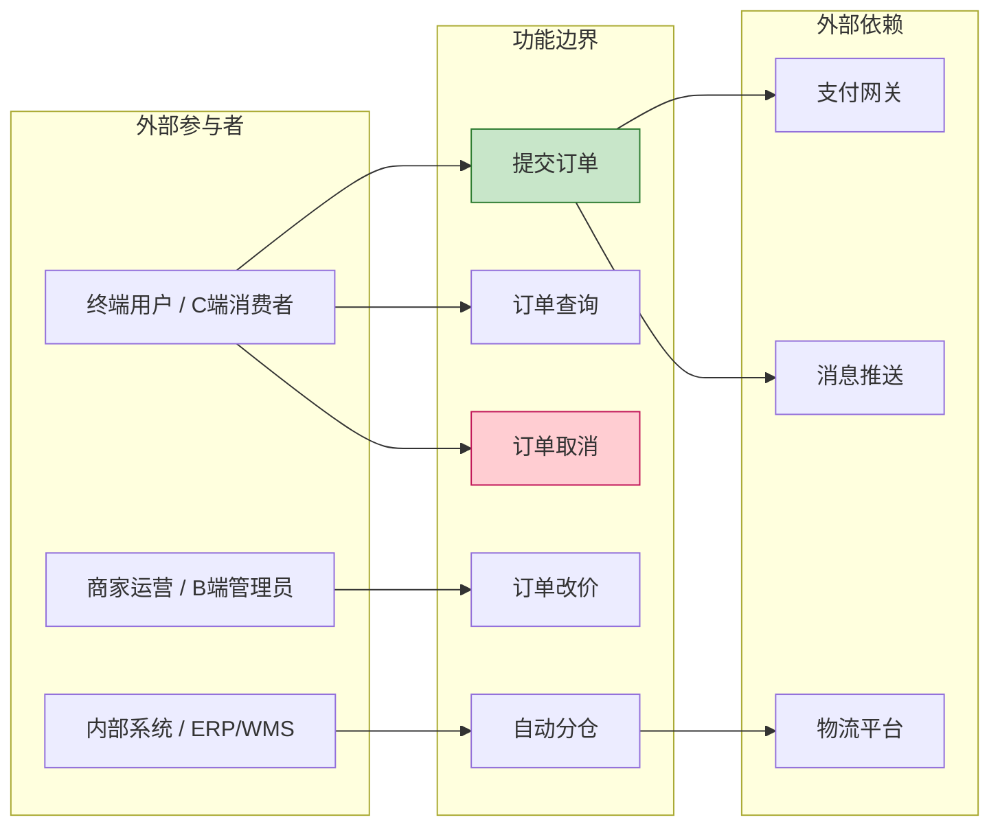
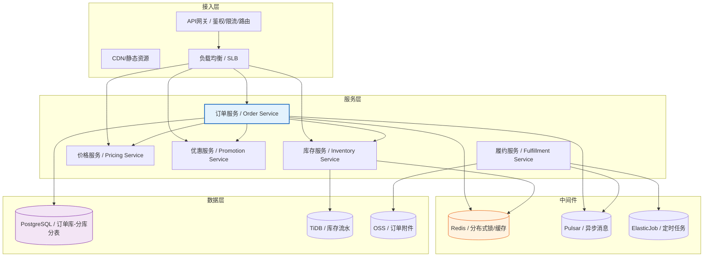
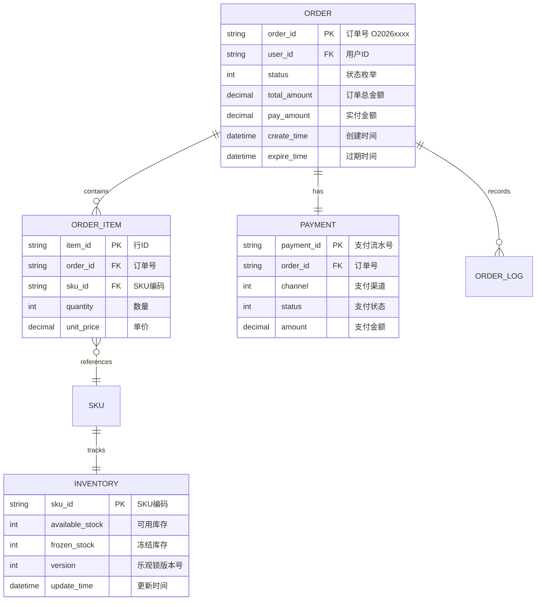
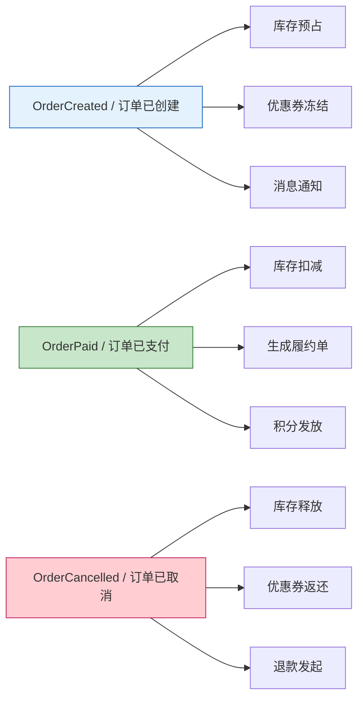
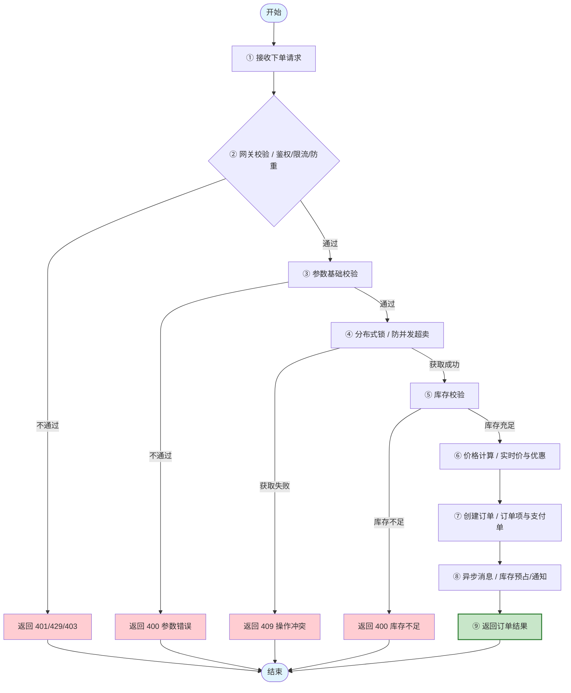
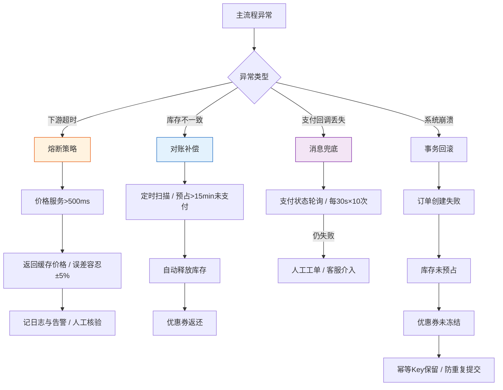
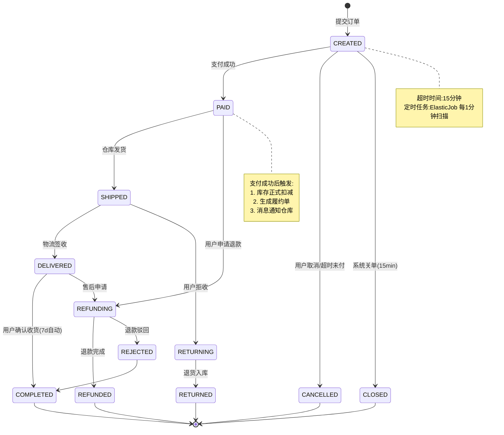
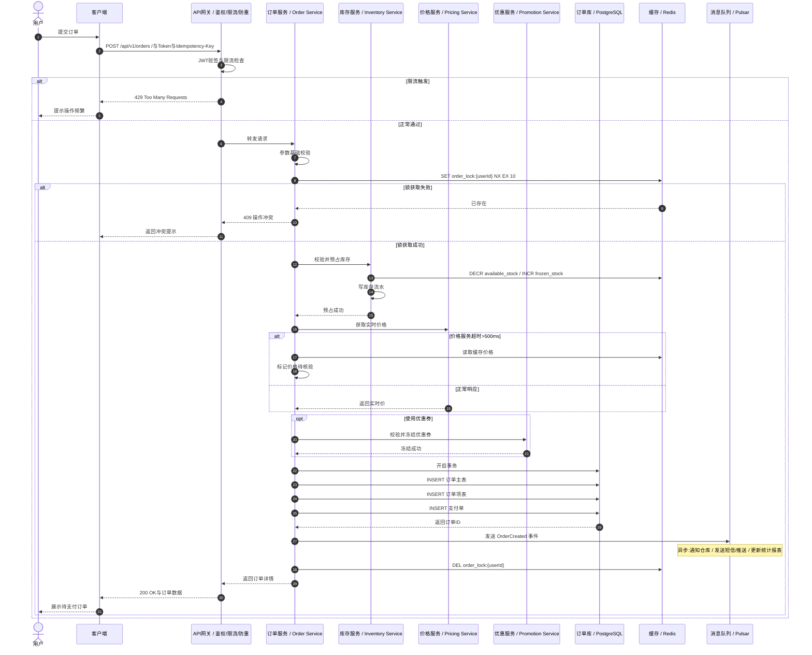
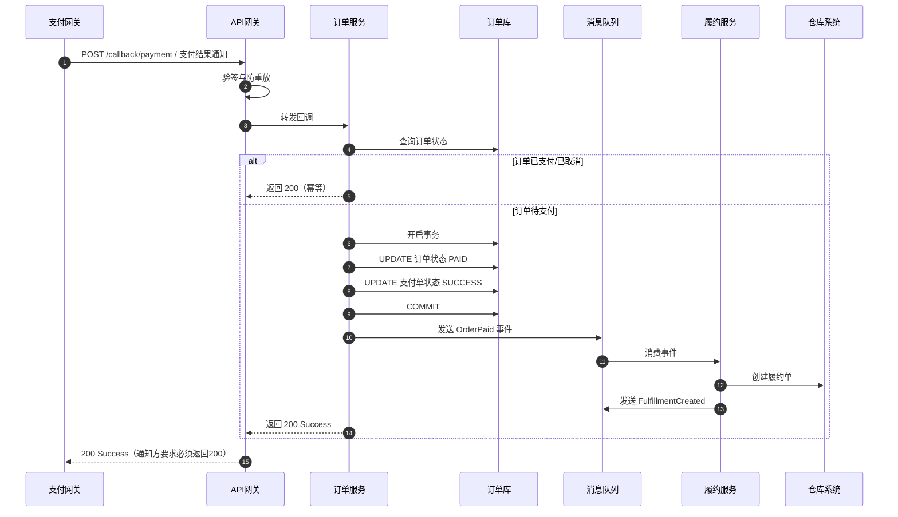

# [产品/系统名称（英文名）] - 功能需求文档（FRD）

> **文档状态：** 🟡 评审中 / 🟢 已通过 / 🔴 驳回
>
> **保密级别：** 机密 / 内部公开 / 公开
>
> **版本：** vX.X
>
> **日期：** YYYY-MM-DD
>
> **撰写人：** [姓名/角色]
>
> **评审人：** [姓名/角色]
>
> **阅读对象：** [角色列表]
>
> **文档层级：** MRD → PRD → **FRD**（本文档）
>
> **关联MRD：** [MRD编号] · [MRD版本]
>
> **关联PRD：** [PRD编号] · [PRD版本]

---

## 0. 文档导读

### 0.1 文档体系位置

FRD 承接 PRD 的产品方案，回答 **"这个功能如何实现"**，是研发、测试、运维的 **唯一技术事实来源**。


### 0.2 相关文档

| 文档类型 | 文件名              | 相关章节   |
| -------- | ------------------- | ---------- |
| [类型]   | [文件名] [行号范围] | [章节描述] |

> **引用格式说明**：关联文档使用 `文件名 行号范围` 格式（如 `【模板】技术需求文档(TRD).md 3-17`），行号随文档更新可能变化，请以实际内容为准。

### 0.3 变更记录

| 版本   | 日期       | 修订人 | 变更内容                                           | 审核人     |
| :----- | :--------- | :----- | :------------------------------------------------- | :--------- |
| v0.1   | YYYY-MM-DD | [姓名] | 初稿完成                                           | [架构师]   |
| v0.2   | YYYY-MM-DD | [姓名] | 补充异常流程与熔断策略                             | [架构师]   |
| v1.0   | YYYY-MM-DD | [姓名] | 技术评审通过，归档基线                             | [技术总监] |
| v1.0.1 | 2026-06-09 | 谢董   | 修复xychart-beta图为表格以兼容飞书渲染             | —          |
| v1.0.2 | 2026-06-20 | 谢董   | 消息中间件示例 RocketMQ→Pulsar（统一事件总线规范） | —          |

---

## 1. 功能概述（Functional Overview）

### 1.1 功能定义

| 属性         | 说明                                                                                     |
| :----------- | :--------------------------------------------------------------------------------------- |
| **功能名称** | [模块名称，如：智能订单履约引擎]                                                         |
| **功能ID**   | FUNC-XXX                                                                                 |
| **关联PRD**  | [PRD编号-章节，如：PRD-2026-001 §3.2]                                                    |
| **功能目标** | [一句话：系统需要实现的核心能力，如：实现高并发场景下的库存精准扣减与订单状态一致性保障] |
| **业务价值** | [量化价值：如：支撑大促期间10万TPS下单，库存超卖率<<0.001%]                              |

### 1.2 功能全景图（Use Case）



### 1.3 系统架构



---

## 2. 领域模型（Domain Model）

### 2.1 实体关系图（ER）



### 2.2 领域事件（Domain Events）



---

## 3. 业务流程（Business Process）

### 3.1 核心流程（Happy Path）



### 3.2 异常与降级流程



### 3.3 异常场景矩阵

| 异常ID      | 场景     | 触发条件             | 系统行为           | 错误码 | 用户提示                 | 监控告警 |
| :---------- | :------- | :------------------- | :----------------- | :----: | :----------------------- | :------: |
| TPL-ERR-001 | 参数缺失 | 必填字段为空         | 拒绝请求，记录日志 | 400001 | "请完善必填信息"         |    否    |
| TPL-ERR-002 | 重复提交 | 幂等Key已存在        | 返回上次结果       | 200001 | "操作成功"               |    否    |
| TPL-ERR-003 | 并发冲突 | 乐观锁版本不一致     | 提示数据已变更     | 409001 | "数据已更新，请刷新重试" |    是    |
| TPL-ERR-004 | 库存不足 | 可用库存<<购买量     | 拒绝下单           | 400002 | "商品库存不足，仅剩X件"  |    是    |
| TPL-ERR-005 | 依赖超时 | 下游服务>500ms未响应 | 熔断，返回降级数据 | 503001 | "服务繁忙，请稍后再试"   |    是    |
| TPL-ERR-006 | 价格变动 | 实时价与缓存价差>5%  | 提示价格更新       | 400003 | "商品价格已更新，请确认" |    否    |

---

## 4. 状态机（State Machine）

### 4.1 订单状态流转



### 4.2 状态转换规则

| 当前状态  | 目标状态  | 触发事件     | 前置条件       | 后置动作             | 权限 |
| :-------- | :-------- | :----------- | :------------- | :------------------- | :--- |
| CREATED   | PAID      | 支付回调成功 | 金额匹配       | 扣减库存、通知仓库   | 系统 |
| CREATED   | CANCELLED | 用户点击取消 | 未支付         | 释放库存、返还优惠券 | 买家 |
| CREATED   | CLOSED    | 超时关单     | 创建时间>15min | 释放库存、返还优惠券 | 系统 |
| PAID      | SHIPPED   | 仓库扫描出库 | 库存已扣减     | 更新物流单号         | 商家 |
| DELIVERED | COMPLETED | 自动确认收货 | 签收时间>7d    | 结算商家、发放积分   | 系统 |

---

## 5. 接口定义（Interface Definition）

### 5.1 接口清单

| 接口ID  | 接口名称     | 方法 | 路径                              |     调用方     | 并发预期  | 优先级 |
| :------ | :----------- | :--: | :-------------------------------- | :------------: | :-------- | :----: |
| API-001 | 创建订单     | POST | `/api/v1/orders`                  | App/Web/小程序 | 5000 TPS  |   P0   |
| API-002 | 查询订单详情 | GET  | `/api/v1/orders/{orderId}`        | App/Web/小程序 | 10000 TPS |   P0   |
| API-003 | 取消订单     | PUT  | `/api/v1/orders/{orderId}/cancel` |    App/Web     | 1000 TPS  |   P0   |
| API-004 | 订单列表     | GET  | `/api/v1/orders`                  |    App/Web     | 5000 TPS  |   P1   |
| API-005 | 支付回调     | POST | `/callback/payment`               |    支付网关    | 3000 TPS  |   P0   |

### 5.2 详细接口：API-001 创建订单

#### 5.2.1 接口概述

| 项           | 内容                                                             |
| :----------- | :--------------------------------------------------------------- |
| **接口名称** | 创建订单                                                         |
| **请求路径** | `POST /api/v1/orders`                                            |
| **接口描述** | 用户提交订单，系统校验库存、价格、优惠后创建订单，返回待支付订单 |
| **幂等性**   | 是（通过`idempotency-key`保证）                                  |
| **超时时间** | 3000ms                                                           |
| **降级策略** | 价格服务超时则使用缓存价格（误差容忍±5%）                        |

#### 5.2.2 请求头（Request Headers）

| 参数              |  类型  | 必填 | 示例                        | 说明                                       |
| :---------------- | :----: | :--: | :-------------------------- | :----------------------------------------- |
| Authorization     | string |  是  | `Bearer eyJhbG...`          | 访问令牌                                   |
| X-Request-ID      | string |  是  | `req_20260525103000_abc123` | 链路追踪ID，全局唯一                       |
| X-Idempotency-Key | string |  是  | `idem_user123_1625103000`   | 幂等键，同一键30分钟内重复请求返回相同结果 |
| Content-Type      | string |  是  | `application/json`          | 固定值                                     |
| X-Client-Version  | string |  否  | `ios/3.2.1`                 | 客户端版本，用于兼容性处理                 |

#### 5.2.3 请求体（Request Body）

```json
{
  "skuList": [
    {
      "skuId": "SKU20260525001",
      "quantity": 2,
      "source": "cart"
    }
  ],
  "addressId": "ADDR123456",
  "couponId": "CPN789012",
  "remark": "请尽快发货，急用",
  "source": "app_ios",
  "extInfo": {
    "deviceId": "device_abc123",
    "ip": "123.45.67.89"
  }
}
```

| 参数        |  类型  | 必填 | 校验规则                                 | 说明                       |
| :---------- | :----: | :--: | :--------------------------------------- | :------------------------- |
| skuList     | array  |  是  | 非空，长度1-50                           | 商品列表                   |
| └─ skuId    | string |  是  | 格式：`SKU`+年月日+3位流水               | 商品SKU                    |
| └─ quantity |  int   |  是  | 1~999                                    | 购买数量                   |
| └─ source   | string |  否  | 枚举：`cart`/`direct`/`activity`         | 来源：购物车/直接购买/活动 |
| addressId   | string |  是  | 已存在且有效的地址ID                     | 收货地址                   |
| couponId    | string |  否  | 有效优惠券ID                             | 优惠券                     |
| remark      | string |  否  | 长度≤200，过滤敏感词                     | 订单备注                   |
| source      | string |  否  | 枚举：`app_ios`/`app_android`/`web`/`mp` | 客户端来源                 |
| extInfo     | object |  否  | —                                        | 扩展信息，用于风控         |

#### 5.2.4 响应体（Response Body）

**成功响应（200 OK）：**

```json
{
  "code": 200,
  "message": "success",
  "traceId": "req_20260525103000_abc123",
  "data": {
    "orderId": "ORD202605250001",
    "status": "CREATED",
    "totalAmount": 299.0,
    "discountAmount": 30.0,
    "payAmount": 269.0,
    "itemCount": 2,
    "createTime": "2026-05-25T10:30:00+08:00",
    "expireTime": "2026-05-25T10:45:00+08:00",
    "paymentUrl": "https://pay.example.com/prepare?token=xxx"
  }
}
```

| 参数           |  类型   | 说明                                                                     |
| :------------- | :-----: | :----------------------------------------------------------------------- |
| orderId        | string  | 订单唯一标识，全局唯一                                                   |
| status         | string  | 订单状态：`CREATED`/`PAID`/`SHIPPED`/`DELIVERED`/`COMPLETED`/`CANCELLED` |
| totalAmount    | decimal | 订单总金额（元）                                                         |
| discountAmount | decimal | 优惠金额（元）                                                           |
| payAmount      | decimal | 实付金额（元）                                                           |
| itemCount      |   int   | 商品件数                                                                 |
| createTime     | string  | 创建时间（ISO8601）                                                      |
| expireTime     | string  | 支付截止时间（15分钟）                                                   |
| paymentUrl     | string  | 支付跳转链接（仅CREATED状态返回）                                        |

**错误响应（400 Bad Request）：**

```json
{
  "code": 400002,
  "message": "库存不足",
  "traceId": "req_20260525103000_abc123",
  "data": {
    "skuId": "SKU20260525001",
    "availableStock": 1,
    "requestQuantity": 2
  }
}
```

#### 5.2.5 错误码总表

| 错误码 | HTTP状态 | 说明         | 客户端处理建议                               |
| :----: | :------: | :----------- | :------------------------------------------- |
| 400001 |   400    | 参数校验失败 | 检查必填字段和格式                           |
| 400002 |   400    | 库存不足     | 提示商品库存不足，引导减少数量或选择其他商品 |
| 400003 |   400    | 优惠券不可用 | 提示优惠券已过期/不适用/已使用               |
| 400004 |   400    | 收货地址无效 | 引导用户重新选择地址                         |
| 401001 |   401    | 登录态失效   | 跳转登录页                                   |
| 429001 |   429    | 请求过于频繁 | 展示倒计时，限制提交频率                     |
| 409001 |   409    | 并发操作冲突 | 提示"数据已更新，请刷新重试"                 |
| 500001 |   500    | 系统内部错误 | 展示友好错误页，上报日志                     |
| 503001 |   503    | 下游服务繁忙 | 提示"服务繁忙，请稍后再试"，建议3秒后重试    |

---

## 6. 数据流与交互时序（Data Flow）

### 6.1 核心下单时序



### 6.2 支付回调时序



---

## 7. 非功能需求（NFR / SLA）

### 7.1 性能指标

> **说明**：xychart-beta为飞书不兼容Mermaid类型，改为表格描述（模板示例数据）。

**接口性能目标（P99响应时间 ms）**

| 接口        | P99 响应时间(ms) |
| :---------- | :--------------: |
| API-001创建 |       300        |
| API-002查询 |       100        |
| API-003取消 |       200        |
| API-004列表 |       150        |

| 指标项          | 目标值     | 测量方式              | 责任方 |
| :-------------- | :--------- | :-------------------- | :----- |
| 核心接口P99延迟 | ≤ 300ms    | APM监控（SkyWalking） | 后端   |
| 查询接口P99延迟 | ≤ 100ms    | APM监控               | 后端   |
| 并发处理能力    | ≥ 5000 TPS | 全链路压测            | 架构   |
| 数据库QPS       | ≥ 10000    | 慢查询监控            | DBA    |
| 缓存命中率      | ≥ 95%      | Redis监控             | 后端   |

### 7.2 可用性与可靠性

| 指标项     | 目标值                     | 实现方式                   |
| :--------- | :------------------------- | :------------------------- |
| 系统可用性 | ≥ 99.95%                   | 多活部署 + 自动故障转移    |
| 数据一致性 | 强一致性（订单/库存/支付） | 分布式事务（Seata AT模式） |
| 数据持久化 | RPO=0, RTO<<30s            | 主从同步 + 自动切换        |
| 降级能力   | 核心链路可降级             | 熔断（Sentinel）+ 兜底缓存 |

### 7.3 安全与合规

| 项         | 要求                            | 验证方式       |
| :--------- | :------------------------------ | :------------- |
| 传输加密   | TLS 1.3                         | SSL Labs扫描   |
| 敏感数据   | 手机号/身份证 AES-256加密存储   | 安全审计       |
| 防重放攻击 | 时间戳+随机数+签名，有效期5分钟 | 渗透测试       |
| 权限控制   | RBAC + 数据权限隔离             | 自动化权限扫描 |
| 审计日志   | 所有资金操作留痕，保留180天     | 日志审计       |

---

## 8. 验收标准（Acceptance Criteria）

### 8.1 功能验收（Given-When-Then）

| AC-ID  | 验收标准（Gherkin格式）                                                                                                                                    |   测试类型   | 通过标准 |
| :----- | :--------------------------------------------------------------------------------------------------------------------------------------------------------- | :----------: | :------: |
| AC-001 | **Given** 用户已登录且购物车有2件商品<br>**When** 用户提交订单并选择有效地址<br>**Then** 系统创建状态为CREATED的订单<br>**And** 返回15分钟内有效的支付链接 |   集成测试   | 100%通过 |
| AC-002 | **Given** 商品库存仅剩1件<br>**When** 用户尝试购买2件<br>**Then** 系统拒绝下单<br>**And** 返回错误码400002<br>**And** 库存未被预占                         |   异常测试   | 100%通过 |
| AC-003 | **Given** 用户已提交订单未支付<br>**When** 15分钟后系统关单任务执行<br>**Then** 订单状态变为CLOSED<br>**And** 库存自动释放<br>**And** 优惠券自动返还       | 定时任务测试 | 100%通过 |
| AC-004 | **Given** 1000并发用户同时购买同一SKU<br>**When** 库存为500件<br>**Then** 成功订单数=500<br>**And** 无超卖现象<br>**And** 无重复扣款                       |   并发测试   | 100%通过 |
| AC-005 | **Given** 价格服务响应>500ms<br>**When** 用户提交订单<br>**Then** 系统使用缓存价格<br>**And** 订单创建成功<br>**And** 触发价格差异告警                     |   降级测试   | 100%通过 |

### 8.2 性能验收

| 验收项   | 场景                 | 目标                               | 测试工具       |
| :------- | :------------------- | :--------------------------------- | :------------- |
| 压测-001 | 创建订单接口         | 5000 TPS，P99<<300ms，错误率<<0.1% | JMeter/Gatling |
| 压测-002 | 混合场景（查/创/取） | 10000 TPS，系统负载<<70%           | 全链路压测平台 |
| 压测-003 | 数据库容量           | 单表1亿行，查询P99<<100ms          | 容量测试       |

---

## 9. 发布与灰度计划（Release Plan）

### 9.1 灰度策略


### 9.2 发布检查清单

| 阶段   | 检查项                         | 负责人    | 状态 |
| :----- | :----------------------------- | :-------- | :--: |
| 发布前 | 代码Review通过（≥2人）         | Tech Lead |  ⬜  |
| 发布前 | 单元测试覆盖率≥80%             | 研发      |  ⬜  |
| 发布前 | 接口契约测试通过               | 测试      |  ⬜  |
| 发布前 | 数据库变更脚本评审通过         | DBA       |  ⬜  |
| 发布前 | 监控大盘/告警规则配置完成      | SRE       |  ⬜  |
| 发布中 | 蓝绿部署，流量切换10%→50%→100% | SRE       |  ⬜  |
| 发布后 | 核心接口P99延迟监控            | SRE       |  ⬜  |
| 发布后 | 错误率<<0.1%持续30分钟         | SRE       |  ⬜  |
| 发布后 | 业务指标（下单成功率）无下跌   | 产品      |  ⬜  |

### 9.3 回滚策略

| 触发条件          | 回滚动作                         | 回滚时间目标 | 负责人 |
| :---------------- | :------------------------------- | :----------- | :----- |
| P0 Bug影响>1%用户 | 立即切换流量至旧版本             | ≤ 5分钟      | SRE    |
| 性能下跌>50%      | 降级非核心链路，保留核心下单     | ≤ 3分钟      | SRE    |
| 数据库异常        | 暂停写入，切换只读模式，人工介入 | ≤ 10分钟     | DBA    |

---

## 10. 附录（Appendix）

- **附录A：** 数据库变更脚本（DDL/DML）
- **附录B：** 接口契约测试用例集
- **附录C：** 压测报告模板与历史基线
- **附录D：** 第三方服务对接文档（支付/物流/短信）
- **附录E：** 名词解释与数据字典

> **FRD 撰写原则（大厂标准）：**
>
> 1. **可测试性**：每个功能点必须对应至少一条 AC（验收标准）。
> 2. **可观测性**：每个接口必须定义 traceId、错误码、监控埋点。
> 3. **可回滚性**：每个变更必须考虑回滚方案，数据变更需兼容旧版本。
> 4. **防御性**：每个外部依赖必须有超时、熔断、降级策略。
> 5. **一致性**：状态机必须覆盖全生命周期，禁止出现"悬停状态"。
