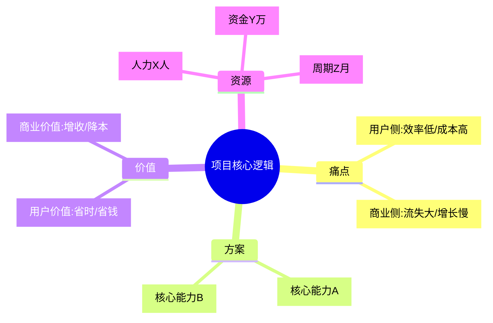
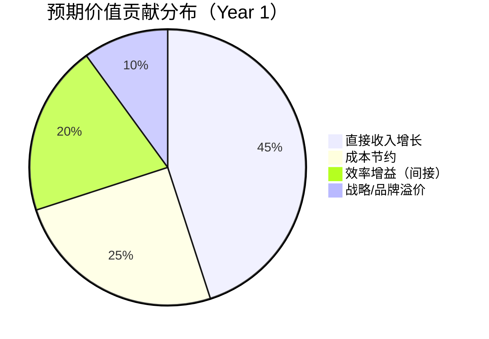
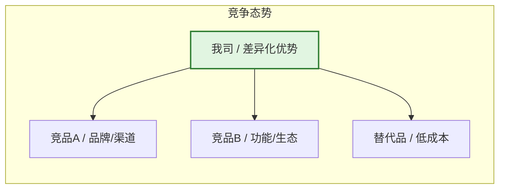
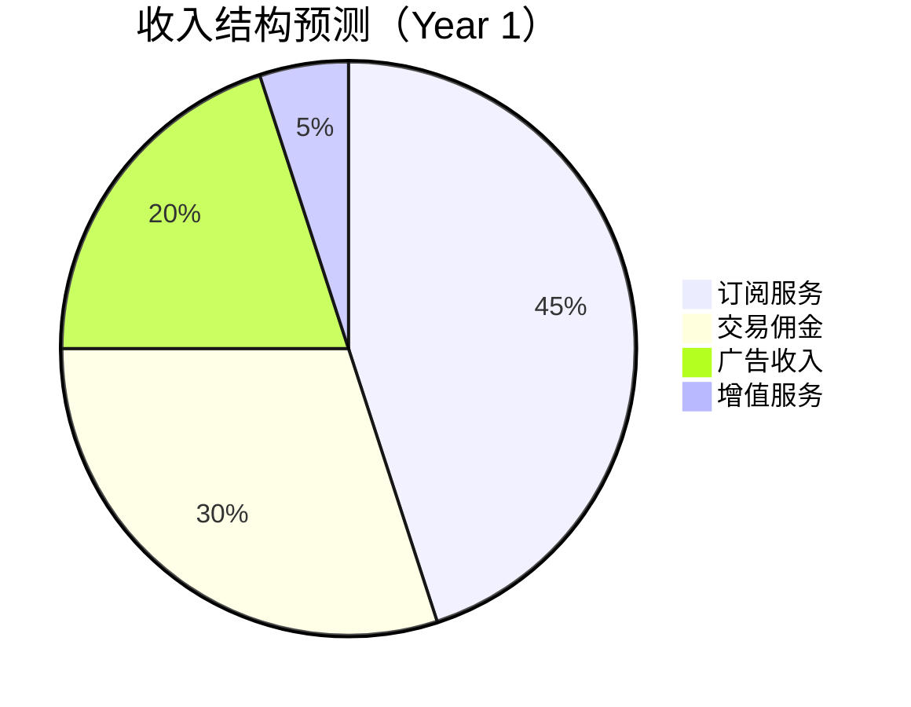
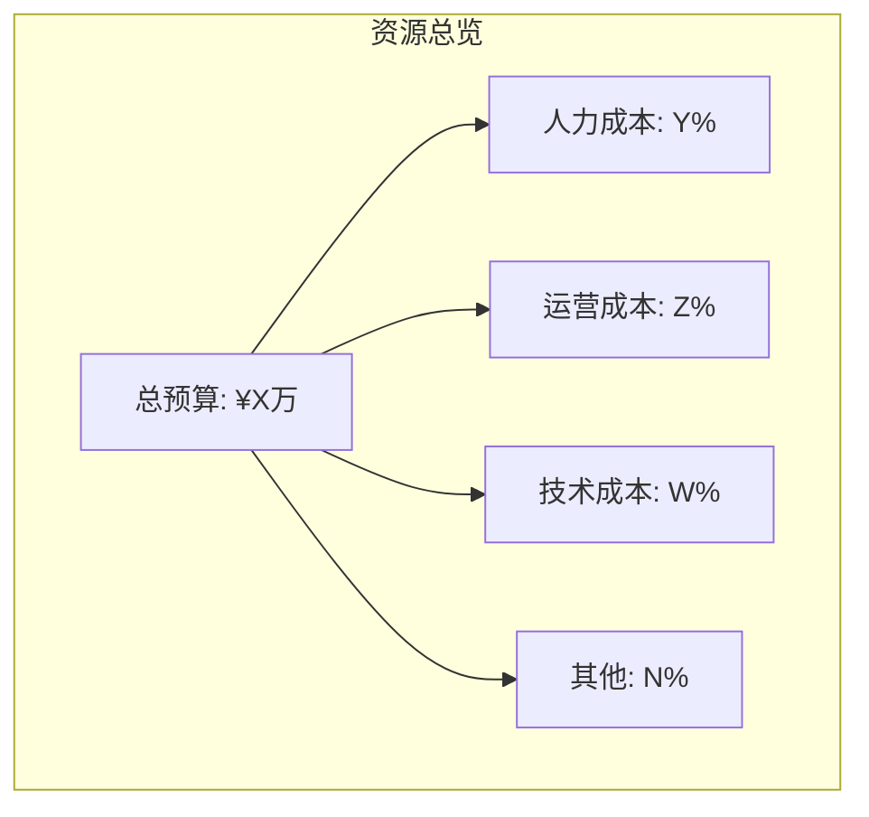
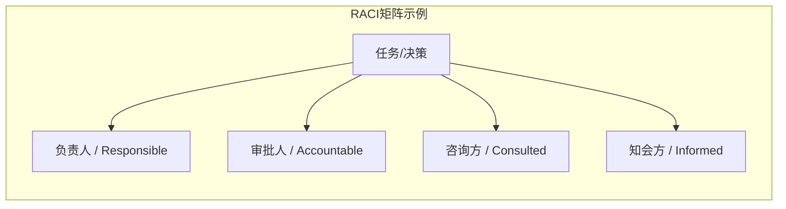
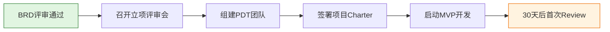

# [产品/系统名称（英文名）] - 商业需求文档（BRD）

> **文档状态：** 🟡 评审中 / 🟢 已通过 / 🔴 驳回
>
> **保密级别：** 机密 / 内部公开 / 公开
>
> **版本：** vX.X
>
> **日期：** YYYY-MM-DD
>
> **撰写人：** [姓名/角色]
>
> **评审人：** [姓名/角色]
>
> **阅读对象：** [角色列表]

---

## 0. 文档导读

### 0.1 文档目的与适用范围

[说明本文档的目的、适用场景和不适用场景]

### 0.2 相关文档

| 文档类型 | 文件名 | 相关章节 |
|---------|--------|---------|
| [类型] | [文件名] [行号范围] | [章节描述] |

> **引用格式说明**：关联文档使用 `文件名 行号范围` 格式（如 `【模板】技术需求文档(TRD).md 3-17`），行号随文档更新可能变化，请以实际内容为准。

### 0.3 变更记录

| 版本 | 日期 | 修订人 | 变更内容 | 审核人 |
| :--- | :--- | :--- | :--- | :--- |
| v0.1 | YYYY-MM-DD | [姓名] | 初稿完成 | [审核人] |
| v0.2 | YYYY-MM-DD | [姓名] | 补充财务模型与风险对策 | [审核人] |
| v0.3 | 2026-06-09 | 谢董 | 修复：quadrantChart 模板改为表格格式（飞书不兼容） | — |
| v0.3.1 | 2026-06-09 | 谢董 | 修复xychart-beta图为表格以兼容飞书渲染 | — |
| v0.3.2 | 2026-06-09 | 谢董 | 修复gantt图为表格以兼容飞书渲染 | — |

---

## 1. 执行摘要（Executive Summary）

> **电梯演讲：** 在 30 秒内说清本项目"是什么、为什么、赚多少"。

| 要素           | 内容                                                            |
| :------------- | :-------------------------------------------------------------- |
| **项目一句话** | [用一句话描述产品定位，如："面向Z世代的AI驱动的个性化学习平台"] |
| **核心机会**   | [市场痛点 + 机会窗口，带关键数据]                               |
| **投入概览**   | 总预算 ¥[X]万，周期 [Y] 个月，需 [Z] 人核心团队                 |
| **回报预测**   | 3 年 ROI [X]%，盈亏平衡点在第 [N] 个月，LTV/CAC = [M]           |
| **决策建议**   | 🟢 立即启动 / 🟡 补充调研后启动 / 🔴 暂缓                       |

---

## 2. 方案背景（Background）

### 2.1 需求洞察

| 维度         | 核心内容                                   | 关键数据                                  |
| :----------- | :----------------------------------------- | :---------------------------------------- |
| **市场痛点** | [一句话描述用户/客户未被满足的痛点]        | [如：调研显示73%用户希望XX功能]           |
| **机会窗口** | [为什么现在是最佳时机？政策/技术/竞争变化] | [如：AI技术成本下降80%，政策红利期12个月] |
| **战略契合** | [对齐公司年度 OKR / 战略方向]              | [如：对齐"AI First"战略，支撑Q3增长目标]  |

### 2.2 数据支撑

- **用户侧数据：** [如：NPS 仅 32，行业标杆 65；核心场景流失率 35%，行业平均 15%]
- **业务侧数据：** [如：当前获客成本 ¥120，竞品 ¥60；客单价 ¥2000，年复购率 8%]
- **竞品侧数据：** [如：竞品上线该功能后 DAU 提升 20%，付费转化率提升 5pp]

### 2.3 竞争优势分析

> **说明**：此象限图模板已转为表格描述。

<!--
原 quadrantChart 结构参考：
- title: 竞争优势分析（执行难度 vs 商业价值）
- x-axis: 低执行难度 --> 高执行难度
- y-axis: 低商业价值 --> 高商业价值
- quadrant-1: 重点投入（高价值/低难度）
- quadrant-2: 差异化优势（高价值/高难度）
- quadrant-3: 谨慎投入（低价值/低难度）
- quadrant-4: 快速收割（低价值/高难度）
- 数据点: "我们的方案": [0.3, 0.85]; "竞品A方案": [0.6, 0.55]; "竞品B方案": [0.8, 0.45]; "行业平均": [0.5, 0.5]
-->

| 象限 | 区域特征 | 策略建议 |
| :--- | :--- | :--- |
| 象限1（低难度·高价值） | 重点投入（高价值/低难度） | 立即立项，快速推进 |
| 象限2（高难度·高价值） | 差异化优势（高价值/高难度） | 分阶段攻坚，建立壁垒 |
| 象限3（低难度·低价值） | 谨慎投入（低价值/低难度） | 资源充裕时启动，不优先 |
| 象限4（高难度·低价值） | 快速收割（低价值/高难度） | 重新评估必要性，避免资源浪费 |

| 名称 | X值 | Y值 | 象限 |
| :--- | :---: | :---: | :--- |
| 我们的方案 | 0.3 | 0.85 | 象限1（重点投入） |
| 竞品A方案 | 0.6 | 0.55 | 象限2（差异化优势） |
| 竞品B方案 | 0.8 | 0.45 | 象限4（快速收割） |
| 行业平均 | 0.5 | 0.5 | 中线位置 |

---

## 3. 产品价值（Value Proposition）

### 3.1 用户价值

- **核心用户：** [用户画像，如：25-35岁一线城市白领，月收入15-30K，注重效率]
- **解决场景：** [场景化描述，如：当用户需要在 30 分钟内完成周报时，能够一键生成框架并自动填充数据]
- **价值量化：** [节省 X 时间 / 降低 Y 成本 / 提升 Z 体验，如：单任务耗时从 2h 降至 15min]

### 3.2 商业价值

| 价值类型     | 具体描述                            | 量化指标                   | 测算依据     |
| :----------- | :---------------------------------- | :------------------------- | :----------- |
| **收入增长** | [如：开辟新付费场景 / 提升客单价]   | GMV +X% / ARPU +¥Y         | [假设与公式] |
| **成本降低** | [如：自动化替代人工 / 降低获客成本] | 人力成本 -Y% / CAC -Z%     | [假设与公式] |
| **效率提升** | [如：缩短交付周期 / 提升人效]       | 周期 -Z% / 人效 +W%        | [假设与公式] |
| **战略卡位** | [如：布局 AI 赛道 / 构建生态壁垒]   | 市场份额 +Npp / 生态覆盖率 | [假设与公式] |

---

## 4. 市场分析（Market Analysis）

### 4.1 市场规模（TAM / SAM / SOM）

> **引用说明**：详细的市场规模数据、增长趋势和预测模型，请参阅 **【模板】市场调研报告.md §4. 市场规模与趋势**。本文档仅引用关键结论。

| 指标                  |  数值  | 数据来源                 | 测算逻辑                   |
| :-------------------- | :----: | :----------------------- | :------------------------- |
| **TAM（潜在市场）**   | ¥[X]亿 | 引用市场调研报告§4.1     | [整体市场规模及增长率]     |
| **SAM（可服务市场）** | ¥[Y]亿 | 引用市场调研报告§4.3     | [我司能力可覆盖的市场]     |
| **SOM（可获得市场）** | ¥[Z]亿 | 引用市场调研报告§4.5     | [基于当前资源可获取的份额] |

> **完整数据**：市场规模历史数据、预测模型（三情景）、敏感性分析详见 **【模板】市场调研报告.md §4.4-4.6**。

### 4.2 竞争格局

> **引用说明**：详细的竞品分析、能力对比、用户反馈和战略洞察，请参阅 **【模板】竞品分析报告.md**。本文档仅引用关键结论。

**竞争态势概要**：

| 竞品类型 | 代表竞品 | 核心优势 | 主要劣势 | 我们的差异化 | 详细分析 |
| :--- | :--- | :--- | :--- | :--- | :--- |
| **直接竞品** | [名称] | [优势] | [劣势] | [差异化] | 引用竞品分析报告§6.1 |
| **间接竞品** | [名称] | [优势] | [劣势] | [差异化] | 引用竞品分析报告§6.2 |
| **替代品** | [名称] | [优势] | [劣势] | [差异化] | 引用竞品分析报告§6.3 |

> **完整分析**：竞品组织画像、$APPEALS分析、功能矩阵、用户反馈详见 **【模板】竞品分析报告.md §4-8**。

---

## 5. 产品解决方案（Solution Overview）

### 5.1 产品形态与业务闭环

### 5.2 业务模式

| 要素         | 说明                                       |
| :----------- | :----------------------------------------- |
| **目标用户** | C端 / B端 / 平台 / G端                     |
| **参与方**   | [用户、商家、平台、服务商、监管方等]       |
| **价值流转** | [用户获得效率，商家获得订单，平台获得佣金] |
| **利益分配** | [平台抽成 X%，服务商分成 Y%，商家自留 Z%]  |

### 5.3 盈利模式

| 盈利模式     | 定价逻辑               | 预期占比 | 备注       |
| :----------- | :--------------------- | :------: | :--------- |
| **订阅服务** | [如：¥99/月，¥899/年]  |   45%    | 核心现金流 |
| **交易佣金** | [如：GMV 的 3-5%]      |   30%    | 规模效应型 |
| **广告收入** | [如：CPC/CPM/品牌专区] |   20%    | 流量变现   |
| **增值服务** | [如：定制/培训/数据]   |    5%    | 高毛利     |

---

## 6. 执行计划（Execution Plan）

### 6.1 阶段里程碑（Roadmap）

> **说明**：甘特图为飞书不兼容类型，改为表格描述。

| 阶段 | 任务 | 开始日期 | 工期 | 状态 |
|:---|:---|:---|:---:|:---:|
| 验证期 | 需求验证与MVP开发 | YYYY-MM | 2M | ⚪ |
| 验证期 | 种子用户测试 | MVP完成后 | 1M | ⚪ |
| 成长期 | 功能完善与PMF达成 | 种子测试完成后 | 3M | ⚪ |
| 成长期 | 规模化推广 | PMF达成后 | 3M | ⚪ |
| 成熟期 | 商业化变现 | 推广完成后 | 3M | ⚪ |
| 成熟期 | 生态建设与第二曲线 | 变现完成后 | 3M | ⚪ |

### 6.2 关键里程碑与交付物

| 阶段       | 时间    | 核心目标         | 关键交付物           | Go/No-Go 标准 |
| :--------- | :------ | :--------------- | :------------------- | :------------ |
| **验证期** | M1-M3   | 验证需求真实性   | MVP、测试报告        | 留存率 > X%   |
| **成长期** | M4-M6   | 找到产品市场契合 | 完整版产品、运营体系 | PMF 指标达标  |
| **规模化** | M7-M9   | 快速扩张用户规模 | 推广方案、渠道体系   | CAC < LTV/3   |
| **变现期** | M10-M12 | 验证商业模式     | 商业化产品、财务模型 | 单月盈亏平衡  |

### 6.3 资源需求与预算

| 资源类型     | 需求明细                                           | 预算（万元） | 备注     |
| :----------- | :------------------------------------------------- | :----------: | :------- |
| **人力成本** | 产品 [X] 人、研发 [Y] 人、设计 [Z] 人、运营 [W] 人 |    [金额]    | 含外包   |
| **运营成本** | 推广、内容、活动、渠道                             |    [金额]    | 首年重点 |
| **技术成本** | 服务器、云资源、第三方服务、带宽                   |    [金额]    | 按量预估 |
| **其他**     | 办公、差旅、合规、法务                             |    [金额]    | 预留 10% |
| **合计**     |                                                    | **[总金额]** |          |

### 6.4 干系人与职责（RACI 矩阵）

| 事项     | 产品负责人 | 研发负责人 | 运营负责人 | 财务/法务 |  CEO  |
| :------- | :--------: | :--------: | :--------: | :-------: | :---: |
| BRD 审批 |     C      |     I      |     I      |     C     | **A** |
| 预算分配 |     C      |     C      |     C      |   **R**   | **A** |
| 产品方案 |   **R**    |     C      |     C      |     I     |   A   |
| 技术架构 |     C      |   **R**    |     I      |     I     |   A   |
| 上线决策 |     C      |     C      |   **R**    |     I     | **A** |

---

## 7. 财务预估（Financial Forecast）

### 7.1 投入产出模型（3 年）

|    年度    | 投入（万） | 收入（万） | 利润（万） | 累计利润 | ROI  | 备注   |
| :---: | :---: | :---: | :---: | :---: | :---: | :--- |
| **Year 1** |    500     |    200     |    -300    |   -300   | -60% | 投入期 |
| **Year 2** |    800     |   1,500    |    700     |   400    | 88%  | 增长期 |
| **Year 3** |   1,000    |   3,000    |   2,000    |  2,400   | 200% | 盈利期 |

<svg xmlns="http://www.w3.org/2000/svg" viewBox="0 0 600 420" style="max-width:600px;height:auto">
<rect width="600" height="420" fill="#fafafa" rx="8"/>
<text x="300" y="28" text-anchor="middle" font-size="16" font-weight="bold" fill="#333">3 年财务趋势（万元）</text>
<line x1="60" y1="370.0" x2="580" y2="370.0" stroke="#eee" stroke-width="1"/>
<text x="55" y="374.0" text-anchor="end" font-size="11" fill="#999">-500</text>
<line x1="60" y1="304.0" x2="580" y2="304.0" stroke="#eee" stroke-width="1"/>
<text x="55" y="308.0" text-anchor="end" font-size="11" fill="#999">200</text>
<line x1="60" y1="238.0" x2="580" y2="238.0" stroke="#eee" stroke-width="1"/>
<text x="55" y="242.0" text-anchor="end" font-size="11" fill="#999">900</text>
<line x1="60" y1="172.0" x2="580" y2="172.0" stroke="#eee" stroke-width="1"/>
<text x="55" y="176.0" text-anchor="end" font-size="11" fill="#999">1600</text>
<line x1="60" y1="106.0" x2="580" y2="106.0" stroke="#eee" stroke-width="1"/>
<text x="55" y="110.0" text-anchor="end" font-size="11" fill="#999">2300</text>
<line x1="60" y1="40.0" x2="580" y2="40.0" stroke="#eee" stroke-width="1"/>
<text x="55" y="44.0" text-anchor="end" font-size="11" fill="#999">3000</text>
<text x="16" y="205" text-anchor="middle" font-size="12" fill="#666" transform="rotate(-90, 16, 205)">金额</text>
<line x1="60" y1="370" x2="580" y2="370" stroke="#ccc" stroke-width="1"/>
<polyline points="146.7,275.7 320.0,247.4 493.3,228.6" fill="none" stroke="#5470c6" stroke-width="2.5" stroke-linejoin="round" stroke-linecap="round"/>
<circle cx="146.7" cy="275.7" r="4" fill="#5470c6" stroke="#fff" stroke-width="1.5"/>
<text x="146.7" y="265.7" text-anchor="middle" font-size="10" fill="#5470c6" font-weight="bold">500</text>
<circle cx="320.0" cy="247.4" r="4" fill="#5470c6" stroke="#fff" stroke-width="1.5"/>
<text x="320.0" y="237.4" text-anchor="middle" font-size="10" fill="#5470c6" font-weight="bold">800</text>
<circle cx="493.3" cy="228.6" r="4" fill="#5470c6" stroke="#fff" stroke-width="1.5"/>
<text x="493.3" y="218.6" text-anchor="middle" font-size="10" fill="#5470c6" font-weight="bold">1000</text>
<polyline points="146.7,304.0 320.0,181.4 493.3,40.0" fill="none" stroke="#91cc75" stroke-width="2.5" stroke-linejoin="round" stroke-linecap="round"/>
<circle cx="146.7" cy="304.0" r="4" fill="#91cc75" stroke="#fff" stroke-width="1.5"/>
<text x="146.7" y="294.0" text-anchor="middle" font-size="10" fill="#91cc75" font-weight="bold">200</text>
<circle cx="320.0" cy="181.4" r="4" fill="#91cc75" stroke="#fff" stroke-width="1.5"/>
<text x="320.0" y="171.4" text-anchor="middle" font-size="10" fill="#91cc75" font-weight="bold">1500</text>
<circle cx="493.3" cy="40.0" r="4" fill="#91cc75" stroke="#fff" stroke-width="1.5"/>
<text x="493.3" y="30.0" text-anchor="middle" font-size="10" fill="#91cc75" font-weight="bold">3000</text>
<polyline points="146.7,351.1 320.0,256.9 493.3,134.3" fill="none" stroke="#fc8452" stroke-width="2.5" stroke-linejoin="round" stroke-linecap="round"/>
<circle cx="146.7" cy="351.1" r="4" fill="#fc8452" stroke="#fff" stroke-width="1.5"/>
<text x="146.7" y="341.1" text-anchor="middle" font-size="10" fill="#fc8452" font-weight="bold">-300</text>
<circle cx="320.0" cy="256.9" r="4" fill="#fc8452" stroke="#fff" stroke-width="1.5"/>
<text x="320.0" y="246.9" text-anchor="middle" font-size="10" fill="#fc8452" font-weight="bold">700</text>
<circle cx="493.3" cy="134.3" r="4" fill="#fc8452" stroke="#fff" stroke-width="1.5"/>
<text x="493.3" y="124.3" text-anchor="middle" font-size="10" fill="#fc8452" font-weight="bold">2000</text>
<text x="146.7" y="390" text-anchor="middle" font-size="12" fill="#333">Year 1</text>
<text x="320.0" y="390" text-anchor="middle" font-size="12" fill="#333">Year 2</text>
<text x="493.3" y="390" text-anchor="middle" font-size="12" fill="#333">Year 3</text>
<line x1="165.0" y1="414" x2="177.0" y2="414" stroke="#5470c6" stroke-width="2.5"/>
<circle cx="171.0" cy="414" r="3" fill="#5470c6" stroke="#fff" stroke-width="1"/>
<text x="181.0" y="418" font-size="12" fill="#333">投入</text>
<line x1="255.0" y1="414" x2="267.0" y2="414" stroke="#91cc75" stroke-width="2.5"/>
<circle cx="261.0" cy="414" r="3" fill="#91cc75" stroke="#fff" stroke-width="1"/>
<text x="271.0" y="418" font-size="12" fill="#333">收入</text>
<line x1="345.0" y1="414" x2="357.0" y2="414" stroke="#fc8452" stroke-width="2.5"/>
<circle cx="351.0" cy="414" r="3" fill="#fc8452" stroke="#fff" stroke-width="1"/>
<text x="361.0" y="418" font-size="12" fill="#333">利润</text>
</svg>

### 7.2 关键财务假设

| 指标                    | 假设值      | 依据 / 风险                       |
| :---------------------- | :---------- | :-------------------------------- |
| **用户获取成本（CAC）** | ≤ ¥50       | [渠道测试数据 / 若超支需调整策略] |
| **用户终身价值（LTV）** | ≥ ¥300      | [付费率 × ARPU × 生命周期]        |
| **LTV / CAC**           | ≥ 6         | [健康 SaaS 标准 > 3]              |
| **月度流失率**          | < 5%        | [行业基准 / 产品粘性假设]         |
| **盈亏平衡周期**        | 第 [N] 个月 | [基于当前现金流模型]              |

### 7.3 敏感性分析

| 情景     | 关键变量变化               | Year 3 利润 | 策略调整               |
| :------- | :------------------------- | :---------: | :--------------------- |
| **乐观** | 获客成本 -30%，付费率 +50% |   +4,000    | 加大投入，快速扩张     |
| **基准** | 按假设执行                 |   +2,000    | 按计划推进             |
| **悲观** | 获客成本 +50%，付费率 -30% |    +800     | 控制规模，聚焦核心用户 |

---

## 8. 风险与对策（Risk & Mitigation）

### 8.1 风险登记册

> **引用说明**：完整的风险登记册（含触发条件和退出条件）请参阅 **【模板】项目任务书.md §11.1**。本文档仅列出商业层面的核心风险。

| 风险 ID   | 风险描述           | 可能性 | 影响度 | 风险等级 | 应对策略                                   |   责任人   |  退出条件               |
| :-------- | :----------------- | :----: | :----: | :------: | :----------------------------------------- | :--------: | :--------------------- |
| **R-001** | 政策监管变化       |   中   |   高   |  🔴 高   | 提前与合规沟通，预留政策缓冲期；多区域备案 |    法务    | 监管叫停则暂停         |
| **R-002** | 核心人员流失       |   中   |   高   |  🔴 高   | 知识文档化，AB角机制，股权激励             |     HR     | 关键岗位空缺>2周则缩减范围 |
| **R-003** | 市场接受度不及预期 |   中   |   高   |  🔴 高   | MVP 快速验证，数据不达标即 Pivot           | 产品负责人 | MVP留存率<<20%则终止    |
| **R-004** | 竞品快速跟进       |   高   |   中   |  🟡 中   | 建立技术/数据壁垒，加速迭代                | 战略负责人 | 市场份额<<5%则调整目标 |

### 8.2 风险热力图

> **说明**：此象限图模板已转为表格描述。

<!--
原 quadrantChart 结构参考：
- title: 风险热力图（可能性 vs 影响度）
- x-axis: 低可能性 --> 高可能性
- y-axis: 低影响度 --> 高影响度
- quadrant-1: 重点关注（高/高）
- quadrant-2: 密切监控（低/高）
- quadrant-3: 一般关注（低/低）
- quadrant-4: 定期回顾（高/低）
- 数据点: "R-001 政策": [0.5, 0.9]; "R-002 人员": [0.5, 0.9]; "R-003 技术": [0.8, 0.6]; "R-004 市场": [0.5, 0.9]; "R-005 竞品": [0.8, 0.6]
-->

| 象限 | 区域特征 | 策略建议 |
| :--- | :--- | :--- |
| 象限1（高可能性·高影响度） | 重点关注（高/高） | 制定应急预案，定期演练 |
| 象限2（低可能性·高影响度） | 密切监控（低/高） | 设定预警阈值，持续跟踪 |
| 象限3（低可能性·低影响度） | 一般关注（低/低） | 常规管理，不必过度关注 |
| 象限4（高可能性·低影响度） | 定期回顾（高/低） | 建立流程化管理，控制发生频次 |

| 名称 | X值 | Y值 | 象限 |
| :--- | :---: | :---: | :--- |
| R-001 政策 | 0.5 | 0.9 | 象限2（密切监控） |
| R-002 人员 | 0.5 | 0.9 | 象限2（密切监控） |
| R-003 技术 | 0.8 | 0.6 | 象限1（重点关注） |
| R-004 市场 | 0.5 | 0.9 | 象限2（密切监控） |
| R-005 竞品 | 0.8 | 0.6 | 象限1（重点关注） |

---

## 9. 决策建议（Recommendation）

> **建议决策：** 🟢 立即启动 / 🟡 补充调研后启动 / 🔴 暂缓

### 9.1 关键理由（3 句话总结）

1. **[市场机会]** [一句话说明市场足够大且时机正确]
2. **[资源匹配]** [一句话说明所需资源在可承受范围内]
3. **[回报预期]** [一句话说明预期回报符合公司战略与财务要求]

### 9.2 下一步动作

| 序号 | 下一步动作              | 负责人 | 截止时间 | 交付物              |
| :---: | :--- | :--- | :--- | :--- |
|  1   | 召开 BRD 立项评审会     | [姓名] | [日期]   | 会议纪要 + 决策结论 |
|  2   | 确定 PDT 核心成员       | [姓名] | [日期]   | 团队名单            |
|  3   | 签署项目 Charter        | [姓名] | [日期]   | 签字版 Charter      |
|  4   | 启动需求细化与 MVP 设计 | [姓名] | [日期]   | PRD 初稿            |

---

## 10. 附录（Appendix）

### 10.1 术语表（Glossary）

| 术语    | 定义                                    |
| :------ | :-------------------------------------- |
| **LTV** | Life Time Value，用户终身价值           |
| **CAC** | Customer Acquisition Cost，用户获取成本 |
| **PMF** | Product Market Fit，产品市场契合        |
| **PDT** | Product Development Team，产品开发团队  |
| **MVP** | Minimum Viable Product，最小可行产品    |

### 10.2 参考资料

- [行业报告名称及链接]
- [竞品分析文档链接]
- [用户调研报告链接]
- [财务测算底表链接]

### 10.3 需求追溯矩阵（可选）

---

> **文档审批签核**
>
> | 角色         | 签字 | 日期 | 意见 |
> | :----------- | :--- | :--- | :--- |
> | 产品负责人   |      |      |      |
> | 技术负责人   |      |      |      |
> | 运营负责人   |      |      |      |
> | 财务负责人   |      |      |      |
> | CEO / 决策人 |      |      |      |
