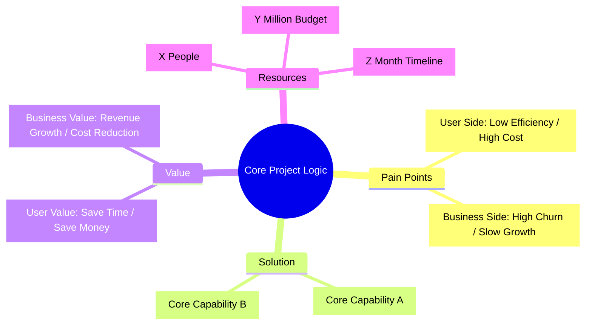
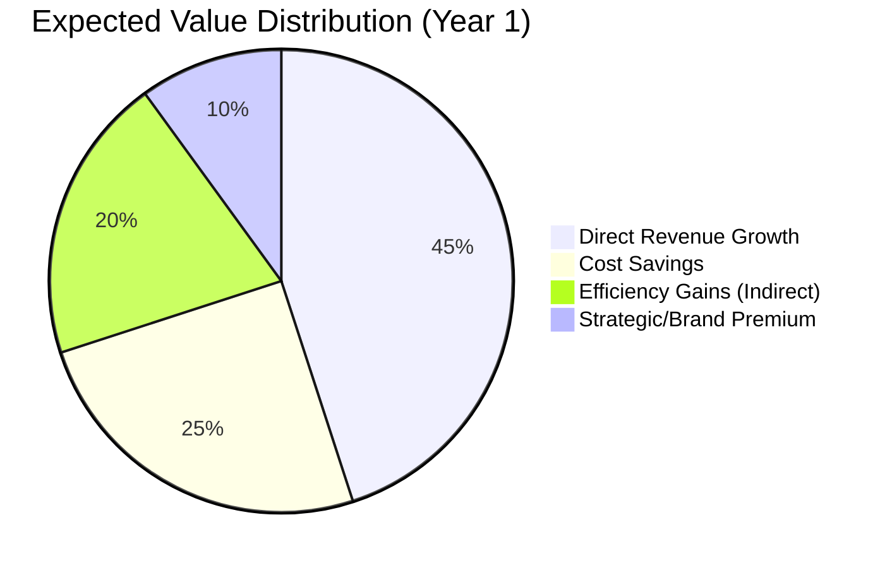
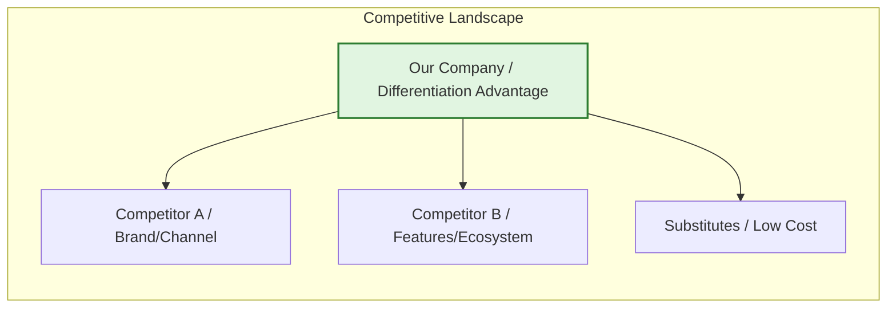
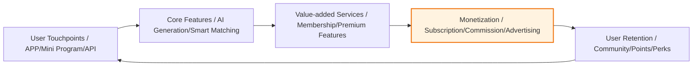
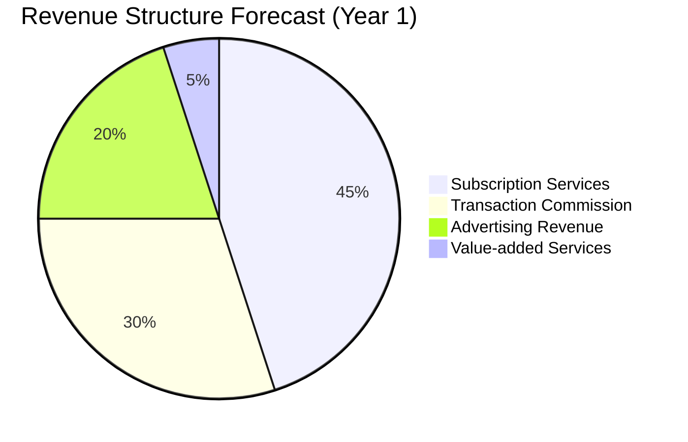
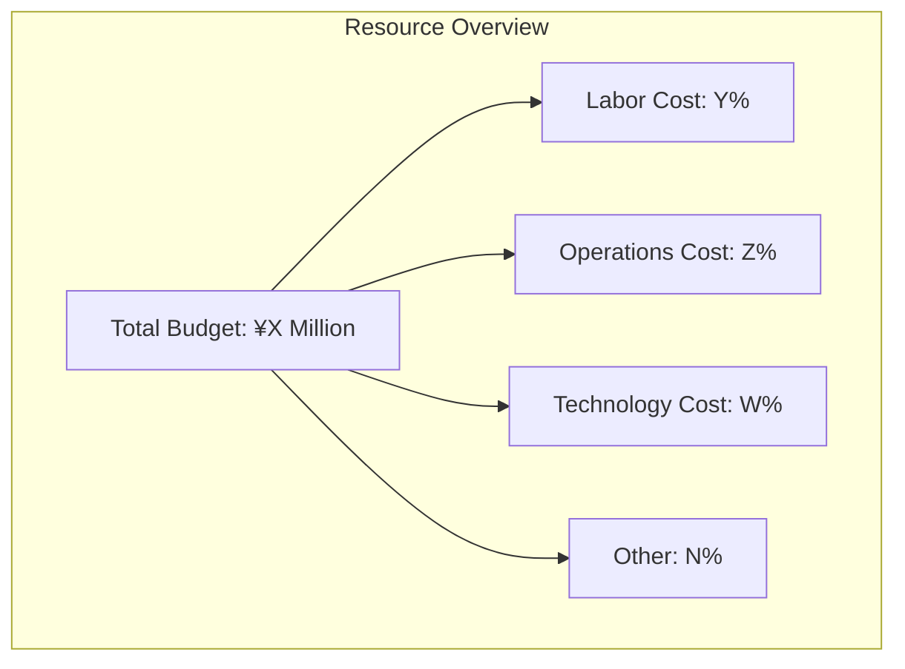
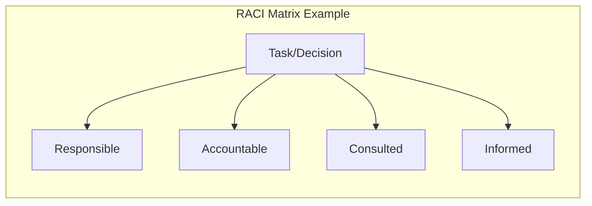
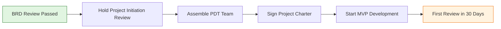
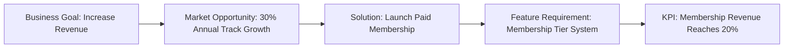

# [Product/System Name (English Name)] - Business Requirements Document (BRD)

> **Document Status:** 🟡 Under Review / 🟢 Approved / 🔴 Rejected
>
> **Confidentiality Level:** Confidential / Internal / Public
>
> **Version:** vX.X
>
> **Date:** YYYY-MM-DD
>
> **Author:** [Name/Role]
>
> **Reviewer:** [Name/Role]
>
> **Audience:** [Role list]

---

## 0. Document Guide

### 0.1 Document Purpose & Scope

[Explain the purpose, applicable scenarios, and non-applicable scenarios of this document]

### 0.2 Related Documents

| Document Type | Filename | Related Section |
|---------|--------|---------|
| [Type] | [Filename] [Line Range] | [Section Description] |

> **Reference Format:** Related documents use the `Filename Line Range` format (e.g., `【Template】Technical Requirements Document(TRD).md 3-17`). Line numbers may change with document updates; refer to actual content.

### 0.3 Change Log

| Version | Date | Author | Changes | Reviewer |
| :--- | :--- | :--- | :--- | :--- |
| v0.1 | YYYY-MM-DD | [Name] | Initial draft | [Reviewer] |
| v0.2 | YYYY-MM-DD | [Name] | Added financial model and risk mitigation | [Reviewer] |
| v0.3 | 2026-06-09 | Xie Dong | Fix: quadrantChart template changed to table format (Feishu incompatible) | — |
| v0.3.1 | 2026-06-09 | Xie Dong | Fix xychart-beta chart to table for Feishu rendering compatibility | — |
| v0.3.2 | 2026-06-09 | Xie Dong | Fix gantt chart to table for Feishu rendering compatibility | — |

---

## 1. Executive Summary

> **Elevator Pitch:** Explain what this project is, why it matters, and how much revenue it generates in 30 seconds.

| Element | Content |
| :------------- | :-------------------------------------------------------------- |
| **Project in One Line** | [Describe product positioning in one sentence, e.g., "AI-driven personalized learning platform for Gen Z"] |
| **Core Opportunity** | [Market pain point + opportunity window, with key data] |
| **Investment Overview** | Total budget ¥[X] million, [Y]-month duration, core team of [Z] people |
| **Return Forecast** | 3-year ROI [X]%, breakeven in month [N], LTV/CAC = [M] |
| **Decision Recommendation** | 🟢 Launch immediately / 🟡 Launch after supplementary research / 🔴 Defer |

---

## 2. Solution Background

### 2.1 Needs Insight

| Dimension | Core Content | Key Data |
| :----------- | :----------------------------------------- | :---------------------------------------- |
| **Market Pain Point** | [One-sentence description of unmet user/customer pain point] | [e.g., Survey shows 73% of users want XX feature] |
| **Opportunity Window** | [Why now is the best time? Policy/Technology/Competition changes] | [e.g., AI technology costs dropped 80%, policy bonus period 12 months] |
| **Strategic Fit** | [Aligned with company annual OKR / strategic direction] | [e.g., Aligned with "AI First" strategy, supports Q3 growth target] |

### 2.2 Data Support

- **User-side data:** [e.g., NPS only 32 vs industry benchmark 65; core scenario churn rate 35% vs industry average 15%]
- **Business-side data:** [e.g., Current CAC ¥120 vs competitor ¥60; ARPU ¥2000, annual repurchase rate 8%]
- **Competitor data:** [e.g., Competitor saw 20% DAU increase and 5pp conversion rate improvement after launching this feature]

### 2.3 Competitive Advantage Analysis

> **Note:** This quadrant chart template has been converted to table format.

<!--
Original quadrantChart reference:
- title: Competitive Advantage Analysis (Execution Difficulty vs Business Value)
- x-axis: Low Execution Difficulty --> High Execution Difficulty
- y-axis: Low Business Value --> High Business Value
- quadrant-1: Key Investment (High Value/Low Difficulty)
- quadrant-2: Differentiation Advantage (High Value/High Difficulty)
- quadrant-3: Cautious Investment (Low Value/Low Difficulty)
- quadrant-4: Quick Harvest (Low Value/High Difficulty)
- Data points: "Our Solution": [0.3, 0.85]; "Competitor A": [0.6, 0.55]; "Competitor B": [0.8, 0.45]; "Industry Average": [0.5, 0.5]
-->

| Quadrant | Area Characteristics | Strategy Recommendation |
| :--- | :--- | :--- |
| Quadrant 1 (Low Difficulty · High Value) | Key Investment (High Value/Low Difficulty) | Initiate immediately, fast-track |
| Quadrant 2 (High Difficulty · High Value) | Differentiation Advantage (High Value/High Difficulty) | Phased approach, build barriers |
| Quadrant 3 (Low Difficulty · Low Value) | Cautious Investment (Low Value/Low Difficulty) | Launch when resources permit, not a priority |
| Quadrant 4 (High Difficulty · Low Value) | Quick Harvest (Low Value/High Difficulty) | Reassess necessity, avoid resource waste |

| Name | X Value | Y Value | Quadrant |
| :--- | :---: | :---: | :--- |
| Our Solution | 0.3 | 0.85 | Quadrant 1 (Key Investment) |
| Competitor A | 0.6 | 0.55 | Quadrant 2 (Differentiation Advantage) |
| Competitor B | 0.8 | 0.45 | Quadrant 4 (Quick Harvest) |
| Industry Average | 0.5 | 0.5 | Midpoint |

---

## 3. Product Value (Value Proposition)

### 3.1 User Value

- **Target Users:** [User persona, e.g., 25-35 year old white-collar workers in tier-1 cities, monthly income 15-30K, efficiency-focused]
- **Use Scenario:** [Scenario-based description, e.g., When users need to complete a weekly report within 30 minutes, they can generate a framework with one click and auto-fill data]
- **Value Quantification:** [Save X time / Reduce Y cost / Improve Z experience, e.g., Single task time reduced from 2h to 15min]

### 3.2 Business Value

| Value Type | Specific Description | Quantified Metric | Calculation Basis |
| :----------- | :---------------------------------- | :------------------------- | :----------- |
| **Revenue Growth** | [e.g., Open new paid scenarios / Increase ARPU] | GMV +X% / ARPU +¥Y | [Assumptions & Formulas] |
| **Cost Reduction** | [e.g., Automation replacing manual work / Reduce CAC] | Labor cost -Y% / CAC -Z% | [Assumptions & Formulas] |
| **Efficiency Improvement** | [e.g., Shorten delivery cycle / Improve productivity] | Cycle -Z% / Productivity +W% | [Assumptions & Formulas] |
| **Strategic Positioning** | [e.g., Enter AI track / Build ecosystem barrier] | Market share +Npp / Ecosystem coverage | [Assumptions & Formulas] |

---

## 4. Market Analysis

### 4.1 Market Size (TAM / SAM / SOM)

> **Reference:** Detailed market size data, growth trends, and forecast models can be found in **【Template】Market Research Report.md §4. Market Size & Trends**. This document only references key conclusions.

| Metric | Value | Data Source | Calculation Logic |
| :-------------------- | :----: | :----------------------- | :------------------------- |
| **TAM (Total Addressable Market)** | ¥[X]B | Refer to Market Research Report §4.1 | [Overall market size and growth rate] |
| **SAM (Serviceable Available Market)** | ¥[Y]B | Refer to Market Research Report §4.3 | [Market coverable by our capabilities] |
| **SOM (Serviceable Obtainable Market)** | ¥[Z]B | Refer to Market Research Report §4.5 | [Share obtainable with current resources] |

> **Full Data:** Market size historical data, forecast models (three scenarios), and sensitivity analysis can be found in **【Template】Market Research Report.md §4.4-4.6**.

### 4.2 Competitive Landscape

> **Reference:** Detailed competitive analysis, capability comparison, user feedback, and strategic insights can be found in **【Template】Competitive Analysis Report.md**. This document only references key conclusions.

**Competitive Landscape Summary:**

| Competitor Type | Representative | Core Strength | Main Weakness | Our Differentiation | Detailed Analysis |
| :--- | :--- | :--- | :--- | :--- | :--- |
| **Direct Competitor** | [Name] | [Strength] | [Weakness] | [Differentiation] | Refer to Competitive Analysis Report §6.1 |
| **Indirect Competitor** | [Name] | [Strength] | [Weakness] | [Differentiation] | Refer to Competitive Analysis Report §6.2 |
| **Substitute** | [Name] | [Strength] | [Weakness] | [Differentiation] | Refer to Competitive Analysis Report §6.3 |

> **Full Analysis:** Competitor organizational profiles, $APPEALS analysis, feature matrix, user feedback can be found in **【Template】Competitive Analysis Report.md §4-8**.

---

## 5. Product Solution Overview

### 5.1 Product Form & Business Loop

### 5.2 Business Model

| Element | Description |
| :----------- | :----------------------------------------- |
| **Target Users** | C-end / B-end / Platform / G-end |
| **Participants** | [Users, merchants, platform, service providers, regulators, etc.] |
| **Value Flow** | [Users get efficiency, merchants get orders, platform gets commission] |
| **Profit Sharing** | [Platform takes X%, service providers take Y%, merchants keep Z%] |

### 5.3 Revenue Model

| Revenue Model | Pricing Logic | Expected Share | Notes |
| :----------- | :--------------------- | :------: | :--------- |
| **Subscription Services** | [e.g., ¥99/month, ¥899/year] | 45% | Core cash flow |
| **Transaction Commission** | [e.g., 3-5% of GMV] | 30% | Scale-effect type |
| **Advertising Revenue** | [e.g., CPC/CPM/Brand Zone] | 20% | Traffic monetization |
| **Value-added Services** | [e.g., Customization/Training/Data] | 5% | High margin |

---

## 6. Execution Plan

### 6.1 Phase Milestones (Roadmap)

> **Note:** Gantt chart is Feishu-incompatible, converted to table format.

| Phase | Task | Start Date | Duration | Status |
|:---|:---|:---|:---:|:---:|
| Validation | Requirements validation & MVP development | YYYY-MM | 2M | ⚪ |
| Validation | Seed user testing | After MVP completion | 1M | ⚪ |
| Growth | Feature completion & PMF achievement | After seed testing | 3M | ⚪ |
| Growth | Scaled promotion | After PMF achievement | 3M | ⚪ |
| Maturity | Commercial monetization | After promotion | 3M | ⚪ |
| Maturity | Ecosystem building & second curve | After monetization | 3M | ⚪ |

### 6.2 Key Milestones & Deliverables

| Phase | Time | Core Objective | Key Deliverables | Go/No-Go Criteria |
| :--------- | :------ | :--------------- | :------------------- | :------------ |
| **Validation** | M1-M3 | Validate demand authenticity | MVP, test report | Retention rate > X% |
| **Growth** | M4-M6 | Find product-market fit | Full product, operations system | PMF metrics met |
| **Scale** | M7-M9 | Rapidly expand user base | Promotion plan, channel system | CAC < LTV/3 |
| **Monetize** | M10-M12 | Validate business model | Commercial product, financial model | Monthly breakeven |

### 6.3 Resource Requirements & Budget

| Resource Type | Requirements Detail | Budget (Million) | Notes |
| :----------- | :------------------------------------------------- | :----------: | :------- |
| **Labor Cost** | Product [X], R&D [Y], Design [Z], Operations [W] | [Amount] | Including outsourcing |
| **Operations Cost** | Promotion, content, activities, channels | [Amount] | First year focus |
| **Technology Cost** | Servers, cloud resources, third-party services, bandwidth | [Amount] | Usage-based estimate |
| **Other** | Office, travel, compliance, legal | [Amount] | 10% reserve |
| **Total** | | **[Total Amount]** | |

### 6.4 Stakeholders & Responsibilities (RACI Matrix)

| Item | Product Lead | R&D Lead | Operations Lead | Finance/Legal | CEO |
| :------- | :--------: | :--------: | :--------: | :-------: | :---: |
| BRD Approval | C | I | I | C | **A** |
| Budget Allocation | C | C | C | **R** | **A** |
| Product Solution | **R** | C | C | I | A |
| Technical Architecture | C | **R** | I | I | A |
| Launch Decision | C | C | **R** | I | **A** |

---

## 7. Financial Forecast

### 7.1 Investment-Return Model (3 Years)

| Year | Investment (M) | Revenue (M) | Profit (M) | Cumulative Profit | ROI | Notes |
| :---: | :---: | :---: | :---: | :---: | :---: | :--- |
| **Year 1** | 500 | 200 | -300 | -300 | -60% | Investment phase |
| **Year 2** | 800 | 1,500 | 700 | 400 | 88% | Growth phase |
| **Year 3** | 1,000 | 3,000 | 2,000 | 2,400 | 200% | Profit phase |

<svg xmlns="http://www.w3.org/2000/svg" viewBox="0 0 600 420" style="max-width:600px;height:auto">
<rect width="600" height="420" fill="#fafafa" rx="8"/>
<text x="300" y="28" text-anchor="middle" font-size="16" font-weight="bold" fill="#333">3-Year Financial Trends (Millions)</text>
<line x1="60" y1="370.0" x2="580" y2="370.0" stroke="#eee" stroke-width="1"/>
<text x="55" y="374.0" text-anchor="end" font-size="11" fill="#999">-500</text>
<line x1="60" y1="304.0" x2="580" y2="304.0" stroke="#eee" stroke-width="1"/>
<text x="55" y="308.0" text-anchor="end" font-size="11" fill="#999">200</text>
<line x1="60" y1="238.0" x2="580" y2="238.0" stroke="#eee" stroke-width="1"/>
<text x="55" y="242.0" text-anchor="end" font-size="11" fill="#999">900</text>
<line x1="60" y1="172.0" x2="580" y2="172.0" stroke="#eee" stroke-width="1"/>
<text x="55" y="176.0" text-anchor="end" font-size="11" fill="#999">1600</text>
<line x1="60" y1="106.0" x2="580" y2="106.0" stroke="#eee" stroke-width="1"/>
<text x="55" y="110.0" text-anchor="end" font-size="11" fill="#999">2300</text>
<line x1="60" y1="40.0" x2="580" y2="40.0" stroke="#eee" stroke-width="1"/>
<text x="55" y="44.0" text-anchor="end" font-size="11" fill="#999">3000</text>
<text x="16" y="205" text-anchor="middle" font-size="12" fill="#666" transform="rotate(-90, 16, 205)">Amount</text>
<line x1="60" y1="370" x2="580" y2="370" stroke="#ccc" stroke-width="1"/>
<polyline points="146.7,275.7 320.0,247.4 493.3,228.6" fill="none" stroke="#5470c6" stroke-width="2.5" stroke-linejoin="round" stroke-linecap="round"/>
<circle cx="146.7" cy="275.7" r="4" fill="#5470c6" stroke="#fff" stroke-width="1.5"/>
<text x="146.7" y="265.7" text-anchor="middle" font-size="10" fill="#5470c6" font-weight="bold">500</text>
<circle cx="320.0" cy="247.4" r="4" fill="#5470c6" stroke="#fff" stroke-width="1.5"/>
<text x="320.0" y="237.4" text-anchor="middle" font-size="10" fill="#5470c6" font-weight="bold">800</text>
<circle cx="493.3" cy="228.6" r="4" fill="#5470c6" stroke="#fff" stroke-width="1.5"/>
<text x="493.3" y="218.6" text-anchor="middle" font-size="10" fill="#5470c6" font-weight="bold">1000</text>
<polyline points="146.7,304.0 320.0,181.4 493.3,40.0" fill="none" stroke="#91cc75" stroke-width="2.5" stroke-linejoin="round" stroke-linecap="round"/>
<circle cx="146.7" cy="304.0" r="4" fill="#91cc75" stroke="#fff" stroke-width="1.5"/>
<text x="146.7" y="294.0" text-anchor="middle" font-size="10" fill="#91cc75" font-weight="bold">200</text>
<circle cx="320.0" cy="181.4" r="4" fill="#91cc75" stroke="#fff" stroke-width="1.5"/>
<text x="320.0" y="171.4" text-anchor="middle" font-size="10" fill="#91cc75" font-weight="bold">1500</text>
<circle cx="493.3" cy="40.0" r="4" fill="#91cc75" stroke="#fff" stroke-width="1.5"/>
<text x="493.3" y="30.0" text-anchor="middle" font-size="10" fill="#91cc75" font-weight="bold">3000</text>
<polyline points="146.7,351.1 320.0,256.9 493.3,134.3" fill="none" stroke="#fc8452" stroke-width="2.5" stroke-linejoin="round" stroke-linecap="round"/>
<circle cx="146.7" cy="351.1" r="4" fill="#fc8452" stroke="#fff" stroke-width="1.5"/>
<text x="146.7" y="341.1" text-anchor="middle" font-size="10" fill="#fc8452" font-weight="bold">-300</text>
<circle cx="320.0" cy="256.9" r="4" fill="#fc8452" stroke="#fff" stroke-width="1.5"/>
<text x="320.0" y="246.9" text-anchor="middle" font-size="10" fill="#fc8452" font-weight="bold">700</text>
<circle cx="493.3" cy="134.3" r="4" fill="#fc8452" stroke="#fff" stroke-width="1.5"/>
<text x="493.3" y="124.3" text-anchor="middle" font-size="10" fill="#fc8452" font-weight="bold">2000</text>
<text x="146.7" y="390" text-anchor="middle" font-size="12" fill="#333">Year 1</text>
<text x="320.0" y="390" text-anchor="middle" font-size="12" fill="#333">Year 2</text>
<text x="493.3" y="390" text-anchor="middle" font-size="12" fill="#333">Year 3</text>
<line x1="165.0" y1="414" x2="177.0" y2="414" stroke="#5470c6" stroke-width="2.5"/>
<circle cx="171.0" cy="414" r="3" fill="#5470c6" stroke="#fff" stroke-width="1"/>
<text x="181.0" y="418" font-size="12" fill="#333">Investment</text>
<line x1="255.0" y1="414" x2="267.0" y2="414" stroke="#91cc75" stroke-width="2.5"/>
<circle cx="261.0" cy="414" r="3" fill="#91cc75" stroke="#fff" stroke-width="1"/>
<text x="271.0" y="418" font-size="12" fill="#333">Revenue</text>
<line x1="345.0" y1="414" x2="357.0" y2="414" stroke="#fc8452" stroke-width="2.5"/>
<circle cx="351.0" cy="414" r="3" fill="#fc8452" stroke="#fff" stroke-width="1"/>
<text x="361.0" y="418" font-size="12" fill="#333">Profit</text>
</svg>

### 7.2 Key Financial Assumptions

| Metric | Assumed Value | Basis / Risk |
| :---------------------- | :---------- | :-------------------------------- |
| **Customer Acquisition Cost (CAC)** | ≤ ¥50 | [Channel test data / Strategy adjustment if exceeded] |
| **Lifetime Value (LTV)** | ≥ ¥300 | [Payment rate × ARPU × Lifecycle] |
| **LTV / CAC** | ≥ 6 | [Healthy SaaS benchmark > 3] |
| **Monthly Churn Rate** | < 5% | [Industry benchmark / Product stickiness assumption] |
| **Breakeven Period** | Month [N] | [Based on current cash flow model] |

### 7.3 Sensitivity Analysis

| Scenario | Key Variable Change | Year 3 Profit | Strategy Adjustment |
| :------- | :------------------------- | :---------: | :--------------------- |
| **Optimistic** | CAC -30%, Payment rate +50% | +4,000 | Increase investment, rapid expansion |
| **Baseline** | Execute per assumptions | +2,000 | Proceed as planned |
| **Pessimistic** | CAC +50%, Payment rate -30% | +800 | Control scale, focus on core users |

---

## 8. Risks & Mitigation

### 8.1 Risk Register

> **Reference:** Full risk register (with trigger and exit conditions) can be found in **【Template】Project Charter.md §11.1**. This document only lists core business-level risks.

| Risk ID | Risk Description | Likelihood | Impact | Risk Level | Mitigation Strategy | Owner | Exit Condition |
| :-------- | :----------------- | :----: | :----: | :------: | :----------------------------------------- | :--------: | :--------------------- |
| **R-001** | Policy/regulation changes | Medium | High | 🔴 High | Proactive compliance communication, reserve policy buffer; multi-region filing | Legal | Pause if regulator halts |
| **R-002** | Core personnel turnover | Medium | High | 🔴 High | Knowledge documentation, AB-role mechanism, equity incentives | HR | Reduce scope if key positions vacant >2 weeks |
| **R-003** | Market acceptance below expectations | Medium | High | 🔴 High | Fast MVP validation, pivot if metrics don't meet targets | Product Lead | Terminate if MVP retention <<20% |
| **R-004** | Competitor fast follow-up | High | Medium | 🟡 Medium | Build technology/data barriers, accelerate iteration | Strategy Lead | Adjust targets if market share <<5% |

### 8.2 Risk Heat Map

> **Note:** This quadrant chart template has been converted to table format.

<!--
Original quadrantChart reference:
- title: Risk Heat Map (Likelihood vs Impact)
- x-axis: Low Likelihood --> High Likelihood
- y-axis: Low Impact --> High Impact
- quadrant-1: Key Focus (High/High)
- quadrant-2: Close Monitoring (Low/High)
- quadrant-3: General Attention (Low/Low)
- quadrant-4: Periodic Review (High/Low)
- Data points: "R-001 Policy": [0.5, 0.9]; "R-002 Personnel": [0.5, 0.9]; "R-003 Technical": [0.8, 0.6]; "R-004 Market": [0.5, 0.9]; "R-005 Competitor": [0.8, 0.6]
-->

| Quadrant | Area Characteristics | Strategy Recommendation |
| :--- | :--- | :--- |
| Quadrant 1 (High Likelihood · High Impact) | Key Focus (High/High) | Develop emergency plans, regular drills |
| Quadrant 2 (Low Likelihood · High Impact) | Close Monitoring (Low/High) | Set alert thresholds, continuous tracking |
| Quadrant 3 (Low Likelihood · Low Impact) | General Attention (Low/Low) | Routine management, no excessive attention needed |
| Quadrant 4 (High Likelihood · Low Impact) | Periodic Review (High/Low) | Establish process-based management, control frequency |

| Name | X Value | Y Value | Quadrant |
| :--- | :---: | :---: | :--- |
| R-001 Policy | 0.5 | 0.9 | Quadrant 2 (Close Monitoring) |
| R-002 Personnel | 0.5 | 0.9 | Quadrant 2 (Close Monitoring) |
| R-003 Technical | 0.8 | 0.6 | Quadrant 1 (Key Focus) |
| R-004 Market | 0.5 | 0.9 | Quadrant 2 (Close Monitoring) |
| R-005 Competitor | 0.8 | 0.6 | Quadrant 1 (Key Focus) |

---

## 9. Recommendation

> **Recommendation:** 🟢 Launch immediately / 🟡 Launch after supplementary research / 🔴 Defer

### 9.1 Key Reasons (3-Sentence Summary)

1. **[Market Opportunity]** [One sentence explaining the market is large enough and timing is right]
2. **[Resource Fit]** [One sentence explaining required resources are within acceptable range]
3. **[Return Expectation]** [One sentence explaining expected returns align with company strategy and financial requirements]

### 9.2 Next Steps

| # | Next Step | Owner | Deadline | Deliverable |
| :---: | :--- | :--- | :--- | :--- |
| 1 | Hold BRD project initiation review | [Name] | [Date] | Meeting minutes + Decision conclusions |
| 2 | Determine PDT core members | [Name] | [Date] | Team roster |
| 3 | Sign project Charter | [Name] | [Date] | Signed Charter |
| 4 | Start requirements refinement & MVP design | [Name] | [Date] | PRD initial draft |

---

## 10. Appendix

### 10.1 Glossary

| Term | Definition |
| :------ | :-------------------------------------- |
| **LTV** | Life Time Value |
| **CAC** | Customer Acquisition Cost |
| **PMF** | Product Market Fit |
| **PDT** | Product Development Team |
| **MVP** | Minimum Viable Product |

### 10.2 References

- [Industry report name and link]
- [Competitive analysis document link]
- [User research report link]
- [Financial calculation spreadsheet link]

### 10.3 Requirements Traceability Matrix (Optional)

---

> **Document Approval & Sign-off**
>
> | Role | Signature | Date | Comments |
> | :----------- | :--- | :--- | :--- |
> | Product Lead | | | |
> | Technical Lead | | | |
> | Operations Lead | | | |
> | Finance Lead | | | |
> | CEO / Decision Maker | | | |
