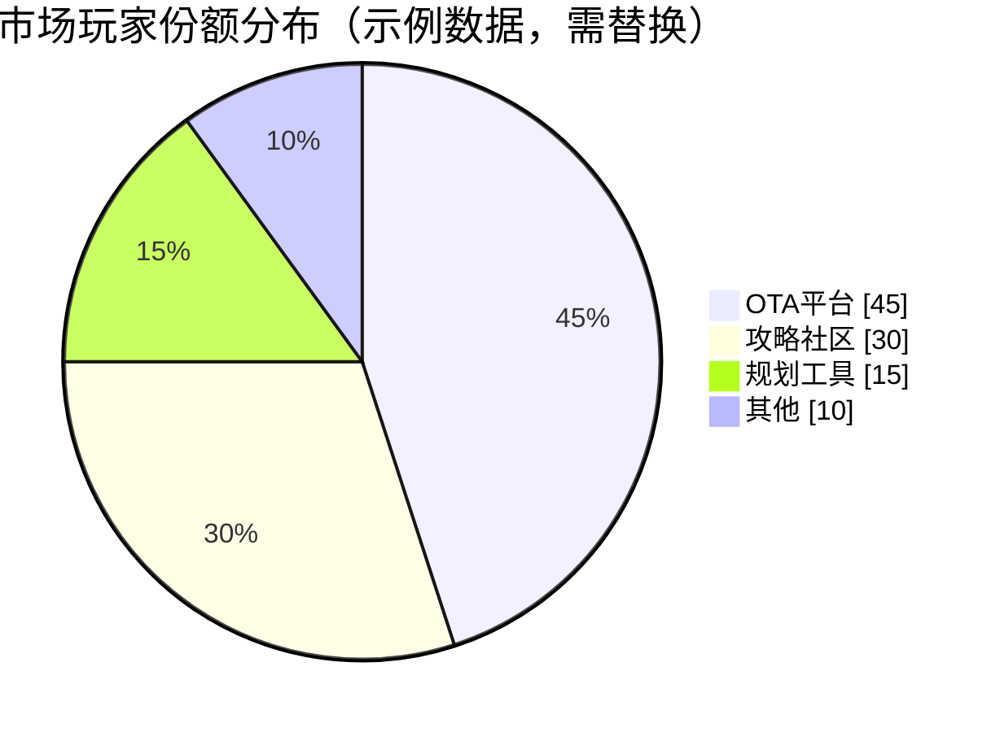

# [产品/系统名称（英文名）] - 竞品分析报告（Competitive Analysis Report）

> **文档状态：** 🟡 评审中 / 🟢 已通过 / 🔴 驳回
>
> **保密级别：** 机密 / 内部公开 / 公开
>
> **版本：** vX.X
>
> **日期：** YYYY-MM-DD
>
> **撰写人：** [姓名/角色]
>
> **评审人：** [姓名/角色]
>
> **阅读对象：** [角色列表]

---

## 0. 文档导读

### 0.1 文档目的与适用范围

[说明本文档的目的、适用场景和不适用场景]

### 0.2 相关文档

| 文档类型 | 文件名 | 相关章节 |
|---------|--------|---------|
| [类型] | [文件名] [行号范围] | [章节描述] |

> **引用格式说明**：关联文档使用 `文件名 行号范围` 格式（如 `【模板】技术需求文档(TRD).md 3-17`），行号随文档更新可能变化，请以实际内容为准。

### 0.3 变更记录

| 版本 | 日期 | 修订人 | 变更内容 | 审核人 |
| :--- | :--- | :--- | :--- | :--- |
| v0.1 | YYYY-MM-DD | [姓名] | 初稿完成 | [审核人] |
| v0.2 | YYYY-MM-DD | [姓名] | 补充$APPEALS分析与战略画布 | [审核人] |
| v0.3 | 2026-06-09 | 谢董 | 修复：quadrantChart 模板改为表格格式（飞书不兼容） | — |

---

## 1. 执行摘要（Executive Summary）

> {用3-5句话回答三个问题：① 为什么做这次竞品分析？② 最核心的1-3个发现是什么？③ 建议采取什么行动？未阅读者阅读此段后应在30秒内理解报告价值。}
>
> 示例：本次分析旨在为Q3产品定价策略提供依据。核心发现：竞品A采用订阅制（¥29/月）但用户流失率高达40%，竞品B采用交易佣金制（3%）用户接受度更高；我方当前功能覆盖度已达竞品80%，具备定价上调空间。建议：采用"基础免费+增值订阅"模式，订阅价定为¥19/月，上线前完成AB测试。

---

## 2. 分析目标与范围

**🎯 本章目标**：明确本次分析要回答什么决策问题，避免分析范围蔓延。分析的目标决定了后续章节的选择与深度。

### 2.1 分析目的与决策场景

| 分析类型                                                 | 本次目的   | 需回答的关键问题                                | 影响部门              |
| -------------------------------------------------------- | ---------- | ----------------------------------------------- | --------------------- |
| {立项/功能迭代/定价策略/抢占市场/销售赋能/技术选型/其他} | {具体描述} | {1-2个核心问题，如"用户是否愿意为AI规划付费？"} | {产品/销售/研发/高管} |

> **目标导向原则**：不同目的对应不同章节深度与框架组合。详见附录10.7《模板裁剪指南》。

### 2.2 竞品识别与分类

<!-- 竞品识别不仅是产品对比，还包括替代方案和未来潜在进入者 -->

| 类型           | 产品名称 | 所属公司 | 筛选理由               | 分析优先级 | 信息可信度 | 监控频率    |
| -------------- | -------- | -------- | ---------------------- | ---------- | ---------- | ----------- |
| **直接竞品**   | {名称}   | {公司}   | {功能定位高度相似}     | P0         | {高/中/低} | {每周/每月} |
| **直接竞品**   | {名称}   | {公司}   | {理由}                 | P0         | {高/中/低} | {频率}      |
| **间接竞品**   | {名称}   | {公司}   | {不同产品，相同需求}   | P1         | {高/中/低} | {频率}      |
| **替代品**     | {名称}   | {公司}   | {如Excel/人工方案替代} | P1         | {高/中/低} | {频率}      |
| **潜在进入者** | {名称}   | {公司}   | {可能切入本赛道}       | P2         | {高/中/低} | {每季度}    |

> **识别方法**：① 应用商店分类排名 ② 销售团队反馈"客户还对比了谁" ③ 用户访谈"如果不选我们，你会选谁" ④ 天眼查/IT桔子查看同类融资公司

### 2.3 分析维度与框架选择

| 维度     | 是否分析 | 采用框架            | 数据来源                 | 获取时间 | 可信度     |
| -------- | -------- | ------------------- | ------------------------ | -------- | ---------- |
| 宏观环境 | {是/否}  | PEST / 波特五力     | {行业报告/政策文件}      | {日期}   | {高/中/低} |
| 组织画像 | {是/否}  | 公司维度指标        | {天眼查/招聘网站/官网}   | {日期}   | {高/中/低} |
| 定位策略 | {是/否}  | 感知映射 / 战略画布 | {官网/应用商店/宣传材料} | {日期}   | {高/中/低} |
| 核心能力 | {是/否}  | $APPEALS / 功能矩阵 | {实际体验/应用商店}      | {日期}   | {高/中/低} |
| 商业模式 | {是/否}  | 商业模式画布        | {官网定价页/应用内}      | {日期}   | {中/低}    |
| 用户反馈 | {是/否}  | 分层评论法 / Kano   | {应用商店/G2/问卷}       | {日期}   | {高}       |

> **框架选择原则**：不必用上所有方法，根据分析目标选用。

**💡 So what**：{本章发现对分析范围的启示，如"因竞品C信息可信度低，其数据仅作参考；本次分析聚焦直接竞品A和B，替代品D作为风险提示"}

---

## 3. 宏观环境与行业格局

**🎯 本章目标**：理解竞品生存的宏观语境，识别行业竞争强度和未来趋势。

### 3.1 PEST 宏观环境分析（可选）

<!-- 当分析目标为"立项"或"市场抢占"时保留，功能迭代分析可删除 -->

| 维度            | 关键因素                                | 影响程度   | 机会/威胁   | 信息来源 |
| --------------- | --------------------------------------- | ---------- | ----------- | -------- |
| **P 政治/政策** | {如：AI生成内容监管政策、数据隐私法规}  | {高/中/低} | {机会/威胁} | {来源}   |
| **E 经济**      | {如：消费降级趋势、旅游市场复苏}        | {高/中/低} | {机会/威胁} | {来源}   |
| **S 社会**      | {如：Z世代旅行习惯变化、银发族出游增长} | {高/中/低} | {机会/威胁} | {来源}   |
| **T 技术**      | {如：大模型API成本下降、多模态AI应用}   | {高/中/低} | {机会/威胁} | {来源}   |
| **L 法律**      | {如：知识产权诉讼风险、合规要求}        | {高/中/低} | {机会/威胁} | {来源}   |
| **E 环境**      | {如：碳中和要求对旅游行业的影响}        | {高/中/低} | {机会/威胁} | {来源}   |

> **PESTLE/DEPEST**：在PEST基础上增加Legal和Environmental，或Demography和Ecology，根据产品特性选择。

### 3.2 波特五力模型（可选）

<!-- 评估行业竞争强度和盈利潜力 -->

| 竞争力量               | 强度       | 关键观察                         | 对我方影响 |
| ---------------------- | ---------- | -------------------------------- | ---------- |
| **现有竞争者 rivalry** | {高/中/低} | {如：OTA平台价格战激烈}          | {影响}     |
| **潜在进入者威胁**     | {高/中/低} | {如：AI工具降低创业门槛}         | {影响}     |
| **替代品威胁**         | {高/中/低} | {如：小红书攻略替代专业规划工具} | {影响}     |
| **买方议价能力**       | {高/中/低} | {如：用户切换成本低}             | {影响}     |
| **供应商议价能力**     | {高/中/低} | {如：地图API提供商集中度高}      | {影响}     |

> **分析要点**：五力模型帮助判断行业是否值得进入，以及盈利空间大小。

### 3.3 市场规模与玩家格局

| 玩家类型 | 代表产品 | 市场份额/用户量 | 核心模式 | 威胁等级   | 近期动态                     |
| -------- | -------- | --------------- | -------- | ---------- | ---------------------------- |
| {类型}   | {产品}   | {数据}          | {模式}   | {高/中/低} | {如：刚获B轮融资/上线新功能} |

**💡 So what**：{宏观环境对我方战略的启示，如"政策收紧提高了合规门槛，有利于资金充足的我方；替代品威胁高，说明需强化差异化壁垒"}

---

## 4. 竞品组织画像

**🎯 本章目标**：从公司维度理解竞品的资源禀赋、战略意图和进化速度。

> **重要性**：产品竞争本质上是组织能力的竞争。了解竞品背后的公司，才能判断其持续投入意愿和战略纵深。

### 4.1 公司发展概况

| 维度           | 竞品A                               | 竞品B            | 竞品C            |
| -------------- | ----------------------------------- | ---------------- | ---------------- |
| **成立时间**   | {日期}                              | {日期}           | {日期}           |
| **融资历程**   | {轮次/金额/时间}                    | {轮次/金额/时间} | {轮次/金额/时间} |
| **估值/市值**  | {金额}                              | {金额}           | {金额}           |
| **核心目标**   | {如：IPO/被收购/独立发展}           | {目标}           | {目标}           |
| **市场占有率** | {X%}                                | {Y%}             | {Z%}             |
| **重大节点**   | {如：2025年获A轮，2026年上线AI功能} | {节点}           | {节点}           |

> **数据来源**：天眼查/IT桔子/企查查查融资；官网查发展历史；行业报告查市场占有率。

### 4.2 团队与人才信号

| 维度             | 竞品A                              | 竞品B                         | 推断依据                 |
| ---------------- | ---------------------------------- | ----------------------------- | ------------------------ |
| **团队规模**     | {约X人}                            | {约Y人}                       | {招聘网站/官网/媒体报道} |
| **核心岗位招聘** | {如：急招AI算法工程师×5}           | {如：招聘销售总监}            | {Boss直聘/拉勾/LinkedIn} |
| **技术栈信号**   | {如：大量招聘Flutter开发→跨端策略} | {如：招聘推荐算法→强化个性化} | {招聘JD关键词分析}       |
| **办公地点**     | {城市}                             | {城市}                        | {推断成本结构}           |

> **分析方法**：招聘JD分析是推断竞品技术方向和战略重心的低成本高信度方法。

### 4.3 资源与战略意图推断

| 维度             | 竞品A                          | 竞品B                      | 对我方影响                    |
| ---------------- | ------------------------------ | -------------------------- | ----------------------------- |
| **资金实力**     | {充裕/紧张/未知}               | {充裕/紧张/未知}           | {如：资金充裕可能发起价格战}  |
| **技术壁垒**     | {如：自研大模型/专利X项}       | {如：依赖第三方API}        | {如：技术差距可追赶/不可追赶} |
| **生态资源**     | {如：背靠腾讯流量}             | {如：独立产品无生态}       | {如：生态资源难以复制}        |
| **短期策略推断** | {如：烧钱获客，准备下一轮融资} | {如：聚焦商业化，控制成本} | {如：窗口期还有6个月}         |

**💡 So what**：{组织画像洞察，如"竞品A刚获大额融资且大量招聘AI人才，预计3个月内将上线重大AI功能，我方需加速布局；竞品B资金紧张，可能是我方挖角窗口期"}

---

## 5. 定位与目标用户

**🎯 本章目标**：识别竞品的定位策略，发现未被满足的用户需求空白区。

### 5.1 定位标语与价值主张

| 竞品     | 定位标语（原文摘录） | 核心价值主张 | 差异化关键词             | 标语清晰度 |
| -------- | -------------------- | ------------ | ------------------------ | ---------- |
| {竞品A}  | {verbatim，不解读}   | {提炼}       | {如"AI驱动""秒级规划"}   | {高/中/低} |
| {竞品B}  | {verbatim}           | {提炼}       | {如"社区分享""真实体验"} | {高/中/低} |
| **我方** | {当前标语}           | {提炼}       | {关键词}                 | {高/中/低} |

> **分析方法**：捕捉官网标题、应用商店描述和宣传材料中的关键词。如果所有竞品都用"AI-powered"和"seamless"，这些词已无差异化价值。

### 5.2 目标用户画像对比

| 维度     | 竞品A  | 竞品B  | 我方目标 | 空白区识别                    |
| -------- | ------ | ------ | -------- | ----------------------------- |
| 年龄区间 | {区间} | {区间} | {区间}   | {如"25-30岁轻度用户未被覆盖"} |
| 消费能力 | {区间} | {区间} | {区间}   | {空白}                        |
| 旅行频率 | {频率} | {频率} | {频率}   | {空白}                        |
| 核心痛点 | {痛点} | {痛点} | {痛点}   | {空白}                        |
| 使用场景 | {场景} | {场景} | {场景}   | {空白}                        |

### 5.3 感知映射与定位矩阵

<!-- 感知映射：展示客户感知中的品牌位置 -->

> **说明**：此象限图模板已转为表格描述。

<!--
原 quadrantChart 结构参考：
- title: 定位矩阵：功能聚焦 vs 内容聚焦 × 大众市场 vs 细分市场
- x-axis: "功能/工具属性" --> "内容/社区属性"
- y-axis: "大众市场" --> "细分市场"
- quadrant-1: 内容-大众
- quadrant-2: 内容-细分
- quadrant-3: 功能-大众
- quadrant-4: 功能-细分
- 数据点: "CompetitorA": [0.8, 0.3]; "CompetitorB": [0.3, 0.7]; "OurProduct": [0.5, 0.5]
-->

| 象限 | 区域特征 | 策略建议 |
| :--- | :--- | :--- |
| 象限1（内容·大众） | 内容-大众 | 以内容驱动，覆盖广泛用户群 |
| 象限2（内容·细分） | 内容-细分 | 内容深耕，服务垂直群体 |
| 象限3（功能·大众） | 功能-大众 | 以工具属性满足大众需求 |
| 象限4（功能·细分） | 功能-细分 | 聚焦工具能力，服务专业群体 |

| 名称 | X值 | Y值 | 象限 |
| :--- | :---: | :---: | :--- |
| CompetitorA | 0.8 | 0.3 | 象限1（内容-大众） |
| CompetitorB | 0.3 | 0.7 | 象限4（功能-细分） |
| OurProduct | 0.5 | 0.5 | 中线位置 |

**💡 So what**：{定位洞察，如"功能聚焦+细分市场象限目前无强竞品，是我方可切入的差异化方向；竞品A和B在感知映射中重叠度高，说明它们正在红海厮杀"}

---

## 6. 核心能力对比

**🎯 本章目标**：基于用户视角的竞争要素，系统对比产品能力，识别差距与机会。

### 6.1 $APPEALS 竞争要素分析

<!-- $APPEALS：从用户购买决策角度评估的8个维度 -->

| 竞争要素                              | 权重 | 竞品A     | 竞品B  | 我方   | 差距       | 优先级     |
| ------------------------------------- | ---- | --------- | ------ | ------ | ---------- | ---------- |
| **$ Price（价格）**                   | {X%} | {评分1-5} | {评分} | {评分} | {大/中/小} | {P0/P1/P2} |
| **A Availability（可获得性）**        | {X%} | {评分}    | {评分} | {评分} | {差距}     | {优先级}   |
| **P Packaging（包装/形象）**          | {X%} | {评分}    | {评分} | {评分} | {差距}     | {优先级}   |
| **P Performance（性能）**             | {X%} | {评分}    | {评分} | {评分} | {差距}     | {优先级}   |
| **E Easy to Use（易用性）**           | {X%} | {评分}    | {评分} | {评分} | {差距}     | {优先级}   |
| **A Assurance（保证/信任）**          | {X%} | {评分}    | {评分} | {评分} | {差距}     | {优先级}   |
| **L Life Cycle（生命周期成本）**      | {X%} | {评分}    | {评分} | {评分} | {差距}     | {优先级}   |
| **S Social Acceptance（社会接受度）** | {X%} | {评分}    | {评分} | {评分} | {差距}     | {优先级}   |

> **$APPEALS说明**：从用户购买决策角度评估的8个维度。权重根据目标用户调研确定，不同用户群体权重不同。

### 6.2 功能矩阵（仅购买决策相关功能）

| 功能模块              | 我方       | 竞品A      | 竞品B      | 竞品C      | 缺口优先级 |
| --------------------- | ---------- | ---------- | ---------- | ---------- | ---------- |
| {功能1：如AI智能规划} | {✅/❌/⚠️} | {✅/❌/⚠️} | {✅/❌/⚠️} | {✅/❌/⚠️} | {P0/P1/P2} |
| {功能2}               | {✅/❌/⚠️} | {✅/❌/⚠️} | {✅/❌/⚠️} | {✅/❌/⚠️} | {P0/P1/P2} |

> **原则**：只列影响购买决策的功能，用简单符号。Feature Comparison Tables同时可作为销售战卡（Sales Battlecards）使用。

### 6.3 关键体验实测

| 测试场景                   | 竞品A体验        | 竞品B体验        | 我方体验 | 差距       | 录屏存档 |
| -------------------------- | ---------------- | ---------------- | -------- | ---------- | -------- |
| {场景1：首次注册→生成行程} | {耗时/步骤/卡点} | {耗时/步骤/卡点} | {数据}   | {大/中/小} | {链接}   |
| {场景2：行程编辑与分享}    | {体验}           | {体验}           | {数据}   | {差距}     | {链接}   |
| {场景3：付费流程}          | {体验}           | {体验}           | {数据}   | {差距}     | {链接}   |

### 6.4 技术能力评估（基于实测，不推断架构）

| 能力维度   | 竞品A   | 竞品B   | 评估方法         | 我方差距   | 追赶难度   |
| ---------- | ------- | ------- | ---------------- | ---------- | ---------- |
| 规划合理性 | {1-5分} | {1-5分} | {同条件测试5次}  | {大/中/小} | {高/中/低} |
| 响应速度   | {X秒}   | {Y秒}   | {冷启动计时}     | {大/中/小} | {高/中/低} |
| 个性化程度 | {1-5分} | {1-5分} | {同偏好输入对比} | {大/中/小} | {高/中/低} |
| POI准确度  | {1-5分} | {1-5分} | {抽查10地点}     | {大/中/小} | {高/中/低} |

<svg xmlns="http://www.w3.org/2000/svg" viewBox="0 0 600 580" width="100%" style="max-width:600px">
  <rect width="600" height="580" fill="#fafafa" rx="8"/>
  <text x="300" y="30" text-anchor="middle" font-size="18" font-weight="bold" fill="#333">核心能力雷达图（示例数据，需替换）</text>
  <polygon points="340.0,280.0 312.4,242.0 267.6,256.5 267.6,303.5 312.4,318.0" fill="none" stroke="#ddd" stroke-width="1"/>
  <text x="308.0" y="244.0" font-size="11" fill="#999">1</text>
  <polygon points="380.0,280.0 324.7,203.9 235.3,233.0 235.3,327.0 324.7,356.1" fill="none" stroke="#ddd" stroke-width="1"/>
  <text x="308.0" y="204.0" font-size="11" fill="#999">2</text>
  <polygon points="420.0,280.0 337.1,165.9 202.9,209.5 202.9,350.5 337.1,394.1" fill="none" stroke="#ddd" stroke-width="1"/>
  <text x="308.0" y="164.0" font-size="11" fill="#999">3</text>
  <polygon points="460.0,280.0 349.4,127.8 170.6,186.0 170.6,374.0 349.4,432.2" fill="none" stroke="#ddd" stroke-width="1"/>
  <text x="308.0" y="124.0" font-size="11" fill="#999">4</text>
  <polygon points="500.0,280.0 361.8,89.8 138.2,162.4 138.2,397.6 361.8,470.2" fill="none" stroke="#ddd" stroke-width="1"/>
  <text x="308.0" y="84.0" font-size="11" fill="#999">5</text>
  <line x1="300" y1="280" x2="500.0" y2="280.0" stroke="#ddd" stroke-width="1"/>
  <text x="528.0" y="284.0" text-anchor="start" font-size="13" fill="#333">Planning</text>
  <line x1="300" y1="280" x2="361.8" y2="89.8" stroke="#ddd" stroke-width="1"/>
  <text x="370.5" y="67.2" text-anchor="start" font-size="13" fill="#333">Personalization</text>
  <line x1="300" y1="280" x2="138.2" y2="162.4" stroke="#ddd" stroke-width="1"/>
  <text x="115.5" y="150.0" text-anchor="middle" font-size="13" fill="#333">Speed</text>
  <line x1="300" y1="280" x2="138.2" y2="397.6" stroke="#ddd" stroke-width="1"/>
  <text x="115.5" y="418.0" text-anchor="middle" font-size="13" fill="#333">DataQuality</text>
  <line x1="300" y1="280" x2="361.8" y2="470.2" stroke="#ddd" stroke-width="1"/>
  <text x="370.5" y="500.8" text-anchor="middle" font-size="13" fill="#333">UX</text>
  <!-- CompetitorA: [4.5, 4.2, 3.8, 4.0, 4.0] -->
  <polygon points="480.0,280.0 351.9,120.2 177.0,190.7 170.6,374.0 349.4,432.2" fill="#e74c3c" fill-opacity="0.1" stroke="#e74c3c" stroke-width="2.5"/>
  <circle cx="480.0" cy="280.0" r="4.5" fill="#e74c3c" stroke="#fff" stroke-width="1.5"/>
  <text x="496.0" y="284.0" text-anchor="middle" font-size="10" fill="#e74c3c" font-weight="bold">4.5</text>
  <circle cx="351.9" cy="120.2" r="4.5" fill="#e74c3c" stroke="#fff" stroke-width="1.5"/>
  <text x="356.9" y="109.0" text-anchor="middle" font-size="10" fill="#e74c3c" font-weight="bold">4.2</text>
  <circle cx="177.0" cy="190.7" r="4.5" fill="#e74c3c" stroke="#fff" stroke-width="1.5"/>
  <text x="164.1" y="185.3" text-anchor="middle" font-size="10" fill="#e74c3c" font-weight="bold">3.8</text>
  <circle cx="170.6" cy="374.0" r="4.5" fill="#e74c3c" stroke="#fff" stroke-width="1.5"/>
  <text x="157.6" y="387.5" text-anchor="middle" font-size="10" fill="#e74c3c" font-weight="bold">4</text>
  <circle cx="349.4" cy="432.2" r="4.5" fill="#e74c3c" stroke="#fff" stroke-width="1.5"/>
  <text x="354.4" y="451.4" text-anchor="middle" font-size="10" fill="#e74c3c" font-weight="bold">4</text>
  <!-- CompetitorB: [4.2, 3.8, 4.0, 3.5, 3.5] -->
  <polygon points="468.0,280.0 347.0,135.4 170.6,186.0 186.7,362.3 343.3,413.1" fill="#3498db" fill-opacity="0.1" stroke="#3498db" stroke-width="2.5"/>
  <circle cx="468.0" cy="280.0" r="4.5" fill="#3498db" stroke="#fff" stroke-width="1.5"/>
  <text x="484.0" y="284.0" text-anchor="middle" font-size="10" fill="#3498db" font-weight="bold">4.2</text>
  <circle cx="347.0" cy="135.4" r="4.5" fill="#3498db" stroke="#fff" stroke-width="1.5"/>
  <text x="351.9" y="124.2" text-anchor="middle" font-size="10" fill="#3498db" font-weight="bold">3.8</text>
  <circle cx="170.6" cy="186.0" r="4.5" fill="#3498db" stroke="#fff" stroke-width="1.5"/>
  <text x="157.6" y="180.5" text-anchor="middle" font-size="10" fill="#3498db" font-weight="bold">4</text>
  <circle cx="186.7" cy="362.3" r="4.5" fill="#3498db" stroke="#fff" stroke-width="1.5"/>
  <text x="173.8" y="375.7" text-anchor="middle" font-size="10" fill="#3498db" font-weight="bold">3.5</text>
  <circle cx="343.3" cy="413.1" r="4.5" fill="#3498db" stroke="#fff" stroke-width="1.5"/>
  <text x="348.2" y="432.4" text-anchor="middle" font-size="10" fill="#3498db" font-weight="bold">3.5</text>
  <!-- OurProduct: [3.5, 3.0, 4.5, 4.8, 4.2] -->
  <polygon points="440.0,280.0 337.1,165.9 154.4,174.2 144.7,392.9 351.9,439.8" fill="#2ecc71" fill-opacity="0.1" stroke="#2ecc71" stroke-width="2.5"/>
  <circle cx="440.0" cy="280.0" r="4.5" fill="#2ecc71" stroke="#fff" stroke-width="1.5"/>
  <text x="456.0" y="284.0" text-anchor="middle" font-size="10" fill="#2ecc71" font-weight="bold">3.5</text>
  <circle cx="337.1" cy="165.9" r="4.5" fill="#2ecc71" stroke="#fff" stroke-width="1.5"/>
  <text x="342.0" y="154.7" text-anchor="middle" font-size="10" fill="#2ecc71" font-weight="bold">3</text>
  <circle cx="154.4" cy="174.2" r="4.5" fill="#2ecc71" stroke="#fff" stroke-width="1.5"/>
  <text x="141.4" y="168.8" text-anchor="middle" font-size="10" fill="#2ecc71" font-weight="bold">4.5</text>
  <circle cx="144.7" cy="392.9" r="4.5" fill="#2ecc71" stroke="#fff" stroke-width="1.5"/>
  <text x="131.7" y="406.3" text-anchor="middle" font-size="10" fill="#2ecc71" font-weight="bold">4.8</text>
  <circle cx="351.9" cy="439.8" r="4.5" fill="#2ecc71" stroke="#fff" stroke-width="1.5"/>
  <text x="356.9" y="459.0" text-anchor="middle" font-size="10" fill="#2ecc71" font-weight="bold">4.2</text>
  <rect x="110" y="537" width="14" height="14" rx="2" fill="#e74c3c"/>
  <text x="130" y="549" font-size="13" fill="#333">CompetitorA</text>
  <rect x="253" y="537" width="14" height="14" rx="2" fill="#3498db"/>
  <text x="273" y="549" font-size="13" fill="#333">CompetitorB</text>
  <rect x="396" y="537" width="14" height="14" rx="2" fill="#2ecc71"/>
  <text x="416" y="549" font-size="13" fill="#333">OurProduct</text>
</svg>

**💡 So what**：{核心能力结论，如"我方在响应速度和POI准确度上领先，但在规划合理性上落后竞品A 1.5分；$APPEALS显示用户最在意易用性（权重30%）和性能（25%），我方在易用性上仅排第三，需优先优化"}

---

## 7. 商业模式与定价

**🎯 本章目标**：理解竞品如何盈利，识别定价机会与转化路径优化空间。

### 7.1 定价架构对比

| 竞品    | 免费版     | 基础版  | 专业版  | 企业版   | 定价透明度         | 折扣策略      |
| ------- | ---------- | ------- | ------- | -------- | ------------------ | ------------- |
| {竞品A} | {功能限制} | {¥X/月} | {¥Y/月} | {需询价} | {公开/半公开/隐藏} | {如新用户7折} |
| {竞品B} | {功能限制} | {¥X/月} | {¥Y/月} | {需询价} | {公开/半公开/隐藏} | {策略}        |

> **注意**：如果竞品需销售电话才能获取定价，标注"定价隐藏"——定价不透明本身就是竞争信号。

### 7.2 收入来源拆解

| 收入类型 | 竞品A占比 | 竞品B占比 | 实现方式 | 用户接受度 | 可持续性   |
| -------- | --------- | --------- | -------- | ---------- | ---------- |
| 订阅收入 | {X%}      | {Y%}      | {方式}   | {高/中/低} | {高/中/低} |
| 交易佣金 | {X%}      | {Y%}      | {方式}   | {高/中/低} | {高/中/低} |
| 广告收入 | {X%}      | {Y%}      | {方式}   | {高/中/低} | {高/中/低} |
| 数据服务 | {X%}      | {Y%}      | {方式}   | {高/中/低} | {高/中/低} |

### 7.3 付费转化路径分析

| 竞品    | 免费→付费触发点           | 转化路径步骤 | 摩擦点           | 转化时长 |
| ------- | ------------------------- | ------------ | ---------------- | -------- |
| {竞品A} | {如"生成第3个行程时弹窗"} | {步骤数}     | {如"需绑信用卡"} | {X天}    |
| {竞品B} | {触发点}                  | {步骤数}     | {摩擦点}         | {Y天}    |

**💡 So what**：{定价洞察，如"竞品A订阅制用户流失高（40%），提示我方应采用'免费+增值'而非纯订阅；竞品B的¥19价位段接受度最高，我方定价可参考此区间"}

---

## 8. 用户反馈与需求洞察

**🎯 本章目标**：从用户评论中提炼痛点、需求和未被满足的机会。

### 8.1 评分与口碑速览

| 渠道          | 竞品A             | 竞品B             | 数据时间 | 近3月趋势  | Review Velocity |
| ------------- | ----------------- | ----------------- | -------- | ---------- | --------------- |
| iOS App Store | {评分} ({评论数}) | {评分} ({评论数}) | {日期}   | {升/降/平} | {X条/月}        |
| 华为/小米     | {评分}            | {评分}            | {日期}   | {趋势}     | {Y条/月}        |
| G2/Capterra   | {评分}            | {评分}            | {日期}   | {趋势}     | {Z条/月}        |

> **Review Velocity（评论增速）**：反映市场势头。增速突然下降可能意味着竞品遇到瓶颈或负面事件。

### 8.2 分层评论分析法

<!-- 分层分析：1-2星找deal-breakers，3星找改进点，5星找亮点 -->

| 星级分层                   | 竞品A占比 | 竞品B占比 | 核心主题              | 典型评论摘录 | 我方是否存在 |
| -------------------------- | --------- | --------- | --------------------- | ------------ | ------------ |
| **1-2星（Deal-breakers）** | {X%}      | {Y%}      | {如"AI规划不合理"}    | {用户原话}   | {是/否/部分} |
| **3星（改进点）**          | {X%}      | {Y%}      | {如"功能有用但Bug多"} | {用户原话}   | {是/否/部分} |
| **5星（亮点）**            | {X%}      | {Y%}      | {如"客服响应快"}      | {用户原话}   | {是/否/部分} |

> **分析方法**：1-2星评论揭示用户放弃产品的根本原因（deal-breakers）；3星评论揭示"基本满意但不够惊喜"的改进空间；5星评论揭示竞品的核心竞争力。

### 8.3 Q&A与未满足需求

<!-- 应用商店的Q&A区揭示产品描述未覆盖的痛点 -->

| 竞品    | Q&A高频问题              | 揭示的未满足需求 | 我方机会   |
| ------- | ------------------------ | ---------------- | ---------- |
| {竞品A} | {如"是否支持离线地图？"} | {需求}           | {大/中/小} |
| {竞品B} | {问题}                   | {需求}           | {机会}     |

> **Q&A分析**：用户反复询问但产品未明确回答的问题，往往是竞品的产品描述缺口，也是我方可以强调的差异化点。

### 8.4 需求洞察（Kano模型简化版）

| 需求                  | Kano类型               | 竞品A满足度 | 竞品B满足度 | 我方机会   | 实现难度   |
| --------------------- | ---------------------- | ----------- | ----------- | ---------- | ---------- |
| {需求1：如"多人协作"} | {兴奋型/期望型/基本型} | {高/中/低}  | {高/中/低}  | {大/中/小} | {高/中/低} |
| {需求2}               | {类型}                 | {满足度}    | {满足度}    | {机会}     | {难度}     |

> **说明**：此象限图模板已转为表格描述。

<!--
原 quadrantChart 结构参考：
- title: 需求优先级矩阵：用户价值 vs 实现难度
- x-axis: "低价值" --> "高价值"
- y-axis: "高难度" --> "低难度"
- quadrant-1: 战略投入（高价值-高难度）
- quadrant-2: Quick Wins（高价值-低难度）
- quadrant-3: Fill-ins（低价值-低难度）
- quadrant-4: 避免（低价值-高难度）
- 数据点: "FeatureA": [0.9, 0.3]; "FeatureB": [0.8, 0.7]; "FeatureC": [0.5, 0.5]; "FeatureD": [0.3, 0.8]
-->

| 象限 | 区域特征 | 策略建议 |
| :--- | :--- | :--- |
| 象限1（高价值·高难度） | 战略投入（高价值-高难度） | 制定长期计划，分阶段攻坚 |
| 象限2（高价值·低难度） | Quick Wins（高价值-低难度） | 优先排期，快速交付 |
| 象限3（低价值·低难度） | Fill-ins（低价值-低难度） | 填补空闲，无需重点投入 |
| 象限4（低价值·高难度） | 避免（低价值-高难度） | 不排期或重新评估价值 |

| 名称 | X值 | Y值 | 象限 |
| :--- | :---: | :---: | :--- |
| FeatureA | 0.9 | 0.3 | 象限1（战略投入） |
| FeatureB | 0.8 | 0.7 | 象限2（Quick Wins） |
| FeatureC | 0.5 | 0.5 | 中线位置 |
| FeatureD | 0.3 | 0.8 | 象限3（Fill-ins） |

**💡 So what**：{用户反馈洞察，如"Top 2痛点均为AI规划问题，而竞品均未很好解决，这是我方差异化突破口；Kano显示'多人协作'为兴奋型需求且实现难度低，建议优先上线；Q&A显示大量用户询问离线功能，竞品均不支持，这是我方蓝海机会"}

---

## 9. 战略洞察与行动建议

**🎯 本章目标**：整合前述分析，形成可执行的战略决策。本章是报告的核心产出。

### 9.1 战略画布与差异化方向

<!-- 战略画布：图形化展示我方与竞品在各竞争要素上的相对强弱，应用"加减乘除"四动作创造新价值曲线 -->

**当前行业价值曲线**：

<svg xmlns="http://www.w3.org/2000/svg" viewBox="0 0 650 420" style="max-width:650px;height:auto">
<rect width="650" height="420" fill="#fafafa" rx="8"/>
<text x="325.0" y="26" text-anchor="middle" font-size="16" font-weight="bold" fill="#333">战略画布：竞争要素价值曲线对比</text>
<line x1="55" y1="330.0" x2="620" y2="330.0" stroke="#eee" stroke-width="1"/>
<text x="47" y="334.0" text-anchor="end" font-size="11" fill="#999">0</text>
<line x1="55" y1="273.0" x2="620" y2="273.0" stroke="#eee" stroke-width="1"/>
<text x="47" y="277.0" text-anchor="end" font-size="11" fill="#999">2</text>
<line x1="55" y1="216.0" x2="620" y2="216.0" stroke="#eee" stroke-width="1"/>
<text x="47" y="220.0" text-anchor="end" font-size="11" fill="#999">4</text>
<line x1="55" y1="159.0" x2="620" y2="159.0" stroke="#eee" stroke-width="1"/>
<text x="47" y="163.0" text-anchor="end" font-size="11" fill="#999">6</text>
<line x1="55" y1="102.0" x2="620" y2="102.0" stroke="#eee" stroke-width="1"/>
<text x="47" y="106.0" text-anchor="end" font-size="11" fill="#999">8</text>
<line x1="55" y1="45.0" x2="620" y2="45.0" stroke="#eee" stroke-width="1"/>
<text x="47" y="49.0" text-anchor="end" font-size="11" fill="#999">10</text>
<text x="16" y="187.5" text-anchor="middle" font-size="12" fill="#666" transform="rotate(-90,16,187.5)">提供水平</text>
<text x="55.0" y="348" text-anchor="middle" font-size="11" fill="#333">价格</text>
<text x="149.2" y="348" text-anchor="middle" font-size="11" fill="#333">AI能力</text>
<text x="243.3" y="348" text-anchor="middle" font-size="11" fill="#333">易用性</text>
<text x="337.5" y="348" text-anchor="middle" font-size="11" fill="#333">社交功能</text>
<text x="431.7" y="348" text-anchor="middle" font-size="11" fill="#333">内容丰富度</text>
<text x="525.8" y="348" text-anchor="middle" font-size="11" fill="#333">响应速度</text>
<text x="620.0" y="348" text-anchor="middle" font-size="11" fill="#333">客服质量</text>
<polyline points="55.0,102.0 149.2,130.5 243.3,159.0 337.5,73.5 431.7,102.0 525.8,187.5 620.0,130.5" fill="none" stroke="#5470c6" stroke-width="2.5" stroke-linejoin="round"/>
<circle cx="55.0" cy="102.0" r="4" fill="#5470c6" stroke="#fff" stroke-width="1.5"/>
<text x="55.0" y="93.0" text-anchor="middle" font-size="9" fill="#5470c6" font-weight="bold">8</text>
<circle cx="149.2" cy="130.5" r="4" fill="#5470c6" stroke="#fff" stroke-width="1.5"/>
<text x="149.2" y="121.5" text-anchor="middle" font-size="9" fill="#5470c6" font-weight="bold">7</text>
<circle cx="243.3" cy="159.0" r="4" fill="#5470c6" stroke="#fff" stroke-width="1.5"/>
<text x="243.3" y="150.0" text-anchor="middle" font-size="9" fill="#5470c6" font-weight="bold">6</text>
<circle cx="337.5" cy="73.5" r="4" fill="#5470c6" stroke="#fff" stroke-width="1.5"/>
<text x="337.5" y="64.5" text-anchor="middle" font-size="9" fill="#5470c6" font-weight="bold">9</text>
<circle cx="431.7" cy="102.0" r="4" fill="#5470c6" stroke="#fff" stroke-width="1.5"/>
<text x="431.7" y="93.0" text-anchor="middle" font-size="9" fill="#5470c6" font-weight="bold">8</text>
<circle cx="525.8" cy="187.5" r="4" fill="#5470c6" stroke="#fff" stroke-width="1.5"/>
<text x="525.8" y="178.5" text-anchor="middle" font-size="9" fill="#5470c6" font-weight="bold">5</text>
<circle cx="620.0" cy="130.5" r="4" fill="#5470c6" stroke="#fff" stroke-width="1.5"/>
<text x="620.0" y="121.5" text-anchor="middle" font-size="9" fill="#5470c6" font-weight="bold">7</text>
<polyline points="55.0,130.5 149.2,102.0 243.3,187.5 337.5,159.0 431.7,130.5 525.8,102.0 620.0,159.0" fill="none" stroke="#91cc75" stroke-width="2.5" stroke-linejoin="round"/>
<circle cx="55.0" cy="130.5" r="4" fill="#91cc75" stroke="#fff" stroke-width="1.5"/>
<text x="55.0" y="121.5" text-anchor="middle" font-size="9" fill="#91cc75" font-weight="bold">7</text>
<circle cx="149.2" cy="102.0" r="4" fill="#91cc75" stroke="#fff" stroke-width="1.5"/>
<text x="149.2" y="93.0" text-anchor="middle" font-size="9" fill="#91cc75" font-weight="bold">8</text>
<circle cx="243.3" cy="187.5" r="4" fill="#91cc75" stroke="#fff" stroke-width="1.5"/>
<text x="243.3" y="178.5" text-anchor="middle" font-size="9" fill="#91cc75" font-weight="bold">5</text>
<circle cx="337.5" cy="159.0" r="4" fill="#91cc75" stroke="#fff" stroke-width="1.5"/>
<text x="337.5" y="150.0" text-anchor="middle" font-size="9" fill="#91cc75" font-weight="bold">6</text>
<circle cx="431.7" cy="130.5" r="4" fill="#91cc75" stroke="#fff" stroke-width="1.5"/>
<text x="431.7" y="121.5" text-anchor="middle" font-size="9" fill="#91cc75" font-weight="bold">7</text>
<circle cx="525.8" cy="102.0" r="4" fill="#91cc75" stroke="#fff" stroke-width="1.5"/>
<text x="525.8" y="93.0" text-anchor="middle" font-size="9" fill="#91cc75" font-weight="bold">8</text>
<circle cx="620.0" cy="159.0" r="4" fill="#91cc75" stroke="#fff" stroke-width="1.5"/>
<text x="620.0" y="150.0" text-anchor="middle" font-size="9" fill="#91cc75" font-weight="bold">6</text>
<polyline points="55.0,187.5 149.2,159.0 243.3,102.0 337.5,216.0 431.7,187.5 525.8,73.5 620.0,102.0" fill="none" stroke="#fc8452" stroke-width="2.5" stroke-linejoin="round"/>
<circle cx="55.0" cy="187.5" r="4" fill="#fc8452" stroke="#fff" stroke-width="1.5"/>
<text x="55.0" y="178.5" text-anchor="middle" font-size="9" fill="#fc8452" font-weight="bold">5</text>
<circle cx="149.2" cy="159.0" r="4" fill="#fc8452" stroke="#fff" stroke-width="1.5"/>
<text x="149.2" y="150.0" text-anchor="middle" font-size="9" fill="#fc8452" font-weight="bold">6</text>
<circle cx="243.3" cy="102.0" r="4" fill="#fc8452" stroke="#fff" stroke-width="1.5"/>
<text x="243.3" y="93.0" text-anchor="middle" font-size="9" fill="#fc8452" font-weight="bold">8</text>
<circle cx="337.5" cy="216.0" r="4" fill="#fc8452" stroke="#fff" stroke-width="1.5"/>
<text x="337.5" y="207.0" text-anchor="middle" font-size="9" fill="#fc8452" font-weight="bold">4</text>
<circle cx="431.7" cy="187.5" r="4" fill="#fc8452" stroke="#fff" stroke-width="1.5"/>
<text x="431.7" y="178.5" text-anchor="middle" font-size="9" fill="#fc8452" font-weight="bold">5</text>
<circle cx="525.8" cy="73.5" r="4" fill="#fc8452" stroke="#fff" stroke-width="1.5"/>
<text x="525.8" y="64.5" text-anchor="middle" font-size="9" fill="#fc8452" font-weight="bold">9</text>
<circle cx="620.0" cy="102.0" r="4" fill="#fc8452" stroke="#fff" stroke-width="1.5"/>
<text x="620.0" y="93.0" text-anchor="middle" font-size="9" fill="#fc8452" font-weight="bold">8</text>
<rect x="135.0" y="375" width="14" height="14" rx="2" fill="#5470c6"/>
<text x="155.0" y="386" font-size="13" fill="#333">竞品A</text>
<rect x="275.0" y="375" width="14" height="14" rx="2" fill="#91cc75"/>
<text x="295.0" y="386" font-size="13" fill="#333">竞品B</text>
<rect x="415.0" y="375" width="14" height="14" rx="2" fill="#fc8452"/>
<text x="435.0" y="386" font-size="13" fill="#333">我方</text>
</svg>

**"加减乘除"四动作分析**：

| 动作        | 竞争要素             | 我方策略             | 依据                        |
| ----------- | -------------------- | -------------------- | --------------------------- |
| **➕ 提升** | {如：AI规划合理性}   | {从3.5分提升至4.5分} | {用户反馈Top痛点}           |
| **➖ 减少** | {如：社交功能复杂度} | {简化至基础分享即可} | {用户反馈社交功能使用率<5%} |
| **✖️ 创造** | {如：离线地图模式}   | {行业首创}           | {Q&A高频询问，竞品均不支持} |
| **➗ 消除** | {如：强制注册步骤}   | {游客模式直接体验}   | {体验实测显示注册流失率40%} |

> **原则**：与其更好，不如不同。战略画布帮助发现行业理所当然但用户不再重视的因素（消除），以及行业从未提供但用户渴望的因素（创造）。

### 9.2 动态SWOT分析（D-SWOT）

<!-- D-SWOT：基于多源数据的动态SWOT，强调趋势预测和因子优先级，而非静态快照 -->

| 维度       | 当前状态              | 趋势预测（6个月内）   | 优先级指数 | 应对策略              |
| ---------- | --------------------- | --------------------- | ---------- | --------------------- |
| **S 优势** | {如：POI准确度领先}   | {预计维持领先}        | {高}       | {巩固壁垒}            |
| **W 劣势** | {如：AI规划落后1.5分} | {竞品A将拉大至2分}    | {极高}     | {启动专项追赶}        |
| **O 机会** | {如：离线功能空白}    | {竞品可能6个月内跟进} | {高}       | {3个月内上线抢占心智} |
| **T 威胁** | {如：竞品A获大额融资} | {预计发起价格战}      | {中}       | {准备差异化应对话术}  |

> **D-SWOT**：传统SWOT是静态快照，动态SWOT（D-SWOT）引入趋势预测和优先级指数，指导资源分配。

### 9.3 竞品跟踪矩阵（可选）

<!-- 跟踪竞品历史版本，推测下一步行动计划 -->

| 时间      | 竞品A版本/动态 | 竞品B版本/动态 | 规律发现           | 下一步预测       |
| --------- | -------------- | -------------- | ------------------ | ---------------- |
| {2026-Q1} | {上线AI规划}   | {优化搜索}     | {每季度一个大功能} | {Q3可能上线社交} |
| {2026-Q2} | {新增多人协作} | {调整定价}     | {定价随功能调整}   | {Q3可能涨价}     |

> **竞品跟踪矩阵**：通过历史版本规律推测竞品下一步行动，提前布局。

### 9.4 行动清单

| 优先级 | 行动项               | 负责人 | 截止日期     | 验收标准       | 关联章节        | 资源需求            |
| ------ | -------------------- | ------ | ------------ | -------------- | --------------- | ------------------- |
| **P0** | {具体、可执行的任务} | {姓名} | {YYYY-MM-DD} | {如何判断完成} | {如"第六章6.2"} | {如：2名算法工程师} |
| **P0** | {任务}               | {姓名} | {日期}       | {验收标准}     | {章节}          | {资源}              |
| **P1** | {任务}               | {姓名} | {日期}       | {验收标准}     | {章节}          | {资源}              |
| **P2** | {任务}               | {姓名} | {日期}       | {验收标准}     | {章节}          | {资源}              |

### 9.5 决策承诺

> **基于本报告，团队决定在 {YYYY-MM-DD} 前完成以下事项：**
>
> 1. {决策1，如"确定Q3定价策略为免费+增值订阅，订阅价¥19/月"}
> 2. {决策2，如"启动AI规划算法优化专项，目标6周内缩小与竞品A差距至0.5分以内"}
> 3. {决策3，如"3个月内上线离线地图功能，抢占差异化心智"}
>
> **如果以上决策未执行，下次竞品分析将回顾原因并重新评估优先级。**

> **原则**：竞品分析的价值不在于信息收集，而在于改变行动。如果无法说出要做什么不同，分析就没完成。

---

## 10. 附录（Appendix）

### 10.1 数据来源与可信度

| 数据类型 | 来源渠道           | 获取时间 | 可信度 | 局限性                                 |
| -------- | ------------------ | -------- | ------ | -------------------------------------- |
| 用户评分 | 七麦数据/App Store | {日期}   | 高     | 仅覆盖公开渠道用户                     |
| 体验测试 | 实际录屏操作       | {日期}   | 高     | 受测试设备/网络环境影响                |
| 定价信息 | 官网/应用内        | {日期}   | 中     | 企业版定价常需询价                     |
| 市场份额 | QuestMobile/艾瑞   | {日期}   | 中     | 第三方估算，非官方数据                 |
| 融资信息 | 天眼查/IT桔子      | {日期}   | 高     | 非上市公司信息可能滞后                 |
| 招聘信号 | Boss直聘/拉勾      | {日期}   | 中     | 仅反映公开岗位，核心团队可能未公开招聘 |
| 专利数据 | 国家知识产权局     | {日期}   | 高     | 审查周期导致滞后                       |

### 10.2 体验测试记录

| 竞品    | 测试日期 | 设备/系统          | 测试场景    | 录屏/截图存档 |
| ------- | -------- | ------------------ | ----------- | ------------- |
| {竞品A} | {日期}   | {iPhone 15/iOS 17} | {场景1/2/3} | {链接/路径}   |
| {竞品B} | {日期}   | {设备}             | {场景}      | {链接/路径}   |

> **测试要求**：每个竞品至少完成3个核心场景的体验并录屏存档。

### 10.3 持续情报更新计划

> 竞品分析不是一次性文档，而是持续情报循环（Continuous Intelligence）的一部分。

| 竞品    | 监控频率 | 监控内容                 | 责任人 | 下次更新日期 | 信息源               |
| ------- | -------- | ------------------------ | ------ | ------------ | -------------------- |
| {竞品A} | {每周}   | {版本更新/定价/用户评分} | {姓名} | {YYYY-MM-DD} | {七麦/官网/应用商店} |
| {竞品B} | {每月}   | {功能更新/融资动态}      | {姓名} | {日期}       | {IT桔子/官网}        |

**触发立即更新的事件**：

- 竞品发布重大版本更新或新功能
- 竞品调整定价策略或商业模式
- 竞品获得大额融资、并购或被收购
- 竞品核心高管离职或加入
- 我方产品进入新阶段（如准备上线/定价调整前）
- 行业出现新的替代品或潜在进入者

### 10.4 销售战卡模板（Sales Battlecard）

<!-- 将Feature Comparison转化为销售工具，帮助销售团队应对客户比价 -->

#### 10.4.1 竞品A 销售战卡

| 场景     | 客户说...           | 我方应对话术                                 | 证据/数据       |
| -------- | ------------------- | -------------------------------------------- | --------------- |
| 功能对比 | "竞品A的AI规划更好" | "我方POI准确度比竞品A高20%，规划更贴合实际"  | {第六章6.4数据} |
| 价格对比 | "竞品A更便宜"       | "竞品A基础版限制3个行程，我方免费版不限数量" | {第七章7.1数据} |
| 品牌对比 | "竞品A是大厂产品"   | "我方专注旅游场景，功能深度是竞品A的2倍"     | {第六章6.2数据} |

> **使用说明**：销售战卡基于竞品分析报告生成，需每季度更新。

### 10.5 $APPEALS 速查表

| 维度 | 英文              | 核心问题                   | 评估指标示例                     |
| ---- | ----------------- | -------------------------- | -------------------------------- |
| $    | Price             | 用户购买和使用产品的成本？ | 订阅费、交易佣金、时间成本       |
| A    | Availability      | 用户获取产品的便利程度？   | 应用商店排名、下载速度、注册流程 |
| P    | Packaging         | 产品的外在形象和包装？     | UI设计、品牌调性、宣传材料质量   |
| P    | Performance       | 产品核心功能的表现？       | 响应速度、准确率、稳定性         |
| E    | Easy to Use       | 产品学习和使用的难度？     | onboarding步骤数、帮助文档质量   |
| A    | Assurance         | 产品提供的保障和信任感？   | 隐私政策、客服响应、退款政策     |
| L    | Life Cycle Cost   | 产品全生命周期成本？       | 升级费用、维护成本、学习成本     |
| S    | Social Acceptance | 产品的社会接受度和口碑？   | 应用商店评分、社交媒体讨论量     |

> **来源**：$APPEALS是IBM开发的客户需求分析框架，用于系统化评估产品竞争力。

### 10.6 战略画布绘制指南

**四动作框架操作步骤**：

1. **列出竞争要素**：横轴列出行业公认的关键竞争要素（参考$APPEALS）
2. **绘制竞品曲线**：根据调研数据，绘制各竞品在各要素上的价值曲线
3. **应用四动作**：
   - **消除**：哪些被行业认为是理所当然但用户不再重视的因素？
   - **减少**：哪些因素可以低于行业标准以降低成本？
   - **提升**：哪些因素可以远高于行业标准以创造差异化？
   - **创造**：哪些行业从未提供的因素可以创造新需求？
4. **绘制新价值曲线**：基于四动作，绘制我方的差异化价值曲线
5. **验证三特征**：
   - **聚焦**：战略是否集中于少数关键要素？
   - **差异化**：曲线是否明显区别于所有竞品？
   - **标语清晰**：能否用一句话传达新价值主张？

### 10.7 模板裁剪指南（按分析目标）

| 分析目标     | 必留章节                                                       | 可选章节             | 可删除/简化              | 建议时长 | 核心产出       |
| ------------ | -------------------------------------------------------------- | -------------------- | ------------------------ | -------- | -------------- |
| **产品立项** | 摘要、2、3、4、5、6(6.1+6.2+6.4)、7、9(9.1+9.2+9.4+9.5) | 6(6.3)、8、9(9.3) | —                        | ≤3天     | 市场进入策略   |
| **功能迭代** | 摘要、2、6(6.1+6.2+6.3)、8、9(9.1+9.4+9.5)                 | 4、7               | 3(PEST)、9(9.3)          | ≤1天     | 功能优先级清单 |
| **定价策略** | 摘要、2、7、8(8.1+8.2)、9(9.2+9.4+9.5)                     | 3、4、5            | 6(6.3+6.4)、8(8.3+8.4)   | ≤2天     | 定价方案       |
| **销售赋能** | 摘要、2、4、6(6.1+6.2)、7、附录10.4                           | 5、8               | 3、9(9.3)                | ≤1天     | 销售战卡       |
| **市场抢占** | 摘要、2、3、4、5、7、9                                       | 6(6.3)、8          | 6(6.4)                   | ≤2天     | 竞争策略       |
| **全面分析** | 全部章节                                                       | —                    | —                        | ≤5天     | 完整战略报告   |

### 10.8 质量检查清单（发布前自检）

- [ ] 执行摘要能让未阅读者在30秒内理解核心结论
- [ ] 每章末尾都有"So what"回答"这对我方意味着什么"
- [ ] 竞品数量≤5个，避免信息过载
- [ ] 功能矩阵只包含购买决策相关功能，无冗余
- [ ] $APPEALS权重基于用户调研，非主观设定
- [ ] 所有数据点标注了来源、获取时间和可信度
- [ ] 技术能力评估基于实测，非架构推断
- [ ] 用户评论采用分层分析法（1-2星/3星/5星）
- [ ] SWOT是动态的，包含趋势预测和优先级指数
- [ ] 战略画布应用了"加减乘除"四动作
- [ ] 行动清单有明确的负责人、截止日期、验收标准和资源需求
- [ ] 报告结尾有"决策承诺"，明确要做什么不同
- [ ] 已建立持续情报更新计划，含触发事件
- [ ] 已生成销售战卡（如分析目标含销售赋能）
- [ ] 已删除所有主观评价（如"竞品设计很烂"），保留事实描述

---

> **文档审批签核**
>
> | 角色         | 签字 | 日期 | 意见 |
> | :----------- | :--- | :--- | :--- |
> | 产品负责人   |      |      |      |
> | 技术负责人   |      |      |      |
> | 运营负责人   |      |      |      |
> | 财务负责人   |      |      |      |
> | CEO / 决策人 |      |      |      |
