# [Product/System Name (English)] - Market Requirements Document (MRD)

> **Document Status:** 🟡 Under Review / 🟢 Approved / 🔴 Rejected
>
> **Confidentiality Level:** Confidential / Internal / Public
>
> **Version:** vX.X
>
> **Date:** YYYY-MM-DD
>
> **Author:** [Name/Role]
>
> **Reviewer:** [Name/Role]
>
> **Audience:** [Role List]

---

## 0. Document Guide

### 0.1 Document Positioning & Relationships

The MRD answers **"who to monetize, in which market"**. After review approval, it outputs a Charter, which drives PRD and project execution.

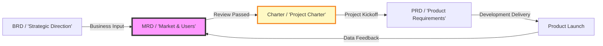

### 0.2 Executive Summary (One-Pager)

| Dimension | Core Conclusion |
| :--- | :--- |
| **Market Opportunity** | ¥Z billion addressable market, annual growth >50%, [certain policy/technology] creates a 3-6 month window |
| **Target Users** | [User Group A], [X million people], core pain point "[one-line pain point]", willingness to pay preliminarily validated |
| **Competitive Landscape** | Competitors A/B focus on KA/individual market, **[SME lightweight collaboration]** is a clear whitespace |
| **Product Strategy** | [Product Name], positioned as "[one-line positioning]", MVP focuses on [3 core features] |
| **Business Assumptions** | CAC ≤ ¥150, LTV ≥ ¥450, LTV/CAC ≥ 3, break-even in 18 months |
| **Recommended Decision** | 🟢 **Start Immediately** — Convene project kickoff review, form PDT, deliver MVP before June 30 |

### 0.3 Change Log

| Version | Date | Author | Changes | Reviewer |
| :--- | :--- | :--- | :--- | :--- |
| v0.1 | YYYY-MM-DD | [Name] | Initial draft completed | [Name] |
| v0.2 | YYYY-MM-DD | [Name] | Added competitor data and market size calculations | [Name] |
| v0.3 | YYYY-MM-DD | [Name] | Review passed, baseline archived | [Name] |
| v0.4 | 2026-06-09 | Xie Dong | Fix: quadrantChart template changed to table format (Feishu incompatible) | — |
| v0.4.1 | 2026-06-09 | Xie Dong | Fix: xychart-beta chart converted to table for Feishu rendering compatibility | — |
| v0.4.2 | 2026-06-09 | Xie Dong | Fix: gantt chart converted to table for Feishu rendering compatibility | — |
### 0.4 Glossary

| Term | Full Name | Definition |
| :--- | :--- | :--- |
| TAM | Total Addressable Market | Total potential market size |
| SAM | Serviceable Available Market | Serviceable market |
| SOM | Serviceable Obtainable Market | Obtainable market (3-year target) |
| LTV | Lifetime Value | Customer lifetime value |
| CAC | Customer Acquisition Cost | Customer acquisition cost |
| PMF | Product-Market Fit | Product-market fit |
| JTBD | Jobs-to-be-Done | Jobs-to-be-Done theory |
| [Term] | [Full Name] | [Definition] |

---

## 1. Market Analysis

### 1.1 Market Definition

- **Market Boundary:** [Clearly define target market scope, e.g.: Digital procurement collaboration market for SMEs with <300 employees in China]
- **Market Stage:** Introduction / Growth / Maturity / Decline
- **Growth Drivers:** [Technology-driven / Policy-driven / Demand-driven / Supply-driven]

### 1.2 Macro Environment Scan (PEST)

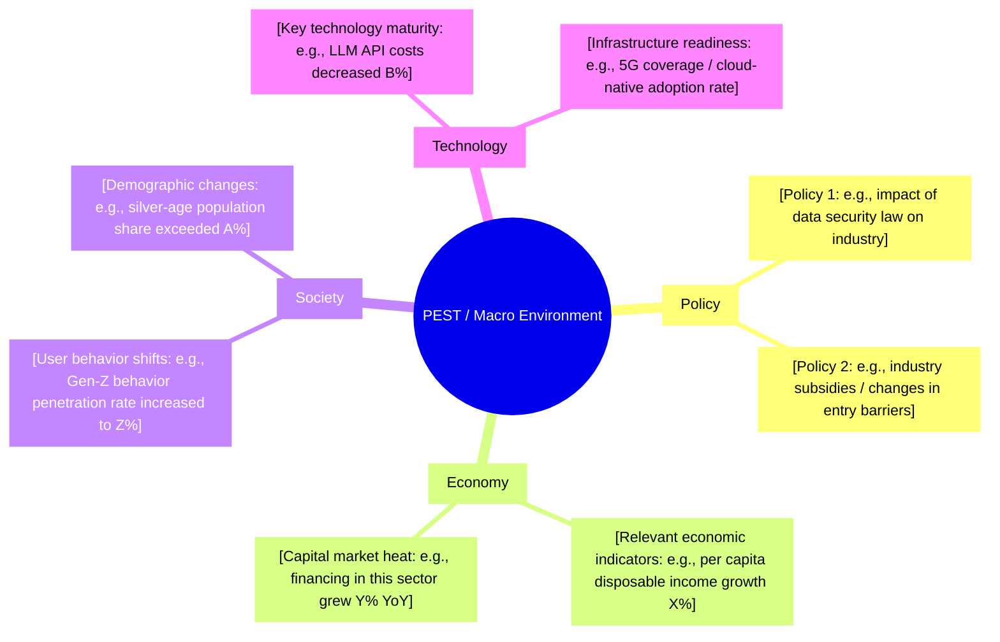

**Core Conclusion:** [One-line summary of the 1-2 most favorable macro factors for the product]

### 1.3 Market Size Estimation

> **Reference Note:** For detailed market size data, historical trends, forecasting models, and sensitivity analysis, please refer to **[Template] Market Research Report §4. Market Size & Trends**. This document only references key conclusions.

| Metric | Value | Calculation Logic | Data Source |
| :--- | :---: | :--- | :--- |
| **TAM** | ¥X billion | Reference Market Research Report §4.1 | [iResearch/IDC/Gartner/National Bureau of Statistics] |
| **SAM** | ¥Y billion | Reference Market Research Report §4.3 | [Internal model calculation] |
| **SOM** | ¥Z billion | Reference Market Research Report §4.5 | [Internal strategic target breakdown] |

> **Full Data:** Market size historical data, three-scenario forecasts, and sensitivity analysis are detailed in **[Template] Market Research Report §4.4-4.6**.

### 1.4 Market Trends & Cycle Positioning

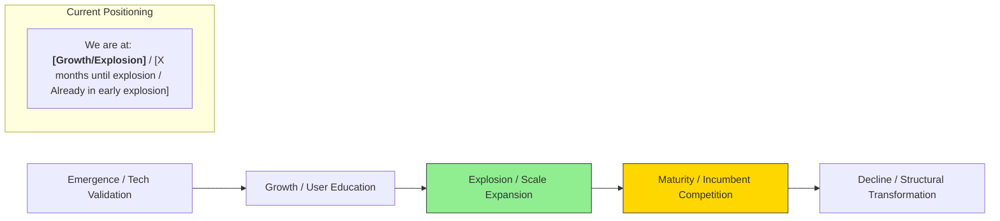

**Key Trend Signals:**

- [Trend 1: e.g., AI Agents moving from PoC to productivity tools, with significantly increased willingness to pay among leading customers]
- [Trend 2: e.g., Industry evolving from point solutions to integrated platforms, integration capability becoming a core procurement criterion]
- [Trend 3: e.g., Tightening regulation, compliance becoming an entry barrier rather than a bonus]

### 1.5 Market Problem & Opportunity Matrix

| Problem/Opportunity ID | Type | Description | Supporting Data | Relevance to Us |
| :--- | :---: | :--- | :--- | :---: |
| M-001 | Pain Point | [e.g., SME digital procurement: "no dedicated staff, no system, no historical data"] | [Survey shows 73% of procurement staff spend 3h+ daily on Excel reconciliation] | ⭐⭐⭐⭐⭐ |
| M-002 | Trend | [e.g., LLM API costs decreased 80%, real-time voice translation commercialization viable] | [Cloud provider Q2 API pricing / Industry technology maturity curve] | ⭐⭐⭐⭐ |
| M-003 | Whitespace | [e.g., Existing competitors all focus on KA clients, no coverage for enterprises with <300 employees] | [This segment growing at 210% annually, but zero supply-side products] | ⭐⭐⭐⭐⭐ |

---

## 2. User Analysis

### 2.1 Target User Segmentation

> **Note:** This quadrant chart template has been converted to a table description.

<!--
Original quadrantChart structure reference:
- title: User Value Segmentation Matrix (Spending Capacity × Demand Intensity)
- x-axis: Low Spending Capacity --> High Spending Capacity
- y-axis: Low Demand Intensity --> High Demand Intensity
- quadrant-1: Core Users (High Value)
- quadrant-2: Potential Users (Need Nurturing)
- quadrant-3: Low Priority
- quadrant-4: Harvest Users (Quick Monetization)
- Data points: "User Group A / [e.g., SME procurement officers]": [0.3, 0.9]; "User Group B / [e.g., Enterprise IT administrators]": [0.8, 0.7]; "User Group C / [e.g., Freelancers]": [0.4, 0.4]; "User Group D / [e.g., Personal hobbyists]": [0.2, 0.3]
-->

| Quadrant | Region Characteristics | Strategy Recommendation |
| :--- | :--- | :--- |
| Quadrant 1 (High Spending · High Demand) | Core Users (High Value) | Priority maintenance, deep operations |
| Quadrant 2 (Low Spending · High Demand) | Potential Users (Need Nurturing) | Lower barriers, guide upgraded spending |
| Quadrant 3 (Low Spending · Low Demand) | Low Priority | Observation mainly, no resource investment |
| Quadrant 4 (High Spending · Low Demand) | Harvest Users (Quick Monetization) | Rapid conversion, short-term monetization |

| Name | X Value | Y Value | Quadrant |
| :--- | :---: | :---: | :--- |
| User Group A / [e.g., SME procurement officers] | 0.3 | 0.9 | Quadrant 2 (Potential Users) |
| User Group B / [e.g., Enterprise IT administrators] | 0.8 | 0.7 | Quadrant 1 (Core Users) |
| User Group C / [e.g., Freelancers] | 0.4 | 0.4 | Quadrant 3 (Low Priority) |
| User Group D / [e.g., Personal hobbyists] | 0.2 | 0.3 | Quadrant 3 (Low Priority) |

### 2.2 Core User Persona

> **Primary Persona: [User Group A Name, e.g., "Efficiency-focused SME Procurement Officer"]**

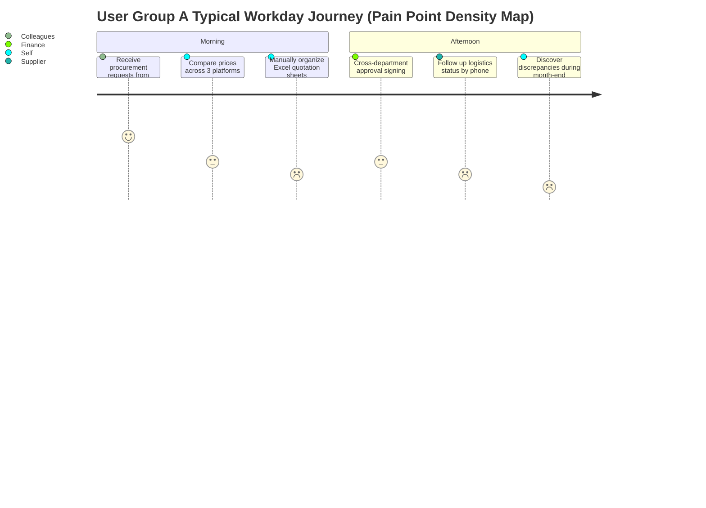

| Dimension | Primary User | Secondary User |
| :--- | :--- | :--- |
| **Demographics** | 25-35 years old, tier 1-2 cities, bachelor's degree or above, monthly income 8K-15K | 35-45 years old, tier 2 cities, manager role, annual income 200K-400K |
| **Professional Profile** | [e.g., Dual role in admin and procurement, not a dedicated procurement position, reports to admin director] | [e.g., IT department head, reports to CTO, focused on system stability] |
| **Core Needs** | [e.g., Complete compliant procurement in minimum time, avoid issues flagged by finance/audit] | [e.g., Scalable system, secure data control, supplier qualification compliance] |
| **JTBD** | [e.g., During month-end closing, want to quickly complete reconciliation to submit reports on time] | [e.g., During annual audit, want to export full operation logs with one click to pass compliance checks] |
| **Current Alternatives** | [e.g., DingTalk approval + WeChat communication + Excel ledger, information scattered across 5 tools] | [e.g., Custom OA system + email communication, high maintenance cost] |
| **Willingness to Pay** | [e.g., Individual does not pay, company budget 5,000-20,000 yuan/year, requires approval process] | [e.g., Company budget 50-200K yuan/year, focused on ROI] |
| **Acquisition Channels** | [e.g., Vertical industry communities, DingTalk app market, peer recommendations] | [e.g., Industry summits, direct sales team, partner referrals] |

### 2.3 User Scenarios & Motivation (JTBD Framework)

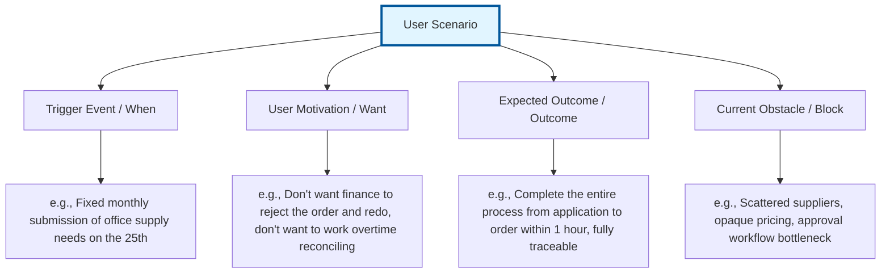

### 2.4 User Story Map

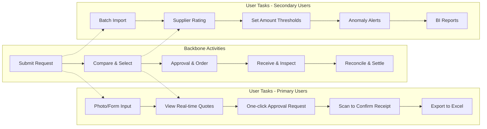

---

## 3. Competitive Analysis

### 3.1 Competitive Landscape Overview

> **Reference Note:** For detailed competitor analysis, capability comparison, user feedback, and strategic insights, please refer to **[Template] Competitive Analysis Report**. This document only references key conclusions.

| Competitor Type | Representative Competitor | Market Positioning | Core Strengths | Main Weaknesses | Threat to Us | Detailed Analysis |
| :--- | :--- | :--- | :--- | :--- | :--- | :--- |
| **Direct Competitor** | [Name] | [Positioning] | [Strengths] | [Weaknesses] | [High/Medium/Low] | Reference Competitive Analysis Report §4-5 |
| **Indirect Competitor** | [Name] | [Positioning] | [Strengths] | [Weaknesses] | [High/Medium/Low] | Reference Competitive Analysis Report §4-5 |
| **Substitute** | [Name] | [Positioning] | [Strengths] | [Weaknesses] | [High/Medium/Low] | Reference Competitive Analysis Report §4-5 |

> **Full Analysis:** Competitor organizational profiles, $APPEALS analysis, feature matrix, user feedback, and strategic canvas are detailed in **[Template] Competitive Analysis Report §4-9**.

### 3.2 Core Competitor Comparison

> **Reference Note:** For detailed competitor comparison, feature matrix, capability radar chart, and strategic canvas, please refer to **[Template] Competitive Analysis Report §6-8**. This document only references key conclusions.

**Competitor Positioning Comparison Summary:**

| Competitor | Positioning | Core Strengths | Main Weaknesses | Implications for Us | Detailed Analysis |
| :--- | :--- | :--- | :--- | :--- | :--- |
| **Competitor A** | [Positioning] | [Strengths] | [Weaknesses] | [Implications] | Reference Competitive Analysis Report §5.1 |
| **Competitor B** | [Positioning] | [Strengths] | [Weaknesses] | [Implications] | Reference Competitive Analysis Report §5.1 |
| **Competitor C** | [Positioning] | [Strengths] | [Weaknesses] | [Implications] | Reference Competitive Analysis Report §5.1 |
| **Ours** | [Positioning] | [Strengths] | [Weaknesses] | — | — |

**Differentiation Opportunities:**

| Differentiation Direction | Our Advantages | Competitor Gap | User Value | Implementation Difficulty | Detailed Analysis |
| :--- | :--- | :--- | :--- | :--- | :--- |
| [Direction 1] | [Advantages] | [Gap] | [Value] | [High/Medium/Low] | Reference Competitive Analysis Report §9.1 |
| [Direction 2] | [Advantages] | [Gap] | [Value] | [High/Medium/Low] | Reference Competitive Analysis Report §9.1 |

> **Full Analysis:** $APPEALS analysis, feature matrix, user feedback, and strategic canvas are detailed in **[Template] Competitive Analysis Report §6-9**.

### 3.4 Competitor Capability Radar Chart

<svg xmlns="http://www.w3.org/2000/svg" viewBox="0 0 600 580" width="100%" style="max-width:600px">
  <rect width="600" height="580" fill="#fafafa" rx="8"/>
  <text x="300" y="30" text-anchor="middle" font-size="18" font-weight="bold" fill="#333">Core Capability Comparison Radar Chart</text>
  <polygon points="300.0,256 338.1,278 338.1,322 300.0,344 261.9,322 261.9,278" fill="none" stroke="#ddd" stroke-width="1"/>
  <text x="374" y="278" font-size="11" fill="#999">20</text>
  <polygon points="300.0,212 376.2,256 376.2,344 300.0,388 223.8,344 223.8,256" fill="none" stroke="#ddd" stroke-width="1"/>
  <text x="412" y="256" font-size="11" fill="#999">40</text>
  <polygon points="300.0,168 414.3,234 414.3,366 300.0,432 185.7,366 185.7,234" fill="none" stroke="#ddd" stroke-width="1"/>
  <text x="450" y="234" font-size="11" fill="#999">60</text>
  <polygon points="300.0,124 452.4,212 452.4,388 300.0,476 147.6,388 147.6,212" fill="none" stroke="#ddd" stroke-width="1"/>
  <text x="488" y="212" font-size="11" fill="#999">80</text>
  <polygon points="300.0,80 490.5,190 490.5,410 300.0,520 109.5,410 109.5,190" fill="none" stroke="#ddd" stroke-width="1"/>
  <text x="527" y="190" font-size="11" fill="#999">100</text>
  <line x1="300" y1="300" x2="300.0" y2="80" stroke="#ddd" stroke-width="1"/>
  <text x="300.0" y="50" text-anchor="middle" font-size="13" fill="#333">Feature Completeness</text>
  <line x1="300" y1="300" x2="490.5" y2="190" stroke="#ddd" stroke-width="1"/>
  <text x="516.5" y="175" text-anchor="start" font-size="13" fill="#333">Ease of Use</text>
  <line x1="300" y1="300" x2="490.5" y2="410" stroke="#ddd" stroke-width="1"/>
  <text x="516.5" y="425" text-anchor="start" font-size="13" fill="#333">Price Advantage</text>
  <line x1="300" y1="300" x2="300.0" y2="520" stroke="#ddd" stroke-width="1"/>
  <text x="300.0" y="550" text-anchor="middle" font-size="13" fill="#333">Scalability</text>
  <line x1="300" y1="300" x2="109.5" y2="410" stroke="#ddd" stroke-width="1"/>
  <text x="83.5" y="425" text-anchor="end" font-size="13" fill="#333">Service Response</text>
  <line x1="300" y1="300" x2="109.5" y2="190" stroke="#ddd" stroke-width="1"/>
  <text x="83.5" y="175" text-anchor="end" font-size="13" fill="#333">Ecosystem Openness</text>
  <!-- Competitor A: [90, 40, 20, 85, 70, 30] -->
  <polygon points="300.0,102 376.2,256 338.1,322 300.0,487 166.6,377 242.8,267" fill="#e74c3c" fill-opacity="0.1" stroke="#e74c3c" stroke-width="2.5"/>
  <circle cx="300.0" cy="102" r="4.5" fill="#e74c3c" stroke="#fff" stroke-width="1.5"/>
  <text x="310.0" y="94" text-anchor="middle" font-size="10" fill="#e74c3c" font-weight="bold">90</text>
  <circle cx="376.2" cy="256" r="4.5" fill="#e74c3c" stroke="#fff" stroke-width="1.5"/>
  <text x="386.2" y="248" text-anchor="start" font-size="10" fill="#e74c3c" font-weight="bold">40</text>
  <circle cx="338.1" cy="322" r="4.5" fill="#e74c3c" stroke="#fff" stroke-width="1.5"/>
  <text x="348.1" y="334" text-anchor="start" font-size="10" fill="#e74c3c" font-weight="bold">20</text>
  <circle cx="300.0" cy="487" r="4.5" fill="#e74c3c" stroke="#fff" stroke-width="1.5"/>
  <text x="310.0" y="499" text-anchor="middle" font-size="10" fill="#e74c3c" font-weight="bold">85</text>
  <circle cx="166.6" cy="377" r="4.5" fill="#e74c3c" stroke="#fff" stroke-width="1.5"/>
  <text x="156.6" y="389" text-anchor="end" font-size="10" fill="#e74c3c" font-weight="bold">70</text>
  <circle cx="242.8" cy="267" r="4.5" fill="#e74c3c" stroke="#fff" stroke-width="1.5"/>
  <text x="232.8" y="259" text-anchor="end" font-size="10" fill="#e74c3c" font-weight="bold">30</text>
  <!-- Competitor B: [50, 80, 95, 30, 40, 60] -->
  <polygon points="300.0,190 452.4,212 481.0,404 300.0,366 223.8,344 185.7,234" fill="#3498db" fill-opacity="0.1" stroke="#3498db" stroke-width="2.5"/>
  <circle cx="300.0" cy="190" r="4.5" fill="#3498db" stroke="#fff" stroke-width="1.5"/>
  <text x="310.0" y="182" text-anchor="middle" font-size="10" fill="#3498db" font-weight="bold">50</text>
  <circle cx="452.4" cy="212" r="4.5" fill="#3498db" stroke="#fff" stroke-width="1.5"/>
  <text x="462.4" y="204" text-anchor="start" font-size="10" fill="#3498db" font-weight="bold">80</text>
  <circle cx="481.0" cy="404" r="4.5" fill="#3498db" stroke="#fff" stroke-width="1.5"/>
  <text x="491.0" y="416" text-anchor="start" font-size="10" fill="#3498db" font-weight="bold">95</text>
  <circle cx="300.0" cy="366" r="4.5" fill="#3498db" stroke="#fff" stroke-width="1.5"/>
  <text x="310.0" y="378" text-anchor="middle" font-size="10" fill="#3498db" font-weight="bold">30</text>
  <circle cx="223.8" cy="344" r="4.5" fill="#3498db" stroke="#fff" stroke-width="1.5"/>
  <text x="213.8" y="356" text-anchor="end" font-size="10" fill="#3498db" font-weight="bold">40</text>
  <circle cx="185.7" cy="234" r="4.5" fill="#3498db" stroke="#fff" stroke-width="1.5"/>
  <text x="175.7" y="226" text-anchor="end" font-size="10" fill="#3498db" font-weight="bold">60</text>
  <!-- Our Solution: [65, 90, 85, 60, 85, 95] -->
  <polygon points="300.0,157 471.5,201 461.9,394 300.0,432 138.1,394 119.0,195" fill="#2ecc71" fill-opacity="0.1" stroke="#2ecc71" stroke-width="2.5"/>
  <circle cx="300.0" cy="157" r="4.5" fill="#2ecc71" stroke="#fff" stroke-width="1.5"/>
  <text x="310.0" y="149" text-anchor="middle" font-size="10" fill="#2ecc71" font-weight="bold">65</text>
  <circle cx="471.5" cy="201" r="4.5" fill="#2ecc71" stroke="#fff" stroke-width="1.5"/>
  <text x="481.5" y="193" text-anchor="start" font-size="10" fill="#2ecc71" font-weight="bold">90</text>
  <circle cx="461.9" cy="394" r="4.5" fill="#2ecc71" stroke="#fff" stroke-width="1.5"/>
  <text x="471.9" y="406" text-anchor="start" font-size="10" fill="#2ecc71" font-weight="bold">85</text>
  <circle cx="300.0" cy="432" r="4.5" fill="#2ecc71" stroke="#fff" stroke-width="1.5"/>
  <text x="310.0" y="444" text-anchor="middle" font-size="10" fill="#2ecc71" font-weight="bold">60</text>
  <circle cx="138.1" cy="394" r="4.5" fill="#2ecc71" stroke="#fff" stroke-width="1.5"/>
  <text x="128.1" y="406" text-anchor="end" font-size="10" fill="#2ecc71" font-weight="bold">85</text>
  <circle cx="119.0" cy="195" r="4.5" fill="#2ecc71" stroke="#fff" stroke-width="1.5"/>
  <text x="109.0" y="187" text-anchor="end" font-size="10" fill="#2ecc71" font-weight="bold">95</text>
  <rect x="30" y="510" width="14" height="14" rx="2" fill="#e74c3c"/>
  <text x="48" y="521" font-size="13" fill="#333">Competitor A</text>
  <rect x="220" y="510" width="14" height="14" rx="2" fill="#3498db"/>
  <text x="238" y="521" font-size="13" fill="#333">Competitor B</text>
  <rect x="410" y="510" width="14" height="14" rx="2" fill="#2ecc71"/>
  <text x="428" y="521" font-size="13" fill="#333">Our Solution</text>
</svg>

### 3.5 Competitor Strategy Inference

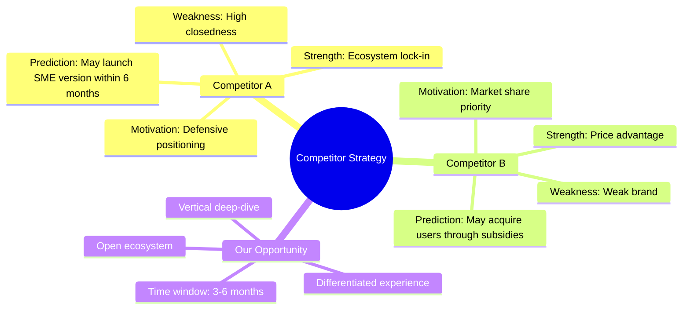

---

## 4. Product Strategy & Requirements

### 4.1 Product Positioning

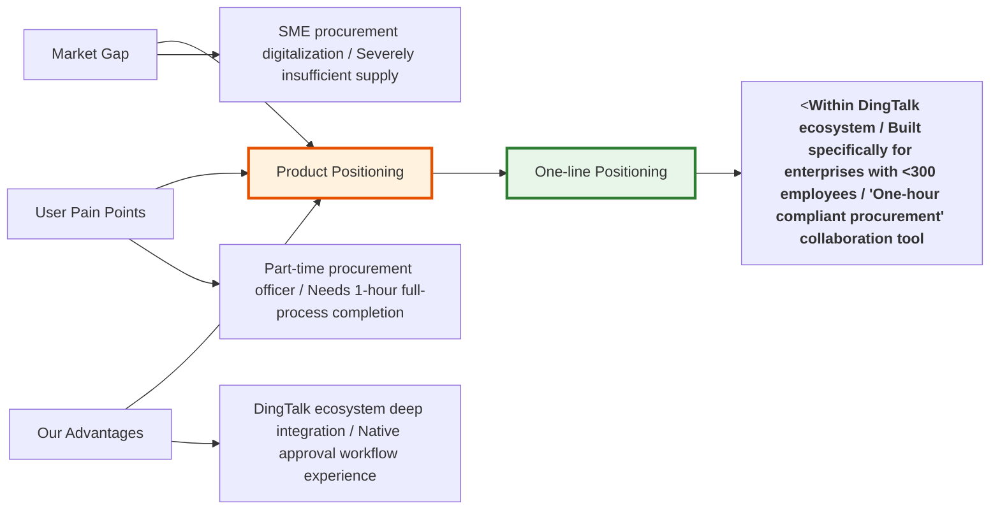

### 4.2 Product Architecture Blueprint

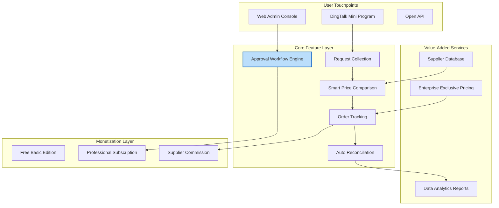

### 4.3 Requirements Priority Matrix

> **Note:** This quadrant chart template has been converted to a table description.

<!--
Original quadrantChart structure reference:
- title: Requirements Priority Matrix (User Value × Implementation Cost)
- x-axis: Low Cost --> High Cost
- y-axis: Low User Value --> High User Value
- quadrant-1: Key Investment (High Value, Low Barrier)
- quadrant-2: Differentiation Moat (High Value, High Barrier)
- quadrant-3: No Investment (Low Value, High Barrier)
- quadrant-4: Quick Launch (Low Value, Low Barrier)
- Data points: "REQ-001: One-click procurement request": [0.2, 0.9]; "REQ-002: DingTalk native approval workflow": [0.3, 0.85]; "REQ-003: AI smart price comparison": [0.7, 0.8]; "REQ-004: Supplier credit rating": [0.6, 0.5]; "REQ-005: Multi-language support": [0.8, 0.3]; "REQ-006: Dark mode": [0.1, 0.2]
-->

| Quadrant | Region Characteristics | Strategy Recommendation |
| :--- | :--- | :--- |
| Quadrant 1 (Low Cost · High Value) | Key Investment (High Value, Low Barrier) | Start immediately, quick launch |
| Quadrant 2 (High Cost · High Value) | Differentiation Moat (High Value, High Barrier) | Include in version roadmap, phased investment |
| Quadrant 3 (High Cost · Low Value) | No Investment (Low Value, High Barrier) | Delay or cancel, no scheduling |
| Quadrant 4 (Low Cost · Low Value) | Quick Launch (Low Value, Low Barrier) | Complete when resources are available |

| Name | X Value | Y Value | Quadrant |
| :--- | :---: | :---: | :--- |
| REQ-001: One-click procurement request | 0.2 | 0.9 | Quadrant 1 (Key Investment) |
| REQ-002: DingTalk native approval workflow | 0.3 | 0.85 | Quadrant 1 (Key Investment) |
| REQ-003: AI smart price comparison | 0.7 | 0.8 | Quadrant 2 (Differentiation Moat) |
| REQ-004: Supplier credit rating | 0.6 | 0.5 | Quadrant 2 (Differentiation Moat) |
| REQ-005: Multi-language support | 0.8 | 0.3 | Quadrant 3 (No Investment) |
| REQ-006: Dark mode | 0.1 | 0.2 | Quadrant 4 (Quick Launch) |

### 4.4 Requirements List (MoSCoW + KANO)

| Requirement ID | Requirement Description | User Story | KANO Classification | Priority | Version Plan |
| :--- | :--- | :--- | :---: | :---: | :--- |
| REQ-001 | [Core Requirement 1: One-click procurement request] | As a department employee, I want to submit requests via photo/form so that procurement officers can process them uniformly | Must-be | **Must** | MVP |
| REQ-002 | [Core Requirement 2: DingTalk native approval workflow] | As an admin supervisor, I want to set amount thresholds for automatic approval to improve efficiency | Must-be | **Must** | MVP |
| REQ-003 | [Important Requirement 3: AI smart price comparison] | As a procurement officer, I want to see real-time lowest quotes to control budget | One-dimensional | **Should** | V1.1 |
| REQ-004 | [Value-add Requirement 4: Supplier credit rating] | As a procurement manager, I want to view supplier historical fulfillment scores to reduce risk | Attractive | **Could** | V1.2 |
| REQ-005 | [Future Requirement 5: Multi-language support] | As a multinational employee, I want to use an English interface for overseas colleagues | One-dimensional | **Won't** | V2.0 |

### 4.5 Requirements Validation Plan

| Validation Method | Objective | Sample Size | Timeline | Owner | Pass Criteria |
| :--- | :--- | :---: | :---: | :---: | :--- |
| User Interviews | Validate pain point authenticity | 15 people | Week 1-2 | UX Research | ≥80% of respondents confirm pain point |
| Survey | Quantify requirements priority | 500 responses | Week 2-3 | Marketing | Top 3 requirement selection rate ≥60% |
| MVP Testing | Validate solution viability | 3 companies | Week 4-6 | Product | Core task completion rate ≥70% |
| Competitor Benchmarking | Validate differentiation space | — | Week 1-3 | Product | At least 3 differentiation features |

### 4.6 Non-Functional Requirements (NFR)

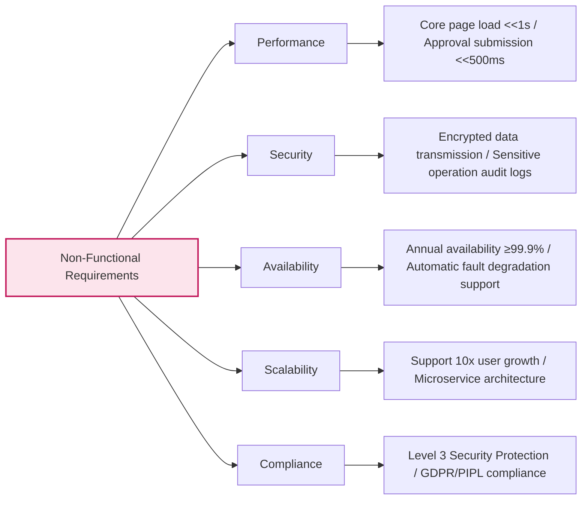

---

## 5. Go-to-Market Strategy

### 5.1 Positioning Strategy

**Value Proposition:**

> For **[target users]**, who **[key pain points/needs]**, **[product name]** is a **[product category]** that **[core benefits]**. Unlike **[primary competitor]**, we **[differentiation advantage]**.

**Differentiation Selling Points:**

1. [Selling point 1: e.g., The only lightweight tool in the DingTalk ecosystem supporting "1-hour procurement closure"]
2. [Selling point 2: e.g., Zero implementation cost, ready to use, no IT department involvement needed]
3. [Selling point 3: e.g., Procurement data auto-syncs with finance systems, month-end reconciliation time reduced from 3 days to 1 hour]

### 5.2 Pricing Strategy

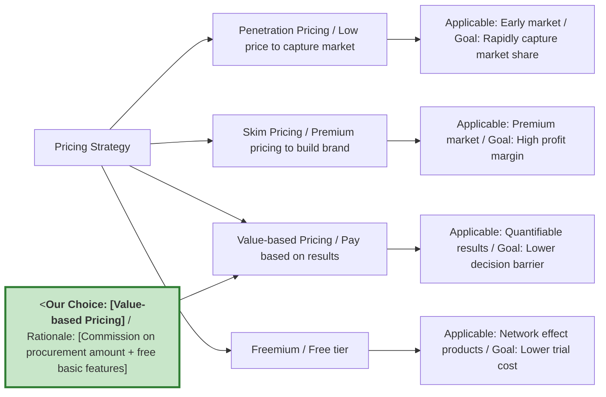

### 5.3 Channel Strategy

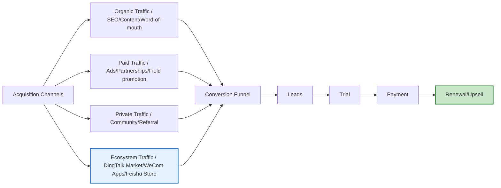

### 5.4 Growth Flywheel

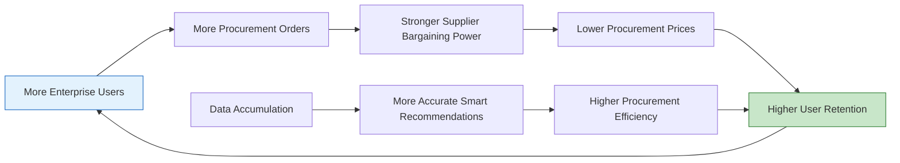

---

## 6. Execution Plan

### 6.1 Project Scope Boundary

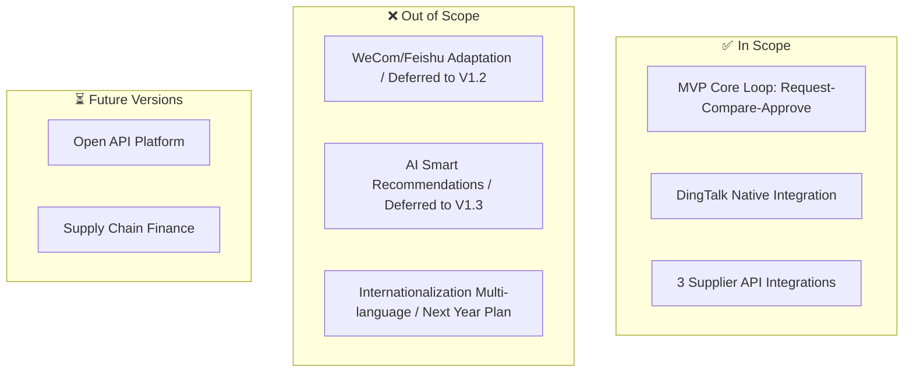

### 6.2 Product Roadmap & Milestones

> **Note:** Gantt chart is incompatible with Feishu, converted to table description.

| Phase | Task/Milestone | Start Date | Duration | Status |
|:---|:---|:---|:---:|:---:|
| Validation Phase M1-M3 | MVP Core Loop Validation | YYYY-MM | 3M | ⚪ |
| Validation Phase M1-M3 | CDCP Concept Decision Review | YYYY-MM-DD | 0d | ⚪ milestone |
| Growth Phase M4-M9 | Approval Workflow Engine 2.0 | After MVP Complete | 3M | ⚪ |
| Growth Phase M4-M9 | Supplier Ecosystem Integration | After Approval Workflow Complete | 3M | ⚪ |
| Growth Phase M4-M9 | PDCP Plan Decision Review | YYYY-MM-DD | 0d | ⚪ milestone |
| Growth Phase M4-M9 | ADCP Development Complete Review | YYYY-MM-DD | 0d | ⚪ milestone |
| Scale Phase M10-M15 | Multi-platform Adaptation (WeCom/Feishu) | After Supplier Integration | 3M | ⚪ |
| Scale Phase M10-M15 | Data Analytics & BI Reports | After Platform Adaptation | 3M | ⚪ |
| Scale Phase M10-M15 | LDCP Validation Decision Review | YYYY-MM-DD | 0d | ⚪ milestone |
| Commercialization M16-M18 | Enterprise Exclusive Pricing & Commission System | After BI Reports Complete | 3M | ⚪ |
| Commercialization M16-M18 | RDCP Release Decision Review | YYYY-MM-DD | 0d | ⚪ milestone |

| DCP Point | Review Content | Pass Criteria | Timeline |
| :--- | :--- | :--- | :---: |
| **CDCP** | Business viability, market demand | MRD passes review, business assumptions verifiable | T+2 weeks |
| **PDCP** | Product solution, technical solution, resource plan | PRD/TRD passes review, budget approved | T+4 weeks |
| **ADCP** | Development completion, quality baseline | Code review passed, bugs resolved | T+8 weeks |
| **LDCP** | Test pass rate, user acceptance | UAT passed, performance meets standards | T+10 weeks |
| **RDCP** | Release readiness, operations readiness | Gray release passed, monitoring ready | T+11 weeks |

### 6.3 Project Team (PDT)

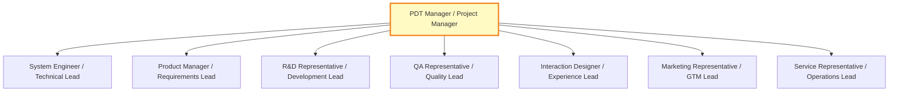

### 6.4 Team Responsibility Matrix (RACI)

| Key Activity | PDT Manager | Product Manager | R&D | QA | Design | Marketing |
| :--- | :---: | :---: | :---: | :---: | :---: | :---: |
| Requirements Definition | A | R | C | C | C | I |
| Technical Solution | A | C | R | C | I | I |
| Development | I | C | R | C | I | I |
| Testing & Acceptance | A | C | C | R | I | I |
| Release & Launch | A | C | R | C | I | R |
| Operations & Promotion | I | C | I | I | C | R |

> **R=Responsible, A=Accountable, C=Consulted, I=Informed**

---

## 7. Resources & Budget

### 7.1 Resource Requirements

| Resource Type | Detail | Quantity | Budget (10K CNY) | Availability |
| :--- | :--- | :---: | :---: | :---: |
| **Human Resources** | Product Manager | 2 people | 60 | Immediate |
| | Backend Developer | 4 people | 120 | Immediate |
| | Frontend Developer | 2 people | 60 | Immediate |
| | Test Engineer | 2 people | 50 | T+2 weeks |
| | Designer | 1 person (part-time) | 20 | Immediate |
| **Technical Costs** | Cloud Server/Database | — | 30 | T+4 weeks |
| | Third-party Services (SMS/Payment/AI) | — | 20 | T+2 weeks |
| **Operations Costs** | Seed User Acquisition/Content Operations | — | 30 | T+6 weeks |
| **Other** | Office/Travel/Training | — | 10 | As needed |
| **Total** | | | **400** | |

### 7.2 Investment-Return Model (3 Years)

> **Note:** xychart-beta is an incompatible Mermaid type for Feishu, converted to table description (template example data).

**3-Year Investment-Return Trend (10K CNY)**

| Year | Investment (10K CNY) | Revenue (10K CNY) |
| :--- | :---: | :---: |
| Year 1 | 500 | 200 |
| Year 2 | 800 | 1,500 |
| Year 3 | 1,000 | 3,000 |

| Year | Investment (10K) | Revenue (10K) | Profit (10K) | ROI |
| :---: | :---: | :---: | :---: | :---: |
| Year 1 | 500 | 200 | -300 | -60% |
| Year 2 | 800 | 1500 | 700 | 88% |
| Year 3 | 1000 | 3000 | 2000 | 200% |

---

## 8. Success Metrics

### 8.1 North Star Metric & Growth Model

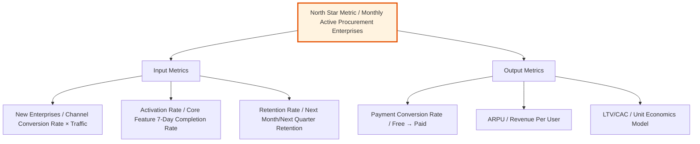

### 8.2 Metrics Framework

| Metric Type | Metric Name | Target | Measurement Cycle | Owner |
| :--- | :--- | :---: | :---: | :---: |
| **North Star Metric** | Monthly Active Procurement Enterprises | X companies | Monthly | Product |
| Market Metric | Market Share | X% | Quarterly | Marketing |
| User Metric | NPS Score | ≥ 40 | Monthly | UX Research |
| Product Metric | Core Feature Adoption Rate | ≥ 60% | Post-release | Product |
| Business Metric | Customer Acquisition Cost (CAC) | ≤ ¥150 | Monthly | Growth |
| Business Metric | Lifetime Value (LTV) | ≥ ¥450 | Quarterly | Operations |
| Business Metric | LTV/CAC | ≥ 3 | Quarterly | Finance |

---

## 9. Risk & Mitigation

### 9.1 Key Business Assumptions

| Assumption ID | Assumption Content | Validation Method | Impact if Invalid |
| :--- | :--- | :--- | :--- |
| A-001 | SME procurement officers willing to pay for "time savings" | MVP free trial to paid conversion rate ≥15% | Need to shift to advertising/commission model |
| A-002 | DingTalk ecosystem CAC < ¥150 | Track channel investment ROI | Need to expand WeCom/Feishu channels |
| A-003 | Suppliers willing to integrate via API and provide floor pricing | Sign 3 leading suppliers for pilot | Need to build own supply chain, costs double |

### 9.2 Risk Matrix & Exit Mechanism

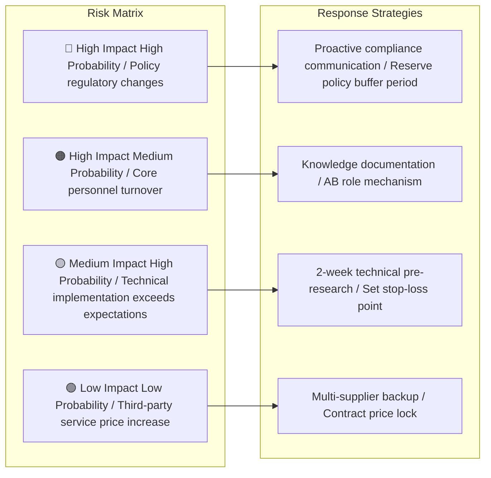

| Risk ID | Risk Description | Probability | Impact | Response Strategy | Owner | Exit Condition |
| :--- | :--- | :---: | :---: | :--- | :--- | :--- |
| R-001 | [e.g., Data security law imposes new requirements on cross-border procurement data transfer] | Medium | High | Engage compliance consultant early for architecture review | Legal/Security | Delay >1 month → suspend |
| R-002 | [e.g., Competitor suddenly offers free pricing, disrupting market] | Medium | High | Strengthen differentiated scenarios, avoid direct price war | Product Lead | Market share <<5% → Pivot |
| R-003 | [e.g., DingTalk open platform API policy adjustment] | Low | High | Build adaptation layer, reduce platform coupling | Tech Lead | API unavailable >2 weeks → switch platform |
| R-004 | [e.g., User activity during MVP validation period below expectations] | Medium | Medium | Set 4-week data observation period, pivot if targets not met | Product Lead | DAU <<100 → reduce scope |

---

## 10. Recommendation & Next Steps

### 10.1 Core Conclusions

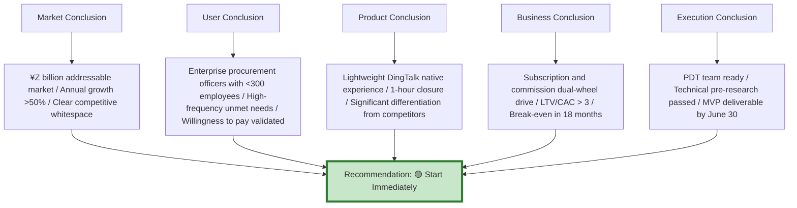

### 10.2 Decision Recommendation

> **Recommended Decision:** 🟢 Start Immediately / 🟡 Start After Additional Research / 🔴 Postpone
> **Key Rationale:**
>
> 1. [Rationale 1: e.g., Limited market window, competitors expected to follow in the SME track within 6 months]
> 2. [Rationale 2: e.g., Technical feasibility validated through POC, core approval workflow integration with DingTalk API unblocked]
> 3. [Rationale 3: e.g., Healthy financial model, single-month break-even achievable by month 14 under conservative estimates]
>
> **Next Steps:**
>
> - [ ] Convene project kickoff review, confirm core PDT team (Product ×1, R&D ×3, Design ×1, Operations ×1)
> - [ ] Launch MVP sprint, complete request-compare-approve core loop demo before June 30
> - [ ] Simultaneously initiate supplier BD, lock in first batch of 3 strategic partners

---

## 11. Appendix

- **Appendix A:** User in-depth interview raw records (anonymized)
- **Appendix B:** Competitor product screenshots and feature lists
- **Appendix C:** Market size estimation Excel workbook
- **Appendix D:** Technical feasibility pre-research report summary
- **Appendix E:** Terminology explanations and data definitions

> **Document Writing Principles Reminder:**
>
> 1. **Data > Opinions:** Every conclusion must be supported by data or direct user quotes. Reject "I think."
> 2. **Logical Closure:** Pain point → Scenario → Requirement → Feature → Resource → Milestone — the chain must not break.
> 3. **Economy of Words:** MRD is not a thesis. Average management reading time <<8 minutes. Charts over text.
> 4. **Self-Convincing:** If the document cannot convince yourself, do not submit it for review.