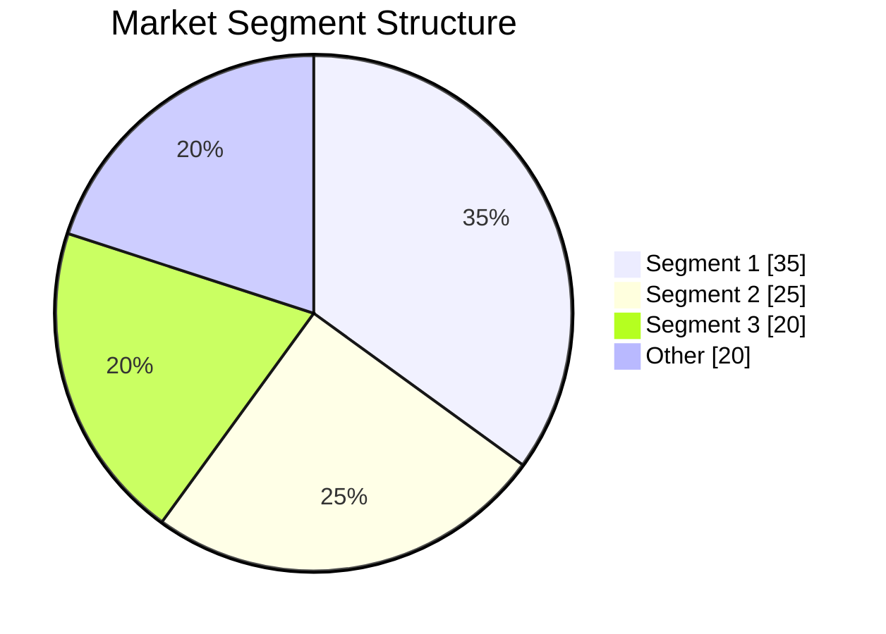
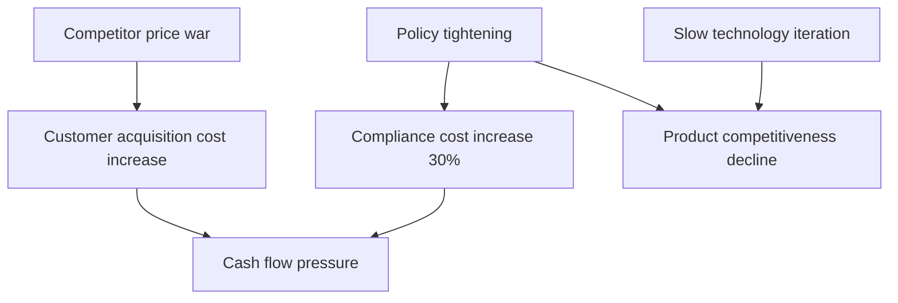

# [Product/System Name (English)] - Market Research Report

> **Document Status:** 🟡 Under Review / 🟢 Approved / 🔴 Rejected
>
> **Confidentiality Level:** Confidential / Internal / Public
>
> **Version:** vX.X
>
> **Date:** YYYY-MM-DD
>
> **Author:** [Name/Role]
>
> **Reviewer:** [Name/Role]
>
> **Audience:** [Role List]

---

## 0. Document Guide

### 0.1 Purpose and Scope

[State the purpose of this document, applicable scenarios, and non-applicable scenarios]

### 0.2 Related Documents

| Document Type | Filename | Related Sections |
|---------|--------|---------|
| [Type] | [Filename] [Line Range] | [Section Description] |

> **Reference Format**: Related documents use `filename line range` format (e.g., `【Template】Technical Requirements Document (TRD).md 3-17`). Line numbers may change as documents are updated; please refer to the actual content.

### 0.3 Change Log

| Version | Date | Author | Changes | Reviewer |
| :--- | :--- | :--- | :--- | :--- |
| v0.1 | YYYY-MM-DD | [Name] | Initial draft completed | [Reviewer] |
| v0.2 | YYYY-MM-DD | [Name] | Added market size forecast and competitive landscape analysis | [Reviewer] |
| v0.3 | 2026-06-09 | Xie Dong | Fix: Changed quadrantChart template to table format (Feishu incompatible) | — |
| v0.3.1 | 2026-06-09 | Xie Dong | Fix: Changed xychart-beta diagram to table for Feishu rendering compatibility | — |

---

## 1. Executive Summary

> **Executive Summary**: {Answer three questions in 3-5 sentences: ① Why was this market research conducted? ② What are the 1-3 core findings? ③ What actions are recommended? Unreaders should understand the report's value within 30 seconds after reading this paragraph.}
>
> Example: This research aims to assess the feasibility of entering the AI travel planning market. Core findings: Market size is projected to reach 12 billion yuan by 2026 (CAGR 35%), but user willingness to pay is only 12%; leading players Ctrip/Tongcheng hold 60% market share, but AI-native tools have achieved 28% penetration among Gen Z. Recommendation: Adopt a "free AI planning + transaction commission" model to enter the market, focusing on 25-30 year-old users in first-tier cities in the first year, avoiding direct competition with OTAs.

---

## 2. Research Objectives and Scope

**🎯 Chapter Objective**: Clearly define the decision-making questions this research aims to answer, select an appropriate research design, and prevent scope creep.

### 2.1 Research Purpose and Decision Scenarios

| Research Type | Purpose in This Report | Key Questions to Answer | Impact on Decisions | Target Readers |
|---------|---------|---------------|---------|---------|
| {Market Entry/Product Positioning/Pricing Strategy/User Insights/Competitive Strategy/Technology Trends/Other} | {Specific description} | {1-2 core questions} | {Yes/No/Invest/Don't Invest/Adjust Direction} | {Executive/Product/Sales/R&D} |

> **Objective-Oriented Principle**: Different research purposes correspond to different research designs, sampling strategies, and analytical frameworks. See Appendix 12.6 "Research Design Tailoring Guide" for details.

### 2.2 Research Design Framework (Mixed Methods Design)

<!-- Select an appropriate mixed research design based on research objectives -->

**Research Design Adopted in This Report**: {Convergent Parallel / Explanatory Sequential / Exploratory Sequential / Embedded Mixed / Multi-phase Evaluation Design}

| Design Type | Quantitative Phase | Qualitative Phase | Integration Approach | Applicable Scenarios | Application in This Report |
|---------|---------|---------|---------|---------|-----------|
| **Convergent Parallel** | Concurrent collection | Concurrent collection | Parallel comparison/data transformation | Multi-angle validation of the same issue needed | {Applied chapters} |
| **Explanatory Sequential** | Quantitative first | Qualitative second | Qualitative explains quantitative results | Need to understand "why" | {Applied chapters} |
| **Exploratory Sequential** | Qualitative first | Quantitative second | Qualitative develops quantitative tools | New domain exploration, tool development | {Applied chapters} |
| **Embedded Mixed** | Embedded in dominant method | Auxiliary method | Supplementary validation/deepening | Main research needs supplementary evidence | {Applied chapters} |
| **Multi-phase Evaluation** | Multiple rounds of independent research | Multiple rounds of independent research | Diachronic evaluation | Long-term project evaluation | {Applied chapters} |

> **Design Selection Rationale**: {Explain why this design was chosen, e.g., "This is a new market; we first use qualitative interviews to explore user pain points, then design questionnaires for large-scale validation"}.

### 2.3 Data Source System and Credibility Ratings

| Level | Source Type | Credibility | Typical Sources | Usage Standards | Application in This Report |
|------|---------|--------|---------|---------|-----------|
| **L1 Authoritative** | Government agencies/International organizations | ★★★★★ | {National Bureau of Statistics/Ministry of Culture and Tourism/World Bank} | Direct citation, used as benchmark data | {Chapter} |
| **L2 Professional** | Industry associations/Top consulting firms | ★★★★ | {iResearch/Analysys/Frost & Sullivan} | Citation after cross-validation | {Chapter} |
| **L3 Academic** | Journal papers/Preprints/Theses | ★★★★ | {CNKI/ArXiv/Wanfang} | Note research sample and method limitations | {Chapter} |
| **L4 Media** | Mainstream financial/Industry media | ★★★ | {36Kr/Huxiotech/TMTPost} | Must trace original source before citation | {Chapter} |
| **L5 Corporate** | Financial reports/Announcements/Official websites | ★★★ | {Listed company annual reports/Official statements} | Distinguish facts from forward-looking statements | {Chapter} |
| **L6 Primary** | Surveys/Interviews/Field observations | ★★★★ | {Own research data} | Note sample size, sampling method, and time | {Chapter} |
| **L7 Other** | Social media/Forums/Reviews | ★★ | {Zhihu/Xiaohongshu/Weibo} | For trend awareness only, not as quantitative basis | {Chapter} |

> **Triangulation Principle**: Key decision data (L1 level) must be cross-validated by ≥2 independent sources; supporting data (L2 level) requires at least 1 authoritative + 1 professional source.

### 2.4 Research Execution Plan and Quality Control

| Phase | Task | Method | Timeline | Key Deliverables | Quality Checkpoints |
|------|------|------|------|---------|-----------|
| **Preparation** | Define framework, literature review | Desk research | {X days} | Research outline, literature map | Framework review passed |
| **Exploration** | Qualitative exploration, hypothesis generation | {Interviews/Focus groups/Field observation} | {X days} | User pain point list, preliminary hypotheses | Information saturation check |
| **Validation** | Quantitative validation, scale estimation | {Questionnaire/Secondary data analysis/Modeling} | {X days} | Validated data, trend model | Reliability and validity test |
| **Deepening** | Qualitative deepening, mechanism explanation | {In-depth interviews/Case studies} | {X days} | Behavioral motivation insights, causal mechanisms | Theoretical saturation check |
| **Integration** | Cross-validation, report writing | Mixed analysis | {X days} | Draft report, decision recommendations | Internal review |
| **Review** | Peer review, revision and finalization | Expert validation | {X days} | Final report | Review feedback closure |

> **Quality Control Mechanisms**:
> 1. **Information Saturation**: Qualitative interviews continue until no new themes emerge (typically 15-30 people)
> 2. **Reliability and Validity Testing**: Questionnaire data must pass Cronbach's α (≥0.7) and factor analysis validation
> 3. **Reflexivity Recording**: Record researcher's role influence during interviews to avoid respondent conformity bias

### 2.5 Data Anomaly Handling Rules

| Anomaly Type | Identification Method | Handling Rule | Recording Location |
|---------|---------|---------|---------|
| **Source Conflict** | Multi-source data deviation >20% | Take confidence interval, mark as estimate; remove if deviation >50% | Appendix 12.1 |
| **Temporal Gap** | Inconsistent data cutoff dates | Uniformly mark data time point; cross-period data requires temporal standardization | Appendix 12.1 |
| **Caliber Difference** | Different statistical caliber/definitions | Clarify each source's statistical caliber; do not force merging | Appendix 12.1 |
| **Sample Bias** | Primary data sample structure imbalance | Weighted adjustment or note limitations; do not overstate representativeness | Appendix 12.1 |

**💡 So what**: {Implications of this chapter's findings for research design, e.g., "Since this is a new market lacking L1-level official data, this report increases the weight of L2-level industry reports and L6-level primary research data, with corresponding adjustments to conclusion confidence levels"}

---

## 3. Macro Environment Analysis (PESTLE + Industry Life Cycle)

**🎯 Chapter Objective**: Assess the macro environment and life cycle stage of the industry, and determine market entry timing.

### 3.1 PESTLE Macro Environment Scan

<!-- Select dimensions based on industry characteristics; not all are mandatory -->

| Dimension | Current Status (Facts) | Trend (Next 6-12 Months) | Impact on Industry | Impact Direction | Information Source |
|------|-----------|-------------------|-----------|---------|---------|
| **P Political** | {Status} | {Trend} | {Impact} | Positive/Neutral/Negative | {L1-L7} |
| **E Economic** | {Status} | {Trend} | {Impact} | Positive/Neutral/Negative | {L1-L7} |
| **S Social** | {Status} | {Trend} | {Impact} | Positive/Neutral/Negative | {L1-L7} |
| **T Technological** | {Status} | {Trend} | {Impact} | Positive/Neutral/Negative | {L1-L7} |
| **L Legal** | {Status} | {Trend} | {Impact} | Positive/Neutral/Negative | {L1-L7} |
| **E Environmental** | {Status} | {Trend} | {Impact} | Positive/Neutral/Negative | {L1-L7} |
| **D Demographic** | {Status} | {Trend} | {Impact} | Positive/Neutral/Negative | {L1-L7} |

> **DEPEST Extension**: Adds Demography and Ecology to PESTLE, selected based on industry characteristics.

### 3.2 Industry Life Cycle Assessment

| Assessment Indicator | Current Status | Evidence | Stage Determination |
|---------|---------|------|---------|
| Market growth rate | {X%} | {Source} | {Introduction/Growth/Maturity/Decline} |
| Number of competitors | {Number} | {Source} | — |
| User education cost | {High/Medium/Low} | {Source} | — |
| Technology standardization level | {High/Medium/Low} | {Source} | — |
| Profit model clarity | {High/Medium/Low} | {Source} | — |

**Life Cycle Curve Positioning**:

> **Note**: xychart-beta is a Mermaid type incompatible with Feishu; replaced with table description (template sample data).

**Industry Life Cycle Curve (Illustrative)**

| Stage | Market Size |
| :--- | :---: |
| Introduction | 10 |
| Growth | 40 |
| Maturity | 80 |
| Decline | 60 |

### 3.3 Industry Chain Structure Analysis

| Segment | Representative Companies/Institutions | Value Share | Bargaining Power | Technology Barriers | Concentration |
|------|-------------|---------|---------|---------|--------|
| Upstream-{Segment 1} | {Company} | {X%} | {High/Medium/Low} | {High/Medium/Low} | {CR3} |
| Midstream-{Segment 1} | {Company} | {X%} | {High/Medium/Low} | {High/Medium/Low} | {CR3} |
| Downstream-{Segment 1} | {Company} | {X%} | {High/Medium/Low} | {High/Medium/Low} | {CR3} |

> **Analysis Focus**: Identify "bottleneck" segments and high-margin segments in the industry chain; determine our entry position.

**💡 So what**: {Macro environment insights, e.g., "The industry is in early growth stage with low technology standardization but favorable policies (L1-level data), suitable for entry through technology differentiation; upstream map API suppliers are highly concentrated (CR3>80%), requiring a multi-supplier strategy to reduce dependency risk"}

---

## 4. Market Size and Trends

**🎯 Chapter Objective**: Quantify the current market size and growth potential, build forecast models, and note uncertainty.

### 4.1 Overall Market Size

| Metric | Data | Year-over-Year Change | Data Source | Credibility | Data Time Point |
|------|------|---------|---------|--------|---------|
| {Current year} market size | {Amount/Volume} | {±X%} | {Source} | {L1-L7} | {Date} |
| {Current year} growth rate | {X%} | — | {Source} | {L1-L7} | {Date} |
| Global/National share | {X%} | — | {Source} | {L1-L7} | {Date} |
| Per capita consumption/Penetration rate | {Data} | {±X%} | {Source} | {L1-L7} | {Date} |

**Core Assessment**: {One-sentence summary of market stage and core characteristics}

### 4.2 Historical Data and Growth Trends

| Year | Size {Unit} | Year-over-Year Growth | Key Events/Drivers | Data Source |
|------|-----------|---------|------------------|---------|
| {Y-3} | {Data} | — | {Event} | {Source} |
| {Y-2} | {Data} | {±X%} | {Event} | {Source} |
| {Y-1} | {Data} | {±X%} | {Event} | {Source} |
| {Y} | {Data} | {±X%} | {Event} | {Source} |

> **Note**: xychart-beta is a Mermaid type incompatible with Feishu; replaced with table description (template sample data).

**Market Size Trend**

| Year | Unit: 100 million yuan |
| :--- | :---: |
| 2022 | 30 |
| 2023 | 45 |
| 2024 | 65 |
| 2025 | 85 |

**Cross-validation Record**: {Key data points}, {Source A} and {Source B} data are consistent/deviated by {X%}; {Another data point} cited by {Source C} from {Authority}, corroborated by {Source D}. See Appendix 12.1.

### 4.3 Market Segment Structure

| Segment | Market Size {Unit} | Share | Growth Rate | Driving Factors | Data Source |
|---------|--------------|------|------|---------|---------|
| {Segment 1} | {Data} | {X%} | {X%} | {Factor} | {Source} |
| {Segment 2} | {Data} | {X%} | {X%} | {Factor} | {Source} |
| {Segment 3} | {Data} | {X%} | {X%} | {Factor} | {Source} |

### 4.4 Regional Distribution

| Region | Size {Unit} | Share | Growth Rate | Penetration | Characteristics | Data Source |
|------|-----------|------|------|--------|------|---------|
| {Region 1} | {Data} | {X%} | {X%} | {X%} | {Characteristics} | {Source} |
| {Region 2} | {Data} | {X%} | {X%} | {X%} | {Characteristics} | {Source} |

### 4.5 Forecast Model (Three Scenarios)

**Forecast Methodology**: {Clearly state the forecast method used, e.g., "Based on CAGR extrapolation + Delphi expert correction" or "Regression model (R²=0.92) + scenario analysis"}

**Forecast Assumptions**:
- **Conservative Scenario**: {Assumption conditions, e.g., "Macroeconomic growth slows to 4%, industry regulation tightens"}
- **Base Scenario**: {Assumption conditions, e.g., "Macroeconomic growth maintains at 5%, industry policy neutral"}
- **Optimistic Scenario**: {Assumption conditions, e.g., "AI technology breakthroughs drive efficiency gains, strong policy support"}

| Year | Conservative Forecast {Unit} | Base Forecast {Unit} | Optimistic Forecast {Unit} | CAGR (Base) | Key Assumption Changes |
|------|---------------|---------------|---------------|-------------|-------------|
| {Y+1} | {Data} | {Data} | {Data} | — | {Change} |
| {Y+3} | {Data} | {Data} | {Data} | {X%} | {Change} |
| {Y+5} | {Data} | {Data} | {Data} | {X%} | {Change} |

> **Note**: xychart-beta is a Mermaid type incompatible with Feishu; replaced with table description (template sample data).

**Market Size Forecast**

| Year | Unit: 100 million yuan (Base Forecast) |
| :--- | :---: |
| 2025 | 85 |
| 2026 | 95 |
| 2027 | 105 |
| 2028 | 115 |
| 2029 | 125 |
| 2030 | 135 |

### 4.6 Sensitivity Analysis

| Assumption Variable | Baseline Value | Variation Range | Impact on {Y+3} Size | Sensitivity |
|---------|--------|---------|----------------|--------|
| {Variable 1, e.g., GDP growth rate} | {X%} | {±X%} | {±Y billion yuan} | High/Medium/Low |
| {Variable 2, e.g., User payment rate} | {X%} | {±X%} | {±Y billion yuan} | High/Medium/Low |
| {Variable 3, e.g., Customer acquisition cost} | {¥X} | {±X%} | {±Y billion yuan} | High/Medium/Low |

**💡 So what**: {Market size insights, e.g., "Under the base scenario, market size reaches 8 billion yuan by 2028 (CAGR 30%), but sensitivity analysis shows user payment rate is the key variable (sensitivity: high); if payment rate falls below 8%, market size could shrink by 40%. Recommend focusing on the free model in Year 1 to build user base, then exploring payment conversion in Year 2"}

---

## 5. Deep User Need Insights

**🎯 Chapter Objective**: Go beyond surface-level profiles to understand user behavioral motivations, decision-making logic, and unmet needs.

### 5.1 Target User Segmentation (Behavior-based, Not Demographics)

<!-- Modern user research emphasizes behavioral segmentation over demographic segmentation -->

| User Segment | Core Behavioral Characteristics | Share | Usage Frequency | Willingness to Pay | Key Pain Points | Decision Path |
|-------------|-------------|------|---------|---------|---------|---------|
| {Segment A: e.g., "Planning-oriented users"} | {Behavior} | {X%} | {Frequency} | {High/Medium/Low} | {Pain point} | {Path} |
| {Segment B: e.g., "Impulse users"} | {Behavior} | {X%} | {Frequency} | {High/Medium/Low} | {Pain point} | {Path} |
| {Segment C: e.g., "Price-sensitive users"} | {Behavior} | {X%} | {Frequency} | {High/Medium/Low} | {Pain point} | {Path} |

> **Segmentation Method**: Based on behavioral variables such as usage scenarios, behavioral frequency, and willingness to pay, not just age/gender.

### 5.2 JTBD (Jobs-to-be-Done) Analysis

<!-- Users don't buy products; they hire them to get "jobs" done -->

| User Segment | Core Job (To Be Completed) | Current Solutions | Pain Points/Friction | Ideal Outcome | Our Opportunity |
|-------------|----------------------|------------|----------|---------|---------|
| {Segment A} | {e.g., "Plan a family trip without pitfalls"} | {e.g., "Xiaohongshu + Excel"} | {e.g., "Fragmented information, 3 days of effort"} | {e.g., "Generate a reliable itinerary in 30 minutes"} | {Large/Medium/Small} |
| {Segment B} | {Job} | {Solution} | {Pain point} | {Ideal outcome} | {Opportunity} |

> **JTBD Principle**: Users don't buy a "travel APP"; they hire it to "complete the job of travel planning." Understanding the Job reveals true substitutes and opportunities.

### 5.3 User Journey and Touchpoint Analysis

| Stage | User Behavior | Key Touchpoints | Emotion Curve | Pain Points | Opportunities | Data Source |
|------|---------|--------|---------|------|--------|---------|
| Awareness | {Behavior} | {Touchpoint} | {High/Medium/Low} | {Pain point} | {Opportunity} | {L6 Interview/Questionnaire} |
| Consideration | {Behavior} | {Touchpoint} | {High/Medium/Low} | {Pain point} | {Opportunity} | {L6 Interview/Questionnaire} |
| Decision | {Behavior} | {Touchpoint} | {High/Medium/Low} | {Pain point} | {Opportunity} | {L6 Interview/Questionnaire} |
| Usage | {Behavior} | {Touchpoint} | {High/Medium/Low} | {Pain point} | {Opportunity} | {L6 Interview/Questionnaire} |
| Referral/Repurchase | {Behavior} | {Touchpoint} | {High/Medium/Low} | {Pain point} | {Opportunity} | {L6 Interview/Questionnaire} |

### 5.4 Need Prioritization (Kano Model)

| Need | Kano Type | User Mention Frequency | Competitor Satisfaction | Our Satisfaction | Priority | Implementation Difficulty |
|------|---------|------------|-----------|-----------|--------|---------|
| {Need 1: e.g., "Basic map functionality"} | {Must-be} | {X%} | {High} | {High} | {P1} | {Low} |
| {Need 2: e.g., "AI intelligent planning"} | {One-dimensional} | {X%} | {Medium} | {Medium} | {P0} | {Medium} |
| {Need 3: e.g., "Offline maps"} | {Attractive} | {X%} | {Low} | {None} | {P0} | {Medium} |
| {Need 4: e.g., "AR navigation"} | {Attractive} | {X%} | {None} | {None} | {P2} | {High} |

> **Note**: This quadrant chart template has been converted to table description.

<!--
Original quadrantChart structure reference:
- title: Need Priority Matrix
- x-axis: Low Value --> High Value
- y-axis: High Difficulty --> Low Difficulty
- quadrant-1: Strategic Investment
- quadrant-2: Quick Wins
- quadrant-3: Fill-ins
- quadrant-4: Avoid
- Data points: "Need 1": [0.7, 0.8]; "Need 2": [0.3, 0.2]; "Need 3": [0.5, 0.6]
-->

| Quadrant | Area Characteristics | Strategic Recommendation |
| :--- | :--- | :--- |
| Quadrant 1 (High Value · Low Difficulty) | Strategic Investment | Prioritize resource investment, rapid implementation |
| Quadrant 2 (High Value · High Difficulty) | Quick Wins | Rapid validation, pursue early results |
| Quadrant 3 (Low Value · High Difficulty) | Fill-ins | Supplementary role, avoid over-investment |
| Quadrant 4 (Low Value · Low Difficulty) | Avoid | No investment for now, monitor changes |

| Name | X Value | Y Value | Quadrant |
| :--- | :---: | :---: | :--- |
| Need 1 | 0.7 | 0.8 | Quadrant 1 (Strategic Investment) |
| Need 2 | 0.3 | 0.2 | Quadrant 4 (Avoid) |
| Need 3 | 0.5 | 0.6 | Quadrant 1 (Strategic Investment) |

### 5.5 Consumption Behavior Data

| Behavior Metric | Data | Year-over-Year Change | User Segment Differences | Data Source |
|---------|------|---------|----------------|---------|
| {Metric 1, e.g., Per capita spending} | {Data} | {±X%} | {A:¥X, B:¥Y} | {Source} |
| {Metric 2, e.g., Decision cycle} | {Data} | {±X%} | {A:X days, B:Y days} | {Source} |
| {Metric 3, e.g., Repurchase rate} | {Data} | {±X%} | {A:X%, B:Y%} | {Source} |
| {Metric 4, e.g., Recommendation willingness NPS} | {Data} | {±X%} | {A:X, B:Y} | {Source} |

### 5.6 Pain Points and Unmet Needs (Layered Commentary Method)

<!-- If primary user feedback data is available, use layered analysis -->

| Pain Point Level | Specific Description | Affected Segments | Frequency/Intensity | Existing Solution Gap | Our Product Opportunity | Evidence Source |
|---------|---------|--------------|----------|----------------|-------------|---------|
| **Deal-breaker** (Abandonment reason) | {e.g., "AI planned route is unreasonable, leading to poor travel experience"} | {Segment} | {X%} | {Gap} | {Large/Medium/Small} | {L6 Interview/L7 Reviews} |
| **Frustration** (Usage friction) | {e.g., "Need to re-enter preferences every time replanning"} | {Segment} | {X%} | {Gap} | {Large/Medium/Small} | {L6/L7} |
| **Unmet Need** (Latent need) | {e.g., "Want to see friends'/influencers' real itineraries"} | {Segment} | {X%} | {Gap} | {Large/Medium/Small} | {L6/L7} |

> **Layering Principle**: Deal-breakers cause user churn and must be resolved; Frustrations affect experience and should be prioritized for optimization; Unmet Needs represent differentiation opportunities.

**💡 So what**: {User insights conclusion, e.g., "JTBD analysis shows the user's core Job is 'avoiding pitfalls' rather than 'planning'; current substitutes are the Xiaohongshu + Excel combination, indicating we should strengthen UGC real reviews + AI planning combo; Kano model shows 'offline maps' as an attractive need with medium implementation difficulty, recommended as a differentiation highlight for priority launch"}

---

## 6. Deep Competitive Landscape Analysis

**🎯 Chapter Objective**: Quantify competitive intensity, identify strategic groups, and assess entry barriers.

### 6.1 Market Concentration and Competitive Intensity

| Metric | Data | Explanation | Source |
|------|------|------|------|
| CR3 | {X%} | {Concentrated/Dispersed} | {Source} |
| CR5 | {X%} | — | {Source} |
| HHI Index | {Value} | {>2500 High concentration / 1500-2500 Medium / <1500 Dispersed} | {Calculation} |
| Total market participants | {Number} | — | {Source} |
| New entrants in past 12 months | {Number} | — | {Source} |
| Exits in past 12 months | {Number} | — | {Source} |

**Competitive Landscape Assessment**: {Based on CR3/HHI, determine whether it is perfect competition/oligopoly/monopolistic competition/monopoly, and explain implications for entrants}

### 6.2 Strategic Group Analysis

<!-- Group competitors by strategic similarity, not simple rankings -->

| Strategic Group | Representative Companies | Core Strategy | Target Users | Key Resources | Advantages | Disadvantages | Threat Level |
|---------|---------|---------|---------|---------|------|------|---------|
| {Group A: e.g., "OTA Platforms"} | {Ctrip/Tongcheng} | {Transaction commission} | {Mass market} | {Supply chain/Traffic} | {Scale} | {Slow innovation} | {High} |
| {Group B: e.g., "AI-native Tools"} | {Competitor A/Competitor B} | {Subscription model} | {Young users} | {AI technology} | {Fast innovation} | {Limited funding} | {Medium} |
| {Group C: e.g., "Guide Communities"} | {Xiaohongshu/Mafengwo} | {Advertising + Transactions} | {Content consumers} | {UGC content} | {Rich content} | {Weak tools} | {Medium} |

> **Strategic Group Significance**: Competition is most intense within the same group; different groups may have cooperative or substitutive relationships.

### 6.3 Major Competitor Profiles

| Company/Brand | Market Share | Core Advantages | Main Products/Services | Competitive Strategy | Recent Developments | Source |
|----------|---------|---------|-------------|---------|---------|------|
| {Company 1} | {X%} | {Advantage} | {Product} | {Strategy} | {Developments} | {Source} |
| {Company 2} | {X%} | {Advantage} | {Product} | {Strategy} | {Developments} | {Source} |

### 6.4 Porter's Five Forces Model

| Competitive Force | Intensity | Key Observations | Trend (6 months) | Impact on Us |
|---------|------|---------|-------------|-----------|
| Existing rivalry | {High/Medium/Low} | {Observation} | {Increasing/Decreasing/Stable} | {Impact} |
| Threat of new entrants | {High/Medium/Low} | {Observation} | {Trend} | {Impact} |
| Threat of substitutes | {High/Medium/Low} | {Observation} | {Trend} | {Impact} |
| Supplier bargaining power | {High/Medium/Low} | {Observation} | {Trend} | {Impact} |
| Buyer bargaining power | {High/Medium/Low} | {Observation} | {Trend} | {Impact} |

### 6.5 Competitive Positioning Matrix

> **Note**: This quadrant chart template has been converted to table description.

<!--
Original quadrantChart structure reference:
- title: Competitive Positioning Matrix
- x-axis: Low Influence --> High Influence
- y-axis: Low Growth --> High Growth
- quadrant-1: Leaders
- quadrant-2: Challengers
- quadrant-3: Followers
- quadrant-4: Nichers
- Data points: "Company 1": [0.8, 0.7]; "Company 2": [0.4, 0.8]; "Us": [0.3, 0.5]
-->

| Quadrant | Area Characteristics | Strategic Recommendation |
| :--- | :--- | :--- |
| Quadrant 1 (High Influence · High Growth) | Leaders | Consolidate position, continuous innovation |
| Quadrant 2 (Low Influence · High Growth) | Challengers | Find breakthrough point, differentiation competition |
| Quadrant 3 (Low Influence · Low Growth) | Followers | Follow primarily, control costs |
| Quadrant 4 (High Influence · Low Growth) | Nichers | Deep-dive vertical domains, focus on profitability |

| Name | X Value | Y Value | Quadrant |
| :--- | :---: | :---: | :--- |
| Company 1 | 0.8 | 0.7 | Quadrant 1 (Leader) |
| Company 2 | 0.4 | 0.8 | Quadrant 2 (Challenger) |
| Us | 0.3 | 0.5 | Quadrant 2 (Challenger) |

### 6.6 Competitive Response Simulation (New)

<!-- Predict competitors' possible reactions after our entry -->

| Our Action | Most Likely Responding Competitor | Predicted Response | Response Intensity | Our Contingency Plan |
|---------|----------------|---------|---------|------------|
| {Action 1: e.g., "Launch free AI planning"} | {Competitor A} | {e.g., "Launch similar feature within 1 month"} | {High/Medium/Low} | {Contingency plan} |
| {Action 2: e.g., "Price at ¥19/month"} | {Competitor B} | {e.g., "Lower to ¥15 or launch free version"} | {High/Medium/Low} | {Contingency plan} |

> **Game Theory Perspective**: Infer the most likely response based on competitors' historical behavior patterns (e.g., "Competitor A historically reacts quickly to price wars").

**💡 So what**: {Competitive landscape insights, e.g., "The market is monopolistic competition (HHI=1800), CR3=60% but low user switching costs; strategic group analysis shows OTA group (Ctrip/Tongcheng) and AI-native tools group have low target user overlap; we should avoid OTA core users and focus on 25-30 year-old AI-native users; competitive response simulation shows if we price below ¥20, Competitor B may follow with a price war; recommend adopting a 'freemium' model to avoid direct price competition"}

---

## 7. Policy and Regulatory Environment

**🎯 Chapter Objective**: Identify policy constraints and opportunities, assess compliance costs.

### 7.1 Current Policy Overview

| Policy/Regulation | Issuing Authority | Publication Date | Core Content | Compliance Requirements | Impact on Industry | Source |
|----------|---------|---------|---------|---------|-----------|------|
| {Policy 1} | {Authority} | {Date} | {Content} | {Requirements} | {Impact} | {L1} |
| {Policy 2} | {Authority} | {Date} | {Content} | {Requirements} | {Impact} | {L1} |

### 7.2 Policy Trends and Expectations

| Trend Direction | Expected Timeline | Scope of Impact | Impact Degree | Our Response |
|---------|-----------|---------|---------|---------|
| {Direction 1} | {Time} | {Scope} | {High/Medium/Low} | {Response} |
| {Direction 2} | {Time} | {Scope} | {High/Medium/Low} | {Response} |

### 7.3 International Comparison (If Applicable)

| Country/Region | Policy Measures | Implementation Results | Implications for China | Source |
|----------|---------|---------|-----------|------|
| {Country 1} | {Measures} | {Results} | {Implications} | {Source} |
| {Country 2} | {Measures} | {Results} | {Implications} | {Source} |

### 7.4 Compliance Cost Assessment

| Compliance Dimension | Current Cost | Expected Change | Cost Share | Source |
|---------|---------|---------|---------|------|
| {e.g., Data compliance} | {¥X/year} | {±X%} | {X%} | {Source} |
| {e.g., Content moderation} | {¥X/year} | {±X%} | {X%} | {Source} |

**💡 So what**: {Policy insights, e.g., "The 'Interim Measures for the Management of Generative AI Services' requires AI-generated content to be labeled, expected to add 5-8% compliance costs; however, the policy also clearly supports AI + tourism integration applications, benefiting long-term development. Recommend reserving ¥X million/year compliance budget and prioritizing relevant certifications"}

---

## 8. Development Trends and Technology Drivers

**🎯 Chapter Objective**: Identify short-to-medium-term trends and technology variables, assess their impact on our product.

### 8.1 Short-term Trends (1-2 Years)

| Trend | Driving Factors | Impact Degree | Data Support | Our Opportunity/Threat | Source |
|------|---------|---------|---------|-------------|------|
| {Trend 1} | {Factor} | {High/Medium/Low} | {Data} | {Opportunity/Threat} | {Source} |
| {Trend 2} | {Factor} | {High/Medium/Low} | {Data} | {Opportunity/Threat} | {Source} |

### 8.2 Medium-term Trends (3-5 Years)

| Trend | Driving Factors | Forecast Basis | Confidence | Our Preparation | Source |
|------|---------|---------|--------|---------|------|
| {Trend 1} | {Factor} | {Basis} | {High/Medium/Low} | {Preparation} | {Source} |
| {Trend 2} | {Factor} | {Basis} | {High/Medium/Low} | {Preparation} | {Source} |

### 8.3 Technology Maturity Curve (Hype Cycle)

<!-- Assess the maturity and adoption timeline of key technologies -->

| Technology | Current Stage | Time to Maturity | Impact on Us | Investment Recommendation |
|------|---------|--------------|-----------|---------|
| {e.g., LLM itinerary planning} | {Peak of Inflated Expectations} | {2-3 years} | {High} | {Pilot investment} |
| {e.g., AR real-scene navigation} | {Innovation Trigger} | {5-10 years} | {Medium} | {Track and observe} |
| {e.g., Multimodal AI} | {Slope of Enlightenment} | {1-2 years} | {High} | {Priority investment} |

> **Note**: xychart-beta is a Mermaid type incompatible with Feishu; replaced with table description (template sample data).

**Technology Maturity Curve (Illustrative)**

| Stage | Technology Attention |
| :--- | :---: |
| Innovation Trigger | 10 |
| Peak of Inflated Expectations | 90 |
| Trough of Disillusionment | 20 |
| Slope of Enlightenment | 50 |
| Plateau of Productivity | 80 |

**💡 So what**: {Trend insights, e.g., "LLM itinerary planning is at the Peak of Inflated Expectations and will undergo consolidation within 2 years; currently is the window for establishing technology barriers; AR navigation is still in the Innovation Trigger stage, not recommended for early investment"}

---

## 9. Market Opportunity Assessment

**🎯 Chapter Objective**: Based on the preceding analysis, identify and quantify actionable market opportunities.

### 9.1 Opportunity List

| Opportunity Area | Target Segment | Product/Service Direction | TAM {Unit} | SAM {Unit} | SOM {Unit} | Entry Barrier | Window Period | Source |
|---------|------------|--------------|----------|----------|----------|---------|--------|------|
| {Area 1} | {Segment} | {Direction} | {Data} | {Data} | {Data} | {High/Medium/Low} | {X months} | {Source} |
| {Area 2} | {Segment} | {Direction} | {Data} | {Data} | {Data} | {High/Medium/Low} | {X months} | {Source} |

> **TAM/SAM/SOM**: Total Addressable Market / Serviceable Addressable Market / Serviceable Obtainable Market.

### 9.2 Opportunity Priority Matrix

> **Note**: This quadrant chart template has been converted to table description.

<!--
Original quadrantChart structure reference:
- title: "Opportunity Priority Matrix"
- x-axis: Low Attractiveness --> High Attractiveness
- y-axis: Low Competitiveness --> High Competitiveness
- quadrant-1: Star Opportunities
- quadrant-2: Question Mark Opportunities
- quadrant-3: Marginal Opportunities
- quadrant-4: Cash Cow Opportunities
- Data points: "Opportunity 1": [0.8, 0.7]; "Opportunity 2": [0.4, 0.3]; "Opportunity 3": [0.6, 0.5]
-->

| Quadrant | Area Characteristics | Strategic Recommendation |
| :--- | :--- | :--- |
| Quadrant 1 (High Attractiveness · High Competitiveness) | Star Opportunities | Priority investment, seize first-mover advantage |
| Quadrant 2 (Low Attractiveness · High Competitiveness) | Question Mark Opportunities | Evaluate conversion potential, selective investment |
| Quadrant 3 (Low Attractiveness · Low Competitiveness) | Marginal Opportunities | Abandon or maintain with minimal resources |
| Quadrant 4 (High Attractiveness · Low Competitiveness) | Cash Cow Opportunities | Rapid monetization, supplement cash flow |

| Name | X Value | Y Value | Quadrant |
| :--- | :---: | :---: | :--- |
| Opportunity 1 | 0.8 | 0.7 | Quadrant 1 (Star Opportunity) |
| Opportunity 2 | 0.4 | 0.3 | Quadrant 3 (Marginal Opportunity) |
| Opportunity 3 | 0.6 | 0.5 | Quadrant 1 (Star Opportunity) |

### 9.3 Typical Case Studies

**Case One: {Company/Project Name}**

| Dimension | Content |
|------|------|
| Background | {Description} |
| Strategy | {Description} |
| Results | {Key data} |
| Key Success Factors | {Factors} |
| Replicability | {High/Medium/Low} |
| Implications for Us | {Implications} |
| Source | {Source} |

**Case Two: {Company/Project Name}**

| Dimension | Content |
|------|------|
| Background | {Description} |
| Strategy | {Description} |
| Results | {Key data} |
| Key Success Factors | {Factors} |
| Replicability | {High/Medium/Low} |
| Implications for Us | {Implications} |
| Source | {Source} |

**💡 So what**: {Opportunity assessment conclusion, e.g., "Opportunity 1 (AI planning + transaction commission) is in the Cash Cow quadrant, with high market attractiveness and strong technical competitiveness; recommend as the primary focus for Year 1; Opportunity 2 (Enterprise SaaS) has a large TAM but high entry barriers; recommend re-evaluating in Year 2"}

---

## 10. Risk Analysis and Stress Testing

**🎯 Chapter Objective**: Identify key risks, assess probability and impact, develop contingency plans.

### 10.1 Risk List and Assessment

| Risk Category | Specific Description | Probability | Impact | Risk Level | Warning Signals | Response Strategy | Responsible Person |
|---------|---------|---------|---------|---------|---------|---------|--------|
| {Policy Risk} | {Description} | {High/Medium/Low} | {High/Medium/Low} | **{Level}** | {Signal} | {Strategy} | {Name} |
| {Market Risk} | {Description} | {High/Medium/Low} | {High/Medium/Low} | **{Level}** | {Signal} | {Strategy} | {Name} |
| {Technology Risk} | {Description} | {High/Medium/Low} | {High/Medium/Low} | **{Level}** | {Signal} | {Strategy} | {Name} |
| {Competitive Risk} | {Description} | {High/Medium/Low} | {High/Medium/Low}**{Level}** | {Signal} | {Strategy} | {Name} |
| {Operational Risk} | {Description} | {High/Medium/Low} | {High/Medium/Low} | **{Level}** | {Signal} | {Strategy} | {Name} |

> **Risk Level** = Probability × Impact: High (must develop contingency plan), Medium (needs monitoring), Low (record and track)

### 10.2 Risk Interconnection and Propagation Analysis

### 10.3 Stress Test Scenarios

| Stress Scenario | Trigger Condition | Impact on Core Metrics | Our Tolerance Threshold | Triggered Actions |
|---------|---------|--------------|------------|---------|
| {Scenario 1: e.g., "Competitor free strategy"} | {Condition} | {User growth -50%} | {Can tolerate 3 months} | {Activate subsidy contingency plan} |
| {Scenario 2: e.g., "Regulator bans AI generation"} | {Condition} | {Revenue drops to zero} | {Cannot tolerate} | {Immediately switch to manual mode} |

### 10.4 Black Swan Event Warning

| Event | Trigger Condition | Potential Impact | Warning Signal | Our Readiness |
|------|---------|---------|---------|-----------|
| {Event 1} | {Condition} | {Impact} | {Signal} | {High/Medium/Low} |
| {Event 2} | {Condition} | {Impact} | {Signal} | {High/Medium/Low} |

**💡 So what**: {Risk insights, e.g., "The greatest risk is a competitor price war (probability: medium, impact: high); our tolerance threshold is 3 months; recommend reserving 6 months of operating capital; slow technology iteration is a secondary risk, can be mitigated through open-source models + proprietary fine-tuning to reduce dependency"}

---

## 11. Conclusions and Action Recommendations

**🎯 Chapter Objective**: Integrate all analyses to form actionable strategic decisions.

### 11.1 Core Conclusions (Numbered List, For Unreaders)

1. **{Conclusion 1}**: {Summary description with key data}. {Chapter reference}
2. **{Conclusion 2}**: {Summary description with key data}. {Chapter reference}
3. **{Conclusion 3}**: {Summary description with key data}. {Chapter reference}

### 11.2 Strategic Recommendations and Priorities

| Priority | Recommendation | Expected Outcome | Implementation Timeline | Resource Investment | Key Assumptions | Risks |
|--------|------|---------|---------|---------|---------|------|
| **P0** | {Recommendation 1} | {Outcome} | {Timeline} | {Investment} | {Assumption} | {Risk} |
| **P0** | {Recommendation 2} | {Outcome} | {Timeline} | {Investment} | {Assumption} | {Risk} |
| **P1** | {Recommendation 3} | {Outcome} | {Timeline} | {Investment} | {Assumption} | {Risk} |
| **P2** | {Recommendation 4} | {Outcome} | {Timeline} | {Investment} | {Assumption} | {Risk} |

### 11.3 Decision Commitments

> **Based on this report, the team commits to completing the following by {YYYY-MM-DD}:**
> 1. {Decision 1, e.g., "Confirm Year 1 primary focus on Segment A; product MVP focuses on AI planning + UGC reviews"}
> 2. {Decision 2, e.g., "Launch a 6-month market validation project with ¥X million budget, targeting 10,000 seed users"}
> 3. {Decision 3, e.g., "Establish competitor monitoring mechanism, update competitive landscape monthly"}
>
> **If the above decisions are not executed, the next market research will review the reasons and reassess assumptions.**

### 11.4 Report Limitations Statement

- **Data Limitations**: {Describe limitations in data coverage, time boundaries}
- **Method Limitations**: {Describe limitations of the analytical methods themselves, e.g., "Qualitative interview samples concentrated in first-tier cities; user behavior in second- and third-tier cities may differ"}
- **Forecast Limitations**: {Describe sources of forecast uncertainty, e.g., "Base scenario assumes AI technology develops at current pace; if a technology breakthrough occurs, forecasts may become invalid"}

### 11.5 Future Research Directions

- {Direction 1}: {Explain why further research is needed, e.g., "Second- and third-tier city user travel planning behavior requires dedicated research"}
- {Direction 2}: {Explain why further research is needed, e.g., "Funnel drop-off reasons at each stage of payment conversion require quantitative validation"}

---

## 12. Appendix

### 12.1 Cross-validation Records

<!-- All L1 and L2 level data verification processes must be recorded here -->

| Data Point | Primary Source | Verification Source | Verification Result | Deviation Handling | Notes |
|--------|---------|---------|---------|---------|------|
| {Data Point 1} | {Source A} | {Source B} | Consistent/Deviation {X%} | {Handling} | {Description} |
| {Data Point 2} | {Source A} | {Source B} | Consistent/Deviation {X%} | {Handling} | {Description} |

### 12.2 Glossary

| Term | Definition | First Appearance |
|------|------|------------|
| TAM/SAM/SOM | Total/Serviceable Addressable/Obtainable Market | Chapter 9 |
| JTBD | Jobs-to-be-Done, the jobs users need to complete | Chapter 5 |
| HHI | Herfindahl-Hirschman Index, market concentration index | Chapter 6 |
| CAGR | Compound Annual Growth Rate | Chapter 4 |
| {Term 1} | {Definition} | {Chapter} |

### 12.3 Detailed Research Methodology

#### 12.3.1 Quantitative Research

- **Sample Design**: {Target sample size, sampling method (random/stratified/convenience), sample structure}
- **Data Collection**: {Questionnaire platform, distribution channels, collection timeline}
- **Analysis Methods**: {Descriptive statistics, cross-tabulation, regression analysis, etc.}
- **Reliability & Validity**: {Cronbach's α value, factor analysis results, KMO value}

#### 12.3.2 Qualitative Research

- **Interview Design**: {Semi-structured/structured/unstructured, core interview outline questions}
- **Sample Selection**: {Purposive/theoretical sampling, sample size, selection criteria}
- **Analysis Methods**: {Thematic analysis/Grounded theory/Content analysis, coding strategy, software tools}
- **Reflexivity Recording**: {Researcher role, potential biases, impact on data}

#### 12.3.3 Mixed Methods Integration

- **Integration Strategy**: {Convergent/Explanatory/Exploratory/Embedded/Multi-phase}
- **Integration Points**: {At which stage data integration and result comparison occur}
- **Meta-inference**: {Synthesized conclusions from quantitative and qualitative results}

### 12.4 Interview Record Summary (If Applicable)

| Number | Interviewee Role | Date | Core Views | Applied Chapter | Key Quotes |
|------|-----------|------|---------|---------|---------|
| I-01 | {Role} | {Date} | {View} | {Chapter} | {Quote} |
| I-02 | {Role} | {Date} | {View} | {Chapter} | {Quote} |

### 12.5 Continuous Intelligence Update Plan

> Market research is not a one-time document; it is part of a continuous intelligence cycle (Continuous Intelligence).

| Module | Monitoring Indicators | Frequency | Responsible Person | Next Update | Information Source |
|------|---------|------|--------|---------|--------|
| Market Size | {Size/Growth Rate} | {Quarterly} | {Name} | {Date} | {L1/L2 Source} |
| Competitive Landscape | {CR3/New Entrants} | {Monthly} | {Name} | {Date} | {L2/L5 Source} |
| User Feedback | {NPS/Pain Point Changes} | {Monthly} | {Name} | {Date} | {L6/L7 Source} |
| Policy Dynamics | {New Regulations/Draft for Comments} | {Weekly} | {Name} | {Date} | {L1 Source} |
| Technology Trends | {New Technologies/Patents} | {Quarterly} | {Name} | {Date} | {L3/L4 Source} |

**Events Triggering Immediate Updates**:
- Market size growth deviates from forecast by >20%
- Leading competitor announces major strategic adjustment
- Key policy issued or draft for comments released
- Technology breakthrough (e.g., LLM capability leap)
- Black Swan event occurs

### 12.6 Research Design Tailoring Guide

| Research Type | Required Sections | Optional Sections | Can Delete/Simplify | Recommended Duration | Core Deliverables |
|---------|---------|---------|-----------|---------|---------|
| **Market Entry Decision** | Summary, 1, 2, 3, 5, 8, 9, 10 | 4, 6, 7 | — | ≤5 days | Entry strategy / No entry |
| **Product Positioning** | Summary, 1, 4, 5, 8, 10 | 2, 3, 6, 7 | 9 (simplified) | ≤3 days | Positioning plan |
| **Pricing Strategy** | Summary, 1, 3 (3.5+3.6), 4 (4.5), 8, 10 | 2, 5, 6 | 7 | ≤2 days | Pricing plan |
| **User Insights** | Summary, 1, 4, 5 (5.1+5.2), 10 | 2, 3 | 6, 7, 8, 9 | ≤3 days | User profiles / Need list |
| **Competitive Strategy** | Summary, 1, 5, 8, 9, 10 | 2, 3, 4 | 6, 7 | ≤3 days | Competitive strategy |
| **Technology Trends** | Summary, 1, 2, 7, 8, 10 | 3, 4 | 5, 6, 9 | ≤2 days | Technology roadmap |
| **Comprehensive Research** | All sections | — | — | ≤10 days | Complete strategic report |

### 12.7 Quality Checklist (Pre-release Self-check)

- [ ] Executive summary enables unreads to understand core conclusions within 30 seconds
- [ ] Each chapter ends with "So what" answering "what does this mean for us"
- [ ] Research design clearly selects mixed methods type and explains rationale
- [ ] Data sources are graded L1-L7, key data has cross-validation records
- [ ] Market size forecast clearly notes methodology, assumptions, and three scenarios
- [ ] User segmentation is behavior-based, not solely demographics
- [ ] JTBD analysis identifies true substitutes (not just direct competitors)
- [ ] Kano model distinguishes must-be/one-dimensional/attractive needs
- [ ] Competitive analysis includes strategic groups and competitive response simulation
- [ ] Risk list includes warning signals and responsible persons
- [ ] Stress test defines trigger conditions and tolerance thresholds
- [ ] Report ends with "Decision Commitments" specifying what will be done differently
- [ ] Continuous intelligence update plan is established with trigger events
- [ ] Limitations statement honestly discloses data and method shortcomings
- [ ] All subjective judgments (e.g., "the market is large") have data support or are explicitly marked as assumptions

---

> **Document Approval Sign-off**
>
> | Role | Signature | Date | Comments |
> | :--- | :--- | :--- | :--- |
> | Product Lead |      |      |      |
> | Technical Lead |      |      |      |
> | Operations Lead |      |      |      |
> | Finance Lead |      |      |      |
> | CEO / Decision Maker |      |      |      |