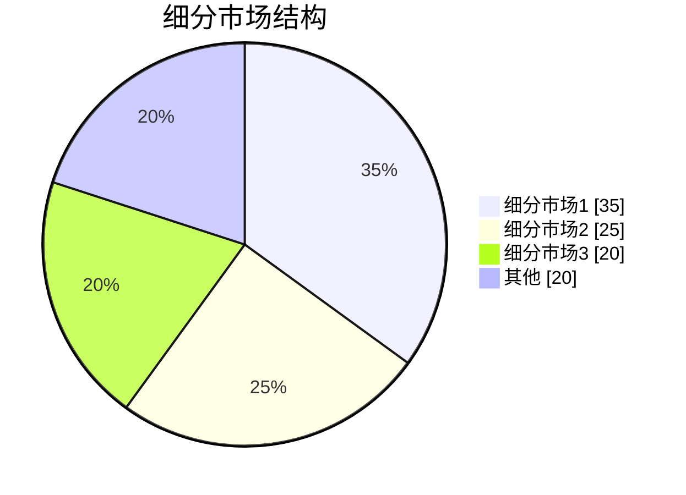
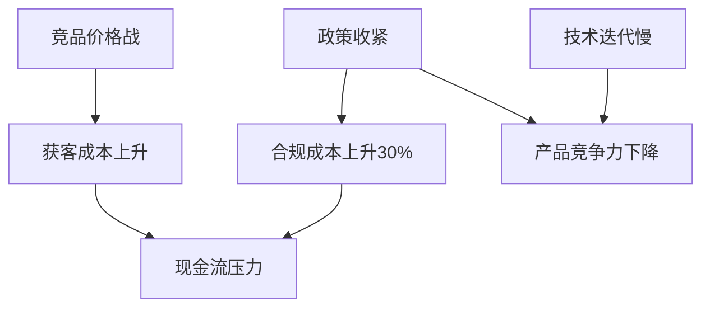

# [产品/系统名称（英文名）] - 市场调研报告（Market Research Report）

> **文档状态：** 🟡 评审中 / 🟢 已通过 / 🔴 驳回
>
> **保密级别：** 机密 / 内部公开 / 公开
>
> **版本：** vX.X
>
> **日期：** YYYY-MM-DD
>
> **撰写人：** [姓名/角色]
>
> **评审人：** [姓名/角色]
>
> **阅读对象：** [角色列表]

---

## 0. 文档导读

### 0.1 文档目的与适用范围

[说明本文档的目的、适用场景和不适用场景]

### 0.2 相关文档

| 文档类型 | 文件名 | 相关章节 |
|---------|--------|---------|
| [类型] | [文件名] [行号范围] | [章节描述] |

> **引用格式说明**：关联文档使用 `文件名 行号范围` 格式（如 `【模板】技术需求文档(TRD).md 3-17`），行号随文档更新可能变化，请以实际内容为准。

### 0.3 变更记录

| 版本 | 日期 | 修订人 | 变更内容 | 审核人 |
| :--- | :--- | :--- | :--- | :--- |
| v0.1 | YYYY-MM-DD | [姓名] | 初稿完成 | [审核人] |
| v0.2 | YYYY-MM-DD | [姓名] | 补充市场规模预测与竞争格局分析 | [审核人] |
| v0.3 | 2026-06-09 | 谢董 | 修复：quadrantChart 模板改为表格格式（飞书不兼容） | — |
| v0.3.1 | 2026-06-09 | 谢董 | 修复xychart-beta图为表格以兼容飞书渲染 | — |

---

## 1. 执行摘要（Executive Summary）

> **执行摘要**：{用3-5句话回答三个问题：① 为什么做这次市场调研？② 最核心的1-3个发现是什么？③ 建议采取什么行动？未阅读者阅读此段后应在30秒内理解报告价值。}
>
> 示例：本次调研旨在评估AI旅游规划市场的进入可行性。核心发现：市场规模预计2026年达120亿元（CAGR 35%），但用户付费意愿仅12%；头部玩家携程/同程占据60%份额，但AI原生工具在Z世代中渗透率已达28%。建议：采用"免费AI规划+交易佣金"模式切入，首年聚焦25-30岁一线城市用户，避免与OTA正面竞争。

---

## 2. 调研目标与范围

**🎯 本章目标**：明确本次调研要回答的决策问题，选择适配的研究设计，避免范围蔓延。

### 2.1 调研目的与决策场景

| 调研类型 | 本次目的 | 需回答的关键问题 | 影响决策 | 目标读者 |
|---------|---------|---------------|---------|---------|
| {市场进入/产品定位/定价策略/用户洞察/竞争策略/技术趋势/其他} | {具体描述} | {1-2个核心问题} | {是/否/投资/不投资/调整方向} | {高管/产品/销售/研发} |

> **目标导向原则**：不同调研目的对应不同的研究设计、样本策略和分析框架。详见附录12.6《调研设计裁剪指南》。

### 2.2 研究设计框架（混合方法设计）

<!-- 根据调研目标选择适配的混合研究设计 -->

**本次采用的研究设计**：{聚敛式并行设计 / 解释性序列设计 / 探索性序列设计 / 嵌入式混合设计 / 多阶段评估设计}

| 设计类型 | 定量阶段 | 定性阶段 | 集成方式 | 适用场景 | 本报告应用 |
|---------|---------|---------|---------|---------|-----------|
| **聚敛式并行** | 同时收集 | 同时收集 | 平行比较/数据转换 | 需要多角度验证同一问题 | {应用章节} |
| **解释性序列** | 先定量 | 后定性 | 定性解释定量结果 | 需要理解"为什么" | {应用章节} |
| **探索性序列** | 先定性 | 后定量 | 定性开发定量工具 | 新领域探索，工具开发 | {应用章节} |
| **嵌入式混合** | 主导方法中嵌入 | 辅助方法 | 辅助验证/深化 | 主研究需要补充证据 | {应用章节} |
| **多阶段评估** | 多轮独立研究 | 多轮独立研究 | 历时性评估 | 长期项目评估 | {应用章节} |

> **设计选择依据**：{说明为什么选择此设计，如"本领域为新市场，先通过定性访谈探索用户痛点，再设计问卷进行大规模验证"}。

### 2.3 数据来源体系与可信度评级

| 层级 | 来源类型 | 可信度 | 典型来源 | 使用规范 | 本报告应用 |
|------|---------|--------|---------|---------|-----------|
| **L1 权威** | 政府机构/国际组织 | ★★★★★ | {国家统计局/文旅部/世界银行} | 直接引用，作为基准数据 | {章节} |
| **L2 专业** | 行业协会/头部咨询 | ★★★★ | {艾瑞/易观/弗若斯特沙利文} | 交叉验证后引用 | {章节} |
| **L3 学术** | 期刊论文/预印本/学位论文 | ★★★★ | {知网/ArXiv/万方} | 标注研究样本和方法局限 | {章节} |
| **L4 媒体** | 主流财经/行业媒体 | ★★★ | {36氪/虎嗅/钛媒体} | 需追溯原始出处后引用 | {章节} |
| **L5 企业** | 财报/公告/官网 | ★★★ | {上市公司年报/官方声明} | 区分事实与前瞻性陈述 | {章节} |
| **L6 一手** | 问卷/访谈/实地观察 | ★★★★ | {自有调研数据} | 标注样本量、抽样方法、时间 | {章节} |
| **L7 其他** | 社交媒体/论坛/评论 | ★★ | {知乎/小红书/微博} | 仅作趋势感知，不作定量依据 | {章节} |

> **三角论证原则**：关键决策数据（L1级）必须≥2个独立来源交叉验证；支撑性数据（L2级）至少1个权威+1个专业来源。

### 2.4 调研执行计划与质量控制

| 阶段 | 任务 | 方法 | 时间 | 关键产出 | 质量检查点 |
|------|------|------|------|---------|-----------|
| **准备** | 确定框架、文献综述 | 桌面研究 | {X天} | 调研提纲、文献地图 | 框架评审通过 |
| **探索** | 定性探索、假设生成 | {访谈/焦点小组/田野观察} | {X天} | 用户痛点清单、初步假设 | 信息饱和度检查 |
| **验证** | 定量验证、规模测算 | {问卷/二手数据分析/建模} | {X天} | 验证后数据、趋势模型 | 信效度检验 |
| **深化** | 定性深化、机制解释 | {深度访谈/案例研究} | {X天} | 行为动机洞察、因果机制 | 理论饱和度检查 |
| **整合** | 交叉验证、报告撰写 | 混合分析 | {X天} | 报告初稿、决策建议 | 内部评审 |
| **评审** | 同行评审、修订定稿 | 专家验证 | {X天} | 终稿报告 | 评审意见闭环 |

> **质量控制机制**：
> 1. **信息饱和度**：定性访谈持续至无新主题出现（通常15-30人）
> 2. **信效度检验**：问卷数据需通过Cronbach's α（≥0.7）和因子分析验证
> 3. **反身性记录**：记录研究者在访谈中的角色影响，避免受访者迎合偏差

### 2.5 数据异常处理规则

| 异常类型 | 识别方法 | 处理规则 | 记录位置 |
|---------|---------|---------|---------|
| **来源冲突** | 多源数据偏差>20% | 取置信区间，标注为估算值；若偏差>50%则剔除 | 附录12.1 |
| **时间断层** | 数据截止日期不一致 | 统一标注数据时点，跨期数据需做时间标准化 | 附录12.1 |
| **口径差异** | 统计口径/定义不同 | 明确各来源统计口径，不做强行合并 | 附录12.1 |
| **样本偏差** | 一手数据样本结构失衡 | 加权调整或标注局限性，不夸大代表性 | 附录12.1 |

**💡 So what**：{本章发现对调研设计的启示，如"因该领域为新市场，缺乏L1级官方数据，本报告L2级行业报告和L6级一手调研数据权重提高，结论置信度相应调整"}

---

## 3. 宏观环境分析（PESTLE + 行业生命周期）

**🎯 本章目标**：评估行业所处宏观环境和生命周期阶段，判断市场进入时机。

### 3.1 PESTLE 宏观环境扫描

<!-- 根据行业特性选择维度，非全部必填 -->

| 维度 | 现状（事实） | 趋势（未来6-12个月） | 对行业影响 | 影响方向 | 信息来源 |
|------|-----------|-------------------|-----------|---------|---------|
| **P 政治** | {现状} | {趋势} | {影响} | 利好/中性/利空 | {L1-L7} |
| **E 经济** | {现状} | {趋势} | {影响} | 利好/中性/利空 | {L1-L7} |
| **S 社会** | {现状} | {趋势} | {影响} | 利好/中性/利空 | {L1-L7} |
| **T 技术** | {现状} | {趋势} | {影响} | 利好/中性/利空 | {L1-L7} |
| **L 法律** | {现状} | {趋势} | {影响} | 利好/中性/利空 | {L1-L7} |
| **E 环境** | {现状} | {趋势} | {影响} | 利好/中性/利空 | {L1-L7} |
| **D 人口** | {现状} | {趋势} | {影响} | 利好/中性/利空 | {L1-L7} |

> **DEPEST扩展**：在PESTLE基础上增加Demography（人口）和Ecology（生态），根据行业特性选择。

### 3.2 行业生命周期判断

| 判断指标 | 当前状态 | 证据 | 阶段判定 |
|---------|---------|------|---------|
| 市场增长率 | {X%} | {来源} | {导入期/成长期/成熟期/衰退期} |
| 竞争者数量 | {数量} | {来源} | — |
| 用户教育成本 | {高/中/低} | {来源} | — |
| 技术标准化程度 | {高/中/低} | {来源} | — |
| 盈利模式清晰度 | {高/中/低} | {来源} | — |

**生命周期曲线定位**：

> **说明**：xychart-beta为飞书不兼容Mermaid类型，改为表格描述（模板示例数据）。

**行业生命周期曲线（示意）**

| 阶段 | 市场规模 |
| :--- | :---: |
| 导入期 | 10 |
| 成长期 | 40 |
| 成熟期 | 80 |
| 衰退期 | 60 |

### 3.3 产业链结构分析

| 环节 | 代表企业/机构 | 价值占比 | 议价能力 | 技术壁垒 | 集中度 |
|------|-------------|---------|---------|---------|--------|
| 上游-{环节1} | {企业} | {X%} | {高/中/低} | {高/中/低} | {CR3} |
| 中游-{环节1} | {企业} | {X%} | {高/中/低} | {高/中/低} | {CR3} |
| 下游-{环节1} | {企业} | {X%} | {高/中/低} | {高/中/低} | {CR3} |

> **分析要点**：识别产业链中的"卡脖子"环节和高利润环节，判断我方切入位置。

**💡 So what**：{宏观环境洞察，如"行业处于成长期早期，技术标准化程度低但政策利好（L1级数据），适合以技术差异化切入；上游地图API供应商集中度高（CR3>80%），需建立多供应商策略降低依赖风险"}

---

## 4. 市场规模与趋势

**🎯 本章目标**：量化市场当前规模和增长潜力，建立预测模型并标注不确定性。

### 4.1 整体市场规模

| 指标 | 数据 | 同比变化 | 数据来源 | 可信度 | 数据时点 |
|------|------|---------|---------|--------|---------|
| {当前年份}年市场规模 | {金额/数量} | {±X%} | {来源} | {L1-L7} | {日期} |
| {当前年份}年增长率 | {X%} | — | {来源} | {L1-L7} | {日期} |
| 全球/全国占比 | {X%} | — | {来源} | {L1-L7} | {日期} |
| 人均消费/渗透率 | {数据} | {±X%} | {来源} | {L1-L7} | {日期} |

**核心判断**：{一句话概括市场所处阶段和核心特征}

### 4.2 历史数据与增长趋势

| 年份 | 规模{单位} | 同比增速 | 关键事件/驱动因素 | 数据来源 |
|------|-----------|---------|------------------|---------|
| {Y-3} | {数据} | — | {事件} | {来源} |
| {Y-2} | {数据} | {±X%} | {事件} | {来源} |
| {Y-1} | {数据} | {±X%} | {事件} | {来源} |
| {Y} | {数据} | {±X%} | {事件} | {来源} |

> **说明**：xychart-beta为飞书不兼容Mermaid类型，改为表格描述（模板示例数据）。

**市场规模趋势**

| 年份 | 单位：亿元 |
| :--- | :---: |
| 2022 | 30 |
| 2023 | 45 |
| 2024 | 65 |
| 2025 | 85 |

**交叉验证记录**：{关键数据点}，{来源A}与{来源B}数据一致/偏差{X%}；{另一数据点}由{来源C}引述{权威机构}，与{来源D}互相印证。详见附录12.1。

### 4.3 细分市场结构

| 细分领域 | 市场规模{单位} | 占比 | 增速 | 驱动因素 | 数据来源 |
|---------|--------------|------|------|---------|---------|
| {细分1} | {数据} | {X%} | {X%} | {因素} | {来源} |
| {细分2} | {数据} | {X%} | {X%} | {因素} | {来源} |
| {细分3} | {数据} | {X%} | {X%} | {因素} | {来源} |

### 4.4 区域/地域分布

| 区域 | 规模{单位} | 占比 | 增速 | 渗透率 | 特征 | 数据来源 |
|------|-----------|------|------|--------|------|---------|
| {区域1} | {数据} | {X%} | {X%} | {X%} | {特征} | {来源} |
| {区域2} | {数据} | {X%} | {X%} | {X%} | {特征} | {来源} |

### 4.5 规模预测模型（三情景）

**预测方法论**：{明确说明使用的预测方法，如"基于CAGR外推法+德尔菲专家法修正"或"回归模型（R²=0.92）+情景分析"}

**预测假设**：
- **保守情景**：{假设条件，如"宏观经济增速放缓至4%，行业监管趋严"}
- **基准情景**：{假设条件，如"宏观经济增速维持5%，行业政策中性"}
- **乐观情景**：{假设条件，如"AI技术突破带来效率提升，政策大力扶持"}

| 年份 | 保守预测{单位} | 基准预测{单位} | 乐观预测{单位} | CAGR（基准） | 关键假设变化 |
|------|---------------|---------------|---------------|-------------|-------------|
| {Y+1} | {数据} | {数据} | {数据} | — | {变化} |
| {Y+3} | {数据} | {数据} | {数据} | {X%} | {变化} |
| {Y+5} | {数据} | {数据} | {数据} | {X%} | {变化} |

> **说明**：xychart-beta为飞书不兼容Mermaid类型，改为表格描述（模板示例数据）。

**市场规模预测**

| 年份 | 单位：亿元（基准预测） |
| :--- | :---: |
| 2025 | 85 |
| 2026 | 95 |
| 2027 | 105 |
| 2028 | 115 |
| 2029 | 125 |
| 2030 | 135 |

### 4.6 敏感性分析

| 假设变量 | 基准值 | 变动范围 | 对{Y+3}规模影响 | 敏感度 |
|---------|--------|---------|----------------|--------|
| {变量1，如：GDP增速} | {X%} | {±X%} | {±Y亿元} | 高/中/低 |
| {变量2，如：用户付费率} | {X%} | {±X%} | {±Y亿元} | 高/中/低 |
| {变量3，如：获客成本} | {¥X} | {±X%} | {±Y亿元} | 高/中/低 |

**💡 So what**：{市场规模洞察，如"基准情景下2028年市场规模达80亿元（CAGR 30%），但敏感性分析显示用户付费率是关键变量（敏感度：高），若付费率低于8%则市场规模可能缩水40%。建议首年聚焦免费模式建立用户基础，第二年再探索付费转化"}

---

## 5. 用户需求深度洞察

**🎯 本章目标**：超越表层画像，理解用户行为动机、决策逻辑和未满足需求。

### 5.1 目标用户细分（基于行为而非人口统计）

<!-- 现代用户研究强调行为细分优于人口统计细分 -->

| 用户 segment | 核心行为特征 | 占比 | 使用频次 | 付费意愿 | 关键痛点 | 决策路径 |
|-------------|-------------|------|---------|---------|---------|---------|
| {Segment A：如"规划型用户"} | {行为} | {X%} | {频次} | {高/中/低} | {痛点} | {路径} |
| {Segment B：如"冲动型用户"} | {行为} | {X%} | {频次} | {高/中/低} | {痛点} | {路径} |
| {Segment C：如"价格敏感型"} | {行为} | {X%} | {频次} | {高/中/低} | {痛点} | {路径} |

> **细分方法**：基于使用场景、行为频率、付费意愿等行为变量细分，而非仅按年龄/性别。

### 5.2 JTBD（Jobs-to-be-Done）分析

<!-- 用户不是为了买产品，而是为了完成"工作" -->

| 用户 Segment | 核心Job（要完成的工作） | 当前解决方案 | 痛点/摩擦 | 理想结果 | 我方机会 |
|-------------|----------------------|------------|----------|---------|---------|
| {Segment A} | {如"规划一次不踩雷的家庭旅行"} | {如"小红书+Excel"} | {如"信息分散、耗时3天"} | {如"30分钟生成靠谱行程"} | {大/中/小} |
| {Segment B} | {Job} | {解决方案} | {痛点} | {理想结果} | {机会} |

> **JTBD原则**：用户不是为了"买旅游APP"，而是为了"完成旅行规划这项工作"。理解Job才能发现真正的替代品和机会。

### 5.3 用户旅程与触点分析

| 阶段 | 用户行为 | 关键触点 | 情绪曲线 | 痛点 | 机会点 | 数据来源 |
|------|---------|--------|---------|------|--------|---------|
| 认知 | {行为} | {触点} | {高/中/低} | {痛点} | {机会} | {L6访谈/问卷} |
| 考虑 | {行为} | {触点} | {高/中/低} | {痛点} | {机会} | {L6访谈/问卷} |
| 决策 | {行为} | {触点} | {高/中/低} | {痛点} | {机会} | {L6访谈/问卷} |
| 使用 | {行为} | {触点} | {高/中/低} | {痛点} | {机会} | {L6访谈/问卷} |
| 推荐/复购 | {行为} | {触点} | {高/中/低} | {痛点} | {机会} | {L6访谈/问卷} |

### 5.4 需求分层（Kano模型）

| 需求 | Kano类型 | 用户提及频次 | 竞品满足度 | 我方满足度 | 优先级 | 实现难度 |
|------|---------|------------|-----------|-----------|--------|---------|
| {需求1：如"基础地图功能"} | {基本型} | {X%} | {高} | {高} | {P1} | {低} |
| {需求2：如"AI智能规划"} | {期望型} | {X%} | {中} | {中} | {P0} | {中} |
| {需求3：如"离线地图"} | {兴奋型} | {X%} | {低} | {无} | {P0} | {中} |
| {需求4：如"AR导航"} | {兴奋型} | {X%} | {无} | {无} | {P2} | {高} |

> **说明**：此象限图模板已转为表格描述。

<!--
原 quadrantChart 结构参考：
- title: 需求优先级矩阵
- x-axis: 低价值 --> 高价值
- y-axis: 高难度 --> 低难度
- quadrant-1: 战略投入
- quadrant-2: Quick Wins
- quadrant-3: Fill-ins
- quadrant-4: 避免
- 数据点: "需求1": [0.7, 0.8]; "需求2": [0.3, 0.2]; "需求3": [0.5, 0.6]
-->

| 象限 | 区域特征 | 策略建议 |
| :--- | :--- | :--- |
| 象限1（高价值·低难度） | 战略投入 | 优先投入资源，快速落地 |
| 象限2（高价值·高难度） | Quick Wins | 快速验证，争取早期成果 |
| 象限3（低价值·高难度） | Fill-ins | 填补为主，避免过度投入 |
| 象限4（低价值·低难度） | 避免 | 暂不投入，观察变化 |

| 名称 | X值 | Y值 | 象限 |
| :--- | :---: | :---: | :--- |
| 需求1 | 0.7 | 0.8 | 象限1（战略投入） |
| 需求2 | 0.3 | 0.2 | 象限4（避免） |
| 需求3 | 0.5 | 0.6 | 象限1（战略投入） |

### 5.5 消费行为数据

| 行为指标 | 数据 | 同比变化 | 用户Segment差异 | 数据来源 |
|---------|------|---------|----------------|---------|
| {指标1，如：人均消费额} | {数据} | {±X%} | {A:¥X, B:¥Y} | {来源} |
| {指标2，如：决策周期} | {数据} | {±X%} | {A:X天, B:Y天} | {来源} |
| {指标3，如：复购率} | {数据} | {±X%} | {A:X%, B:Y%} | {来源} |
| {指标4，如：推荐意愿NPS} | {数据} | {±X%} | {A:X, B:Y} | {来源} |

### 5.6 痛点与未满足需求（分层评论法）

<!-- 若有一手用户反馈数据，采用分层分析法 -->

| 痛点层级 | 具体描述 | 受影响Segment | 频次/强度 | 现有解决方案缺口 | 我方产品机会 | 证据来源 |
|---------|---------|--------------|----------|----------------|-------------|---------|
| **Deal-breaker**（放弃原因） | {如"AI规划路线不合理，导致旅行体验差"} | {Segment} | {X%} | {缺口} | {大/中/小} | {L6访谈/L7评论} |
| **Frustration**（使用摩擦） | {如"每次重新规划都要重新输入偏好"} | {Segment} | {X%} | {缺口} | {大/中/小} | {L6/L7} |
| **Unmet Need**（潜在需求） | {如"希望看到朋友/达人的真实行程"} | {Segment} | {X%} | {缺口} | {大/中/小} | {L6/L7} |

> **分层原则**：Deal-breaker导致用户流失，必须解决；Frustration影响体验，优先优化；Unmet Need是差异化机会。

**💡 So what**：{用户洞察结论，如"JTBD分析显示用户核心Job是'不踩雷'而非'规划'，当前替代品是小红书+Excel组合，说明我方应强化UGC真实评价+AI规划的组合；Kano模型显示'离线地图'为兴奋型需求且实现难度中等，建议作为差异化亮点优先上线"}

---

## 6. 竞争格局深度分析

**🎯 本章目标**：量化竞争强度，识别战略群组，评估进入壁垒。

### 6.1 市场集中度与竞争强度

| 指标 | 数据 | 说明 | 来源 |
|------|------|------|------|
| CR3 | {X%} | {集中/分散} | {来源} |
| CR5 | {X%} | — | {来源} |
| HHI指数 | {数值} | {>2500高集中/1500-2500中等/<1500分散} | {计算} |
| 市场参与者总数 | {数量} | — | {来源} |
| 近12个月新进入者 | {数量} | — | {来源} |
| 近12个月退出者 | {数量} | — | {来源} |

**竞争格局判断**：{根据CR3/HHI判断属于完全竞争/寡头垄断/垄断竞争/完全垄断，并说明对进入者的影响}

### 6.2 战略群组分析

<!-- 将竞争者按战略相似性分组，而非简单排名 -->

| 战略群组 | 代表企业 | 核心战略 | 目标用户 | 关键资源 | 优势 | 劣势 | 威胁等级 |
|---------|---------|---------|---------|---------|------|------|---------|
| {群组A：如"OTA平台"} | {携程/同程} | {交易佣金} | {大众市场} | {供应链/流量} | {规模} | {创新慢} | {高} |
| {群组B：如"AI原生工具"} | {竞品A/竞品B} | {订阅制} | {年轻用户} | {AI技术} | {创新快} | {资金少} | {中} |
| {群组C：如"攻略社区"} | {小红书/马蜂窝} | {广告+交易} | {内容消费者} | {UGC内容} | {内容丰富} | {工具弱} | {中} |

> **战略群组意义**：同一群组内竞争最激烈，不同群组间可能存在合作或替代关系。

### 6.3 主要竞争者画像

| 企业/品牌 | 市场份额 | 核心优势 | 主要产品/服务 | 竞争策略 | 近期动态 | 来源 |
|----------|---------|---------|-------------|---------|---------|------|
| {企业1} | {X%} | {优势} | {产品} | {策略} | {动态} | {来源} |
| {企业2} | {X%} | {优势} | {产品} | {策略} | {动态} | {来源} |

### 6.4 波特五力模型

| 竞争力量 | 强度 | 关键观察 | 趋势（6个月） | 对我方影响 |
|---------|------|---------|-------------|-----------|
| 现有竞争者 rivalry | {高/中/低} | {观察} | {增强/减弱/持平} | {影响} |
| 潜在进入者威胁 | {高/中/低} | {观察} | {趋势} | {影响} |
| 替代品威胁 | {高/中/低} | {观察} | {趋势} | {影响} |
| 供应商议价能力 | {高/中/低} | {观察} | {趋势} | {影响} |
| 买方议价能力 | {高/中/低} | {观察} | {趋势} | {影响} |

### 6.5 竞争态势矩阵

> **说明**：此象限图模板已转为表格描述。

<!--
原 quadrantChart 结构参考：
- title: 竞争态势矩阵
- x-axis: 低影响力 --> 高影响力
- y-axis: 低增长 --> 高增长
- quadrant-1: 领导者
- quadrant-2: 挑战者
- quadrant-3: 跟随者
- quadrant-4: 利基者
- 数据点: "企业1": [0.8, 0.7]; "企业2": [0.4, 0.8]; "我方": [0.3, 0.5]
-->

| 象限 | 区域特征 | 策略建议 |
| :--- | :--- | :--- |
| 象限1（高影响力·高增长） | 领导者 | 巩固地位，持续创新 |
| 象限2（低影响力·高增长） | 挑战者 | 找准突破口，差异化竞争 |
| 象限3（低影响力·低增长） | 跟随者 | 跟随为主，控制成本 |
| 象限4（高影响力·低增长） | 利基者 | 深挖垂直领域，聚焦利润 |

| 名称 | X值 | Y值 | 象限 |
| :--- | :---: | :---: | :--- |
| 企业1 | 0.8 | 0.7 | 象限1（领导者） |
| 企业2 | 0.4 | 0.8 | 象限2（挑战者） |
| 我方 | 0.3 | 0.5 | 象限2（挑战者） |

### 6.6 竞争响应模拟（新增）

<!-- 预测我方进入后竞品的可能反应 -->

| 我方动作 | 最可能反应的竞品 | 预测反应 | 反应强度 | 我方应对预案 |
|---------|----------------|---------|---------|------------|
| {动作1：如"上线免费AI规划"} | {竞品A} | {如"1个月内上线类似功能"} | {高/中/低} | {预案} |
| {动作2：如"定价¥19/月"} | {竞品B} | {如"降价至¥15或推出免费版"} | {高/中/低} | {预案} |

> **博弈论视角**：基于竞品历史行为模式（如"竞品A历史上对价格战反应迅速"）推断其最可能反应。

**💡 So what**：{竞争格局洞察，如"市场为垄断竞争（HHI=1800），CR3=60%但用户切换成本低；战略群组分析显示OTA群组（携程/同程）与AI原生工具群组目标用户重叠度低，我方应避开OTA核心用户群，专注25-30岁AI原生用户；竞争响应模拟显示若我方定价低于¥20，竞品B可能跟进价格战，建议采用'免费+增值'模式避免直接价格竞争"}

---

## 7. 政策与合规环境

**🎯 本章目标**：识别政策约束和机会，评估合规成本。

### 7.1 现行政策梳理

| 政策/法规 | 发布机构 | 发布时间 | 核心内容 | 合规要求 | 对行业影响 | 来源 |
|----------|---------|---------|---------|---------|-----------|------|
| {政策1} | {机构} | {日期} | {内容} | {要求} | {影响} | {L1} |
| {政策2} | {机构} | {日期} | {内容} | {要求} | {影响} | {L1} |

### 7.2 政策趋势与预期

| 趋势方向 | 预期时间线 | 影响范围 | 影响程度 | 我方应对 |
|---------|-----------|---------|---------|---------|
| {方向1} | {时间} | {范围} | {高/中/低} | {应对} |
| {方向2} | {时间} | {范围} | {高/中/低} | {应对} |

### 7.3 国际对比（如适用）

| 国家/地区 | 政策举措 | 实施效果 | 对中国启示 | 来源 |
|----------|---------|---------|-----------|------|
| {国家1} | {举措} | {效果} | {启示} | {来源} |
| {国家2} | {举措} | {效果} | {启示} | {来源} |

### 7.4 合规成本评估

| 合规维度 | 当前成本 | 预期变化 | 成本占比 | 来源 |
|---------|---------|---------|---------|------|
| {如：数据合规} | {¥X/年} | {±X%} | {X%} | {来源} |
| {如：内容审核} | {¥X/年} | {±X%} | {X%} | {来源} |

**💡 So what**：{政策洞察，如"《生成式AI服务管理暂行办法》要求AI生成内容需标识，预计增加5-8%合规成本；但政策同时明确支持AI+旅游融合应用，利好长期发展。建议预留¥X万/年合规预算，优先申请相关资质"}

---

## 8. 发展趋势与技术驱动

**🎯 本章目标**：识别中短期趋势和技术变量，评估对我方产品的影响。

### 8.1 短期趋势（1-2年）

| 趋势 | 驱动因素 | 影响程度 | 数据支撑 | 我方机会/威胁 | 来源 |
|------|---------|---------|---------|-------------|------|
| {趋势1} | {因素} | {高/中/低} | {数据} | {机会/威胁} | {来源} |
| {趋势2} | {因素} | {高/中/低} | {数据} | {机会/威胁} | {来源} |

### 8.2 中期趋势（3-5年）

| 趋势 | 驱动因素 | 预测依据 | 置信度 | 我方准备 | 来源 |
|------|---------|---------|--------|---------|------|
| {趋势1} | {因素} | {依据} | {高/中/低} | {准备} | {来源} |
| {趋势2} | {因素} | {依据} | {高/中/低} | {准备} | {来源} |

### 8.3 技术成熟度曲线（Hype Cycle）

<!-- 评估关键技术的成熟度和采用时间 -->

| 技术 | 当前阶段 | 达到成熟期时间 | 对我方影响 | 投入建议 |
|------|---------|--------------|-----------|---------|
| {如：大模型行程规划} | {期望膨胀期} | {2-3年} | {高} | {试点投入} |
| {如：AR实景导航} | {萌芽期} | {5-10年} | {中} | {跟踪观察} |
| {如：多模态AI} | {快速上升期} | {1-2年} | {高} | {重点投入} |

> **说明**：xychart-beta为飞书不兼容Mermaid类型，改为表格描述（模板示例数据）。

**技术成熟度曲线（示意）**

| 阶段 | 技术关注度 |
| :--- | :---: |
| 萌芽期 | 10 |
| 期望膨胀期 | 90 |
| 泡沫破裂期 | 20 |
| 稳步上升期 | 50 |
| 成熟期 | 80 |

**💡 So what**：{趋势洞察，如"大模型行程规划处于期望膨胀期，2年内将经历洗牌，当前是建立技术壁垒的窗口期；AR导航尚处萌芽期，不建议过早投入"}

---

## 9. 市场机会评估

**🎯 本章目标**：基于前述分析，识别并量化可切入的市场机会。

### 9.1 机会清单

| 机会领域 | 目标Segment | 产品/服务方向 | TAM{单位} | SAM{单位} | SOM{单位} | 进入门槛 | 窗口期 | 来源 |
|---------|------------|--------------|----------|----------|----------|---------|--------|------|
| {领域1} | {Segment} | {方向} | {数据} | {数据} | {数据} | {高/中/低} | {X个月} | {来源} |
| {领域2} | {Segment} | {方向} | {数据} | {数据} | {数据} | {高/中/低} | {X个月} | {来源} |

> **TAM/SAM/SOM**：Total Addressable Market / Serviceable Addressable Market / Serviceable Obtainable Market。

### 9.2 机会优先级矩阵

> **说明**：此象限图模板已转为表格描述。

<!--
原 quadrantChart 结构参考：
- title: "机会优先级矩阵"
- x-axis: 低吸引力 --> 高吸引力
- y-axis: 低竞争力 --> 高竞争力
- quadrant-1: 明星机会
- quadrant-2: 问题机会
- quadrant-3: 鸡肋机会
- quadrant-4: 金牛机会
- 数据点: "机会1": [0.8, 0.7]; "机会2": [0.4, 0.3]; "机会3": [0.6, 0.5]
-->

| 象限 | 区域特征 | 策略建议 |
| :--- | :--- | :--- |
| 象限1（高吸引力·高竞争力） | 明星机会 | 优先投入，抢占先机 |
| 象限2（低吸引力·高竞争力） | 问题机会 | 评估转化可能，选择性投入 |
| 象限3（低吸引力·低竞争力） | 鸡肋机会 | 放弃或低资源维持 |
| 象限4（高吸引力·低竞争力） | 金牛机会 | 快速变现，补充现金流 |

| 名称 | X值 | Y值 | 象限 |
| :--- | :---: | :---: | :--- |
| 机会1 | 0.8 | 0.7 | 象限1（明星机会） |
| 机会2 | 0.4 | 0.3 | 象限3（鸡肋机会） |
| 机会3 | 0.6 | 0.5 | 象限1（明星机会） |

### 9.3 典型案例研究

**案例一：{企业/项目名称}**

| 维度 | 内容 |
|------|------|
| 背景 | {描述} |
| 策略 | {描述} |
| 结果 | {关键数据} |
| 关键成功因素 | {因素} |
| 可复制性 | {高/中/低} |
| 对我方启示 | {启示} |
| 来源 | {来源} |

**案例二：{企业/项目名称}**

| 维度 | 内容 |
|------|------|
| 背景 | {描述} |
| 策略 | {描述} |
| 结果 | {关键数据} |
| 关键成功因素 | {因素} |
| 可复制性 | {高/中/低} |
| 对我方启示 | {启示} |
| 来源 | {来源} |

**💡 So what**：{机会评估结论，如"机会1（AI规划+交易佣金）位于金牛象限，市场吸引力高且我方技术竞争力强，建议作为首年主攻方向；机会2（企业级SaaS）虽然TAM大但进入门槛高，建议第二年再评估"}

---

## 10. 风险分析与压力测试

**🎯 本章目标**：识别关键风险，评估发生概率和影响，制定应对预案。

### 10.1 风险清单与评估

| 风险类别 | 具体描述 | 发生概率 | 影响程度 | 风险等级 | 预警信号 | 应对策略 | 责任人 |
|---------|---------|---------|---------|---------|---------|---------|--------|
| {政策风险} | {描述} | {高/中/低} | {高/中/低} | **{等级}** | {信号} | {策略} | {姓名} |
| {市场风险} | {描述} | {高/中/低} | {高/中/低} | **{等级}** | {信号} | {策略} | {姓名} |
| {技术风险} | {描述} | {高/中/低} | {高/中/低} | **{等级}** | {信号} | {策略} | {姓名} |
| {竞争风险} | {描述} | {高/中/低} | {高/中/低} | **{等级}** | {信号} | {策略} | {姓名} |
| {运营风险} | {描述} | {高/中/低} | {高/中/低} | **{等级}** | {信号} | {策略} | {姓名} |

> **风险等级** = 发生概率 × 影响程度：高（必须制定预案）、中（需监控）、低（记录跟踪）

### 10.2 风险关联与传导分析

### 10.3 压力测试情景

| 压力情景 | 触发条件 | 对核心指标影响 | 我方承受阈值 | 触发动作 |
|---------|---------|--------------|------------|---------|
| {情景1：如"竞品免费策略"} | {条件} | {用户增长-50%} | {可承受3个月} | {启动补贴预案} |
| {情景2：如"监管叫停AI生成"} | {条件} | {收入归零} | {不可承受} | {立即切换人工模式} |

### 10.4 黑天鹅事件预警

| 事件 | 触发条件 | 潜在影响 | 预警信号 | 我方准备度 |
|------|---------|---------|---------|-----------|
| {事件1} | {条件} | {影响} | {信号} | {高/中/低} |
| {事件2} | {条件} | {影响} | {信号} | {高/中/低} |

**💡 So what**：{风险洞察，如"最大风险为竞品价格战（概率：中，影响：高），我方承受阈值为3个月，建议预留6个月运营资金；技术迭代慢是次要风险，可通过开源模型+自研微调降低依赖"}

---

## 11. 结论与行动建议

**🎯 本章目标**：整合全部分析，形成可执行的战略决策。

### 11.1 核心结论（编号列表，面向未阅读者）

1. **{结论1}**：{概括性描述，附关键数据}。{引用章节}
2. **{结论2}**：{概括性描述，附关键数据}。{引用章节}
3. **{结论3}**：{概括性描述，附关键数据}。{引用章节}

### 11.2 战略建议与优先级

| 优先级 | 建议 | 预期效果 | 实施周期 | 资源投入 | 关键假设 | 风险 |
|--------|------|---------|---------|---------|---------|------|
| **P0** | {建议1} | {效果} | {周期} | {投入} | {假设} | {风险} |
| **P0** | {建议2} | {效果} | {周期} | {投入} | {假设} | {风险} |
| **P1** | {建议3} | {效果} | {周期} | {投入} | {假设} | {风险} |
| **P2** | {建议4} | {效果} | {周期} | {投入} | {假设} | {风险} |

### 11.3 决策承诺

> **基于本报告，团队决定在 {YYYY-MM-DD} 前完成以下事项：**
> 1. {决策1，如"确定首年主攻Segment A，产品MVP聚焦AI规划+UGC评价"}
> 2. {决策2，如"启动¥X万预算的6个月市场验证项目，目标获取1万种子用户"}
> 3. {决策3，如"建立竞品监控机制，每月更新竞争格局"}
>
> **如果以上决策未执行，下次市场调研将回顾原因并重新评估假设。**

### 11.4 报告局限性声明

- **数据局限**：{描述数据覆盖范围、时间边界的局限}
- **方法局限**：{描述分析方法本身的局限，如"定性访谈样本集中于一线城市，二三线城市用户行为可能存在差异"}
- **预测局限**：{描述预测的不确定性来源，如"基准情景假设AI技术按当前速度发展，若出现技术突破则预测可能失效"}

### 11.5 后续研究方向

- {方向1}：{说明为何需要进一步研究，如"二三线城市用户旅行规划行为需专项调研"}
- {方向2}：{说明为何需要进一步研究，如"付费转化漏斗各环节流失原因需定量验证"}

---

## 12. 附录（Appendix）

### 12.1 数据交叉验证记录

<!-- 所有L1级和L2级数据的验证过程必须记录在此 -->

| 数据点 | 主要来源 | 验证来源 | 验证结果 | 偏差处理 | 备注 |
|--------|---------|---------|---------|---------|------|
| {数据点1} | {来源A} | {来源B} | 一致/偏差{X%} | {处理} | {说明} |
| {数据点2} | {来源A} | {来源B} | 一致/偏差{X%} | {处理} | {说明} |

### 12.2 术语表

| 术语 | 定义 | 首次出现章节 |
|------|------|------------|
| TAM/SAM/SOM | Total/Serviceable Addressable/Obtainable Market | 第9章 |
| JTBD | Jobs-to-be-Done，用户要完成的工作 | 第5章 |
| HHI | Herfindahl-Hirschman Index，市场集中度指数 | 第6章 |
| CAGR | Compound Annual Growth Rate，复合年增长率 | 第4章 |
| {术语1} | {定义} | {章节} |

### 12.3 研究方法详细说明

#### 12.3.1 定量研究

- **样本设计**：{目标样本量、抽样方法（随机/分层/便利）、样本结构}
- **数据收集**：{问卷平台、投放渠道、收集时间}
- **分析方法**：{描述统计、交叉分析、回归分析等}
- **信效度**：{Cronbach's α值、因子分析结果、KMO值}

#### 12.3.2 定性研究

- **访谈设计**：{半结构化/结构化/非结构化、访谈提纲核心问题}
- **样本选择**：{目的抽样/理论抽样、样本量、选择标准}
- **分析方法**：{主题分析/扎根理论/内容分析、编码策略、软件工具}
- **反身性记录**：{研究者角色、潜在偏见、对数据的影响}

#### 12.3.3 混合方法集成

- **集成策略**：{聚敛/解释/探索/嵌入/多阶段}
- **集成节点**：{在哪个阶段进行数据集成和结果比较}
- **元推理**：{定量与定性结果的综合结论}

### 12.4 访谈记录摘要（如适用）

| 编号 | 受访者角色 | 日期 | 核心观点 | 用于章节 | 关键引语 |
|------|-----------|------|---------|---------|---------|
| I-01 | {角色} | {日期} | {观点} | {章节} | {引语} |
| I-02 | {角色} | {日期} | {观点} | {章节} | {引语} |

### 12.5 持续情报更新计划

> 市场调研不是一次性文档，而是持续情报循环（Continuous Intelligence）的一部分。

| 模块 | 监控指标 | 频率 | 责任人 | 下次更新 | 信息源 |
|------|---------|------|--------|---------|--------|
| 市场规模 | {规模/增速} | {每季度} | {姓名} | {日期} | {L1/L2来源} |
| 竞争格局 | {CR3/新进入者} | {每月} | {姓名} | {日期} | {L2/L5来源} |
| 用户反馈 | {NPS/痛点变化} | {每月} | {姓名} | {日期} | {L6/L7来源} |
| 政策动态 | {新法规/征求意见稿} | {每周} | {姓名} | {日期} | {L1来源} |
| 技术趋势 | {新技术/专利} | {每季度} | {姓名} | {日期} | {L3/L4来源} |

**触发立即更新的事件**：
- 市场规模增速偏离预测>20%
- 头部竞品发布重大战略调整
- 关键政策出台或征求意见稿发布
- 技术突破（如大模型能力跃升）
- 黑天鹅事件发生

### 12.6 调研设计裁剪指南

| 调研类型 | 必留章节 | 可选章节 | 可删除/简化 | 建议时长 | 核心产出 |
|---------|---------|---------|-----------|---------|---------|
| **市场进入决策** | 摘要、1、2、3、5、8、9、10 | 4、6、7 | — | ≤5天 | 进入策略/不进入 |
| **产品定位** | 摘要、1、4、5、8、10 | 2、3、6、7 | 9（简化） | ≤3天 | 定位方案 |
| **定价策略** | 摘要、1、3（3.5+3.6）、4（4.5）、8、10 | 2、5、6 | 7 | ≤2天 | 定价方案 |
| **用户洞察** | 摘要、1、4、5（5.1+5.2）、10 | 2、3 | 6、7、8、9 | ≤3天 | 用户画像/需求清单 |
| **竞争策略** | 摘要、1、5、8、9、10 | 2、3、4 | 6、7 | ≤3天 | 竞争策略 |
| **技术趋势** | 摘要、1、2、7、8、10 | 3、4 | 5、6、9 | ≤2天 | 技术路线图 |
| **全面调研** | 全部章节 | — | — | ≤10天 | 完整战略报告 |

### 12.7 质量检查清单（发布前自检）

- [ ] 执行摘要能让未阅读者在30秒内理解核心结论
- [ ] 每章末尾都有"So what"回答"这对我方意味着什么"
- [ ] 研究设计明确选择了混合方法类型并说明了理由
- [ ] 数据来源按L1-L7分级，关键数据有交叉验证记录
- [ ] 市场规模预测明确标注了方法论、假设和三情景
- [ ] 用户细分基于行为而非仅人口统计
- [ ] JTBD分析识别了真正的替代品（非仅直接竞品）
- [ ] Kano模型区分了基本型/期望型/兴奋型需求
- [ ] 竞争分析包含战略群组和竞争响应模拟
- [ ] 风险清单包含预警信号和责任人
- [ ] 压力测试定义了触发条件和承受阈值
- [ ] 报告结尾有"决策承诺"，明确要做什么不同
- [ ] 已建立持续情报更新计划，含触发事件
- [ ] 局限性声明诚实披露了数据和方法的不足
- [ ] 所有主观判断（如"市场很大"）都有数据支撑或明确标注为假设

---

> **文档审批签核**
>
> | 角色         | 签字 | 日期 | 意见 |
> | :----------- | :--- | :--- | :--- |
> | 产品负责人   |      |      |      |
> | 技术负责人   |      |      |      |
> | 运营负责人   |      |      |      |
> | 财务负责人   |      |      |      |
> | CEO / 决策人 |      |      |      |
