# [产品/系统名称（英文名）] - 项目任务书（Charter）

> **文档状态：** 🟡 评审中 / 🟢 已通过 / 🔴 驳回
>
> **保密级别：** 机密 / 内部公开 / 公开
>
> **版本：** vX.X
>
> **日期：** YYYY-MM-DD
>
> **撰写人：** [姓名/角色]
>
> **评审人：** [姓名/角色]
>
> **阅读对象：** [角色列表]
>
> **项目编号：** PROJ-2026-XXX
>
> **签发人：** [IPMT主席 / CEO / 决策委员会负责人]
>
> **关联文档：** [BRD编号] / [MRD编号] / [战略指令编号]

---

## 0. 文档导读

### 0.1 文档目的与适用范围

[说明本文档的目的、适用场景和不适用场景]

### 0.2 相关文档

| 文档类型 | 文件名 | 相关章节 |
|---------|--------|---------|
| [类型] | [文件名] [行号范围] | [章节描述] |

> **引用格式说明**：关联文档使用 `文件名 行号范围` 格式（如 `【模板】技术需求文档(TRD).md 3-17`），行号随文档更新可能变化，请以实际内容为准。

### 0.3 变更记录

| 版本 | 日期 | 修订人 | 变更内容 | 审核人 |
| :--- | :--- | :--- | :--- | :--- |
| v0.1 | YYYY-MM-DD | [姓名] | 初稿完成 | [审核人] |
| v0.2 | YYYY-MM-DD | [姓名] | 补充财务模型与风险对策 | [审核人] |
| v0.3 | YYYY-MM-DD | [姓名] | IPMT评审通过，正式发布 | [IPMT主席] |
| v0.4 | 2026-06-09 | 谢董 | 修复：quadrantChart 模板改为表格格式（飞书不兼容） | — |
| v0.4.1 | 2026-06-09 | 谢董 | 修复xychart-beta图为表格以兼容飞书渲染 | — |
| v0.4.2 | 2026-06-09 | 谢董 | 修复gantt图为表格以兼容飞书渲染 | — |

---

## 1. 执行摘要（Executive Summary）

> **决策层导读：** 本页为 Charter 精华，回答"值不值得做、怎么做、谁来做、何时交付"。

| 要素           | 内容                                                            |
| :------------- | :-------------------------------------------------------------- |
| **项目一句话** | [用一句话描述产品/项目定位，如："面向中小企业的AI智能客服平台"] |
| **立项依据**   | [对齐公司战略 / 市场机会 / 技术演进，带关键数据]                |
| **核心目标**   | [商业目标 + 产品目标 + 能力目标，量化]                          |
| **关键里程碑** | 概念评审 [日期] → 计划评审 [日期] → 发布上市 [日期]             |
| **资源总览**   | 核心团队 [N] 人，总预算 ¥[X]万，周期 [Y] 个月                   |
| **财务预测**   | 3 年 ROI [X]%，盈亏平衡周期 [N] 个月                            |
| **决策建议**   | 🟢 批准立项，立即启动 / 🟡 补充调研后启动 / 🔴 驳回             |

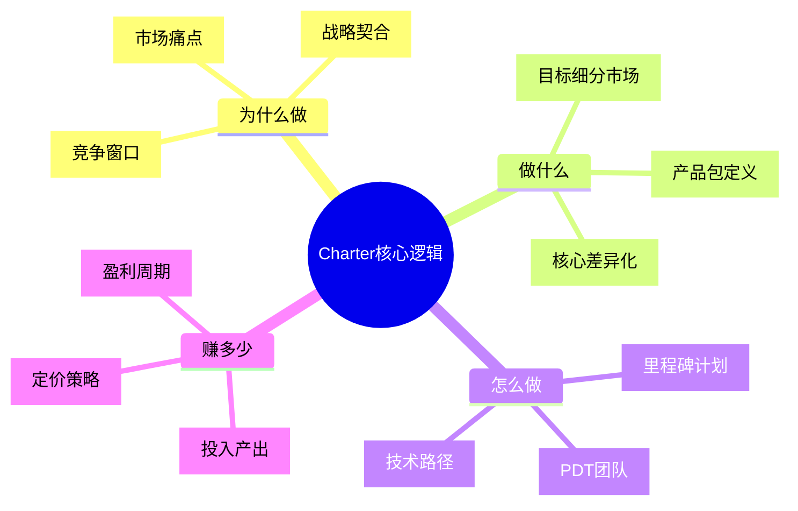

---

## 2. 项目背景与立项依据

### 2.1 来源与战略契合

| 维度           | 内容                                                |
| :------------- | :-------------------------------------------------- |
| **来源**       | [BRD编号] / [MRD编号] / [战略指令] / [客户定制需求] |
| **商业目标**   | [一句话，如：开辟第二增长曲线，年新增营收3000万]    |
| **战略契合度** | [对齐公司Q3 OKR / 年度战略主题 / 技术路线图中台化]  |

### 2.2 市场机会验证

- **市场痛点：** [如：调研显示73%中小企业客服响应时间>5分钟，流失率35%]
- **机会窗口：** [如：AI大模型成本下降80%，竞品尚未形成壁垒，窗口期12个月]
- **数据支撑：** [如：种子用户测试NPS=65，付费意愿率28%，客单价预估¥5000/年]

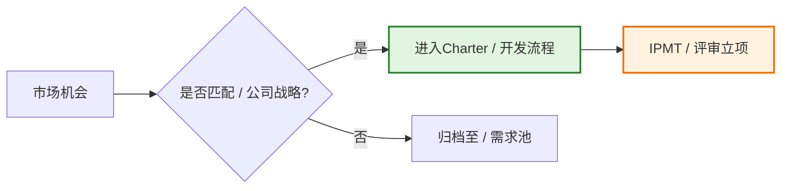

---

## 3. 项目目标（SMART + 平衡计分卡）

> 目标必须具体（Specific）、可衡量（Measurable）、可达成（Achievable）、相关（Relevant）、有时限（Time-bound）。

| 目标类型     | 目标描述                      | 衡量标准（KPI）                   | 完成时间 | 责任人 |
| :----------- | :---------------------------- | :-------------------------------- | :------: | :----- |
| **商业目标** | [如：实现XX营收 / 获取XX用户] | [如：GMV 1000万 / DAU 50万]       |    Q4    | [姓名] |
| **产品目标** | [如：上线XX功能 / 达成PMF]    | [如：功能覆盖率100% / 留存率>40%] |    Q3    | [姓名] |
| **能力目标** | [如：建立XX中台 / 沉淀XX技术] | [如：服务3个业务线 / 复用率>60%]  |    Q4    | [姓名] |
| **质量目标** | [如：达到XX质量等级]          | [如：线上P0事故=0 / 可用性99.95%] |   持续   | [姓名] |

> **说明**：xychart-beta为飞书不兼容Mermaid类型，改为表格描述（模板示例数据）。

**目标达成路径（示例）**

| 月份 | 完成度 % |
| :--- | :---: |
| M1 | 20 |
| M2 | 40 |
| M3 | 60 |
| M4 | 75 |
| M5 | 90 |
| M6 | 100 |

---

## 4. 产品/方案定义（Product Definition）

> 回答"我们到底要做什么产品"——这是 Charter 的核心，决定后续所有资源投入方向。

### 4.1 产品包描述（Product Package）

| 要素             | 定义                                                      |
| :--------------- | :-------------------------------------------------------- |
| **产品名称**     | [正式名称与内部代号]                                      |
| **目标细分市场** | [如：一二线城市25-40岁白领 / 跨境电商SaaS客户]            |
| **核心价值主张** | [如：让客服响应从小时级降至秒级，人力成本降低70%]         |
| **产品形态**     | [Web / APP / 小程序 / API / 解决方案 / 硬件+软件]         |
| **技术路径**     | [如：基于自研大模型 + 云原生微服务架构]                   |
| **质量等级**     | [如：A级（企业核心产品）/ B级（内部工具）/ C级（实验性）] |

### 4.2 竞争优势与差异化

> **说明**：此象限图模板已转为表格描述。

<!--
原 quadrantChart 结构参考：
- title: 竞争优势矩阵（技术成熟度 vs 市场差异化）
- x-axis: 低差异化 --> 高差异化
- y-axis: 低技术成熟度 --> 高技术成熟度
- quadrant-1: 明星产品（高/高）
- quadrant-2: 潜力产品（低/高）
- quadrant-3: 问题产品（低/低）
- quadrant-4: 现金牛（高/低）
- 数据点: "本产品": [0.8, 0.85]; "竞品A": [0.6, 0.5]; "竞品B": [0.4, 0.6]; "行业平均": [0.5, 0.5]
-->

| 象限 | 区域特征 | 策略建议 |
| :--- | :--- | :--- |
| 象限1（高差异化·高成熟度） | 明星产品（高/高） | 加大投入，扩大市场优势 |
| 象限2（低差异化·高成熟度） | 潜力产品（低/高） | 提升差异化能力，寻找突破 |
| 象限3（低差异化·低成熟度） | 问题产品（低/低） | 审视方向，评估是否继续投入 |
| 象限4（高差异化·低成熟度） | 现金牛（高/低） | 加快技术迭代，巩固技术壁垒 |

| 名称 | X值 | Y值 | 象限 |
| :--- | :---: | :---: | :--- |
| 本产品 | 0.8 | 0.85 | 象限1（明星产品） |
| 竞品A | 0.6 | 0.5 | 象限1（明星产品） |
| 竞品B | 0.4 | 0.6 | 象限2（潜力产品） |
| 行业平均 | 0.5 | 0.5 | 中线位置 |

### 4.3 产品路标中的位置

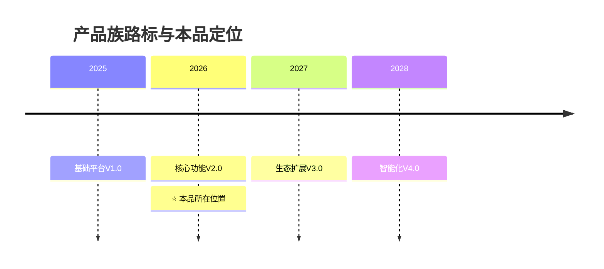

---

## 5. 市场分析与客户洞察

### 5.1 目标市场

| 指标                  |  数值  | 来源                         |
| :-------------------- | :----: | :--------------------------- |
| **TAM（潜在市场）**   | ¥[X]亿 | [行业报告]                   |
| **SAM（可服务市场）** | ¥[Y]亿 | [细分市场测算]               |
| **SOM（可获得市场）** | ¥[Z]亿 | [3年目标]                    |
| **目标市场占比**      |  [N]%  | [本品在整体产品组合中的权重] |

### 5.2 客户画像与场景

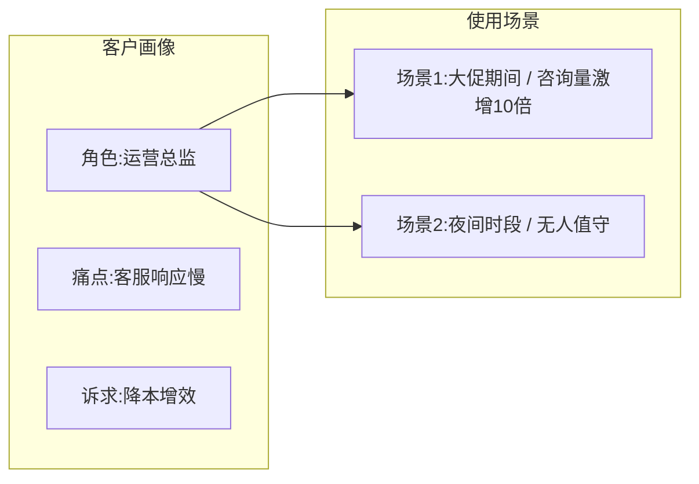

### 5.3 竞争分析

| 竞品       | 核心优势        | 主要劣势        | 我们的差异化策略    |
| :--------- | :-------------- | :-------------- | :------------------ |
| **竞品A**  | [品牌/渠道]     | [价格高/迭代慢] | [AI原生/成本优]     |
| **竞品B**  | [功能全/生态大] | [体验重/入门难] | [极简体验/垂直场景] |
| **替代品** | [Excel/人工]    | [效率低/易出错] | [自动化/智能化]     |

---

## 6. 执行策略与里程碑（Execution Strategy）

### 6.1 IPD 全生命周期与决策评审点（DCP）

> Charter 获批后，项目进入 IPD 流程，各阶段需通过 DCP 决策评审。

```mermaid
flowchart LR
    A[Charter / 立项评审] --> B[概念阶段 / CDCP]
    B --> C[计划阶段 / PDCP]
    C --> D[开发阶段 / ADCP]
    D --> E[验证阶段 / LDCP]
    E --> F[发布阶段 / RDCP]
    F --> G[生命周期 / EDCP]

    style A fill:#e1f5e1,stroke:#2e7d32,stroke-width:2px
    style B fill:#fff3e0,stroke:#ef6c00
    style C fill:#fff3e0,stroke:#ef6c00
    style D fill:#fff3e0,stroke:#ef6c00
    style E fill:#fff3e0,stroke:#ef6c00
    style F fill:#fff3e0,stroke:#ef6c00
```

### 6.2 技术评审点（TR）与里程碑

> **说明**：甘特图为飞书不兼容类型，改为表格描述。

| 阶段 | 任务/里程碑 | 开始日期 | 工期 | 状态 |
|:---|:---|:---|:---:|:---:|
| 概念阶段 | 需求分析 & TR1 | YYYY-MM-DD | 10d | ⚪ |
| 概念阶段 | 概念决策评审(CDCP) | YYYY-MM-DD | 0d | ⚪ milestone |
| 计划阶段 | 概要设计 & TR2 | YYYY-MM-DD | 10d | ⚪ |
| 计划阶段 | 详细设计 & TR3 | 概要设计完成后 | 10d | ⚪ |
| 计划阶段 | 计划决策评审(PDCP) | YYYY-MM-DD | 0d | ⚪ milestone |
| 开发阶段 | 模块开发 & TR4 | YYYY-MM-DD | 30d | ⚪ |
| 开发阶段 | 集成测试 & TR4A | 模块开发完成后 | 15d | ⚪ |
| 开发阶段 | 系统验证 & TR5 | 集成测试完成后 | 15d | ⚪ |
| 验证发布 | Beta测试 & TR6 | YYYY-MM-DD | 15d | ⚪ |
| 验证发布 | 发布决策评审(RDCP) | YYYY-MM-DD | 0d | ⚪ milestone |
| 验证发布 | GA正式发布 | YYYY-MM-DD | 0d | ⚪ milestone |

| DCP/TR   | 评审内容                       | 通过标准                         | 预计时间 |
| :------- | :----------------------------- | :------------------------------- | :------: |
| **CDCP** | 商业可行性、市场需求、产品概念 | 商业目标清晰，技术路径可行       |  T+2周   |
| **TR1**  | 产品需求、产品概念             | 需求基线化，无重大遗漏           |  T+3周   |
| **PDCP** | 产品方案、技术方案、资源计划   | PRD/TRD通过评审，预算锁定        |  T+6周   |
| **TR4**  | 模块开发完成、BBFV测试结果     | 代码Review通过，单元测试覆盖>80% |  T+12周  |
| **TR5**  | SDV/SIT测试结果                | 系统功能性能达标，无P0/P1遗留    |  T+16周  |
| **RDCP** | 发布 readiness、运营准备       | 灰度通过，监控就绪，文档完整     |  T+20周  |

### 6.3 上市策略（GTM）

| 策略维度     | 具体计划                                  |
| :----------- | :---------------------------------------- |
| **定价策略** | [如：基础版免费+专业版¥299/月+企业版定制] |
| **渠道策略** | [如：直销+代理商+应用市场]                |
| **推广策略** | [如：发布会+KOL种草+SEM投放]              |
| **服务策略** | [如：7×24在线+专属客户成功经理]           |

---

## 7. 项目范围（Scope）

### 7.1 范围边界

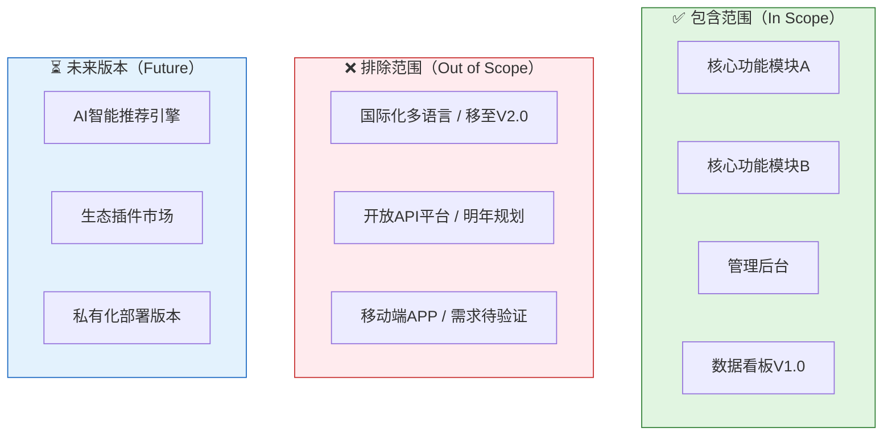

### 7.2 关键交付物清单

| 交付物        |   负责人   | 交付时间 | 验收标准           | 关联TR/DCP  |
| :------------ | :--------: | :------: | :----------------- | :---------: |
| Charter任务书 |  PDT经理   |   T+0    | IPMT审批通过       | Charter评审 |
| PRD文档       |  产品经理  |  T+2周   | 通过需求评审       |     TR1     |
| 技术方案/TRD  |   架构师   |  T+3周   | 通过技术评审       |     TR2     |
| 测试方案      | 测试负责人 |  T+4周   | 用例覆盖率≥90%     |     TR3     |
| 测试报告      | 测试负责人 |  T+16周  | 无P0 Bug，性能达标 |     TR5     |
| 上线发布包    |  PDT经理   |  T+20周  | 灰度通过，监控就绪 |    RDCP     |

---

## 8. PDT团队与治理（Team & Governance）

### 8.1 核心团队架构（Core Team）

> PDT（Product Development Team）为跨部门重量级团队，对项目端到端负责。

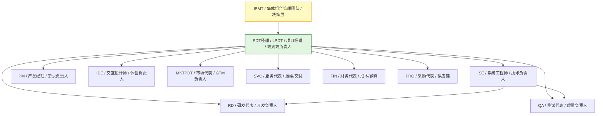

### 8.2 扩展团队（Extended Team）

| 角色       | 职责                   | 投入方式 |
| :--------- | :--------------------- | :------- |
| 法务合规   | 知识产权、数据合规审查 | 阶段介入 |
| 安全工程师 | 安全架构、渗透测试     | 兼职     |
| 数据分析师 | 埋点设计、效果评估     | 兼职     |
| 客户成功   | 种子客户对接、反馈收集 | 阶段介入 |

### 8.3 职责矩阵（RACI）

| 关键活动 | PDT经理 | 产品经理 | 研发  | 测试  | 设计 | 市场  | 财务  |
| :--- | :---: | :---: | :---: | :---: | :---: | :---: | :---: |
| 需求定义 |  **A**  |  **R**   |   C   |   C   |  C   |   I   |   I   |
| 技术方案 |  **A**  |    C     | **R** |   C   |  I   |   I   |   I   |
| 开发实现 |    I    |    C     | **R** |   C   |  I   |   I   |   I   |
| 测试验收 |  **A**  |    C     |   C   | **R** |  I   |   I   |   I   |
| 发布上线 |  **A**  |    C     | **R** |   C   |  I   | **R** |   I   |
| 运营推广 |    I    |    C     |   I   |   I   |  C   | **R** |   I   |
| 预算管控 |  **A**  |    I     |   C   |   I   |  I   |   C   | **R** |

> **R=执行（Responsible）, A=负责（Accountable）, C=咨询（Consulted）, I=知情（Informed）**

---

## 9. 资源与预算（Resource & Budget）

### 9.1 人力资源

| 角色              | 人数 | 投入比例 | 到位时间 | 备注            |
| :--- | :---: | :---: | :---: | :--- |
| PDT经理           |  1   |   100%   |   即时   | 全职负责        |
| 产品经理          |  2   |   100%   |   即时   | 含需求分析师1人 |
| 系统工程师/架构师 |  1   |   100%   |   即时   | 技术决策        |
| 后端研发          |  4   |   100%   |   即时   | 含1名技术Leader |
| 前端研发          |  2   |   100%   |  T+1周   | 含小程序端      |
| 测试工程师        |  2   |   100%   |  T+2周   | 含自动化测试    |
| 设计师            |  1   |   50%    |   即时   | 与另一项目共享  |
| 市场/运营         |  2   |   50%    |  T+8周   | 发布前介入      |

### 9.2 预算明细

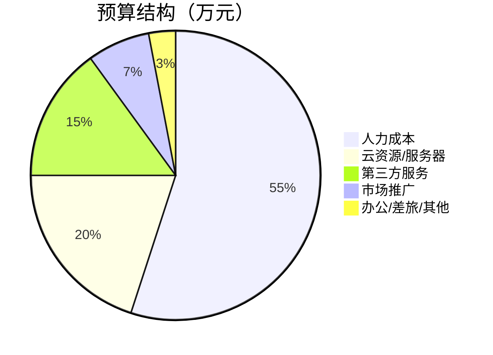

| 资源类型       | 明细                        | 预算（万元） | 到位时间 |
| :------------- | :-------------------------- | :----------: | :------: |
| **人力成本**   | 核心团队薪酬、外包费用      |     200      |   按月   |
| **技术成本**   | 云服务器、CDN、带宽、存储   |      80      |  T+2周   |
| **第三方服务** | 短信、支付、AI接口、License |      50      |  T+2周   |
| **运营成本**   | 推广、内容、活动、渠道      |      40      |  T+8周   |
| **其他**       | 办公、差旅、培训、合规      |      30      |   按需   |
| **合计**       |                             |   **400**    |          |

---

## 10. 财务分析（Financial Analysis）

> Charter 必须回答"财务上是否有意义"，这是 IPMT 决策的核心依据。

### 10.1 投入产出模型（3年）

|    年度    | 投入（万） | 收入（万） | 利润（万） | 累计利润 | ROI  | 阶段   |
| :---: | :---: | :---: | :---: | :---: | :---: | :--- |
| **Year 1** |    400     |    150     |    -250    |   -250   | -63% | 投入期 |
| **Year 2** |    600     |   1,200    |    600     |   350    | 100% | 增长期 |
| **Year 3** |    800     |   2,500    |   1,700    |  2,050   | 256% | 盈利期 |

<svg xmlns="http://www.w3.org/2000/svg" viewBox="0 0 600 420" style="max-width:600px;height:auto">
<rect width="600" height="420" fill="#fafafa" rx="8"/>
<text x="300" y="28" text-anchor="middle" font-size="16" font-weight="bold" fill="#333">3年财务趋势（万元）</text>
<line x1="60" y1="370.0" x2="580" y2="370.0" stroke="#eee" stroke-width="1"/>
<text x="55" y="374.0" text-anchor="end" font-size="11" fill="#999">-500</text>
<line x1="60" y1="304.0" x2="580" y2="304.0" stroke="#eee" stroke-width="1"/>
<text x="55" y="308.0" text-anchor="end" font-size="11" fill="#999">200</text>
<line x1="60" y1="238.0" x2="580" y2="238.0" stroke="#eee" stroke-width="1"/>
<text x="55" y="242.0" text-anchor="end" font-size="11" fill="#999">900</text>
<line x1="60" y1="172.0" x2="580" y2="172.0" stroke="#eee" stroke-width="1"/>
<text x="55" y="176.0" text-anchor="end" font-size="11" fill="#999">1600</text>
<line x1="60" y1="106.0" x2="580" y2="106.0" stroke="#eee" stroke-width="1"/>
<text x="55" y="110.0" text-anchor="end" font-size="11" fill="#999">2300</text>
<line x1="60" y1="40.0" x2="580" y2="40.0" stroke="#eee" stroke-width="1"/>
<text x="55" y="44.0" text-anchor="end" font-size="11" fill="#999">3000</text>
<text x="16" y="205" text-anchor="middle" font-size="12" fill="#666" transform="rotate(-90, 16, 205)">金额</text>
<line x1="60" y1="370" x2="580" y2="370" stroke="#ccc" stroke-width="1"/>
<polyline points="146.7,285.1 320.0,266.3 493.3,247.4" fill="none" stroke="#5470c6" stroke-width="2.5" stroke-linejoin="round" stroke-linecap="round"/>
<circle cx="146.7" cy="285.1" r="4" fill="#5470c6" stroke="#fff" stroke-width="1.5"/>
<text x="146.7" y="275.1" text-anchor="middle" font-size="10" fill="#5470c6" font-weight="bold">400</text>
<circle cx="320.0" cy="266.3" r="4" fill="#5470c6" stroke="#fff" stroke-width="1.5"/>
<text x="320.0" y="256.3" text-anchor="middle" font-size="10" fill="#5470c6" font-weight="bold">600</text>
<circle cx="493.3" cy="247.4" r="4" fill="#5470c6" stroke="#fff" stroke-width="1.5"/>
<text x="493.3" y="237.4" text-anchor="middle" font-size="10" fill="#5470c6" font-weight="bold">800</text>
<polyline points="146.7,308.7 320.0,209.7 493.3,87.1" fill="none" stroke="#91cc75" stroke-width="2.5" stroke-linejoin="round" stroke-linecap="round"/>
<circle cx="146.7" cy="308.7" r="4" fill="#91cc75" stroke="#fff" stroke-width="1.5"/>
<text x="146.7" y="298.7" text-anchor="middle" font-size="10" fill="#91cc75" font-weight="bold">150</text>
<circle cx="320.0" cy="209.7" r="4" fill="#91cc75" stroke="#fff" stroke-width="1.5"/>
<text x="320.0" y="199.7" text-anchor="middle" font-size="10" fill="#91cc75" font-weight="bold">1200</text>
<circle cx="493.3" cy="87.1" r="4" fill="#91cc75" stroke="#fff" stroke-width="1.5"/>
<text x="493.3" y="77.1" text-anchor="middle" font-size="10" fill="#91cc75" font-weight="bold">2500</text>
<polyline points="146.7,346.4 320.0,266.3 493.3,162.6" fill="none" stroke="#fc8452" stroke-width="2.5" stroke-linejoin="round" stroke-linecap="round"/>
<circle cx="146.7" cy="346.4" r="4" fill="#fc8452" stroke="#fff" stroke-width="1.5"/>
<text x="146.7" y="336.4" text-anchor="middle" font-size="10" fill="#fc8452" font-weight="bold">-250</text>
<circle cx="320.0" cy="266.3" r="4" fill="#fc8452" stroke="#fff" stroke-width="1.5"/>
<text x="320.0" y="256.3" text-anchor="middle" font-size="10" fill="#fc8452" font-weight="bold">600</text>
<circle cx="493.3" cy="162.6" r="4" fill="#fc8452" stroke="#fff" stroke-width="1.5"/>
<text x="493.3" y="152.6" text-anchor="middle" font-size="10" fill="#fc8452" font-weight="bold">1700</text>
<text x="146.7" y="390" text-anchor="middle" font-size="12" fill="#333">Year 1</text>
<text x="320.0" y="390" text-anchor="middle" font-size="12" fill="#333">Year 2</text>
<text x="493.3" y="390" text-anchor="middle" font-size="12" fill="#333">Year 3</text>
<line x1="165.0" y1="414" x2="177.0" y2="414" stroke="#5470c6" stroke-width="2.5"/>
<circle cx="171.0" cy="414" r="3" fill="#5470c6" stroke="#fff" stroke-width="1"/>
<text x="181.0" y="418" font-size="12" fill="#333">投入</text>
<line x1="255.0" y1="414" x2="267.0" y2="414" stroke="#91cc75" stroke-width="2.5"/>
<circle cx="261.0" cy="414" r="3" fill="#91cc75" stroke="#fff" stroke-width="1"/>
<text x="271.0" y="418" font-size="12" fill="#333">收入</text>
<line x1="345.0" y1="414" x2="357.0" y2="414" stroke="#fc8452" stroke-width="2.5"/>
<circle cx="351.0" cy="414" r="3" fill="#fc8452" stroke="#fff" stroke-width="1"/>
<text x="361.0" y="418" font-size="12" fill="#333">利润</text>
</svg>

### 10.2 关键财务假设

| 指标                    | 假设值                                      | 依据 / 风险         |
| :---------------------- | :------------------------------------------ | :------------------ |
| **定价**                | 基础版免费 / 专业版¥299/月 / 企业版¥5000/月 | 竞品定价调研        |
| **目标销量（Year 1）**  | 付费客户500家                               | 基于SAM和转化率测算 |
| **CAC（获客成本）**     | ≤ ¥800                                      | 渠道测试数据        |
| **LTV（客户终身价值）** | ≥ ¥3,600                                    | ARPU × 生命周期     |
| **LTV/CAC**             | ≥ 4.5                                       | 健康 SaaS 标准 > 3  |
| **盈亏平衡**            | 第 [14] 个月                                | 基于当前现金流模型  |

### 10.3 定价与盈利策略

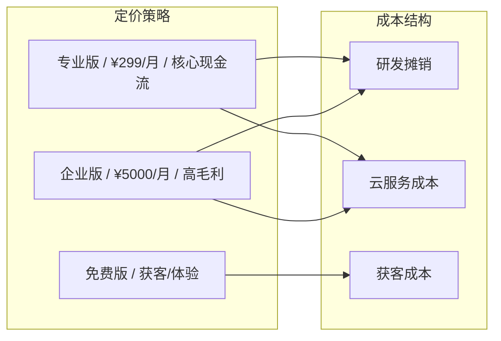

---

## 11. 风险与退出机制（Risk & Exit Strategy）

### 11.1 风险登记册

| 风险ID    | 风险描述           | 可能性 | 影响度 | 风险等级 | 触发条件         | 应对措施                         | 退出条件               |
| :-------- | :----------------- | :----: | :----: | :------: | :--------------- | :------------------------------- | :--------------------- |
| **R-001** | 技术方案不可行     |   中   |   高   |  🔴 高   | 技术预研未通过   | 引入外部专家/调整架构/更换技术栈 | 延期>2月则暂停         |
| **R-002** | 核心人员流失       |   中   |   高   |  🔴 高   | 关键岗位空缺>2周 | 启动Backup/外部招聘/知识文档化   | 无法补齐则缩减范围     |
| **R-003** | 需求重大变更       |   高   |   中   |  🟡 中   | 变更>30%工作量   | 变更控制流程/CCB评审/冻结基线    | 变更>50%则重新立项     |
| **R-004** | 市场接受度不及预期 |   中   |   高   |  🔴 高   | MVP留存率<<20%   | 快速Pivot/聚焦核心场景/调整定价  | 连续2月不达标则终止    |
| **R-005** | 竞品快速跟进       |   高   |   中   |  🟡 中   | 竞品同类功能上线 | 加速迭代/建立数据壁垒/专利保护   | 市场份额<<5%则调整目标 |

### 11.2 风险决策树

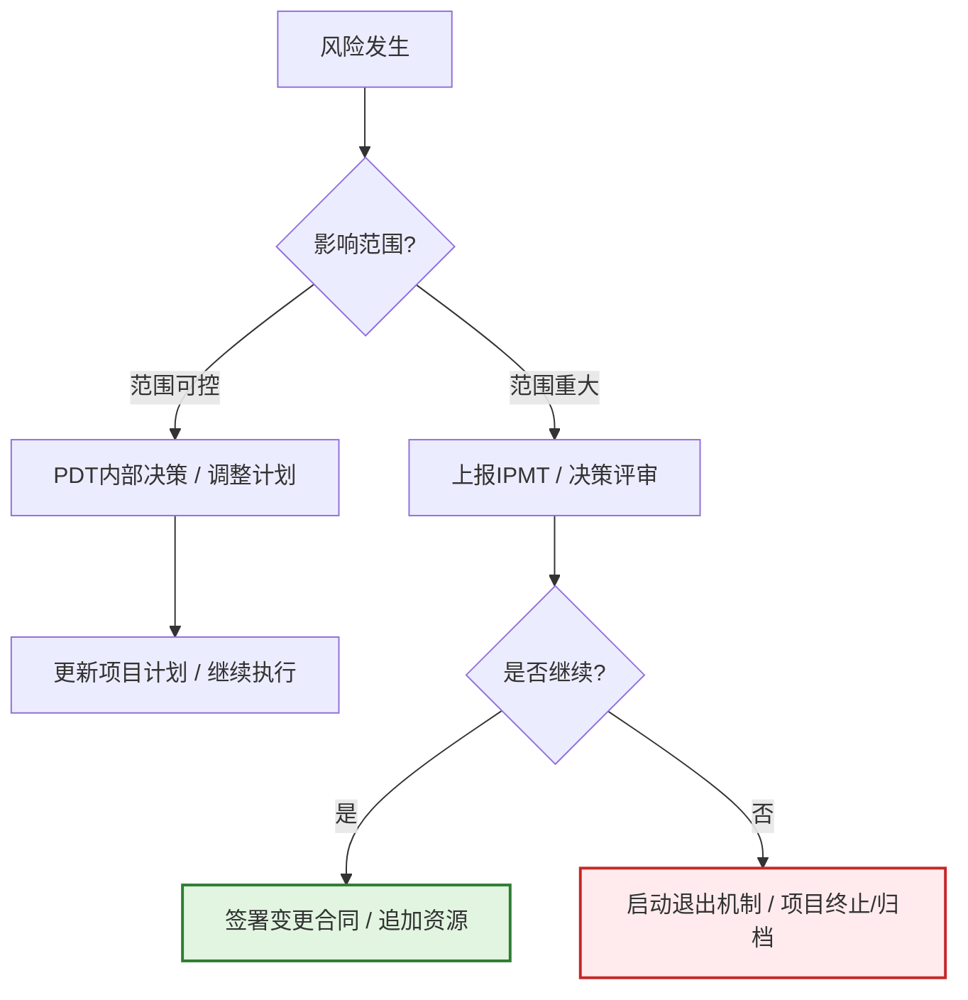

### 11.3 退出与止损机制

| 退出场景      | 触发条件                    | 资产处置          | 经验沉淀                   |
| :------------ | :-------------------------- | :---------------- | :------------------------- |
| **项目终止**  | 连续2次DCP未通过 / 市场消失 | 代码归档/团队重组 | 复盘报告/知识库更新        |
| **范围缩减**  | 资源削减>30%                | 保留核心模块      | 模块化设计文档             |
| **方向Pivot** | 原假设被证伪                | 可复用组件保留    | 用户调研报告/新方向Charter |

---

## 12. 签发确认与授权（Sign-off & Authorization）

> Charter 经 IPMT 审批通过后，正式授权组建 PDT，项目进入 IPD 概念阶段。

### 12.1 审批流程

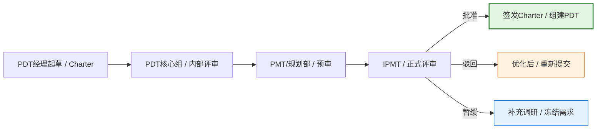

### 12.2 签核表

| 角色               | 姓名 | 签字 | 日期 | 审批意见               |
| :--- | :--- | :---: | :---: | :--- |
| **IPMT主席 / CEO** |      |      |      | [批准/驳回/暂缓及理由] |
| **产品总监**       |      |      |      |                        |
| **研发总监**       |      |      |      |                        |
| **财务BP**         |      |      |      |                        |
| **PDT经理**        |      |      |      | [承诺按计划执行]       |

---

## 13. 附录（Appendix）

### 13.1 术语表（Glossary）

| 术语     | 定义                                                   |
| :------- | :----------------------------------------------------- |
| **IPMT** | Integrated Portfolio Management Team，集成组合管理团队 |
| **PDT**  | Product Development Team，产品开发团队                 |
| **LPDT** | PDT经理，项目端到端负责人                              |
| **SE**   | System Engineer，系统工程师                            |
| **DCP**  | Decision Check Point，决策评审点                       |
| **TR**   | Technical Review，技术评审点                           |
| **CDP**  | Charter Development Process，任务书开发流程            |
| **GA**   | General Availability，正式发布                         |
| **PMF**  | Product Market Fit，产品市场契合                       |

### 13.2 关联文档清单

| 文档名称            | 文档编号     | 状态   | 链接   |
| :------------------ | :----------- | :----- | :----- |
| 商业需求文档（BRD） | BRD-2026-XXX | 已通过 | [链接] |
| 市场需求文档（MRD） | MRD-2026-XXX | 已通过 | [链接] |
| 产品需求文档（PRD） | PRD-2026-XXX | 编写中 | [链接] |
| 技术需求文档（TRD） | TRD-2026-XXX | 待启动 | [链接] |
| 财务测算底表        | FIN-2026-XXX | 已通过 | [链接] |
