# [Product/System Name (English)] - Architecture Design Document (ADD)

> **Document Status:** 🟡 Under Review / 🟢 Approved / 🔴 Rejected
>
> **Confidentiality Level:** Confidential / Internal / Public
>
> **Version:** vX.X
>
> **Date:** YYYY-MM-DD
>
> **Author:** [Architect/Tech Lead]
>
> **Reviewer:** [Name/Role]
>
> **Audience:** [Role List]
>
> **Related Charter:** [Charter ID]
>
> **Related BRD:** [BRD ID]
>
> **Related PRD:** [PRD ID]

---

## 0. Document Guide

### 0.1 Document Purpose and Scope

[Describe the purpose of this document, applicable scenarios, and non-applicable scenarios]

### 0.2 Related Documents

| Document Type | Filename              | Relevant Sections |
| ------------- | --------------------- | ----------------- |
| [Type]        | [Filename] [Line Range] | [Section Description] |

> **Reference Format Note**: Related documents use the `Filename Line Range` format (e.g., `Template-Architecture.md 3-21`). Line numbers may change as the document is updated — please refer to the actual content.

### 0.3 Change Log

| Version | Date       | Author  | Change Description                                         | Reviewer   |
| :------ | :--------- | :------ | :--------------------------------------------------------- | :--------- |
| v0.1    | YYYY-MM-DD | [Name]  | Initial draft: context + container diagram                 | [Name]     |
| v0.2    | YYYY-MM-DD | [Name]  | Added component diagram + deployment diagram               | [Name]     |
| v0.3    | YYYY-MM-DD | [Name]  | Added ADR + risk assessment                                | [Name]     |
| vX.X    | YYYY-MM-DD | [Name]  | Official release                                           | [Name]  |
| v0.4.1  | 2026-06-09 | Xie Dong | Fix: quadrantChart template changed to table format (Feishu incompatible) | — |
| v0.4.2  | 2026-06-09 | Xie Dong | Fix: xychart-beta diagram changed to table for Feishu rendering compatibility | — |
| v0.4.3  | 2026-06-09 | Xie Dong | Fix: gantt chart changed to table for Feishu rendering compatibility | — |
| v0.4.4  | 2026-06-20 | Xie Dong | Messaging middleware example Kafka→Pulsar (unified event bus specification) | — |

---

## 1. Executive Summary

> **Technical Decision Layer Guide:** A one-page overview covering "system boundaries, technology selection, key risks, critical decisions."

| Element         | Content                                                        |
| :-------------- | :------------------------------------------------------------- |
| **System Positioning** | [One sentence, e.g., High-availability transaction kernel supporting tens of millions of daily orders] |
| **Core Challenges** | [e.g., High-concurrency flash sales / Distributed transaction consistency / Active-active disaster recovery] |
| **Technology Stack** | [e.g., Spring Cloud + PostgreSQL + Redis + Pulsar + K8s] |
| **Architecture Style** | [e.g., Microservices / Domain-Driven Design (DDD) / Event-Driven Architecture (EDA)] |
| **Key Metrics** | QPS ≥ [X] / P99 latency ≤ [Y]ms / Availability ≥ [Z]% |
| **Major Decisions** | [e.g., Abandoned 2PC distributed transactions, adopted Saga + local message table] |
| **Risk Level** | 🟢 Low / 🟡 Medium / 🔴 High |

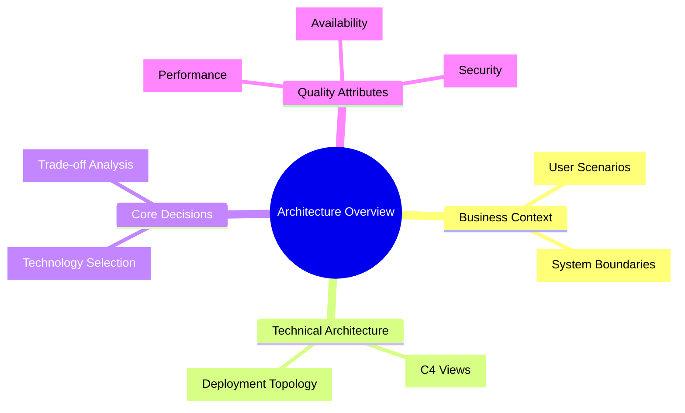

---

## 2. Current State & Requirements Analysis

### 2.1 Current Pain Points

| Dimension   | Current State         | Pain Point                            | Quantified Data                |
| :---------- | :-------------------- | :------------------------------------ | :----------------------------- |
| **Performance** | [e.g., Monolithic architecture] | [e.g., CPU 95% during peak, response timeout] | [e.g., P99=3s, target <<500ms] |
| **Availability** | [e.g., Single data center deployment] | [e.g., Data center failure causes full site outage] | [e.g., 3 failures/year, each >2h] |
| **Scalability** | [e.g., Vertical scaling] | [e.g., Scaling requires downtime, takes 4h] | [e.g., Peak only supports 10K QPS] |
| **Maintainability** | [e.g., High code coupling] | [e.g., Changing one line affects 5 modules] | [e.g., Regression test cycle 2 weeks] |

### 2.2 Requirements Matrix (Functional + Non-functional)

> **Reference Note**: For detailed technical requirements, performance metrics, reliability requirements, and security compliance requirements, please refer to **Template-TRD.md**. This document only references key architectural requirements.

| Requirement Type | Requirement Description | Priority | Architectural Impact | Source Document |
| :--- | :--- | :---: | :--- | :--- |
| **Functional** | [e.g., Support 100K QPS flash sale ordering] | P0 | [Architecture design highlights] | Reference TRD§1.1 |
| **Non-functional** | [e.g., P99 latency ≤200ms] | P0 | [Performance design highlights] | Reference TRD§3.1 |
| **Non-functional** | [e.g., RTO≤30s, RPO≤5s] | P0 | [Disaster recovery design highlights] | Reference TRD§4.1 |
| **Non-functional** | [e.g., Support canary deployment] | P1 | [Deployment design highlights] | Reference TRD§7.2 |

> **Complete Requirements**: For the full technical challenge list, performance baseline, capacity planning, and degradation strategies, please refer to **Template-TRD.md §1-4**.

---

## 3. C4 Architecture Views (C4 Model Views)

> Following Simon Brown's C4 Model, expanding layer by layer from macro to micro.

### 3.1 Level 1: System Context Diagram

> **Audience:** Everyone (Product, Operations, Management, Technical)
>
> **Abstraction Level:** 30,000 feet — describes the interaction boundaries between the system and the external world.

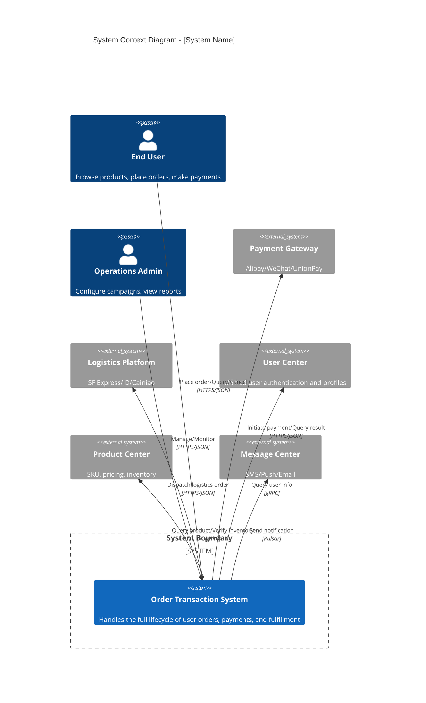

> **If the platform does not support C4Context syntax, use the following standard Mermaid alternative:**

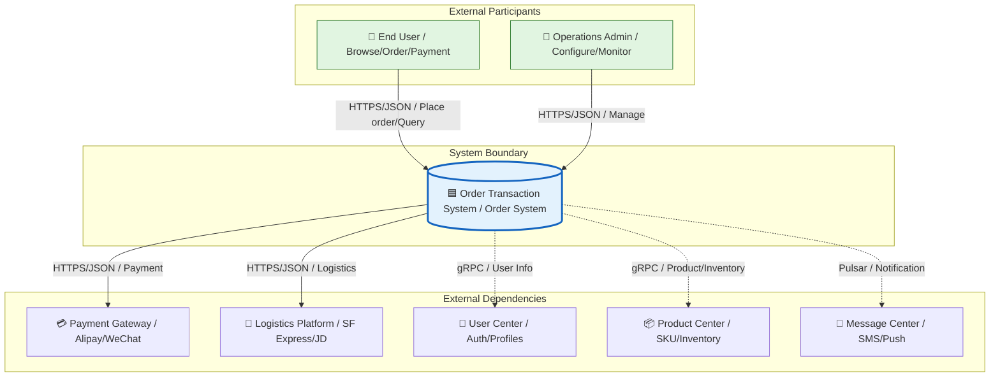

### 3.2 Level 2: Container Diagram

> **Audience:** Tech leads, developers, testers, operations
>
> **Abstraction Level:** 10,000 feet — describes deployable units (processes/services/storage) inside the system and their interactions.

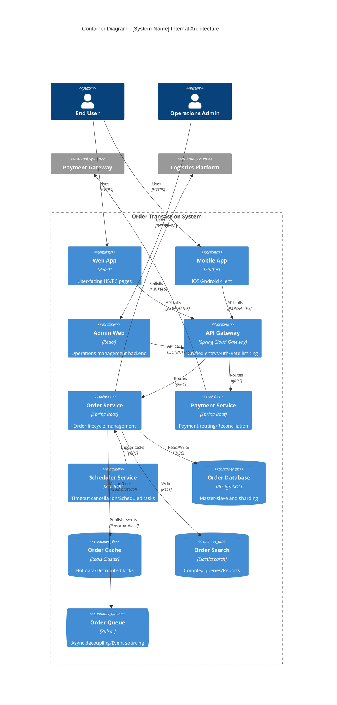

> **Standard Mermaid Alternative:**

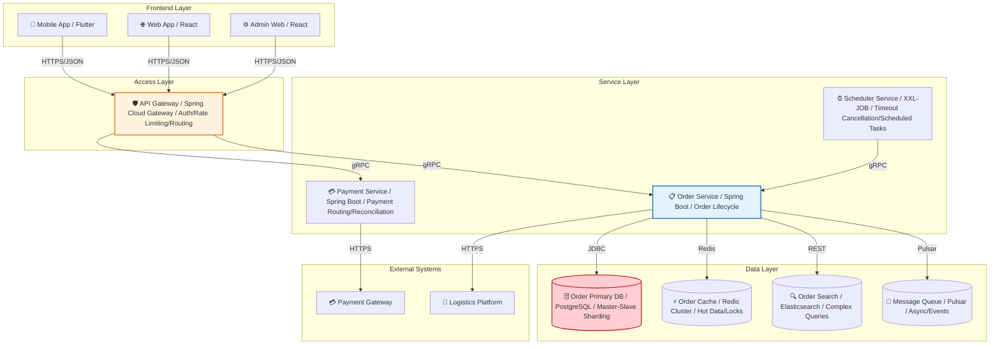

### 3.3 Level 3: Component Diagram

> **Audience:** Development team, architects
>
> **Abstraction Level:** 1,000 feet — describes the component structure and interactions within a single container.

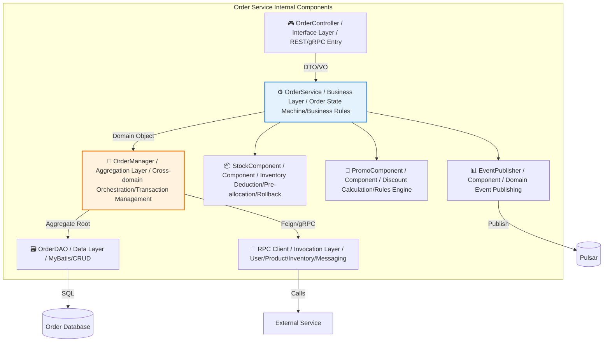

### 3.4 Level 4: Code/Class Diagram [Optional]

> **Audience:** Core developers
>
> **Note:** Only drawn for core complex components (e.g., state machines, rules engines). Full output is generally not recommended to avoid over-engineering.

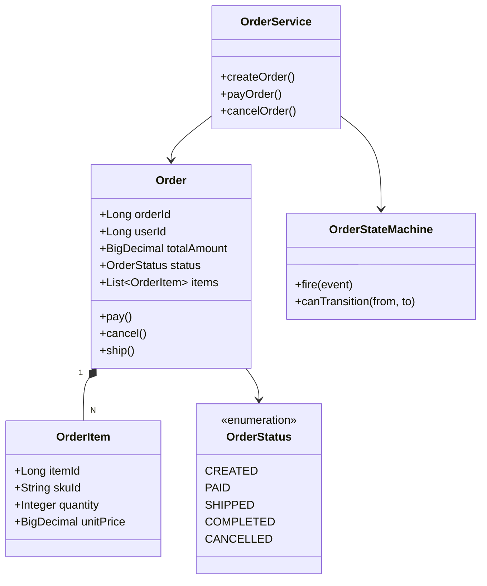

---

## 4. Dynamic Behavior Views

> Describes runtime behavior for key scenarios, supplementing the C4 static views.

### 4.1 Core Flow Sequence Diagram

#### Scenario: End-to-End User Order and Payment Flow

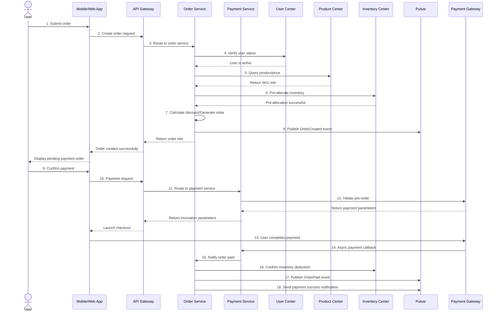

### 4.2 State Machine Diagram

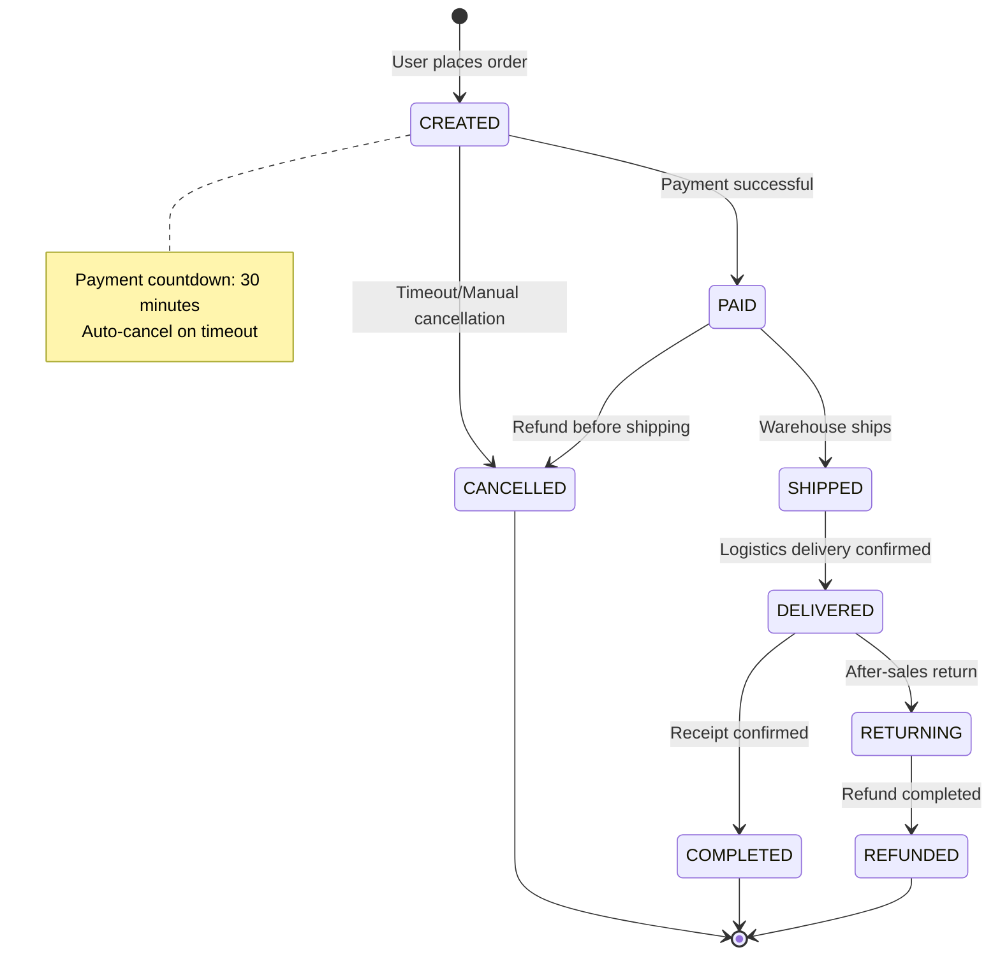

### 4.3 Exception/Compensation Flow

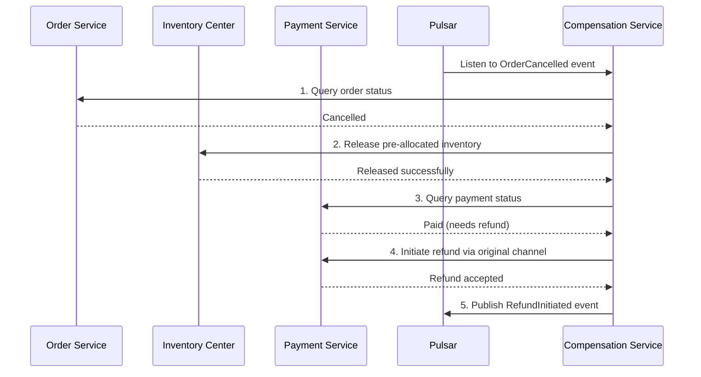

---

## 5. Deployment Architecture

> Describes how containers map to infrastructure, answering "where it runs and how disaster recovery works."

### 5.1 Deployment Topology Diagram

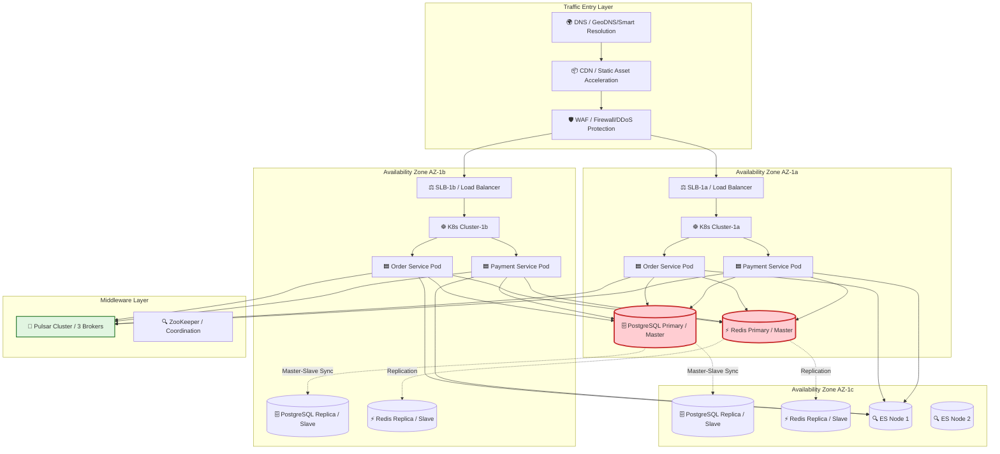

### 5.2 Active-Active/Disaster Recovery Strategy

| Strategy              | Implementation                                                      | RTO   | RPO  | Applicable Scenario     |
| :-------------------- | :------------------------------------------------------------------ | :---: | :--: | :---------------------- |
| **Same-city Active-Active** | AZ-1a / AZ-1b simultaneously handle traffic, DB master-slave failover | 30s | 0s  | Data center-level failure |
| **Remote Cold Standby** | AZ-2 periodic backups, manual failover on failure                   | 30min | 5min | City-level disaster      |
| **Multi-replica Data** | PostgreSQL semi-synchronous replication + Redis Cluster 3M3S       | -     | -    | Data reliability         |
| **Degradation Plan**   | Inventory check falls back to cache / Payment falls back to backup channel | 5s | -  | Dependency service failure |

---

## 6. Data Architecture

### 6.1 Data Flow Diagram

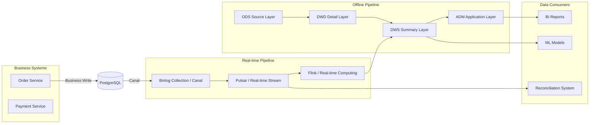

### 6.2 Data Sharding and Routing

| Data Type    | Shard Key       | Sharding Strategy                | Routing Method      |
| :----------- | :-------------- | :------------------------------- | :------------------ |
| Order Master | `user_id`       | 128 shards, Hash modulo          | ShardingSphere      |
| Order Detail | `order_id`      | Co-located with master (bound table) | Local routing   |
| Payment Log  | `order_id`      | 128 shards                       | ShardingSphere      |
| Logs/Audit   | `create_time`   | Monthly partitioning              | Time-range routing  |

---

## 7. Core Algorithms and Mechanism Design

### 7.1 Global Unique ID Generation

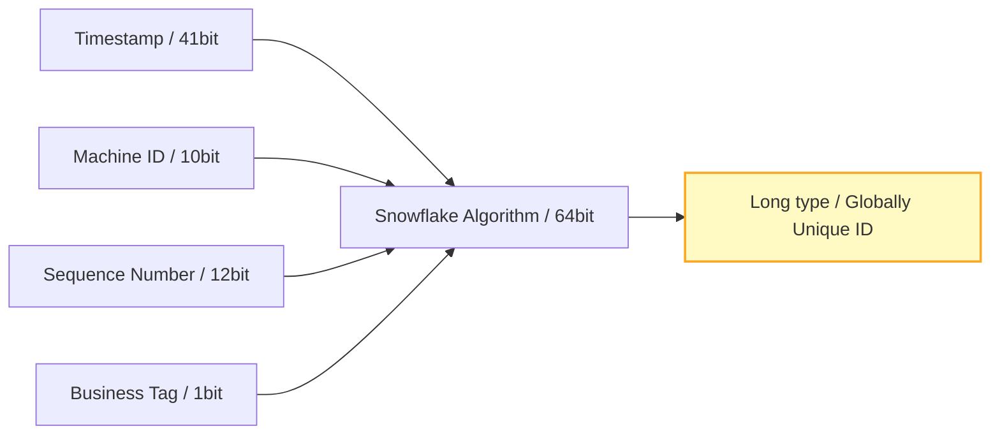

| Attribute     | Design Value | Description                                |
| :------------ | :----------- | :----------------------------------------- |
| Timestamp bits | 41bit       | Supports ~69 years (from custom start time) |
| Machine ID bits | 10bit     | Supports 1024 nodes                        |
| Sequence bits  | 12bit      | 4096 IDs per node per millisecond          |
| Business Tag   | 1bit       | Distinguishes different business lines (orders/payments) |

### 7.2 Distributed Lock Design

| Scenario                | Implementation       | Key Design                   | Expiry Time | Renewal Strategy       |
| :---------------------- | :------------------- | :--------------------------- | :---------: | :--------------------- |
| Inventory deduction     | Redis RedLock        | `lock:stock:{skuId}`         |     10s     | Watchdog auto-renewal  |
| Order creation dedup    | DB unique index      | `uniq:order:{userId}:{date}` |   Forever   | No renewal needed      |
| Payment callback idempotency | Redis SET NX EX | `lock:pay:{orderId}`         |     60s     | Active release on completion |

### 7.3 Caching Strategy

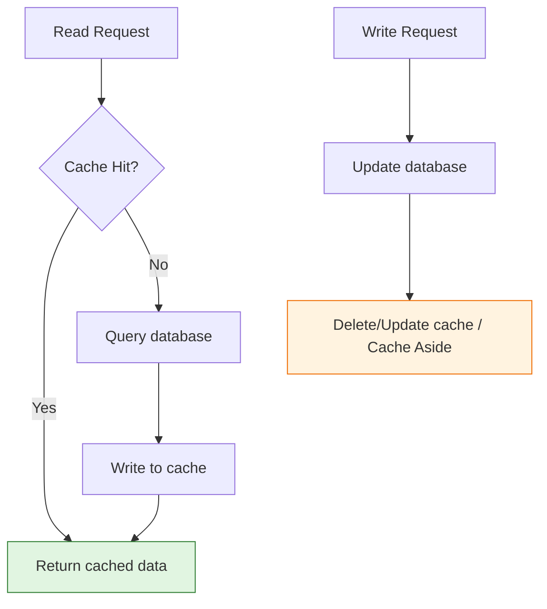

| Strategy        | Applicable Scenario    | Consistency Level | Implementation             |
| :-------------- | :--------------------- | :---------------- | :------------------------- |
| Cache Aside     | Order detail queries   | Eventual          | Read-through on miss, delete on write |
| Write Through   | Real-time inventory deduction | Strong       | Synchronous DB + cache write |
| Read Through    | Product basic info     | Eventual          | Cache component auto-read-through |

---

## 8. Non-Functional Requirements Design (NFR / Quality Attributes)

### 8.1 Performance Design

| Metric         | Target    | Achievement Method                            |
| :------------- | :-------- | :-------------------------------------------- |
| **Peak QPS**   | ≥ 100,000 | Horizontal scaling + cache warming + async     |
| **P99 Latency** | ≤ 200ms  | Local cache + DB index optimization + connection pool |
| **Concurrent Connections** | ≥ 50,000 | Gateway long connection optimization + K8s HPA |

> **Note**: xychart-beta is an incompatible Mermaid type for Feishu; replaced with table description (template sample data).

**Performance Capacity Planning**

| Time Point  |   QPS    |
| :---------- | :------: |
| Current     |  5,000   |
| +3 months   | 30,000   |
| +6 months   | 80,000   |
| +12 months  | 120,000  |

### 8.2 High Availability Design

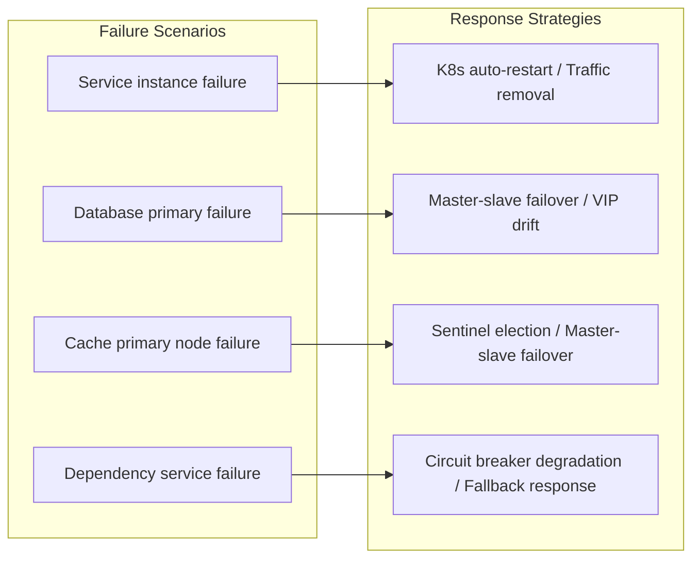

### 8.3 Security Design

| Layer         | Measures                                   | Implementation                       |
| :------------ | :----------------------------------------- | :----------------------------------- |
| **Access Layer** | HTTPS/TLS 1.3, WAF, DDoS protection   | Cloud vendor security products       |
| **Gateway Layer** | OAuth2.1 + JWT, signature verification, rate limiting | Spring Security + custom filters |
| **Service Layer** | Zero-trust network, mTLS, RBAC        | Istio Service Mesh                   |
| **Data Layer** | Sensitive field encryption, SQL injection prevention | AES-256-GCM + MyBatis parameterized |
| **Audit Layer** | Full-chain logging, operation audit     | SkyWalking + audit tables            |

---

## 9. Architecture Decision Records (ADR)

> All decisions affecting two or more services, or that are irreversible, must be recorded as ADRs.

| Decision ID  | Decision Topic       | Status    | Context                              | Decision                            | Consequences                           | Date       |
| :----------- | :------------------- | :-------: | :----------------------------------- | :---------------------------------- | :------------------------------------- | :--------- |
| **ADR-001**  | Microservices vs Monolith | ✅ Adopted | Team >50 people, need independent iteration | Adopt microservices, split by domain | Increased operational complexity, need DevOps capability | YYYY-MM-DD |
| **ADR-002**  | Database Selection   | ✅ Adopted | Team familiar with PostgreSQL, TiDB high learning cost | PostgreSQL master-slave + sharding | Sharding logic built in-house, mid-term migration to TiDB possible | YYYY-MM-DD |
| **ADR-003**  | Distributed Transaction Solution | ✅ Adopted | Performance priority, brief inconsistency allowed | Saga + local message table (eventual consistency) | Need reconciliation compensation, abandon strong consistency | YYYY-MM-DD |
| **ADR-004**  | Cache Consistency Strategy | ✅ Adopted | High-concurrency read-heavy, write-light | Cache Aside + delayed double-delete | Brief inconsistency possible in extreme cases | YYYY-MM-DD |
| **ADR-005**  | Deployment Method   | ✅ Adopted | Elastic scaling needs, cloud-native trend | K8s + Docker containerization | Need K8s operations capability         | YYYY-MM-DD |

### ADR Detailed Example: ADR-003 Distributed Transaction

```markdown
## ADR-003: Distributed Transaction Consistency Solution

### Status

Adopted ✅

### Context

Order creation involves three independent databases: order database, inventory database, and coupon database. Data consistency must be ensured.

### Candidate Solutions

1. **2PC/XA**: Strong consistency, but blocking with poor performance; unsuitable for high concurrency.
2. **TCC**: Better performance, but high business invasiveness; requires Try/Confirm/Cancel for each operation.
3. **Saga + Local Message Table**: Eventual consistency with best performance; ensures consistency through async compensation.

### Decision

Choose Solution 3: Saga + Local Message Table.

### Rationale

- Business scenario allows second-level inconsistency (inventory pre-allocation not immediately deducted does not affect user experience)
- Team already has messaging infrastructure (Pulsar)
- Avoids 2PC's blocking and single-point issues

### Consequences

- Need to develop a reconciliation compensation service to periodically scan abnormal orders
- Need to establish manual intervention process for compensation failures
- Monitoring must cover "long-pending transactions" alerts
```

---

## 10. Risk Assessment and Mitigation

> **Reference Note**: For project-level risks (business risks, market risks, personnel risks), please refer to **Template-Project-Charter.md §11.1**. This document only lists risks at the technical architecture level.

| Risk ID   | Risk Description                          | Probability | Impact | Risk Level | Mitigation Measures                           | Owner    |
| :-------- | :---------------------------------------- | :---------: | :----: | :--------: | :-------------------------------------------- | :------- |
| **R-001** | Poor cross-shard query performance after sharding | High | High | 🔴 | ES stores full data, complex queries via search | [Name]  |
| **R-002** | Cache avalanche crashes DB                | Medium | High | 🔴 | Multi-level cache + randomized expiry + circuit breaker | [Name] |
| **R-003** | Message queue consumption delay causes inventory inconsistency | Medium | Medium | 🟡 | Monitor consumption delay, auto-scale consumers on threshold | [Name] |
| **R-004** | K8s cluster failure causes all services unavailable | Low | High | 🟡 | Same-city active-active + remote DR, core services keep VM deployment | [Name] |
| **R-005** | Third-party payment API changes           | Medium | Medium | 🟡 | Abstract payment adapter layer, support multi-channel quick switching | [Name] |

> **Project-level Risks**: For the complete project-level risk register (including trigger and exit conditions) covering policy risks, market risks, and personnel risks, please refer to **Template-Project-Charter.md §11.1**.

> **Note**: This quadrant diagram template has been converted to a table description.

<!--
Original quadrantChart structure reference:
- title: Risk Heat Map (Probability vs Impact)
- x-axis: "Low Probability" --> "High Probability"

- y-axis: "Low Impact" --> "High Impact"
- quadrant-1: Focus Area (High/High)
- quadrant-2: Close Monitoring (Low/High)
- quadrant-3: General Attention (Low/Low)
- quadrant-4: Periodic Review (High/Low)
- Data points: "R-001 Shard Query": [0.8, 0.9]; "R-002 Cache Avalanche": [0.6, 0.9]; "R-003 Consumption Delay": [0.5, 0.6]; "R-004 K8s Failure": [0.3, 0.9]; "R-005 Payment Changes": [0.5, 0.5]
  -->

| Quadrant                                  | Zone Characteristics       | Recommended Strategy            |
| :---------------------------------------- | :------------------------- | :------------------------------ |
| Quadrant 1 (High Probability · High Impact) | Focus Area (High/High)    | Develop emergency plans, conduct regular drills |
| Quadrant 2 (Low Probability · High Impact) | Close Monitoring (Low/High) | Set alert thresholds, continuous tracking |
| Quadrant 3 (Low Probability · Low Impact) | General Attention (Low/Low) | Routine management, no excessive focus needed |
| Quadrant 4 (High Probability · Low Impact) | Periodic Review (High/Low) | Establish process-driven management |

| Name              | X Value | Y Value | Quadrant                  |
| :---------------- | :-----: | :-----: | :------------------------ |
| R-001 Shard Query | 0.8     | 0.9     | Quadrant 1 (Focus Area)   |
| R-002 Cache Avalanche | 0.6  | 0.9     | Quadrant 1 (Focus Area)   |
| R-003 Consumption Delay | 0.5 | 0.6   | Quadrant 1 (Focus Area)   |
| R-004 K8s Failure | 0.3     | 0.9     | Quadrant 2 (Close Monitoring) |
| R-005 Payment Changes | 0.5 | 0.5   | Center Line                |

---

## 11. Implementation Roadmap

> **Note**: Gantt chart is an incompatible type for Feishu; replaced with table description.

| Phase          | Task                    | Start Date     | Duration | Status |
| :------------- | :---------------------- | :------------- | :------: | :----: |
| Infrastructure | K8s cluster setup       | YYYY-MM-DD     | 14d      |  ⚪    |
| Infrastructure | Middleware deployment   | After cluster setup | 10d  |  ⚪    |
| Core Services  | Order service development | YYYY-MM-DD   | 20d      |  ⚪    |
| Core Services  | Payment service development | YYYY-MM-DD | 20d      |  ⚪    |
| Core Services  | Integration testing    | After development | 10d   |  ⚪    |
| Data Migration | Sharding design        | YYYY-MM-DD     | 10d      |  ⚪    |
| Data Migration | Dual-write migration   | After design   | 15d      |  ⚪    |
| Data Migration | Traffic cutover verification | After dual-write | 10d |  ⚪   |
| Launch         | Canary deployment      | After integration testing | 7d |  ⚪  |
| Launch         | Full rollout           | After canary   | 3d       |  ⚪    |
| Launch         | Monitoring & alerting  | After full rollout | 5d    |  ⚪    |

| Phase        | Milestone                | Timeline | Deliverables        | Pass Criteria              |
| :----------- | :----------------------- | :------- | :------------------ | :------------------------- |
| **Phase 1**  | Infrastructure ready     | T+2 weeks | K8s cluster, middleware | Load test passed        |
| **Phase 2**  | Core services development complete | T+6 weeks | Order/Payment service code | Unit test coverage >80% |
| **Phase 3**  | Data migration complete  | T+10 weeks | Dual-write verification report | Data consistency check passed |
| **Phase 4**  | Canary rollout           | T+12 weeks | Canary monitoring report | P0 incidents = 0, key metrics met |
| **Phase 5**  | Full rollout             | T+13 weeks | Launch report      | Business validation passed |

---

## 12. Appendix

### 12.1 Glossary

| Term         | Definition                                                        |
| :----------- | :---------------------------------------------------------------- |
| **C4 Model** | Context/Container/Component/Code — four-layer architecture description model |
| **ADR**      | Architecture Decision Record                                      |
| **Saga**     | Distributed transaction pattern; achieves eventual consistency via local transactions + compensation |
| **RTO**      | Recovery Time Objective                                           |
| **RPO**      | Recovery Point Objective                                          |
| **QPS**      | Queries Per Second                                                |
| **P99**      | 99th percentile latency                                           |

### 12.2 Related Documents

| Document                  | ID            | Link   |
| :------------------------ | :------------ | :----- |
| Product Requirements Document (PRD) | PRD-2026-XXX | [Link] |
| Data Dictionary           | DD-2026-XXX   | [Link] |
| API Documentation         | API-2026-XXX  | [Link] |
| Test Plan                 | TEST-2026-XXX | [Link] |
| Operations Manual         | OPS-2026-XXX  | [Link] |

---

## 13. Review & Sign-off

| Role          | Name | Signature | Date | Review Comments |
| :------------ | :--- | :-------: | :--: | :-------------- |
| Tech Lead     |      |           |      |                 |
| Architect     |      |           |      |                 |
| Dev Representative |  |           |      |                 |
| QA Representative |   |           |      |                 |
| Ops Representative |   |           |      |                 |
| Security Lead |      |           |      |                 |
| Project Director |   |           |      |                 |
