# [产品/系统名称（英文名）] - 架构设计文档（ADD）

> **文档状态：** 🟡 评审中 / 🟢 已通过 / 🔴 驳回
>
> **保密级别：** 机密 / 内部公开 / 公开
>
> **版本：** vX.X
>
> **日期：** YYYY-MM-DD
>
> **撰写人：** [架构师/技术负责人]
>
> **评审人：** [Kirky.X/TL]
>
> **阅读对象：** [角色列表]
>
> **关联 Charter：** [Charter编号]
>
> **关联 BRD：** [BRD编号]
>
> **关联 PRD：** [PRD编号]

---

## 0. 文档导读

### 0.1 文档目的与适用范围

[说明本文档的目的、适用场景和不适用场景]

### 0.2 相关文档

| 文档类型 | 文件名              | 相关章节   |
| -------- | ------------------- | ---------- |
| [类型]   | [文件名] [行号范围] | [章节描述] |

> **引用格式说明**：关联文档使用 `文件名 行号范围` 格式（如 `【模板】架构设计文档.md 3-21`），行号随文档更新可能变化，请以实际内容为准。

### 0.3 变更记录

| 版本   | 日期       | 修订人 | 变更内容                                           | 审核人    |
| :----- | :--------- | :----- | :------------------------------------------------- | :-------- |
| v0.1   | YYYY-MM-DD | [姓名] | 初稿：上下文+容器图                                | [姓名]    |
| v0.2   | YYYY-MM-DD | [姓名] | 补充组件图+部署图                                  | [姓名]    |
| v0.3   | YYYY-MM-DD | [姓名] | 补充ADR+风险评估                                   | [姓名]    |
| v0.4   | YYYY-MM-DD | [姓名] | 正式发布                                           | [Kirky.X] |
| v0.4.1 | 2026-06-09 | 谢董   | 修复：quadrantChart 模板改为表格格式（飞书不兼容） | —         |
| v0.4.2 | 2026-06-09 | 谢董   | 修复xychart-beta图为表格以兼容飞书渲染             | —         |
| v0.4.3 | 2026-06-09 | 谢董   | 修复gantt图为表格以兼容飞书渲染                    | —         |
| v0.4.4 | 2026-06-20 | 谢董   | 消息中间件示例 Kafka→Pulsar（统一事件总线规范）    | —         |

---

## 1. 执行摘要（Executive Summary）

> **技术决策层导读：** 一页纸说清"系统边界、技术选型、核心风险、关键决策"。

| 要素         | 内容                                                   |
| :----------- | :----------------------------------------------------- |
| **系统定位** | [一句话，如：支撑日均千万级订单的高可用交易内核]       |
| **核心挑战** | [如：高并发秒杀 / 分布式事务一致性 / 多活容灾]         |
| **技术选型** | [如：Spring Cloud + PostgreSQL + Redis + Pulsar + K8s] |
| **架构风格** | [如：微服务 / 领域驱动设计(DDD) / 事件驱动架构(EDA)]   |
| **关键指标** | QPS ≥ [X] / P99 延迟 ≤ [Y]ms / 可用性 ≥ [Z]%           |
| **重大决策** | [如：放弃分布式事务2PC，采用Saga+本地消息表]           |
| **风险等级** | 🟢 低风险 / 🟡 中风险 / 🔴 高风险                      |

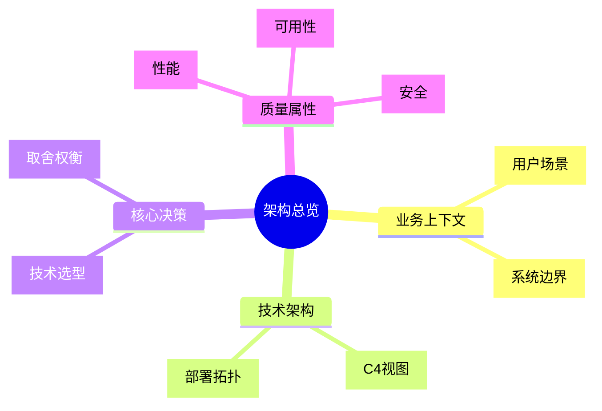

---

## 2. 现状与需求分析（Current State & Requirements）

### 2.1 现状痛点

| 维度       | 现状               | 痛点                          | 量化数据                  |
| :--------- | :----------------- | :---------------------------- | :------------------------ |
| **性能**   | [如：单体架构]     | [如：高峰期CPU 95%，响应超时] | [如：P99=3s，目标<<500ms] |
| **可用性** | [如：单机房部署]   | [如：机房故障导致全站停摆]    | [如：年故障3次，每次>2h]  |
| **扩展性** | [如：垂直扩容]     | [如：扩容需停机，耗时4h]      | [如：峰值只能支撑1万QPS]  |
| **维护性** | [如：代码耦合度高] | [如：改一行代码影响5个模块]   | [如：回归测试周期2周]     |

### 2.2 需求矩阵（功能性 + 非功能性）

> **引用说明**：详细的技术需求、性能指标、可靠性要求、安全合规要求，请参阅 **【模板】技术需求文档(TRD).md**。本文档仅引用关键架构需求。

| 需求类型 | 需求描述 | 优先级 | 架构影响 | 来源文档 |
| :--- | :--- | :---: | :--- | :--- |
| **功能性** | [如：支持10万QPS秒杀下单] | P0 | [架构设计要点] | 引用TRD§1.1 |
| **非功能性** | [如：P99延迟≤200ms] | P0 | [性能设计要点] | 引用TRD§3.1 |
| **非功能性** | [如：RTO≤30s，RPO≤5s] | P0 | [容灾设计要点] | 引用TRD§4.1 |
| **非功能性** | [如：支持灰度发布] | P1 | [部署设计要点] | 引用TRD§7.2 |

> **完整需求**：技术挑战清单、性能基线、容量规划、降级策略详见 **【模板】技术需求文档(TRD).md §1-4**。

---

## 3. C4 架构视图（C4 Model Views）

> 遵循 Simon Brown 提出的 C4 模型，从宏观到微观逐层展开。

### 3.1 Level 1：系统上下文图（System Context）

> **受众：** 全员（产品、运营、管理层、技术）
>
> **抽象层级：** 30,000 英尺，描述系统与外部世界的交互边界。

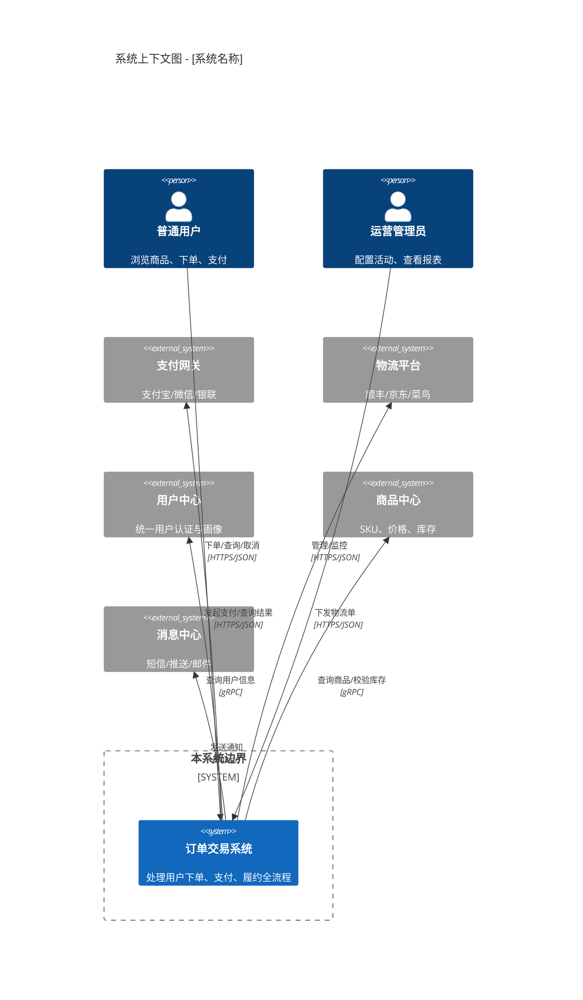

> **若平台不支持 C4Context 语法，可用以下标准 Mermaid 替代：**

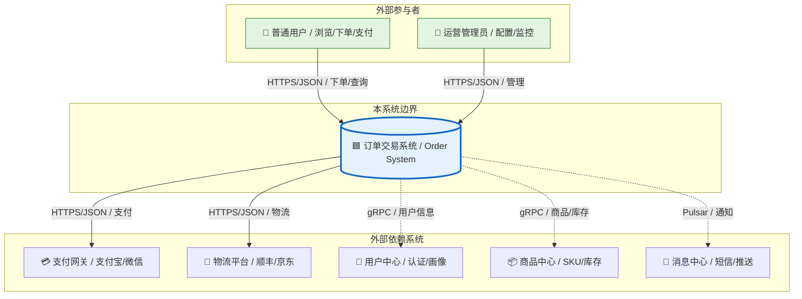

### 3.2 Level 2：容器图（Container Diagram）

> **受众：** 技术负责人、开发、测试、运维
>
> **抽象层级：** 10,000 英尺，描述系统内部的可部署单元（进程/服务/存储）及交互。

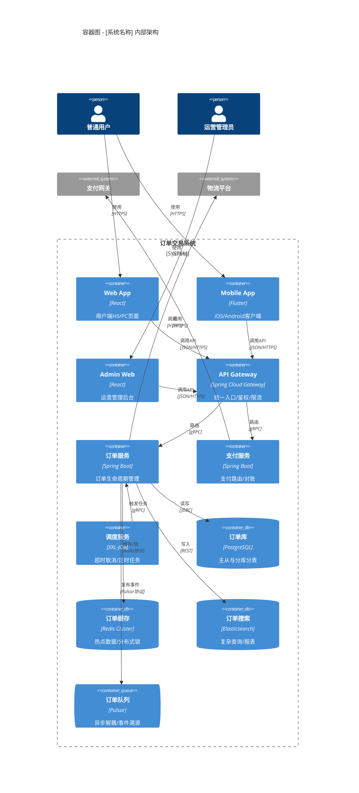

> **标准 Mermaid 替代方案：**

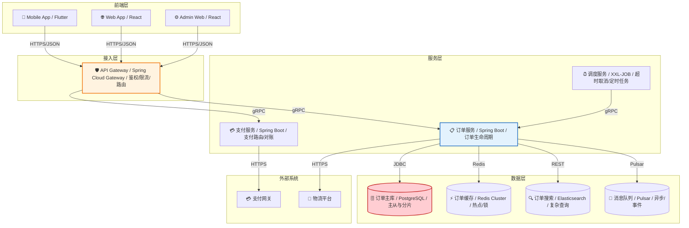

### 3.3 Level 3：组件图（Component Diagram）

> **受众：** 开发团队、架构师
>
> **抽象层级：** 1,000 英尺，描述单个容器内部的组件结构与交互。

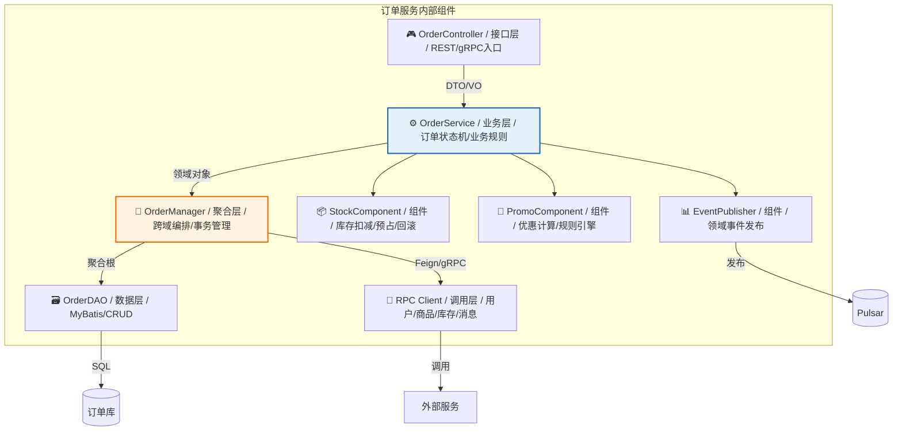

### 3.4 Level 4：代码/类图（Code Diagram）【可选】

> **受众：** 核心开发
>
> **说明：** 仅对核心复杂组件（如状态机、规则引擎）绘制，一般不建议全量产出，避免过度设计。

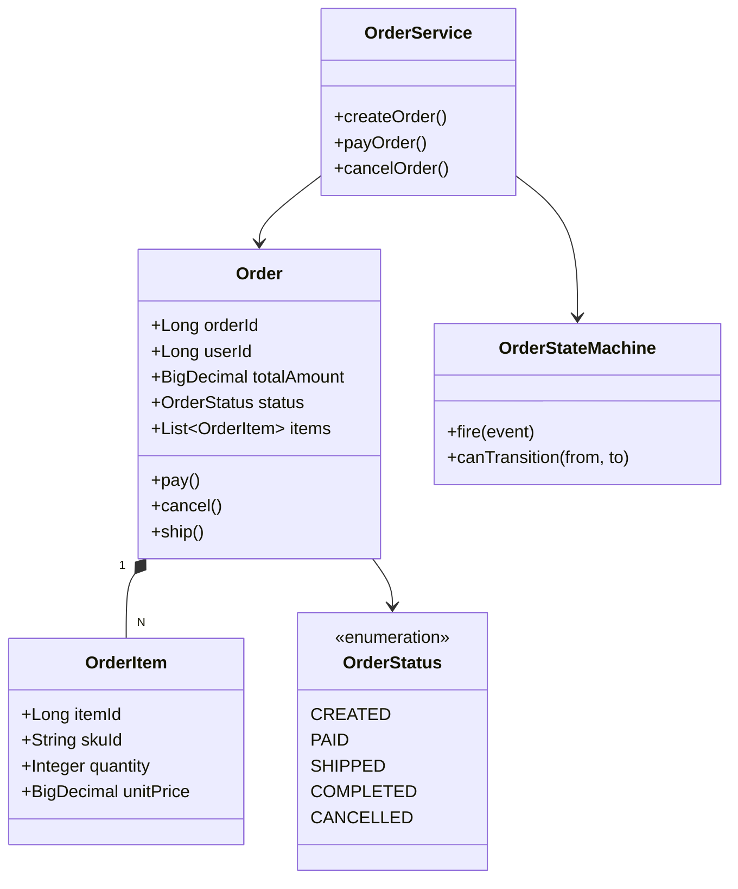

---

## 4. 动态行为视图（Dynamic Views）

> 描述关键场景的运行时行为，补充 C4 静态视图。

### 4.1 核心流程序列图

#### 场景：用户下单支付全流程

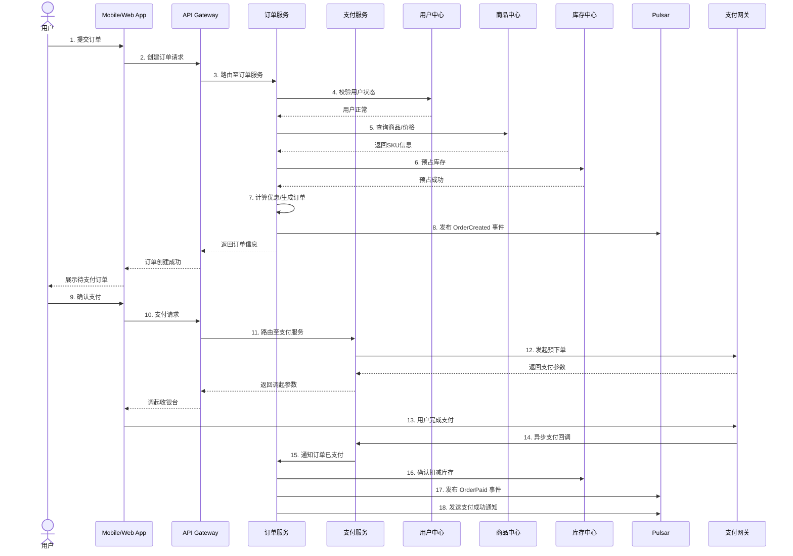

### 4.2 状态机图

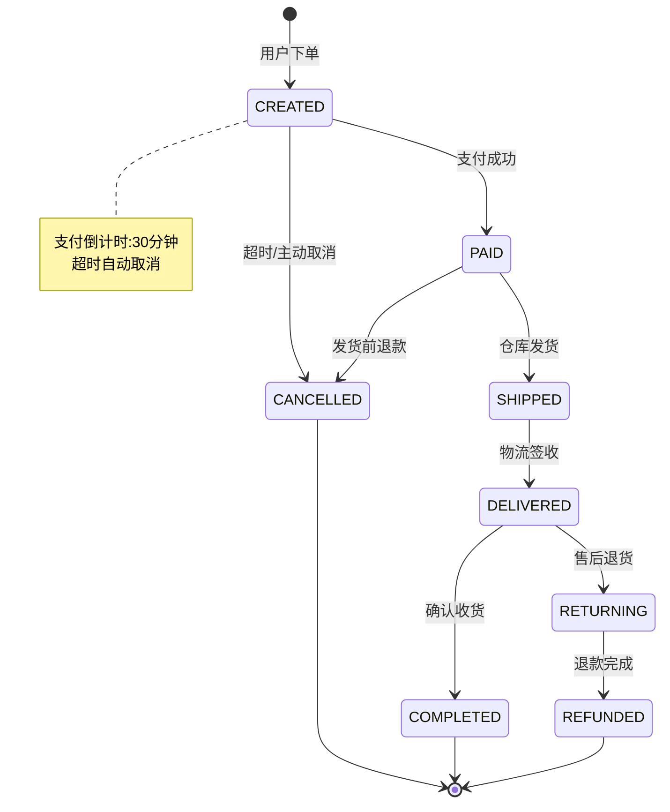

### 4.3 异常/补偿流程

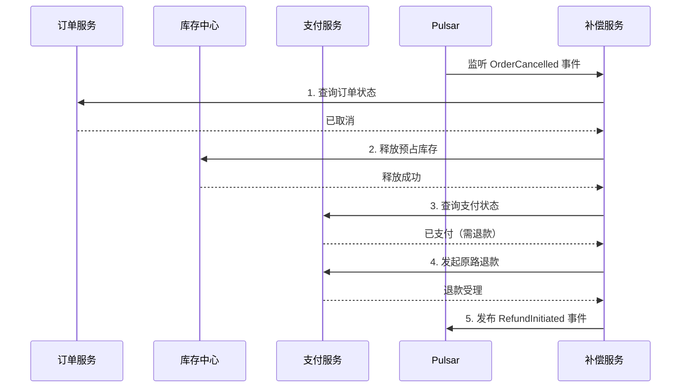

---

## 5. 部署架构（Deployment Architecture）

> 描述容器如何映射到基础设施，回答"跑在哪里、怎么容灾"。

### 5.1 部署拓扑图

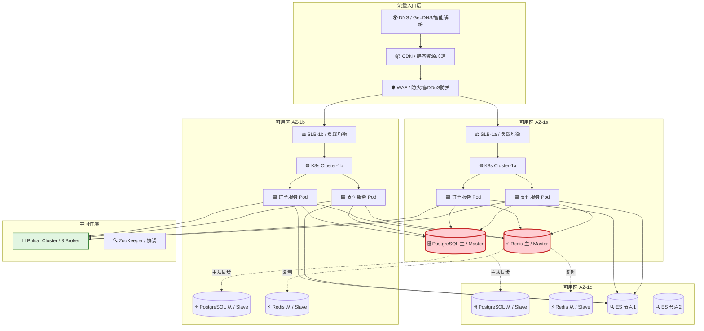

### 5.2 多活/容灾策略

| 策略           | 实现方式                                     |  RTO  | RPO  | 适用场景     |
| :------------- | :------------------------------------------- | :---: | :--: | :----------- |
| **同城双活**   | AZ-1a / AZ-1b 同时承接流量，数据库主从切换   |  30s  |  0s  | 机房级故障   |
| **异地冷备**   | AZ-2 定时备份，故障时手动切换                | 30min | 5min | 城市级灾难   |
| **数据多副本** | PostgreSQL 半同步复制 + Redis Cluster 3主3从 |   -   |  -   | 数据可靠性   |
| **降级预案**   | 库存校验降级读缓存 / 支付降级走兜底通道      |  5s   |  -   | 依赖服务故障 |

---

## 6. 数据架构（Data Architecture）

### 6.1 数据流图

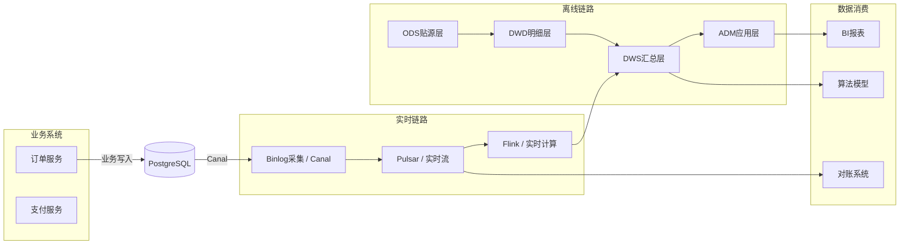

### 6.2 数据分片与路由

| 数据类型  | 分片键        | 分片策略               | 路由方式       |
| :-------- | :------------ | :--------------------- | :------------- |
| 订单主表  | `user_id`     | 128 分片，Hash 取模    | ShardingSphere |
| 订单明细  | `order_id`    | 与主表同分片（绑定表） | 本地路由       |
| 支付流水  | `order_id`    | 128 分片               | ShardingSphere |
| 日志/审计 | `create_time` | 按月分区               | 时间范围路由   |

---

## 7. 核心算法与机制设计（Core Mechanisms）

### 7.1 全局唯一ID生成

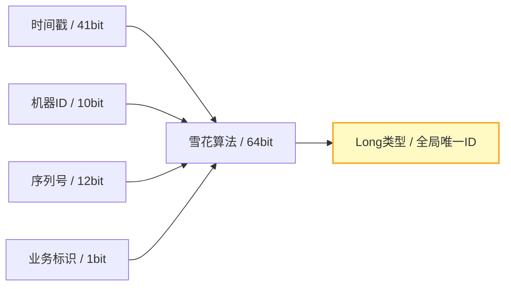

| 属性     | 设计值 | 说明                           |
| :------- | :----- | :----------------------------- |
| 时间戳位 | 41bit  | 支持约69年（从自定义起始时间） |
| 机器ID位 | 10bit  | 支持1024个节点                 |
| 序列号位 | 12bit  | 每节点每毫秒4096个ID           |
| 业务标识 | 1bit   | 区分不同业务线（订单/支付）    |

### 7.2 分布式锁设计

| 场景         | 实现方案        | Key设计                      | 过期时间 | 续期策略         |
| :----------- | :-------------- | :--------------------------- | :------: | :--------------- |
| 库存扣减     | Redis RedLock   | `lock:stock:{skuId}`         |   10s    | Watchdog自动续期 |
| 订单创建防重 | DB唯一索引      | `uniq:order:{userId}:{date}` |   永久   | 无需续期         |
| 支付回调幂等 | Redis SET NX EX | `lock:pay:{orderId}`         |   60s    | 业务完成主动释放 |

### 7.3 缓存策略

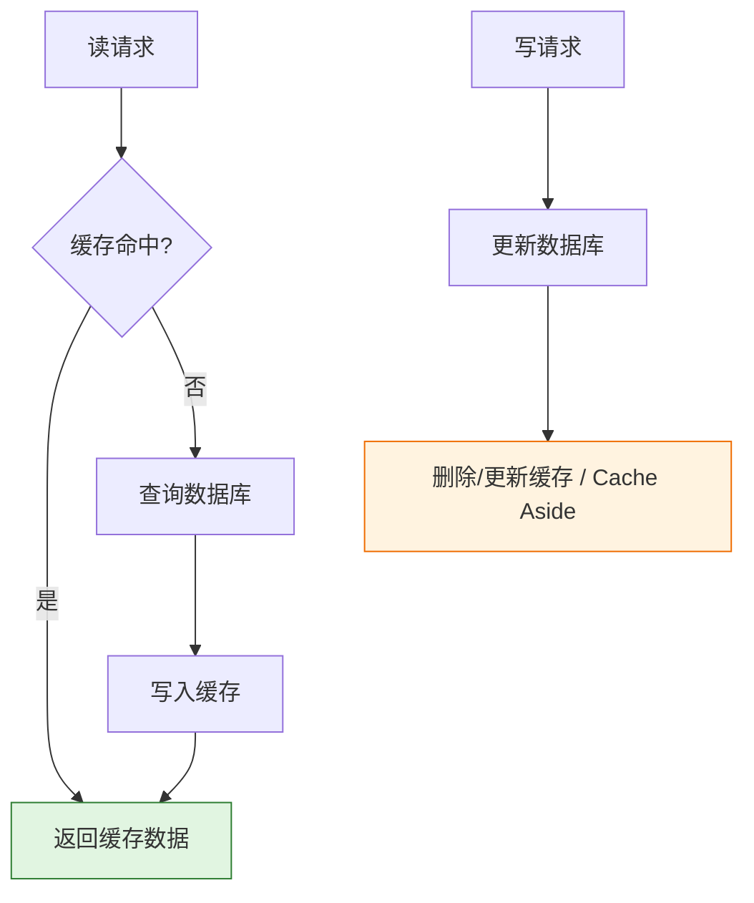

| 策略          | 适用场景     | 一致性等级 | 实现方式             |
| :------------ | :----------- | :--------- | :------------------- |
| Cache Aside   | 订单详情查询 | 最终一致   | 读时回源，写时删缓存 |
| Write Through | 库存实时扣减 | 强一致     | 同步写库+写缓存      |
| Read Through  | 商品基础信息 | 最终一致   | 缓存组件自动回源     |

---

## 8. 非功能需求设计（NFR / Quality Attributes）

### 8.1 性能设计

| 指标         | 目标值    | 达成手段                           |
| :----------- | :-------- | :--------------------------------- |
| **峰值 QPS** | ≥ 100,000 | 水平扩展 + 缓存预热 + 异步化       |
| **P99 延迟** | ≤ 200ms   | 本地缓存 + 数据库索引优化 + 连接池 |
| **并发连接** | ≥ 50,000  | 网关长连接优化 + K8s HPA           |

> **说明**：xychart-beta为飞书不兼容Mermaid类型，改为表格描述（模板示例数据）。

**性能容量规划**

| 时间节点 |   QPS   |
| :------- | :-----: |
| 当前     |  5,000  |
| 3个月后  | 30,000  |
| 6个月后  | 80,000  |
| 12个月后 | 120,000 |

### 8.2 高可用设计

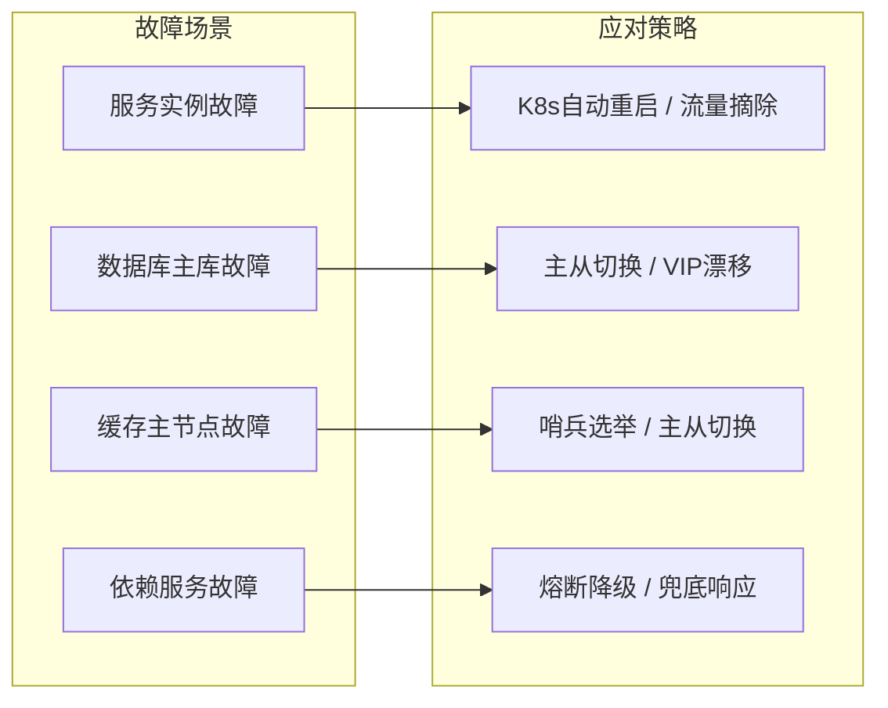

### 8.3 安全设计

| 层级       | 措施                               | 实现                           |
| :--------- | :--------------------------------- | :----------------------------- |
| **接入层** | HTTPS/TLS 1.3、WAF、DDoS防护       | 云厂商安全产品                 |
| **网关层** | OAuth2.1 + JWT、签名验签、限流防刷 | Spring Security + 自定义过滤器 |
| **服务层** | 零信任网络、mTLS、RBAC             | Istio Service Mesh             |
| **数据层** | 敏感字段加密、SQL注入防护          | AES-256-GCM + MyBatis参数化    |
| **审计层** | 全链路日志、操作审计               | SkyWalking + 审计表            |

---

## 9. 架构决策记录（ADR）

> 所有影响两个以上服务、或不可逆转的决策必须记录 ADR。

| 决策ID      | 决策内容       |   状态    | 上下文                             | 决策                          | 后果                             | 日期       |
| :---------- | :------------- | :-------: | :--------------------------------- | :---------------------------- | :------------------------------- | :--------- |
| **ADR-001** | 微服务 vs 单体 | ✅ 已采纳 | 团队>50人，需独立迭代              | 采用微服务，按领域拆分        | 运维复杂度增加，需建设DevOps能力 | YYYY-MM-DD |
| **ADR-002** | 数据库选型     | ✅ 已采纳 | 团队熟悉PostgreSQL，TiDB学习成本高 | PostgreSQL主从+分库分表       | 分片逻辑自研，中期可迁移TiDB     | YYYY-MM-DD |
| **ADR-003** | 分布式事务方案 | ✅ 已采纳 | 性能优先，允许短暂不一致           | Saga + 本地消息表（最终一致） | 需对账补偿机制，放弃强一致       | YYYY-MM-DD |
| **ADR-004** | 缓存一致性策略 | ✅ 已采纳 | 高并发读多写少                     | Cache Aside + 延迟双删        | 极端情况下存在短暂不一致         | YYYY-MM-DD |
| **ADR-005** | 部署方式       | ✅ 已采纳 | 弹性伸缩需求，云原生趋势           | K8s + Docker 容器化           | 需建设K8s运维能力                | YYYY-MM-DD |

### ADR 详细示例：ADR-003 分布式事务

```markdown
## ADR-003：分布式事务一致性方案

### 状态

已采纳 ✅

### 上下文

订单创建涉及订单库、库存库、优惠券库三个独立数据库，需保证数据一致性。

### 候选方案

1. **2PC/XA**：强一致，但阻塞性能差，不适合高并发。
2. **TCC**：性能较好，但业务侵入性高，需为每个操作写Try/Confirm/Cancel。
3. **Saga + 本地消息表**：最终一致，性能最好，通过异步补偿保证一致性。

### 决策

选择方案3：Saga + 本地消息表。

### 理由

- 业务场景允许秒级不一致（库存预占后未及时扣减不影响用户体验）
- 团队已有消息队列基础设施（Pulsar）
- 避免2PC的阻塞和单点问题

### 后果

- 需开发对账补偿服务，定时扫描异常状态订单
- 需建立人工介入流程，处理补偿失败订单
- 监控需覆盖"长时间未完结事务"告警
```

---

## 10. 风险评估与缓解（Risk Assessment）

> **引用说明**：项目级风险（商业风险、市场风险、人员风险）请参阅 **【模板】项目任务书.md §11.1**。本文档仅列出技术架构层面的风险。

| 风险ID    | 风险描述                       | 可能性 | 影响度 | 风险等级 | 缓解措施                              | 责任人 |
| :-------- | :----------------------------- | :----: | :----: | :------: | :------------------------------------ | :----- |
| **R-001** | 分库分表后跨分片查询性能差     |   高   |   高   |    🔴    | ES冗余全量数据，复杂查询走搜索        | [姓名] |
| **R-002** | 缓存雪崩导致DB被打挂           |   中   |   高   |    🔴    | 多级缓存+随机过期+熔断降级            | [姓名] |
| **R-003** | 消息队列消费延迟导致库存不一致 |   中   |   中   |    🟡    | 监控消费延迟，超阈值自动扩容消费者    | [姓名] |
| **R-004** | K8s集群故障导致全量服务不可用  |   低   |   高   |    🟡    | 同城双活+异地灾备，核心服务保留VM部署 | [姓名] |
| **R-005** | 第三方支付接口变更             |   中   |   中   |    🟡    | 抽象支付适配层，支持多渠道快速切换    | [姓名] |

> **项目级风险**：政策风险、市场风险、人员风险等项目级风险的完整登记册（含触发条件和退出条件）详见 **【模板】项目任务书.md §11.1**。

> **说明**：此象限图模板已转为表格描述。

<!--
原 quadrantChart 结构参考：
- title: 风险热力图（可能性 vs 影响度）
- x-axis: "低可能性" --> "高可能性"

- y-axis: "低影响度" --> "高影响度"
- quadrant-1: 重点关注（高/高）
- quadrant-2: 密切监控（低/高）
- quadrant-3: 一般关注（低/低）
- quadrant-4: 定期回顾（高/低）
- 数据点: "R-001 分片查询": [0.8, 0.9]; "R-002 缓存雪崩": [0.6, 0.9]; "R-003 消费延迟": [0.5, 0.6]; "R-004 K8s故障": [0.3, 0.9]; "R-005 支付变更": [0.5, 0.5]
  -->

| 象限                       | 区域特征          | 策略建议               |
| :------------------------- | :---------------- | :--------------------- |
| 象限1（高可能性·高影响度） | 重点关注（高/高） | 制定应急预案，定期演练 |
| 象限2（低可能性·高影响度） | 密切监控（低/高） | 设定预警阈值，持续跟踪 |
| 象限3（低可能性·低影响度） | 一般关注（低/低） | 常规管理，不必过度关注 |
| 象限4（高可能性·低影响度） | 定期回顾（高/低） | 建立流程化管理         |

| 名称           | X值 | Y值 | 象限              |
| :------------- | :-: | :-: | :---------------- |
| R-001 分片查询 | 0.8 | 0.9 | 象限1（重点关注） |
| R-002 缓存雪崩 | 0.6 | 0.9 | 象限1（重点关注） |
| R-003 消费延迟 | 0.5 | 0.6 | 象限1（重点关注） |
| R-004 K8s故障  | 0.3 | 0.9 | 象限2（密切监控） |
| R-005 支付变更 | 0.5 | 0.5 | 中线位置          |

---

## 11. 实施路线图（Implementation Roadmap）

> **说明**：甘特图为飞书不兼容类型，改为表格描述。

| 阶段     | 任务             | 开始日期       | 工期 | 状态 |
| :------- | :--------------- | :------------- | :--: | :--: |
| 基础设施 | K8s集群搭建      | YYYY-MM-DD     | 14d  |  ⚪  |
| 基础设施 | 中间件部署       | 集群搭建完成后 | 10d  |  ⚪  |
| 核心服务 | 订单服务开发     | YYYY-MM-DD     | 20d  |  ⚪  |
| 核心服务 | 支付服务开发     | YYYY-MM-DD     | 20d  |  ⚪  |
| 核心服务 | 集成测试         | 开发完成后     | 10d  |  ⚪  |
| 数据迁移 | 分库分表方案设计 | YYYY-MM-DD     | 10d  |  ⚪  |
| 数据迁移 | 双写迁移         | 方案设计完成后 | 15d  |  ⚪  |
| 数据迁移 | 切流验证         | 双写迁移完成后 | 10d  |  ⚪  |
| 上线     | 灰度发布         | 集成测试完成后 |  7d  |  ⚪  |
| 上线     | 全量上线         | 灰度发布完成后 |  3d  |  ⚪  |
| 上线     | 监控告警         | 全量上线完成后 |  5d  |  ⚪  |

| 阶段        | 里程碑           | 时间   | 交付物            | 通过标准               |
| :---------- | :--------------- | :----- | :---------------- | :--------------------- |
| **Phase 1** | 基础设施就绪     | T+2周  | K8s集群、中间件   | 压测通过               |
| **Phase 2** | 核心服务开发完成 | T+6周  | 订单/支付服务代码 | 单元测试>80%           |
| **Phase 3** | 数据迁移完成     | T+10周 | 双写验证报告      | 数据一致性校验通过     |
| **Phase 4** | 灰度上线         | T+12周 | 灰度监控报告      | P0事故=0，核心指标达标 |
| **Phase 5** | 全量上线         | T+13周 | 上线发布报告      | 业务验证通过           |

---

## 12. 附录（Appendix）

### 12.1 术语表

| 术语         | 定义                                              |
| :----------- | :------------------------------------------------ |
| **C4 Model** | Context/Container/Component/Code 四层架构描述模型 |
| **ADR**      | Architecture Decision Record，架构决策记录        |
| **Saga**     | 分布式事务模式，通过本地事务+补偿实现最终一致     |
| **RTO**      | Recovery Time Objective，恢复时间目标             |
| **RPO**      | Recovery Point Objective，恢复点目标              |
| **QPS**      | Queries Per Second，每秒查询数                    |
| **P99**      | 99%分位延迟                                       |

### 12.2 关联文档

| 文档                | 编号          | 链接   |
| :------------------ | :------------ | :----- |
| 产品需求文档（PRD） | PRD-2026-XXX  | [链接] |
| 数据字典            | DD-2026-XXX   | [链接] |
| 接口文档（API Doc） | API-2026-XXX  | [链接] |
| 测试方案            | TEST-2026-XXX | [链接] |
| 运维手册            | OPS-2026-XXX  | [链接] |

---

## 13. 评审签核（Review & Sign-off）

| 角色       | 姓名 | 签字 | 日期 | 评审意见 |
| :--------- | :--- | :--: | :--: | :------- |
| 技术负责人 |      |      |      |          |
| 架构师     |      |      |      |          |
| 开发代表   |      |      |      |          |
| 测试代表   |      |      |      |          |
| 运维代表   |      |      |      |          |
| 安全负责人 |      |      |      |          |
| 项目总监   |      |      |      |          |
