# [Product/System Name (English)] - Database Design Document (DDD)

> **Document Status:** 🟡 Under Review / 🟢 Approved / 🔴 Rejected
>
> **Confidentiality Level:** Confidential / Internal / Public
>
> **Version:** vX.X
>
> **Date:** YYYY-MM-DD
>
> **Author:** [Name/Role]
>
> **Reviewer:** [Name/Role]
>
> **Audience:** [Role List]
>
> **Document ID:** DB-2026-XXX
>
> **Service Name:** [e.g., Order Service]
>
> **Database Name:** [e.g., trade_db]
>
> **Character Set:** UTF8
>
> **Collation:** UTF8
>
> **Storage Engine:** PostgreSQL Default
>
> **Maintenance Team:** [DBA / Data Architecture / Backend Team]
>
> **Related Documents:** [Filename Line Range]

---

## 0. Document Guide

### 0.1 Purpose and Scope

[Describe the purpose, applicable scenarios, and non-applicable scenarios of this document]

### 0.2 Related Documents

| Document Type | Filename              | Related Section   |
| ------------- | --------------------- | ----------------- |
| [Type]        | [Filename] [Line Range] | [Section Description] |

> **Reference Format**: Related documents use the `Filename Line Range` format (e.g., `Template-DB-Design.md 3-31`). Line numbers may change as documents are updated. Please refer to actual content.

### 0.3 Change Log

| Version | Date       | Author  | Change Description                                                                                                                                                                                        | Reviewer     |
| :------ | :--------- | :------ | :-------------------------------------------------------------------------------------------------------------------------------------------------------------------------------------------------------- | :----------- |
| v0.1    | YYYY-MM-DD | [Name]  | Initial draft: t_order / t_order_item definition                                                                                                                                                          |              |
| v0.2    | YYYY-MM-DD | [Name]  | Added enum state machine diagram, sharding strategy                                                                                                                                                       |              |
| v0.3    | YYYY-MM-DD | [Name]  | Added data archiving, encryption, HA architecture                                                                                                                                                         |              |
| v0.4    | YYYY-MM-DD | [Name]  | Official release                                                                                                                                                                                          | [DBA Lead]   |
| v0.5    | 2026-06-20 | 谢董    | Root cause fix: primary key BIGINT UNSIGNED→UUID (application-layer UUIDv7), TINYINT→VARCHAR+CHECK, TINYINT(1)→BOOLEAN, JSON→JSONB, ON UPDATE→trigger, DDL examples fully PostgreSQL-ized (removed backticks/COMMENT table syntax/KEY inline indexes) | [DBA Lead]   |

---

## 1. Executive Summary

> **5-minute guide for Architects/DBAs/Developers:** What scale is this database designed for, how is it sharded, how is it archived, and what are the core constraints.

| Element          | Content                                                                |
| :--------------- | :--------------------------------------------------------------------- |
| **Data Scale**   | Daily increment [N]M rows, existing [M]B rows, estimated [X] years to reach [Y]B rows |
| **Core Tables**  | [N] main tables + [M] related tables + [P] log/audit tables            |
| **Sharding Strategy** | [e.g., sharded by user_id modulo into 16 databases, 64 tables per database] |
| **Archive Strategy** | [e.g., completed orders archived after 1 year, retained for 7 years]   |
| **Sensitivity Level** | [e.g., contains PII (phone/address) / financial data (amounts)]        |
| **HA Architecture** | [e.g., 1 primary 2 replicas + MGR / MHA automatic failover]           |

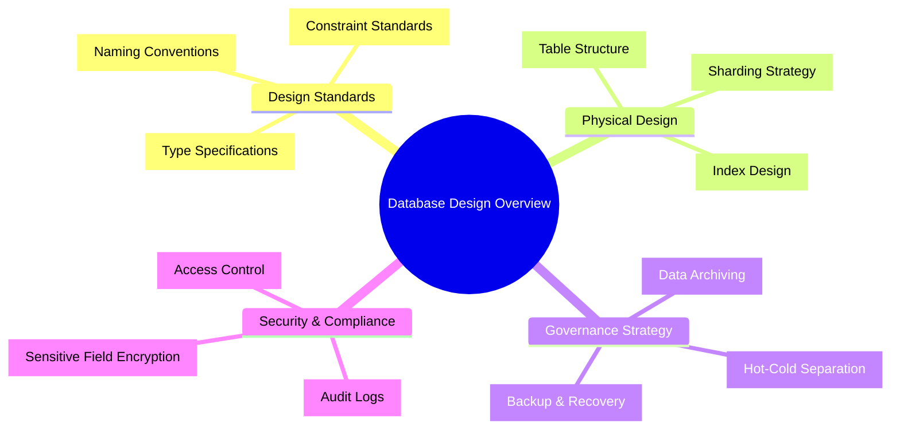

---

## 2. Design Standards

### 2.1 Naming Conventions

> Consistent naming is the foundation of team collaboration. Pinyin and abbreviations (except common ones) are prohibited.

| Object         | Naming Rule                      | Example                             | Anti-pattern               |
| :------------- | :------------------------------- | :---------------------------------- | :------------------------- |
| **Database**   | `business_domain_environment_seq` | `trade_prod_01`                     | `order_db`                 |
| **Table**      | `module_entity_suffix`, lowercase snake_case | `t_order_info` / `dwd_order_detail` | `OrderInfo` / `orderInfo` |
| **Column**     | Lowercase snake_case, semantically clear | `user_id` / `create_time`           | `uid` / `ctime`           |
| **Primary Key** | `pk_tablename`                  | `pk_t_order_info`                   | `PRIMARY`                  |
| **Unique Index** | `uk_tablename_columnname`       | `uk_t_order_info_order_id`          | `order_id_unique`          |
| **Index**      | `idx_tablename_columnname`       | `idx_t_order_info_user_id`          | `index_user_id`            |
| **Composite Index** | `idx_tablename_field1_field2` | `idx_t_order_info_user_status`      | `idx_1`                    |
| **Partition**  | `p_range_label`                 | `p_202605` / `p_202606`             | `partition1`               |

### 2.2 Data Type Standards

| Business Scenario | Recommended Type           | Description                              | Prohibited Type                                                    |
| :---------------- | :------------------------- | :--------------------------------------- | :----------------------------------------------------------------- |
| Primary/Foreign Key | `UUID`                   | Application-layer UUIDv7, no database auto-increment | `INT` (overflow risk) / `BIGINT UNSIGNED` (violates application-layer UUID rule) |
| Business Unique ID  | `VARCHAR(32)`            | Order number, transaction number, etc.  | `CHAR` (fixed-length waste)                                        |
| Amount/Exchange Rate | `DECIMAL(16,4)`         | Precise calculation, 4 decimal places   | `FLOAT` / `DOUBLE`                                                 |
| Short Text       | `VARCHAR(64/128/512)`    | Tiered by actual length                 | `TEXT` (index issues)                                               |
| Long Text/JSON   | `JSONB` / `TEXT`         | PostgreSQL prefers JSONB (supports GIN index) | `JSON` (poor performance) / `VARCHAR(9999)`                        |
| Status/Enum      | `VARCHAR + CHECK`        | Application-layer enum mapping, DB-layer CHECK constraint for valid values | `TINYINT` (MySQL-specific) / `INT` (unclear semantics) |
| Timestamp        | `TIMESTAMPTZ(3)`         | With milliseconds, timezone handled by application layer | `TIMESTAMP` (2038 problem)                                         |
| Boolean          | `BOOLEAN`                | `true/false`, PostgreSQL native type    | `TINYINT(1)` (MySQL-specific) / `BIT` / `CHAR(1)`                 |

### 2.3 Audit Fields

> All business tables must include the following fields, auto-populated by the framework.

| Field Name    | Type             | Default Value                            | Description                                        | Indexed |
| :------------ | :--------------- | :--------------------------------------- | :------------------------------------------------- | :-----: |
| `id`          | `UUID`           | Application-layer UUIDv7                 | Physical primary key (application-layer, no DB auto-increment) | PK |
| `create_time` | `TIMESTAMPTZ(3)` | `CURRENT_TIMESTAMP(3)`                   | Creation timestamp                                 | IDX |
| `update_time` | `TIMESTAMPTZ(3)` | `CURRENT_TIMESTAMP(3)`                   | Update timestamp (maintained by trigger, `ON UPDATE` prohibited) | - |
| `create_by`   | `UUID`           | `'00000000-0000-7000-8000-000000000000'` | Creator ID                                         | - |
| `update_by`   | `UUID`           | `'00000000-0000-7000-8000-000000000000'` | Updater ID                                         | - |
| `is_deleted`  | `BOOLEAN`        | `false`                                  | Soft delete flag (false=active, true=deleted)       | IDX |
| `tenant_id`   | `UUID`           | `'00000000-0000-7000-8000-000000000000'` | Multi-tenant identifier (if applicable)            | IDX |
| `version`     | `INT`            | `0`                                      | Optimistic lock version number                     | - |

---

## 3. Data Architecture & Layering

### 3.1 Data Layered Architecture

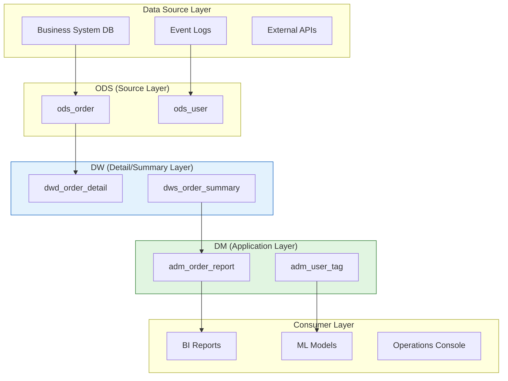

---

## 4. Logical Model Design

### 4.1 Domain Entity Relationship Diagram

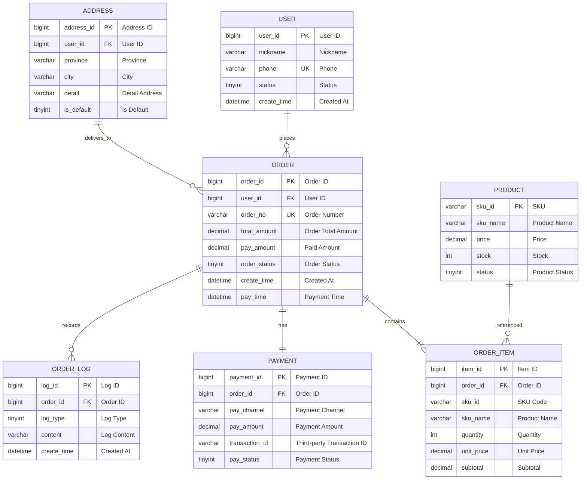

### 4.2 Entity List

| No.  | Entity Name   | Table Name       | Display Name   | Data Domain | Est. Rows | Sensitivity | Owner  |
| :--: | :------------ | :--------------- | :------------- | :---------- | :-------- | :---------- | :----- |
|  1   | `USER`       | `t_user`       | User Table     | User Domain | 100M      | 🔴 PII     | [Name] |
|  2   | `ORDER`      | `t_order`      | Order Main     | Trade Domain | 500M     | 🟡 Financial | [Name] |
|  3   | `ORDER_ITEM` | `t_order_item` | Order Detail   | Trade Domain | 2B       | 🟡 Financial | [Name] |
|  4   | `PRODUCT`    | `t_product`    | Product Table  | Product Domain | 5M    | 🟢 Public   | [Name] |
|  5   | `ADDRESS`    | `t_address`    | Shipping Address | User Domain | 30M    | 🔴 PII     | [Name] |
|  6   | `PAYMENT`    | `t_payment`    | Payment Record | Trade Domain | 500M   | 🟡 Financial | [Name] |
|  7   | `ORDER_LOG`  | `t_order_log`  | Order Log      | Trade Domain | 5B      | 🟢 Public   | [Name] |

### 4.3 Relationship Definition

| Child Table     | Child Field   | Parent Table   | Parent Field   | Relationship | Delete Behavior | Business Description        |
| :-------------- | :------------ | :------------- | :------------- | :----------- | :-------------- | :--------------------------- |
| `t_order`       | `user_id`     | `t_user`       | `user_id`     | `N:1`        | Restrict        | Cannot delete user with existing orders |
| `t_order`       | `address_id`  | `t_address`    | `address_id`  | `N:1`        | Set Null        | Order retains snapshot after address deletion |
| `t_order_item`  | `order_id`    | `t_order`      | `order_id`    | `N:1`        | Cascade         | Delete details when order is deleted |
| `t_order`       | `order_id`    | `t_payment`    | `order_id`    | `1:1`        | Cascade         | One-to-one payment record    |

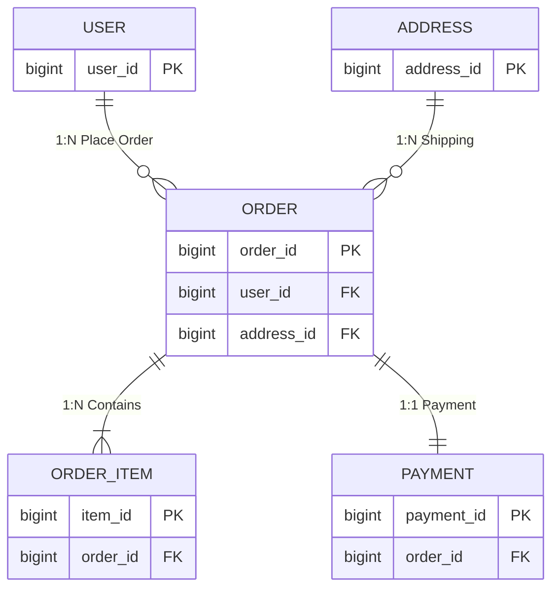

---

## 5. Physical Model Design

### 5.1 Table Definition: t_order (Order Main)

| Attribute      | Value                                                      |
| :------------- | :--------------------------------------------------------- |
| **Table Name** | `t_order`                                                  |
| **Display Name** | Order Main Table                                          |
| **Business Definition** | Records core order information including amounts, status, payment details |
| **Data Domain** | Trade Domain                                              |
| **Storage Engine** | PostgreSQL Default                                       |
| **Character Set** | UTF8                                                     |
| **Collation**  | UTF8                                                       |
| **Sharding Strategy** | Sharded into 1024 tables by `user_id` (16 DBs × 64 tables) |
| **Archive Strategy** | Orders migrated to archive database 1 year after completion |
| **Estimated Rows** | 500M (daily increment 1M)                               |
| **Owner**      | [Name]                                                     |

#### Field List

| No.  | Field Name       | Data Type        | Nullable | Default Value                          | Constraint     | Display Name  | Business Description                              | Example Value                            |
| :--: | :--------------- | :--------------- | :------: | :------------------------------------- | :------------- | :------------ | :------------------------------------------------- | :--------------------------------------- |
|  1   | `order_id`       | `UUID`           |   No     | Application-layer UUIDv7               | `PK`           | Order ID     | Application-layer UUIDv7 globally unique           | `0190a3b5-7e2f-7000-8000-000000000001`   |
|  2   | `order_no`       | `VARCHAR(32)`    |   No     | -                                      | `UK`           | Order Number | External display number, format `YYYYMMDD+6-digit sequence` | `20250525123456`                    |
|  3   | `user_id`        | `UUID`           |   No     | -                                      | `FK→t_user`    | User ID      | Ordering user                                      | `0190a3b5-7e2f-7000-8000-000000000002`   |
|  4   | `address_id`     | `UUID`           |   No     | -                                      | `FK→t_address` | Address ID   | Shipping address snapshot ID                      | `0190a3b5-7e2f-7000-8000-000000000003`   |
|  5   | `order_status`   | `VARCHAR(20)`    |   No     | `pending`                              | `CHECK`        | Order Status | Enum value, see §7.1                              | `paid`                                   |
|  6   | `total_amount`   | `DECIMAL(16,4)`  |   No     | `0.0000`                               | `CHECK>0`      | Total Amount | Sum of original product prices                    | `399.9800`                               |
|  7   | `discount_amount` | `DECIMAL(16,4)` |   No     | `0.0000`                               | `CHECK≥0`      | Discount Amount | Coupon + promotion discounts                    | `40.0000`                               |
|  8   | `pay_amount`     | `DECIMAL(16,4)`  |   No     | `0.0000`                               | `CHECK≥0`      | Paid Amount  | `total - discount`                                | `359.9800`                               |
|  9   | `pay_time`       | `TIMESTAMPTZ(3)` |   Yes    | `NULL`                                 | -              | Payment Time | Time user completed payment                       | `2026-05-25 10:35:22.123`                |
|  10  | `pay_channel`    | `VARCHAR(20)`    |   Yes    | `NULL`                                 | -              | Payment Channel | Enum value, see §7.2                            | `alipay`                                 |
|  11  | `source`         | `VARCHAR(20)`    |   No     | `unknown`                              | -              | Source Channel | Order source                                    | `app_ios`                                |
|  12  | `remark`         | `VARCHAR(500)`   |   Yes    | `NULL`                                 | -              | Order Remark | User message                                     | `Please ship soon`                       |
|  13  | `is_deleted`     | `BOOLEAN`        |   No     | `false`                                | -              | Is Deleted   | Soft delete flag                                  | `false`                                  |
|  14  | `create_time`    | `TIMESTAMPTZ(3)` |   No     | `CURRENT_TIMESTAMP(3)`                 | -              | Created At   | Order creation time                               | `2026-05-25 10:30:00.000`                |
|  15  | `update_time`    | `TIMESTAMPTZ(3)` |   No     | `CURRENT_TIMESTAMP(3)`                 | Trigger-maintained | Updated At | Auto-updated by trigger                          | `2026-05-25 10:35:22.123`                |
|  16  | `create_by`      | `UUID`           |   No     | `00000000-0000-7000-8000-000000000000` | -              | Created By   | System or user ID                                | `0190a3b5-7e2f-7000-8000-000000000002`   |
|  17  | `update_by`      | `UUID`           |   No     | `00000000-0000-7000-8000-000000000000` | -              | Updated By   | System or user ID                                | `0190a3b5-7e2f-7000-8000-000000000002`   |
|  18  | `version`        | `INT`            |   No     | `0`                                    | -              | Version      | Optimistic lock version number                    | `3`                                      |

#### Index Design

| Index Name                | Type   | Fields                                | Description              |
| :------------------------ | :----- | :------------------------------------ | :----------------------- |
| `pk_t_order`              | Primary | `order_id`                           | Clustered index          |
| `uk_t_order_order_no`     | Unique | `order_no`                           | Unique external number   |
| `idx_t_order_user_status` | Index  | `user_id, order_status, create_time` | User order list query    |
| `idx_t_order_create_time` | Index  | `create_time`                        | Time-range query/archiving |
| `idx_t_order_pay_time`    | Index  | `pay_time`                           | Financial reconciliation |

#### Business Rule Constraints

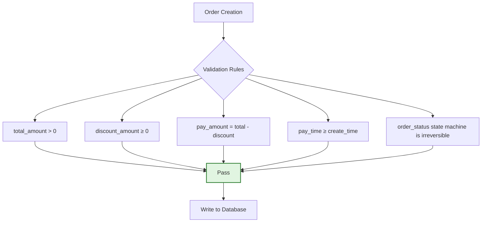

### 5.2 Table Definition: t_order_item (Order Detail)

| Attribute      | Value                                      |
| :------------- | :----------------------------------------- |
| **Table Name** | `t_order_item`                             |
| **Display Name** | Order Detail Table                        |
| **Business Definition** | Records purchase information for each SKU in an order |
| **Sharding Strategy** | Co-sharded with `t_order` (by `user_id`) |

#### Field List

| No.  | Field Name    | Data Type        | Nullable | Default Value              | Constraint     | Display Name | Business Description               |
| :--: | :------------ | :--------------- | :------: | :------------------------- | :------------- | :----------- | :---------------------------------- |
|  1   | `item_id`     | `UUID`           |   No     | Application-layer UUIDv7   | `PK`           | Item ID      | Application-layer UUIDv7           |
|  2   | `order_id`    | `UUID`           |   No     | -                          | `FK→t_order`   | Order ID     | Links to order main table          |
|  3   | `user_id`     | `UUID`           |   No     | -                          | -              | User ID      | Consistent with main table         |
|  4   | `sku_id`      | `VARCHAR(32)`    |   No     | -                          | -              | SKU Code     | Product unique identifier          |
|  5   | `sku_name`    | `VARCHAR(256)`   |   No     | -                          | -              | Product Name | Snapshot at order time             |
|  6   | `sku_image`   | `VARCHAR(512)`   |   Yes    | `NULL`                     | -              | Product Image | Snapshot at order time            |
|  7   | `quantity`    | `INT`            |   No     | `1`                        | `CHECK>0`      | Quantity     | Number of items purchased          |
|  8   | `unit_price`  | `DECIMAL(16,4)`  |   No     | `0.0000`                   | `CHECK>0`      | Unit Price   | Unit price at order time           |
|  9   | `subtotal`    | `DECIMAL(16,4)`  |   No     | `0.0000`                   | `CHECK>0`      | Subtotal     | `quantity × unit_price`            |
|  10  | `snapshot_id` | `VARCHAR(32)`    |   Yes    | `NULL`                     | -              | Snapshot ID  | Links to product history snapshot  |
|  11  | `create_time` | `TIMESTAMPTZ(3)` |   No     | `CURRENT_TIMESTAMP(3)`     | -              | Created At   | -                                   |
|  12  | `update_time` | `TIMESTAMPTZ(3)` |   No     | `CURRENT_TIMESTAMP(3)`     | Trigger-maintained | Updated At | Auto-updated by trigger            |

---

## 6. Sharding Design

### 6.1 Sharding Architecture

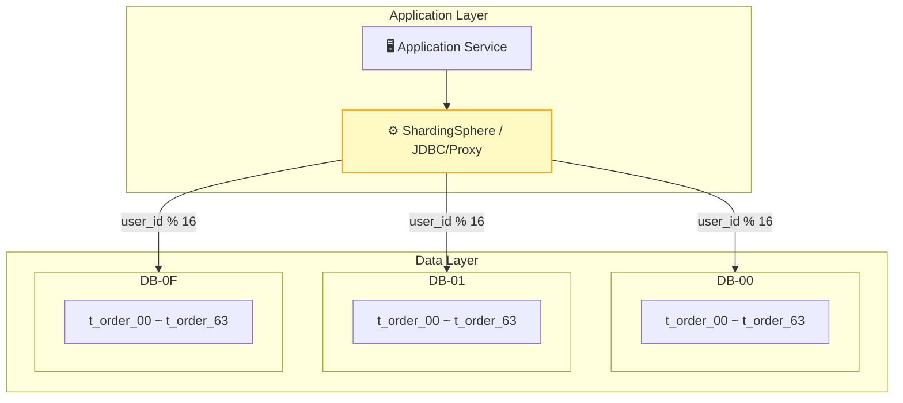

### 6.2 Sharding Strategy

| Dimension      | Strategy       | Description                                      |
| :------------- | :------------- | :----------------------------------------------- |
| **Shard Key**  | `user_id`      | Avoids cross-shard queries, ensures user-level data locality |
| **Shard Algorithm** | `user_id % 16` | 16 database instances                       |
| **Table Count** | 64 per database | 1024 tables total, each table under 5M rows     |
| **Routing Rule** | Middleware auto-routing | ShardingSphere-JDBC, transparent sharding logic |
| **Expansion Plan** | Consistent Hash | Supports smooth expansion, reduces data migration |

### 6.3 Binding Tables & Broadcast Tables

| Type           | Table Name                   | Description                               |
| :------------- | :--------------------------- | :---------------------------------------- |
| **Binding Table** | `t_order` + `t_order_item` | Same shard key, no cross-shard joins needed |
| **Binding Table** | `t_order` + `t_payment`    | Same shard key, no cross-shard joins needed |
| **Broadcast Table** | `t_region` / `t_config`  | Global table, full sync to every database, avoids cross-database JOIN |

---

## 7. Enumeration Dictionary

> All status, type, and channel enum values are maintained here. Magic numbers in code are prohibited.

### 7.1 Order Status (order_status)

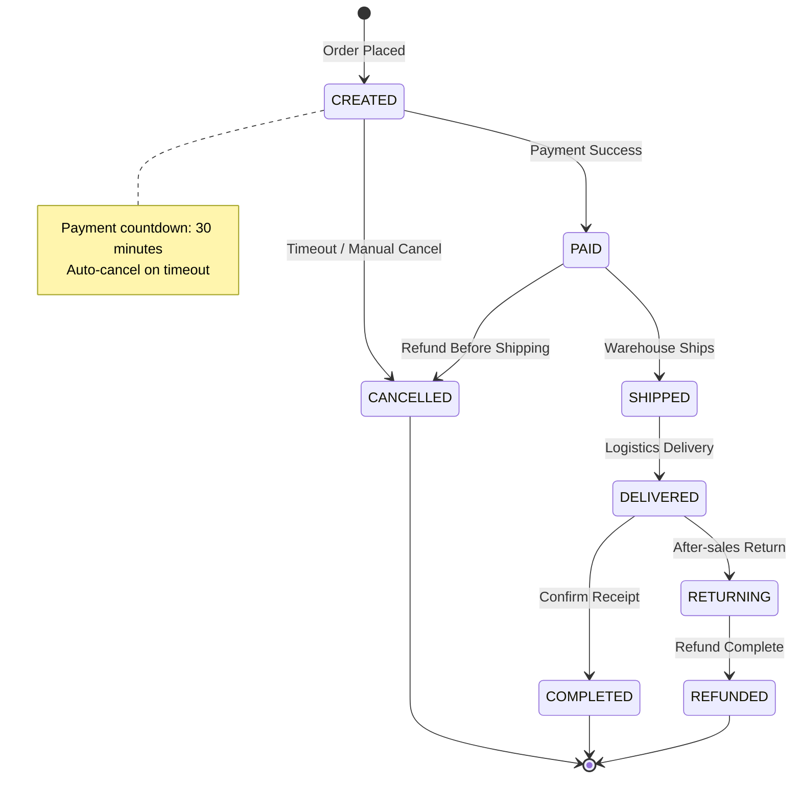

| Code | Name           | English ID    | Business Description             | Reversible | Dwell Time  |
| :--: | :------------- | :------------ | :------------------------------- | :--------: | :---------- |
| `10` | Pending Payment | `CREATED`   | Order created, awaiting payment  |     ❌     | ≤ 30 minutes |
| `20` | Paid           | `PAID`        | User completed payment           |     ❌     | -           |
| `30` | Shipped        | `SHIPPED`     | Warehouse dispatched             |     ❌     | -           |
| `40` | Delivered      | `DELIVERED`   | Logistics delivered              |     ❌     | -           |
| `50` | Completed      | `COMPLETED`   | User confirmed receipt           |     ❌     | -           |
| `60` | Cancelled      | `CANCELLED`   | Timeout unpaid or manual cancel  |     ❌     | -           |
| `70` | Returning      | `RETURNING`   | User initiated return            |     ✅     | ≤ 7 days    |
| `80` | Refunded       | `REFUNDED`    | Refund process complete          |     ❌     | -           |

### 7.2 Payment Channel (pay_channel)

| Code           | Name              | Description       |
| :------------- | :---------------- | :---------------- |
| `alipay`       | Alipay            | Domestic mainstream |
| `wechat`       | WeChat Pay        | Domestic mainstream |
| `unionpay`     | UnionPay QuickPass | Bank card payment |
| `apple_pay`    | Apple Pay         | iOS platform      |
| `credit_card`  | Credit Card       | Overseas payment  |

### 7.3 Source Channel (source)

| Code           | Name           | Description       |
| :------------- | :------------- | :---------------- |
| `app_ios`      | iOS App        | Apple client      |
| `app_android`  | Android App    | Android client    |
| `web`          | Web            | PC browser        |
| `mp`           | Mini Program   | WeChat Mini Program |
| `h5`           | H5 Page        | Mobile web page   |

---

## 8. Data Archiving & Lifecycle

### 8.1 Archive Strategy

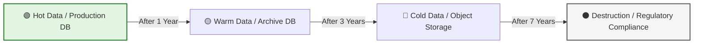

| Data Type          | Archive Condition                         | Archive Method     | Storage Medium            | Retention Period |
| :----------------- | :---------------------------------------- | :----------------- | :------------------------ | :--------------: |
| **Completed Orders** | Status=completed and `create_time` > 1 year | Migrate to archive DB | PostgreSQL (low-config) |     7 years      |
| **Cancelled Orders** | Status=cancelled and `create_time` > 6 months | Migrate to archive DB | PostgreSQL (low-config) | 3 years |
| **Payment Records** | `create_time` > 1 year                    | Migrate to archive DB | PostgreSQL (low-config) |     7 years      |
| **Order Logs**     | `create_time` > 90 days                   | Migrate to object storage | OSS / S3            |     1 year       |
| **Operation Audit** | `create_time` > 1 year                    | Compressed storage | OSS / S3                  |     3 years      |

### 8.2 Archive Execution Process

| Step           | Operation                     | Tool            | Validation       |
| :------------- | :---------------------------- | :-------------- | :--------------- |
| 1. Data Filtering | Filter archive-eligible data by time range | SQL scripts | Sample verification |
| 2. Data Export  | Export to CSV / Parquet       | pg_dump / Spark | Row count check  |
| 3. Data Migration | Write to archive DB / object storage | DataX / Flink | MD5 verification |
| 4. Data Cleanup | Delete archived data from production DB | Scheduled task | Space release confirmation |
| 5. Index Rebuild | Rebuild production DB indexes | OPTIMIZE TABLE  | Query performance verification |

---

## 9. Data Lineage

> Describes the complete data flow from production to consumption, facilitating impact analysis and troubleshooting.

### 9.1 Order Data Lineage

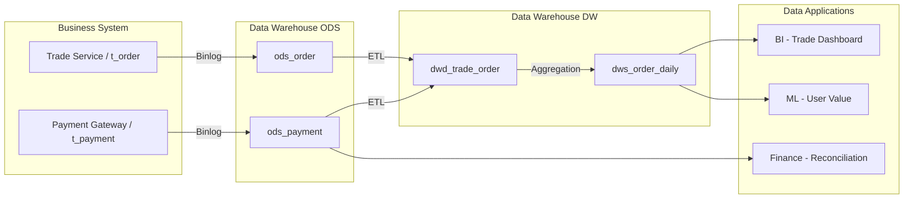

### 9.2 Field-level Lineage Example

| Field         | Upstream Source                  | Computation Logic   | Downstream Consumer                         |
| :------------ | :------------------------------- | :------------------ | :------------------------------------------- |
| `pay_amount`  | `t_order.pay_amount`             | Raw value           | BI Reports / Finance Reconciliation / User Value Model |
| `gmv_daily`   | `dwd_trade_order.pay_amount`     | `SUM(pay_amount)`   | Management Daily / Operations Console        |
| `user_ltv`    | `dws_order_daily.gmv`            | Attribution model calculation | Marketing / Membership System          |

---

## 10. High Availability & Disaster Recovery

### 10.1 Deployment Architecture

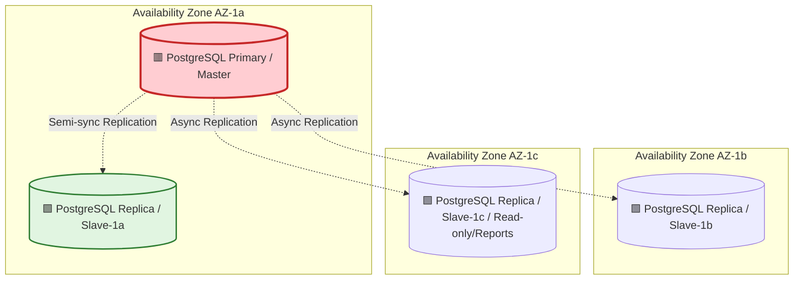

### 10.2 Disaster Recovery Strategy

| Strategy           |   RTO    |     RPO      | Implementation Method                     |
| :----------------- | :------: | :----------: | :---------------------------------------- |
| **Primary-Replica Failover** | < 30s  | 0s (semi-sync) | MHA / MGR automatic failover          |
| **Cross-AZ DR**    | < 2min   |     < 5s     | Async replication, manual replica promotion on failure |
| **Remote Backup**  | < 4h     |     < 1h     | Daily full backup + Binlog incremental    |
| **Flashback Recovery** | < 10min |      -       | Binlog flashback tool (incident recovery) |

---

## 11. Security & Compliance

### 11.1 Sensitive Field Encryption

| Field            | Sensitivity | Encryption Method     | Storage Form | Access Control   |
| :--------------- | :---------- | :-------------------- | :----------- | :--------------- |
| `phone`          | 🔴 High    | AES-256-GCM           | Ciphertext   | Self/Customer Service only |
| `address_detail` | 🔴 High    | AES-256-GCM           | Ciphertext   | Self/Logistics only |
| `id_card`        | 🔴 High    | AES-256-GCM           | Ciphertext   | Identity verification system only |
| `pay_amount`     | 🟡 Medium  | Plaintext             | Raw value    | Finance/Self     |
| `bank_card`      | 🔴 High    | AES-256-GCM + Masking | Masked display | Payment system only |

### 11.2 Data Masking Strategy

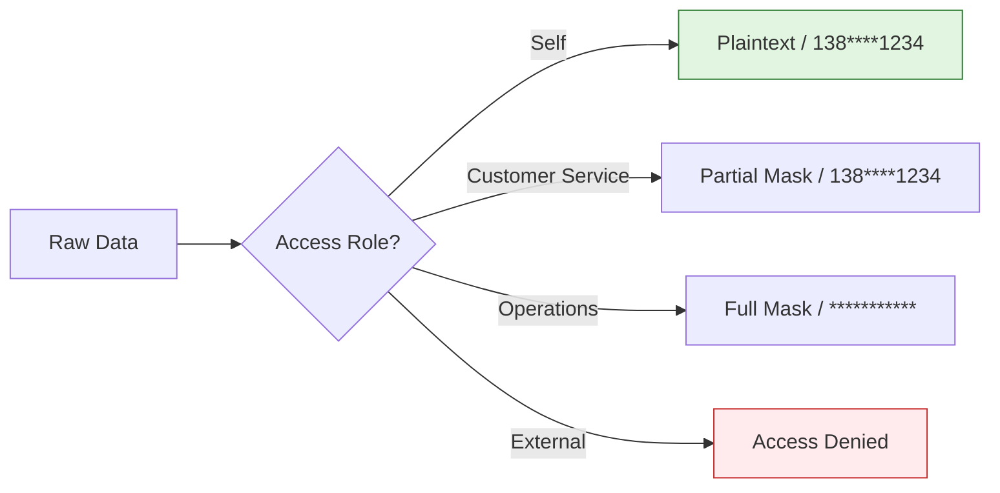

### 11.3 Audit Requirements

| Audit Item       | Recorded Content                       | Retention Period |
| :--------------- | :------------------------------------- | :--------------: |
| **Data Changes** | Operator, timestamp, before/after values, SQL |    3 years      |
| **Data Export**  | Exporter, timestamp, row count, purpose |    3 years      |
| **Permission Changes** | Modifier, timestamp, permission item, reason | 5 years |
| **Login Access** | IP, timestamp, account, action result  |    1 year       |

---

## 12. Physical DDL

### 12.1 Table Creation Statements

```sql
-- Order Main Table
CREATE TABLE t_order (
  order_id           UUID                NOT NULL DEFAULT gen_random_uuid() COMMENT 'Order ID, application-layer UUIDv7',
  order_no           VARCHAR(32)         NOT NULL COMMENT 'Order number, external display',
  user_id            UUID                NOT NULL COMMENT 'User ID, application-layer UUIDv7',
  address_id         UUID                NOT NULL COMMENT 'Shipping address ID',
  order_status       VARCHAR(20)         NOT NULL DEFAULT 'pending' CHECK (order_status IN ('pending','paid','shipped','received','completed','cancelled','returning','refunded')) COMMENT 'Order status: pending=pending payment, paid=paid, shipped=shipped, received=delivered, completed=completed, cancelled=cancelled, returning=returning, refunded=refunded',
  total_amount       DECIMAL(16,4)       NOT NULL DEFAULT 0.0000 COMMENT 'Order total amount',
  discount_amount    DECIMAL(16,4)       NOT NULL DEFAULT 0.0000 COMMENT 'Discount amount',
  pay_amount         DECIMAL(16,4)       NOT NULL DEFAULT 0.0000 COMMENT 'Paid amount',
  pay_time           TIMESTAMPTZ(3)              NULL COMMENT 'Payment time',
  pay_channel        VARCHAR(20)                 NULL COMMENT 'Payment channel: alipay/wechat/unionpay/apple_pay/credit_card',
  source             VARCHAR(20)         NOT NULL DEFAULT 'unknown' COMMENT 'Source channel: app_ios/app_android/web/mp/h5',
  remark             VARCHAR(500)               NULL COMMENT 'Order remark',
  is_deleted         BOOLEAN             NOT NULL DEFAULT false COMMENT 'Soft delete: false=no, true=yes',
  create_time        TIMESTAMPTZ(3)      NOT NULL DEFAULT CURRENT_TIMESTAMP(3) COMMENT 'Created at',
  update_time        TIMESTAMPTZ(3)      NOT NULL DEFAULT CURRENT_TIMESTAMP(3) COMMENT 'Updated at',
  create_by          UUID                NOT NULL DEFAULT '00000000-0000-7000-8000-000000000000' COMMENT 'Created by',
  update_by          UUID                NOT NULL DEFAULT '00000000-0000-7000-8000-000000000000' COMMENT 'Updated by',
  version            INT                 NOT NULL DEFAULT 0 COMMENT 'Optimistic lock version number',
  PRIMARY KEY (order_id),
  CONSTRAINT uk_t_order_order_no UNIQUE (order_no)
);
CREATE INDEX idx_t_order_user_status ON t_order (user_id, order_status, create_time);
CREATE INDEX idx_t_order_create_time ON t_order (create_time);
CREATE INDEX idx_t_order_pay_time ON t_order (pay_time);

CREATE OR REPLACE FUNCTION update_t_order_updated_at()
RETURNS TRIGGER AS $$
BEGIN
    NEW.update_time = CURRENT_TIMESTAMP(3);
    RETURN NEW;
END;
$$ LANGUAGE plpgsql;

CREATE TRIGGER trg_t_order_updated_at
    BEFORE UPDATE ON t_order
    FOR EACH ROW
    EXECUTE FUNCTION update_t_order_updated_at();

-- Order Detail Table
CREATE TABLE t_order_item (
  item_id            UUID                NOT NULL DEFAULT gen_random_uuid() COMMENT 'Item ID, application-layer UUIDv7',
  order_id           UUID                NOT NULL COMMENT 'Order ID',
  user_id            UUID                NOT NULL COMMENT 'User ID, consistent with main table',
  sku_id             VARCHAR(32)         NOT NULL COMMENT 'SKU code',
  sku_name           VARCHAR(256)        NOT NULL COMMENT 'Product name (snapshot)',
  sku_image          VARCHAR(512)               NULL COMMENT 'Product image URL (snapshot)',
  quantity           INT                 NOT NULL DEFAULT 1 CHECK (quantity > 0) COMMENT 'Quantity',
  unit_price         DECIMAL(16,4)       NOT NULL DEFAULT 0.0000 COMMENT 'Unit price',
  subtotal           DECIMAL(16,4)       NOT NULL DEFAULT 0.0000 COMMENT 'Subtotal amount',
  snapshot_id        VARCHAR(32)                NULL COMMENT 'Product snapshot ID',
  create_time        TIMESTAMPTZ(3)      NOT NULL DEFAULT CURRENT_TIMESTAMP(3) COMMENT 'Created at',
  update_time        TIMESTAMPTZ(3)      NOT NULL DEFAULT CURRENT_TIMESTAMP(3) COMMENT 'Updated at',
  PRIMARY KEY (item_id),
  CONSTRAINT fk_t_order_item_order_id FOREIGN KEY (order_id) REFERENCES t_order(order_id)
);
CREATE INDEX idx_t_order_item_order_id ON t_order_item (order_id);
CREATE INDEX idx_t_order_item_user_id ON t_order_item (user_id);

CREATE OR REPLACE FUNCTION update_t_order_item_updated_at()
RETURNS TRIGGER AS $$
BEGIN
    NEW.update_time = CURRENT_TIMESTAMP(3);
    RETURN NEW;
END;
$$ LANGUAGE plpgsql;

CREATE TRIGGER trg_t_order_item_updated_at
    BEFORE UPDATE ON t_order_item
    FOR EACH ROW
    EXECUTE FUNCTION update_t_order_item_updated_at();
```

### 12.2 Partitioning & Storage Strategy

| Table Name      | Partition Strategy              | Sharding Strategy           | Storage Cycle   | Compression Strategy |
| :-------------- | :------------------------------ | :-------------------------- | :-------------- | :------------------- |
| `t_order`       | Yearly partition by `create_time` | 1024 shards by `user_id`  | Hot data 1 year | Cold data ZSTD       |
| `t_order_item`  | Same as main table              | Same as main table          | Hot data 1 year | Cold data ZSTD       |
| `t_payment`     | Monthly partition by `create_time` | 1024 shards by `user_id` | Hot data 1 year | Cold data ZSTD       |
| `t_order_log`   | Monthly partition by `create_time` | 1024 shards by `user_id` | Hot data 90 days | Cold data ZSTD     |

---

## 13. Data Quality Rules

| Rule ID  | Field          | Rule Type | Rule Definition                              | Alert Level | Handling Strategy |
| :------- | :------------- | :-------- | :------------------------------------------- | :---------- | :---------------- |
| DQ-001   | `total_amount` | Completeness | Not null and > 0                          | 🔴 Blocking | Reject write      |
| DQ-002   | `pay_amount`   | Consistency | `pay_amount = total_amount - discount_amount` | 🔴 Blocking | Reject write    |
| DQ-003   | `order_no`     | Uniqueness | Globally unique                              | 🔴 Blocking | Reject write      |
| DQ-004   | `pay_time`     | Timeliness | `pay_time ≥ create_time`                     | 🟡 Warning | Log record        |
| DQ-005   | `order_status` | Validity  | Value within enum range                      | 🟡 Warning | Log record        |

---

## 14. Appendix

### 14.1 Glossary

| Term                | Definition                                                      |
| :------------------ | :-------------------------------------------------------------- |
| **PII**             | Personally Identifiable Information                              |
| **MGR**             | PostgreSQL Group Replication                                     |
| **MHA**             | PostgreSQL Master High Availability (Patroni/repmgr)             |
| **ZSTD**            | Zstandard compression algorithm                                  |
| **Semi-sync Replication** | Semi-Synchronous Replication, primary waits for at least one replica confirmation |
| **Consistent Hash** | Consistent Hashing, a sharding algorithm commonly used in distributed systems |
| **ODS/DWD/DWS/ADM** | Data warehouse layers: Source, Detail, Summary, Application      |

### 14.2 Related Documents

| Document            | ID           | Link   |
| :------------------ | :----------- | :----- |
| Product Requirements Document (PRD) | PRD-2026-XXX | [Link] |
| Technical Requirements Document (TRD) | TRD-2026-XXX | [Link] |
| API Documentation    | API-2026-XXX | [Link] |
| Data Security Specification | SEC-2026-XXX | [Link] |

---

## 15. Design Review Sign-off

| Role            | Name | Signature | Date  | Review Comments                 |
| :-------------- | :--- | :-------: | :---: | :------------------------------ |
| **DBA Lead**    |      |           |       | [Storage/Performance/HA Confirmation] |
| **Architect**   |      |           |       | [Sharding/Scalability Confirmation]  |
| **Backend Lead** |      |          |       | [ORM/Query Confirmation]        |
| **Security Lead** |     |           |       | [Encryption/Masking/Compliance Confirmation] |
| **Data Lead**   |      |           |       | [Archiving/Data Quality Rule Confirmation] |
