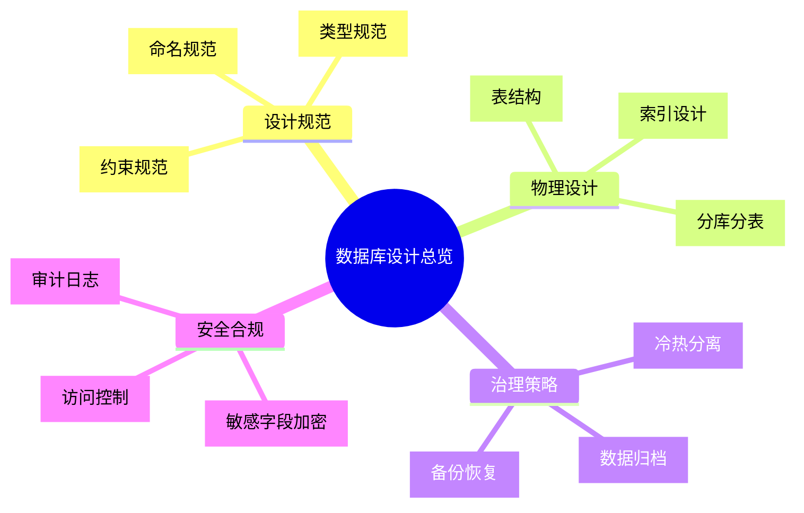
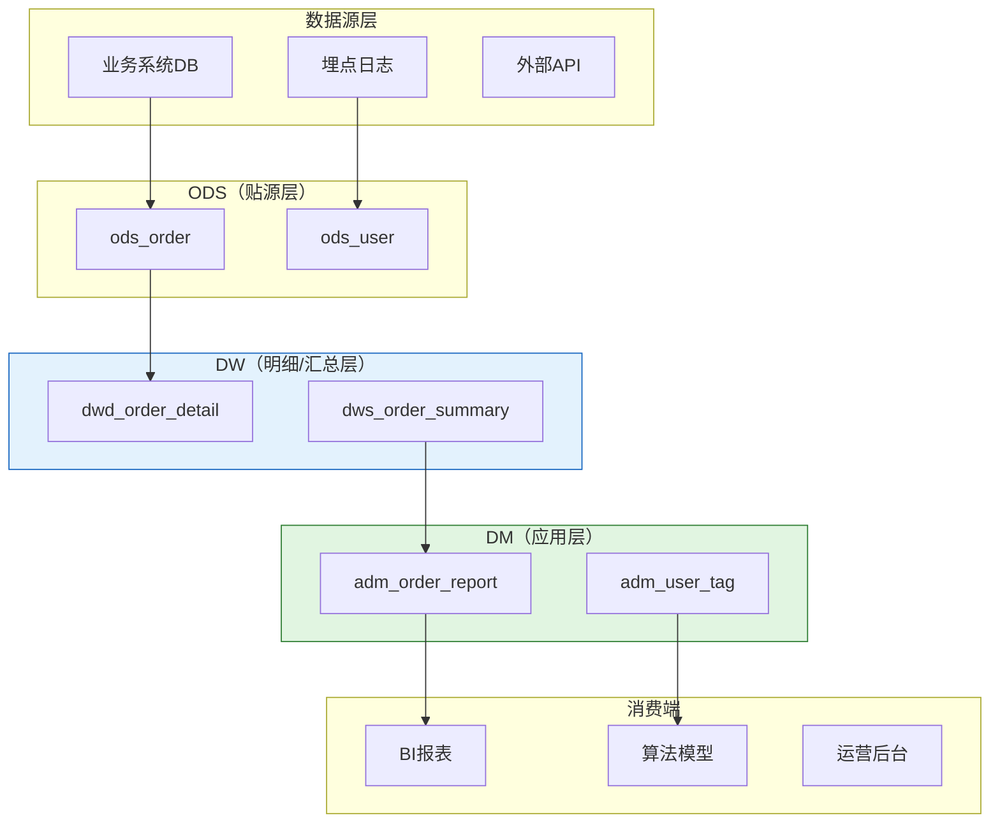
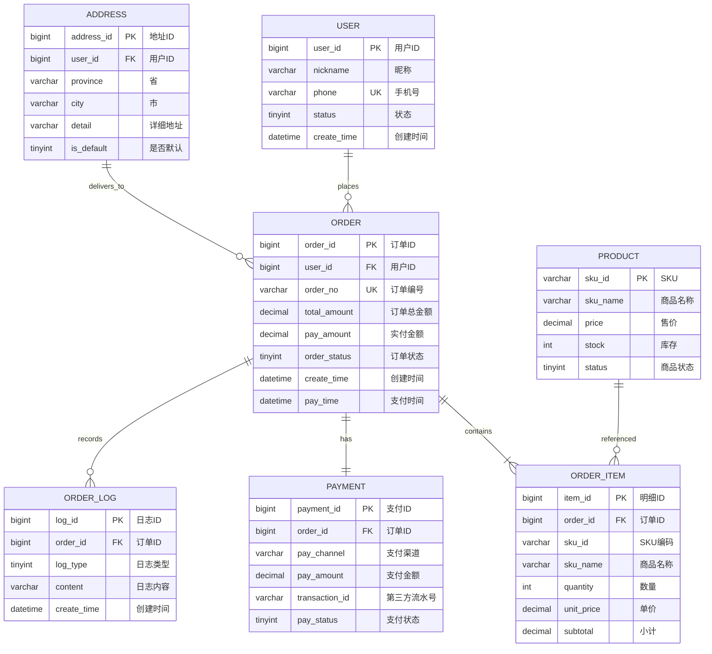
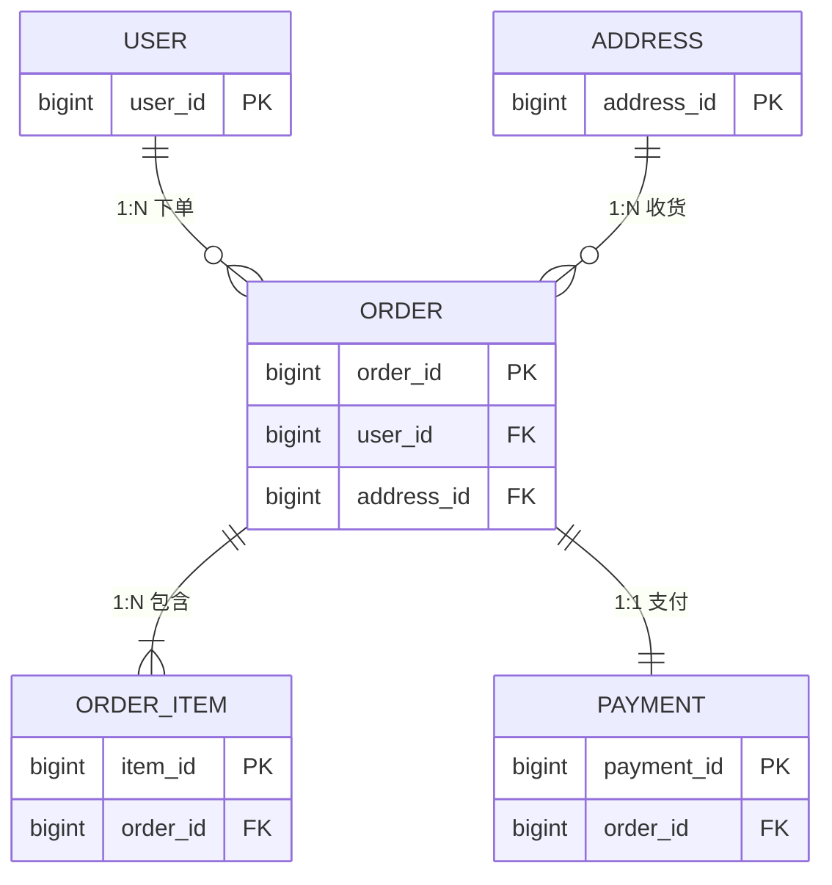
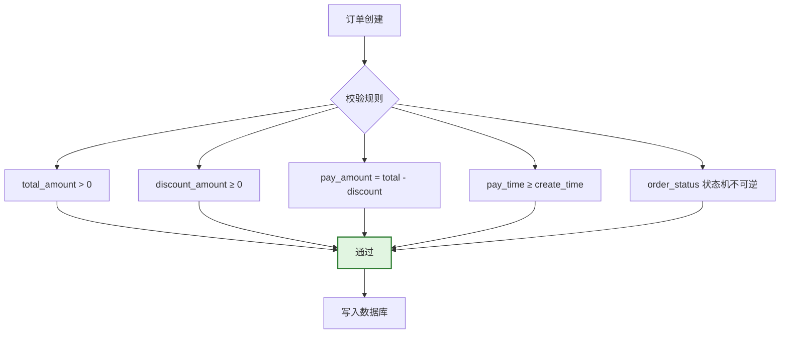
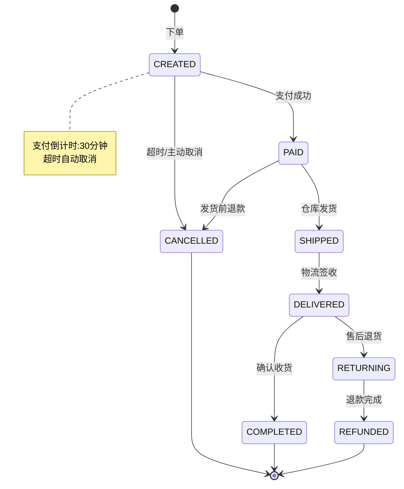
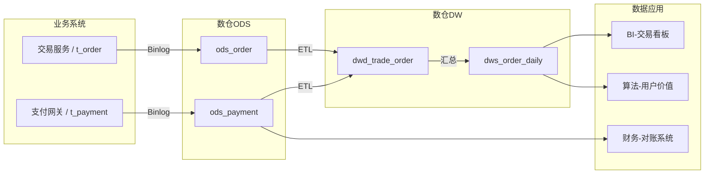
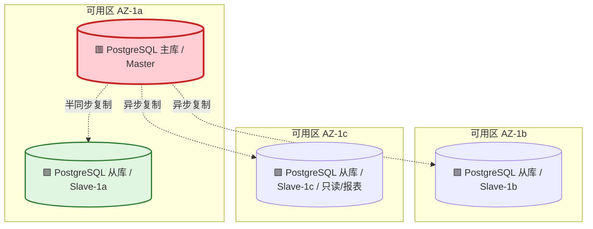
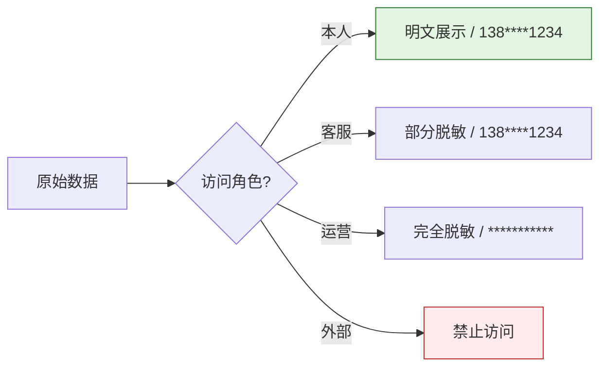

# [产品/系统名称（英文名）] - 数据库设计文档（DDD）

> **文档状态：** 🟡 评审中 / 🟢 已通过 / 🔴 驳回
>
> **保密级别：** 机密 / 内部公开 / 公开
>
> **版本：** vX.X
>
> **日期：** YYYY-MM-DD
>
> **撰写人：** [姓名/角色]
>
> **评审人：** [姓名/角色]
>
> **阅读对象：** [角色列表]
>
> **文档编号：** DB-2026-XXX
>
> **服务名称：** [如：订单服务]
>
> **数据库名：** [如：trade_db]
>
> **字符集：** UTF8
>
> **排序规则：** UTF8
>
> **存储引擎：** PostgreSQL 默认存储引擎
>
> **维护团队：** [DBA / 数据架构组 / 后端团队]
>
> **关联文档：** [文件名 行号范围]

---

## 0. 文档导读

### 0.1 文档目的与适用范围

[说明本文档的目的、适用场景和不适用场景]

### 0.2 相关文档

| 文档类型 | 文件名              | 相关章节   |
| -------- | ------------------- | ---------- |
| [类型]   | [文件名] [行号范围] | [章节描述] |

> **引用格式说明**：关联文档使用 `文件名 行号范围` 格式（如 `【模板】数据库设计文档规范.md 3-31`），行号随文档更新可能变化，请以实际内容为准。

### 0.3 变更记录

| 版本 | 日期       | 修订人 | 变更内容                                                                                                                                                                                            | 审核人      |
| :--- | :--------- | :----- | :-------------------------------------------------------------------------------------------------------------------------------------------------------------------------------------------------- | :---------- |
| v0.1 | YYYY-MM-DD | [姓名] | 初稿：t_order / t_order_item 定义                                                                                                                                                                   |             |
| v0.2 | YYYY-MM-DD | [姓名] | 新增枚举值状态机图、分库分表策略                                                                                                                                                                    |             |
| v0.3 | YYYY-MM-DD | [姓名] | 补充数据归档、安全加密、高可用架构                                                                                                                                                                  |             |
| v0.4 | YYYY-MM-DD | [姓名] | 正式发布                                                                                                                                                                                            | [DBA负责人] |
| v0.5 | 2026-06-20 | 谢董   | 根因修复：主键 BIGINT UNSIGNED→UUID（应用层 UUIDv7）、TINYINT→VARCHAR+CHECK、TINYINT(1)→BOOLEAN、JSON→JSONB、ON UPDATE→触发器、DDL 示例全面 PostgreSQL 化（移除反引号/COMMENT 表语法/KEY 内联索引） | [DBA负责人] |

---

## 1. 执行摘要（Executive Summary）

> **架构师/DBA/开发 5 分钟导读：** 本数据库设计什么规模、怎么分片、怎么归档、核心约束是什么。

| 要素           | 内容                                                   |
| :------------- | :----------------------------------------------------- |
| **数据规模**   | 日增 [N] 万条，存量 [M] 亿条，预计 [X] 年达到 [Y] 亿条 |
| **核心表数**   | [N] 张主表 + [M] 张关联表 + [P] 张日志/审计表          |
| **分片策略**   | [如：按 user_id 取模分 16 库，每库 64 表]              |
| **归档策略**   | [如：已完成订单 1 年后归档，保留 7 年]                 |
| **敏感等级**   | [如：含 PII（手机号/地址）/ 金融数据（金额）]          |
| **高可用架构** | [如：一主两从 + MGR / MHA 自动切换]                    |



---

## 2. 设计规范与标准（Design Standards）

### 2.1 命名规范

> 统一命名是团队协作的基础，禁止拼音、缩写（除通用缩写）。

| 对象         | 命名规则                       | 正例                                | 反例                      |
| :----------- | :----------------------------- | :---------------------------------- | :------------------------ |
| **数据库**   | `业务域_环境_序号`             | `trade_prod_01`                     | `order_db`                |
| **表名**     | `模块_实体名_后缀`，小写下划线 | `t_order_info` / `dwd_order_detail` | `OrderInfo` / `orderInfo` |
| **字段名**   | 小写下划线，语义明确           | `user_id` / `create_time`           | `uid` / `ctime`           |
| **主键名**   | `pk_表名`                      | `pk_t_order_info`                   | `PRIMARY`                 |
| **唯一索引** | `uk_表名_字段名`               | `uk_t_order_info_order_id`          | `order_id_unique`         |
| **普通索引** | `idx_表名_字段名`              | `idx_t_order_info_user_id`          | `index_user_id`           |
| **联合索引** | `idx_表名_字段1_字段2`         | `idx_t_order_info_user_status`      | `idx_1`                   |
| **分区名**   | `p_范围标识`                   | `p_202605` / `p_202606`             | `partition1`              |

### 2.2 数据类型规范

| 业务场景      | 推荐类型              | 说明                                       | 禁用类型                                                   |
| :------------ | :-------------------- | :----------------------------------------- | :--------------------------------------------------------- |
| 主键 / 外键   | `UUID`                | 应用层生成 UUIDv7，禁止数据库自增          | `INT`（易溢出）/ `BIGINT UNSIGNED`（违反应用层 UUID 规则） |
| 业务唯一标识  | `VARCHAR(32)`         | 订单号、流水号等                           | `CHAR`（定长浪费）                                         |
| 金额 / 汇率   | `DECIMAL(16,4)`       | 精确计算，保留 4 位小数                    | `FLOAT` / `DOUBLE`                                         |
| 短文本        | `VARCHAR(64/128/512)` | 按实际长度分级                             | `TEXT`（索引问题）                                         |
| 长文本 / JSON | `JSONB` / `TEXT`      | PostgreSQL 优先 JSONB（支持 GIN 索引）     | `JSON`（性能差）/ `VARCHAR(9999)`                          |
| 状态 / 枚举   | `VARCHAR + CHECK`     | 代码层映射枚举字典，DB 层 CHECK 约束合法值 | `TINYINT`（MySQL 专有）/ `INT`（语义不明）                 |
| 时间戳        | `TIMESTAMPTZ(3)`      | 带毫秒，时区由应用层处理                   | `TIMESTAMP`（2038 问题）                                   |
| 布尔值        | `BOOLEAN`             | `true/false`，PostgreSQL 原生类型          | `TINYINT(1)`（MySQL 专有）/ `BIT` / `CHAR(1)`              |

### 2.3 通用字段（Audit Fields）

> 所有业务表必须包含以下字段，由框架自动填充。

| 字段名        | 类型             | 默认值                                   | 说明                                       | 是否索引 |
| :------------ | :--------------- | :--------------------------------------- | :----------------------------------------- | :------: |
| `id`          | `UUID`           | 应用层生成 UUIDv7                        | 物理主键（应用层生成，禁止数据库自增）     |    PK    |
| `create_time` | `TIMESTAMPTZ(3)` | `CURRENT_TIMESTAMP(3)`                   | 创建时间                                   |   IDX    |
| `update_time` | `TIMESTAMPTZ(3)` | `CURRENT_TIMESTAMP(3)`                   | 更新时间（由触发器维护，禁止 `ON UPDATE`） |    -     |
| `create_by`   | `UUID`           | `'00000000-0000-7000-8000-000000000000'` | 创建人 ID                                  |    -     |
| `update_by`   | `UUID`           | `'00000000-0000-7000-8000-000000000000'` | 更新人 ID                                  |    -     |
| `is_deleted`  | `BOOLEAN`        | `false`                                  | 逻辑删除标志（false=未删除，true=已删除）  |   IDX    |
| `tenant_id`   | `UUID`           | `'00000000-0000-7000-8000-000000000000'` | 多租户标识（如适用）                       |   IDX    |
| `version`     | `INT`            | `0`                                      | 乐观锁版本号                               |    -     |

---

## 3. 数据架构与分层（Data Architecture）

### 3.1 数据分层架构



---

## 4. 逻辑模型设计（Logical Model）

### 4.1 领域实体关系图



### 4.2 实体清单

| 序号 | 实体名       | 表名           | 中文名     | 数据域 | 行数预估 | 敏感等级 | 负责人 |
| :--: | :----------- | :------------- | :--------- | :----- | :------- | :------- | :----- |
|  1   | `USER`       | `t_user`       | 用户表     | 用户域 | 1 亿     | 🔴 PII   | [姓名] |
|  2   | `ORDER`      | `t_order`      | 订单主表   | 交易域 | 5 亿     | 🟡 金融  | [姓名] |
|  3   | `ORDER_ITEM` | `t_order_item` | 订单明细表 | 交易域 | 20 亿    | 🟡 金融  | [姓名] |
|  4   | `PRODUCT`    | `t_product`    | 商品表     | 商品域 | 500 万   | 🟢 公开  | [姓名] |
|  5   | `ADDRESS`    | `t_address`    | 收货地址表 | 用户域 | 3000 万  | 🔴 PII   | [姓名] |
|  6   | `PAYMENT`    | `t_payment`    | 支付流水表 | 交易域 | 5 亿     | 🟡 金融  | [姓名] |
|  7   | `ORDER_LOG`  | `t_order_log`  | 订单日志表 | 交易域 | 50 亿    | 🟢 公开  | [姓名] |

### 4.3 关系定义（Relationship Definition）

| 子表           | 子表字段     | 父表        | 父表字段     | 关系类型 | 删除行为 | 业务说明               |
| :------------- | :----------- | :---------- | :----------- | :------- | :------- | :--------------------- |
| `t_order`      | `user_id`    | `t_user`    | `user_id`    | `N:1`    | 限制删除 | 用户存在订单时不可删除 |
| `t_order`      | `address_id` | `t_address` | `address_id` | `N:1`    | 置空     | 地址删除后订单保留快照 |
| `t_order_item` | `order_id`   | `t_order`   | `order_id`   | `N:1`    | 级联删除 | 订单删除时明细同步删除 |
| `t_order`      | `order_id`   | `t_payment` | `order_id`   | `1:1`    | 级联删除 | 一对一支付记录         |



---

## 5. 物理模型设计（Physical Model）

### 5.1 表定义：t_order（订单主表）

| 属性         | 值                                                 |
| :----------- | :------------------------------------------------- |
| **表名**     | `t_order`                                          |
| **中文名**   | 订单主表                                           |
| **业务定义** | 记录用户下单的核心信息，包括金额、状态、支付信息等 |
| **数据域**   | 交易域                                             |
| **存储引擎** | PostgreSQL 默认                                    |
| **字符集**   | UTF8                                               |
| **排序规则** | UTF8                                               |
| **分表策略** | 按 `user_id` 分 1024 张表（16 库 × 64 表）         |
| **归档策略** | 订单完成 1 年后迁移至归档库                        |
| **预估行数** | 5 亿（日增 100 万）                                |
| **负责人**   | [姓名]                                             |

#### 字段清单

| 序号 | 字段名            | 数据类型         | 可空 | 默认值                                 | 约束           | 中文名     | 业务说明                              | 示例值                                 |
| :--: | :---------------- | :--------------- | :--: | :------------------------------------- | :------------- | :--------- | :------------------------------------ | :------------------------------------- |
|  1   | `order_id`        | `UUID`           |  否  | 应用层生成 UUIDv7                      | `PK`           | 订单 ID    | 应用层 UUIDv7 全局唯一                | `0190a3b5-7e2f-7000-8000-000000000001` |
|  2   | `order_no`        | `VARCHAR(32)`    |  否  | -                                      | `UK`           | 订单编号   | 对外展示编号，格式 `YYYYMMDD+6位流水` | `20250525123456`                       |
|  3   | `user_id`         | `UUID`           |  否  | -                                      | `FK→t_user`    | 用户 ID    | 下单用户                              | `0190a3b5-7e2f-7000-8000-000000000002` |
|  4   | `address_id`      | `UUID`           |  否  | -                                      | `FK→t_address` | 地址 ID    | 收货地址快照 ID                       | `0190a3b5-7e2f-7000-8000-000000000003` |
|  5   | `order_status`    | `VARCHAR(20)`    |  否  | `pending`                              | `CHECK`        | 订单状态   | 枚举值，见 §7.1                       | `paid`（已支付）                       |
|  6   | `total_amount`    | `DECIMAL(16,4)`  |  否  | `0.0000`                               | `CHECK>0`      | 订单总金额 | 商品原价合计                          | `399.9800`                             |
|  7   | `discount_amount` | `DECIMAL(16,4)`  |  否  | `0.0000`                               | `CHECK≥0`      | 优惠金额   | 优惠券+活动优惠                       | `40.0000`                              |
|  8   | `pay_amount`      | `DECIMAL(16,4)`  |  否  | `0.0000`                               | `CHECK≥0`      | 实付金额   | `total - discount`                    | `359.9800`                             |
|  9   | `pay_time`        | `TIMESTAMPTZ(3)` |  是  | `NULL`                                 | -              | 支付时间   | 用户完成支付的时间                    | `2026-05-25 10:35:22.123`              |
|  10  | `pay_channel`     | `VARCHAR(20)`    |  是  | `NULL`                                 | -              | 支付渠道   | 枚举值，见 §7.2                       | `alipay`                               |
|  11  | `source`          | `VARCHAR(20)`    |  否  | `unknown`                              | -              | 来源渠道   | 下单来源                              | `app_ios`                              |
|  12  | `remark`          | `VARCHAR(500)`   |  是  | `NULL`                                 | -              | 订单备注   | 用户留言                              | `请尽快发货`                           |
|  13  | `is_deleted`      | `BOOLEAN`        |  否  | `false`                                | -              | 是否删除   | 逻辑删除标志                          | `false`                                |
|  14  | `create_time`     | `TIMESTAMPTZ(3)` |  否  | `CURRENT_TIMESTAMP(3)`                 | -              | 创建时间   | 订单创建时间                          | `2026-05-25 10:30:00.000`              |
|  15  | `update_time`     | `TIMESTAMPTZ(3)` |  否  | `CURRENT_TIMESTAMP(3)`                 | 触发器维护     | 更新时间   | 由触发器自动更新                      | `2026-05-25 10:35:22.123`              |
|  16  | `create_by`       | `UUID`           |  否  | `00000000-0000-7000-8000-000000000000` | -              | 创建人     | 系统或用户 ID                         | `0190a3b5-7e2f-7000-8000-000000000002` |
|  17  | `update_by`       | `UUID`           |  否  | `00000000-0000-7000-8000-000000000000` | -              | 更新人     | 系统或用户 ID                         | `0190a3b5-7e2f-7000-8000-000000000002` |
|  18  | `version`         | `INT`            |  否  | `0`                                    | -              | 版本号     | 乐观锁版本号                          | `3`                                    |

#### 索引设计

| 索引名                    | 类型 | 字段                                 | 说明                |
| :------------------------ | :--- | :----------------------------------- | :------------------ |
| `pk_t_order`              | 主键 | `order_id`                           | 聚簇索引            |
| `uk_t_order_order_no`     | 唯一 | `order_no`                           | 对外编号唯一        |
| `idx_t_order_user_status` | 普通 | `user_id, order_status, create_time` | 用户订单列表查询    |
| `idx_t_order_create_time` | 普通 | `create_time`                        | 按时间范围查询/归档 |
| `idx_t_order_pay_time`    | 普通 | `pay_time`                           | 财务对账            |

#### 业务规则约束



### 5.2 表定义：t_order_item（订单明细表）

| 属性         | 值                                  |
| :----------- | :---------------------------------- |
| **表名**     | `t_order_item`                      |
| **中文名**   | 订单明细表                          |
| **业务定义** | 记录订单内每个 SKU 的购买信息       |
| **分表策略** | 与 `t_order` 同分片（按 `user_id`） |

#### 字段清单

| 序号 | 字段名        | 数据类型         | 可空 | 默认值                 | 约束         | 中文名   | 业务说明                |
| :--: | :------------ | :--------------- | :--: | :--------------------- | :----------- | :------- | :---------------------- |
|  1   | `item_id`     | `UUID`           |  否  | 应用层生成 UUIDv7      | `PK`         | 明细 ID  | 应用层 UUIDv7           |
|  2   | `order_id`    | `UUID`           |  否  | -                      | `FK→t_order` | 订单 ID  | 关联订单主表            |
|  3   | `user_id`     | `UUID`           |  否  | -                      | -            | 用户 ID  | 与主表一致              |
|  4   | `sku_id`      | `VARCHAR(32)`    |  否  | -                      | -            | SKU 编码 | 商品唯一标识            |
|  5   | `sku_name`    | `VARCHAR(256)`   |  否  | -                      | -            | 商品名称 | 下单时快照              |
|  6   | `sku_image`   | `VARCHAR(512)`   |  是  | `NULL`                 | -            | 商品图片 | 下单时快照              |
|  7   | `quantity`    | `INT`            |  否  | `1`                    | `CHECK>0`    | 数量     | 购买件数                |
|  8   | `unit_price`  | `DECIMAL(16,4)`  |  否  | `0.0000`               | `CHECK>0`    | 单价     | 下单时单价              |
|  9   | `subtotal`    | `DECIMAL(16,4)`  |  否  | `0.0000`               | `CHECK>0`    | 小计金额 | `quantity × unit_price` |
|  10  | `snapshot_id` | `VARCHAR(32)`    |  是  | `NULL`                 | -            | 快照 ID  | 关联商品历史快照        |
|  11  | `create_time` | `TIMESTAMPTZ(3)` |  否  | `CURRENT_TIMESTAMP(3)` | -            | 创建时间 | -                       |
|  12  | `update_time` | `TIMESTAMPTZ(3)` |  否  | `CURRENT_TIMESTAMP(3)` | 触发器维护   | 更新时间 | 由触发器自动更新        |

---

## 6. 分库分表设计（Sharding Design）

### 6.1 分片架构

```mermaid
graph TB
    subgraph 应用层
        APP[🖥️ 应用服务]
        SS[⚙️ ShardingSphere / JDBC/Proxy]
    end

    subgraph 数据层
        subgraph DB-00
            T00[t_order_00 ~ t_order_63]
        end
        subgraph DB-01
            T01[t_order_00 ~ t_order_63]
        end
        subgraph DB-0F
            T0F[t_order_00 ~ t_order_63]
        end
    end

    APP --> SS
    SS -->|user_id % 16| DB-00
    SS -->|user_id % 16| DB-01
    SS -->|user_id % 16| DB-0F

    style SS fill:#fff9c4,stroke:#f9a825,stroke-width:2px
```



### 6.2 分片策略

| 维度         | 策略           | 说明                                     |
| :----------- | :------------- | :--------------------------------------- |
| **分片键**   | `user_id`      | 避免跨分片查询，保证用户维度的数据局部性 |
| **分片算法** | `user_id % 16` | 16 个数据库实例                          |
| **表数量**   | 每库 64 张     | 共 1024 张表，单表控制在 500 万行以内    |
| **路由规则** | 中间件自动路由 | ShardingSphere-JDBC，透明化分片逻辑      |
| **扩容方案** | 一致性 Hash    | 支持平滑扩容，减少数据迁移量             |

### 6.3 绑定表与广播表

| 类型       | 表名                       | 说明                                  |
| :--------- | :------------------------- | :------------------------------------ |
| **绑定表** | `t_order` + `t_order_item` | 相同分片键，关联查询无需跨分片        |
| **绑定表** | `t_order` + `t_payment`    | 相同分片键，关联查询无需跨分片        |
| **广播表** | `t_region` / `t_config`    | 全局表，每个库全量同步，避免跨库 JOIN |

---

## 7. 枚举值字典（Enumeration Dictionary）

> 所有状态、类型、渠道等枚举值统一在此维护，禁止在代码中使用魔法数字。

### 7.1 订单状态（order_status）



| 编码 | 名称   | 英文标识    | 业务说明             | 可逆 | 停留时长  |
| :--: | :----- | :---------- | :------------------- | :--: | :-------- |
| `10` | 待支付 | `CREATED`   | 订单已创建，等待支付 |  ❌  | ≤ 30 分钟 |
| `20` | 已支付 | `PAID`      | 用户完成支付         |  ❌  | -         |
| `30` | 已发货 | `SHIPPED`   | 仓库已出库           |  ❌  | -         |
| `40` | 已签收 | `DELIVERED` | 物流已送达           |  ❌  | -         |
| `50` | 已完成 | `COMPLETED` | 用户确认收货         |  ❌  | -         |
| `60` | 已取消 | `CANCELLED` | 超时未付或主动取消   |  ❌  | -         |
| `70` | 退货中 | `RETURNING` | 用户发起退货         |  ✅  | ≤ 7 天    |
| `80` | 已退款 | `REFUNDED`  | 退款流程结束         |  ❌  | -         |

### 7.2 支付渠道（pay_channel）

| 编码          | 名称       | 说明       |
| :------------ | :--------- | :--------- |
| `alipay`      | 支付宝     | 国内主流   |
| `wechat`      | 微信支付   | 国内主流   |
| `unionpay`    | 银联云闪付 | 银行卡支付 |
| `apple_pay`   | Apple Pay  | iOS 端     |
| `credit_card` | 信用卡     | 海外支付   |

### 7.3 来源渠道（source）

| 编码          | 名称        | 说明       |
| :------------ | :---------- | :--------- |
| `app_ios`     | iOS App     | 苹果客户端 |
| `app_android` | Android App | 安卓客户端 |
| `web`         | Web 端      | PC 浏览器  |
| `mp`          | 小程序      | 微信小程序 |
| `h5`          | H5 页面     | 移动端网页 |

---

## 8. 数据归档与生命周期（Data Lifecycle）

### 8.1 归档策略


| 数据类型       | 归档条件                               | 归档方式       | 存储介质             | 保留时长 |
| :------------- | :------------------------------------- | :------------- | :------------------- | :------: |
| **已完成订单** | 状态=已完成，且 `create_time` > 1 年   | 迁移至归档库   | PostgreSQL（低配置） |   7 年   |
| **已取消订单** | 状态=已取消，且 `create_time` > 6 个月 | 迁移至归档库   | PostgreSQL（低配置） |   3 年   |
| **支付流水**   | `create_time` > 1 年                   | 迁移至归档库   | PostgreSQL（低配置） |   7 年   |
| **订单日志**   | `create_time` > 90 天                  | 迁移至对象存储 | OSS / S3             |   1 年   |
| **操作审计**   | `create_time` > 1 年                   | 压缩存储       | OSS / S3             |   3 年   |

### 8.2 归档执行流程

| 步骤        | 操作                     | 工具            | 验证         |
| :---------- | :----------------------- | :-------------- | :----------- |
| 1. 数据筛选 | 按时间范围筛选待归档数据 | SQL 脚本        | 抽样核对     |
| 2. 数据导出 | 导出为 CSV / Parquet     | pg_dump / Spark | 行数校验     |
| 3. 数据迁移 | 写入归档库 / 对象存储    | DataX / Flink   | MD5 校验     |
| 4. 数据清理 | 生产库删除已归档数据     | 定时任务        | 空间释放确认 |
| 5. 索引重建 | 重建生产库相关索引       | OPTIMIZE TABLE  | 查询性能验证 |

---

## 9. 数据血缘与流转（Data Lineage）

> 描述核心数据从产生到消费的完整链路，便于影响分析和故障排查。

### 9.1 订单数据血缘



### 9.2 字段级血缘示例

| 字段         | 上游来源                     | 计算逻辑          | 下游消费                         |
| :----------- | :--------------------------- | :---------------- | :------------------------------- |
| `pay_amount` | `t_order.pay_amount`         | 原始值            | BI报表 / 财务对账 / 用户价值模型 |
| `gmv_daily`  | `dwd_trade_order.pay_amount` | `SUM(pay_amount)` | 管理层日报 / 运营后台            |
| `user_ltv`   | `dws_order_daily.gmv`        | 归因模型计算      | 营销投放 / 会员体系              |

---

## 10. 高可用与容灾（High Availability）

### 10.1 部署架构



### 10.2 容灾策略

| 策略           |   RTO   |     RPO      | 实现方式                      |
| :------------- | :-----: | :----------: | :---------------------------- |
| **主从切换**   |  < 30s  | 0s（半同步） | MHA / MGR 自动切换            |
| **跨 AZ 容灾** | < 2min  |     < 5s     | 异步复制，故障时手动提升从库  |
| **异地备份**   |  < 4h   |     < 1h     | 每日全量备份 + Binlog 增量    |
| **闪回恢复**   | < 10min |      -       | Binlog 闪回工具（误操作恢复） |

---

## 11. 安全与合规（Security & Compliance）

### 11.1 敏感字段加密

| 字段             | 敏感等级 | 加密方式           | 存储形式 | 访问控制       |
| :--------------- | :------- | :----------------- | :------- | :------------- |
| `phone`          | 🔴 高    | AES-256-GCM        | 密文     | 仅本人/客服    |
| `address_detail` | 🔴 高    | AES-256-GCM        | 密文     | 仅本人/物流    |
| `id_card`        | 🔴 高    | AES-256-GCM        | 密文     | 仅实名认证系统 |
| `pay_amount`     | 🟡 中    | 明文               | 原始值   | 财务/本人      |
| `bank_card`      | 🔴 高    | AES-256-GCM + 掩码 | 掩码展示 | 仅支付系统     |

### 11.2 数据脱敏策略



### 11.3 审计要求

| 审计项       | 记录内容                   | 保留时长 |
| :----------- | :------------------------- | :------: |
| **数据变更** | 操作人、时间、前后值、SQL  |   3 年   |
| **数据导出** | 导出人、时间、行数、用途   |   3 年   |
| **权限变更** | 变更人、时间、权限项、原因 |   5 年   |
| **登录访问** | IP、时间、账号、操作结果   |   1 年   |

---

## 12. 物理 DDL（Physical DDL）

### 12.1 建表语句

```sql
-- 订单主表
CREATE TABLE t_order (
  order_id           UUID                NOT NULL DEFAULT gen_random_uuid() COMMENT '订单ID，应用层生成 UUIDv7',
  order_no           VARCHAR(32)         NOT NULL COMMENT '订单编号，对外展示',
  user_id            UUID                NOT NULL COMMENT '用户ID，应用层 UUIDv7',
  address_id         UUID                NOT NULL COMMENT '收货地址ID',
  order_status       VARCHAR(20)         NOT NULL DEFAULT 'pending' CHECK (order_status IN ('pending','paid','shipped','received','completed','cancelled','returning','refunded')) COMMENT '订单状态：pending待支付 paid已支付 shipped已发货 received已签收 completed已完成 cancelled已取消 returning退货中 refunded已退款',
  total_amount       DECIMAL(16,4)       NOT NULL DEFAULT 0.0000 COMMENT '订单总金额',
  discount_amount    DECIMAL(16,4)       NOT NULL DEFAULT 0.0000 COMMENT '优惠金额',
  pay_amount         DECIMAL(16,4)       NOT NULL DEFAULT 0.0000 COMMENT '实付金额',
  pay_time           TIMESTAMPTZ(3)              NULL COMMENT '支付时间',
  pay_channel        VARCHAR(20)                 NULL COMMENT '支付渠道：alipay/wechat/unionpay/apple_pay/credit_card',
  source             VARCHAR(20)         NOT NULL DEFAULT 'unknown' COMMENT '来源渠道：app_ios/app_android/web/mp/h5',
  remark             VARCHAR(500)               NULL COMMENT '订单备注',
  is_deleted         BOOLEAN             NOT NULL DEFAULT false COMMENT '是否删除：false否 true是',
  create_time        TIMESTAMPTZ(3)      NOT NULL DEFAULT CURRENT_TIMESTAMP(3) COMMENT '创建时间',
  update_time        TIMESTAMPTZ(3)      NOT NULL DEFAULT CURRENT_TIMESTAMP(3) COMMENT '更新时间',
  create_by          UUID                NOT NULL DEFAULT '00000000-0000-7000-8000-000000000000' COMMENT '创建人',
  update_by          UUID                NOT NULL DEFAULT '00000000-0000-7000-8000-000000000000' COMMENT '更新人',
  version            INT                 NOT NULL DEFAULT 0 COMMENT '乐观锁版本号',
  PRIMARY KEY (order_id),
  CONSTRAINT uk_t_order_order_no UNIQUE (order_no)
);
CREATE INDEX idx_t_order_user_status ON t_order (user_id, order_status, create_time);
CREATE INDEX idx_t_order_create_time ON t_order (create_time);
CREATE INDEX idx_t_order_pay_time ON t_order (pay_time);

CREATE OR REPLACE FUNCTION update_t_order_updated_at()
RETURNS TRIGGER AS $$
BEGIN
    NEW.update_time = CURRENT_TIMESTAMP(3);
    RETURN NEW;
END;
$$ LANGUAGE plpgsql;

CREATE TRIGGER trg_t_order_updated_at
    BEFORE UPDATE ON t_order
    FOR EACH ROW
    EXECUTE FUNCTION update_t_order_updated_at();

-- 订单明细表
CREATE TABLE t_order_item (
  item_id            UUID                NOT NULL DEFAULT gen_random_uuid() COMMENT '明细ID，应用层生成 UUIDv7',
  order_id           UUID                NOT NULL COMMENT '订单ID',
  user_id            UUID                NOT NULL COMMENT '用户ID，与主表一致',
  sku_id             VARCHAR(32)         NOT NULL COMMENT 'SKU编码',
  sku_name           VARCHAR(256)        NOT NULL COMMENT '商品名称（快照）',
  sku_image          VARCHAR(512)               NULL COMMENT '商品图片URL（快照）',
  quantity           INT                 NOT NULL DEFAULT 1 CHECK (quantity > 0) COMMENT '数量',
  unit_price         DECIMAL(16,4)       NOT NULL DEFAULT 0.0000 COMMENT '单价',
  subtotal           DECIMAL(16,4)       NOT NULL DEFAULT 0.0000 COMMENT '小计金额',
  snapshot_id        VARCHAR(32)                NULL COMMENT '商品快照ID',
  create_time        TIMESTAMPTZ(3)      NOT NULL DEFAULT CURRENT_TIMESTAMP(3) COMMENT '创建时间',
  update_time        TIMESTAMPTZ(3)      NOT NULL DEFAULT CURRENT_TIMESTAMP(3) COMMENT '更新时间',
  PRIMARY KEY (item_id),
  CONSTRAINT fk_t_order_item_order_id FOREIGN KEY (order_id) REFERENCES t_order(order_id)
);
CREATE INDEX idx_t_order_item_order_id ON t_order_item (order_id);
CREATE INDEX idx_t_order_item_user_id ON t_order_item (user_id);

CREATE OR REPLACE FUNCTION update_t_order_item_updated_at()
RETURNS TRIGGER AS $$
BEGIN
    NEW.update_time = CURRENT_TIMESTAMP(3);
    RETURN NEW;
END;
$$ LANGUAGE plpgsql;

CREATE TRIGGER trg_t_order_item_updated_at
    BEFORE UPDATE ON t_order_item
    FOR EACH ROW
    EXECUTE FUNCTION update_t_order_item_updated_at();
```

### 12.2 分区与存储策略

| 表名           | 分区策略                | 分片策略               | 存储周期     | 压缩策略    |
| :------------- | :---------------------- | :--------------------- | :----------- | :---------- |
| `t_order`      | 按 `create_time` 年分区 | 按 `user_id` 1024 分片 | 热数据 1 年  | 冷数据 ZSTD |
| `t_order_item` | 同主表分区              | 同主表分片             | 热数据 1 年  | 冷数据 ZSTD |
| `t_payment`    | 按 `create_time` 月分区 | 按 `user_id` 1024 分片 | 热数据 1 年  | 冷数据 ZSTD |
| `t_order_log`  | 按 `create_time` 月分区 | 按 `user_id` 1024 分片 | 热数据 90 天 | 冷数据 ZSTD |

---

## 13. 数据质量规则（Data Quality）

| 规则 ID | 字段           | 规则类型 | 规则定义                                      | 告警级别 | 处理策略 |
| :------ | :------------- | :------- | :-------------------------------------------- | :------- | :------- |
| DQ-001  | `total_amount` | 完整性   | 非空且 > 0                                    | 🔴 阻断  | 拒绝写入 |
| DQ-002  | `pay_amount`   | 一致性   | `pay_amount = total_amount - discount_amount` | 🔴 阻断  | 拒绝写入 |
| DQ-003  | `order_no`     | 唯一性   | 全局唯一                                      | 🔴 阻断  | 拒绝写入 |
| DQ-004  | `pay_time`     | 时效性   | `pay_time ≥ create_time`                      | 🟡 警告  | 记录日志 |
| DQ-005  | `order_status` | 合法性   | 取值在枚举范围内                              | 🟡 警告  | 记录日志 |

---

## 14. 附录（Appendix）

### 14.1 术语表

| 术语                | 定义                                                   |
| :------------------ | :----------------------------------------------------- |
| **PII**             | Personally Identifiable Information，个人身份信息      |
| **MGR**             | PostgreSQL 组复制                                      |
| **MHA**             | PostgreSQL 主从高可用方案（Patroni/repmgr）            |
| **ZSTD**            | Zstandard 压缩算法                                     |
| **半同步复制**      | Semi-Synchronous Replication，主库等待至少一个从库确认 |
| **一致性 Hash**     | Consistent Hashing，分布式系统中常用的分片算法         |
| **ODS/DWD/DWS/ADM** | 数据仓库分层：贴源层、明细层、汇总层、应用层           |

### 14.2 关联文档

| 文档                | 编号         | 链接   |
| :------------------ | :----------- | :----- |
| 产品需求文档（PRD） | PRD-2026-XXX | [链接] |
| 技术需求文档（TRD） | TRD-2026-XXX | [链接] |
| 接口文档（API Doc） | API-2026-XXX | [链接] |
| 数据安全规范        | SEC-2026-XXX | [链接] |

---

## 15. 设计评审签核（Design Review Sign-off）

| 角色           | 姓名 | 签字 | 日期 | 评审意见               |
| :------------- | :--- | :--: | :--: | :--------------------- |
| **DBA 负责人** |      |      |      | [存储/性能/高可用确认] |
| **架构师**     |      |      |      | [分片/扩展性确认]      |
| **后端负责人** |      |      |      | [ORM/查询确认]         |
| **安全负责人** |      |      |      | [加密/脱敏/合规确认]   |
| **数据负责人** |      |      |      | [归档/质量规则确认]    |
