# [Product/System Name (English Name)] - Business Model Document

> **Document Status:** 🟡 Under Review / 🟢 Approved / 🔴 Rejected
>
> **Confidentiality Level:** Confidential / Internal / Public
>
> **Version:** vX.X
>
> **Date:** YYYY-MM-DD
>
> **Author:** [Name/Role]
>
> **Reviewer:** [Name/Role]
>
> **Audience:** [Role List]
>
> **Core Objective**: Clearly articulate the complete loop of "how to create, deliver, and capture value"

---

## 0. Document Guide

### 0.1 Document Purpose and Scope

[Describe the purpose, applicable scenarios, and non-applicable scenarios of this document]

### 0.2 Related Documents

| Document Type | Filename | Related Sections |
|---------|--------|---------|
| [Type] | [Filename] [Line Range] | [Section Description] |

> **Reference Format Note**: Related documents use the `Filename Line Range` format (e.g., `【Template】Technical Requirements Document(TRD).md 3-17`). Line numbers may change as documents are updated; please refer to the actual content.

### 0.3 Change Log

| Version | Date | Reviser | Changes | Reviewer |
| :--- | :--- | :--- | :--- | :--- |
| v0.1 | YYYY-MM-DD | [Name] | Initial draft | [Reviewer] |

---

## 2. Business Model Overview

### 2.1 One-liner Business Model

> **We** provide **[Value Proposition]** to **[Target Customers]** through **[Core Capabilities/Resources]**, solving **[Core Pain Points]**, and derive **[Revenue Streams]** from this.

### 2.2 Business Model Canvas

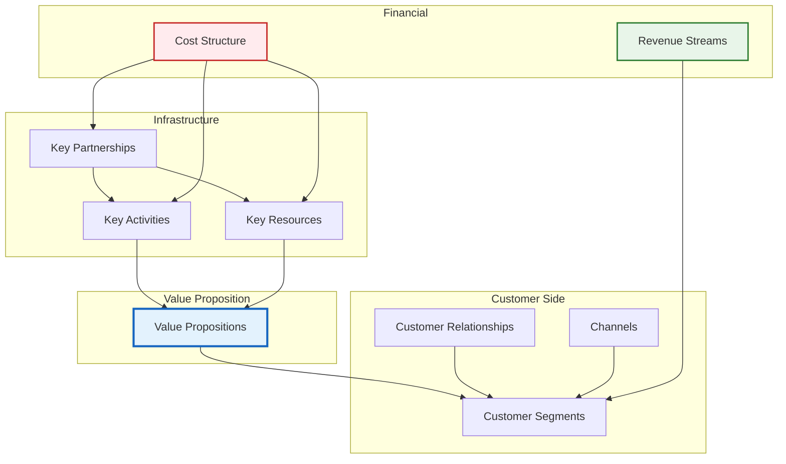

### 2.3 Business Model Flywheel

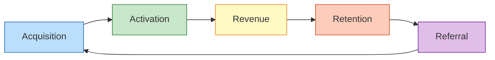

---

## 3. Value Proposition Design

### 3.1 Value Proposition Canvas

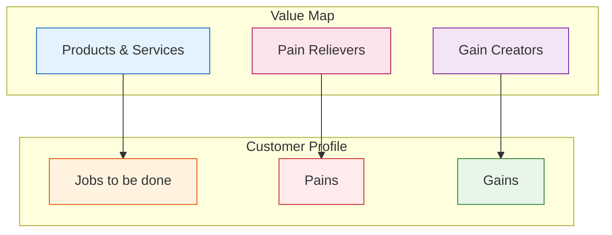

### 3.2 Value Proposition Layering

| Layer | Value Type | Specific Description | Customer Perception |
|------|---------|---------|---------|
| **Functional Value** | Solve Problems | Provides [specific function], replaces [traditional method] | Efficiency improvement X-fold |
| **Economic Value** | Reduce Costs | Saves [XX]% cost compared to competitors | ROI quantifiable |
| **Emotional Value** | Experience Upgrade | Usage process [enjoyable/professional/reassuring] | NPS > 40 |
| **Social Value** | Identity | Helps customers build [professional/leading] image | Brand premium |

---

## 4. Customer Segmentation and Relationships

### 4.1 Customer Segmentation Pyramid

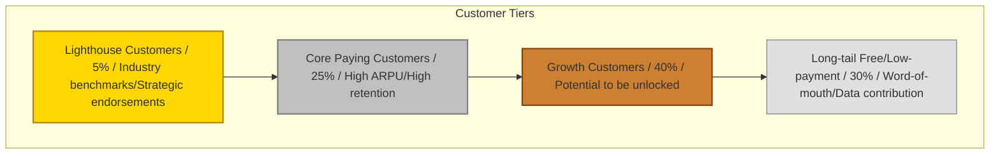

### 4.2 Customer Personas

| Dimension | Customer A (Decision Maker) | Customer B (User) | Customer C (Influencer) |
|------|----------------|----------------|----------------|
| **Role** | CEO/VP | Department Manager/Executive | IT/Procurement/Consultant |
| **Age** | 35-50 | 25-35 | 30-45 |
| **Core Needs** | Cost reduction, business growth | Easy to operate, error-free | Secure, stable, compliant |
| **Decision Weight** | High (Budget approval) | Medium (Usage feedback) | Medium (Technical evaluation) |
| **Touchpoints** | Industry summits, private boards | Product community, training | Tech forums, POC |

### 4.3 Customer Relationship Strategy

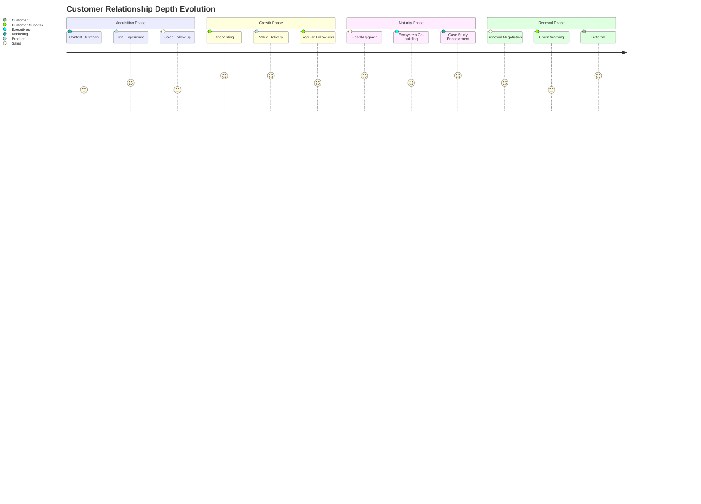

---

## 5. Channel Design

### 5.1 Omnichannel Funnel

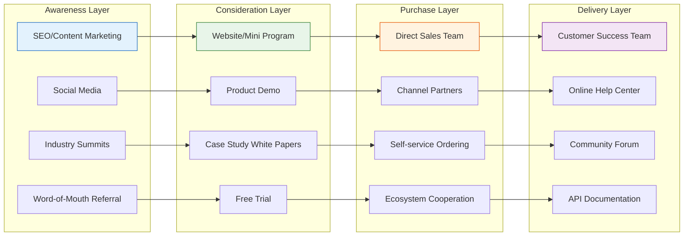

### 5.2 Channel Efficiency Matrix

| Channel | CAC | Conversion Rate | Customer Quality | Scalability Potential | Priority |
|------|-----|--------|---------|-----------|--------|
| Direct Sales Team | High | High | Very High | Medium | P1 |
| Channel Partners | Medium | Medium | High | High | P2 |
| Content Marketing | Low | Low | Medium | Very High | P1 |
| Product-Led Growth | Very Low | Medium | Medium | Very High | P0 |
| Ecosystem Cooperation | Medium | High | High | Medium | P2 |

---

## 6. Revenue Streams and Pricing

### 6.1 Revenue Structure

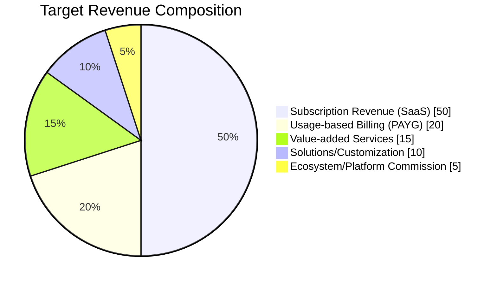

### 6.2 Pricing Strategy

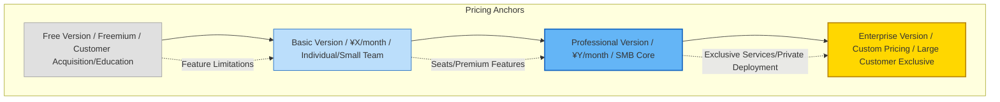

### 6.3 Pricing Dimension Design

| Version | Price | Core Features | Target Customer | Conversion Strategy |
|------|------|---------|---------|---------|
| **Free** | ¥0 | Basic features + usage limits | Individual/Student | Entry point for experience |
| **Basic** | ¥99/person/month | Core features + standard support | Small Team | Feature unlock |
| **Professional** | ¥299/person/month | Advanced features + priority support | Growing Enterprise | ROI justification |
| **Enterprise** | Custom | Full features + private deployment + dedicated CSM | Large Corporation | Executive dialogue |

---

## 7. Core Resources and Capabilities

### 7.1 Resource Capability Pyramid

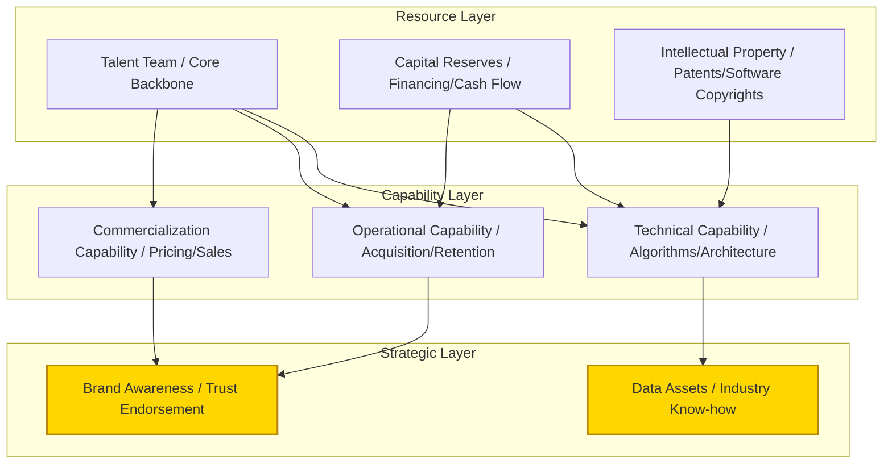

### 7.2 Core Capability Assessment

| Capability Dimension | Self-assessment Level | Industry Benchmark | Development Status | Investment Plan |
|---------|---------|---------|---------|---------|
| Technology R&D | ⭐⭐⭐⭐⭐ | Leading | Established | Continuous investment |
| Product Experience | ⭐⭐⭐⭐ | Excellent | Iterating | Increased investment |
| Customer Acquisition Efficiency | ⭐⭐⭐ | Average | Building | Key breakthrough focus |
| Customer Success | ⭐⭐⭐⭐ | Excellent | Established | Systematization |
| Supply Chain/Delivery | ⭐⭐ | Behind | Starting | Talent acquisition |

---

## 8. Key Business Activities

### 8.1 Value Chain Analysis

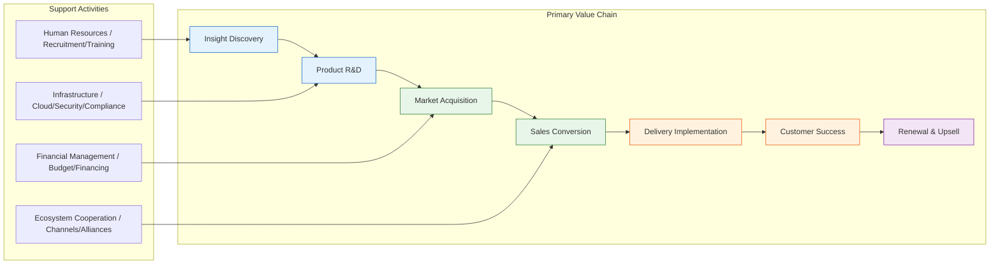

### 8.2 Key Business Processes

| Business Area | Core Metric | Current Level | Target Level | Key Actions |
|---------|---------|---------|---------|---------|
| Insight Discovery | Requirement Accuracy | 60% | 85% | Establish Customer Advisory Board |
| Product R&D | Time to Launch | 6 weeks | 2 weeks | Agile Transformation + DevOps |
| Market Acquisition | MQL Cost | ¥500 | ¥200 | Content Marketing + PLG |
| Sales Conversion | Win Rate | 15% | 30% | Sales Methodology + Tools |
| Customer Success | Health Score | 70 pts | 90 pts | CSM Systematization |
| Renewal & Upsell | NRR | 100% | 120% | Value Operations |

---

## 9. Partner Network

### 9.1 Ecosystem Cooperation Map

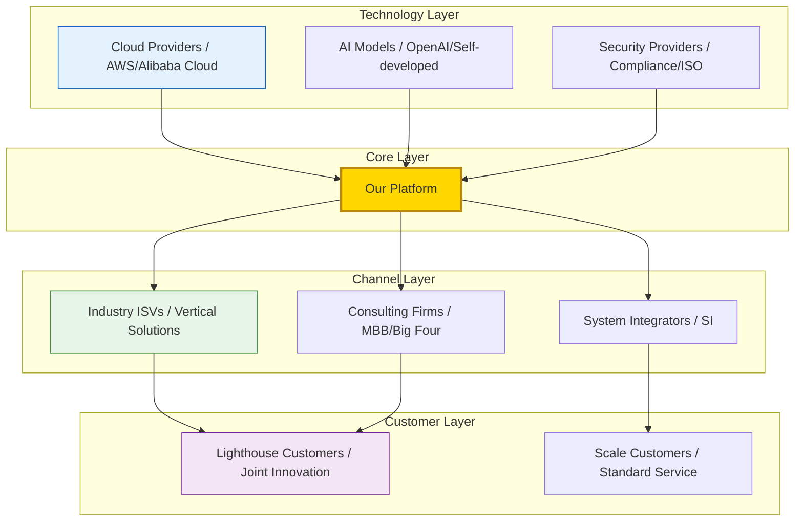

### 9.2 Cooperation Model Design

| Cooperation Type | Partner Role | Our Value | Partner Value | Cooperation Depth |
|---------|---------|---------|---------|---------|
| **Strategic Alliance** | Cloud providers/platforms | Solution richness | Increased customer stickiness | Joint products + Joint sales |
| **Channel Distribution** | Regional agents/ISVs | Market coverage expansion | Profit margin + Product supplement | Training certification + Rebates |
| **Technical Integration** | API/Data partners | Enhanced product capability | Traffic/Data feedback | Technical integration + Co-branding |
| **Content Co-creation** | Media/Consulting | Industry influence | Exclusive content source | White papers + Summits |

---

## 10. Cost Structure and Unit Economics

### 10.1 Cost Structure Analysis

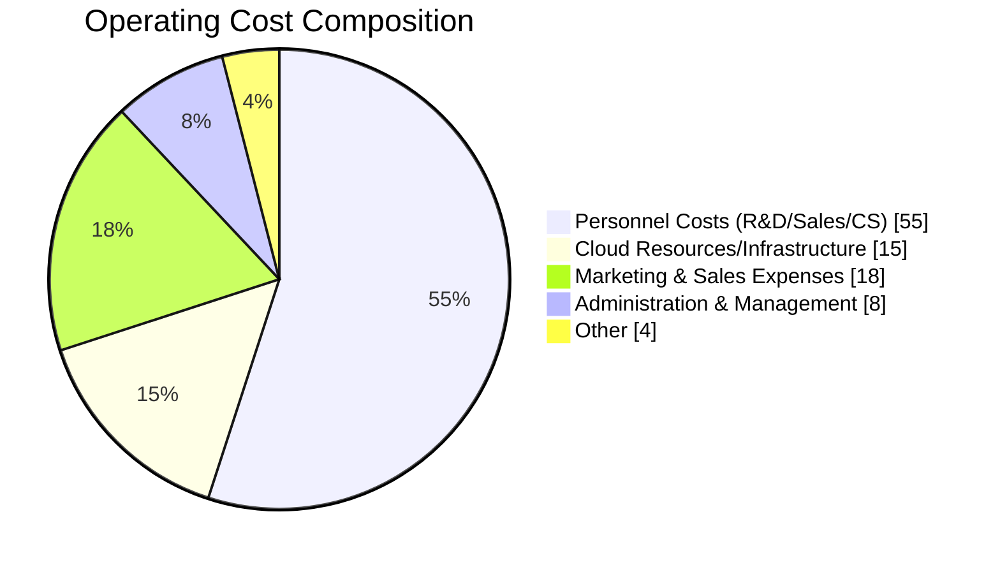

### 10.2 Unit Economics Model

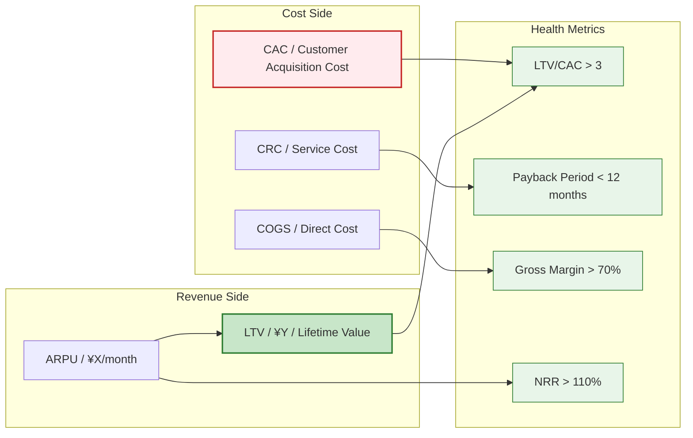

### 10.3 Key Financial Metrics

| Metric | Definition | Current Value | Health Standard | Optimization Direction |
|------|------|--------|---------|---------|
| **CAC** | Per-customer Acquisition Cost | ¥[XX] | < LTV/3 | Optimize channel structure |
| **LTV** | Customer Lifetime Value | ¥[XX] | > 3×CAC | Improve retention/upsell |
| **LTV/CAC** | Return on Investment Ratio | [X]:1 | > 3:1 | Bidirectional optimization |
| **Payback Period** | CAC Recovery Time | [X] months | < 12 months | Increase first-order value |
| **Gross Margin** | (Revenue - Direct Cost)/Revenue | [X]% | SaaS>70% | Infrastructure optimization |
| **NRR** | Net Revenue Retention | [X]% | > 110% | Upsell + Expansion |
| **Rule of 40** | Growth Rate% + Profit Margin% | [X]% | > 40% | Balance growth and profitability |

---

## 11. Business Model Evolution Roadmap

### 11.1 Three-Stage Evolution

> **Note**: Gantt charts are incompatible with Feishu; replaced with table descriptions.

| Stage | Task | Start Date | End Date | Duration | Status |
|------|------|----------|----------|------|------|
| Phase 1: Point Tool | MVP Validation | 2024-01 | 2024-06 | 6 months | Completed |
| Phase 1: Point Tool | PMF Confirmation | 2024-07 | 2024-12 | 6 months | Completed |
| Phase 1: Point Tool | Single-point Monetization | 2024-10 | 2025-03 | 6 months | Completed |
| Phase 2: Platform | Feature Expansion | 2025-01 | 2025-06 | 6 months | In Progress |
| Phase 2: Platform | Multi-tenant Architecture | 2025-04 | 2025-09 | 6 months | In Progress |
| Phase 2: Platform | Ecosystem Opening | 2025-07 | 2025-12 | 6 months | Not Started |
| Phase 3: Ecosystem Network | Data Flywheel | 2026-01 | 2026-06 | 6 months | Not Started |
| Phase 3: Ecosystem Network | Platform Commission | 2026-04 | 2026-09 | 6 months | Not Started |
| Phase 3: Ecosystem Network | Industry Standard | 2026-07 | 2026-12 | 6 months | Not Started |

### 11.2 Business Model Characteristics per Stage

| Stage | Period | Core Model | Revenue Characteristics | Key Resources | Moat |
|------|------|---------|---------|---------|--------|
| **Point Tool** | Current | Product Selling | Linear growth, sales-dependent | Product Capability | Feature Leadership |
| **Platform** | 12-18 months | Subscription + Value-added | Compound growth, emerging network effects | Customer Data | Switching Costs |
| **Ecosystem Network** | 24-36 months | Platform Commission + Data | Exponential growth, ecosystem synergy | Industry Standards | Network Effects |

---

## 12. Risk and Sustainability Analysis

### 12.1 Business Model Vulnerability Assessment

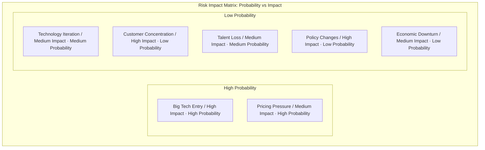

### 12.2 Sustainability Safeguard Mechanisms

| Risk Type | Vulnerability | Mitigation Strategy | Monitoring Metric |
|---------|--------|---------|---------|
| **Competitive Risk** | Big Tech Replication | Deep vertical focus + Data barrier | Market share changes |
| **Technology Risk** | Wrong technology path | Dual-track R&D + Rapid iteration | Technical debt ratio |
| **Customer Risk** | Large customer loss | Customer diversification + Multi-industry | Customer concentration |
| **Financial Risk** | Cash flow disruption | Controlled burn rate + Diversified revenue | Runway months |
| **Compliance Risk** | Data regulation | Compliance-first + Localization | Compliance audit results |

### 12.3 ESG and Long-term Value

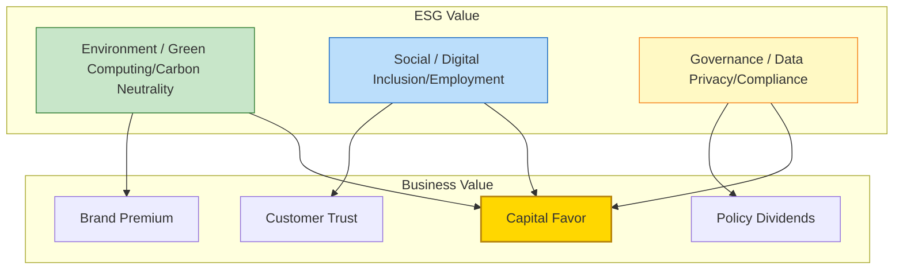

---

## Appendices

### A. Glossary

| Term | English | Definition |
|------|------|------|
| CAC | Customer Acquisition Cost | Per-customer acquisition cost |
| LTV | Lifetime Value | Customer lifetime value |
| NRR | Net Revenue Retention | Net revenue retention rate |
| PMF | Product-Market Fit | Product-market fit |
| PLG | Product-Led Growth | Product-led growth |
| ARR | Annual Recurring Revenue | Annual recurring revenue |
| MRR | Monthly Recurring Revenue | Monthly recurring revenue |
| ARPU | Average Revenue Per User | Average revenue per user |

### B. Reference Frameworks

- Osterwalder, A. & Pigneur, Y. *Business Model Generation*
- Maurya, A. *Running Lean*
- Ellis, S. & Brown, M. *Hacking Growth*
- McKinsey 7S Model / Porter Value Chain / Bain Profit System

---

> **Document Maintenance**: Recommended to review and update quarterly, with immediate revisions during major strategic adjustments.
>
> **Distribution Scope**: Core management team, board of directors, strategic investors (after signing NDA).
