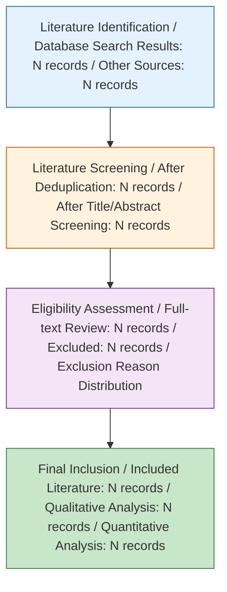
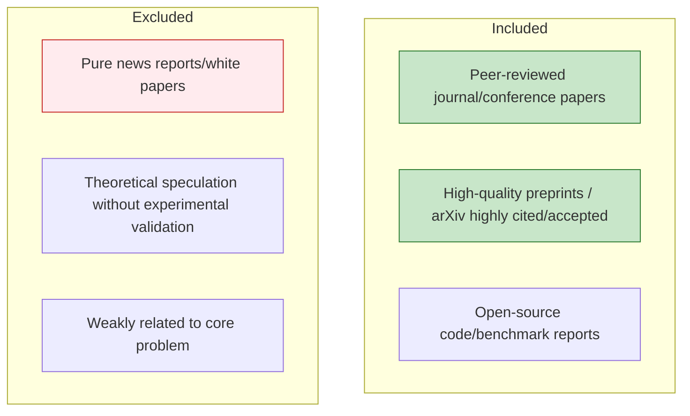
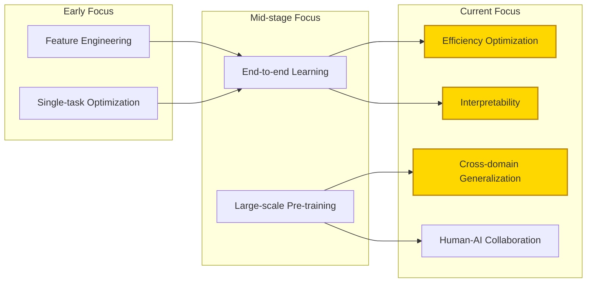
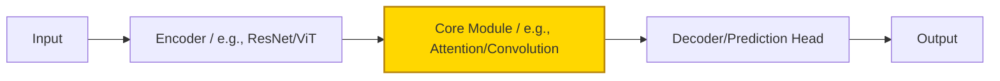
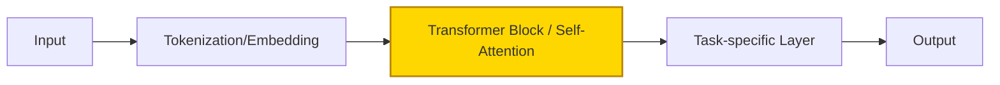
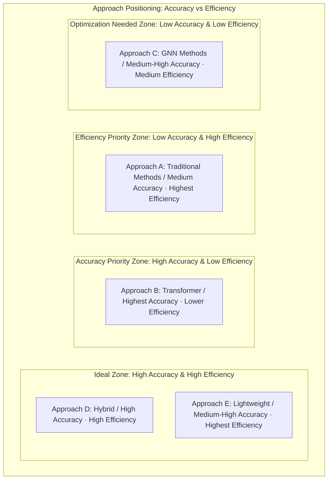
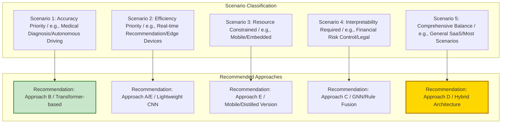
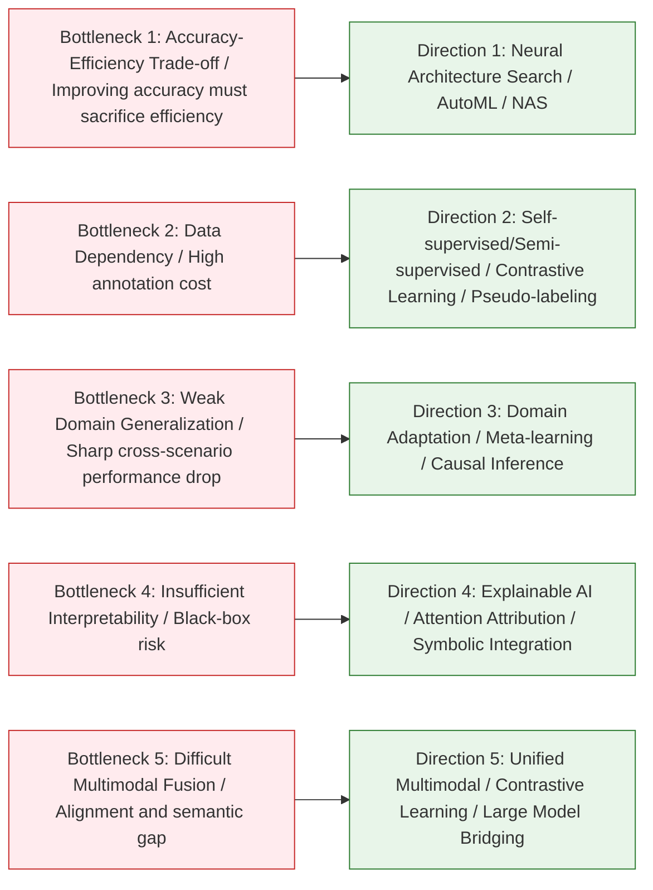
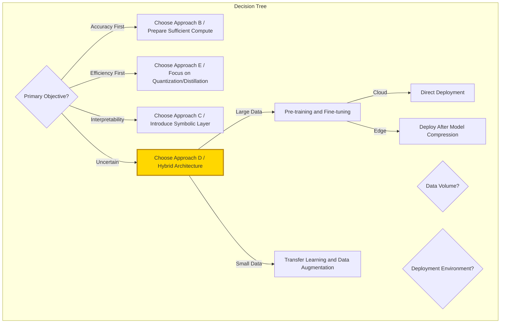

# [Product/System Name (English Name)] - Literature Review

> **Document Status:** 🟡 Under Review / 🟢 Approved / 🔴 Rejected
>
> **Confidentiality Level:** Confidential / Internal / Public
>
> **Version:** vX.X
>
> **Date:** YYYY-MM-DD
>
> **Author:** [Name/Role]
>
> **Reviewer:** [Name/Role]
>
> **Audience:** [Role List]
>
> **Article Type**: Survey / Review Report
>
> **Core Objective**: Systematically review the research evolution of [Topic], classify and compare mainstream technical approaches, establish an evaluation framework, and recommend the current optimal path
>
> **Search Scope**: 20XX–2026, Web of Science / Scopus / arXiv / IEEE / CNKI
>
> **Included Literature**: After screening, a total of **XXX** core papers were included

---

## 0. Document Guide

### 0.1 Document Purpose and Scope

[Describe the purpose, applicable scenarios, and non-applicable scenarios of this document]

### 0.2 Related Documents

| Document Type | Filename | Related Sections |
|---------|--------|---------|
| [Type] | [Filename] [Line Range] | [Section Description] |

> **Reference Format Note**: Related documents use the `Filename Line Range` format (e.g., `【Template】Technical Requirements Document(TRD).md 3-17`). Line numbers may change as documents are updated; please refer to the actual content.

### 0.3 Change Log

| Version | Date | Reviser | Changes | Reviewer |
| :--- | :--- | :--- | :--- | :--- |
| v0.1 | YYYY-MM-DD | [Name] | Initial draft | [Reviewer] |
| v0.2 | 2026-XX-XX | [Name] | Example: Added XXX analysis | [Reviewer] |

---

## Abstract

**Background**: [One sentence on the field background and core problem].
**Method**: Following systematic review methodology, retrieved from **N** databases, classified literature into **K** major categories by technical approach, and established a comparison framework across **five dimensions: accuracy, efficiency, generalization, interpretability, and deployment cost**.
**Findings**:
1. The field has undergone a three-stage evolution from **[Early Paradigm] → [Mid-stage Paradigm] → [Current Paradigm]**;
2. Current mainstream approaches can be categorized into three major types: **[Approach A], [Approach B], [Approach C]**, each excelling in **[specific dimension]**;
3. Under comprehensive evaluation, **[Specific Approach/Hybrid Approach]** performs best in **[specific scenario]**, but still faces bottlenecks in **[specific scenario]**.
**Conclusion**: Future research should prioritize breakthroughs in **[Direction 1]** and **[Direction 2]**, and it is recommended that practical applications adopt **[Recommended Approach]** as the baseline.

---

## 1. Research Methodology Statement

### 1.1 Paper Positioning

This paper is positioned as one of the following (required, choose one):

- [ ] **Systematic Review**: Follows PRISMA 2020 guidelines, with reproducible search strategies, clear inclusion/exclusion criteria, and bias risk assessment
- [ ] **Narrative Review / Research Progress**: Selectively reviews literature based on author expertise, provides a field panorama but does not guarantee exhaustiveness

**Positioning Rationale**: [Explain the reason for choosing this positioning, e.g., whether the literature search process is traceable/not traceable, whether PRISMA is followed, etc.]

### 1.2 Methodology Applicability Statement

| Declaration Item | Content |
|--------|------|
| Search Strategy Reproducibility | Yes/No. If No, explain the reason |
| Bias Risk Assessment | Completed/Not completed |
| Evidence Level Annotation | Completed/Not completed |
| Peer-Reviewed Literature Ratio | XX% |

### 1.3 PRISMA Flow Diagram (Required only for Systematic Reviews)

> If this paper is positioned as a Narrative Review/Research Progress, this section may be marked as "Not Applicable" and skipped.



**Search Details**:

| Database | Search Query | Search Date | Initial Results | After Deduplication |
|--------|--------|---------|---------|--------|
| [Database 1] | [Search Query] | YYYY-MM-DD | N | N |
| [Database 2] | [Search Query] | YYYY-MM-DD | N | N |

---

## 3. Introduction

### 3.1 Research Background and Core Problem

[Research Field] has received widespread attention in recent years. The core challenge is: **[Define the core scientific/engineering problem in 1-2 sentences]**. For example:

> How to achieve **[Objective]** under **[Constraints]** while balancing **[Metric 1]** and **[Metric 2]**?

This problem holds significant value in **[Application Scenario A], [Application Scenario B], [Application Scenario C]**.

### 3.2 Why This Review Is Needed

Existing reviews have the following shortcomings:
- **[Shortcoming 1]**: Most literature merely lists technical approaches without **direct comparison between methods**;
- **[Shortcoming 2]**: Lacks a unified **multi-dimensional evaluation framework**, leading to ambiguous definitions of "optimal";
- **[Shortcoming 3]**: Has not updated conclusions incorporating **recent advances (2024–2026)**.

**Differentiated Contributions** of this review:
1. Establishes a **five-dimensional evaluation framework** (Accuracy / Efficiency / Generalization / Interpretability / Cost);
2. Provides **quantitative/semi-quantitative comparison** for each category of approach;
3. Clearly recommends the **current optimal technical path** and its applicable boundaries.

### 3.3 Review Scope and Boundaries



---

## 4. Research Evolution Timeline

### 4.1 Three-Stage Development Timeline

> **Note**: Gantt charts are incompatible with Feishu; replaced with table descriptions.

| Stage | Task | Start Year | End Year | Duration | Status |
|------|------|----------|----------|------|------|
| Incubation: Problem Definition | Foundational Theory Establishment | 2015 | 2018 | 4 years | Completed |
| Incubation: Problem Definition | First Benchmark Dataset | 2017 | 2019 | 3 years | Completed |
| Incubation: Problem Definition | Early Heuristic Methods | 2018 | 2021 | 4 years | Completed |
| Development: Method Explosion | Introduction of Deep Learning | 2020 | 2023 | 4 years | Completed |
| Development: Method Explosion | Multi-branch Architecture Competition | 2022 | 2025 | 4 years | Completed |
| Development: Method Explosion | Large-scale Pre-training | 2024 | 2026 | 3 years | Completed |
| Maturity: Optimization & Deployment | Efficiency Optimization Direction | 2025 | 2026 | 2 years | In Progress |
| Maturity: Optimization & Deployment | Multimodal/Cross-domain Fusion | 2025 | 2026 | 2 years | In Progress |
| Maturity: Optimization & Deployment | Interpretable & Trustworthy Research | 2025 | 2026 | 2 years | In Progress |
| Maturity: Optimization & Deployment | Industrial-grade Deployment Solutions | 2025 | 2026 | 2 years | Milestone |

### 4.2 Representative Works per Stage

| Stage | Period | Core Characteristics | Milestone Literature | Key Limitations |
|------|------|---------|-----------|---------|
| **Incubation** | 20XX–20XX | Rule-driven / Statistical methods | [AuthorA, Year] First problem definition | Poor generalization, reliance on manual features |
| **Development** | 20XX–20XX | Deep learning dominates, accuracy leaps | [AuthorB, Year] Proposed foundational architecture | High computational cost, black-box problem |
| **Maturity** | 20XX–2026 | Efficiency-Accuracy-Interpretability trade-off | [AuthorC, Year] Achieved SOTA | Scenario adaptation still requires tuning |

### 4.3 Research Theme Evolution



---

## 5. Classification and Principles of Mainstream Research Approaches

> **Classification Logic**: Based on **[Core Technical Differences, e.g., architecture type / learning paradigm / optimization objective]**, existing research is classified into **N** major categories.

### 5.1 Approach Overview

```mermaid
graph TB
    root[Core Problem]

    root --> A[Approach A: [Name] / e.g., CNN-based Local Feature Methods]
    root --> B[Approach B: [Name] / e.g., Transformer-based Global Modeling Methods]
    root --> C[Approach C: [Name] / e.g., GNN-based Relational Reasoning Methods]
    root --> D[Approach D: [Name] / e.g., Hybrid/Multimodal Fusion Methods]

    A --> A1[Variant A1]
    A --> A2[Variant A2]
    B --> B1[Variant B1]
    B --> B2[Variant B2]
    C --> C1[Variant C1]
    D --> D1[Variant D1]

    style A fill:#e3f2fd,stroke:#1565c0
    style B fill:#e8f5e9,stroke:#2e7d32
    style C fill:#fff3e0,stroke:#e65100
    style D fill:#f3e5f5,stroke:#7b1fa2
```

### 5.2 Approach A: [Approach Name]

**Core Idea**:
> [Summarize the core assumptions and solution approach of this method in 2-3 sentences]

**Typical Architecture**:



**Representative Literature and Core Contributions**:

| Literature | Year | Core Innovation | Key Problem Solved |
|------|------|---------|---------------|
| [AuthorA1] | 20XX | [Innovation] | [Problem] |
| [AuthorA2] | 20XX | [Innovation] | [Problem] |
| [AuthorA3] | 20XX | [Innovation] | [Problem] |

**Strengths and Weaknesses**:
- ✅ **Strengths**: [e.g., Strong local feature capture, computationally efficient]
- ❌ **Weaknesses**: [e.g., Weak long-range dependency modeling, requires large amounts of labeled data]

---

### 5.3 Approach B: [Approach Name]

**Core Idea**:
> [Summary]

**Typical Architecture**:



**Representative Literature**:

| Literature | Year | Core Innovation | Key Problem Solved |
|------|------|---------|---------------|
| [AuthorB1] | 20XX | [Innovation] | [Problem] |
| [AuthorB2] | 20XX | [Innovation] | [Problem] |

**Strengths and Weaknesses**:
- ✅ **Strengths**: [e.g., Global dependency modeling, strong transfer capability]
- ❌ **Weaknesses**: [e.g., Quadratic complexity, prone to overfitting with small samples]

---

### 5.4 Approach C: [Approach Name]

**Core Idea**:
> [Summary]

**Representative Literature**:

| Literature | Year | Core Innovation | Key Problem Solved |
|------|------|---------|---------------|
| [AuthorC1] | 20XX | [Innovation] | [Problem] |
| [AuthorC2] | 20XX | [Innovation] | [Problem] |

**Strengths and Weaknesses**:
- ✅ **Strengths**: [e.g., Strong relational reasoning, good interpretability]
- ❌ **Weaknesses**: [e.g., High graph construction overhead, noise sensitivity]

---

### 5.5 Approach D: Hybrid/Fusion Approach

**Core Idea**:
> Combines complementary strengths of the above approaches through **[Fusion Strategy, e.g., multi-tower architecture / cascading / knowledge distillation]** to achieve comprehensive improvement.

**Representative Literature**:

| Literature | Year | Fusion Strategy | Improvement |
|------|------|---------|---------|
| [AuthorD1] | 20XX | [Strategy] | [Metric Improvement] |
| [AuthorD2] | 20XX | [Strategy] | [Metric Improvement] |

---

## 6. Multi-Dimensional Comparative Analysis of Approaches

### 6.1 Comparison Framework Design

This review establishes evaluation criteria across the following **five dimensions**:

| Dimension | Definition | Measurement Method | Weight (Recommended) |
|------|------|---------|-------------|
| **Accuracy** | Performance on standard test sets | Accuracy / F1 / mAP / BLEU etc. | 30% |
| **Efficiency** | Inference speed and resource consumption | FPS / Parameter Count / FLOPs / Memory | 25% |
| **Generalization** | Cross-domain/cross-task/few-shot performance | Cross-dataset performance degradation rate | 20% |
| **Interpretability** | Transparency of decision process | Visualization / Attribution analysis / Human comprehensibility | 15% |
| **Deployment Cost** | Engineering difficulty and maintenance cost | Training cost / Hardware requirements / Team barrier | 10% |

> **Evidence Level Annotation Standard**: Every recommendation in this review is annotated with Oxford CEBM 2011 evidence levels (1a–5) and GRADE confidence (High/Moderate/Low/Very Low). Star ratings (⭐) serve as visual aids only and do not represent rigorous methodological assessment. Detailed evidence evaluation see §6.5 Bias Risk Assessment.

> **Scoring Protocol Statement**: The above weights are recommended weights, based on [Weight Source: Expert Consensus / Literature Basis / AHP Analysis]. Operational definitions for each dimension scoring are as follows:
> - **Accuracy 5**: Meets or exceeds SOTA on standard benchmarks; **1**: Significantly below baseline methods
> - **Efficiency 5**: Meets real-time inference requirements (<100ms); **1**: Cannot meet online service requirements
> - **Generalization 5**: Cross-domain performance degradation <10%; **1**: Cross-domain performance degradation >50%
> - **Interpretability 5**: Decision path fully traceable; **1**: Completely black-box
> - **Deployment Cost 5**: Out-of-the-box, no training required; **1**: Requires large-scale custom training
>
> **Sensitivity Analysis**: When weights vary ±10%, the recommendation conclusion is [stable/unstable].

### 6.2 Scoring Comparison of Each Approach (Radar Chart Concept)



### 6.3 Detailed Comparison Matrix

| Comparison Dimension | Approach A | Approach B | Approach C | Approach D (Hybrid) | Approach E (Lightweight) |
|---------|-------|-------|-------|--------------|----------------|
| **Accuracy** | ⭐⭐⭐ | ⭐⭐⭐⭐⭐ | ⭐⭐⭐⭐ | ⭐⭐⭐⭐⭐ | ⭐⭐⭐⭐ |
| **Inference Efficiency** | ⭐⭐⭐⭐⭐ | ⭐⭐⭐ | ⭐⭐⭐⭐ | ⭐⭐⭐⭐ | ⭐⭐⭐⭐⭐ |
| **Training Efficiency** | ⭐⭐⭐⭐⭐ | ⭐⭐ | ⭐⭐⭐ | ⭐⭐⭐ | ⭐⭐⭐⭐ |
| **Generalization** | ⭐⭐⭐ | ⭐⭐⭐⭐⭐ | ⭐⭐⭐⭐ | ⭐⭐⭐⭐⭐ | ⭐⭐⭐⭐ |
| **Interpretability** | ⭐⭐⭐⭐ | ⭐⭐ | ⭐⭐⭐⭐⭐ | ⭐⭐⭐ | ⭐⭐⭐ |
| **Deployment Cost** | Low | High | Medium | High | Low |
| **Data Dependency** | Medium | High | Medium | High | Medium |
| **Typical Scenario** | Real-time/Edge | Accuracy Priority | Relational Reasoning | Comprehensive | Mobile |

### 6.4 Benchmark Data Comparison

> **Data Source**: Public results on **[Standard Dataset, e.g., XXX-Bench / GLUE / COCO]**.

| Approach | Representative Model | Dataset | Core Metric | Value | Parameters | Inference Latency |
|------|---------|--------|---------|------|--------|---------|
| Approach A | [Model A] | [Dataset] | [Metric] | [X.XX] | [XM] | [Xms] |
| Approach B | [Model B] | [Dataset] | [Metric] | [X.XX] | [XM] | [Xms] |
| Approach C | [Model C] | [Dataset] | [Metric] | [X.XX] | [XM] | [Xms] |
| Approach D | [Model D] | [Dataset] | [Metric] | [X.XX] | [XM] | [Xms] |
| Approach E | [Model E] | [Dataset] | [Metric] | [X.XX] | [XM] | [Xms] |

### 6.5 Bias Risk Assessment

#### Evidence Level Annotation (Oxford CEBM 2011)

| Evidence Level | Definition | Number of Papers in This Review | Percentage |
|---------|------|------------------|------|
| 1a | Systematic Review (RCT) | N | XX% |
| 1b | Single RCT | N | XX% |
| 2a | Systematic Review (Cohort Studies) | N | XX% |
| 2b | Single Cohort Study | N | XX% |
| 3a | Systematic Review (Case-Control) | N | XX% |
| 3b | Single Case-Control | N | XX% |
| 4 | Case Series / Low-quality Cohort | N | XX% |
| 5 | Expert Opinion | N | XX% |

#### GRADE Confidence Assessment

| Recommendation | Evidence Level | Confidence | Downgrade Reason | Upgrade Reason |
|---------|---------|--------|---------|---------|
| [Recommendation 1] | [Level] | High/Moderate/Low/Very Low | [Reason] | [Reason] |
| [Recommendation 2] | [Level] | High/Moderate/Low/Very Low | [Reason] | [Reason] |

#### Literature Type Distribution

| Literature Type | Count | Percentage |
|---------|------|------|
| Peer-reviewed journal/conference papers | N | XX% |
| Preprints (arXiv etc.) | N | XX% |
| Industry reports/white papers | N | XX% |
| Other | N | XX% |

---

## 7. Optimal Approach Evaluation and Recommendation

### 7.1 Evaluation Logic

"Optimal" is not absolute but **scenario-dependent**. This review provides recommendations classified by the following scenarios:



### 7.2 Scenario-Based Optimal Recommendations

#### Scenario 1: Accuracy Priority (Research/High-value Decisions)

| Item | Content |
|------|------|
| **Recommended Approach** | Approach B (Transformer/Large Model Route) |
| **Representative Work** | [AuthorB2, Year] |
| **Core Rationale** | Achieved SOTA on [Dataset], error rate reduced by **X%** |
| **Applicable Conditions** | Sufficient compute, large data volume, latency-insensitive |
| **Risk Warning** | Overfitting risk, black-box decisions require manual review |

#### Scenario 2: Efficiency Priority (Real-time Systems)

| Item | Content |
|------|------|
| **Recommended Approach** | Approach E (Lightweight/Distillation/Quantization Route) |
| **Representative Work** | [AuthorE1, Year] |
| **Core Rationale** | Accuracy loss **<X%**, speed improvement **X-fold**, meets **XXms** latency requirements |
| **Applicable Conditions** | High concurrency, low latency, edge deployment |
| **Risk Warning** | Accuracy may drop sharply in extreme scenarios |

#### Scenario 3: Interpretability Required (High-risk Decisions)

| Item | Content |
|------|------|
| **Recommended Approach** | Approach C (GNN/Symbolic Reasoning/Attention Visualization) |
| **Representative Work** | [AuthorC2, Year] |
| **Core Rationale** | Decision path traceable, meets **[Regulation/Standard]** interpretability requirements |
| **Applicable Conditions** | Finance, healthcare, legal and other heavily regulated domains |
| **Risk Warning** | Higher modeling complexity, requires domain expert involvement |

#### Scenario 4: Comprehensive Balance (Most Industrial Applications) ⭐ **Current Optimal**

| Item | Content |
|------|------|
| **Recommended Approach** | **Approach D (Hybrid Architecture)** |
| **Representative Work** | [AuthorD2, Year] |
| **Core Rationale** | Achieves optimal Pareto frontier across accuracy (**X.XX**), efficiency (**Xms**), and generalization (cross-domain degradation **<X%**) |
| **Architecture Suggestion** | [Specific architecture description, e.g., Lightweight encoder + Attention refinement + Knowledge distillation] |
| **Applicable Conditions** | General scenarios, moderate team tech stack, pursuing ROI |
| **Risk Warning** | High architectural complexity, requires tuning experience |

### 7.3 Technical Implementation Path for Optimal Approach

```mermaid
graph TB
    subgraph Recommended Approach D Implementation Path
        Step1[Step 1: Base Selection / Choose Efficient Backbone / e.g., EfficientNet / Swin-Tiny]
        Step2[Step 2: Core Module / Introduce [Specific Module] / e.g., Cross-Attention / GNN Layer]
        Step3[Step 3: Training Strategy / Pre-training and Domain Fine-tuning + Data Augmentation]
        Step4[Step 4: Efficiency Optimization / Knowledge Distillation / Quantization / Pruning]
        Step5[Step 5: Deployment Verification / TensorRT / ONNX / Mobile Testing]
    end

    Step1 --> Step2 --> Step3 --> Step4 --> Step5

    style Step1 fill:#e3f2fd,stroke:#1565c0
    style Step5 fill:#c8e6c9,stroke:#2e7d32,stroke-width:2px
```

---

## 8. Current Research Bottlenecks and Breakthrough Directions

### 8.1 Five Major Bottlenecks



### 8.2 Priority Research Agenda for the Next 3 Years

| Priority | Direction | Scientific Problem | Suggested Method | Expected Breakthrough Timeline |
|-------|------|---------|---------|-------------|
| **P0** | [Direction 1] | [Problem] | [Method] | 2026–2027 |
| **P0** | [Direction 2] | [Problem] | [Method] | 2026–2027 |
| **P1** | [Direction 3] | [Problem] | [Method] | 2027–2028 |
| **P1** | [Direction 4] | [Problem] | [Method] | 2027–2028 |
| **P2** | [Direction 5] | [Problem] | [Method] | 2028+ |

---

## 9. Conclusion

### 9.1 Core Conclusions

1. **Research Evolution**: [Topic] has completed the paradigm shift from **[Early]** to **[Current]**, currently at **[Stage Characteristics]**.
2. **Approach Landscape**: **Approach B** leads in accuracy, **Approach E** excels in efficiency, **Approach D** achieves Pareto optimality in comprehensive scenarios.
3. **Optimal Recommendations**:
   - **Research/High-accuracy scenarios** → Approach B;
   - **Real-time/Edge scenarios** → Approach E;
   - **Heavily regulated scenarios** → Approach C;
   - **General industrial deployment** → **Approach D (Recommended)**.
4. **Future Breakthroughs**: **[Direction 1]** and **[Direction 2]** are the most likely research directions to achieve qualitative changes in the next 2 years.

### 9.2 Recommendations for Practitioners



### 9.3 Limitations of This Review

- Only included **[Language/Database]** literature, potentially missing recent work from **[Specific Region/Conference]**;
- Benchmark data sourced from published papers; actual deployment performance is affected by hardware/software stacks;
- "Optimal" evaluation is based on current (2026) technical state and should be updated as technology iterates.

---

## References

> **Format Standard**: APA 7th Edition
>
> **Prohibitions**:
> - Do not use placeholders like "XXX Authors" "XXX et al." to replace real author names
> - Do not omit required fields such as journal name, volume, pages, DOI
> - If complete information cannot be obtained, must annotate as "Source Not Traceable"
>
> **Literature Type Annotation**: Each reference must be annotated with its type at the end:
> - [Peer-Reviewed] Peer-reviewed journal/conference paper
> - [Preprint] Preprint
> - [Industry] Industry report
> - [Other] Other

1. Author, A. A., & Author, B. B. (Year). *Title of article*. *Title of Periodical*, *Volume*(Issue), Page–Page. https://doi.org/xxxxx
2. Author, A. A. (Year). *Title of work: Subtitle*. Publisher. https://doi.org/xxxxx
3. Author, A. A. (Year). *Title of paper*. Conference Name. https://doi.org/xxxxx
4. Author, A. A. (Year). *Title of preprint*. arXiv. https://arxiv.org/abs/xxxx.xxxxx

---

## Appendices

### Appendix A: Complete List of Included Literature

| No. | Author | Year | Title | Approach Classification | Core Method | Experimental Dataset | Key Metrics |
|------|------|------|------|---------|---------|-----------|---------|
| 001 | Author | 2023 | Title | Approach A | CNN | Dataset | Acc=0.92 |
| 002 | Author | 2024 | Title | Approach B | Transformer | Dataset | Acc=0.96 |
| ... | ... | ... | ... | ... | ... | ... | ... |

### Appendix B: Search Queries and Screening Records

```
[Paste search queries for each database]
```

### Appendix C: Glossary

| Term | English | Definition |
|------|------|------|
| SOTA | State-of-the-Art | Current best performance |
| NAS | Neural Architecture Search | Neural architecture search |
| ... | ... | ... |
