# [Product/System Name (English)] - Business Model Document

> **Document Status:** 🟡 Under Review / 🟢 Passed / 🔴 Rejected
>
> **Confidentiality Level:** Confidential / Internal / Public
>
> **Version:** vX.X
>
> **Date:** YYYY-MM-DD
>
> **Author:** [Name/Role]
>
> **Reviewer:** [Name/Role]
>
> **Audience:** [Role List]
>
> **Core Objective**: Clearly articulate the complete loop of "how to create, deliver, and capture value"

---

## 0. Document Guide

### 0.1 Document Purpose & Scope

[Describe the purpose, applicable scenarios, and non-applicable scenarios of this document]

### 0.2 Related Documents

| Document Type | Filename | Related Sections |
|---------|--------|---------|
| [Type] | [Filename] [Line Range] | [Section Description] |

> **Reference Format**: Related documents use the `filename line range` format (e.g., `【Template】Technical Requirements Document (TRD).md 3-17`). Line numbers may change as documents are updated; refer to the actual content.

### 0.3 Change Log

| Version | Date | Author | Changes | Reviewer |
| :--- | :--- | :--- | :--- | :--- |
| v0.1 | YYYY-MM-DD | [Name] | Initial draft | [Reviewer] |

---

## 2. Business Model Overview

### 2.1 One-Line Business Model

> **We** use **[core capability/resource]** to provide **[value proposition]** for **[target customers]**, solving **[core pain point]**, and capturing **[revenue stream]** from it.

### 2.2 Business Model Canvas

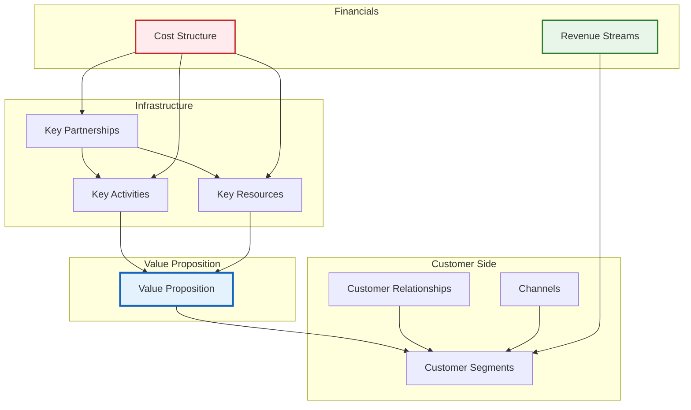

### 2.3 Business Model Flywheel

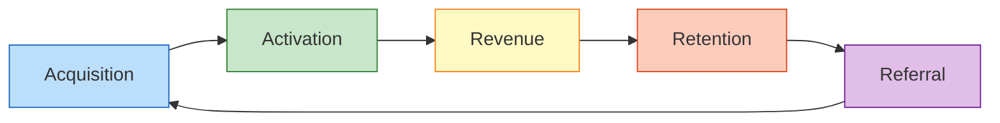

---

## 3. Value Proposition Design

### 3.1 Value Proposition Canvas

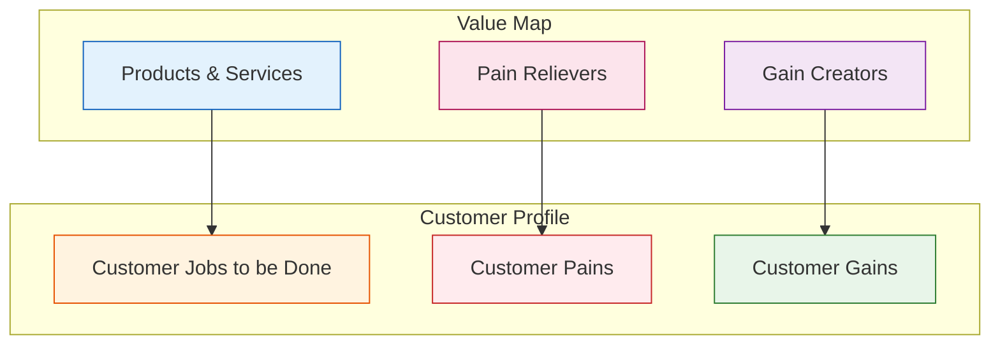

### 3.2 Value Proposition Layers

| Layer | Value Type | Description | Customer Perception |
|------|---------|---------|---------|
| **Functional Value** | Solving problems | Provides [specific feature], replaces [traditional method] | Efficiency improvement X times |
| **Economic Value** | Reducing costs | Saves [XX]% cost compared to competitors | Quantifiable ROI |
| **Emotional Value** | Experience upgrade | Usage process [pleasant/professional/reassuring] | NPS > 40 |
| **Social Value** | Identity | Helps customers establish [professional/leading] image | Brand premium |

---

## 4. Customer Segments & Relationships

### 4.1 Customer Segmentation Pyramid

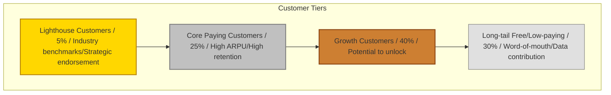

### 4.2 Customer Personas

| Dimension | Customer A (Decision Maker) | Customer B (User) | Customer C (Influencer) |
|------|----------------|----------------|----------------|
| **Role** | CEO/VP | Department Manager/Executive | IT/Procurement/Consultant |
| **Age** | 35-50 | 25-35 | 30-45 |
| **Core Need** | Cost reduction, business growth | Easy operation, error-free | Stable, compliant |
| **Decision Weight** | High (budget approval) | Medium (usage feedback) | Medium (technical evaluation) |
| **Touchpoint** | Industry summits, private forums | Product community, training | Tech forums, POC |

### 4.3 Customer Relationship Strategy

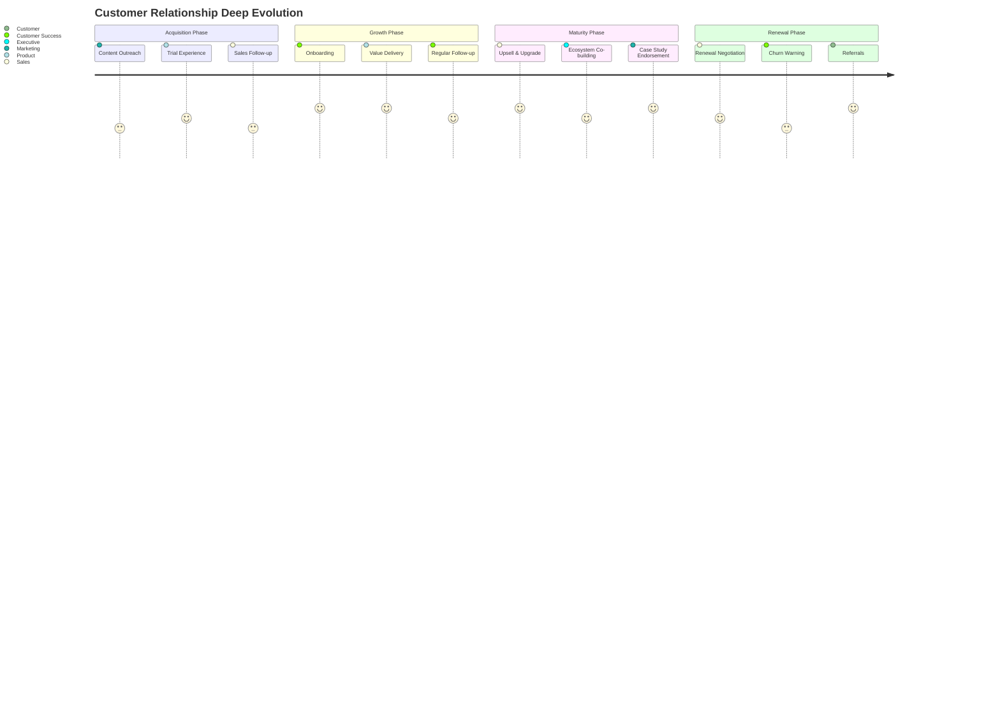

---

## 5. Channel Design

### 5.1 Full-Channel Funnel

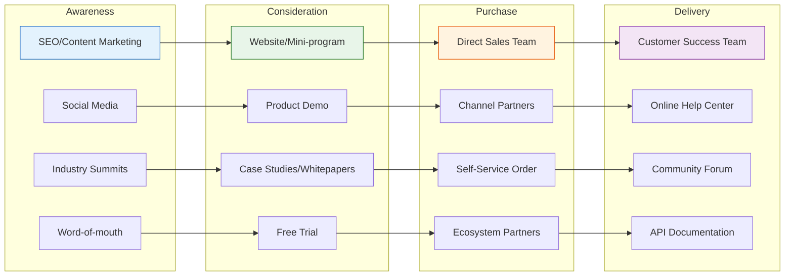

### 5.2 Channel Efficiency Matrix

| Channel | CAC | Conversion | Customer Quality | Scalability | Priority |
|------|-----|--------|---------|-----------|--------|
| Direct Sales | High | High | Very High | Medium | P1 |
| Channel Partners | Medium | Medium | High | High | P2 |
| Content Marketing | Low | Low | Medium | Very High | P1 |
| Product-Led Growth | Very Low | Medium | Medium | Very High | P0 |
| Ecosystem Partners | Medium | High | High | Medium | P2 |

---

## 6. Revenue Sources & Pricing

### 6.1 Revenue Structure

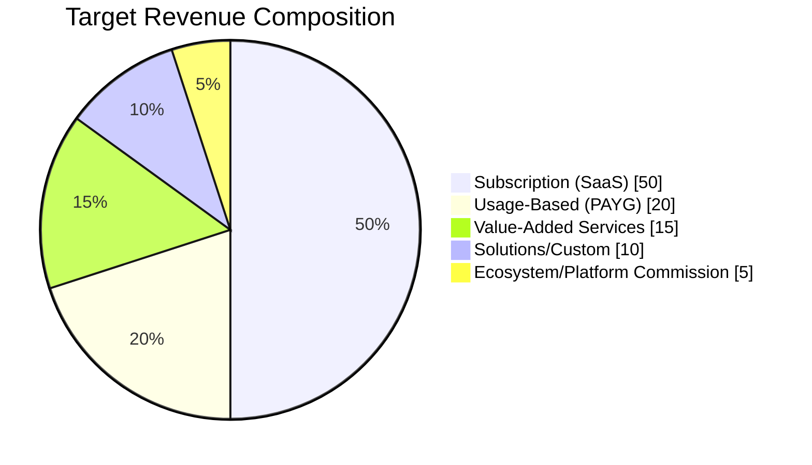

### 6.2 Pricing Strategy

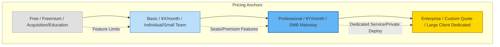

### 6.3 Pricing Dimension Design

| Tier | Pricing | Core Features | Target Customer | Conversion Strategy |
|------|------|---------|---------|---------|
| **Free** | ¥0 | Basic features + usage limits | Individual/Student | Entry experience |
| **Basic** | ¥99/user/month | Core features + standard support | Small teams | Feature unlock |
| **Professional** | ¥299/user/month | Advanced features + priority support | Growing enterprises | ROI justification |
| **Enterprise** | Custom | Full features + private deploy + dedicated CSM | Large groups | Executive conversation |

---

## 7. Core Resources & Capabilities

### 7.1 Resource Capability Pyramid

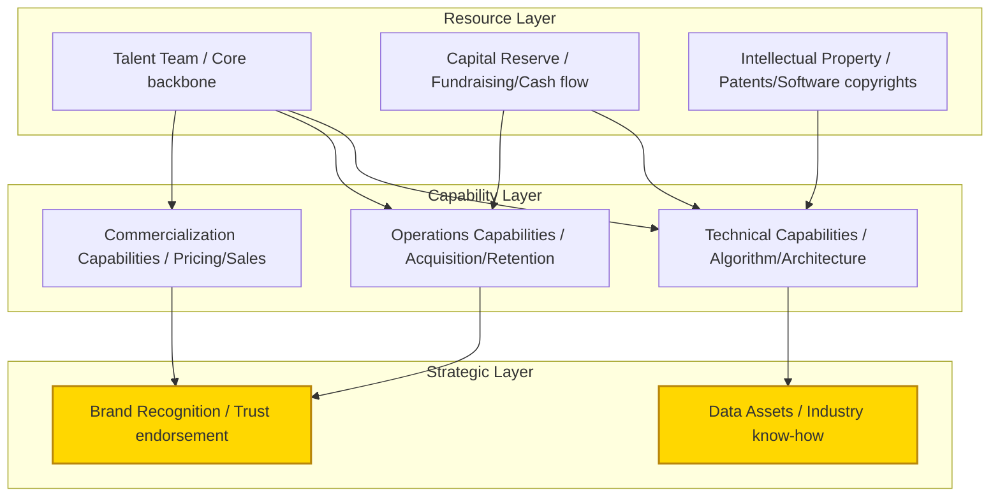

### 7.2 Core Capability Assessment

| Capability | Self-Assessment | Industry Benchmark | Building Status | Investment Plan |
|---------|---------|---------|---------|---------|
| Technical R&D | ⭐⭐⭐⭐⭐ | Leading | Established | Continuous investment |
| Product Experience | ⭐⭐⭐⭐ | Excellent | Iterating | Increase investment |
| Acquisition Efficiency | ⭐⭐⭐ | Medium | Building | Key breakthrough |
| Customer Success | ⭐⭐⭐⭐ | Excellent | Established | Systematize |
| Supply Chain/Delivery | ⭐⭐ | Behind | Starting | Recruit talent |

---

## 8. Key Business Activities

### 8.1 Value Chain Analysis

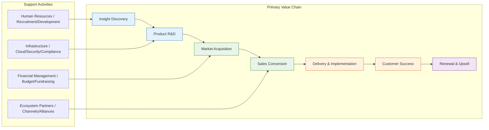

### 8.2 Key Business Processes

| Business Area | Core Metric | Current | Target | Key Actions |
|---------|---------|---------|---------|---------|
| Insight Discovery | Requirement accuracy | 60% | 85% | Establish customer advisory board |
| Product R&D | Go-live cycle | 6 weeks | 2 weeks | Agile transformation + DevOps |
| Market Acquisition | MQL cost | ¥500 | ¥200 | Content marketing + PLG |
| Sales Conversion | Win rate | 15% | 30% | Sales methodology + tools |
| Customer Success | Health score | 70 | 90 | CSM systematization |
| Renewal & Upsell | NRR | 100% | 120% | Value operations |

---

## 9. Partner Network

### 9.1 Ecosystem Partnership Map

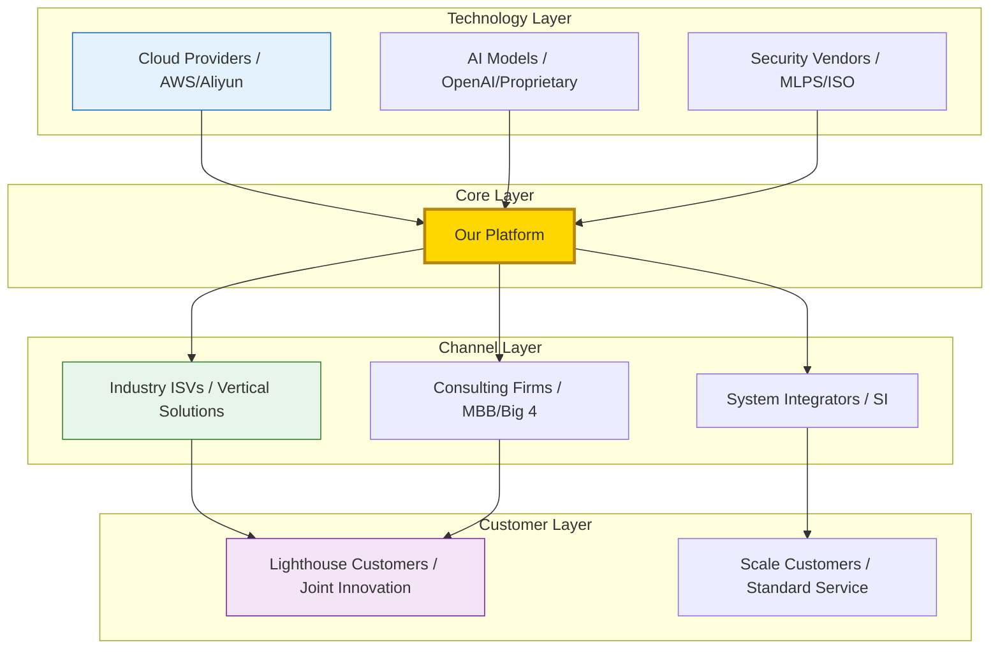

### 9.2 Partnership Model Design

| Partnership Type | Partner Role | Our Value | Partner Value | Depth |
|---------|---------|---------|---------|---------|
| **Strategic Alliance** | Cloud providers/platforms | Solution richness | Customer stickiness | Joint product + joint sales |
| **Channel Distribution** | Regional agents/ISVs | Market coverage expansion | Margin + product supplement | Training certification + rebates |
| **Technical Integration** | API/data partners | Product capability enhancement | Traffic/data feedback | Tech integration + co-branding |
| **Content Co-creation** | Media/consulting | Industry influence | Exclusive content source | Whitepapers + summits |

---

## 10. Cost Structure & Unit Economics

### 10.1 Cost Structure Analysis

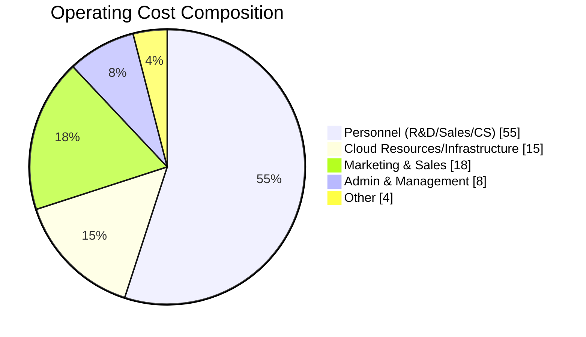

### 10.2 Unit Economics

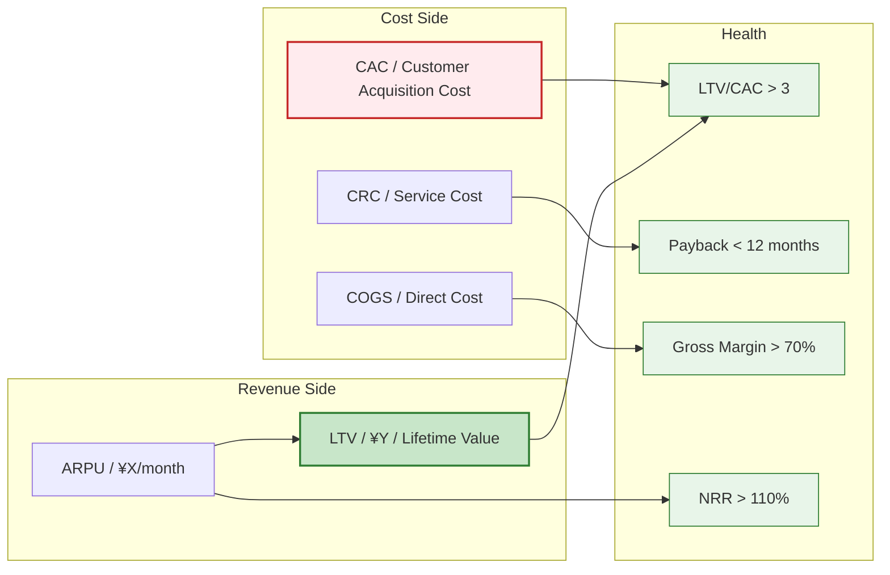

### 10.3 Key Financial Metrics

| Metric | Definition | Current | Healthy Standard | Optimization Direction |
|------|------|--------|---------|---------|
| **CAC** | Customer acquisition cost | ¥[XX] | < LTV/3 | Optimize channel mix |
| **LTV** | Customer lifetime value | ¥[XX] | > 3×CAC | Improve retention/upsell |
| **LTV/CAC** | ROI ratio | [X]:1 | > 3:1 | Bidirectional optimization |
| **Payback Period** | CAC recovery time | [X] months | < 12 months | Improve first-order value |
| **Gross Margin** | (Revenue - Direct Cost)/Revenue | [X]% | SaaS > 70% | Infrastructure optimization |
| **NRR** | Net Revenue Retention | [X]% | > 110% | Upsell + expansion |
| **Rule of 40** | Growth% + Margin% | [X]% | > 40% | Balance growth & profitability |

---

## 11. Business Model Evolution Roadmap

### 11.1 Three-Phase Evolution

> **Note**: Gantt chart is incompatible with Feishu; replaced with table description.

| Phase | Task | Start Date | End Date | Duration | Status |
|------|------|----------|----------|------|------|
| Phase 1: Point Tool | MVP Validation | 2024-01 | 2024-06 | 6 months | Completed |
| Phase 1: Point Tool | PMF Confirmation | 2024-07 | 2024-12 | 6 months | Completed |
| Phase 1: Point Tool | Point Pricing | 2024-10 | 2025-03 | 6 months | Completed |
| Phase 2: Platform | Feature Expansion | 2025-01 | 2025-06 | 6 months | In Progress |
| Phase 2: Platform | Multi-tenant Architecture | 2025-04 | 2025-09 | 6 months | In Progress |
| Phase 2: Platform | Ecosystem Openness | 2025-07 | 2025-12 | 6 months | Pending |
| Phase 3: Ecosystem | Data Flywheel | 2026-01 | 2026-06 | 6 months | Pending |
| Phase 3: Ecosystem | Platform Commission | 2026-04 | 2026-09 | 6 months | Pending |
| Phase 3: Ecosystem | Industry Standard | 2026-07 | 2026-12 | 6 months | Pending |

### 11.2 Business Model Characteristics by Phase

| Phase | Timeline | Core Model | Revenue Pattern | Key Resources | Moat |
|------|------|---------|---------|---------|--------|
| **Point Tool** | Current | Product sales | Linear growth, sales-dependent | Product capability | Feature leadership |
| **Platform** | 12-18 months | Subscription + value-add | Compound growth, network emerging | Customer data | Switching costs |
| **Ecosystem** | 24-36 months | Platform commission + data | Exponential growth, ecosystem synergy | Industry standard | Network effects |

---

## 12. Risk & Sustainability Analysis

### 12.1 Business Model Vulnerability Assessment

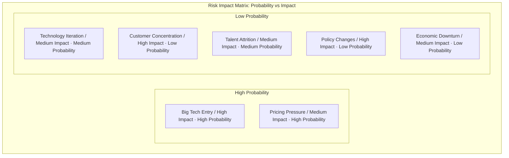

### 12.2 Sustainability Mechanisms

| Risk Type | Vulnerability | Mitigation Strategy | Monitoring Metric |
|---------|--------|---------|---------|
| **Competitive Risk** | Big tech replication | Deep vertical + data barrier | Market share change |
| **Technical Risk** | Wrong tech path | Dual-track R&D + rapid iteration | Tech debt ratio |
| **Customer Risk** | Large client churn | Customer diversification + multi-industry | Customer concentration |
| **Financial Risk** | Cash flow break | Control burn + diversified revenue | Runway months |
| **Compliance Risk** | Data regulation | Compliance pre-positioning + localization | Audit results |

### 12.3 ESG & Long-term Value

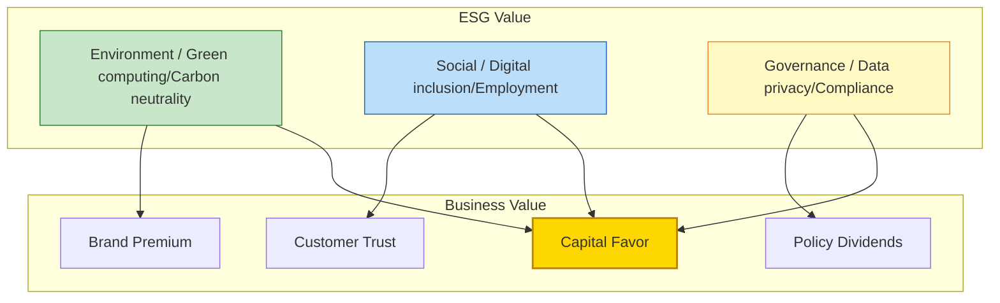

---

## Appendix

### A. Glossary

| Term | English | Definition |
|------|------|------|
| CAC | Customer Acquisition Cost | Customer acquisition cost |
| LTV | Lifetime Value | Customer lifetime value |
| NRR | Net Revenue Retention | Net revenue retention rate |
| PMF | Product-Market Fit | Product-market fit |
| PLG | Product-Led Growth | Product-led growth |
| ARR | Annual Recurring Revenue | Annual recurring revenue |
| MRR | Monthly Recurring Revenue | Monthly recurring revenue |
| ARPU | Average Revenue Per User | Average revenue per user |

### B. Reference Frameworks

- Osterwalder, A. & Pigneur, Y. *Business Model Generation*
- Maurya, A. *Running Lean*
- Ellis, S. & Brown, M. *Hacking Growth*
- McKinsey 7S Model / Porter Value Chain / Bain Profit System

---

> **Document Maintenance**: Recommend quarterly retrospective update; immediate revision for major strategic changes.
>
> **Distribution**: Core management team, board of directors, strategic investors (after signing NDA).
