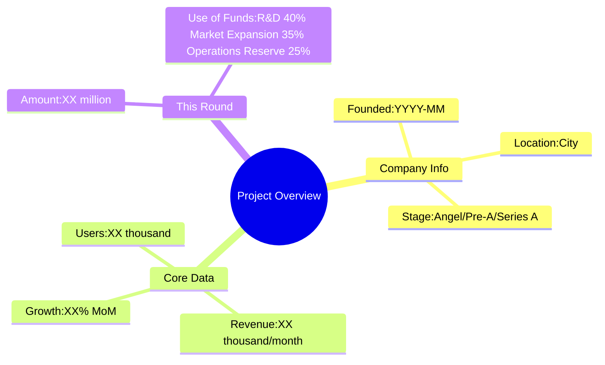
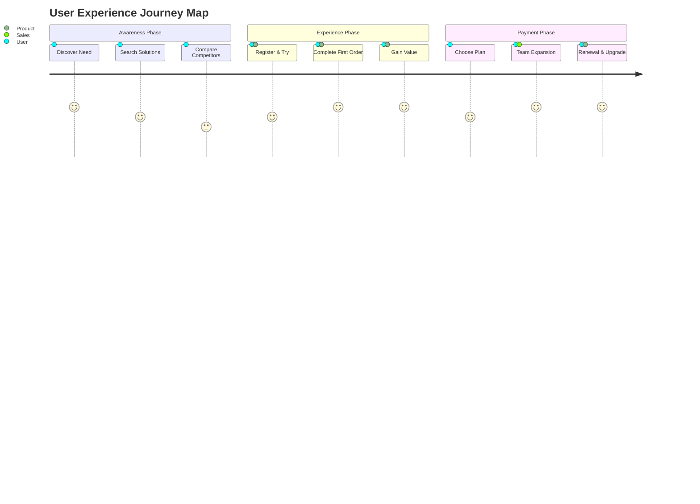
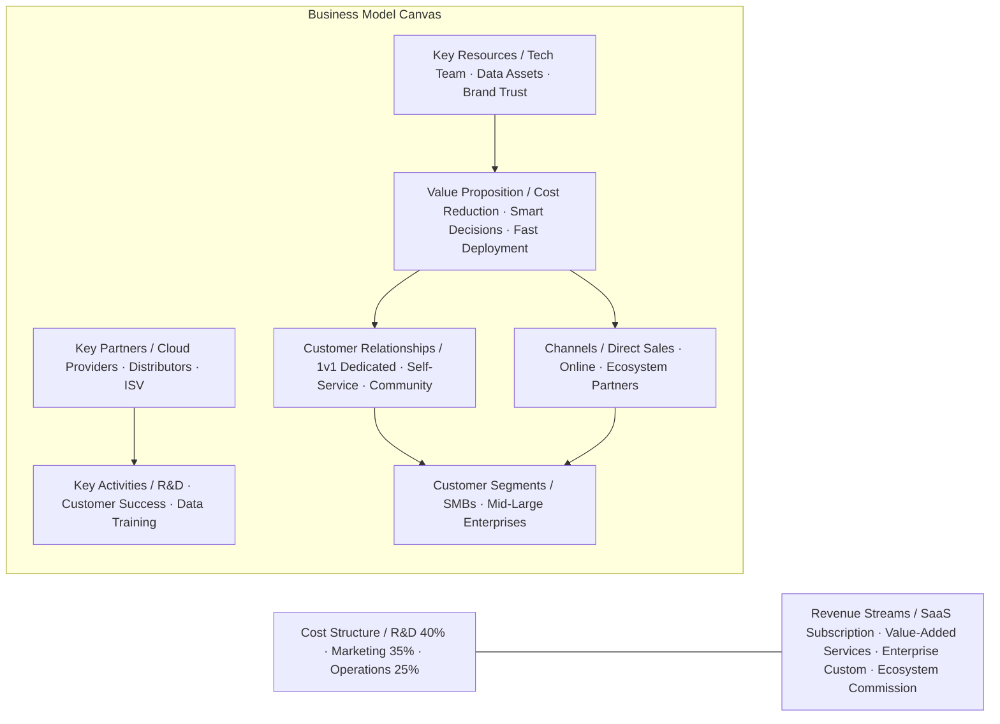
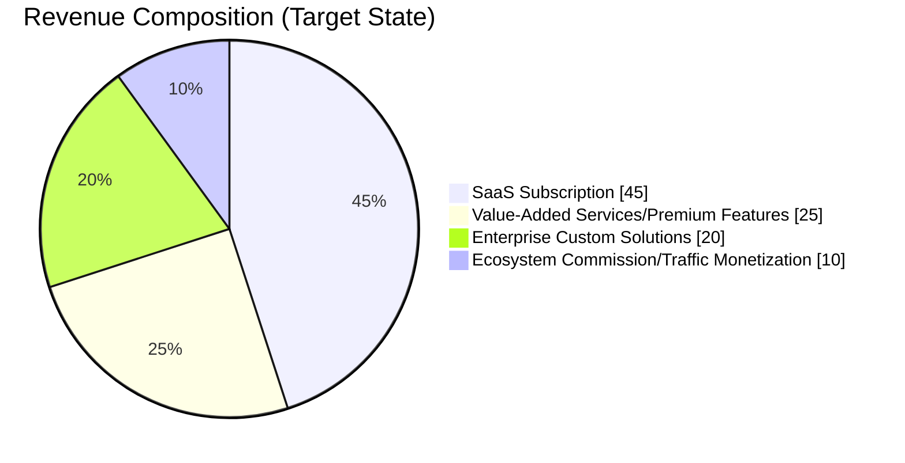
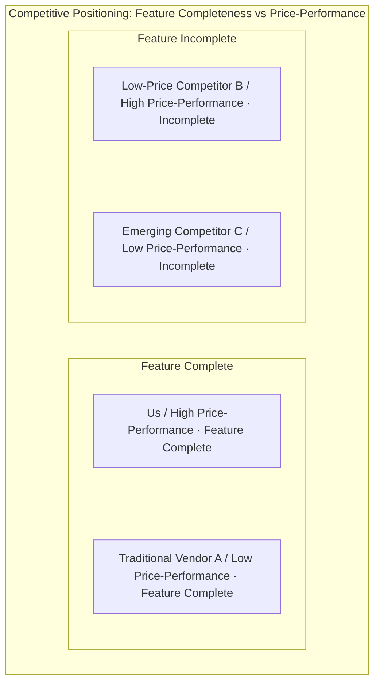
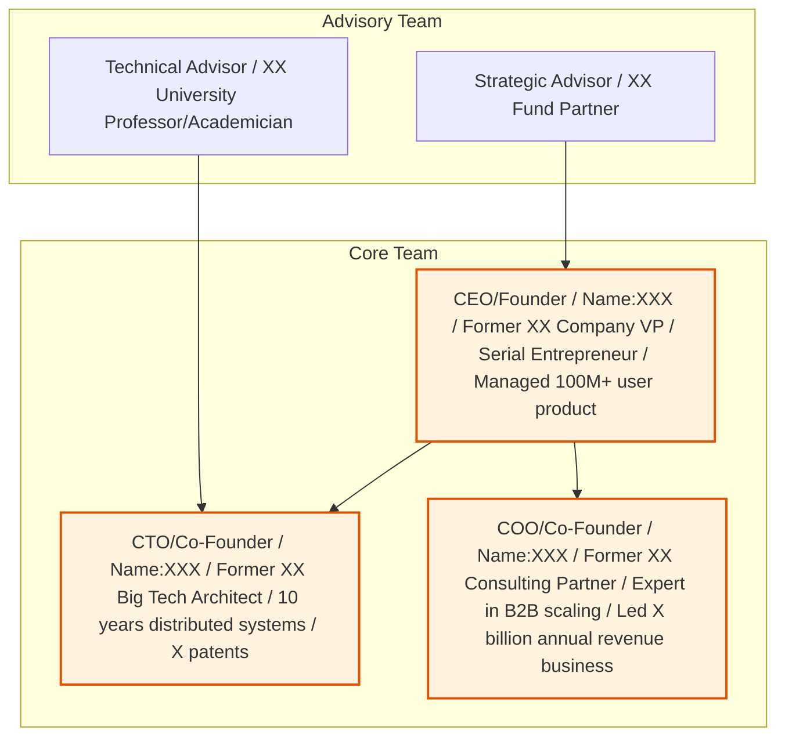
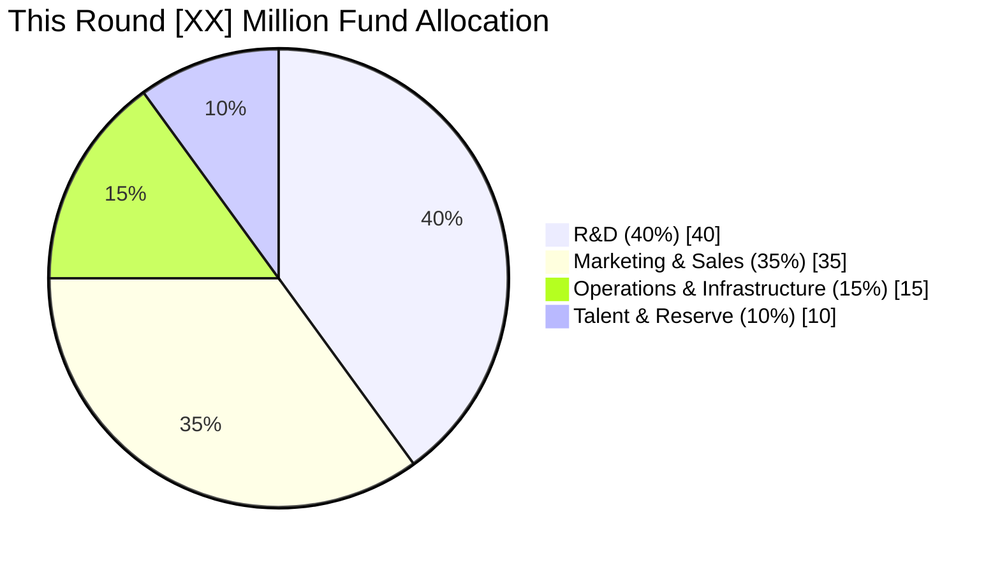
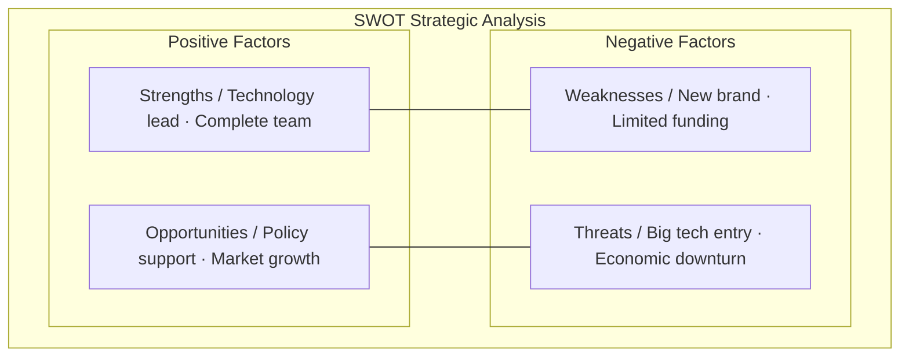

# [Product/System Name (English)] - Business Plan (BP)

> **Document Status:** 🟡 Under Review / 🟢 Passed / 🔴 Rejected
>
> **Confidentiality Level:** Confidential / Internal / Public
>
> **Version:** vX.X
>
> **Date:** YYYY-MM-DD
>
> **Author:** [Name/Role]
>
> **Reviewer:** [Name/Role]
>
> **Audience:** [Role List]

---

## 0. Document Guide

### 0.1 Document Purpose & Scope

[Describe the purpose, applicable scenarios, and non-applicable scenarios of this document]

### 0.2 Related Documents

| Document Type | Filename | Related Sections |
|---------|--------|---------|
| [Type] | [Filename] [Line Range] | [Section Description] |

> **Reference Format**: Related documents use the `filename line range` format (e.g., `【Template】Technical Requirements Document (TRD).md 3-17`). Line numbers may change as documents are updated; refer to the actual content.

### 0.3 Change Log

| Version | Date | Author | Changes | Reviewer |
| :--- | :--- | :--- | :--- | :--- |
| v0.1 | YYYY-MM-DD | [Name] | Initial draft | [Reviewer] |

---

## 2. Executive Summary

> ⚠️ **Core Principle**: This is the most important part of the entire BP. Investors use 3-5 minutes to decide whether to continue reading. Keep it to **1-2 pages**, no more than 3 lines per paragraph.

### 2.1 Investment Highlights
- **Sector**: [XX] industry, market size [XX] billion yuan, CAGR [XX]%
- **Product**: [Product Name], validated PMF, core metric [XX]
- **Team**: Founders from [top company/prestigious university], previously managed [XX]-scale business
- **Fundraising**: Seeking [XX] million yuan / [XX] million USD this round, offering [XX]% equity

### 2.2 Project Overview



---

## 3. Pain Points & Market Opportunity

### 3.1 Core Pain Point Analysis

> 💡 **Writing Tip**: Describe pain points in "users' own words," not self-congratulatory language. Prove this is a **real need, high-frequency, strong willingness-to-pay** pain point.

| Pain Point | Current State | User Cost | Market Gap |
|---------|---------|---------|---------|
| **Low Efficiency** | Traditional method takes [X] hours | Labor cost [XX] per case | No automation tools |
| **Information Silos** | Data spread across [N] systems | Decision delay [X] days | No unified platform |
| **High Cost** | Existing solution [XX] thousand/year | SMBs can't afford | No affordable product |

### 3.2 Market Size & Trends

| Category | Bar Value | Line Value |
|:---|:---:|:---:|
| 2024 | 120 | 120 |
| 2025 | 180 | 180 |
| 2026 | 260 | 260 |
| 2027 | 350 | 350 |
| 2028 | 480 | 480 |

> **Note**: xychart-beta is a Feishu-incompatible Mermaid type; replaced with table description (template sample data).

**Market Data Support:**
- **TAM (Total Addressable Market)**: [XX] billion yuan
- **SAM (Serviceable Addressable Market)**: [XX] billion yuan
- **SOM (Serviceable Obtainable Market)**: [XX] billion yuan (3-year target)

---

## 4. Product & Service Solution

### 4.1 Product Architecture

```mermaid
graph TB
    subgraph User-facing
        A[Web Console] --> B[Mobile App]
        A --> C[Mini-program/Lite App]
    end

    subgraph Core Engine
        D[AI Decision Engine] --> E[Real-time Computing Layer]
        E --> F[Data Platform]
    end

    subgraph Infrastructure
        G[Cloud-Native Architecture] --> H[Security & Compliance Layer]
        H --> I[Multi-Tenant Isolation]
    end

    User-facing --> Core Engine
    Core Engine --> Infrastructure

    style D fill:#e1f5fe,stroke:#01579b,stroke-width:2px
    style E fill:#e1f5fe,stroke:#01579b,stroke-width:2px
```

### 4.2 Product Value Matrix

| Feature Module | Pain Point Solved | Core Advantage | Technical Moat |
|---------|---------|---------|---------|
| Smart Analytics | Slow manual processing | 10x efficiency improvement | Proprietary NLP algorithms |
| Auto Orchestration | Tedious processes | Zero-code configuration | Patented workflow engine |
| Real-time Alerts | Reactive remediation | 24h advance warning | Time-series prediction model |

### 4.3 User Journey & Aha Moment



---

## 5. Business Model & Revenue Path

### 5.1 Business Model Canvas



### 5.2 Revenue Model



### 5.3 Unit Economics

| Metric | Value | Industry Benchmark | Notes |
|-----|------|---------|------|
| **CAC (Customer Acquisition Cost)** | ¥[XX] | ¥[XX] | Includes sales + marketing |
| **LTV (Lifetime Value)** | ¥[XX] | ¥[XX] | Based on 36 months |
| **LTV/CAC** | [X]:1 | >3:1 Healthy | ROI ratio |
| **Monthly Churn Rate** | [X]% | <5% Healthy | Includes plan downgrades |
| **Payback Period** | [X] months | <12 months ideal | CAC recovery cycle |

---

## 6. Market Competition & Moat

### 6.1 Competitive Landscape



### 6.2 Competitive Comparison

| Dimension | Us | Competitor A (Traditional) | Competitor B (Emerging) | Competitor C (International) |
|---------|------|---------------|---------------|---------------|
| **Pricing Model** | On-demand subscription | High annual fee | Free + premium | Pay-per-use |
| **Deployment** | 5-minute integration | 2-week implementation | SaaS only | Hybrid cloud |
| **Core Algorithm** | Proprietary/Patented | Open source | Third-party API | Proprietary |
| **Customer Success** | 1v1 dedicated | Ticket-based | Community support | Email support |
| **Data Security** | MLPS Level 3 | MLPS Level 2 | No certification | SOC2 |

### 6.3 Moat Construction

```mermaid
graph LR
    subgraph Moat System
        A[Network Effects] --> B[Switching Costs]
        B --> C[Scale Economies]
        C --> D[Brand Recognition]
        D --> E[Technical Patents]
    end

    subgraph Current Stage
        F[Data Flywheel / More Users → Better Data → More Accurate Product]
    end

    Moat System --> F
    style A fill:#c8e6c9,stroke:#2e7d32
    style E fill:#c8e6c9,stroke:#2e7d32
```

---

## 7. Operations Plan & Milestones

### 7.1 Development Roadmap

> **Note**: Gantt chart is incompatible with Feishu; replaced with table description.

| Phase | Task | Start Date | End Date | Duration | Status |
|------|------|----------|----------|------|------|
| Product R&D | MVP Validation | 2024-01 | 2024-06 | 6 months | Completed |
| Product R&D | Core Features V1.0 | 2024-07 | 2024-12 | 6 months | Completed |
| Product R&D | Platform V2.0 | 2025-01 | 2025-06 | 6 months | In Progress |
| Product R&D | Ecosystem V3.0 | 2025-07 | 2025-12 | 6 months | Pending |
| Market Expansion | Seed Users 100 | 2024-01 | 2024-06 | 6 months | Completed |
| Market Expansion | Industry Benchmarks 10 | 2024-07 | 2024-12 | 6 months | Completed |
| Market Expansion | Scale to 1000 | 2025-01 | 2025-06 | 6 months | In Progress |
| Market Expansion | International/New Industry | 2025-07 | 2025-12 | 6 months | Pending |
| Team Building | Core Team 10 | 2024-01 | 2024-06 | 6 months | Completed |
| Team Building | Expand to 30 | 2024-07 | 2024-12 | 6 months | Completed |
| Team Building | Expand to 80 | 2025-01 | 2025-06 | 6 months | In Progress |
| Team Building | Expand to 150 | 2025-07 | 2025-12 | 6 months | Pending |

### 7.2 Key Milestones & KPI

| Phase | Timeline | Core Objective | Key Metrics |
|-----|------|---------|---------|
| **Validation** | Completed | PMF validation | NPS > 40, Retention > 60% |
| **Growth** | Current | Scalable acquisition | ARR breakthrough [XX] million |
| **Expansion** | Next 12 months | Market penetration | [XX] paying customers |
| **Profitability** | Next 24 months | Positive cash flow | Monthly breakeven |

---

## 8. Core Management Team

> 💡 **Investor Perspective**: Early-stage projects are judged by team; growth-stage by data. Team introductions must be **specific and verifiable** — avoid empty claims like "10 years of industry experience."

### 8.1 Founding Team



### 8.2 Team Background & Responsibilities

| Position | Name | Core Background | Responsibilities | Full/Part-time |
|-----|------|---------|---------|----------|
| CEO | [Name] | [Big Tech] [X] years, [Specific achievements] | Strategy/Fundraising/Product | Full-time |
| CTO | [Name] | [University] [Major], [Patents/Papers] | Tech/R&D | Full-time |
| CMO | [Name] | [Notable case], [Channel resources] | Marketing/Brand | Full-time |
| Sales VP | [Name] | [Industry client resources], [Historical performance] | Commercialization/Customer Success | Full-time |

---

## 9. Financial Forecast & Fundraising

### 9.1 Historical & Projected Financial Data

**Revenue Forecast:**

| Category | Bar Value | Line Value |
|:---|:---:|:---:|
| 2023 | 50 | 50 |
| 2024 | 300 | 300 |
| 2025E | 1,200 | 1,200 |
| 2026E | 3,500 | 3,500 |
| 2027E | 8,000 | 8,000 |

**Net Profit Forecast:**

| Category | Bar Value | Line Value |
|:---|:---:|:---:|
| 2023 | -200 | -200 |
| 2024 | -500 | -500 |
| 2025E | -300 | -300 |
| 2026E | 500 | 500 |
| 2027E | 2,000 | 2,000 |

> **Note**: xychart-beta is a Feishu-incompatible Mermaid type; replaced with table description (template sample data).

### 9.2 Financial Forecast (Next 3-5 Years)

| Metric (10K yuan) | 2024 Actual | 2025 Forecast | 2026 Forecast | 2027 Forecast |
|------------|----------|----------|----------|----------|
| **Operating Revenue** | [XX] | [XX] | [XX] | [XX] |
| **Gross Profit** | [XX] | [XX] | [XX] | [XX] |
| **Gross Margin** | [XX]% | [XX]% | [XX]% | [XX]% |
| **Operating Expenses** | [XX] | [XX] | [XX] | [XX] |
| **Net Profit** | [XX] | [XX] | [XX] | [XX] |
| **Net Margin** | [XX]% | [XX]% | [XX]% | [XX]% |

### 9.3 Fundraising & Use of Funds



**Fundraising Details:**
- **Round**: [Angel/Pre-A/Series A/B]
- **Amount**: [XX] million RMB / [XX] million USD
- **Equity Offered**: [XX]%
- **Pre-money Valuation**: [XX] million (based on [XX]x ARR or [XX]x PS)
- **Use of Funds**:
  - R&D: [XX] million (40%) — Core algorithm optimization, V2.0 platform development
  - Market Expansion: [XX] million (35%) — Sales team building, brand advertising, channel development
  - Operations Reserve: [XX] million (15%) — Cloud resources, compliance certification, office space
  - Talent Recruitment: [XX] million (10%) — Key position hiring, option pool top-up

---

## 10. Risk Analysis & Mitigation

### 10.1 SWOT Analysis



### 10.2 Core Risks & Mitigation

| Risk Type | Description | Probability | Impact | Mitigation Strategy |
|---------|---------|---------|---------|---------|
| **Market Risk** | Big tech quick follow-up, price war | Medium | High | Deep vertical focus, build data barrier |
| **Technical Risk** | Core algorithm underperforms | Low | High | Dual technical track, prepare Plan B |
| **Operations Risk** | Key talent attrition | Medium | Medium | Enhanced option incentives, knowledge documentation |
| **Financial Risk** | Fundraising environment deteriorates | Medium | High | Control burn rate, maintain 18-month runway |
| **Compliance Risk** | Data regulation policy changes | Low | Medium | Proactive MLPS/ISO application, legal pre-positioning |

---

## 📎 Appendix

> The following can be compiled as a separate appendix document for deep due diligence review.

1. **Detailed Financial Model** (Excel): 3-5 year complete three-statement forecast with assumptions
2. **Product Demo Video**: Core feature operation flow
3. **Customer Testimonials/Case Studies**: Before-and-after comparison data from [benchmark customer]
4. **Intellectual Property List**: Patents, software copyrights, trademark list
5. **Detailed Team Resumes**: Complete backgrounds of core members
6. **Industry Research Report**: Referenced third-party authoritative data sources

---

## ✅ Writing Checklist (Pre-submission Self-check)

| Check Item | Status | Notes |
|-------|------|------|
| Is the one-line value proposition clear? | ☐ | Understandable to non-industry people |
| Are pain points described in users' own words? | ☐ | Avoid self-congratulatory expression |
| Do market data have authoritative sources? | ☐ | Cite iResearch/IDC/government reports |
| Is the business model clear on how revenue works? | ☐ | Revenue sources, pricing, cost structure |
| Is the competitive analysis objective? | ☐ | Don't disparage competitors, highlight differentiation |
| Are financial forecasts reasonable? | ☐ | Avoid "1 billion profit in one year" |
| Are fundraising amount and use clear? | ☐ | 33% of BPs fail here |
| Is contact information complete? | ☐ | Founder's phone + WeChat + email |

---

> 📧 **Contact Information**
> - Founder: [Name]
> - Phone: [Number]
> - WeChat: [WeChat ID]
> - Email: [email@company.com]
> - Company Website: [www.company.com]

---

### 💡 Usage Tips

1. **Version Management**: Prepare three versions
   - **1-page Executive Summary** (PDF, for initial email outreach)
   - **12-15 page Presentation Version** (PPT/Markdown, for roadshow)
   - **30-50 page Full Version** (Word/Markdown, for deep due diligence)

2. **Charts First**: Every page must have at least 1 chart or data point, text no more than 100 characters.

3. **Data Authenticity**: All forecasts based on verifiable assumptions, prepare Excel working papers for follow-up questions.

4. **Customize**: Adjust emphasis for different investment institutions — financial VCs look at growth data, strategic investors look at synergy value.
