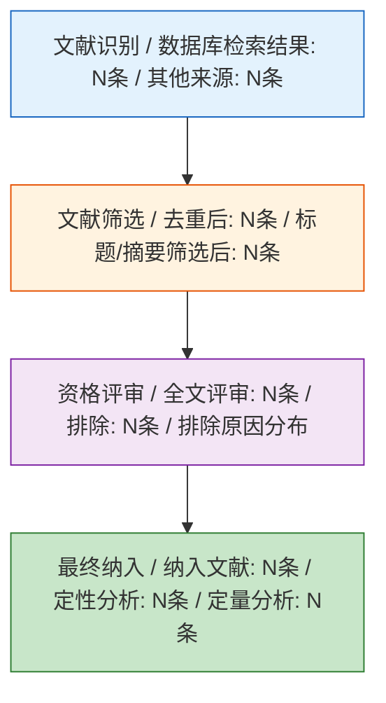
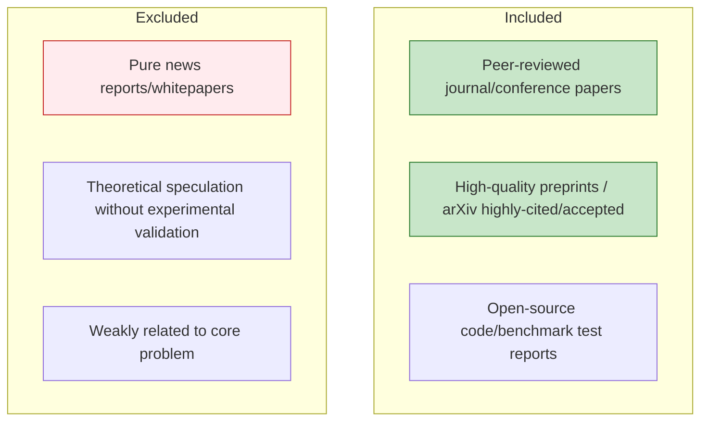
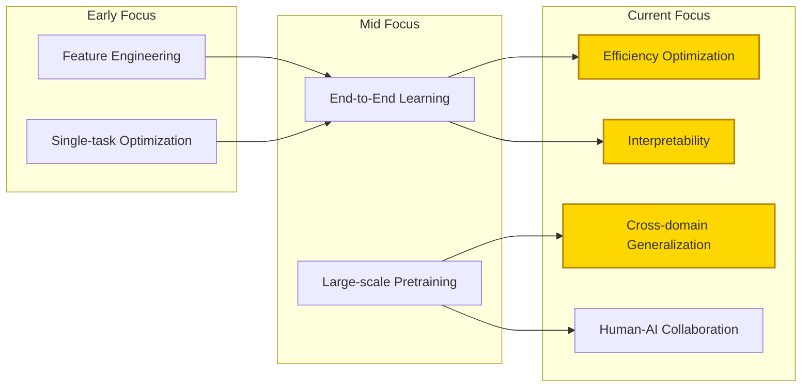
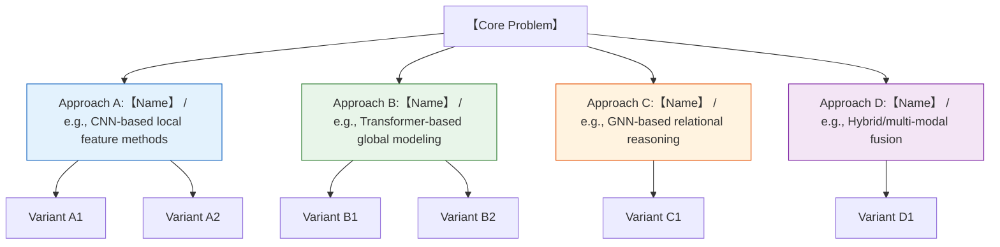
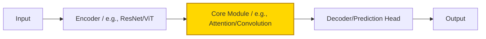
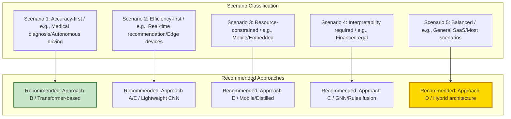
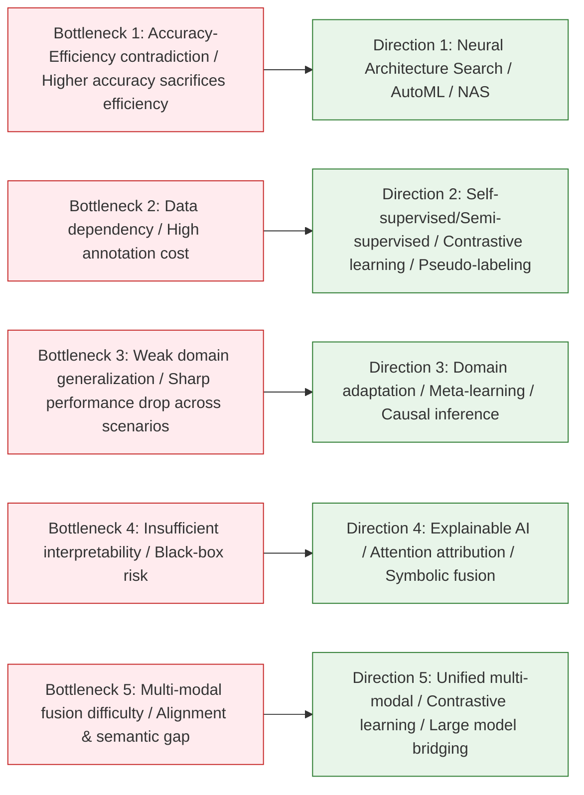
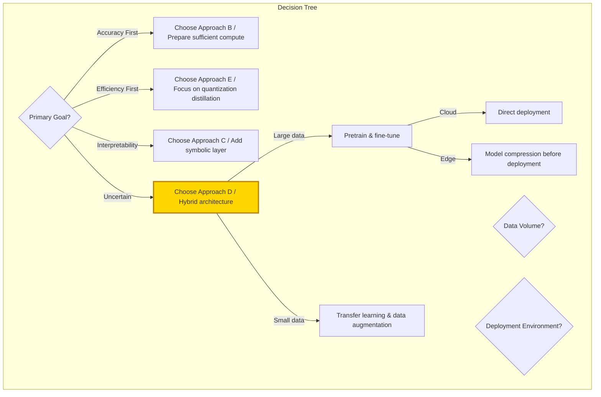

# [Product/System Name (English)] - Literature Review

> **Document Status:** 🟡 Under Review / 🟢 Passed / 🔴 Rejected
>
> **Confidentiality Level:** Confidential / Internal / Public
>
> **Version:** vX.X
>
> **Date:** YYYY-MM-DD
>
> **Author:** [Name/Role]
>
> **Reviewer:** [Name/Role]
>
> **Audience:** [Role List]
>
> **Article Type**: Survey / Review Report
>
> **Core Objective**: Systematically review the research evolution of [Topic], categorize and compare mainstream technical approaches, establish an evaluation framework, and recommend the current optimal path
>
> **Search Scope**: 20XX–2026, Web of Science / Scopus / arXiv / IEEE / CNKI
>
> **Included Literature**: After screening, a total of **XXX** core papers were included

---

## 0. Document Guide

### 0.1 Document Purpose & Scope

[Describe the purpose, applicable scenarios, and non-applicable scenarios of this document]

### 0.2 Related Documents

| Document Type | Filename | Related Sections |
|---------|--------|---------|
| [Type] | [Filename] [Line Range] | [Section Description] |

> **Reference Format**: Related documents use the `filename line range` format (e.g., `【Template】Technical Requirements Document (TRD).md 3-17`). Line numbers may change as documents are updated; refer to the actual content.

### 0.3 Change Log

| Version | Date | Author | Changes | Reviewer |
| :--- | :--- | :--- | :--- | :--- |
| v0.1 | YYYY-MM-DD | [Name] | Initial draft | [Reviewer] |
| v0.2 | 2026-XX-XX | [Name] | Example: Added XXX analysis | [Reviewer] |

---

## Abstract

**Background**: [One sentence establishing domain background and core problem].
**Method**: Following systematic review methodology, retrieved from **N** databases, categorized literature into **K** major classes by technical route, and established a comparison framework across **five dimensions: accuracy, efficiency, generalizability, interpretability, and deployment cost**.
**Findings**:
1. The field has undergone a three-stage evolution from **[Early Paradigm] → [Mid Paradigm] → [Current Paradigm]**;
2. Current mainstream approaches can be divided into **[Approach A], [Approach B], [Approach C]**, each excelling in **[a specific dimension]**;
3. Under comprehensive evaluation, **[a specific approach/hybrid approach]** performs best in **[a specific scenario]**, but still has bottlenecks in **[a specific scenario]**.
**Conclusion**: Future research should prioritize breakthroughs in **[Direction 1]** and **[Direction 2]**, and recommend **[Recommended Approach]** as the baseline for practical applications.

---

## 1. Research Methodology Statement

### 1.1 Paper Positioning

This paper positions itself as one of the following (required, choose one):

- [ ] **Systematic Review**: Follows PRISMA 2020 guidelines, with reproducible search strategies, explicit inclusion/exclusion criteria, and bias risk assessment
- [ ] **Narrative Review / Research Progress**: Selectively reviews literature based on author expertise, provides field overview but does not guarantee exhaustiveness

**Positioning Rationale**: [Explain why this positioning was chosen, e.g., search process is traceable/not traceable, whether PRISMA is followed, etc.]

### 1.2 Methodology Applicability Statement

| Statement Item | Content |
|--------|------|
| Search strategy reproducibility | Yes/No. If no, explain why |
| Bias risk assessment | Completed/Not completed |
| Evidence level annotation | Completed/Not completed |
| Peer-reviewed literature ratio | XX% |

### 1.3 PRISMA Flowchart (Required for Systematic Reviews only)

> If this paper is positioned as a narrative review/research progress, mark this section "Not Applicable" and skip.



**Search Details:**

| Database | Search Query | Search Date | Initial Results | After Dedup |
|--------|--------|---------|---------|--------|
| [Database 1] | [Query] | YYYY-MM-DD | N | N |
| [Database 2] | [Query] | YYYY-MM-DD | N | N |

---

## 3. Introduction

### 3.1 Research Background & Core Problem

[Research Field] has received widespread attention in recent years, with the core challenge being: **[Define the core scientific/engineering problem in 1-2 sentences]**. For example:

> How to achieve **[Objective]** under **[Constraints]**, while balancing **[Metric 1]** and **[Metric 2]**?

This problem has significant value in **[Application Scenario A], [Application Scenario B], [Application Scenario C]**.

### 3.2 Why This Review Is Needed

Existing reviews have the following shortcomings:
- **[Shortcoming 1]**: Most literature only lists techniques, lacking **direct comparison between approaches**;
- **[Shortcoming 2]**: No unified **multi-dimensional evaluation framework**, leading to ambiguous definitions of "optimal";
- **[Shortcoming 3]**: Conclusions not updated with **latest advances (2024–2026)**.

**Differentiated contributions** of this review:
1. Establish a **five-dimensional evaluation framework** (accuracy / efficiency / generalizability / interpretability / cost);
2. Provide **quantitative/semi-quantitative comparison** for each approach category;
3. Explicitly recommend the **current optimal technical path** with applicable boundaries.

### 3.3 Review Scope & Boundaries



---

## 4. Research Evolution

### 4.1 Three-Stage Development Timeline

> **Note**: Gantt chart is incompatible with Feishu; replaced with table description.

| Phase | Task | Start Year | End Year | Duration | Status |
|------|------|----------|----------|------|------|
| Incubation: Problem Definition | Foundational theory established | 2015 | 2018 | 4 years | Completed |
| Incubation: Problem Definition | First benchmark dataset | 2017 | 2019 | 3 years | Completed |
| Incubation: Problem Definition | Early heuristic methods | 2018 | 2021 | 4 years | Completed |
| Development: Method Explosion | Deep learning introduced | 2020 | 2023 | 4 years | Completed |
| Development: Method Explosion | Multi-branch architecture competition | 2022 | 2025 | 4 years | Completed |
| Development: Method Explosion | Large-scale pretraining | 2024 | 2026 | 3 years | Completed |
| Maturity: Optimization & Deployment | Efficiency optimization direction | 2025 | 2026 | 2 years | In Progress |
| Maturity: Optimization & Deployment | Multi-modal/cross-domain fusion | 2025 | 2026 | 2 years | In Progress |
| Maturity: Optimization & Deployment | Interpretability & trustworthiness | 2025 | 2026 | 2 years | In Progress |
| Maturity: Optimization & Deployment | Industrial-grade deployment | 2025 | 2026 | 2 years | Milestone |

### 4.2 Representative Works by Phase

| Phase | Timeline | Core Characteristics | Milestone Paper | Key Limitations |
|------|------|---------|-----------|---------|
| **Incubation** | 20XX–20XX | Rule-driven / Statistical methods | [Author A, Year] First problem definition | Poor generalizability, manual features |
| **Development** | 20XX–20XX | Deep learning dominant, accuracy leap | [Author B, Year] Proposed base architecture | High compute cost, black-box |
| **Maturity** | 20XX–2026 | Efficiency-accuracy-interpretability trade-off | [Author C, Year] Achieved SOTA | Scenario adaptation still needs tuning |

### 4.3 Research Theme Evolution



---

## 5. Mainstream Approach Classification & Principles

> **Classification Logic**: Based on **[core technical differences, e.g., architecture type / learning paradigm / optimization objective]**, existing research is divided into **N** major categories.

### 5.1 Approach Overview



### 5.2 Approach A: {Approach Name}

**Core Idea**:
> [Summarize the core assumption and solution approach in 2-3 sentences]

**Typical Architecture**:



**Representative Papers & Core Contributions**:

| Paper | Year | Core Innovation | Key Problem Solved |
|------|------|---------|---------------|
| [Author A1] | 20XX | [Innovation] | [Problem] |
| [Author A2] | 20XX | [Innovation] | [Problem] |
| [Author A3] | 20XX | [Innovation] | [Problem] |

**Strengths & Weaknesses**:
- ✅ **Strengths**: [e.g., Strong local feature capture, computationally efficient]
- ❌ **Weaknesses**: [e.g., Weak long-range dependency modeling, requires large labeled datasets]

---

## 6. Multi-Dimensional Comparative Analysis

### 6.1 Evaluation Framework Design

This review establishes evaluation criteria across **five dimensions**:

| Dimension | Definition | Measurement | Weight (Recommended) |
|------|------|---------|-------------|
| **Accuracy** | Performance on standard benchmarks | Accuracy / F1 / mAP / BLEU etc. | 30% |
| **Efficiency** | Inference speed and resource usage | FPS / Parameters / FLOPs / Memory | 25% |
| **Generalizability** | Cross-domain/cross-task/few-shot performance | Cross-dataset performance degradation | 20% |
| **Interpretability** | Decision process transparency | Visualization/attribution analysis/human understandability | 15% |
| **Deployment Cost** | Engineering difficulty and maintenance cost | Training cost / Hardware requirements / Team barrier | 10% |

### 6.2 Detailed Comparison Matrix

| Dimension | Approach A | Approach B | Approach C | Approach D (Hybrid) | Approach E (Lightweight) |
|---------|-------|-------|-------|--------------|----------------|
| **Accuracy** | ⭐⭐⭐ | ⭐⭐⭐⭐⭐ | ⭐⭐⭐⭐ | ⭐⭐⭐⭐⭐ | ⭐⭐⭐⭐ |
| **Inference Efficiency** | ⭐⭐⭐⭐⭐ | ⭐⭐⭐ | ⭐⭐⭐⭐ | ⭐⭐⭐⭐ | ⭐⭐⭐⭐⭐ |
| **Training Efficiency** | ⭐⭐⭐⭐⭐ | ⭐⭐ | ⭐⭐⭐ | ⭐⭐⭐ | ⭐⭐⭐⭐ |
| **Generalizability** | ⭐⭐⭐ | ⭐⭐⭐⭐⭐ | ⭐⭐⭐⭐ | ⭐⭐⭐⭐⭐ | ⭐⭐⭐⭐ |
| **Interpretability** | ⭐⭐⭐⭐ | ⭐⭐ | ⭐⭐⭐⭐⭐ | ⭐⭐⭐ | ⭐⭐⭐ |
| **Deployment Cost** | Low | High | Medium | High | Low |
| **Data Dependency** | Medium | High | Medium | High | Medium |
| **Typical Scenario** | Real-time/Edge | Accuracy-first | Relational reasoning | General scenarios | Mobile |

### 6.3 Benchmark Data Comparison

> **Data Source**: Public results on **[Standard Dataset, e.g., XXX-Bench / GLUE / COCO]**.

| Approach | Representative Model | Dataset | Core Metric | Value | Parameters | Inference Latency |
|------|---------|--------|---------|------|--------|---------|
| Approach A | [Model A] | [Dataset] | [Metric] | [X.XX] | [XM] | [Xms] |
| Approach B | [Model B] | [Dataset] | [Metric] | [X.XX] | [XM] | [Xms] |
| Approach C | [Model C] | [Dataset] | [Metric] | [X.XX] | [XM] | [Xms] |
| Approach D | [Model D] | [Dataset] | [Metric] | [X.XX] | [XM] | [Xms] |
| Approach E | [Model E] | [Dataset] | [Metric] | [X.XX] | [XM] | [Xms] |

---

## 7. Optimal Approach Evaluation & Recommendation

### 7.1 Evaluation Logic

"Optimal" is not absolute but **scenario-dependent**. This review recommends by scenario:



### 7.2 Scenario-Based Optimal Recommendations

#### Scenario 1: Accuracy-First (Research/High-Value Decisions)

| Item | Content |
|------|------|
| **Recommended** | Approach B (Transformer/Large Model Route) |
| **Representative Work** | [Author B2, Year] |
| **Core Rationale** | Achieved SOTA on [Dataset], error rate reduced by **X%** |
| **Applicable Conditions** | Sufficient compute, large data, latency-tolerant |
| **Risk Warning** | Overfitting risk, black-box decisions need manual review |

#### Scenario 2: Efficiency-First (Real-Time Systems)

| Item | Content |
|------|------|
| **Recommended** | Approach E (Lightweight/Distillation/Quantization Route) |
| **Representative Work** | [Author E1, Year] |
| **Core Rationale** | Accuracy loss **<X%**, speed improvement **X times**, meets **XXms** latency requirement |
| **Applicable Conditions** | High concurrency, low latency, edge deployment |
| **Risk Warning** | Accuracy may drop sharply in extreme scenarios |

#### Scenario 3: Interpretability Required (High-Risk Decisions)

| Item | Content |
|------|------|
| **Recommended** | Approach C (GNN/Symbolic Reasoning/Attention Visualization) |
| **Representative Work** | [Author C2, Year] |
| **Core Rationale** | Decision path traceable, meets **[Regulation/Standard]** interpretability requirements |
| **Applicable Conditions** | Finance, healthcare, legal, and other regulated domains |
| **Risk Warning** | Higher modeling complexity, requires domain expert involvement |

#### Scenario 4: Balanced (Most Industrial Applications) ⭐ **Current Best**

| Item | Content |
|------|------|
| **Recommended** | **Approach D (Hybrid Architecture)** |
| **Representative Work** | [Author D2, Year] |
| **Core Rationale** | Best Pareto frontier across accuracy (**X.XX**), efficiency (**Xms**), generalizability (cross-domain degradation **<X%**) |
| **Architecture Recommendation** | [Specific architecture description, e.g., Lightweight encoder + Attention refinement + Knowledge distillation] |
| **Applicable Conditions** | General scenarios, medium team tech stack, pursuing ROI |
| **Risk Warning** | High architecture complexity, requires tuning experience |

### 7.3 Optimal Approach Technical Implementation Path

```mermaid
graph TB
    subgraph Recommended Approach D Implementation
        Step1[Step 1: Base Selection / Choose efficient backbone / e.g., EfficientNet / Swin-Tiny]
        Step2[Step 2: Core Module / Introduce [specific module] / e.g., Cross-Attention / GNN layer]
        Step3[Step 3: Training Strategy / Pretrain & fine-tune + data augmentation]
        Step4[Step 4: Efficiency Optimization / Knowledge distillation / quantization / pruning]
        Step5[Step 5: Deployment Validation / TensorRT / ONNX / Mobile testing]
    end

    Step1 --> Step2 --> Step3 --> Step4 --> Step5

    style Step1 fill:#e3f2fd,stroke:#1565c0
    style Step5 fill:#c8e6c9,stroke:#2e7d32,stroke-width:2px
```

---

## 8. Current Research Bottlenecks & Breakthrough Directions

### 8.1 Five Bottlenecks



### 8.2 Next 3 Years Priority Research Agenda

| Priority | Direction | Scientific Problem | Suggested Method | Expected Breakthrough |
|-------|------|---------|---------|-------------|
| **P0** | [Direction 1] | [Problem] | [Method] | 2026–2027 |
| **P0** | [Direction 2] | [Problem] | [Method] | 2026–2027 |
| **P1** | [Direction 3] | [Problem] | [Method] | 2027–2028 |
| **P1** | [Direction 4] | [Problem] | [Method] | 2027–2028 |
| **P2** | [Direction 5] | [Problem] | [Method] | 2028+ |

---

## 9. Conclusion

### 9.1 Core Conclusions

1. **Research Evolution**: [Topic] has completed the paradigm shift from **[Early]** to **[Current]**, currently in **[Phase Characteristics]**.
2. **Approach Landscape**: **Approach B** leads in accuracy, **Approach E** excels in efficiency, **Approach D** achieves Pareto optimality in general scenarios.
3. **Optimal Recommendations**:
   - **Research/High-accuracy scenarios** → Approach B;
   - **Real-time/Edge scenarios** → Approach E;
   - **Regulated scenarios** → Approach C;
   - **General industrial deployment** → **Approach D (Recommended)**.
4. **Future Breakthroughs**: **[Direction 1]** and **[Direction 2]** are the most likely research directions for qualitative change in the next 2 years.

### 9.2 Recommendations for Practitioners



### 9.3 Review Limitations

- Only included literature from **[Language/Database]**, may miss latest work from **[Specific region/conference]**;
- Benchmark data comes from published papers; actual deployment effects are affected by hardware/software stack;
- "Optimal" evaluation is based on current (2026) technology level and needs updating with technology iteration.

---

## References

> **Format Standard**: APA 7th Edition
>
> **Prohibitions**:
> - Do not use "XXX Authors" / "XXX et al." as placeholders for real author names
> - Do not omit journal name, volume, pages, DOI, or other required fields
> - If complete information is unavailable, mark as "source not traceable"
>
> **Literature Type Annotation**: Each reference must be annotated with type at the end:
> - [Peer-Reviewed] Peer-reviewed journal/conference paper
> - [Preprint] Preprint
> - [Industry] Industry report
> - [Other] Other

1. Author, A. A., & Author, B. B. (Year). *Title of article*. *Title of Periodical*, *Volume*(Issue), Page–Page. https://doi.org/xxxxx
2. Author, A. A. (Year). *Title of work: Subtitle*. Publisher. https://doi.org/xxxxx
3. Author, A. A. (Year). *Title of paper*. Conference Name. https://doi.org/xxxxx
4. Author, A. A. (Year). *Title of preprint*. arXiv. https://arxiv.org/abs/xxxx.xxxxx

---

## Appendix

### Appendix A: Complete List of Included Papers

| ID | Author | Year | Title | Approach Category | Core Method | Dataset | Key Metric |
|------|------|------|------|---------|---------|-----------|---------|
| 001 | Author | 2023 | Title | Approach A | CNN | Dataset | Acc=0.92 |
| 002 | Author | 2024 | Title | Approach B | Transformer | Dataset | Acc=0.96 |
| ... | ... | ... | ... | ... | ... | ... | ... |

### Appendix B: Search Queries & Screening Records

```
[Paste search queries for each database]
```

### Appendix C: Glossary

| Term | English | Definition |
|------|------|------|
| SOTA | State-of-the-Art | Current best performance |
| NAS | Neural Architecture Search | Neural architecture search |
| ... | ... | ... |
