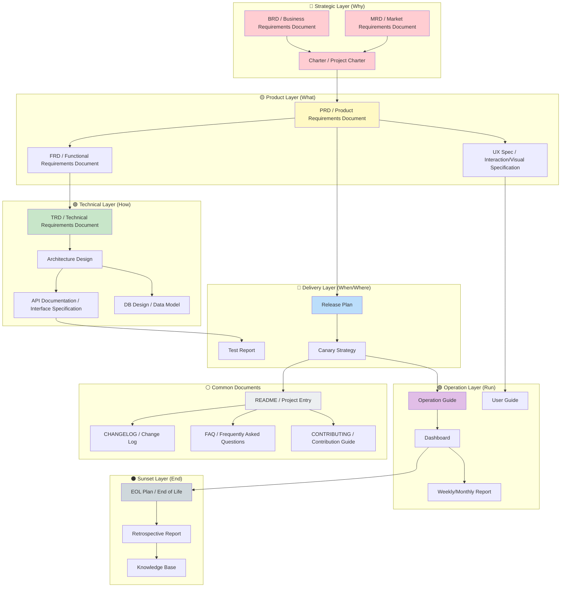
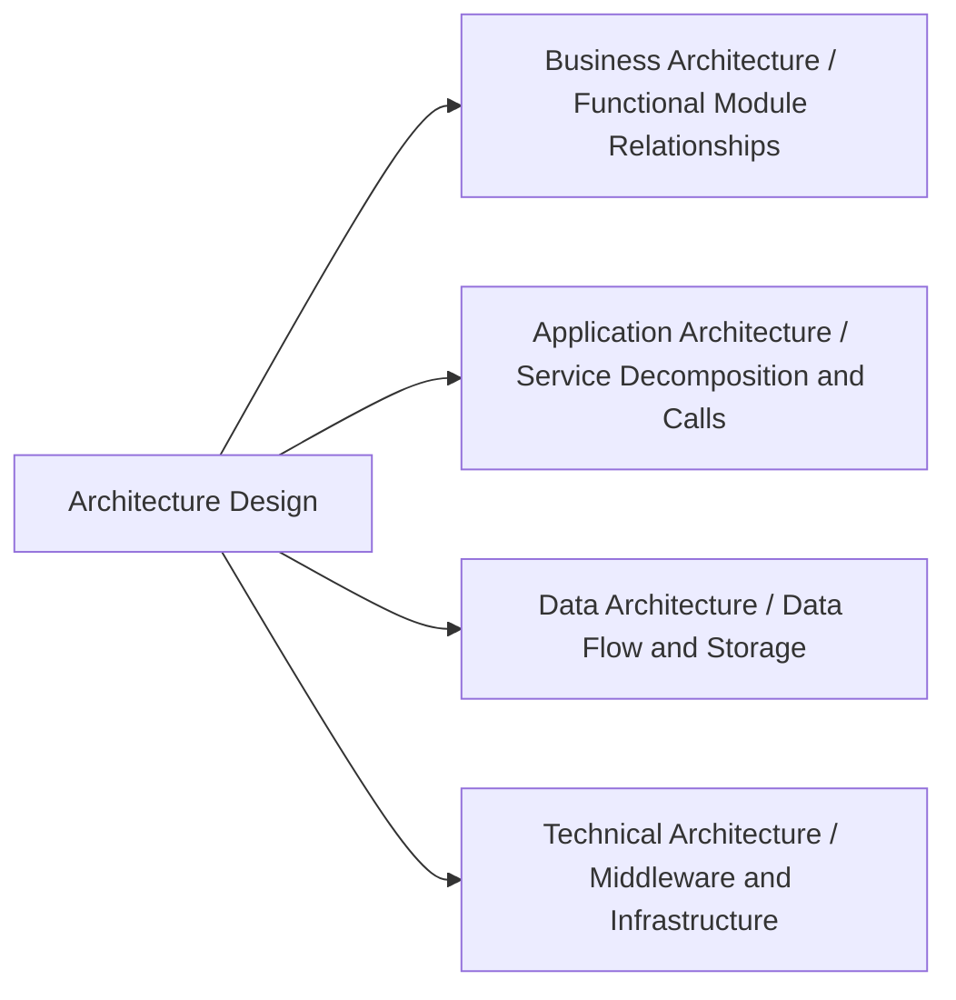
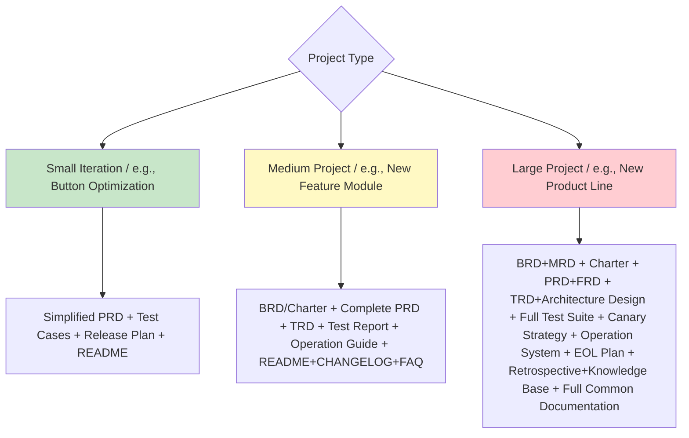

# Product Full Lifecycle Documentation Map



---

## I. Strategic Layer: Answering "Why Build This"

### 1. BRD (Business Requirements Document)

> **Purpose:** Starting point of the product lifecycle, answering "why it's worth investing resources"

| Element | Description | Key Questions |
| :--- | :--- | :--- |
| **Business Goal** | What business problem to solve | What's the business loss if we don't build this? |
| **Investment & Returns** | ROI calculation, cost-benefit analysis | Invest X, expected return Y? |
| **Success Metrics** | Quantifiable business outcomes | How to prove this project succeeded? |
| **Risks & Constraints** | Policy, resource, time limitations | What's the biggest risk? What's Plan B? |
| **Stakeholders** | Decision makers and interested parties | Who decides? Who benefits? Who opposes? |

**Typical Scenario:** Applying for budget from management, securing resources, project review.

---

### 2. MRD (Market Requirements Document)

> **Purpose:** Bridge between market and product, answering "where is the market opportunity"

| Element | Description |
| :--- | :--- |
| **Target Market** | TAM/SAM/SOM market size calculation |
| **User Personas** | Core users, marginal users, non-users |
| **Competitive Analysis** | Competitor feature matrix, differentiation opportunities |
| **User Pain Points** | Scenario-based pain point descriptions (with data) |
| **Requirement Priorities** | MoSCoW ranking from market perspective |

**Typical Scenario:** Product direction exploration, new track entry decision, annual planning.

---

### 3. Charter (Project Charter)

> **Core document in IPD system**, widely used at Huawei/Alibaba, is the "birth certificate" for formal project initiation

| Element | Description |
| :--- | :--- |
| **Project Background** | Condensed conclusions from BRD/MRD |
| **Project Goals** | Business goals + user goals + capability goals |
| **Scope Boundaries** | In Scope / Out Scope |
| **Milestones** | Key Decision Checkpoints (DCP) |
| **Core Team** | PDT (Product Development Team) members |
| **Resource Budget** | Human resources, funding, time budget |

**Typical Scenario:** Formal kick-off meeting, obtaining IPMT (Investment Review Committee) approval.

---

## II. Product Layer: Answering "What to Build"

### 4. PRD (Product Requirements Document)

> **Purpose:** The **core execution document** in the entire lifecycle, a complete template has been provided above.

**Key Features:**

- User-perspective functional descriptions
- Includes business flows, page transitions, inputs/outputs, acceptance criteria
- **Single Source of Truth (SSoT)** for development, design, testing, and operations

---

### 5. FRD (Functional Requirements Document)

> **Purpose:** System-perspective functional behavior description, often merged with PRD or serves as technical supplement to PRD

| Difference from PRD | PRD | FRD |
| :--- | :--- | :--- |
| **Perspective** | User perspective | System perspective |
| **Audience** | Everyone (including non-technical) | Development, testing |
| **Content** | User stories, interaction flows | System logic, state transitions, data flows |
| **Example** | "Users can export Excel" | "After clicking export button, system asynchronously generates file and notifies user via message queue" |

**Typical Scenario:** Used when complex systems need separate technical implementation logic breakdown.

---

### 6. UX Spec (Interaction/Visual Specification Document)

| Sub-document | Content | Responsible Role |
| :--- | :--- | :---: |
| **Interaction Prototype** | Page flows, click hotspots, interaction animations | Interaction Designer |
| **Visual Specification** | Colors, fonts, spacing, component library | Visual Designer |
| **Copy Specification** | Button copy, error messages, empty states | Product/UX Writer |

---

## III. Technical Layer: Answering "How to Build"

### 7. TRD (Technical Requirements Document)

> **Purpose:** "Translator" for technical implementation, converting PRD into technical language

| Core Section | Description |
| :--- | :--- |
| **Technical Architecture** | System topology, service decomposition, deployment architecture |
| **Data Model** | ER diagrams, data dictionary, storage solutions |
| **Interface Definition** | API contracts (OpenAPI/Swagger), field descriptions |
| **Non-functional Design** | Performance, security, scalability, disaster recovery |
| **Technology Selection** | Frameworks, middleware, third-party services and selection rationale |
| **Risk Assessment** | Technical debt, performance bottlenecks, dependency risks |

**Typical Scenario:** Technical review, architect decision basis.

---

### 8. Architecture Design Document



---

### 9. API Documentation

> **Purpose:** Contract layer between frontend/backend, third-party integrators and SDK maintainers, aligned with OpenAPI 3.x, single source of truth for gateway/mock/contract testing

| Element | Description |
| :--- | :--- |
| **Core Sections** | Endpoint list / Request-response schema / Authentication & authorization / Error codes / Version management / Rate limiting |
| **Toolchain** | Swagger / YApi / Postman / Stoplight auto-sync |
| **Contract Testing** | Pact / Dredd validation of implementation vs documentation |
| **Complete Template** | [【Template】API Documentation.md](./技术层/【模板】API文档.md) |

**Relationship with TRD/Architecture Documentation:** TRD defines "what technology to achieve what metrics", architecture documentation defines "how the system is designed", API documentation defines "what endpoints look like and how to call them".

---

### 10. Database Design Documentation

| Element | Description |
| :--- | :--- |
| **Core Sections** | Table structure / Index design / Sharding strategy / Data archiving plan |
| **ER Tools** | dbdiagram.io / DBeaver / PowerDesigner |
| **Complete Template** | [【Template】Database Design Documentation Specification.md](./技术层/【模板】数据库设计文档规范.md) |

---

## IV. Delivery Layer: Answering "When to Launch"

### 10. Release Plan

| Element | Description |
| :--- | :--- |
| **Version Planning** | Version numbering rules, release cadence (e.g., bi-weekly releases) |
| **Environment Plan** | Development → Testing → Pre-production → Production deployment sequence |
| **Rollback Plan** | Rollback trigger conditions, operation steps, data recovery |
| **Monitoring & Alerts** | Core metric monitoring, alert thresholds, on-duty arrangements |

---

### 11. Testing Related Documentation

| Document | Content | Responsible |
| :--- | :--- | :---: |
| **Test Plan** | Test scope, strategy, resources, schedule | Test Lead |
| **Test Cases** | Executable test cases based on PRD acceptance criteria | Test Engineer |
| **Test Report** | Coverage, bug statistics, remaining risks, release recommendations | Test Lead |

---

### 13. Canary/Release Plan

- Canary percentage and timeline (e.g., 5%→30%→100%)
- Observation metrics and rollback thresholds
- Emergency response plan (one-click rollback, rate limiting, degradation)

---

## V. Operation Layer: Answering "How to Run"

### 14. Operation Guide / SOP

| Module | Content |
| :--- | :--- |
| **Function Description** | Operation guide for operations personnel |
| **Common Issues** | FAQ, troubleshooting manual |
| **Data Interpretation** | Core metric definitions, anomaly judgment criteria |
| **Activity Configuration** | Marketing tool configuration steps, review checklist |

---

### 15. Dashboard and Event Tracking Documentation

- **Event Tracking Specification:** Event definitions, attribute dictionary, reporting timing
- **Dashboard:** Core metrics real-time/offline dashboard configuration
- **Data Standards:** Metric calculation logic, attribution rules

---

### 16. User Help Documentation (User Guide / Help Center)

- Self-service help content for end users
- New feature introduction copy, video tutorials

---

### 17. Weekly/Monthly Report

> **Purpose:** Regular synchronization tool for teams and individuals, result-oriented + data-driven + risk-transparent

| Element | Description |
| :--- | :--- |
| **Report Cycle** | Weekly / Monthly / Quarterly Report |
| **Core Sections** | Summary / Completed / In Progress / Blockers / Next Period Plan / Data Metrics |
| **Complete Template** | [【Template】Weekly/Monthly Report.md](./运营层/【模板】周报月报.md) |

**Typical Scenario:** Individual/team weekly reports, monthly briefings, cross-team progress synchronization.

---

## VI. Sunset Layer: Answering "How to End Well"

### 18. EOL Plan (End of Life)

> **Big company practice:** Product decommissioning requires more documentation than launching, involving data migration, user notification, legal compliance.

| Element | Description |
| :--- | :--- |
| **Decommission Reason** | Business adjustment, technical debt, user attrition |
| **User Migration** | Data export plan, alternative product guidance |
| **Data Archiving** | Historical data retention policy, destruction plan |
| **Legal Compliance** | User agreement changes, refund/compensation plan |
| **Communication Plan** | How far in advance to notify? Through what channels? |

---

### 19. Retrospective Report

> **Purpose:** Learning consolidation after project delivery, using the four-step retrospective method (Review Goals → Evaluate Results → Analyze Causes → Consolidate Patterns) to convert one-time experiences into reusable assets

| Dimension | Content |
| :--- | :--- |
| **Goal Review** | Original goals vs actual results, including hypothesis validation |
| **Result Evaluation** | Quantified achievement rate + timeline + above/below expectations |
| **Cause Analysis** | Keep / Problem / 5-Whys root cause / Hypothesis validation |
| **Pattern Consolidation** | Reusable experiences + pitfall records + SOP + checklists |
| **Improvement Actions** | SMART checklist + responsible person + deadline + tracking mechanism |
| **Asset Archiving** | Documentation, code, data archiving locations |
| **Complete Template** | [【Template】Retrospective Report.md](./退役层/【模板】复盘报告.md) |

---

### 20. Knowledge Base

> **Purpose:** Living document throughout the project lifecycle, converting individual/team tacit knowledge into organizational assets

| Dimension | Content |
| :--- | :--- |
| **Core Experiences** | Architecture / Performance / Data / Collaboration four categories, each with quantified effects |
| **Pitfall Records** | Symptoms / Root cause (5-Whys) / Solution / Avoidance methods |
| **Best Practices** | General + Backend + Frontend + DB, with anti-pattern comparisons |
| **SOP Extraction** | From experience to executable process, including steps + responsible person + acceptance |
| **Anti-patterns** | "What you should never do" list, with negative examples and correct approaches |
| **Knowledge Asset Inventory** | Complete inventory of documentation / code / data / training |
| **Complete Template** | [【Template】Knowledge Base.md](./退役层/【模板】知识沉淀.md) |

**Difference from Retrospective Report:** Retrospective is a learning summary of a single event, while Knowledge Base is a living document maintained throughout the entire lifecycle. They complement each other.

---

## VII. Common Documents: Answering "Cross-Lifecycle Common"

> **Purpose:** General engineering documents that don't belong to a specific stage of the product lifecycle but are needed by every project, located in `templates/通用/` directory.

### 21. README (Project Entry Document)

> **Purpose:** Project facade, determines users' first impression and onboarding cost

| Element | Description |
| :--- | :--- |
| **Core Sections** | Introduction / Installation / Quick Start / Usage Examples / Configuration / Capability Overview / Contributing / License |
| **Style Reference** | Concise and direct, with badges and copy-pasteable command examples |
| **Complete Template** | [【Template】README.md](../通用/【模板】README.md) |

**Typical Scenario:** New project initialization, open source repository entry, internal tool documentation.

---

### 22. CHANGELOG (Change Log)

> **Purpose:** Authoritative record of version changes, following Keep a Changelog specification

| Element | Description |
| :--- | :--- |
| **Core Sections** | Unreleased + each version, each version divided into Added/Changed/Deprecated/Removed/Fixed/Security |
| **Specification Compliance** | [Keep a Changelog 1.1.0](https://keepachangelog.com/zh-CN/1.1.0/) + [SemVer 2.0.0](https://semver.org/lang/zh-CN/) |
| **Complete Template** | [【Template】CHANGELOG.md](../通用/【模板】CHANGELOG.md) |

**Typical Scenario:** Version release, change tracing, user notification.

---

### 23. FAQ (Frequently Asked Questions)

> **Purpose:** Self-service troubleshooting documentation for high-frequency questions, categorized by topic

| Element | Description |
| :--- | :--- |
| **Core Sections** | General / Installation / Usage / Configuration / Error Troubleshooting / Performance / Integration & Extension |
| **Writing Principles** | Each Q&A includes phenomenon / cause / solution / command example |
| **Complete Template** | [【Template】FAQ.md](../通用/【模板】FAQ.md) |

**Typical Scenario:** User self-service support, new member onboarding, reducing repetitive Q&A costs.

---

### 24. CONTRIBUTING (Contribution Guide)

> **Purpose:** Standardize collaboration process for external and internal contributors

| Element | Description |
| :--- | :--- |
| **Core Sections** | Code of Conduct / Contribution Process / Development Environment / Code Standards / Commit Standards / PR Process / Test Requirements / Review Criteria |
| **Specification Compliance** | [Conventional Commits 1.0.0](https://www.conventionalcommits.org/zh-hans/v1.0.0/) + [Contributor Covenant 2.1](https://www.contributor-covenant.org/version/2/1/code_of_conduct/) |
| **Complete Template** | [【Template】CONTRIBUTING.md](../通用/【模板】CONTRIBUTING.md) |

**Typical Scenario:** Open source projects, internal cross-team collaboration, new member onboarding.

---

## Documentation Trimming Guide: Which to Use in Different Scenarios?

Not all projects need all documentation. Trim based on project complexity:



| Project Scale | Required Documents | Optional Documents | Consolidation Suggestions |
| :--- | :--- | :--- | :--- |
| **Small Iteration** (<1 week) | PRD (1-pager), test cases, README | — | BRD can be verbal, TRD can be omitted |
| **Medium Project** (1-4 weeks) | Charter, PRD, TRD, test report, README, CHANGELOG | MRD, FRD, FAQ | BRD can be merged into Charter |
| **Large Project** (>1 month) | Full documentation set (including common 4-piece set + sunset layer retrospective + knowledge base + weekly/monthly reports) | — | Each document independent, ensure traceability |
| **Open Source Project** | README, CHANGELOG, CONTRIBUTING, LICENSE, FAQ | Code of conduct, Issue/PR templates, CODEOWNERS | Common documents are the baseline for open source |

---

## Traceability Between Documents

```mermaid
flowchart LR
    A[BRD Business Goal / "Improve Retention"] --> B[MRD Market Opportunity / "New User Day-1 Churn is High"]
    B --> C[Charter Project Goal / "Q3 Retention at 10%"]
    C --> D[PRD Feature Requirement / "Onboarding Flow Optimization"]
    D --> E[FRD System Logic / "Onboarding Step State Machine"]
    E --> F[TRD Technical Solution / "Step-by-step API and Event Tracking"]
    F --> G[Test Case / "Verify Onboarding Completion Rate"]
    G --> H[Dashboard / "Retention Metrics Monitoring"]
    H --> I[Retrospective Report / "Retention Improvement Results"]

    style A fill:#ffcdd2
    style D fill:#fff9c4
    style F fill:#c8e6c9
    style H fill:#e1bee7
```

**Traceability Value:** When post-launch data doesn't meet expectations, you can trace back from the retrospective report all the way to the BRD to check whether it was a business assumption error (BRD), market judgment error (MRD), functional design issue (PRD), or technical implementation deviation (TRD).

---

## Summary: Core Principles of the Documentation System

| Principle | Description |
| :--- | :--- |
| **1. Layered Decoupling** | Strategic layer doesn't interfere with technical details, technical layer doesn't deviate from business goals |
| **2. Single Source of Truth** | Same information defined in only one document, other documents reference it |
| **3. Living Document** | Documents updated in real-time as the project evolves, not one-time deliverables |
| **4. Audience Awareness** | Each document clearly states who it's for, controlling information density |
| **5. Traceability** | Requirements → Design → Development → Testing → Operations → Sunset, full chain traceability |