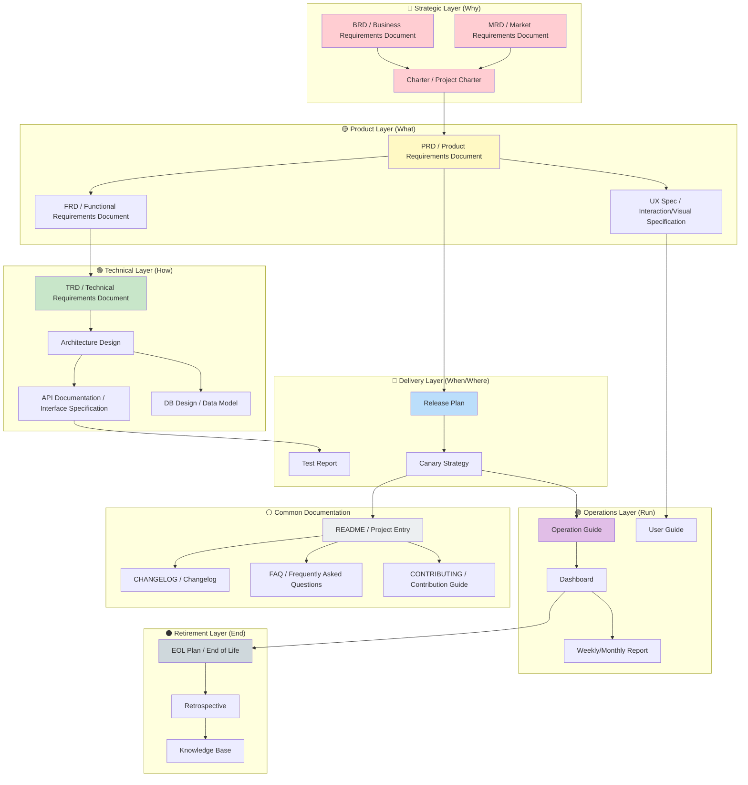
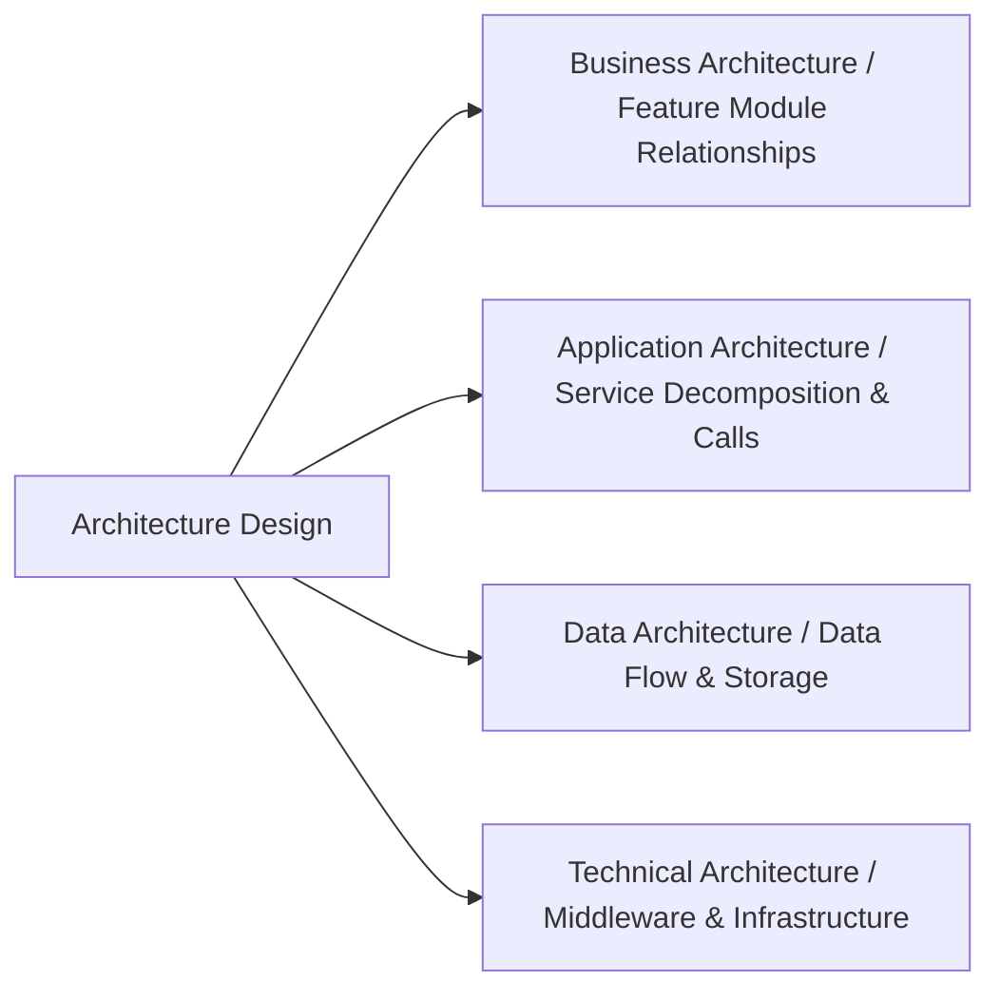
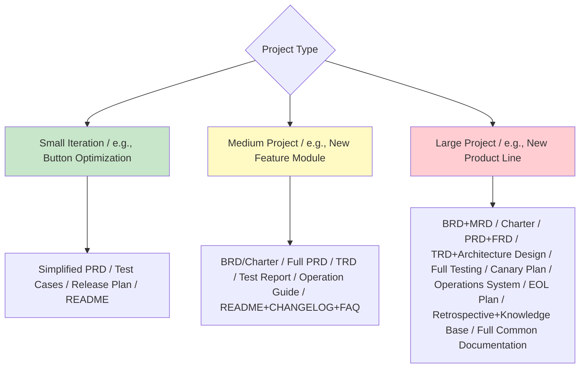

## Product Full Lifecycle Documentation Map



---

## I. Strategic Layer: Answering "Why Build It"

### 1. BRD (Business Requirements Document)

> **Position:** Starting point of the product lifecycle, answers "why it's worth investing resources"

| Element | Description | Key Questions |
| :------------- | :-------------------- | :----------------------------- |
| **Business Goal** | What business problem to solve | How much business loss if we don't build this? |
| **Investment & Return** | ROI calculation, cost-benefit analysis | Investment X, expected return Y? |
| **Success Metrics** | Quantifiable business outcomes | How to prove this project succeeded? |
| **Risks & Constraints** | Policy, resource, timeline constraints | What's the biggest risk? What's Plan B? |
| **Stakeholders** | Decision makers and interested parties | Who has the final say? Who benefits? Who objects? |

**Typical Scenarios:** Requesting budget from management, competing for resources, project initiation review.

---

### 2. MRD (Market Requirements Document)

> **Position:** Bridge between market and product, answers "where is the market opportunity"

| Element | Description |
| :------------- | :--------------------------- |
| **Target Market** | TAM/SAM/SOM market sizing |
| **User Personas** | Core users, marginal users, rejecting users |
| **Competitive Analysis** | Competitor feature matrix, differentiation opportunities |
| **User Pain Points** | Scenario-based pain point descriptions (with data) |
| **Requirement Priority** | MoSCoW ranking from market perspective |

**Typical Scenarios:** Product direction exploration, new track entry decisions, annual planning.

---

### 3. Charter (Project Charter)

> **Core document of IPD system**, widely used at Huawei/Alibaba, the "birth certificate" for formal project initiation

| Element | Description |
| :----------- | :------------------------- |
| **Project Background** | Condensed conclusions from BRD/MRD |
| **Project Objectives** | Business goals + user goals + capability goals |
| **Scope Boundaries** | In Scope / Out Scope |
| **Milestones** | Key Decision Checkpoints (DCP) |
| **Core Team** | PDT (Product Development Team) members |
| **Resource Budget** | Manpower, funding, timeline budget |

**Typical Scenarios:** Formal kickoff meeting, obtaining IPMT (Investment Portfolio Management Team) approval.

---

## II. Product Layer: Answering "What to Build"

### 4. PRD (Product Requirements Document)

> **Position:** The **most critical execution document** in the full lifecycle; a complete template has already been provided.

**Key Characteristics:**

- User-perspective feature descriptions
- Includes business flows, page transitions, inputs/outputs, acceptance criteria
- **Single Source of Truth (SSoT)** for R&D, design, testing, and operations

---

### 5. FRD (Functional Requirements Document)

> **Position:** System-perspective functional behavior description, often merged with or supplementary to PRD

| Difference from PRD | PRD | FRD |
| :---------- | :------------------ | :------------------------------------------------------- |
| **Perspective** | User perspective | System perspective |
| **Audience** | Everyone (including non-technical) | R&D, Testing |
| **Content** | User stories, interaction flows | System logic, state transitions, data flows |
| **Example** | "Users can export Excel" | "After clicking export button, system asynchronously generates file and notifies user via message queue" |

**Typical Scenarios:** When complex systems need separate technical implementation logic breakdown.

---

### 6. UX Spec (Interaction/Visual Specification)

| Sub-document | Content | Responsible Role |
| :----------- | :--------------------------- | :------------: |
| **Interaction Prototype** | Page flows, click hotspots, interaction animations | Interaction Designer |
| **Visual Specification** | Colors, fonts, spacing, component library | Visual Designer |
| **Copywriting Spec** | Button copy, error messages, empty states | Product/UX Writer |

---

## III. Technical Layer: Answering "How to Build"

### 7. TRD (Technical Requirements Document)

> **Position:** "Translator" for technical implementation, converting PRD into technical language

| Core Sections | Description |
| :------------- | :----------------------------------- |
| **Technical Architecture** | System topology, service decomposition, deployment architecture |
| **Data Model** | ER diagrams, data dictionary, storage solutions |
| **Interface Definition** | API contracts (OpenAPI/Swagger), field descriptions |
| **Non-functional Design** | Performance, security, scalability, disaster recovery |
| **Technology Selection** | Frameworks, middleware, third-party services and selection rationale |
| **Risk Assessment** | Technical debt, performance bottlenecks, dependency risks |

**Typical Scenarios:** Tech review, architect decision basis.

---

### 8. Architecture Design Document (ADD)



---

### 9. API Documentation

> **Position:** Contract layer between frontend/backend, third-party integrators, and SDK maintainers, aligned with OpenAPI 3.x, serving as the single source of truth for gateway/mock/contract testing

| Element | Description |
| :------------- | :-------------------------------------------------------------- |
| **Core Sections** | Endpoint list / Request-Response schema / Auth / Error codes / Versioning / Rate limiting |
| **Toolchain** | Swagger / YApi / Postman / Stoplight auto-sync |
| **Contract Testing** | Pact / Dredd validates implementation-documentation consistency |
| **Complete Template** | [【Template】API Documentation.md](./技术层/【模板】API文档.md) |

**Relationship with TRD / Architecture Doc:** TRD defines "what technology to achieve what metrics", architecture doc defines "how the system is designed", API doc defines "what endpoints look like and how to call them".

---

### 10. Database Design Document (DDD)

| Element | Description |
| :----------- | :-------------------------------------------------- |
| **Core Sections** | Table structure / Index design / Sharding strategy / Data archiving plan |
| **ER Tools** | dbdiagram.io / DBeaver / PowerDesigner |
| **Complete Template** | [【Template】Database Design Specification.md](./技术层/【模板】数据库设计文档规范.md) |

---

## IV. Delivery Layer: Answering "When to Launch"

### 10. Release Plan

| Element | Description |
| :----------- | :--------------------------------- |
| **Version Planning** | Version number rules, release cadence (e.g., bi-weekly releases) |
| **Environment Plan** | Development → Testing → Staging → Production deployment order |
| **Rollback Plan** | Rollback trigger conditions, operation steps, data repair |
| **Monitoring & Alerts** | Core metric monitoring, alert thresholds, on-call schedule |

---

### 11. Testing Documents

| Document | Content | Responsible |
| :----------- | :---------------------------------- | :--------: |
| **Test Plan** | Test scope, strategy, resources, schedule | Test Lead |
| **Test Cases** | Executable cases written based on PRD acceptance criteria | Test Engineer |
| **Test Report** | Coverage, bug statistics, remaining risks, release recommendations | Test Lead |

---

### 13. Canary Release Plan

- Canary ratio and time cadence (e.g., 5%→30%→100%)
- Observation metrics and rollback thresholds
- Emergency plan (one-click rollback, rate limiting degradation)

---

## V. Operations Layer: Answering "How to Run"

### 14. Operation Guide / SOP

| Module | Content |
| :----------- | :--------------------------------- |
| **Feature Guide** | Operation guide for operations staff |
| **FAQ** | FAQ, troubleshooting manual |
| **Data Interpretation** | Core metric definitions, anomaly judgment criteria |
| **Activity Configuration** | Marketing tool configuration steps, review checklist |

---

### 15. Dashboard & Event Tracking Documents

- **Event Tracking Specification:** Event definitions, attribute dictionary, reporting timing
- **Dashboard:** Real-time/offline dashboard configuration for core metrics
- **Data Calibration:** Metric calculation logic, attribution rules

---

### 16. User Help Documents (User Guide / Help Center)

- Self-service help content for end users
- New feature onboarding copy, video tutorials

---

### 17. Weekly / Monthly Report

> **Position:** Periodic synchronization tool for teams and individuals, results-oriented + data-driven + risk-visibility

| Element | Description |
| :------------- | :-------------------------------------------------------------- |
| **Report Cycle** | Weekly / Monthly / Quarterly |
| **Core Sections** | Summary / Completed / In Progress / Blockers / Next Period Plan / Metrics |
| **Complete Template** | [【Template】Weekly Monthly Report.md](./运营层/【模板】周报月报.md) |

**Typical Scenarios:** Individual/team weekly reports, monthly presentations, cross-team progress synchronization.

> **Alignment Note:** This template's section structure is aligned with `cangjie/references/registry.yaml` `business/weekly-monthly-report` definition:
> - Required: `report_info` / `summary` / `completed_work` / `in_progress` / `blockers` / `next_period_plan`
> - Optional: `metrics` / `asks` / `reflections`

---

## VI. Retirement Layer: Answering "How to End Well"

### 18. EOL Plan (End of Life)

> **Big tech practice:** Product decommissioning requires more documentation than launching, involving data migration, user notification, and legal compliance.

| Element | Description |
| :----------- | :--------------------------- |
| **Decommission Reason** | Business adjustment, technical debt, user churn |
| **User Migration** | Data export plan, alternative product guidance |
| **Data Archiving** | Historical data retention policy, destruction plan |
| **Legal Compliance** | User agreement changes, refund/compensation plan |
| **Communication Plan** | How far in advance to notify? Through what channels? |

---

### 19. Retrospective / Post-Mortem

> **Position:** Learning consolidation after project delivery, using the four-step retrospective method (Review goals → Evaluate results → Analyze causes → Consolidate patterns) to convert one-time experience into reusable assets

| Dimension | Content |
| :----------- | :------------------------------------------------------- |
| **Goal Review** | Originally set goals vs actual results, including hypothesis validation |
| **Result Evaluation** | Quantified achievement rate + timeline + above/below expectations |
| **Cause Analysis** | Keep / Problem / 5-Whys root cause / Hypothesis validation |
| **Pattern Consolidation** | Reusable experience + pitfall records + SOP + checklists |
| **Improvement Actions** | SMART checklist + responsible person + deadline + tracking mechanism |
| **Asset Archiving** | Documentation, code, data archiving locations |
| **Complete Template** | [【Template】Retrospective Report.md](./退役层/【模板】复盘报告.md) |

---

### 20. Knowledge Base

> **Position:** Living document throughout the project lifecycle, converting individual/team tacit knowledge into organizational assets

| Dimension | Content |
| :--------------- | :-------------------------------------------------------------- |
| **Core Experience** | Architecture / Performance / Data / Collaboration experience categories, each with quantified outcomes |
| **Pitfall Records** | Symptoms / Root cause (5-Whys) / Solutions / Avoidance methods |
| **Best Practices** | General + Backend + Frontend + DB, with anti-pattern comparisons |
| **SOP Extraction** | From experience to executable processes, with steps + responsible person + acceptance |
| **Anti-patterns** | "Don't do this" checklist, with counter-examples and correct approaches |
| **Knowledge Asset Inventory** | Complete inventory of documentation / code / data / training |
| **Complete Template** | [【Template】Knowledge Base.md](./退役层/【模板】知识沉淀.md) |

**Difference from Retrospective:** Retrospective is a learning summary of a single event, while Knowledge Base is a living document maintained continuously throughout the lifecycle. They complement each other.

---

## VII. Common Documentation: Answering "Cross-Lifecycle Common"

> **Position:** General engineering documentation not tied to a specific lifecycle stage but needed by every project, located in the `templates/common/` directory.

### 21. README (Project Entry Document)

> **Position:** Project facade, determines users' first impression and onboarding cost

| Element | Description |
| :------------- | :-------------------------------------------------------------- |
| **Core Sections** | Introduction / Installation / Quick Start / Usage Examples / Configuration / Capabilities Overview / Contributing / License |
| **Style Reference** | Concise and direct, with badges and copy-paste command examples |
| **Complete Template** | [【Template】README.md](../通用/【模板】README.md) |

**Typical Scenarios:** New project initialization, open source repository entry, internal tool documentation.

---

### 22. CHANGELOG

> **Position:** Authoritative record of version changes, follows Keep a Changelog specification

| Element | Description |
| :------------- | :-------------------------------------------------------------- |
| **Core Sections** | Unreleased + each version, each version split into Added/Changed/Deprecated/Removed/Fixed/Security |
| **Specification** | [Keep a Changelog 1.1.0](https://keepachangelog.com/zh-CN/1.1.0/) + [SemVer 2.0.0](https://semver.org/lang/zh-CN/) |
| **Complete Template** | [【Template】CHANGELOG.md](../通用/【模板】CHANGELOG.md) |

**Typical Scenarios:** Version releases, change tracking, user notification.

---

### 23. FAQ (Frequently Asked Questions)

> **Position:** Self-service troubleshooting document for high-frequency issues, categorized by topic

| Element | Description |
| :------------- | :-------------------------------------------------------------- |
| **Core Sections** | General / Installation / Usage / Configuration / Troubleshooting / Performance / Integration & Extensions |
| **Writing Principle** | Each Q includes symptoms / cause / solution / command example |
| **Complete Template** | [【Template】FAQ.md](../通用/【模板】FAQ.md) |

**Typical Scenarios:** User self-service support, new member onboarding, reducing repetitive Q&A costs.

---

### 24. CONTRIBUTING (Contribution Guide)

> **Position:** Standardizing collaboration processes for external and internal contributors

| Element | Description |
| :--------------- | :-------------------------------------------------------------- |
| **Core Sections** | Code of Conduct / Contribution Process / Development Environment / Code Standards / Commit Standards / PR Process / Testing Requirements / Review Criteria |
| **Specification** | [Conventional Commits 1.0.0](https://www.conventionalcommits.org/zh-hans/v1.0.0/) + [Contributor Covenant 2.1](https://www.contributor-covenant.org/version/2/1/code_of_conduct/) |
| **Complete Template** | [【Template】CONTRIBUTING.md](../通用/【模板】CONTRIBUTING.md) |

**Typical Scenarios:** Open source projects, internal cross-team collaboration, new member onboarding.

---

## Documentation Trimming Guide: Which Documents for Which Scenarios?

Not all projects need all documents. Trim based on project complexity:



| Project Scale | Required Documents | Optional Documents | Merging Suggestions |
| :-------------------- | :------------------------------------------------------------- | :------------------------------------ | :----------------------- |
| **Small Iteration** (<1 week) | PRD (1-page), test cases, README | — | BRD can be verbal, TRD can be omitted |
| **Medium Project** (1-4 weeks) | Charter, PRD, TRD, test report, README, CHANGELOG | MRD, FRD, FAQ | BRD can be merged into Charter |
| **Large Project** (>1 month) | Full documentation set (including common 4-piece set + retirement retrospective + knowledge base + weekly/monthly reports) | — | Each document stands alone, ensuring traceability |
| **Open Source Project** | README, CHANGELOG, CONTRIBUTING, LICENSE, FAQ | Code of conduct, Issue/PR templates, CODEOWNERS | Common documentation is the baseline for open source |

---

## Documentation Traceability

```mermaid
flowchart LR
    A[BRD Business Goal / "Improve Retention"] --> B[MRD Market Opportunity / "High Next-Day User Churn"]
    B --> C[Charter Project Goal / "Q3 Retention at 10%"]
    C --> D[PRD Feature Requirement / "Onboarding Flow Optimization"]
    D --> E[FRD System Logic / "Onboarding Step State Machine"]
    E --> F[TRD Technical Solution / "Step-by-Step API & Event Tracking"]
    F --> G[Test Cases / "Verify Onboarding Completion Rate"]
    G --> H[Dashboard / "Retention Metric Monitoring"]
    H --> I[Retrospective Report / "Retention Improvement Results"]

    style A fill:#ffcdd2
    style D fill:#fff9c4
    style F fill:#c8e6c9
    style H fill:#e1bee7
```

**Traceability Value:** When post-launch data falls short of expectations, you can trace back from the retrospective report all the way to the BRD to determine whether it was a wrong business assumption (BRD), incorrect market judgment (MRD), flawed feature design (PRD), or technical implementation deviation (TRD).

---

## Summary: Core Principles of the Documentation System

| Principle | Description |
| :--------------------- | :------------------------------------------ |
| **1. Layered Decoupling** | Strategic layer doesn't intervene in technical details, technical layer doesn't deviate from business goals |
| **2. Single Source of Truth** | Same information defined in only one document, other documents reference it |
| **3. Living Document** | Documentation updates in real-time with project evolution, not a one-time deliverable |
| **4. Audience Awareness** | Each document explicitly defines who it's written for, controlling information density |
| **5. Traceability** | Requirements → Design → Development → Testing → Operations → Retirement, fully traceable chain |
