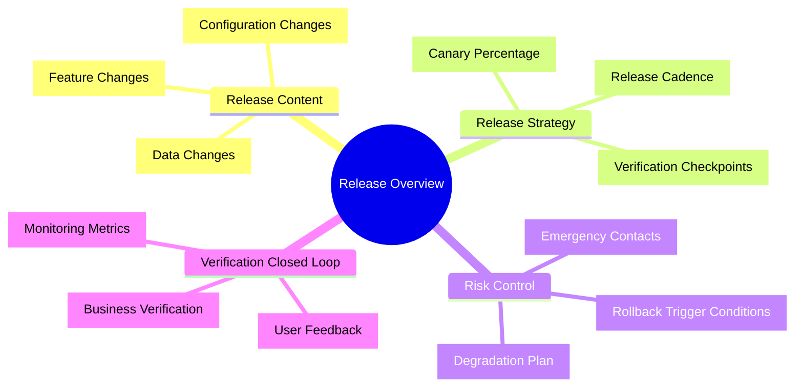
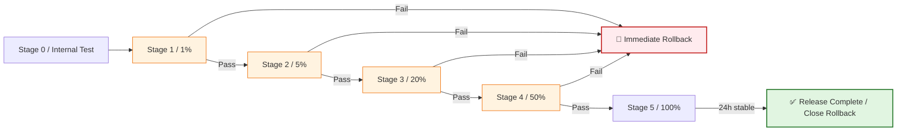
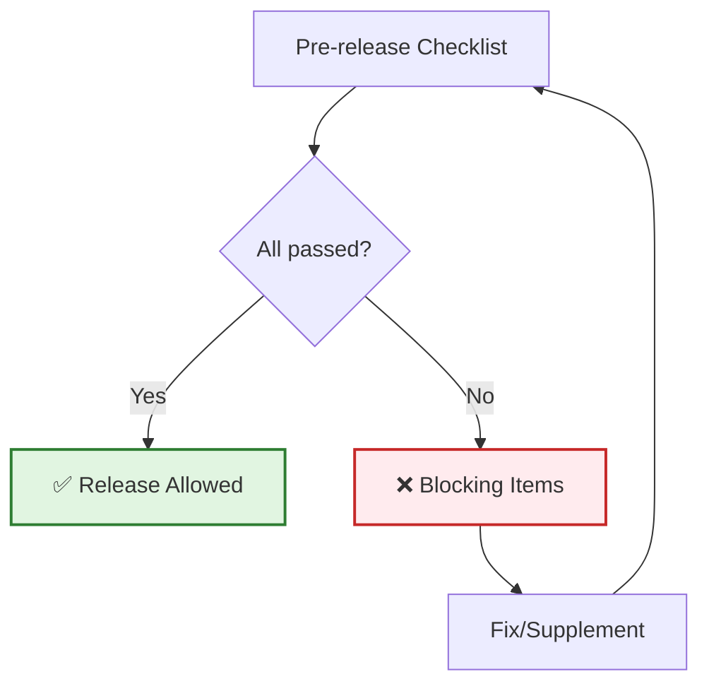
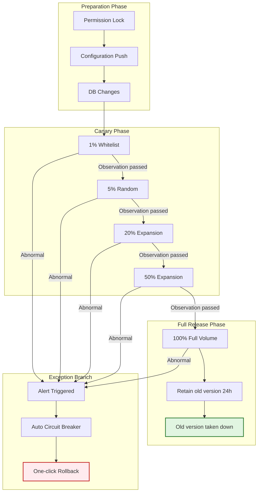
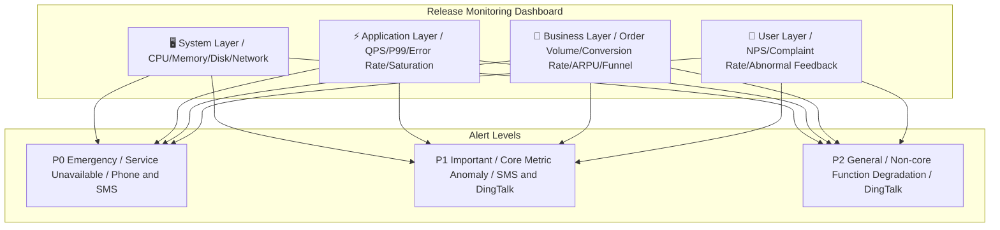
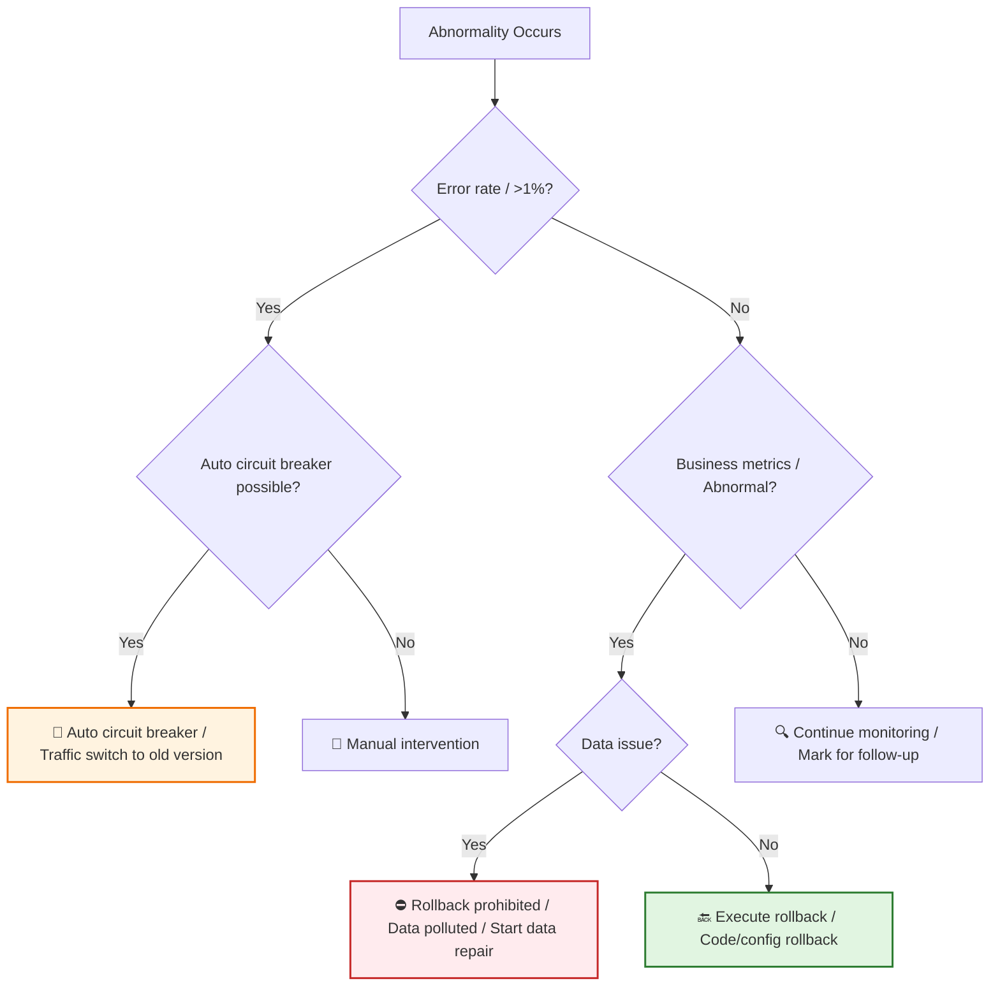
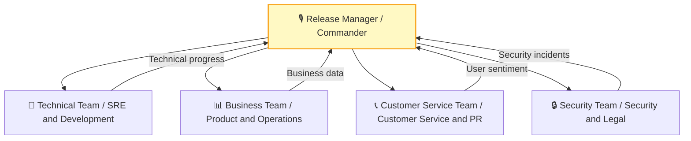
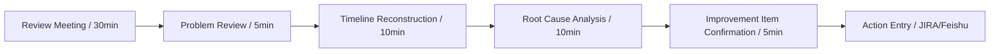

# [Product/System Name (English)] - Release Plan Document

> **Document Status:** 🟡 Under Review / 🟢 Approved / 🔴 Cancelled
>
> **Confidentiality Level:** Confidential / Internal Public / Public
>
> **Version:** v0.5
>
> **Date:** YYYY-MM-DD
>
> **Author:** [Name] (Release Manager / OnCall Owner)
>
> **Reviewer:** [Name/Role]
>
> **Audience:** [Role List]
>
> **Release Type:** 🟢 Regular Iteration / 🟡 Major Change / 🔴 Emergency Fix / 🔵 Experimental Canary
>
> **Release Window:** YYYY-MM-DD HH:mm ~ HH:mm (Beijing Time)
>
> **Related Documents:** [Charter Number] / [BRD Number] / [PRD Number] / [TRD Number]
>
> **Technical Lead:** [Name]
>
> **Product Lead:** [Name]

---

## 0. Document Guide

### 0.1 Document Purpose and Scope

[Explain the purpose, applicable scenarios, and non-applicable scenarios of this document]

### 0.2 Related Documents

| Document Type | Filename | Related Sections |
|---------|--------|---------|
| [Type] | [Filename] [Line Range] | [Section Description] |

> **Reference Format Note**: Related documents use the `filename line range` format (e.g., `【Template】Technical Requirements Document(TRD).md 3-17`). Line numbers may change as documents are updated; please refer to actual content.

### 0.3 Change Log

| Version | Date | Reviser | Change Content | Reviewer |
| :--- | :--- | :--- | :--- | :--- |
| v0.1 | YYYY-MM-DD | [Name] | Initial draft | |
| v0.2 | YYYY-MM-DD | [Name] | Added canary strategy and rollback SOP | |
| v0.3 | YYYY-MM-DD | [Name] | Release review passed | [Release Manager] |
| v0.4 | 2026-06-09 | Xie Dong | Fixed quadrantChart template to table format (Feishu incompatible) | — |
| v0.5 | 2026-06-09 | Xie Dong | Fixed Gantt chart to table for Feishu rendering compatibility | — |

---

## 1. Executive Summary

> **On-duty staff/Management 30-second guide:** What's being released, how to release, when to release, what to do if something goes wrong.

| Element | Content |
| :--- | :--- |
| **Release Content** | [One sentence, e.g., Order System V2.1, supports flash sale inventory pre-occupation + payment routing optimization] |
| **Impact Scope** | [e.g., All users / East China only / Android client only] |
| **Release Strategy** | [e.g., Canary 1% → 5% → 20% → 50% → 100%, taking 72h] |
| **Core Risk** | [e.g., Database incompatible changes, rollback window only 30 minutes] |
| **Rollback RTO** | [e.g., Detection<<1min, Decision<<2min, Execution<<3min, Total<<5min] |
| **On-duty Communication** | [DingTalk group / Feishu group / Phone conference number] |



---

## 2. Release Metadata

### 2.1 Version and Code Baseline

| Item | Content |
| :--- | :--- |
| **Version Number** | `v2.1.0` / `release-20260525` |
| **Code Branch** | `release/v2.1.0` (branched from `main`, Commit: `a1b2c3d`) |
| **Build Artifact** | Docker Image: `registry/order-svc:v2.1.0` |
| **Configuration Baseline** | Config Commit: `e5f6g7h`, associated Nacos/K8s ConfigMap |
| **Database Baseline** | Flyway/Liquibase Version: `V2.1.0__add_seckill_stock` |
| **Frontend Resources** | CDN Path: `https://cdn.example.com/static/v2.1.0/` |

### 2.2 Release Window

| Phase | Time | Duration | Description |
| :--- | :--- | :---: | :--- |
| **Code Freeze** | 1 day before release 18:00 | - | Stop requirement admission, only accept blocking Bug fixes |
| **Release Window Opens** | Release day 02:00 | 4h | Start during off-peak, avoid business peak |
| **Canary Start** | 02:30 | - | First batch 1% traffic cut-in |
| **Observation Period** | 02:30 ~ 06:00 | 3.5h | Core metrics monitoring, business inspection |
| **Full Release** | 06:00 (if passed) | 1h | 100% traffic, gradually remove old version |
| **Release Window Closes** | 10:00 | - | Formally closed after release manager confirmation |

> **Note**: Gantt chart is not compatible with Feishu, converted to table description.

| Phase | Task | Start Time | Duration | Status |
|:---|:---|:---|:---:|:---:|
| Pre-release | Code freeze and preparation | HH:MM | 2h | ⚪ |
| Release execution | First canary (1%) | HH:MM | 30m | ⚪ |
| Release execution | Monitoring verification | After first canary | 2h | ⚪ |
| Release execution | Expand canary (5%-50%) | After monitoring verification | 2h | ⚪ |
| Release execution | Full release | After canary expansion | 1h | ⚪ |
| Post-release | Observation and review | After full release | 2h | ⚪ |

---

## 3. Release Scope and Change Log

> Precisely describe all changes included in this release, which is the foundation for risk assessment.

### 3.1 Change Classification Matrix

> **Note**: This quadrant chart template has been converted to table description.

<!--
Original quadrantChart structure reference:
- title: Change Risk Matrix (Impact vs Technical Complexity)
- x-axis: "Low Complexity" --> "High Complexity"
- y-axis: "Low Impact" --> "High Impact"
- quadrant-1: Key Focus (High/High)
- quadrant-2: Standard Execution (Low/High)
- quadrant-3: Quick Pass (Low/Low)
- quadrant-4: Technical Breakthrough (High/Low)
- Data points: "Database DDL change": [0.9, 0.95]; "Flash sale core logic refactoring": [0.8, 0.9]; "UI copy adjustment": [0.1, 0.2]; "New report API": [0.4, 0.3]; "Payment routing optimization": [0.7, 0.6]
-->

| Quadrant | Area Characteristics | Strategy Suggestions |
| :--- | :--- | :--- |
| Quadrant 1 (High Complexity · High Impact) | Key Focus (High/High) | Strict review, canary release, full verification |
| Quadrant 2 (Low Complexity · High Impact) | Standard Execution (Low/High) | Standard process, regression verification |
| Quadrant 3 (Low Complexity · Low Impact) | Quick Pass (Low/Low) | Simplified review, quick launch |
| Quadrant 4 (High Complexity · Low Impact) | Technical Breakthrough (High/Low) | Technical review, independent test environment verification |

| Name | X Value | Y Value | Quadrant |
| :--- | :---: | :---: | :--- |
| Database DDL change | 0.9 | 0.95 | Quadrant 1 (Key Focus) |
| Flash sale core logic refactoring | 0.8 | 0.9 | Quadrant 1 (Key Focus) |
| UI copy adjustment | 0.1 | 0.2 | Quadrant 3 (Quick Pass) |
| New report API | 0.4 | 0.3 | Quadrant 3 (Quick Pass) |
| Payment routing optimization | 0.7 | 0.6 | Quadrant 1 (Key Focus) |

### 3.2 Change List

| Change ID | Type | Description | Related Requirement | Impact Scope | Rollback Difficulty | Owner |
| :--- | :---: | :--- | :--- | :--- | :---: | :--- |
| **CHG-001** | Feature | Add flash sale inventory pre-occupation API | REQ-088 | Transaction core | 🔴 High | [Name] |
| **CHG-002** | Feature | Add UnionPay QuickPass to payment channels | REQ-092 | Payment module | 🟡 Medium | [Name] |
| **CHG-003** | Configuration | Adjust rate limit threshold from 5000 QPS to 8000 | CONF-015 | Gateway layer | 🟢 Low | [Name] |
| **CHG-004** | Data | Add `seckill_tag` field to order table (nullable) | DDL-021 | Order database | 🟡 Medium | [Name] |
| **CHG-005** | Fix | Fix bug where orders don't auto-cancel on timeout | BUG-112 | Scheduling service | 🟢 Low | [Name] |

### 3.3 Dependency Check

| Dependent System | Required Version | Status | Verification Method |
| :--- | :--- | :---: | :--- |
| User Center | ≥ v3.2.0 | ✅ Ready | Interface contract testing |
| Product Center | ≥ v2.8.1 | ✅ Ready | Integration testing |
| Payment Gateway | ≥ v1.5.0 | ✅ Ready | Joint debugging passed |
| Message Center | ≥ v2.0.0 | ✅ Ready | Message format compatible |

---

## 4. Release Strategy

### 4.1 Release Method Selection

| Strategy | Applicable Scenario | Used This Time | Description |
| :--- | :--- | :---: | :--- |
| **Blue-Green Deployment** | Full switch, zero downtime, resource doubling | ❌ | High resource cost, not used this time |
| **Rolling Update** | Replace instance by instance, save resources | ❌ | Slow rollback, not suitable for database changes |
| **Canary/Gray Release** | Small traffic verification, gradual expansion | ✅ | Core strategy this time |
| **A/B Test** | Controlled experiment, data-driven | 🟡 | Only used for new payment page frontend |

### 4.2 Canary Release Architecture

> **Reference Note**: Detailed canary architecture design, traffic bucketing algorithm, full-link swimlane design, please refer to **【Template】Gray Release Plan.md §3-4**. This document only outlines this release's canary strategy.

**This Release's Canary Strategy Summary:**

| Strategy Dimension | This Selection | Detailed Design | Reference Document |
| :--- | :--- | :--- | :--- |
| **Canary Mode** | [e.g., Canary + AB gray] | Traffic bucketing algorithm | Reference Gray Release Plan §3.1 |
| **Traffic Control** | [e.g., Hash by device ID] | Consistent Hash | Reference Gray Release Plan §3.2 |
| **Expansion Cadence** | [e.g., 1%→5%→20%→50%→100%] | Go/No-Go criteria per stage | Reference Gray Release Plan §5.2 |
| **Rollback Strategy** | [e.g., Second-level traffic switchback] | Multi-level stop-loss mechanism | Reference Gray Release Plan §7.1 |

> **Complete Design**: Canary architecture diagram, swimlane design, monitoring system, environment management details please refer to **【Template】Gray Release Plan.md §2-8**.

### 4.3 Canary Expansion Plan

> **Reference Note**: Detailed expansion cadence, stage definitions and Go/No-Go criteria, please refer to **【Template】Gray Release Plan.md §5**. This document only lists this release's timeline.

| Stage | Traffic Ratio | Planned Start Time | Observation Duration | Go/No-Go Criteria | Owner |
| :--- | :---: | :--- | :---: | :--- | :--- |
| **Stage 1** | 1% | [Time] | 2h | P0 incidents=0, error rate<0.1% | [Name] |
| **Stage 2** | 5% | [Time] | 4h | P99 latency increase<10% | [Name] |
| **Stage 3** | 20% | [Time] | 8h | Core funnel conversion no anomaly | [Name] |
| **Stage 4** | 50% | [Time] | 12h | Customer service sentiment no concentrated complaints | [Name] |
| **Stage 5** | 100% | [Time] | 24h | No anomaly in 24h then close rollback | [Name] |

> **Expansion Strategy**: Detailed Go/No-Go criteria, user selection strategy, observation metrics please refer to **【Template】Gray Release Plan.md §5.2**.

### 4.3 Canary Expansion Strategy

> Gray release must ensure "same user always accesses same version", avoiding session state confusion.

| Stage | Traffic Ratio | User Selection Strategy | Observation Duration | Go/No-Go Criteria |
| :--- | :---: | :--- | :---: | :--- |
| **Stage 0** | 0% | Internal test environment + Pre-production | - | Test cases 100% pass |
| **Stage 1** | 1% | Whitelist users (internal employees + seed customers) | 2h | P0 incidents=0, error rate<<0.1% |
| **Stage 2** | 5% | Hash by device ID modulo, Cookie sticky | 4h | P99 latency increase<<10%, business metrics normal |
| **Stage 3** | 20% | Random expansion, maintain Stage 1/2 user stickiness | 8h | Core funnel conversion no abnormal fluctuation |
| **Stage 4** | 50% | Expand to half volume, monitor long-tail issues | 12h | Customer service sentiment no concentrated complaints |
| **Stage 5** | 100% | Full volume, maintain 24h rollback capability | 24h | No anomaly in 24h then close rollback window |



---

## 5. Pre-Release Checklist

> All items must be checked and passed before release. If any item fails, entry to the release window is prohibited.

### 5.1 Code and Build

| Check Item | Standard | Status | Verifier |
| :--- | :--- | :---: | :--- |
| Code Review | Core logic at least 2 people Approved | ☐ | |
| Unit test coverage | ≥ 80%, core modules ≥ 90% | ☐ | |
| Static code scan | SonarQube no blocking vulnerabilities | ☐ | |
| Build artifact | Docker Image pushed to registry and signed | ☐ | |
| Configuration baseline | Production config merged to `release` branch | ☐ | |

### 5.2 Test Verification

| Check Item | Standard | Status | Verifier |
| :--- | :--- | :---: | :--- |
| Functional testing | All P0/P1 test cases pass | ☐ | |
| Regression testing | Core link automation regression passes | ☐ | |
| Integration testing | Joint debugging with upstream/downstream systems passes | ☐ | |
| Performance testing | Load test meets standards (QPS/P99/error rate) | ☐ | |
| Compatibility testing | Old and new version data mutually recognized | ☐ | |

### 5.3 Data and Configuration

| Check Item | Standard | Status | Verifier |
| :--- | :--- | :---: | :--- |
| Database changes | DDL/DML executed and verified in pre-production | ☐ | |
| Data compatibility | Old version code can read data written by new version | ☐ | |
| Rollback scripts | Reverse DDL/DML scripts prepared and drilled | ☐ | |
| Configuration changes | Submitted to configuration center, canary switch ready | ☐ | |
| Switch/Degradation | Feature switch configured, can one-click disable new feature | ☐ | |

### 5.4 Monitoring and Emergency Response

| Check Item | Standard | Status | Verifier |
| :--- | :--- | :---: | :--- |
| Monitoring dashboard | Release-specific Dashboard created | ☐ | |
| Alert rules | Error rate/P99/business metric alerts configured | ☐ | |
| Log tracing | Full-link Trace ID injection confirmed | ☐ | |
| Rollback plan | Documented, rollback scripts verified | ☐ | |
| On-duty arrangement | OnCall personnel confirmed, communication channels open | ☐ | |



---

## 6. Release Execution Steps

> Minute-precise execution manual, release manager operates according to this.

### 6.1 Release Execution Timeline

| Time | Step | Operation Content | Owner | Verification Method |
| :--- | :---: | :--- | :--- | :--- |
| **T-30min** | 1 | Release manager convenes release meeting, confirm all roles in position | Release Manager | DingTalk group sign-in |
| **T-15min** | 2 | Close non-urgent release channels, lock production environment permissions | SRE | Permission system confirmation |
| **T-0min** | 3 | Execute database DDL (if adding field, nullable) | DBA | Field existence check |
| **T+5min** | 4 | Deploy canary version to first batch 1% nodes | SRE | K8s Pod readiness probe passes |
| **T+10min** | 5 | Enable canary traffic, whitelist user verification | Release Manager | Whitelist user end-to-end test |
| **T+30min** | 6 | **Stage 1 Observation Period**: Monitor core metrics | OnCall | Dashboard no alerts |
| **T+2h30m** | 7 | Expand to 5% random traffic | SRE | Canary engine configuration effective |
| **T+6h30m** | 8 | **Stage 2 Observation Period**: Business metrics inspection | Product/Ops | Funnel data normal |
| **T+14h30m** | 9 | Expand to 20% traffic | SRE | - |
| **T+22h30m** | 10 | **Stage 3 Observation Period**: Long-tail issue investigation | Technical | Error logs no new anomalies |
| **T+30h** | 11 | Expand to 50% traffic | SRE | - |
| **T+42h** | 12 | **Stage 4 Observation Period**: Full scenario coverage | QA | Regression test sampling |
| **T+54h** | 13 | Full 100%, old version retained 24h | SRE | Traffic 100% cut to new version |
| **T+78h** | 14 | **Release Complete**, old version taken down, close rollback window | Release Manager | Resource recycling confirmation |

### 6.2 Release Execution Flowchart



---

## 7. Monitoring and Validation

### 7.1 Monitoring Dashboard Design



### 7.2 Core Monitoring Metrics and Thresholds

| Layer | Metric | Baseline | Alert Threshold | Circuit Breaker Threshold | Collection Frequency |
| :--- | :--- | :--- | :--- | :--- | :---: |
| **System** | CPU Usage | 45% | > 70% | > 85% | 1min |
| **System** | Memory Usage | 60% | > 80% | > 90% | 1min |
| **Application** | QPS | 5000 | Fluctuation > ±20% | - | 1min |
| **Application** | P99 Latency | 120ms | > 200ms | > 500ms | 1min |
| **Application** | Error Rate | 0.05% | > 0.5% | > 1% | 1min |
| **Application** | GC Pause | 50ms | > 200ms | > 500ms | 5min |
| **Business** | Order Creation Success Rate | 99.9% | < 99.5% | < 99% | 5min |
| **Business** | Payment Success Rate | 99.5% | < 99% | < 98% | 5min |
| **Business** | Core Funnel Conversion Rate | 12% | Drop > 10% | Drop > 20% | 15min |
| **User** | Customer Service Complaint Volume | 5/hour | > 20/hour | > 50/hour | Real-time |

### 7.3 Business Verification Checklist

| Verification Item | Verification Method | Owner | Frequency |
| :--- | :--- | :--- | :--- |
| Core link end-to-end | Simulate user order → payment → query full flow | QA | Once per stage |
| Old/new version compatibility | Old version client accesses new version server | QA | Stage 1/3/5 |
| Data consistency | Sample compare order data and amount calculation | Data | Stage 2/4 |
| Financial reconciliation | Payment transaction and order status consistency | Finance | After Stage 5 |
| Client experience | Real device testing iOS/Android/Web | Product | Stage 1/3 |

---

## 8. Rollback and Emergency Response

> Before release, must clearly define "under what circumstances to rollback, who decides, how to execute".

### 8.1 Rollback Trigger Conditions (Auto/Manual)

| Trigger Source | Condition | Response Time | Decision Method |
| :--- | :--- | :---: | :--- |
| **Auto Circuit Breaker** | Error rate > 1% sustained 2min / P99 > 500ms sustained 3min | < 1min | System auto traffic switch |
| **Monitoring Alert** | P0 level alert generated (service unavailable/core function impaired) | < 3min | OnCall engineer decision |
| **Business Feedback** | Core funnel conversion drop > 20% / Customer service complaints > 50/hour | < 5min | Product + Technical joint decision |
| **Security Incident** | Data leak/unauthorized access/fund risk discovered | < 1min | Release manager immediate decision |

### 8.2 Rollback Decision Tree



### 8.3 Layered Rollback Strategy

| Layer | Rollback Operation | Execution Time | Applicable Scenario | Verification Method |
| :--- | :--- | :---: | :--- | :--- |
| **Traffic Layer** | Canary engine switch to 0%, or Nginx weight reset to zero | < 30s | New version logic Bug | Traffic recovery |
| **Configuration Layer** | Configuration center rollback to previous version, push effective | < 1min | Configuration error | Configuration value verification |
| **Code Layer** | K8s rolling update to previous version image | < 3min | Code defect | Pod image version |
| **Data Layer** | Execute reverse DDL/DML (additive fields can be ignored) | < 5min | Data compatibility issues | Field/data verification |
| **Full Rollback** | Execute code + configuration + data rollback simultaneously | < 5min | Major incident | End-to-end verification |

### 8.4 Rollback Execution Manual

```markdown
## Emergency Rollback SOP (Standard Operating Procedure)

### Scenario: Stage 2 discovers payment success rate plummeting

1. **00:00** OnCall receives P0 alert "Payment success rate < 98%"
2. **00:01** OnCall posts in release group @Release Manager + @Technical Lead, confirm anomaly
3. **00:02** Release manager decision: Execute rollback
4. **00:03** SRE executes:
   - Canary engine: Set V2.1 traffic weight to 0%
   - K8s: Start V1.9 image rolling expansion, gradually replace V2.1 Pods
   - Configuration center: Rollback payment channel configuration to previous version
5. **00:05** Verification: Monitor Dashboard confirms traffic 100% going to V1.9
6. **00:08** Business verification: QA executes one payment, confirm success rate recovered
7. **00:10** Release manager announces: Rollback complete, enter incident review process
8. **Follow-up** Retain V2.1 Pod logs and HeapDump for problem investigation
```

---

## 9. Risk Assessment and Rating

> Based on the rollback risk assessment framework, rate this release's risk.

### 9.1 Risk Dimension Assessment

| Dimension | Risk Item | Level | Description |
| :--- | :--- | :---: | :--- |
| **Database** | DDL add field (nullable, has default value) | 🟡 Medium | Old version compatible, rollback can ignore field |
| **Database** | No DML data migration script | 🟢 Low | No data pollution risk |
| **API** | New API, old API unchanged | 🟢 Low | Fully compatible |
| **API** | Modify core payment callback logic | 🔴 High | Incompatible change, must align frontend/backend |
| **Configuration** | Rate limit threshold adjustment | 🟡 Medium | Too high may cause avalanche |
| **Client** | Frontend resource version switch | 🟢 Low | CDN can quickly rollback |
| **Dependency** | Depend on payment gateway new version | 🟡 Medium | Need to confirm joint debugging passed |

### 9.2 Comprehensive Risk Rating

> **Note**: This quadrant chart template has been converted to table description.

<!--
Original quadrantChart structure reference:
- title: Release Risk Heat Map (Rollback Difficulty vs Business Impact)
- x-axis: "Low Rollback Difficulty" --> "High Rollback Difficulty"
- y-axis: "Low Business Impact" --> "High Business Impact"
- quadrant-1: High Risk (High Impact/Hard to Rollback)
- quadrant-2: Key Observation (High Impact/Easy to Rollback)
- quadrant-3: Low Risk (Low Impact/Easy to Rollback)
- quadrant-4: Technical Debt (Low Impact/Hard to Rollback)
- Data points: "This Release Overall": [0.6, 0.7]; "Ideal Low Risk": [0.2, 0.2]; "Database DDL": [0.5, 0.6]; "Payment Logic Change": [0.8, 0.9]
-->

| Quadrant | Area Characteristics | Strategy Suggestions |
| :--- | :--- | :--- |
| Quadrant 1 (High Rollback Difficulty · High Impact) | High Risk (High Impact/Hard to Rollback) | Canary release + Rollback SOP + On-site duty |
| Quadrant 2 (Low Rollback Difficulty · High Impact) | Key Observation (High Impact/Easy to Rollback) | Monitor alerts, ready to rollback anytime |
| Quadrant 3 (Low Rollback Difficulty · Low Impact) | Low Risk (Low Impact/Easy to Rollback) | Standard process, standard operations |
| Quadrant 4 (High Rollback Difficulty · Low Impact) | Technical Debt (Low Impact/Hard to Rollback) | Evaluate rollback plan, include in iteration |

| Name | X Value | Y Value | Quadrant |
| :--- | :---: | :---: | :--- |
| This Release Overall | 0.6 | 0.7 | Quadrant 1 (High Risk) |
| Ideal Low Risk | 0.2 | 0.2 | Quadrant 3 (Low Risk) |
| Database DDL | 0.5 | 0.6 | Quadrant 1 (High Risk) |
| Payment Logic Change | 0.8 | 0.9 | Quadrant 1 (High Risk) |

**Comprehensive Rating:** 🟡 **Medium Risk**
**Release Strategy Requirement:** Must use canary release, direct full release prohibited; rollback window retained ≥ 24h; core personnel on-site duty during release.

---

## 10. Communication and OnCall Mechanism

### 10.1 Release Communication Architecture



### 10.2 On-duty Arrangement

| Role | Name | Responsibilities | Contact | Standby Period |
| :--- | :--- | :--- | :--- | :--- |
| **Release Manager** | [Name] | Commander, rollback decision authority | Mobile/DingTalk | Full release window |
| **Technical Lead** | [Name] | Technical problem investigation and fix | Mobile/DingTalk | Full release window |
| **SRE Operations** | [Name] | Release execution, monitoring, scaling | Mobile/DingTalk | Full release window |
| **DBA** | [Name] | Database changes and rollback | Mobile/DingTalk | T-1h ~ T+2h |
| **Product Lead** | [Name] | Business verification, user feedback | Mobile/DingTalk | T+2h ~ T+78h |
| **Customer Service Lead** | [Name] | Sentiment monitoring, user appeasement | Mobile/DingTalk | T+2h ~ T+78h |

### 10.3 Information Synchronization Mechanism

| Timing | Content | Channel | Audience |
| :--- | :--- | :--- | :--- |
| 1h before release | Release preview, remind all teams to be ready | DingTalk group | Full project team |
| Each stage pass | "Stage X passed, entering next stage" | DingTalk group | Full project team |
| Anomaly trigger | Alert details + Handling progress | DingTalk group + Phone | Core on-duty team |
| Rollback decision | Rollback reason + Estimated recovery time | DingTalk group + Email | Management + Full project team |
| Release complete | Release successful, close window | DingTalk group + Email | Full project team |

---

## 11. Post-Release Review

> Regardless of release success or failure, review must be completed within 48h.

### 11.1 Review Template

| Item | Content |
| :--- | :--- |
| **Release Result** | ✅ Success / ❌ Rollback / ⚠️ Launched with issues |
| **Actual Duration** | From Stage 1 to Stage 5 actual time [X]h |
| **Abnormal Events** | [If none fill "none"; if any describe problem, root cause, fix method] |
| **Monitoring Performance** | [Core metrics actual curve vs baseline comparison] |
| **Decision Review** | [Was canary cadence reasonable? Was rollback decision timely?] |
| **Improvement Items** | [At least 3 actionable improvement Actions] |
| **Action Tracking** | [Owner + Deadline] |

### 11.2 Review Meeting Agenda



---

## 12. Appendix

### 12.1 Glossary

| Term | Definition |
| :--- | :--- |
| **RTO** | Recovery Time Objective |
| **RPO** | Recovery Point Objective |
| **Canary Release** | Small traffic verification then gradual expansion |
| **Blue-Green Deployment** | Two environments instant switch |
| **Rolling Update** | Replace instances one by one |
| **Sticky Session** | Same user always routes to same version |
| **Code Freeze** | Code freeze, stop new requirement admission |

### 12.2 Related Documents

| Document | Number | Link |
| :--- | :--- | :--- |
| Product Requirements Document (PRD) | PRD-2026-XXX | [Link] |
| Architecture Design Document (ADD) | ADD-2026-XXX | [Link] |
| Test Report | TEST-2026-XXX | [Link] |
| Data Dictionary | DD-2026-XXX | [Link] |
| Change Management Form | CR-2026-XXX | [Link] |

## 13. Release Review Sign-off

> Before release, must be jointly reviewed and signed (or electronically approved) by the following roles.

| Role | Name | Signature | Date | Review Comments |
| :--- | :--- | :---: | :---: | :--- |
| **Release Manager** | | | | [Approve/Reject/Need supplementation] |
| **Technical Lead** | | | | [Code/Architecture risk confirmed] |
| **Test Lead** | | | | [Test coverage/Test cases confirmed] |
| **SRE/Operations Lead** | | | | [Monitoring/Capacity/Rollback confirmed] |
| **Product Lead** | | | | [Business impact/User communication confirmed] |
| **Security Lead** | | | | [Security scan/Compliance confirmed] |
| **DBA** | | | | [Database changes/Rollback confirmed] |